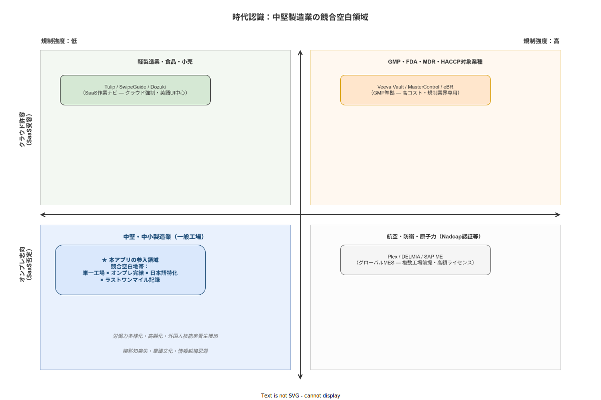

# 01 時代認識と経営環境

本章の責務は、本システムが生まれるべき時代的・経営的背景を確定することである。Why ⑤（時代認識・経営環境）を担う本章は、「なぜ今この問題を解決しなければならないか」を記述する。感覚的な危機感を述べるのではなく、人口動態・学術知見・市場データ・産業構造に根ざした客観的な時代認識を宣言することが本章の目的である。本章が確定した時代認識はシステム化計画書の02章（対象範囲とビジネス目標）が受け取り、具体的なビジネス目標に変換する。

---

## 1. 製造業の人口動態と労働力多様化

### 1.1 高齢化と大量退職の構造

日本の製造業は、人口動態上の不可逆的な転換点に差し掛かっている。団塊ジュニア世代（1971〜1974年生まれ、約200万人規模）は2030年代前半に順次60歳を迎え、日本の製造業における第二の大量退職波が到来する。第一波（団塊世代の2007年前後の退職）が「2007年問題」として認識されたように、第二波は「2030年代問題」として製造現場の技能継承と人員確保の両面に深刻な影響を与える。

厚生労働省「令和5年高齢者雇用の現状」によれば、製造業における60歳以上の雇用者割合は年々増加しており、大手自動車・電子機器メーカーでも60代の生産ライン配置が常態化しつつある（業界分析 37章）。高年齢者雇用安定法の2020年改正（2021年4月施行）により70歳までの就業機会確保の努力義務が新設されたことは、高齢作業員の現場残留をさらに促進する。

Salthouse（1996）の Processing Speed Theory が示すように、加齢に伴い認知処理速度・動体反応速度・注意分割能力が低下する。これは製造現場における作業指示の読み取り速度・エラー検知・複数ステップの同時処理に直接影響する。一方、経験に裏打ちされた「結晶性知能」は維持または向上するため、高齢作業員は流動性能力の低下を経験的補償によって部分的に相殺している。

この実態が構想に与える示唆は明確である。作業指示の設計は若年・中年作業員を標準とするのではなく、60代の作業員が疲労した夜勤時でも誤解なく理解できることを基準とすることを構想の前提として確定する。

### 1.2 外国人労働力の拡大と制度変化

厚生労働省のデータによれば、2023年10月末時点で日本の外国人労働者は約204万人に達し、うち約45万人（全体の約22%）が製造業に従事する（業界分析 34章）。主要国籍はベトナム（約51万人・全体最多）、中国（約39万人）、フィリピン（約22万人）、ブラジル（約13万人）の順であり、製造業集積地（愛知・静岡・群馬・三重・埼玉）では工場内の事実上の作業言語が「やさしい日本語＋複数外国語の混合」となっている事例が珍しくない。

技能実習制度から「育成就労制度」（2024年入管法改正、2027年移行予定）への転換は、労働者の転籍要件緩和を含む構造変化をもたらす。この変化は製造現場における外国人労働者の国籍・日本語習熟度・職場滞在期間の多様化を一層進める。特定技能1号の日本語能力要件（JLPT N4相当）を満たさない状態で現場配属されるケースが依然として存在し、来日直後のN5水準（ひらがな・カタカナの基礎のみ）の作業員が手順書を読む状況は継続する（業界分析 34章）。

Sweller（1988）の認知負荷理論は、外国語（日本語）の文字を解読する認知的努力を「外在的認知負荷（Extraneous Load）」として定義し、これが作業パフォーマンスに悪影響を与えることを示している。テキスト情報を最小化しピクトグラムと動画を活用する設計は、認知負荷の観点から理論的に正当化される。

### 1.3 シフト勤務・夜勤・疲労の複合リスク

Folkard & Tucker（2003）のメタ分析は、夜勤作業者の事故相対リスクが昼勤比で1.3〜1.8倍であることを示す。Lamond & Dawson（1999）の疲労モデルでは、17〜19時間の覚醒状態が血中アルコール濃度0.05%相当のパフォーマンス低下をもたらす。深夜0:00〜6:00の帯域と連続夜勤3日目以降はエラーリスクが特に高い（業界分析 37章）。

三交代制・二交代制が広く採用される製造業において、同一の作業員が早番・日勤・夜勤を輪番で担当する。このとき、昼勤時に問題なく読み取れる作業手順書が、夜勤の疲労下では認知的に処理困難になる。作業指示設計は「最もコンディションが低い状態の作業員」を基準として評価されなければならない。

### 1.4 多言語・低識字リスクとユニバーサルUI設計の必然性

「やさしい日本語」は弘前大学の佐藤和之ら（1998）が体系化した平易化アプローチであり、「短い文・一文一情報・難しい言葉を避ける・漢字にふりがな・重要情報を先に」という8原則を持つ。製造現場での作業指示への適用は、外国人のみならず高齢作業員・読字困難者にも恩恵をもたらすインクルーシブ設計として位置づけられる（業界分析 34章）。

ISO 7010「安全標識」国際標準ピクトグラムは、ハザード警告・禁止・必須行動を言語に依存せず表現する。これらを作業指示に統合することは、多言語環境での情報伝達精度を高める実証的手段である。ただし、Tijus ら（2007）が示すようにピクトグラムが「普遍的」でないことも事実であり、対象となる外国籍労働者の文化的背景を踏まえた理解度検証が必要である。

---

**本節で確定した方針**
- 本システムの作業指示設計は、60代高齢者・夜勤疲労状態・日本語N5相当の外国人労働者を基準とするユニバーサルUI設計を採用することを確定する。
- 多言語・高齢化・夜勤疲労という三重の制約を設計上の前提として位置づけることを確定する。
- ピクトグラム（ISO 7010）・やさしい日本語・認知負荷最小化の三つを作業指示設計思想の柱として確定する。

---

## 2. 暗黙知喪失の構造

### 2.1 熟練退職の不可逆性

Michael Polanyi は *The Tacit Dimension*（1966）において「われわれは語れる以上のことを知っている（We can know more than we can tell）」と述べた。熟練作業員が長年の実践を通じて体得した「感覚的判断」—— 加工音による機械異常の検知・締め付け時のトルク感・外観検査の目利き —— は、この命題が示す「形式化不能な身体知」の典型である。

Dreyfus & Dreyfus（1986）の5段階モデル（初心者→上達者→一人前→熟達者→達人）において、最上位の「達人（Expert）」は「状況と行動が一体化し、なぜそうするかを言語化できない」段階として定義される。熟練退職によって失われるのはこの達人レベルの知識であり、その喪失は不可逆的である。達人が退職した後、同等の知識を再生成するには数年から十数年の実践が必要となる。

### 2.2 口伝え依存の断絶リスク

野中郁次郎・竹内弘高は *The Knowledge-Creating Company*（1995）において、組織的知識創造を暗黙知と形式知の相互変換として記述した SECI モデルを提唱した。4つのモード（共同化・表出化・連結化・内面化）のうち、製造現場で最も広く依存されているのは「共同化（Socialization）：暗黙知から暗黙知への変換」、すなわち同一空間での観察・模倣・共同作業による技能継承である。

この共同化依存の脆弱性は、口伝えの継承が「場の共有」を前提とすることにある。三交代勤務の製造現場では、熟練者と後継者が同一シフトで継続的に作業する機会が構造的に制約される。夜勤専従の熟練者が昼勤の後継者に技術を伝える機会は断片的にならざるを得ない。SECI モデルの「表出化（Externalization）：暗黙知を形式知に変換する」ステップが製造現場で機能しない最大の理由は、熟練者が「表出化を強制されることなく退職する」という組織的失敗にある。

### 2.3 Procedural Drift（手順の実質的な漂流）

Hollnagel（2014）の Safety-II 論が示す Work-as-Imagined（WAI）と Work-as-Done（WAD）の概念は、手順書が想定する作業と実際に行われる作業の乖離を体系的に記述する。製造現場では手順書作成後の更新放置により、WAI と WAD の乖離が年々拡大する「Procedural Drift（手順の実質的な漂流）」が進行する。

現場作業員は「手順書通りではうまくいかない」という経験を積み重ねる過程で、手順書への不信を形成し、実際の WAD を口頭で後継者に伝える。この連鎖が「新人への誤伝達（WAD が正式な手順として口頭伝達される）」を生み、WAI がますます現実から乖離する。

Carroll（1990）の Minimalist Design は「マニュアルを読まない人間の認知特性」を前提とした設計論であり、「行動志向・エラーを学習機会に・最小化・足場」の4原則を提唱する。このモデルは手順書が読まれない理由を「設計の失敗」として帰責し、文書設計の改善によって遵守率を高める道を示す。

---

**本節で確定した方針**
- 熟練技能者の退職による暗黙知喪失は不可逆的な構造課題として認識し、本システムは表出化支援（形式知化の補助）を設計目標の一つとすることを確定する。
- Procedural Drift への対応として、手順書と実際の作業記録の乖離を可視化する仕組みを本システムの構造に組み込むことを確定する。
- SECI モデルの表出化ステップを組織的に支援する「記録が形式知化の素材になる」という設計思想を採用することを確定する。

---

## 3. SaaS否定環境としての中堅製造業

### 3.1 情報越境リスクと社外クラウド忌避

製造業における社外クラウドへの機密情報保管への忌避は、単純な保守性ではなく、具体的な契約・法的根拠に基づく構造的制約である。顧客（完成車メーカー・大手電機メーカー等）から課されるQMS要求や秘密保持契約（NDA）が、製品仕様・製造レシピ・生産実績・品質記録の社外保管を事実上禁止するケースが自動車Tier2/3・電子部品メーカーを中心に広く存在する（業界分析 30章）。

IPA（2021）の制御システムセキュリティ分析が示すように、Near-Field Connectivity（工場内LAN）のみで運用する「エアギャップ工場」要件は、日本の製造業の相当部分に根強く存在する。2022年のAWS東京リージョン大規模障害がSaaSを工場基幹として利用する製造業に具体的な損失をもたらした事実は、BCP の観点からもオンプレ型の優位性を示す実例として機能している（業界分析 29章）。

### 3.2 稟議文化・CAPEX選好の構造

日本会計基準においてSaaS利用料は全額OPEX計上となるが、自社開発・オンプレ構築は製造段階以降をCAPEX（資産計上）として処理できる（業界分析 30章）。年度予算制度の下で「CAPEX予算は確保されているがOPEX（年額ライセンス）は認められない」という調達制約が製造業に構造的に存在し、SaaS製品よりも一括購入型オンプレ製品が選好されるメカニズムが機能している。

稟議決裁プロセスは金額規模・部門横断性に応じた多層承認を要する。1,000万円超のITシステム投資では課長→部長→事業部長→役員→取締役会の5〜8段階の承認が求められることがあり（業界分析 30章）、年度をまたぐプロジェクトの分割処理や3月末の駆け込み発注という非効率が生まれる。この構造はアジャイル開発・月次課金のSaaSと根本的に相性が悪い。

### 3.3 SI重層構造とベンダーロックリスク

日本のSI産業の重層構造（プライムSI → サブSI → 現場）は製造業IT調達のコスト増・品質不透明性・ベンダーロックリスクを生む（業界分析 30章）。プライムSIerのプロジェクト利益率は15〜25%とされるが、開発工数の60〜80%を外部委託することにより、最終ユーザーが負担するコストと実際の開発品質の乖離が構造化する。

Panorama Consulting（2022）は製造業IT投資プロジェクトの54%が予算超過、68%が期間超過を記録すると報告している。この統計は中堅・中小製造業がSIer経由の大規模MES導入を回避し、より軽量な選択肢を求める合理的根拠を提供する。

---

**本節で確定した方針**
- 本システムは社内オンプレ・社内LAN完結を設計の絶対的前提とすることを確定する。
- Docker Compose（API + PostgreSQL）による単一ホスト展開モデルを採用し、社外クラウド依存を構造から排除することを確定する。
- CAPEX一括購入に対応する価格・提供モデルを計画書で検討対象とすることを確定する。

---

## 4. 競合不在領域

### 4.1 グローバルMESの到達限界

グローバルMES（Plex/DELMIA Apriso/Opcenter/SAP ME）は100名以上の製造業・複数工場前提・ライセンスコスト高という特性を持ち、中堅・中小単一工場への適用は現実的でない（業界分析 29章）。Dassault Systèmes DELMIA Apriso は導入期間が18〜36ヶ月に及ぶケースが多く（Gartner, 2022）、SAP ME/DMCはSAP ERPを基幹に据える大手製造業向けである。Plex MESはSaaSのみのデリバリモデルであり、社内LAN専用の工場環境に対応しない。

ISA-95/88準拠の軽量MESという選択肢は市場に実質的に存在しない。ISA-95レベル3全域をカバーしようとするグローバルMES製品と、作業手順管理・トレサビ記録に機能を絞った「ラストワンマイル記録システム」の間には、製品設計上の大きな空白が存在する。

### 4.2 SaaS作業ナビの到達限界

SaaS作業ナビ（Tulip/Augmentir/SwipeGuide/Dozuki）はクラウド強制・社内LANに不適・英語UI中心という特性を持つ（業界分析 29章）。Tulipはノーコードの柔軟性を持ちながら、SaaSのみのデリバリモデルが日本製造業の社内LAN要件と根本的に相容れない。Augmentirはインターネット接続を前提とするクラウドサービスであり、エアギャップ工場での利用は対象外と判断する。SwipeGuideは多言語対応（60言語以上）の強みを持つが、データ主権と社内ポリシー適合の観点から社内LAN専用環境には対応しない。

### 4.3 eBRの到達限界

eBR（Veeva Vault/MasterControl）はGMP規制業界専用・価格体系が中小製造業に届かないという特性を持つ。Veeva Vault MESは製薬大手・CRO・CMOを主要顧客とし、21 CFR Part 11 / EU GMP Annex 11適合をネイティブ機能として実装する一方、バリデーションコストを含むTCOは中小製造業が負担できる水準ではない（業界分析 29章）。

### 4.4 本アプリの参入余地

以上の競合分析から、以下のセグメントに競合真空地帯が存在することが確定できる。

| セグメント条件 | 競合製品の到達状況 | 本システムの参入余地 |
|---|---|---|
| 中堅・中小製造業（従業員数十〜数百名） | グローバルMES：過大機能・高価格で到達不能 | 軽量・低コストで対応する |
| 単一工場・単一拠点 | グローバルMES：複数拠点前提の設計 | 単一工場に最適化した設計 |
| 社内LAN完結・クラウド禁止 | SaaS作業ナビ：クラウド強制で対応不能 | オンプレ・社内LAN完結で対応する |
| 日本語特化・多言語対応 | 英語中心SaaS：日本語UI品質の問題 | 日本語ファーストで設計する |
| ラストワンマイル記録 | MES全域カバーが前提・PLC連携必須 | 記録と手順ナビに機能を絞る |

中堅・中小×単一工場×オンプレ強制×日本語特化×ラストワンマイル記録というセグメントの交差領域に、競合真空地帯が構造的に存在することを時代認識として確定する。

**図 1: 時代認識と中堅製造業空白領域**

> 原本: [`img/fig_era_context.drawio`](img/fig_era_context.drawio)

---

**本節で確定した方針**
- グローバルMES・SaaS作業ナビ・eBRのいずれも到達できない「中堅・中小×単一工場×オンプレ強制×日本語特化×ラストワンマイル記録」セグメントを本システムの参入余地として確定する。
- 本システムはISA-95レベル3全域ではなく「作業ナビゲーション×トレサビ記録」に機能を絞った軽量実装として位置づけることを確定する。
- PLC / OPC-UA 等の OT レイヤ直結（PLC 制御・センサ直結）は永続的にスコープ外とすることを確定する（IT/OT 境界の意図的保護）。
- ERP / MES / 生産管理パッケージ等の IT レイヤとの論理連携は、子機モードとして ver1.0.0 から提供する（詳細は 12 章および計画 12 章）。
- 生産計画そのものの算出は親機（基幹システム）の責務であり、子機（本アプリ）は計画情報の受信と作業実績の送信に徹することを確定する。

---

## 5. デジタル化遅延の三層構造

### 5.1 第一層：経営判断のバリア

中小製造業においてIT投資は「費用（コスト）」として認識され、ROI根拠のない投資判断が構造的に困難である。経済産業省「DXレポート：ITシステム『2025年の崖』の克服とDXの本格的な展開」（2018）が指摘した「経営者のIT戦略の欠如」という課題は、2020年代においても中小製造業では解消されていない。IDC Japan（2022）のデータでは、国内製造業のIT投資/売上高比率は平均1.2%程度であり、米国製造業の2.0〜2.5%を下回る。

この経営判断バリアは行動経済学的なバイアスとも接続している。Kahneman（2011）が示す現状維持バイアス・損失回避傾向は、「現在の紙・Excel運用で特に問題が顕在化していない」と認識している経営者のIT投資躊躇を強化する。「特に問題がない」という認識自体が、問題の非可視化（記録が存在するため品質保証されていると誤認する）に起因している場合が多い。

### 5.2 第二層：IT人材の希薄性

製造現場に常駐するIT担当が1名以下の中小製造業が多数を占める。経済産業省「IT人材白書2022」によれば、国内IT人材の不足数は2030年に約45万人に達する見通しであり、製造業の現場寄りIT人材（OT/IT融合スキル・MESエンジニア・FAソフトウェアエンジニア）は特に不足が深刻である（業界分析 30章）。

Dockerコンテナ技術・Linuxコマンドライン・クラウドインフラ管理に習熟した人材を前提とするシステムは、中小製造業での自立的な運用が困難となる。本システムが選択する技術スタックと展開モデルは、Windowsサーバー管理・ネットワーク基礎を持つ一般的な社内IT担当者が自立的に運用できることを設計の前提条件とする。

### 5.3 第三層：現場ITリテラシーの分散

製造現場の平均年齢の上昇とスマートフォン操作習熟度の世代間格差は、デジタルツール導入時の現場受容性に直接影響する。中小企業白書（2023）によれば、中小製造業のデジタル化において「現場作業の記録・管理」の電子化率は約35%にとどまり、紙ベースの作業日報・検査記録が主流である。この35%という数字は、65%の中小製造業が依然として紙・Excelで現場管理を行っていることを示す。

Aiello & Kolb（1995）の電子的業績監視（EPM）研究は、デジタルツールが「監視ツール」として認識された場合にストレス・職務不満足が増加することを示している。現場受容性を担保するためには、ツールの導入前から「このデータは何に使われるか」を透明に示す組織的コミュニケーションが不可欠である。

---

**本節で確定した方針**
- 経営層・IT担当・現場作業員の三層それぞれに異なるバリアが存在することを認識し、三層すべてを設計上の制約として扱うことを確定する。
- 本システムの運用は一般的な社内IT担当者（Docker・Linux習熟不要）が自立的に行えることを設計の前提とすることを確定する。
- 現場受容性の確保のためにデータ利用目的の透明性を設計段階から組み込むことを確定する。

---

## 参照業界分析

### 必須

- [`90_業界分析/29_競合製品と作業ナビ・MES・eBR市場.md`](../../90_業界分析/29_競合製品と作業ナビ・MES・eBR市場.md) — グローバルMES・SaaS作業ナビ・eBRの市場構造と本アプリの参入余地分析の根拠
- [`90_業界分析/30_国内製造業IT調達慣行とSI構造.md`](../../90_業界分析/30_国内製造業IT調達慣行とSI構造.md) — CAPEX選好・稟議文化・SI重層構造・DX人材不足の調達構造分析の根拠
- [`90_業界分析/37_シフト・夜勤・疲労管理と高齢化労働力.md`](../../90_業界分析/37_シフト・夜勤・疲労管理と高齢化労働力.md) — Knauth (1993) の最適シフト設計原則・Salthouse (1996) のProcessing Speed Theory・疲労とアルコール等価モデル（Lamond & Dawson, 1999）の根拠
- [`90_業界分析/34_多言語化・外国人労働者と読み書き能力差.md`](../../90_業界分析/34_多言語化・外国人労働者と読み書き能力差.md) — やさしい日本語（佐藤, 1998）・ISO 7010ピクトグラム・認知負荷理論（Sweller, 1988）・多言語化の実態分析の根拠

### 関連

- [`90_業界分析/07_スマートファクトリーと作業のデジタル化.md`](../../90_業界分析/07_スマートファクトリーと作業のデジタル化.md) — スマートファクトリー化投資の意思決定構造と政策的文脈
- [`90_業界分析/17_サプライチェーンと作業依存性.md`](../../90_業界分析/17_サプライチェーンと作業依存性.md) — Tier2/3サプライヤーの品質要求とシステム選択に関わる構造的依存関係
