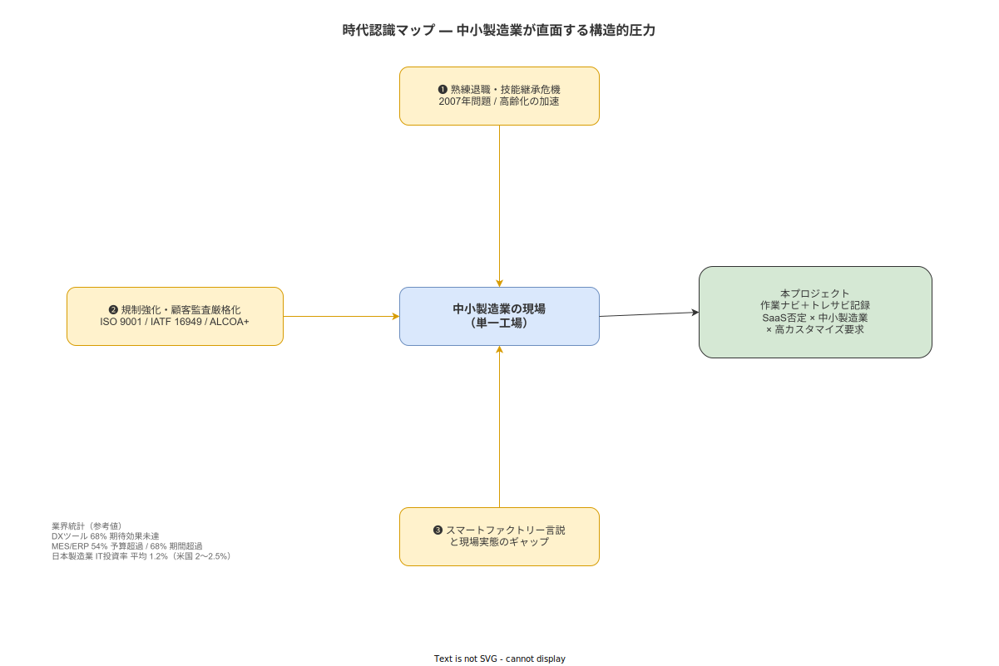

**主読者**: 経営層・調達担当  
**想定所要時間**: 25分

---

## 1.1 本構想が最初に認める不都合な事実

本構想を読み始める前に、業界の失敗統計を直視してほしい。

製造業のITプロジェクトは、期待された効果を達成できないことが多い。楽観的な提案書ではなく、まずその現実を示す。

| 統計 | 数値 | 出典 |
|---|---|---|
| 製造業IT投資プロジェクトの**期待効果未達率** | **68%** | Panorama Consulting, 2022 |
| MES/ERPプロジェクトの**予算超過率** | **54%** | Panorama Consulting, 2022 |
| MES/ERPプロジェクトの**期間超過率** | **68%** | PricewaterhouseCoopers, 2019 |
| 日本製造業のIT投資/売上高比率 | **平均1.2%**（米国2.0〜2.5%を下回る） | IDC Japan, 2022 |
| 国内製造業IT調達プロセスの所要期間 | **18〜48ヶ月** | （[`90_業界分析/30_国内製造業IT調達慣行とSI構造.md`](../../90_業界分析/30_国内製造業IT調達慣行とSI構造.md) 参照） |

調達に18〜48ヶ月を費やすあいだに、選定時点の技術仕様は陳腐化する。これは日本の中小製造業が構造的に抱える「始まれない」問題の一側面である。

**本プロジェクトはこれらの統計のリストに加わらないために何を設計したか。**

この問いが、以降のすべてのセクションを貫く軸である。本構想は「楽観的なデジタル化の約束」ではなく、「なぜ失敗するかの理解に基づいた設計上の選択」を提示するものである。

> **本節で確定した方針**
> 1. 本構想はITプロジェクト68%未達・MES54%予算超過という業界統計を冒頭で開示し、楽観的な約束をしない立場を宣言した。
> 2. 中小製造業が直面する三重圧力（技能継承危機・規制強化・スマートファクトリーと現実のギャップ）を本プロジェクトの外部背景として位置づけた。
> 3. 本プロジェクトが「ラストワンマイル記録」に特化するのは、上記三重圧力への現実的な応答であることを確認した。

---

## 1.2 中小製造業が直面する三重の構造的圧力

業界統計が示す「失敗の多さ」には、中小製造業が置かれている固有の構造的背景がある。単に「IT化が遅れている」という話ではなく、以下の三つの圧力が同時に現場に作用している。

### 圧力1: 熟練退職と技能継承の危機

日本の製造業は2007年問題以降、団塊世代の大量退職が継続している。この構造変化は現在も進行中であり、終わっていない。

熟練者の「カンとコツ」は長年にわたり口頭指導とOJTによって継承されてきた。しかしその伝達手段は継承者が「同じ現場に長く留まること」を前提としており、退職・異動・人員削減が重なる現代の現場条件に耐えられない。

新人が習熟するまでの期間に、**標準化された手順の電子化がなければ品質のばらつきが拡大する**。これは個人の能力の問題ではなく、制度設計の問題である。

（[`90_業界分析/05_暗黙知と技能伝承.md`](../../90_業界分析/05_暗黙知と技能伝承.md) 参照）

### 圧力2: 規制強化と顧客監査の厳格化

規制環境は過去10年で確実に厳しくなっている。

- **ISO 9001:2015** 改訂により「リスクベース思考」が強化され、記録要件が精緻化された
- **IATF 16949**（自動車）、**HACCP**（食品）、**ALCOA+**（医薬・医療）など、業界固有の規制が相次いで改訂されている
- 顧客からのトレーサビリティ証明要求が増加し、「証跡の電子化」が取引継続条件になりつつある

紙記録では、監査証跡の提示に数日を要する。この数日間が顧客の信頼を損なうリスクとして顕在化している。

（[`90_業界分析/22_規制別トレーサビリティ要件詳論.md`](../../90_業界分析/22_規制別トレーサビリティ要件詳論.md) 参照）

### 圧力3: スマートファクトリー言説と現場実態のギャップ

Industry 4.0やスマートファクトリーの言説は「すべての設備がつながる未来」を約束してきた。しかし2024年時点でも、中小製造業の多くは**紙帳票と属人的運用が主流**である。

グローバルMES製品（Tulip、Plex、Apriso等）はSaaSを中心とした設計であり、社内LAN環境でのオフライン運用には対応していない。また、ライセンス体系・サポート構造・日本語対応のいずれも、日本の中小製造業の調達実態とかみ合っていない。

言説と現場のギャップが大きいほど、「何も変えられない」という現場の閉塞感が強化される。

（[`90_業界分析/07_スマートファクトリーと作業のデジタル化.md`](../../90_業界分析/07_スマートファクトリーと作業のデジタル化.md) 参照）

> **本節で確定した方針**
> 1. 三重圧力（技能継承危機・規制強化・スマートファクトリー言説と現実のギャップ）を本プロジェクトの外部背景として確認した。
> 2. これらの圧力はいずれも、現場個人の努力では解消できない制度・構造の問題である。
> 3. 本プロジェクトの設計はこの三重圧力への応答として位置づけられる。

---

## 1.3 国内IT調達構造が生む「始まれない」状況

三重圧力を認識しながらも、多くの中小製造業がシステム導入に踏み切れないのには、調達構造上の合理的な理由がある。

**SI重層構造と年度予算サイクル**が、小規模・短期・段階的な投資を難しくしている。元請けSIer・二次請け・三次請けという多重構造のなかでは、小さな改善を素早く試みるコスト構造にならない。

**稟議多段・RFP作成**だけで数ヶ月を費やすプロセスも常態化している。「何を作るか」を決めるための時間が、「作ることで何が変わるか」を試す機会を奪っている。

**CAPEX一括購入方式**の方が年度予算の管理と整合しやすいという現実もある。SaaSのOPEX課金は月々の支出が明確になる一方、年度予算の「使い切り」文化とは相性が悪い。

**補助金制度**（ものづくり補助金・IT導入補助金）は追い風になるが、申請書類の作成コスト・採択の不確実性・支給タイミングのずれが、計画の立てにくさを増している。

これらの制約を正直に認識した上で、本プロジェクトは次の設計思想を選んでいる。

- **Docker Compose単体インストール**: 外部SaaSへの依存を排除し、社内サーバー1台で完結させる
- **PoC 3ヶ月**: 大規模稟議の前に小さく試し、判断材料を積み上げる

（[`90_業界分析/30_国内製造業IT調達慣行とSI構造.md`](../../90_業界分析/30_国内製造業IT調達慣行とSI構造.md) 参照）

> **本節で確定した方針**
> 1. 国内IT調達構造（SI重層・年度予算・稟議多段）が段階的投資を妨げていることを、本プロジェクトの設計上の制約として明示した。
> 2. Docker Compose単体インストールとPoC 3ヶ月という設計思想は、この調達制約への現実的な応答である。
> 3. 補助金制度の活用は可能性として認識するが、申請コストを無視した計画は立てない。

---

## 1.4 本構想が「今・ここ」に向き合う理由

三重の構造的圧力と調達構造上の制約を並べると、「だからこそ何もできない」という結論に至りそうである。本構想はその逆を言う。

**対象を絞り込むことで、解ける問いにする。**

本プロジェクトが対象とするのは、「**IT予算規模が限られる中小製造業の単一工場**」というピンポイントの文脈である。全工場・全プロセス・全社的な変革を狙っていない。

本プロジェクトが狙うのは**ラストワンマイル記録**である。MESの全機能を代替するのではなく、「**作業と同時に記録を残す**」という一点に絞る。作業員が作業しながらタブレットで完了確認し、写真と測定値が自動的に証跡に残る。その記録が後から追跡可能な状態になる。

この一点を確実に実現することが、三重圧力への誠実な応答である。

**解決しないことを明示する。**

以下は本プロジェクトのスコープ外と判断する:

- **PLC連携・設備自動化**: センサー・PLCからのリアルタイムデータ収集
- **生産計画・スケジューリング**: 需要予測・生産能力の最適割付
- **AI予測・機械学習**: 故障予知・品質予測モデルの構築

これらを「将来の拡張として検討する」とも言わない。現時点での判断として対象外と判断する。

> **本節で確定した方針**
> 1. 本プロジェクトの対象は「中小製造業の単一工場におけるラストワンマイル記録」に絞り込む。
> 2. PLC連携・生産計画・AI予測は現時点で対象外と判断する。
> 3. 「解決しないことの明示」は楽観的な約束をしないという本構想の立場と整合する。
