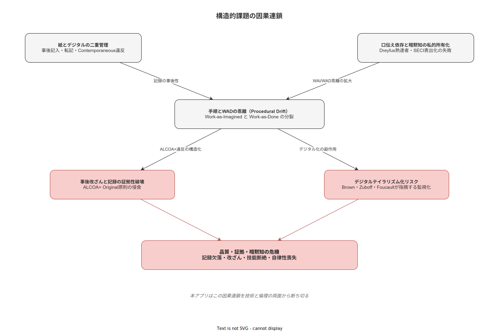

# 02 構造的課題の特定

本章の責務は、本システムが解決すべき構造的課題を確定することである。Why ①（解決すべき課題）を担う本章は、「何が問題であり、なぜその問題が解決不能なまま残存しているか」を記述する。感覚的な問題意識を列挙するのではなく、学術理論・業界研究・実務的観察に裏打ちされた課題の構造分析を宣言することが本章の目的である。本章が確定した課題はシステム化計画書の03章（機能スコープ）・04章（ユースケース）が受け取り、具体的な機能要件として展開する。

---

## 1. 紙とデジタルの二重管理

### 1.1 現状の構造

中小製造業の多くにおいて、作業管理は以下の二層構造で運用されている。手順書はPDFまたは印刷された紙として配布される。作業記録はExcelフォームまたは手書き紙帳票で収集され、その後担当者がまとめてシステムまたはExcelに再入力する。この二層構造は「記録の二重管理コスト」と「記録の事後性」という二つの根本的問題を生む。

記録の二重管理コストは、記入・転記・ファイリング・検索・監査準備のすべての工程で重複する人手を消費する。手書き記録のExcel転記に要する時間は、工程・製品の複雑さにもよるが、記録作業全体の30〜50%を占めるケースが多い。この転記工数は品質向上に直接貢献しない純粋なコストである。

### 1.2 記録の事後性とALCOA+原則の侵食

より深刻な問題は記録の事後性である。FDA が医薬品・医療機器製造における記録品質の基準として定義した ALCOA+9原則は、製造業一般のトレサビ記録の証拠品質を評価する枠組みとして広く参照される。9原則は Attributable（帰属可能）・Legible（可読性）・Contemporaneous（同時性）・Original（原本性）・Accurate（正確性）・Complete（完全性）・Consistent（一貫性）・Enduring（永続性）・Available（利用可能性）からなる。

紙+Excel運用がいかに各原則を侵食するかを以下に確認する。

| ALCOA+ 原則 | 定義 | 紙+Excel運用での侵食状態 |
|---|---|---|
| Attributable | 誰が・いつ記録したかが明確 | 後からまとめ記入時に「誰が・いつ」が不明確になる |
| Contemporaneous | 作業と同時に記録される | 最大の問題：作業後に一括記入が常態化 |
| Original | 最初に記録されたものが保存される | 訂正前の状態が残らない・訂正印文化で原本が変質する |
| Accurate | 実際の値を正確に記録 | 事後記入では記憶の誤りや記入者の意図的改変が入る余地がある |
| Complete | 必要な記録が漏れなくある | 不都合な工程データの物理的欠落リスク |
| Enduring | 記録が永続的に保存される | 紙の劣化・水損・紛失リスク |
| Available | 必要なときに取り出せる | Excelファイルの散在・ファイリング誤りによる検索不能 |

Contemporaneous（同時性）の侵食は特に深刻である。実際の作業時刻と記録時刻が一致しない状態では、「作業後にまとめて記入」という慣行により、記録が証拠として機能しなくなる。顧客クレーム対応時に「その時間帯に誰が何をしていたか」の証明が不可能となり、内部監査での指摘、製品リコール時の責任帰属問題に発展する。

### 1.3 Reason のスイスチーズモデルにおける一穴

Reason（1997）のスイスチーズモデルは、複数の防御層の穴が偶然に一直線に並んだとき事故・問題が発生するという組織事故モデルである。製造品質管理の文脈でこのモデルを適用すると、記録の事後性は「品質記録という防御層に設けられた穴」として機能する。設計ミス・材料不良・工程条件の逸脱という他の穴が重なったとき、記録の事後性という穴は問題の発見を遅らせ、原因追跡を不可能にする。

「記録がある＝品質が保証された」という誤謬はこの構造から生まれる。記録の形式的存在（帳票が埋まっている・Excelに数値が入力されている）が品質保証の完了と誤認される状況は、「スイスチーズの防御層があるように見えて実は穴だらけ」という状態に対応する。

---

**本節で確定した方針**
- 紙とデジタルの二重管理が生む記録の事後性をALCOA+Contemporaneous原則の侵食として課題に確定する。
- 記録の同時性（作業と記録の一体化）を本システムが解決すべき最重要技術課題として確定する。
- 「記録がある＝品質保証済み」という誤謬を解体し、証拠品質の高い記録を実現することを設計目標として確定する。

---

## 2. 口伝え依存と知識の私的所有化

### 2.1 暗黙知の本質：Polyaniの命題から

Michael Polanyi の命題「われわれは語れる以上のことを知っている（We can know more than we can tell）」（*The Tacit Dimension*, 1966）は、製造現場の技能継承問題の核心を言い当てる。熟練作業員が「感覚でわかる」と表現する知識の多くは、Polanyi が定義する補助的認識（subsidiary awareness）として体化されており、焦点的認識（focal awareness）への変換が困難である。研削加工の仕上がり音・射出成形時の樹脂の流れ感・溶接ビードの形状から推測する溶接条件の適否は、いずれも熟達者が意識せず処理している身体知である。

Dreyfus & Dreyfus（1986）の5段階モデルは、達人（Expert）レベルが「状況と行動が一体化し、なぜそうするかが言語化困難」な段階であることを示す。達人は手順を「意識せず」実行するため、手順書作成自体が認知的に困難である。「ベテランほど手順書が書けない」という現場でよく観察される現象は、この理論的予測と整合する。

### 2.2 SECI モデルの「表出化」失敗

野中・竹内の SECI モデル（1995）において、製造現場の技能継承が最も依存するのは「共同化（Socialization）：暗黙知から暗黙知への変換」である。OJTによる観察・模倣・共同作業がその主要な手段となる。しかし共同化には「場の共有」が不可欠であり、三交代勤務・多能工化・人員削減による現場の時間的・空間的分断が共同化の機会を構造的に縮小させる。

表出化（Externalization）ステップの失敗が最大の問題である。熟練者が「表出化を強制されることなく退職する」という組織的失敗は、Gourlay（2006）が指摘するように SECI モデルの「表出化によって暗黙知が形式知に完全変換される」という前提自体の困難を示している。Polanyi の原典に従えば、暗黙知は形式知に「完全変換」されるのではなく、「形式的なヒントを通じて別の実践者の暗黙知と共鳴する」に過ぎない。この認識は、本システムが「記録をとれば知識が保存される」という単純な期待を持ってはならないことを示している。

### 2.3 知識の私的所有化とヒューマンSPOF

特定の作業員が「自分だけ知っている方法」を保有し、組織がその作業員に依存する状態を「知識の私的所有化」と呼ぶ。Collins, Brown & Newman（1989）の認知的徒弟制が示すように、本来は教示の対象となるべき知識が徒弟制的な継承機会の欠如により個人に封じ込められる。この状態はシステム工学における SPOF（Single Point of Failure：単一障害点）と等価であり、その作業員の休職・退職・異動が即座に業務継続リスクに転化する。

技能継承のコストは OJT による習熟に数ヶ月から数年を要するという時間的長さにあるだけでなく、その期間中の品質リスク（習熟途上の作業員による品質のばらつき）として顕在化する。作業記録が体系的に存在しない環境では、新人が「実際にどのように行われているか（WAD）」を観察する機会が制約され、手順書（WAI）と実際の作業の乖離を自力で発見することが困難となる。

---

**本節で確定した方針**
- 熟練技能者による知識の私的所有化（ヒューマンSPOF）を組織リスクとして課題に確定する。
- 本システムは記録を「形式知化の素材」として機能させる設計を採用し、WADの観察可能性を高めることを課題解決の方向として確定する。
- 暗黙知の完全形式化は原理的に不可能という前提を設計に組み込み、「共鳴を促す記録」を目標とすることを確定する。

---

## 3. 手順とWADの乖離

### 3.1 Work-as-Imagined と Work-as-Done の概念

Hollnagel（2014）の Safety-II 論は、Work-as-Imagined（WAI：手順書が想定する作業）と Work-as-Done（WAD：実際に行われている作業）の概念を体系化した。製造現場の作業員は、WAI と WAD の乖離を日常的にアドホックに調整している。この適応的調整は多くの場合、品質と安全を支える実践的知恵として機能している。しかし従来の品質管理アプローチはこれを「手順逸脱」として帰責し、規律強化で対応しようとする。

Rasmussen（1983）の SRK モデルが示すように、熟練作業員はスキルベース行動（高度に習熟した自動化された動作）として作業を実行しており、手順書を都度参照するルールベース行動は行っていない。手順書との照合が意識的に行われないことは認知的に自然な状態であり、「なぜ手順書を見なかったのか」という帰責では改善しない。

### 3.2 Procedural Drift の蓄積メカニズム

手順書作成後の更新放置により、WAI と WAD の乖離が年々拡大する「Procedural Drift」が進行する。このメカニズムは以下の連鎖で進む。

| フェーズ | 状態 | 帰結 |
|---|---|---|
| 手順書作成時 | WAI ≈ WAD（乖離小） | 手順書の信頼性が高い |
| 技術改善後（更新されない） | WAI < WAD（WADが実態に近い） | 現場は「手順書通りではうまくいかない」を経験する |
| 経験の蓄積後 | WAD が暗黙のスタンダードとなる | 手順書への不信が形成され参照されなくなる |
| 新人配属後 | WAD が口頭で伝達される | WAI がますます孤立化し、書面上の規則と実態が完全分離する |
| 監査時 | 手順書が形式的に参照される | 「監査のための手順書」という二重化が定着する |

Carroll（1990）の Minimalist Design が示す「マニュアルを読まない人間の認知特性」は、この乖離の認知的背景を説明する。手順書が長く・難解で・実際の作業と乖離しているほど、作業員は手順書を「参照に値しない文書」として処理する。WAI の孤立化は手順書の設計品質の失敗でもある。

### 3.3 乖離が生む二次問題

WAI と WAD の乖離は二次的な問題を連鎖的に生む。まず新人への誤伝達が発生する。WAD が口頭で後継者に伝わり、WAI が手順書として更新されない状態では、手順書は実務参照価値を失う一方で形式的権威のみを持つ書類として残存する。次に監査時の説明不整合が生じる。第三者審査機関による監査では、実際の作業（WAD）と手順書（WAI）を両方説明する必要があるが、両者が乖離していれば「実態通りに説明すると手順書と矛盾し、手順書通りに説明すると実態と矛盾する」という状況が発生する。

Reason（1990）のバイオレーション分類における「ルーティン・バイオレーション（毎日の慣行として手順から逸脱する状態）」は、WAD が WAI から恒常的に乖離した状態を指す。これは個人の道徳的問題ではなく、手順書設計と実態管理の組織的失敗として帰責されるべき課題である。

---

**本節で確定した方針**
- WAI（手順書）と WAD（実際の作業）の乖離を「Procedural Drift」として組織的課題に確定する。
- 手順書の更新停滞が乖離を拡大するメカニズムを課題として確定し、記録による実態把握を乖離可視化の手段として位置づけることを確定する。
- WAD を「手順逸脱」として帰責するのではなく「適応的実践の記録」として扱う設計思想を採用することを確定する。

---

## 4. 事後改ざんと記録の証拠性破壊

### 4.1 改ざんの類型

製造現場における記録の「改ざん」は、犯罪的な意図による改ざんのみならず、慣行的・構造的な証拠品質の劣化を含む。改ざんの類型を以下に整理する。

| 改ざんの類型 | 発生メカニズム | ALCOA+への影響 |
|---|---|---|
| 完全な事後記入 | 作業中に記録する時間がなく、作業後に一括入力する | Contemporaneous 原則の完全な消滅 |
| 訂正記録の消滅 | 上書き・消去により訂正前の状態が残らない | Original・Accurate 原則の侵食 |
| 記録の選択的欠落 | 不都合な測定値・工程異常の意図的な未記録 | Complete・Consistent 原則の侵食 |
| 印鑑・訂正印文化 | 誰が・いつ訂正したかの追跡が困難 | Attributable 原則の侵食 |
| 時刻の再現入力 | 手書き記録で「想定される時刻」を後から記入 | Contemporaneous・Accurate 原則の同時侵食 |

「記録がある＝品質が保証された」という誤謬を強化するのは、記録の実態（事後記入・内容の不確かさ）と記録の形式的存在（帳票が埋まっている状態）の外見上の区別不能性にある。監査担当者・品質担当者は記録が「いつ・どのように作成されたか」を帳票面からは確認できない。

### 4.2 証拠品質の崩壊がもたらすリスク

ALCOA+の各原則が侵食された記録は、以下の場面で機能しなくなる。

顧客クレーム対応時の原因追跡不能：特定のロットに不具合が発生した際、製造時の工程条件・測定値・作業者・時刻が確認できなければ、原因を特定することができない。記録の事後性が高い工場では「その時間帯に何が起きたか」の再現が事実上不可能となる。

内部監査での指摘：ISO 9001・IATF 16949・食品安全規格による第三者審査機関の審査では、記録の証拠性が評価される。事後記入の痕跡（記録時刻の集中・手書きの一括記入パターン・訂正の消去）が審査員に発見された場合、指摘事項（Major/Minor NC）となり、認証維持に影響する。

製品リコール時の責任帰属：不具合製品が市場に流出した際、記録の証拠性が製造責任の帰属を決定する重要な証拠となる。証拠品質の低い記録は責任範囲の特定を困難にし、過剰な回収範囲の設定・法的リスクの拡大につながる。

---

**本節で確定した方針**
- 記録の事後性・選択的欠落・訂正記録の消滅を「証拠品質破壊の三形態」として課題に確定する。
- 本システムは作業と記録の時間的同時性を技術的に担保する設計を採用することを確定する。
- 記録の監査証跡（誰が・いつ・何を記録・修正したか）をシステムが自動生成することを設計要件として確定する。

---

## 5. デジタルテイラリズム化リスク

### 5.1 既存デジタル化が生む新たな構造課題

本章が特定するのは「デジタル化以前の課題」だけではない。デジタル化の過程で発生しうる「デジタル化が生む新たな構造課題」もまた、本システムが設計段階で対処すべき重要な課題である。既存のデジタル化ソリューションが「管理ツール」として位置づけられたとき、作業者の行動を詳細に記録・分析するシステムは別種の問題を生む。

Frederick Taylor の科学的管理法（19世紀末）は動作研究と標準化によって作業を「管理可能なデータ」に変換した。Brown, Lauder & Ashton（2011）はこの論理のデジタル技術による復活を「デジタルテイラリズム（Digital Taylorism）」と呼ぶ。Amazon 倉庫システム・ライドシェア評価アルゴリズムに典型的に見られるように、あらゆる労働行為のデータ化・アルゴリズムによるリアルタイム評価・作業者が自分の評価指標にさらされる「透明性の非対称」がその特徴である。

### 5.2 監視資本主義とパノプティコン

Shoshana Zuboff（2019）の監視資本主義論は、行動データの収集が「本来目的（品質管理）」から「行動の予測・修正による価値抽出」へと転化するメカニズムを記述する。製造現場に適用すると、「作業記録のトレサビ目的での収集」が「作業員の行動パターン分析・個人評価・生産性スコアリング」に転用されるリスクを指す。

Michel Foucault（*Surveiller et Punir*, 1975）のパノプティコン論は、常時監視の可能性が被監視者の自己規律を生み出す監視権力の構造を記述する。「誰が・いつ・何秒で完了したか」を記録するシステムが「常に見られている」という意識を作業員に内面化させた場合、本来の目的（品質記録）とは異なる心理的圧力が生まれる。

Aiello & Kolb（1995）の電子的業績監視（EPM）研究は、電子監視を受けた労働者の複雑な認知作業でのパフォーマンス低下とストレス増加を実証している。「監視が常に生産性向上につながらない」という知見は、デジタル化の設計が持つ双刃の性質を示している。

### 5.3 Just Culture の侵食と報告文化の消失

製造品質管理においては「不適合の報告を奨励し、報告に対して罰を与えない」Just Culture の醸成が再発防止の前提条件である。ヒューマンエラーは個人の道徳的失敗ではなくシステムの欠陥として帰責する Safety-II 論（Hollnagel, 2014）の観点からも、報告文化の維持は品質向上の基盤である。

アプリを「管理ツール」として位置づけることの帰結は、「記録すると評価される・記録しないと評価されない」という行動インセンティブの歪みである。作業員が「正直に記録すると評価が下がる」と認識した場合、記録の不正確化（都合のよい数値の入力・不具合の未記録）が生じる。これは当初の目的（証拠品質の高い記録）と正反対の帰結をもたらす。

Foucault のパノプティコン論が示す「常時監視の可能性が行動を変容させる」効果は、記録システムの設計が悪用の意図がなくても心理的安全性を低下させうることを示している。心理的安全性（Edmondson, 1999）が低下した現場では、不安全行動の報告・品質問題の申告・改善提案の提起が抑制される。

### 5.4 構想が担う倫理スタンスの核心

本課題が構想の責務として位置づけられる理由は、倫理スタンスが「後付けの配慮」ではなく「設計思想の核心」でなければならないからである。機能仕様や画面設計が固まった後に「プライバシーに配慮しよう」という後付けの修正では、システムの基本構造に染み込んだデジタルテイラリズム的論理を取り除けない。

本システムの設計思想として確定すべき倫理スタンスは以下の三点である。第一に、データは品質保証とトレサビ目的にのみ使用するという目的限定を設計に組み込む。第二に、個人評価・人事査定への利用を技術的・組織的に排除するデータ分離を実装する。第三に、作業員が「記録は自分を守る証拠になる」と認識できる透明性を、使用前から継続的に確保する。

**図 1: 5 つの構造的課題と相互因果**

> 原本: [`img/fig_problem_structure.drawio`](img/fig_problem_structure.drawio)

---

**本節で確定した方針**
- デジタルテイラリズム化リスクを「デジタル化が生む新たな構造課題」として課題に確定する。
- 本システムはFoucaultのパノプティコン的監視構造を設計から排除し、Just Cultureと心理的安全性の維持を設計要件として確定する。
- 倫理スタンスを後付けではなく設計思想の核心として位置づけることを本章の最重要宣言として確定する。

---

## 6. 基幹システムと作業現場の情報断絶

### 6.1 情報断絶の構造

中堅製造業では、ERP・MES・生産管理パッケージ（以下、基幹システム）が品目マスタ・工程マスタ・生産計画を保有しているケースが相当数ある。一方、作業現場では「何をいつ誰が作ったか」という実績・品質証拠が紙・Excelで管理され、基幹システムと断絶している。この断絶は組織内の二重の情報孤立を生む。基幹システムは計画を持つが現場実績を持たず、現場は実績を持つが計画の最新状態にアクセスできない。

この断絶の構造的帰結は三点に集約される。第一に、実績データが基幹システムへ入力されない（手入力遅延・入力省略）。第二に、基幹システムのマスタ更新が現場に届かない（古い手順書で作業が継続される）。第三に、ロットを跨いだ工程では追跡コストが著しく高くなり、トレサビが実質的に機能しない。

### 6.2 従来の解決策の限界と本アプリの解決方向

フルスペックの MES 統合は中堅製造業には過剰なコストと実装負荷を伴い、現実的な選択肢とならないことが多い。一方、作業ナビアプリを独立して導入するだけでは情報断絶は解消されない。どちらの解決策も、接続の欠如という構造的問題に正面から対処していない。

本アプリは「子機モード」（12章）として、基幹システムからマスタを受信し、作業実績を送り返す仕組みを提供することで、情報断絶を最小コストで解消する。マスタの一元管理は基幹システムに留め、本アプリは現場接点としての実績記録・返送に専念することで、フル MES 統合に相当する情報連携効果を低コストで実現する。

---

**本節で確定した方針**
- 基幹システムと作業現場の情報断絶を、実績遅延・マスタ未伝達・ロット追跡コスト増大の三帰結を持つ構造的課題として確定する。
- 本システムは「子機モード」として基幹システムとの双方向連携を設計に組み込み、情報断絶の解消を機能スコープとして確定する。
- マスタの権威は基幹システムに置き、本アプリは現場実績の記録・返送に専念するという役割分担を設計原則として確定する。

---

## 参照業界分析

### 必須

- [`90_業界分析/05_暗黙知と技能伝承.md`](../../90_業界分析/05_暗黙知と技能伝承.md) — Polanyi の暗黙知論・野中・竹内の SECI モデル・Dreyfus 5段階モデル・認知的徒弟制（Collins, Brown & Newman, 1989）の根拠
- [`90_業界分析/04_ヒューマンエラーと安全工学.md`](../../90_業界分析/04_ヒューマンエラーと安全工学.md) — Reason のスイスチーズモデル・SRK モデル（Rasmussen, 1983）・Safety-II / WAI-WAD 概念（Hollnagel, 2014）の根拠
- [`90_業界分析/25_作業指示書とSOPの構造化・表現論.md`](../../90_業界分析/25_作業指示書とSOPの構造化・表現論.md) — Carroll の Minimalist Design・EPSS（Gery, 1991）・ISO 9001:2015 文書化要求・Procedural Drift への対処論の根拠
- [`90_業界分析/24_作業者プライバシー・データ倫理と労務監視.md`](../../90_業界分析/24_作業者プライバシー・データ倫理と労務監視.md) — Foucault のパノプティコン論・Brown らのデジタルテイラリズム・Zuboff の監視資本主義・Aiello & Kolb（1995）EPM研究・GDPR・個人情報保護法の根拠

### 関連

- [`90_業界分析/06_品質管理とトレーサビリティ.md`](../../90_業界分析/06_品質管理とトレーサビリティ.md) — ISO 9000:2015 トレサビ定義・ALCOA+原則の国際標準的位置づけ
- [`90_業界分析/28_不適合と手順改訂のフィードバックループ.md`](../../90_業界分析/28_不適合と手順改訂のフィードバックループ.md) — 不適合が手順書更新につながるフィードバックループの設計論と Procedural Drift の解消メカニズム
