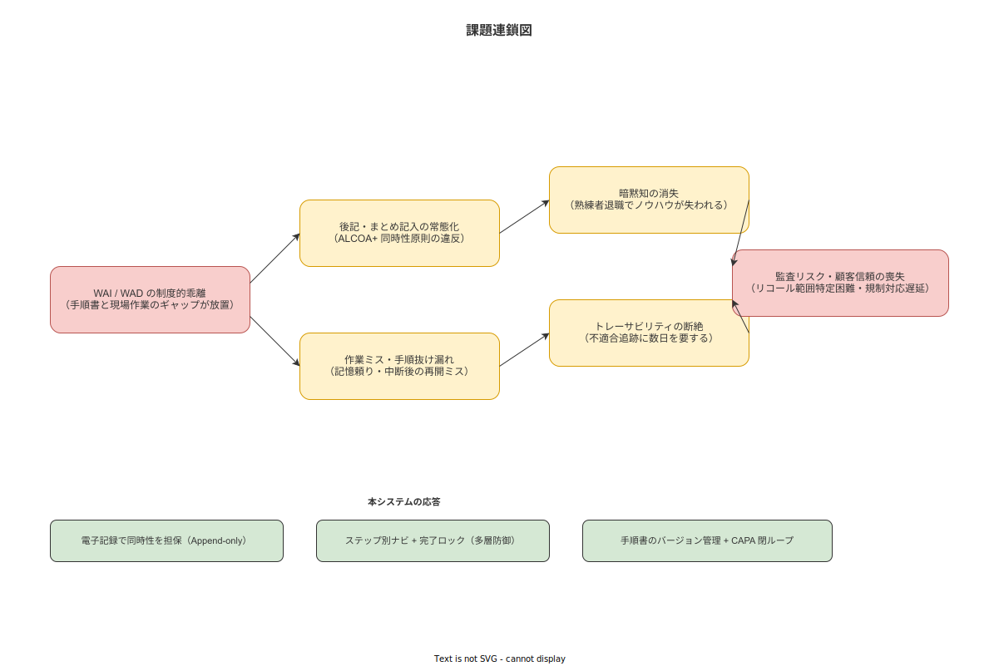

**主読者**: 全員  
**想定所要時間**: 25分

---

## 2.1 現象層：紙×記憶×後記が生む症状

製造現場で日常的に起きている症状を、まず現象として並べる。これらは例外的な出来事ではなく、紙×記憶×後記という運用を続ける限り**制度的に発生し続ける**ものである。

| 症状 | 現場での具体的状況 |
|---|---|
| 作業ミス・抜け漏れ | 手順書が棚にある。確認しながら作業できず記憶頼り。「いつも通り」が通じない初日・異動時に発生しやすい |
| 後記・まとめ記入 | 「あとで紙に書こう」が常態化。実際に何時に何をしたかは不明確になる（ALCOA+ Contemporaneous 原則違反）|
| 暗黙知の消失 | 熟練者の「このくらいの締め付けトルクが正解」という感覚が、退職とともに失われる |
| トレーサビリティの断絶 | 不適合発生時、「誰が・何のロットで・いつ作業したか」の追跡に1〜3日を要し、リコール・リワーク範囲が特定できない |
| 指導コストの高さ | 新人育成が属人的な口頭指導に依存し、指導者によってバラツキが生じる |

重要なのは、これらの症状を「注意力不足の作業員が起こす問題」として扱わないことである。これらは**制度的に放置された構造問題**であり、個人への責任帰属では解決しない。

> **本節で確定した方針**
> 1. 紙×記憶×後記の現場運用は、個人の失敗ではなく制度的に発生する構造問題として位置づける。
> 2. 5つの症状（作業ミス・後記・暗黙知消失・トレーサビリティ断絶・指導コスト）を本システムが向き合う現象層として確認した。
> 3. 「症状への対処」ではなく「症状を生む構造への介入」を設計の起点とする。

---

## 2.2 構造層：Work-as-Imagined と Work-as-Done の制度的乖離

現象の背後にある構造を理解するために、安全工学の概念を使う。

**Work-as-Imagined（WAI）**: 設計者・管理者が手順書に書いた「こう作業すべき姿」  
**Work-as-Done（WAD）**: 現場で実際に行われている作業（Hollnagel, 2015）

WAIとWADは、どの現場でも常に一致しない。現場では次のようなことが日常的に起きる。

- 工具が見当たらないので、別の工具で代用する
- ベテランは手順の順序を変えた方が作業しやすいと経験的に知っている
- 緊急時は手順を省略しなければラインが止まる

これは作業員の「サボり」や「違反」ではなく、現場の現実に対する**適応的問題解決**である。

**Safety-Iアプローチの限界**

WADをWAIに強制的に合致させようとするアプローチ（Safety-I）には限界がある。熟練者の適応的問題解決能力を阻害し、かえってエラーが増えることがある。さらに深刻なのは、「形式的な確認だけして実際には手順を省略する（Rubber Stamping）」という行為を誘発することである。電子チェックリストを導入しただけでは、この問題は解決しない。

**本システムの応答**

本システムはSafety-I（標準手順の提示・完了確認）とSafety-II（作業者がWADの現実をフィードバックできるKaizen Teian）を組み合わせることで、この構造的矛盾に応答する。WAIとWADの乖離を「問題」としてではなく「学習の情報源」として扱う設計である。

（[`90_業界分析/13_安全文化と安全管理システム.md`](../../90_業界分析/13_安全文化と安全管理システム.md) 参照）（[`90_業界分析/19_電子チェックリストと手順遵守の科学.md`](../../90_業界分析/19_電子チェックリストと手順遵守の科学.md) 参照）

> **本節で確定した方針**
> 1. WAI/WADの乖離は設計上の必然であり、Safety-I単独では解消しない。Safety-I/IIの相補設計を採用する。
> 2. Rubber Stampingを防ぐために、写真・測定値等の証跡要求を設計に組み込む。
> 3. Kaizen Teianは「作業員が現場の現実をフィードバックする通路」として、WADの情報を制度的に扱えるようにする。

---

## 2.3 認識論的限界：「記録=品質」誤謬と暗黙知の壁

本システムを過大評価しないために、二つの認識論的限界を明示する。

### 「記録=品質」誤謬

「電子記録を導入すれば品質が上がる」という思い込みは誤りである。

記録はあくまで「対話と学習の媒介」であり、品質の代理指標に過ぎない。Juranの品質管理論が逆証するように、記録が整備されても、工程設計・設備精度・技能レベルが改善されなければ品質は向上しない。

**本システムが提供するのは「何が起きたかを後から確認できる能力」であり、「自動的に品質を向上させる仕組み」ではない。**

この区別を、調達担当・経営層・現場責任者のいずれもが理解した上で導入を判断してほしい。

（[`90_業界分析/06_品質管理とトレーサビリティ.md`](../../90_業界分析/06_品質管理とトレーサビリティ.md) 参照）

### 暗黙知の完全形式知化は不可能

熟練者の「カンとコツ」をすべて電子化・テキスト化できるという前提は誤りである。

Gourlay（2006）はSECIモデルへの批判として「暗黙知は完全には言語化できず、表出化は別の暗黙知への参照ヒントに過ぎない」と指摘している。熟練者が蓄積した感覚・判断・文脈理解は、テキストと画像の記録に完全には収まらない。

**本システムが目指すのは「暗黙知の消失をできる限り遅らせ、形式知化できる部分を着実に記録に残す」ことであり、暗黙知の完全排除ではない。**

（[`90_業界分析/05_暗黙知と技能伝承.md`](../../90_業界分析/05_暗黙知と技能伝承.md) 参照）

> **本節で確定した方針**
> 1. 「記録=品質」誤謬を認識し、本システムは品質の代理指標（記録の整備）を提供するが、品質自体を保証しない。
> 2. 暗黙知の完全形式知化は技術的・理論的に不可能であり（Gourlay 2006）、形式知化できる範囲の着実な記録と継続的改善を目標とする。
> 3. これらの限界は導入前に関係者全員が共有すべき前提であり、本構想はその開示を省略しない。

---

## 2.4 問題の真の所在：個人の失敗ではなくシステムの設計問題

James Reasonのスイスチーズモデルが示すように、事故・不適合は複数の防護層の穴が偶発的に重なることで生じる。

「注意力の足りない作業員が引き起こした」という説明（Person Model）は直感的にわかりやすいが、誤りである。同じ作業員が同じ作業をしても、防護システムの設計が変われば結果は変わる。問題の真の所在は**防護システムの設計**にある（System Model）。

この理解を出発点として、本構想は以下の5層の防護を提案する。

| 層 | 防護の内容 | 役割 |
|---|---|---|
| 層1 | 手順書の提示 | 作業者が正しい手順をその場で確認できる |
| 層2 | 完了確認ロック | 前ステップ未完了では次に進めない |
| 層3 | 写真・測定値の証跡要求 | Rubber Stampingを制度的に防止する |
| 層4 | 不適合報告→CAPAフロー | 逸脱を検出し、是正・予防処置につなぐ |
| 層5 | Kaizen Teian | 作業者が現場の問題をフィードバックし、**現場の知の循環**を生む |

層5のKaizen Teianは、Safety-IIの実装である。WADの現実を管理側が受け取る通路を制度的に確保することで、「改善は上から降りてくるもの」ではなく「現場から積み上げるもの」という関係をシステムに埋め込む。

（[`90_業界分析/04_ヒューマンエラーと安全工学.md`](../../90_業界分析/04_ヒューマンエラーと安全工学.md) 参照）

> **本節で確定した方針**
> 1. 本システムが解くのは「紙×記憶×後記の制度的問題」であり、個人の注意力不足への対処ではない。WAI/WAD の乖離を縮小しつつ両者を共存させる Safety-I/II 相補設計を採用する。
> 2. 「記録=品質」誤謬を認識し、本システムは品質の代理指標（記録の整備）を提供するが、品質自体を保証しない。
> 3. 暗黙知の完全形式知化は技術的・理論的に不可能であり（Gourlay 2006）、形式知化できる範囲の着実な記録と継続的改善を目標とする。
