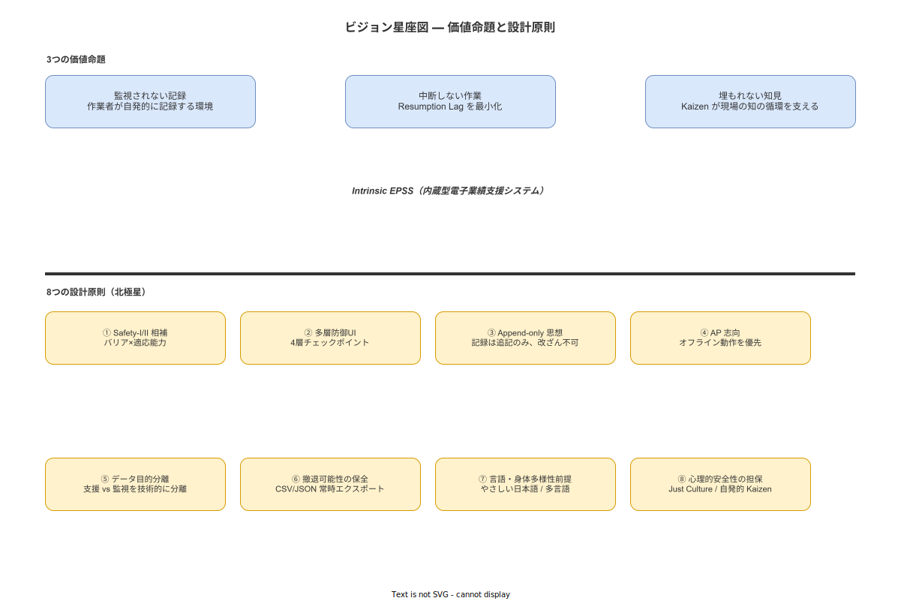

**主読者**: 経営層・工場長  
**想定所要時間**: 20分

---

# 3. ビジョンと価値命題

## 3.1 私たちが目指す5年後の現場像

5年後、本システムが根づいた現場では以下の変化が実現していると仮定する。

- 記録は「管理のための義務」ではなく「次の自分・次の人への引き継ぎ」として扱われている
- 作業の中断が起きても、システムが再開を支援し、重大なミスが発生しにくい環境が整っている
- 現場の改善提案が随時取り上げられ、手順書の改訂に反映されるサイクルが定常的に回っている

この記述は「約束」ではなく「仮説」である（なぜ約束ではないかはREADMEに記載）。

> **本節で確定した方針**
> 1. 5年後の現場像は「監視されない記録」「中断しない作業」「埋もれない知見」の3命題を実現した状態として定義した。
> 2. 現場像はコミットメントではなく仮説として示し、実績による検証を前提とすることを確認した。
> 3. 変化の主語は常に「現場の人」であり、システムはその変化を支援する手段であることを確認した。

---

## 3.2 価値命題1：「監視されない記録」

**命題**: 作業員は記録を、評価・監視のためではなく、次の作業を安全に行うための自分自身のツールとして使うようになっている。

| | 内容 |
|---|---|
| **達成された姿** | 不適合の報告が「怒られるから隠す」ではなく「次の人が同じミスをしないために伝える」という動機で行われる。記録漏れが減るのは「チェックされるから」ではなく「記録することが自分の助けになると分かったから」。 |
| **達成されていない姿（限界）** | 本システムは記録の動機を変えるが、職場文化・管理者の言動・心理的安全性を直接変える力はない。Just Culture が組織として実践されなければ、記録ツールは監視ツールに転化しうる。 |

（[`90_業界分析/24_作業者プライバシー・データ倫理と労務監視.md`](../../90_業界分析/24_作業者プライバシー・データ倫理と労務監視.md) 参照）（[`90_業界分析/13_安全文化と安全管理システム.md`](../../90_業界分析/13_安全文化と安全管理システム.md) 参照）

> **本節で確定した方針**
> 1. 「監視されない記録」とは、記録行為の動機を評価・監視から自己支援へ転換することを意味すると定義した。
> 2. 本システムは記録の動機変容を支援するが、職場文化・管理者の言動を直接変える力はないことを明示した。
> 3. Just Culture が組織として実践されなければ記録ツールが監視ツールに転化しうるリスクを、設計上の前提として認識した。

---

## 3.3 価値命題2：「中断しない作業」

**命題**: 作業が中断されても、どこまで進んでいたかを画面が教えてくれるので、再開時に「あれ、どこまでやったっけ」というミスが起きにくくなっている。

| | 内容 |
|---|---|
| **達成された姿** | 緊急呼び出し後に戻っても、次に何をすべきかが画面に表示されている（Resumption Lag の最小化）。新人が単独で初めての工程を担当しても、手順書を引き出しから探さなくて済む。 |
| **達成されていない姿（限界）** | 本システムはステップ単位の状態を管理するが、「この工程は全部終わった」「今日の残業で終わらせた分」などの文脈記憶を完全に再現することはできない。Resumption Lag ゼロは理論上達成できない。 |

（[`90_業界分析/20_作業中断・割込み・再開の認知科学.md`](../../90_業界分析/20_作業中断・割込み・再開の認知科学.md) 参照）

> **本節で確定した方針**
> 1. 「中断しない作業」とは作業の物理的な中断を防ぐことではなく、中断後の再開を支援してミスを低減することを意味すると定義した。
> 2. Resumption Lag の最小化を目標とするが、ゼロは理論上達成できないことを設計上の制約として確認した。
> 3. ステップ単位の状態管理は実装するが、文脈記憶の完全な再現は本システムの射程外であることを確認した。

---

## 3.4 価値命題3：「埋もれない知見」

**命題**: 作業員が気づいた改善点が、Kaizen Teian を通じて管理者に届き、手順書の改訂につながるサイクルが回っている。

| | 内容 |
|---|---|
| **達成された姿** | 「この工具の場所が分かりにくい」「この手順はこの順番でやると楽」という現場の知恵が、月に一度ではなく随時フィードバックされる。採択された提案には必ず返答がある。 |
| **達成されていない姿（限界）** | 本システムはKaizen Teianの投稿機能を提供するが、管理者が提案を無視し続ければ文化は根づかない。心理的安全性のない職場では、提案疲労・マンネリ化・強制参加化という既知のアンチパターンに陥る（[`90_業界分析/39_QCサークル・Kaizen Teianとボトムアップ品質活動.md`](../../90_業界分析/39_QCサークル・Kaizen Teianとボトムアップ品質活動.md) 参照）。ツールは文化の代替にはならない。 |

> **本節で確定した方針**
> 1. 「埋もれない知見」とは現場の知恵が随時取り上げられ手順書改訂に反映されるサイクルを意味すると定義した。
> 2. 本システムはKaizen Teianの投稿経路を提供するが、提案が活かされるかどうかは組織運営に依存することを明示した。
> 3. 心理的安全性のない職場での強制的なKaizen Teian導入は既知のアンチパターンに陥るリスクがあることを確認した。

---

## 3.5 Intrinsic EPSS: コンセプトの核心

本システムのコンセプトは **Intrinsic EPSS（内蔵型電子業績支援システム）** である（[`90_業界分析/25_作業指示書とSOPの構造化・表現論.md`](../../90_業界分析/25_作業指示書とSOPの構造化・表現論.md) 参照）。

EPSS（Electronic Performance Support System）とは、作業者が作業を行う場所・タイミングで、最小限の認知負荷で正確な情報を提供するシステムの概念。「Intrinsic」とは、それが作業ツールに内蔵（統合）されていることを意味し、別画面で手順書を検索する必要がない設計を指す。

**本システムが射程外と明示すること**: AR・AI・自動化・予測分析はIntrinsic EPSSの定義外であり、Phase 1 の対象外と判断する（理由は「10_戦略的代替案と「やらない」選択.md」参照）。

> **本節で確定した方針**
> 1. 本システムの目指す姿を「監視されない記録」「中断しない作業」「埋もれない知見」の3命題で表現し、各命題に達成される姿と達成されない姿を明示して誇大広告を回避した。
> 2. プロダクトコンセプトは Intrinsic EPSS（内蔵型電子業績支援システム）とする。AR・AI・自動化は本構想の射程外と確定した。
> 3. 3命題はいずれも「ツールが文化を変える」と約束するものではなく、「ツールが文化変容を支援する条件を整える」ことを目標とすることを確認した。
