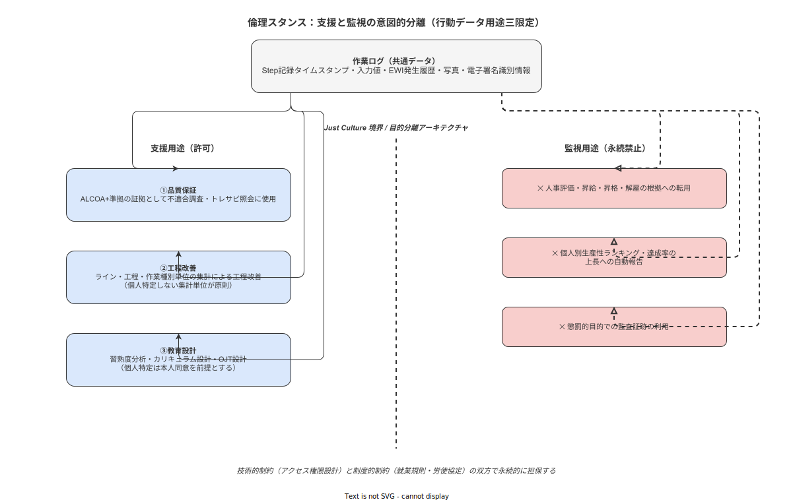

# 04 倫理スタンスと支援・監視の意図的分離

本章の責務は、本システムが採用する倫理的立場を設計制約として確定することである。「支援ツールである」という意図の宣言は出発点に過ぎない。同一データが支援と監視の両方に機能しうる構造的緊張を認識し、Just Culture の採用・行動データ用途の三限定・目的分離の技術的・制度的保証・規制適合の境界・継続的監査の仕組みを確定する。

---

## 支援と監視の意図的分離

### 構造的緊張の認識

本システムが収集するデータ——作業ステップの完了タイムスタンプ・入力値・判定結果・作業者 ID——は、品質保証に必要な最小限の記録である。しかし同一のデータは、「誰が何分でどのステップを完了したか」という個人別の行動監視情報としても機能する。この二重性は技術的な問題ではなく、データ収集そのものが内包する構造的緊張である。

Michel Foucault は *Surveiller et Punir*（監獄の誕生, 1975）において、Panopticon（パノプティコン）を権力の行使モデルとして分析した。円形刑務所の中央監視塔は、被収容者が「常に見られているかもしれない」と内面化することで、実際の監視なしに自己規律を生み出す。デジタル記録システムにおいても同一のメカニズムが作動する。作業者が「ログが取られている」と認識した瞬間、行動変容が始まる。

Aiello & Kolb（1995）は電子的業績監視（Electronic Performance Monitoring: EPM）の実験的研究において、以下を示した。

| 作業の種類 | 監視下の効果 |
|---|---|
| 単純反復作業 | 生産性が向上する傾向 |
| 複雑な認知作業 | 生産性が低下する傾向 |
| ストレス・不安 | 監視条件で増加 |
| 職務満足度 | 監視条件で低下 |

製造現場の多くの作業は、手順に沿った繰り返しと、現場での判断・調整という認知的側面の両者を含む。単純化されたモデルによる「監視で生産性が上がる」という楽観論は、認知的側面の重要性を無視している。

### 「監視を意図しなくとも監視として機能する」メカニズム

設計者が監視を意図しなくとも、以下のメカニズムにより記録が監視として機能する。

1. **データの蓄積が権力非対称を生む**: 管理者はすべての記録にアクセスできるが、作業者は自分の記録にしかアクセスできない。この非対称性が「知られている/知らない」という権力差を生む。
2. **比較の誘惑**: 個人別のデータが蓄積されると、意図しなくとも比較・ランキングが発生しやすい。設計で禁じなければ、比較レポートは「有用な機能」として追加される。
3. **解釈の転用**: 品質保証目的で収集したデータが、人事評価の「根拠」として事後的に解釈される。

### 本システムがとる立場

「支援ツールである」という宣言は意図の表明ではなく、設計制約として実装する。意図は変わりうるが、設計制約は変更に明示的なコストを要求する。この非対称性が倫理の持続性を担保する。

---

**本節で確定した方針**

- 支援と監視の構造的緊張を認識し、意図の宣言でなく設計制約によって境界を定めることを確定する。
- Aiello & Kolb（1995）の知見を踏まえ、認知負荷増大を招く電子的業績監視の機能を設計上禁止することを確定する。
- 「支援ツールである」ことは設計制約として実装し、意図の宣言に留めないことを確定する。

---

## Just Culture の採用宣言

### James Reason のモデルの定義

James Reason は *Managing the Risks of Organizational Accidents*（1997）において、Just Culture を「安全文化の中核をなす公正文化」として定義した。Just Culture は「ブレームフリー（非難しない）」文化とは異なる。完全な非難排除は故意の危険行為・悪意ある行為をも保護する。Just Culture は行為の性質に応じた公正な処遇を定める。

### 行為の 4 分類と処遇の原則

Reason のモデルに基づき、本システムが扱う記録の解釈基準を以下に定める。

| 分類 | 定義 | 本システムの処遇方針 |
|---|---|---|
| ①スリップ（Slip） | 意図は正しいが実行レベルで失敗。注意の瞬間的な逸脱 | 問責しない。UI 設計・フール­プルーフ改善の課題として扱う |
| ②ラプス（Lapse） | 意図した行為を記憶エラーにより失敗。忘れ・抜け | 問責しない。チェックリスト・リマインダー改善の課題として扱う |
| ③ミステイク（Mistake） | 状況の誤った解釈に基づく誤った判断 | 問責しない。手順の明確化・訓練設計の改善課題として扱う |
| ④故意の規則違反・悪意ある行為 | 結果を認識した上での意図的な逸脱・妨害 | 組織の懲罰的対応の対象とする |

①②③の大部分は、Hollnagel（*Safety-I and Safety-II*, 2014）が示す Work-as-Done（実際の作業）と Work-as-Imagined（想定された作業）の乖離から生じる。乖離は「作業者の怠慢」ではなく「手順の不完全性・作業環境の変動」への適応的行為である。本システムはこの乖離を「適応の証拠」として記録し、手順改訂のインプットとして扱う。

### WAD の記録を「違反の証拠」として解釈しない宣言

本システムが記録する Work-as-Done（WAD）のデータは、規定手順（Work-as-Imagined: WAI）との比較において逸脱を可視化する。しかし、WAD と WAI の乖離は即座に「違反」を意味しない。乖離は以下の可能性を含む。

- 手順が現場実態に合っていない
- 作業環境が想定と異なる条件を生んでいる
- 熟練者が意識せずに行う適応的調整（タシット・アダプテーション）が手順に反映されていない

乖離の原因究明なしに記録を違反の証拠として扱うことを、本システムの運用において禁じる。この禁止は制度的制約として就業規則・運用方針に明示する必要がある（詳細は計画書第 09 章に委ねる）。

### 記録機能と Just Culture の関係

Just Culture を組織に根付かせるには、「報告が問責につながらない」という信頼が前提となる。本システムの記録機能は Just Culture の判断を支援する——客観的なタイムスタンプ付きの事実が、印象・記憶・証言に基づく推測より正確である——が、①②③を自動的に問責プロセスに接続する機能は実装しない。

---

**本節で確定した方針**

- James Reason の Just Culture モデルを採用し、スリップ・ラプス・ミステイクを問責しない方針を確定する。
- WAD と WAI の乖離を「違反の証拠」として解釈しないことを設計原則として確定する。
- ①②③の行為を自動的に問責プロセスに接続する機能を実装しないことを確定する。

---

**図 1: 支援/監視の意図的分離図（用途三限定）**

> 原本: [`img/fig_ethics_separation.drawio`](img/fig_ethics_separation.drawio)

## 行動データ用途三限定

### 収集する行動データの種類

本システムが収集する行動データを以下に限定・明示する。

| データ種別 | 収集目的 | 個人識別との関係 |
|---|---|---|
| 作業ステップ完了タイムスタンプ | 品質証拠・トレサビ | 作業者 ID と紐付く |
| 入力値（測定値・判定結果） | 品質証拠・工程管理 | 作業者 ID と紐付く |
| EWI（電子作業指示書）発生履歴 | 品質証拠・手順改訂 | 工程・手順に紐付く |
| 写真・非テキスト記録 | 品質証拠 | ステップ・工程に紐付く |
| 電子署名識別情報 | 承認・本人確認 | 個人と直接紐付く |

### 用途限定の三区分

収集した行動データの使用目的を以下の三区分に限定する。これ以外の用途への転用を設計上の禁止事項として宣言する。

**用途①：品質保証**
ALCOA+ 準拠の電子証拠として、不適合調査・逆トレサビ照会・規制対応・内部監査に使用する。個人識別情報との紐付けは「誰が実施したか」の証拠性確保に限定し、個人の評価目的には使用しない。

**用途②：工程改善**
ライン・工程・作業種別の集計単位で分析し、ボトルネック特定・作業時間の分布分析・手順の見直しに活用する。個人特定可能な形での集計を原則禁止とし、集計単位は工程・ライン・作業種別の最小単位（N≥5 以上を原則）に設定する。

**用途③：教育設計**
習熟度分析・カリキュラム設計・OJT 設計に活用する。個人を特定した分析は本人への同意を前提とし、分析結果は本人にフィードバックする。第三者（上長・人事）への開示は本人同意なしに行わない。

### 禁止する用途の明示

以下の用途への転用を、本システムの設計上の禁止事項として宣言する。

| 禁止用途 | 禁止の根拠 |
|---|---|
| 人事評価・昇給・昇格・解雇の根拠への転用 | Just Culture の根本的破壊。職場の権力非対称の悪用 |
| 個人別生産性ランキング・達成率の上長への自動報告 | デジタルテイラリズムへの直結。Aiello & Kolb（1995）の知見 |
| 懲罰的目的での監査証跡利用 | スリップ・ラプス・ミステイクへの問責。報告文化の破壊 |
| 労使紛争の証拠としての一方的な活用 | 同意を欠いた目的外利用 |
| 退職・解雇根拠としての作業速度データの使用 | 個人情報保護法「不適正利用の禁止」に対応する義務 |

---

**本節で確定した方針**

- 行動データの使用目的を品質保証・工程改善・教育設計の三区分に限定することを確定する。
- 人事評価・個人別スコアリング・懲罰的利用への転用を設計上の禁止事項として確定する。
- 工程改善における集計単位は個人特定不能な水準（N≥5 以上を原則）とすることを確定する。

---

## 目的分離の構造保証

### 技術的制約と制度的制約の双方が必要である理由

「品質保証目的のデータを人事評価に使わない」という方針を実現するには、技術的制約と制度的制約の両者が必要である。技術だけでは目的外利用を完全に防止できない。制度（就業規則・労使協定・運用方針）だけでは、技術的な制約がなければ意図せずデータが転用されうる。

| 制約の種類 | 限界 | 補完が必要な理由 |
|---|---|---|
| 技術的制約のみ | アクセス権限の変更・管理者権限での迂回が可能 | 制度的根拠がなければ技術制約の変更を止める規範がない |
| 制度的制約のみ | 技術的な障壁がなければ違反のコストが低すぎる | 制度だけでは意図せぬ転用を防げない |

### 技術的制約の設計方針

詳細は計画書第 06 章データモデルに委ねるが、構想レベルでの設計方針を宣言する。

- **アクセス権限設計**: 役割（作業者・現場監督・品質担当・IT 管理者）ごとにアクセス可能なデータ粒度を分離する。人事担当は個人識別付き作業ログにアクセスできない設計を採用する。
- **集計単位制御**: 個人識別可能な粒度での集計レポートを API・画面の双方で生成できない設計を採用する。集計単位の最小粒度をシステムレベルで強制する。
- **監査ログの分離**: 品質証拠ログと、その品質証拠ログへのアクセス履歴ログを分離管理し、どのアカウントがいつ何のデータにアクセスしたかを記録する。

### 制度的制約の設計方針

詳細は計画書第 09 章運用方針に委ねるが、構想レベルで以下を宣言する。

- **就業規則・労使協定への明示**: データ収集の目的・範囲・禁止用途を就業規則または労使協定に明示する。
- **定期的な透明性報告**: 収集データの実際の用途を定期的（最低年 1 回）に全作業員に開示する。
- **目的変更手続きの規定**: 三限定の用途を変更する場合は、労働者代表との協議を経た明示的な変更手続きを必要とする。

### GDPR 第 22 条と日本改正個人情報保護法との関係

GDPR 第 22 条は「自動的処理に基づく意思決定への異議申立権」を定める。本システムが行動データを用いて自動的に作業者を評価・ランキングする機能を持つ場合、この権利が発動しうる。本システムは禁止用途として個人別スコアリングを排除しているため、第 22 条の適用範囲を原理的に回避する設計となっている。

日本の改正個人情報保護法（2022 年施行）は「不適正利用の禁止」を明示的に追加した。行動データを人事評価に転用することは、当該条項が規定する「不当な差別・偏見を助長する形での個人情報利用」に該当する可能性があり、対応すると判断する。

GDPR 第 5 条第 1 項（c）が定めるデータ最小化原則——業務目的に必要なデータのみ収集する——を、本システムの収集設計における基本原則として採用する。

---

**本節で確定した方針**

- 目的分離の保証には技術的制約と制度的制約の双方が必要であることを確定し、どちらか一方への依存を排除することを確定する。
- 個人識別可能な粒度での集計レポートをシステムレベルで生成不能にする技術的制約を採用することを確定する。
- GDPR データ最小化原則（第 5 条第 1 項(c)）を収集設計の基本原則として採用することを確定する。

---

## 規制三段階による倫理境界

本システムが適用・対応する規制の範囲を、「準拠する」「対応する」「対象外と判断する」の三段階で確定する。曖昧な表現（考慮する・検討する・参考にする・可能性がある）は使用しない。

### 個人情報保護法（日本）

**対応すると判断する。**

作業者 ID と紐付いた行動ログは個人情報に該当する。収集目的の明示・目的外利用の禁止・安全管理措置・本人からの開示請求への対応を設計・運用に組み込む。2022 年施行の改正個人情報保護法が追加した「不適正利用の禁止」を特に重視し、行動データの人事評価転用を明示的に禁じる。

### GDPR（EU 一般データ保護規則）

**対応すると判断する。**

EU 域内の作業員が本システムを利用する場合を想定した設計を採用する。社内 LAN 完結のため EU 域内への直接データ転送は発生しないが、EU 国籍の作業員が日本の工場で本システムを利用するシナリオには GDPR が適用されうる。データ最小化・目的限定・透明性・作業者の権利（アクセス・訂正・削除請求）への対応を設計に組み込む。

### ISO 27701（プライバシー情報マネジメント）

**対象外と判断する。**

ISO 27701 の認証取得は現スコープ外と判断する。ただし、同規格の設計思想——プライバシー情報マネジメントシステムの構築——は GDPR 準拠の実装指針として参照する。認証取得は将来の経営判断に委ねる。

### 電気通信事業法

**対象外と判断する。**

本システムは社内 LAN のみで動作し、公衆電気通信回線を経由しない。電気通信事業者への登録義務・通信の秘密保護義務は適用されないと判断する。

---

**本節で確定した方針**

- 個人情報保護法（日本）への対応と GDPR への対応を設計要件として確定する。
- ISO 27701 認証取得を現スコープ外と判断し、設計思想のみを参照することを確定する。
- 電気通信事業法を対象外と判断することを確定する。

---

## 倫理の継続的監査

### 倫理境界の侵食リスク

ver1.0.0 リリース後も、以下のメカニズムにより倫理境界が侵食されるリスクがある。

- **機能追加による用途拡大**: 有用に見える集計レポートが追加され、結果として個人特定が可能になる。
- **運用慣行の変化**: 当初の禁止用途が「事実上の慣行」として定着する。
- **人事異動による方針の継承失敗**: 本構想を知らない担当者が管理者として着任し、禁止用途が認識されなくなる。

これらのリスクに対して、技術的制約のみに依存することは不十分である。継続的な監査の仕組みを設計段階から組み込む。

### 年次透明性報告

年 1 回以上、以下の内容を全作業員に対して開示する透明性報告を実施することを確定する。

| 報告項目 | 内容 |
|---|---|
| データ収集の実績 | 何のデータを収集したか |
| データ用途の実績 | 実際にどの用途で使用したか |
| アクセス者の範囲 | どの役割が何のデータにアクセスしたか（個人特定なしの集計） |
| 禁止用途への転用がなかったことの確認 | または転用事例があった場合の報告と対処 |

### 労働者代表の参加権

倫理境界に関する決定——データ収集種別の変更・用途の追加・保管期間の変更——には、労働者代表が参加する協議プロセスを経ることを確定する。協議なしの一方的変更は、制度的制約として禁じる。

### 倫理逸脱の定義

以下の事象が発生した場合、倫理逸脱として組織内で報告・対処する義務を課す。

- 禁止用途（人事評価・懲罰的利用）へのデータ転用が判明した場合
- 集計単位の制約を回避して個人識別可能な集計レポートが作成された場合
- 個人識別スコアが新設・追加された場合
- 透明性報告が実施されなかった場合

---

**本節で確定した方針**

- 年次透明性報告を全作業員への開示義務として確定する。
- 倫理境界に関わる仕様変更には労働者代表の参加する協議を必須とすることを確定する。
- 倫理逸脱の定義と対処義務を組織の運用規則に明示することを確定する。

---

## 参照業界分析

### 必須

- [`90_業界分析/24_作業者プライバシー・データ倫理と労務監視.md`](../../90_業界分析/24_作業者プライバシー・データ倫理と労務監視.md)
- [`90_業界分析/13_安全文化と安全管理システム.md`](../../90_業界分析/13_安全文化と安全管理システム.md)
- [`90_業界分析/09_職務設計とモチベーション論.md`](../../90_業界分析/09_職務設計とモチベーション論.md)

### 関連

- [`90_業界分析/21_作業ログ分析とプロセスマイニング.md`](../../90_業界分析/21_作業ログ分析とプロセスマイニング.md)
- [`90_業界分析/04_ヒューマンエラーと安全工学.md`](../../90_業界分析/04_ヒューマンエラーと安全工学.md)
