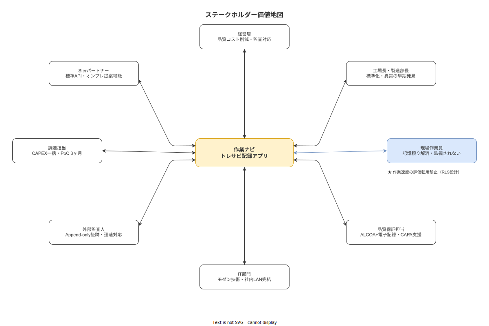

**主読者**: 全員  
**想定所要時間**: 25分

---

# 5. ステークホルダー価値地図

8種のステークホルダー全員に対して、「本システムが自分にとって何を提供し、何を提供しないか」を明示する。特に「監視ツールではないか」という作業員の疑念と「投資対効果があるか」という経営層の疑念に正面から答える。

## 5.1 ステークホルダー価値地図の見方

各ステークホルダーについて以下の4観点で価値を整理する:

| 観点 | 内容 |
|---|---|
| **現在の痛み** | 本システム導入前に感じている課題・不満 |
| **提供する価値** | 本システムが解消・軽減する痛み |
| **提供しない価値** | 本システムが意図的に提供しない機能・効果（誤解防止） |
| **受容リスク** | 本システムの導入・利用において注意すべきリスク |

> **本節で確定した方針**
> 1. ステークホルダーの価値評価は「提供する価値」と「提供しない価値」の両面から記述することを規約として定めた。
> 2. 誤解に基づく過剰期待を防ぐために「提供しない価値」の明示を必須とすることを確認した。
> 3. 各ステークホルダーの「受容リスク」を事前開示し、合意形成の基盤とすることを確認した。

---

## 5.2 経営層

| 観点 | 内容 |
|---|---|
| **現在の痛み** | 品質コスト（手直し・廃棄・リコール）の見えない膨張。顧客監査対応に毎回数日を要す。熟練者退職によるノウハウ消失リスク |
| **提供する価値** | 不適合の早期検知・再発防止によるリワーク・廃棄コストの低減。電子証跡で監査対応を迅速化。熟練者の手順知識の形式知化によるリスク軽減 |
| **提供しない価値** | 投資対効果の定量的保証（Phase 1 PoC 終了後に実測）。生産計画・ERP との統合（スコープ外）。全ての暗黙知の完全形式知化 |
| **受容リスク** | Phase 1 PoC の結果によっては本番展開への移行を見合わせることがある。ROI の計算はフェーズ終了後にしか確定できない |

> **本節で確定した方針**
> 1. 経営層への価値提供の核心は「品質コスト低減」「監査対応迅速化」「ノウハウ消失リスク軽減」の3点であることを確認した。
> 2. 投資対効果の定量的保証はPhase 1 PoC終了後にしか確定できないことを経営層に対して明示することを定めた。
> 3. ERP統合・全暗黙知の形式知化はスコープ外として、過剰期待を防ぐことを確認した。

---

## 5.3 工場長・製造部長

| 観点 | 内容 |
|---|---|
| **現在の痛み** | 「また同じミスが起きた」の繰り返し。新人指導の負担。不適合発生時の原因追跡に時間がかかる。優秀な熟練者への依存度の高さ |
| **提供する価値** | ステップバイステップ手順で新人が自律的に作業できる環境。不適合→CAPA→手順改訂の閉ループ。ロット単位のトレーサビリティ記録で原因追跡を迅速化 |
| **提供しない価値** | 自動的な品質改善（ツールは支援するが品質向上は工程設計・教育の改善が必要）。PLC連携・設備監視機能（スコープ外）|
| **受容リスク** | 現場の協力・心理的安全性がなければKaizen Teian は機能しない。システムの導入だけで現場文化は変わらない |

> **本節で確定した方針**
> 1. 工場長・製造部長への価値提供の核心は「再発防止の閉ループ」「新人の自律化支援」「原因追跡の迅速化」であることを確認した。
> 2. 品質向上は工程設計・教育の改善が必要であり、本システムが自動的に品質を改善するわけではないことを明示した。
> 3. 心理的安全性がなければKaizen Teianは機能しないことを、受容リスクとして工場長・製造部長に伝えることを定めた。

---

## 5.4 作業員

| 観点 | 内容 |
|---|---|
| **現在の痛み** | 「この手順で正しいのか不安」。中断後に「どこまでやったか」が分からなくなる。後で記録を書くのが手間。改善案を言っても聞いてもらえない感覚 |
| **提供する価値** | ステップバイステップ手順で「これで合ってる」という確信を持って作業できる。中断後の再開をサポート（Resumption Lag 低減）。Kaizen Teian で改善案が正式に取り上げられるルートができる |
| **提供しない価値** | **個人の作業速度・完了時間のパフォーマンス評価への転用は行わない**（データ目的分離原則による。これはシステムレベルで保証する）。自動的な昇格・評価改善 |
| **受容リスク** | 最初はタブレット操作に慣れるまで時間がかかる可能性がある。記録を入力することで作業時間が増える感覚を持つ作業員もいる（慣れるまでの投資期間が必要） |

作業員に対しては特に強調: **「あなたの作業速度や完了時間は評価・査定の対象にしません」**。この原則はシステム設計（RLS・データ目的分離）で技術的に担保されており、口頭の約束ではない。

（[`90_業界分析/09_職務設計とモチベーション論.md`](../../90_業界分析/09_職務設計とモチベーション論.md) 参照）（[`90_業界分析/24_作業者プライバシー・データ倫理と労務監視.md`](../../90_業界分析/24_作業者プライバシー・データ倫理と労務監視.md) 参照）

> **本節で確定した方針**
> 1. 作業員への価値提供の核心は「手順の確信」「中断後の再開支援」「改善提案の正式経路」であることを確認した。
> 2. 個人の作業速度・完了時間をパフォーマンス評価に転用しないことをRLS・データ目的分離で技術的に担保することを定めた。
> 3. 操作習熟までの投資期間を受容リスクとして事前に伝え、現場の合意形成を促すことを確認した。

---

## 5.5 品質保証担当

| 観点 | 内容 |
|---|---|
| **現在の痛み** | 紙記録の ALCOA+ 未充足（後記・まとめ記入）。不適合の根本原因分析に必要な記録が不十分。監査証跡の準備に毎回数日を要す |
| **提供する価値** | 電子記録で ALCOA+ Contemporaneous を技術的に担保。写真・測定値の証跡で根本原因分析を支援。CAPA のワークフロー管理。Append-only 設計で改ざん防止 |
| **提供しない価値** | ISO 9001 認証の自動取得・維持（認証は外部審査機関によるもの）。Part 11完全準拠（Phase 1 では基盤のみ、拡張可能性を確保）|
| **受容リスク** | データの完全性はシステムが保証するが、記録の解釈・判断は人間が行う必要がある |

> **本節で確定した方針**
> 1. 品質保証担当への価値提供の核心は「ALCOA+ Contemporaneousの技術的担保」「CAPA管理」「改ざん防止」であることを確認した。
> 2. ISO 9001認証の自動取得はシステムの射程外であり、認証は外部審査機関によるものであることを明示した。
> 3. 記録の解釈・判断は人間が行う必要があることを、受容リスクとして明示することを定めた。

---

## 5.6 IT部門

| 観点 | 内容 |
|---|---|
| **現在の痛み** | レガシーシステムの保守コスト。社内LAN完結要件と現代的ツールの不一致。Docker・Linux知識がないと保守できない旧式システム |
| **提供する価値** | Rust + React Native + PostgreSQL というモダンなオープンソーススタック。Docker Compose による標準的なデプロイ構成。社内LAN完結（データが外に出ない）。標準的なREST/JSON APIで将来の拡張が可能 |
| **提供しない価値** | ベンダー専任の保守契約（個人開発プロジェクトのため）。SLA保証（Bus Factor 1 の制約を明示）|
| **受容リスク** | Bus Factor 1（個人開発）のため、メンテナンス継続性に構造的リスクがある。Phase 2以降での継続開発体制の整備が必要 |

> **本節で確定した方針**
> 1. IT部門への価値提供の核心は「モダンなOSSスタック」「標準的なデプロイ構成」「社内LAN完結」「REST/JSON API」であることを確認した。
> 2. ベンダー専任保守契約・SLA保証は提供できないことをIT部門に対して明示することを定めた。
> 3. Bus Factor 1という構造的リスクを明示し、Phase 2以降の継続体制整備を課題として残すことを確認した。

---

## 5.7 外部監査人

| 観点 | 内容 |
|---|---|
| **現在の痛み** | 紙記録の信頼性への疑念（後記・改ざんの可能性）。証跡の準備に時間がかかる |
| **提供する価値** | Append-only イベントログで改ざん痕跡が残る。CSV/JSONエクスポートで証跡提出が迅速化。電子署名サポートで手順書の承認記録が明確 |
| **提供しない価値** | 21 CFR Part 11 完全準拠（Phase 1 では対応する（拡張可能性確保）、GMP/MDR 対象外と判断する）|
| **受容リスク** | Phase 1 は監査証跡の完全性を優先する設計だが、業界固有規制（Part 11の全要件）への対応は Phase 2 以降の拡張として計画する |

> **本節で確定した方針**
> 1. 外部監査人への価値提供の核心は「Append-onlyによる改ざん痕跡」「証跡提出の迅速化」「承認記録の明確化」であることを確認した。
> 2. 21 CFR Part 11の完全準拠はPhase 2以降の拡張として計画し、Phase 1では基盤整備と拡張可能性の確保にとどめることを定めた。
> 3. GMP/MDR対象外という判断を明示し、監査人との合意形成の基盤とすることを確認した。

---

## 5.8 調達担当

| 観点 | 内容 |
|---|---|
| **現在の痛み** | SaaS型製品では年次ライセンス費用が継続的に発生し、年度予算と整合しにくい。RFP・PoC・承認に18ヶ月かかる |
| **提供する価値** | CAPEX一括購入モデル（年次ライセンスなし）。Docker Compose 単体インストール・PoC 3ヶ月という短期検証。ものづくり補助金・IT導入補助金の活用可能性 |
| **提供しない価値** | SLA保証付き保守契約（個人開発のため）。複数年の価格固定保証 |
| **受容リスク** | 個人開発プロジェクトのため、将来の継続開発・保守に関する体制整備は別途検討が必要 |

> **本節で確定した方針**
> 1. 調達担当への価値提供の核心は「CAPEXモデル」「短期PoC」「補助金活用可能性」であることを確認した。
> 2. SLA保証付き保守契約・複数年の価格固定保証は提供できないことを明示することを定めた。
> 3. 個人開発プロジェクトとしての体制上の制約を調達担当に対して事前開示することを確認した。

---

## 5.9 SIerパートナー

| 観点 | 内容 |
|---|---|
| **現在の痛み** | オープンなAPIのないブラックボックス製品への依存。顧客ニーズに合わせたカスタマイズの困難さ |
| **提供する価値** | REST/JSON APIで外部システムとの統合が可能。Rustの静的型付けと自己文書化によりカスタマイズ・拡張が安全。社内LAN要件を持つ顧客へのオンプレ提案に活用できる |
| **提供しない価値** | SIer専属の保守・サポート契約（独立したOSSプロジェクトとして提供）。SIer向けの個別パートナーシップ制度（現時点では未整備）|
| **受容リスク** | 個人開発プロジェクトのため、長期サポートの確実性は保証されない。導入時のカスタマイズは顧客自身またはSIerの技術者が担当する |

> **本節で確定した方針**
> 1. 8種のステークホルダー全員に対して「提供する価値」と「提供しない価値」を明示し、誤解に基づく過剰期待を防ぐ枠組みを確定した。
> 2. 作業員に対しては「個人作業速度のパフォーマンス評価への転用禁止」をシステム設計（データ目的分離・RLS）で技術的に担保することを確定した。
> 3. IT部門・SIer・調達担当に対してはBus Factor 1（個人開発）という構造的制約を明示し、Phase 2以降の継続体制整備を課題として残すことを確認した。
