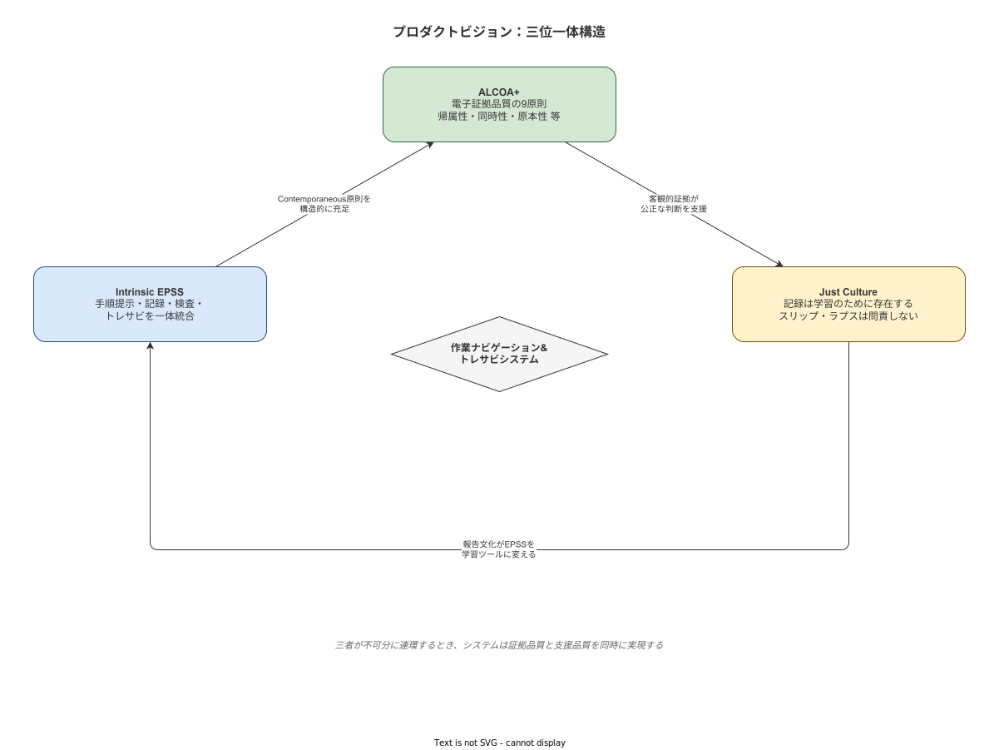

# 05 プロダクトビジョン

本章の責務は、本システムが「何であるか」ではなく「何のためにあるか」というプロダクトレベルのビジョンを確定することである。技術スタック・リリース計画・ROI の数値は本章の対象外とする。本章が確定するのは「Intrinsic EPSS × ALCOA+ × Just Culture」の三位一体ビジョンと、5 年後・10 年後の到達像、および本システムが社会に対して担う役割の宣言である。

---

## 三位一体ビジョン

### ビジョンの宣言

本システムのビジョンは「**Intrinsic EPSS × ALCOA+ × Just Culture**」の三位一体として定義する。三者はそれぞれ独立したコンセプトではなく、相互に補完し合う構造的な関係を持つ。いずれかが欠けた場合、残る二者の効果は著しく減衰する。

### 三者の補完関係

| 軸 | 役割 | 他の軸への貢献 |
|---|---|---|
| Intrinsic EPSS | 作業フローに内在化された支援が証拠を自動生成する | ALCOA+ の Contemporaneous を構造的に担保する |
| ALCOA+ | 電子記録の証拠品質を 9 原則で規律する | Just Culture が正確な事実に基づいた公正な判断を下せる基盤を提供する |
| Just Culture | 記録を罰のためではなく学習のための証拠として位置づける | Intrinsic EPSS が報告ツールでなく学習ツールとして機能する組織文化を醸成する |

### 三者のいずれかが欠けた場合の帰結（逆説的論証）

**Intrinsic EPSS が欠けた場合**: 作業後の追記・事後入力が常態化し、ALCOA+ の Contemporaneous が失われる。記録は作業事実の証拠ではなく「後付けの説明書」になる。Just Culture が機能しても、事実の基盤が失われているため公正な判断は不可能になる。

**ALCOA+ が欠けた場合**: 記録は存在するが証拠品質を保証する枠組みがない。Intrinsic EPSS によって記録が生成されても、その改ざん可能性・帰属不明・完全性の欠如が証拠としての信頼性を失わせる。Just Culture は不正確な事実に基づいて判断を下すことになる。

**Just Culture が欠けた場合**: ALCOA+ 準拠の完全な記録が存在しても、スリップ・ラプスの発見が自動的に問責につながる文化では、作業者は正直に記録する動機を失う。Intrinsic EPSS は監視・追跡ツールとして作業者に認識される。記録の正確性と完全性が組織的に損なわれる。

三者の補完関係は一方向ではない。いずれかの強化が他の二者の効果を高め、いずれかの毀損が他の二者の機能を損なう。この循環的強化構造がビジョンの本質である。

**図 1: Intrinsic EPSS × ALCOA+ × Just Culture の三位一体構造**

> 原本: [`img/fig_vision_trinity.drawio`](img/fig_vision_trinity.drawio)

---

**本節で確定した方針**

- 「Intrinsic EPSS × ALCOA+ × Just Culture」の三位一体をプロダクトビジョンの核として確定する。
- 三者の相互補完関係を単なる並列表記ではなく、構造的な依存関係として確定する。
- 三者のいずれかを後日削減する変更は、本ビジョンへの根本的な違反として扱うことを確定する。

---

## Intrinsic EPSS としての作業ナビ

### EPSS の定義と種別

**EPSS（Electronic Performance Support System）** は Gery（1991）が定義した「作業者が必要な時に、必要な情報・支援・学習を、作業の流れを中断することなく提供するシステム」である。作業の文脈の外側に存在するマニュアル・ヘルプシステムとは設計思想が根本的に異なる。

| 種別 | 定義 | 限界 |
|---|---|---|
| Extrinsic EPSS | 作業の外側にある参照型の支援（マニュアル・FAQ・ヘルプ画面） | 作業を中断して参照する必要がある。Carroll の研究が示す通り、人は作業前にマニュアルを読まない |
| Intrinsic EPSS | 作業フローに内在化された支援。作業することが支援を受けることと同義 | 作業フローとの密な統合が設計コストを高める |

本システムは Intrinsic EPSS として設計する。支援機能は作業フローの外側ではなく、作業ステップそのものに埋め込まれる。

### Carroll の Minimalist Design との接続

John Carroll（*The Nurnberg Funnel*, 1990）の Minimalist Instruction は「人は作業を開始する前にマニュアルを読まない。作業の文脈に埋め込まれた支援のみが機能する」ことを設計原則として示した。Carroll の研究は、詳細なマニュアルよりも「作業しながら理解する」機会の提供が習得速度・定着率を高めることを実証した。

本システムは Carroll の知見を以下の形で実装する。

- 手順の全体像を事前に提示するのではなく、現在のステップに必要な情報のみを表示する
- 補足情報・注意事項はデフォルト非表示とし、必要な場合のみ展開する（Miller, 1956 の短期記憶容量 7±2 の制約への対応）
- 誤った操作をした場合に即座にフィードバックし、正しい手順に戻る経路を明示する

### 4 機能の不可分な統合

Intrinsic EPSS としての本システムは、以下の 4 機能を単一のフローに統合する。この統合が「作業をしながら証拠が残る」状態を実現する核心である。

| 機能 | 単独では何を達成するか | 統合により何が生まれるか |
|---|---|---|
| 手順提示 | 「次に何をするか」を示す | 作業と支援が同一フローになる |
| 記録入力 | 測定値・判定結果を記録する | 入力が完了してはじめて次ステップへ進める |
| 品質検査 | 閾値・判定基準との照合 | 入力値の異常を即座に検知し作業者にフィードバック |
| トレサビ記録 | 作業者・材料・設備の紐付け | 作業完了と同時に証拠が確定する |

4 機能のうちいずれかが別システム・別フローで実施される場合、記録の Contemporaneous 性が失われ、ALCOA+ の核心的要件が崩れる。統合は機能的利便性の問題ではなく、証拠品質の問題である。

---

**本節で確定した方針**

- 本システムを Extrinsic EPSS ではなく Intrinsic EPSS として設計することを確定する。
- 手順提示・記録入力・品質検査・トレサビ記録の 4 機能を単一フローに統合し、分離しないことを確定する。
- Carroll の Minimalist Design に基づき、現在ステップの情報のみを表示する設計原則を確定する。

---

## ALCOA+ を採用する根拠

### ALCOA+ の概念説明

**ALCOA**（Attributable / Legible / Contemporaneous / Original / Accurate）は米国 FDA が 1990 年代に電子記録の品質基準として定式化した枠組みである。その後 ALCOA+として **Complete / Consistent / Enduring / Available** の 4 原則が追加され、9 原則として医薬品・医療機器分野の GMP 規制に広く採用されている。

| 原則 | 意味 |
|---|---|
| Attributable（帰属可能） | 誰が・いつ行ったかが明確に特定できる |
| Legible（判読可能） | 記録が恒久的に判読できる |
| Contemporaneous（同時性） | 記録が作業と同時に生成されている |
| Original（原本） | 最初に記録されたデータが原本として管理されている |
| Accurate（正確） | 実際の観察・測定・活動を正確に反映している |
| Complete（完全） | すべての必要な情報が記録されている |
| Consistent（一貫） | 時系列・フォーマット・単位が一貫している |
| Enduring（永続） | 要求される保管期間にわたって記録が消失しない |
| Available（利用可能） | 権限ある者がレビュー・監査のために記録にアクセスできる |

### GMP への準拠ではなく「証拠品質論の汎用採用」

本システムが対象とする製造現場は GMP（Good Manufacturing Practice）規制の直接対象外である可能性が高い。ALCOA+ を採用する理由は GMP への法的準拠ではない。ALCOA+ が電子記録の「法的・科学的証拠として機能するための条件」として最も完備した枠組みであるためである。

品質問題・リコール対応・顧客クレーム・労働災害の調査において、記録が証拠として機能するか否かは、規制業界に限らず製造業全般に関わる問題である。ALCOA+ の 9 原則は「何が証拠品質の高い記録か」を規律する普遍的な基準として機能する。

Juran（1999）が指摘したように、「記録が取れている = 品質が保証されている」という等式は成立しない。しかし「証拠品質の低い記録は、問題発生後の原因究明・責任の明確化において機能しない」という命題は製造業全般に適用される。

### 採用の理由の再確認

ALCOA+ を採用する理由を以下に整理する。

| 理由 | 説明 |
|---|---|
| 完備性 | 電子記録の証拠品質を規律する枠組みとして最も網羅的である |
| 普遍性 | GMP 規制外の製造業においても電子証拠の基準として適用できる |
| 実装可能性 | 9 原則それぞれが設計上の具体的要件に翻訳可能である |
| 将来の規制対応余地 | 将来 GMP または同等規制の対象になった場合、追加コストなく適合できる |

ALCOA+ 9 原則の詳細設計は計画書第 06 章データモデルに委ねる。本章は採用宣言と根拠のみを確定する。

---

**本節で確定した方針**

- ALCOA+ 9 原則を電子記録品質の設計基準として採用することを確定する。
- 採用の根拠は GMP 法的準拠ではなく「証拠品質論の汎用適用」であることを確定する。
- ALCOA+ 9 原則の詳細設計は計画書第 06 章に委ねることを確定する。

---

## Just Culture との結合

### 記録は「罰のためではなく、学習のためにある」

本アプリの記録が果たす役割を一文で宣言する。

> **本システムの記録は、罰のためではなく、学習のためにある。**

この宣言は倫理スタンスであると同時に、設計上の制約である。記録が罰の根拠として機能することを設計レベルで阻止する。第 04 章で確定した行動データ用途三限定・技術的制約・制度的制約がこの宣言を具体化する。

### 記録が Just Culture を支援する方法

Reason（1997）が提唱した Just Culture において、公正な判断の基盤は正確な事実である。事故・不適合が発生した際、人間の記憶・印象・証言は時間経過とともに変容し、組織内の力学によって歪められやすい。

本システムが生成する ALCOA+ 準拠の記録——タイムスタンプ付きの作業ステップ完了記録・入力値・判定結果——は、このような歪みに抗する客観的な事実として機能する。

| 記録なしの状況 | 記録ありの状況 |
|---|---|
| 「誰がやったか」が記憶と証言に依存する | 電子署名・作業者 ID により確定的に帰属できる |
| 「いつやったか」が曖昧になる | タイムスタンプにより事実として確定する |
| 「手順通りにやったか」が印象で語られる | SOP の版と作業記録が紐付いており比較可能 |
| 原因究明が「犯人探し」に転化しやすい | 事実の連鎖から原因をたどることができる |

### 記録が Just Culture を侵食しない設計

Audit Trail（監査証跡）の存在は、公正な判断を支援する一方で、スリップ・ラプスを犯した作業者を追跡・問責する道具にもなりうる。この二面性への対処は設計上の問題である。

本システムは以下の設計によって Just Culture の侵食を防ぐ。

- スリップ・ラプス（意図せざる失敗）を検知しても、自動的に問責フローに接続しない
- 不適合発生時の記録照会は、品質担当が事実確認目的で行うことを許可するが、人事・上長が問責目的で行うことをアクセス権限で制限する
- 記録を「作業者の過失の証明」としてではなく「工程・手順・教育の改善インプット」として扱う運用方針を、システムの画面設計・報告書テンプレートに組み込む

### Reason の Just Culture における Audit Trail の位置づけ

Reason は *Just Culture: Balancing Safety and Accountability*（Dekker, 2007 が補完）において、Audit Trail が Just Culture において果たす役割を「原因究明のための証拠」として定義した。「問責の証拠」との本質的な差異は、目的の問題である。

- 原因究明目的: 何が起きたかの事実連鎖を再構成し、再発防止策を設計する
- 問責目的: 誰が悪いかを確定し、罰則を与える

本システムは Audit Trail を原因究明目的にのみ供することを設計原則として確定する。問責目的での Audit Trail 利用は第 04 章の禁止用途として既に確定した。

---

**本節で確定した方針**

- 「本システムの記録は罰のためではなく学習のためにある」を設計原則として確定する。
- Audit Trail を原因究明目的にのみ供し、問責目的での利用をアクセス権限設計で制限することを確定する。
- スリップ・ラプスの検知が自動的に問責フローに接続しない設計を確定する。

---

## 5 年後・10 年後の到達像

本節では、本システムが達成を目指す将来像を手段非依存の記述で宣言する。特定の技術スタック・製品名・バージョン番号への言及は行わない。ビジョンは手段の変化を超えて継続する。

### 5 年後の状態

ver1.0.0 を導入した中堅製造業の単一工場において、以下の状態が達成されている。

**紙運用の全廃**: すべての作業記録・検査記録・設備確認記録が電子化されており、紙帳票への記録・転記が日常業務から消滅している。

**電子証拠の完全化**: ALCOA+ 9 原則を満たす電子証拠が全工程・全ロットについて蓄積されており、不適合調査・顧客監査・行政対応において「記録が出せない」という事態が発生しなくなっている。

**Intrinsic EPSS の文化的定着**: 「手順書を別に参照してから作業する」ではなく「システムが示すステップを進めながら作業する」が当然の作業様式として定着している。新人の立ち上げ期間が短縮されており、その短縮が教育設計の改善として測定されている。

**Just Culture の初期的根付き**: 不適合報告件数が増加している——これは実際の不適合が増えたのではなく、報告を妨げていた心理的障壁が低下したことを示す。報告数の増加を「問題の顕在化」ではなく「学習機会の増加」として組織が認識している。

### 10 年後の状態

本システムが継承した暗黙知・改善提案・不適合記録が、組織の学習知識ベースとして機能している。

**記録が組織の記憶になる**: 10 年分の作業記録・不適合記録・改善提案が蓄積されており、「過去に似たような問題が起きたか」「あの工程で何が繰り返されているか」を電子記録から確認できる。退職者の経験が組織に留まっている。

**継続的改善の自律化**: Just Culture が根付いた組織では、改善提案が恐れなく行われ、受け付けられた改善がシステムの手順に反映されるサイクルが自律的に回っている。改善提案件数・採用率・手順改訂頻度が継続的改善の健全性指標として定着している。

**スキル継承の構造化**: Dreyfus の 5 段階モデルに基づく習熟度別表示が、OJT 設計のフレームとして組織に内面化されている。「〇〇さんしかできない工程」が設計的に解消されている。

### ver1.0.0 を超えた将来の方向性

ver1.0.0 が確定する技術スタック・データモデル・機能仕様は変更されうる。しかし本章で確定したビジョン——「Intrinsic EPSS × ALCOA+ × Just Culture」の三位一体——は変更されない。この非対称性を明示することで、将来の仕様変更が「ビジョンに沿っているか」を問う判断基準が生まれる。

手段は更新される。Why は継続する。

---

**本節で確定した方針**

- 5 年後の到達像として「紙運用の全廃・電子証拠の完全化・Intrinsic EPSS の文化的定着・Just Culture の初期的根付き」を確定する。
- 10 年後の到達像として「記録が組織の記憶として機能し、継続的改善が自律化した状態」を確定する。
- ビジョン（Why）の継続性と手段（How）の更新可能性を明示的に分離することを確定する。

---

**図 1: Intrinsic EPSS × ALCOA+ × Just Culture の三位一体構造**

> 原本: [`img/fig_vision_trinity.drawio`](img/fig_vision_trinity.drawio)

## 参照業界分析

### 必須

- [`90_業界分析/01_作業の定義と分類.md`](../../90_業界分析/01_作業の定義と分類.md)
- [`90_業界分析/06_品質管理とトレーサビリティ.md`](../../90_業界分析/06_品質管理とトレーサビリティ.md)
- [`90_業界分析/13_安全文化と安全管理システム.md`](../../90_業界分析/13_安全文化と安全管理システム.md)
- [`90_業界分析/19_電子チェックリストと手順遵守の科学.md`](../../90_業界分析/19_電子チェックリストと手順遵守の科学.md)

### 関連

- [`90_業界分析/22_規制別トレーサビリティ要件詳論.md`](../../90_業界分析/22_規制別トレーサビリティ要件詳論.md)
