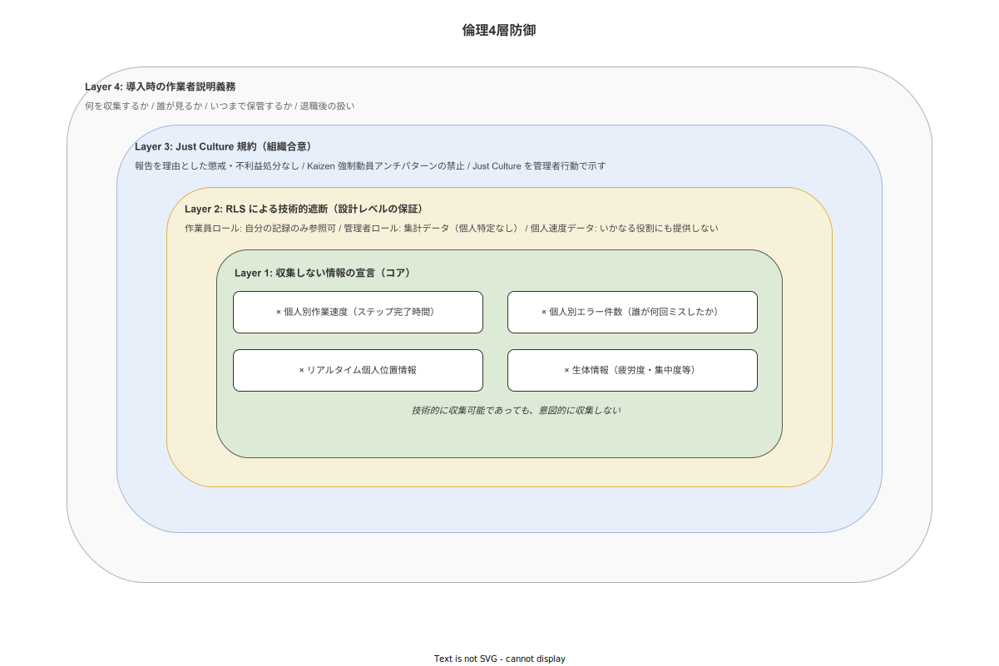

**主読者**: 経営層・品質保証担当・外部監査人・作業員  
**想定所要時間**: 25分

---

# 07 倫理スタンスと社会的責任

デジタルテイラリズム批判への明示的な応答章。「このシステムは作業員を監視するツールではないか」という正当な疑念に、技術的・組織的・倫理的な4層の応答を示す。

---

## 7.1 問いに向き合う：「これは監視ツールか」

製造現場へのデジタルツール導入に対して、作業員・労組・外部監査人から「監視ツールではないか」という問いが生じることは正当である。

デジタルテイラリズム（Digital Taylorism）とは、デジタル技術による作業者の細かい行動記録・監視・パフォーマンス管理が、Taylor の科学的管理法の現代版として作業者の自律性を侵食する現象である（[`90_業界分析/03_作業標準化と生産方式.md`](../../90_業界分析/03_作業標準化と生産方式.md) 参照）（[`90_業界分析/24_作業者プライバシー・データ倫理と労務監視.md`](../../90_業界分析/24_作業者プライバシー・データ倫理と労務監視.md) 参照）。Amazonの倉庫ピッキングシステムが典型例として批判されている。

本システムはこの問いに「このシステムは支援ツールであり、監視ツールではない」と答える。しかしこれを口頭の約束として残すことは不十分である。本章では、この立場を4層の具体的な設計・制度・宣言として示す。

## 7.2 Layer 1: 収集しない情報の宣言

本システムは技術的に収集可能であっても、以下の情報を意図的に収集・表示しない:

| 収集しない情報 | 理由 |
|---|---|
| 個人別の作業速度（ステップ完了時間の個人比較） | 速度ランキングはKaizen Teian の萎縮・記録隠しインセンティブを生む |
| 個人別のエラー件数（誰が何回ミスをしたか） | Just Culture の原則と相反し、報告を抑制させる |
| リアルタイムの個人位置情報 | 作業場所の監視は心理的圧迫を生み、就業規則・個人情報保護法上のリスクがある |
| 生体情報（疲労度・集中度等） | 個人の生体情報は特別な同意と管理体制が必要であり、Phase 1-2の設計スコープ外 |

（[`90_業界分析/24_作業者プライバシー・データ倫理と労務監視.md`](../../90_業界分析/24_作業者プライバシー・データ倫理と労務監視.md) 参照）

## 7.3 Layer 2: RLSによる技術的遮断

「口頭の約束」では不十分である。本システムは Row Level Security（RLS）を用いて、権限のない役割からは見えない情報をデータベースレベルで遮断する。

**作業員ロールが参照できる情報:**
- 自分自身の今日の作業記録（他の作業員の記録は見えない）
- 自分が投稿したKaizen Teian と管理者からの返答
- 手順書・工程マスタ

**管理者ロール（工場長・QA）が参照できる追加情報:**
- 工程別・日時別の集計データ（個人特定なし）
- 不適合・CAPAの管理画面
- 全Kaizen Teianの一覧

**経営ダッシュボードロールが参照できる追加情報:**
- 全社的な品質KPI集計（個人特定なし）

個人パフォーマンス評価・速度データへのアクセスは、いかなる役割にも設計しない。

（システム化計画の07章・05章に実装詳細を委ねる）

## 7.4 Layer 3: 導入時の作業者説明義務

本システムを導入する工場・現場管理者は、以下の説明を作業員全員に対して実施することを、導入プロセスの必須要件とする:

1. **何を収集するか**: 作業ステップの完了記録・写真・測定値・Kaizen Teian。収集しない情報のリスト（7.2参照）。
2. **誰が見るか**: 管理者・QA・監査対応のみ。人事・評価部門には渡らない。
3. **いつまで保管するか**: 品質記録として（法的要件に準じた期間）保管するが、個人識別データは最小限。
4. **退職したらどうなるか**: 退職後の個人識別データは法定期間後に削除するプロセスを設ける。

この説明を文書化し、作業員の確認サインを保管することを推奨する。

（[`90_業界分析/24_作業者プライバシー・データ倫理と労務監視.md`](../../90_業界分析/24_作業者プライバシー・データ倫理と労務監視.md) 参照）（個人情報保護法 第18条「利用目的の通知・公表」に対応する）

## 7.5 Layer 4: Just Culture 規約

導入工場は以下のJust Culture 規約を組織として採択することを推奨する。本規約はシステムの外部にある組織合意であるが、本システムが有効に機能するための前提条件である:

- 本システムへの記録・報告を理由とした懲戒・不利益処分は行わない
- 不適合報告を行った作業員を評価で不利に扱わない
- Kaizen Teian の投稿を理由とした嫌がらせ・圧迫は禁止する
- ただし故意の虚偽報告・記録改ざんは規律の対象となる

この規約は単なる「方針書」ではなく、工場長・製造部長が自らの行動で示すものである。

（[`90_業界分析/13_安全文化と安全管理システム.md`](../../90_業界分析/13_安全文化と安全管理システム.md) 参照）

## 7.6 関連規制・枠組みへの位置づけ

| 規制・枠組み | 本システムとの関係 |
|---|---|
| 個人情報保護法（不適正利用禁止）| 7.2〜7.4の設計が法第19条「不適正な利用の禁止」に対応する |
| GDPR（適用は社外サーバ利用時のみ） | 本システムは社内LANオンプレのため直接的な GDPR 対象外と判断する。ただし設計思想は GDPR の Privacy by Design 原則に沿う |
| EU AI Act | Phase 1 は AI 機能なしのため現時点では適用外と判断する。将来のAI拡張時には再評価が必要 |
| ISO 30414（HR開示ガイドライン） | 現時点では対象外と判断する。将来の多工場統合・HR統合時に再評価 |

（[`90_業界分析/36_AI・ML支援と知的作業ナビゲーション.md`](../../90_業界分析/36_AI・ML支援と知的作業ナビゲーション.md) 参照）

> **本節で確定した方針**
>
> 1. デジタルテイラリズム批判への応答として、収集しない情報の宣言・RLSによる技術的遮断・導入時説明義務・Just Culture 規約という4層の倫理設計を確定した。
> 2. 個人作業速度のパフォーマンス評価への転用はシステム設計レベルで不可能とする（RLS設計による技術的排除）ことを確定した。
> 3. 個人情報保護法不適正利用禁止・GDPR Privacy by Design原則・EU AI Actへの位置づけを明示し、規制変化に対応できる設計思想を確認した。
