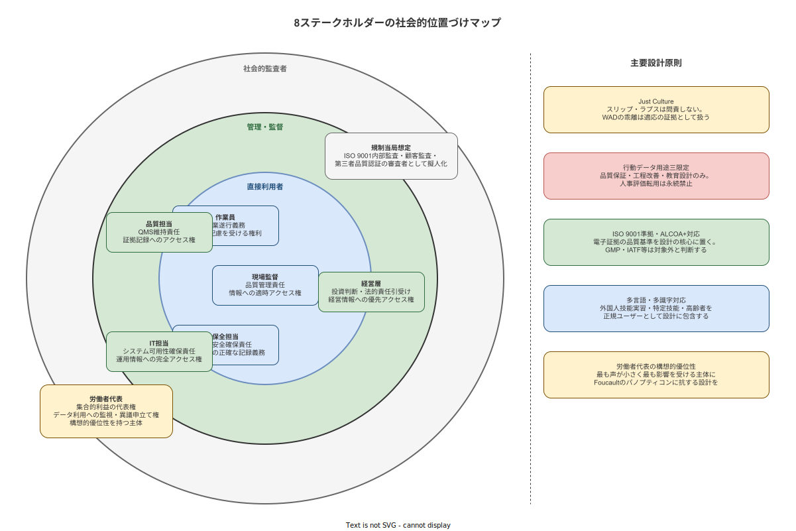

# 09 ステークホルダー全体像と社会的位置づけ

本章の責務は、本システムに関わる8種のステークホルダーが社会においていかなる立場・責任・権利を持つかを確定することである。計画書 01章が扱う「詳細関心軸・懸念・応答位置」には踏み込まない。本章が問うのは、それぞれのステークホルダーが社会的存在として何を引き受け、何を主張できる主体であるかという構造的問いである。さらに、本システムが中堅製造業の空白領域においていかなる社会的役割を担うかを確定し、外部社会との関係を位置づける。

---

## 1. 8ステークホルダーの社会的存在性

計画書 01章は8種のステークホルダーそれぞれの詳細な関心軸・懸念・本書の応答章との対応を扱う。本節はその前段として、各ステークホルダーが社会においていかなる根拠に基づいて存在し、何に対して責任を負い、何を権利として主張できるかを確定する。

### 作業員

作業員は労働契約に基づき、定められた手順・品質基準・安全規則に従って作業を遂行する義務を負う。この義務は雇用契約と就業規則によって法的に拘束される。同時に、作業員は労働安全衛生法（昭和47年法律第57号）に基づき、安全で健康な労働環境において作業する権利を持つ。機械や工具の安全状態の確保、有害物質への適切な管理、過重労働の防止は事業者が負う義務であり、作業員はこれを享受する権利の主体である。

加えて、作業員は個人情報保護法（令和3年改正）の保護を受ける主体として、自己の作業ログ・生産実績データがどのように収集・利用されるかについて説明を受け、不当な利用に異議を申し立てる権利を持つ。本システムが「誰が・いつ・どのステップを完了したか」を記録する性質上、この権利は制度設計の根幹に関わる（業界分析 24章参照）。

作業員はまた、合理的配慮を受ける権利の主体でもある。外国人技能実習生・特定技能労働者については育成就労制度（2024年入管法改正）の下で保護が強化されており、言語的障壁のある環境での正確な情報提供は合理的配慮の要素として位置づけられる（業界分析 34章参照）。

### 現場監督

現場監督は作業品質管理責任を負う。ISO 9001:2015 条項 5.3 は「関連する役割に対して、品質マネジメントシステムが適合している責任を割り当てる」ことを要求しており、現場監督はこの責任の実質的担い手となる。作業員の手順逸脱を発見・是正し、品質記録の正確性を確保する職務は、QMS における現場管理責任の核心である。

現場監督は職務遂行のために作業状況に関する情報へ適時アクセスする権利を持つ。進行中の作業の達成状況・品質検査の結果・工程内異常の発生をリアルタイムで把握できなければ、管理責任の遂行が不可能となる。情報へのアクセスは権利であると同時に、管理責任の前提条件でもある。

### 品質担当

品質担当は組織の品質マネジメントシステム（QMS）の維持責任を担う。ISO 9001:2015 が要求するQMSの「文書化した情報の管理」（条項 7.5）・「不適合の管理」（条項 8.7）・「内部監査」（条項 9.2）を実務的に運営する役割を持つ。

品質担当は証拠記録への完全なアクセス権を持つ。品質問題の原因分析・トレーサビリティの追跡・顧客クレームへの対応には、記録の完全性と正確性が前提条件となる。ALCOA+ 9原則（Attributable・Legible・Contemporaneous・Original・Accurate・Complete・Consistent・Enduring・Available）が定義する証拠品質の水準は、品質担当が正当に求める記録の要件水準として機能する（業界分析 22章参照）。

### 保全担当

保全担当は設備の安全確保責任を負う。労働安全衛生法に基づく定期自主検査（同法第45条）・特定自主検査の実施は法定義務であり、保全担当はその主要な実行者である。設備の故障・劣化を事前に検知して生産停止と事故を防ぐことは、作業員の安全と製品品質の両面から要求される職務である。

保全担当は保全履歴の正確な記録義務を持つ。過去の修理内容・部品交換履歴・定期点検の実施記録は、設備の現在状態を評価するための根拠であり、次回の保全計画の基礎となる。記録の欠落は設備状態の過信をもたらし、計画外停止・作業事故のリスクを高める。

### IT担当

IT担当はシステムの可用性確保責任を負う。作業ナビゲーションシステムがダウンすると生産活動そのものが停止するリスクがある環境において、インフラの安定稼働・バックアップの維持・セキュリティパッチの適用は IT担当が担う中核的責務である。

IT担当は運用情報への完全なアクセス権を持つ。システムログ・パフォーマンス指標・エラー履歴・ネットワーク状態への完全なアクセスなしに、適切な運用判断はできない。この完全アクセス権は、他のステークホルダーへのデータアクセス制限とは原理的に区別される技術的必要性に基づく。

### 経営層

経営層は投資判断と法的責任引受けの義務を負う。システム化への投資の可否・規模・優先順位の決断は経営層の専権事項である。同時に、システムに関連して発生した事故・品質問題・プライバシー侵害に対する最終的な法的責任は経営層が引き受ける。

経営層は経営情報への優先アクセス権を持つ。生産実績・品質指標・コスト構造についての集計情報は、投資対効果の判断と経営戦略の策定のために必要であり、経営層はその情報を適時に得る権利を持つ。ただし、この権利は個別作業員の行動データへの無制限アクセスとは区別されなければならない。

### 規制当局想定

本システムの現時点での導入環境において、厚労省・FDA・MHRA等の規制当局への電子記録提出義務は発生していない。この判断は計画書 03章で「対象外と判断する」として確定される。しかし、以下の3種の監査は現実的に発生しうる：①ISO 9001 内部監査、②第三者品質認証機関による審査、③顧客（発注企業）によるサプライヤー監査。

これら審査者を「規制当局想定」として擬人化する根拠は、これら審査者が問う基準が外部規制当局の問いと実質的に等価であることにある。ISO 9001 審査員が「この記録は Contemporaneous か」と問う際の基準は、FDA 監査官が21 CFR Part 11の適用文脈で問う基準と本質的に同じ論理構造を持つ（業界分析 22章参照）。

規制当局想定には、品質基準の遵守を審査する権限と、証拠提示を要求する権限がある。本システムが記録する作業ログ・検査結果・承認履歴は、これらの権限行使に対して応答する主要な証拠となる。このことが、証拠品質論（ALCOA+）の採用を「準拠」ではなく本書が採択する設計思想の根拠として位置づけることを正当化する。

### 労働者代表

労働者代表は、作業員の集合的利益を代表する権利と、データ利用への監視・異議申立て権を持つ。労働組合・従業員代表委員（労働契約法・労働基準法に基づく）は、個別交渉力を持たない作業員を集合的に代表し、雇用条件・労働環境の変化に対する組織的な発言権を持つ主体である。

**図 1: 8 ステークホルダーの社会的位置づけマップ**

> 原本: [`img/fig_stakeholder_society.drawio`](img/fig_stakeholder_society.drawio)

---

**本節で確定した方針**
- 8種のステークホルダーの社会的立場・責任・権利を確定し、計画書 01章の詳細関心軸記述の前提として本節が機能することを確定する。
- 「規制当局想定」の擬人化根拠を、現実的に発生する3種の監査と外部規制当局の論理的等価性に求めることを確定する。
- ALCOA+ の採用を「準拠」ではなく「証拠品質論の採択」として位置づけることを確定する。

---

## 2. 労働者代表の構想的優位性

なぜ本構想書は労働者代表を単なる8種の一員としてではなく、「構想的優位性を持つ」ステークホルダーとして扱うか。この問いに答えることは倫理的設計の根幹に関わる。

### 最も声が小さく最も影響を受ける主体

経営層とIT担当はシステム導入を「決断する側」にある。彼らはシステムを採択・拒否するアクターであり、導入プロセスに対して意思決定権限を持つ。これに対して作業員は「決断される側」にある。導入が決定されれば、日常業務の手順が変わり、自分の行動が記録され、新しいデバイスを操作することが義務づけられる。しかし、この決定に対する実質的な拒否権を作業員は持たない。

作業員が声を上げる手段として最も有効なのは労働者代表を通じた集合的交渉である。しかし日本の中小製造業においては、労働組合組織率が製造業全体（約20%）でも低く、未組織の場合は従業員代表が形式的に存在するのみであり、実質的な交渉力は限定される。この構造的非対称こそが、設計の段階で労働者代表の観点を優先的に内在化させる理由となる。

### Foucaultのパノプティコンと構造的非対称

Michel Foucault は *Surveiller et Punir* (監獄の誕生, 1975) においてJeremy Benthamが設計したパノプティコン（円形刑務所）を権力行使のモデルとして分析した。中央の監視塔から全囚人を見渡せるが、囚人は監視されているかどうかを確認できない構造が、被監視者の自己規律を内面化させる。

作業ナビゲーションシステムはこの論理と同型の構造をもたらす可能性がある。「誰が・いつ・どのステップを・何秒で完了したか」を記録するシステムにおいて、作業員はその記録がいつ・誰に・どのような目的で参照されているかを確認することができない。監視されているかもしれないという意識が常在する構造こそが、パノプティコン的権力の核心であり（Foucault, 1975）、この構造を技術的に内蔵するシステムを設計する側は、それに対する倫理的応答を設計に組み込む責任を負う。

### Just Transitionの観点

「公正な移行（Just Transition）」の概念は本来エネルギー転換・産業移行の文脈で発展してきたが、製造現場のデジタル化においても本質的に同じ問いが成立する。デジタル化の恩恵（生産効率向上・品質改善・トレーサビリティ確保）と負担（監視圧力・プライバシーリスク・スキル要求の変化）が均等に配分されているか、という問いである。

恩恵の受益者が経営層・顧客・品質担当である場合、負担を最も多く引き受けるのは作業員である。労働者代表はこの不均等な配分に対して集合的に異議を申し立てる正当な権利の主体として位置づけられる。

### 本システムが労働者代表の懸念に応答する構造

本システムは以下の連鎖的な構造によって労働者代表の懸念に応答する：
- 倫理スタンス（04章、別ファイル）での「支援/監視分離原則」の宣言
- 行動データ用途三限定（品質保証・工程改善・教育設計）の設計への組み込み
- 個人作業速度集計・ランキング・人事評価連携の技術的禁止
- 計画書 09章での労使合意プロセスの運用実装

この連鎖は、労働者代表が「これは監視ツールではない」と確信できる根拠を、宣言（構想）から実装（計画・要件定義）まで一貫したトレーサビリティで提供する。

---

**本節で確定した方針**
- 労働者代表の構想的優位性をFoucaultのパノプティコン論とJust Transitionの観点から正当化することを確定する。
- 倫理スタンス→データ用途三限定→技術的制約→制度的制約の連鎖が労働者代表の懸念への応答構造として機能することを確定する。
- 本節で示した構造は、09章以降の設計哲学の前提として機能することを確定する。

---

## 3. 規制当局想定のステークホルダー化

### 現時点での法定提出義務の不在

本システムの想定導入環境（中堅製造業・単一工場・社内LANのみ）において、以下の規制機関への電子記録提出義務が現時点で存在しないことを確認する：
- 厚生労働省：労働安全衛生関連の記録保管義務は存在するが、電子システムでの提出義務は発生していない
- FDA：日本国内のみで製造・販売する製品について21 CFR Part 11の適用義務はない
- MHRA：英国向け輸出製品については、想定導入環境（国内単一工場・社内LANのみ）では対象外と判断する

この判断は計画書 03章において「対象外と判断する」として技術的根拠とともに確定される。

### 現実的に発生する3種の監査

以下の3種の監査は想定導入環境においても現実的に発生しうる：

| 監査種別 | 実施主体 | 記録要求の根拠 |
|---|---|---|
| ISO 9001 内部監査 | 社内品質担当または外部審査員 | ISO 9001:2015 条項 9.2 |
| 第三者品質認証審査 | 認証機関（JQA・BSI 等） | 認証スキームの要求事項 |
| 顧客監査（サプライヤー監査） | 取引先品質部門 | 調達条件・購買仕様書 |

これらの審査者が問う基準は、その形式は異なっても本質的に同じ論理で構成される。「この記録は誰が・いつ・どの文脈で記録したか」（Attributable）、「記録は作業完了と同時に行われたか」（Contemporaneous）、「記録は改ざんされていないか」（Original・Enduring）という問いは、FDA監査官が問うそれと実質的に等価である（業界分析 22章参照）。

### 証拠品質論の採用という位置づけ

本システムがALCOA+ 9原則に「対応する」（「準拠する」ではない）根拠はここにある。ALCOA+はFDA規制の文脈で策定されたフレームワークであり、本システムはその適用義務を持つFDA規制業種を対象としない。しかし、ALCOA+が定義する「証拠の品質」という概念は、規制の有無にかかわらず記録の信頼性の普遍的な基準として機能する。

本システムは「規制要件への準拠」としてではなく「証拠品質論の採用」としてALCOA+の思想を設計に組み込む。これにより、将来の規制環境の変化・顧客監査要件の強化・第三者認証取得の際にも、記録の質を証拠として提示できる設計が維持される。

---

**本節で確定した方針**
- 現時点での規制当局への提出義務が存在しないことを確定し、現実的に発生する3種の監査への対応を本システムの設計要件として確定する。
- ALCOA+採用を「準拠」ではなく「証拠品質論の採択」として位置づけることを確定する。
- 規制当局想定を「擬人化した審査基準の担い手」として本構想のステークホルダー構造に含めることを確定する。

---

## 4. 本システムの社会的役割

### 中堅製造業 IT 空白領域への参入という社会的意義

中小企業庁の調査（中小企業白書2023年版）によれば、中小製造業における現場作業の記録・管理の電子化率は約35%にとどまる。グローバルMES（製造実行システム）は大手製造業を主対象としてコスト・導入期間・カスタマイズ要件において中堅製造業には過大設計であり、クラウドSaaS型作業ナビは情報越境リスク・稟議文化・社内LAN信仰から採択されにくい（業界分析 30章参照）。

この空白領域は単なる市場機会ではなく、社会的に埋めるべき品質・安全の基盤の欠缺でもある。作業手順の口頭伝承・紙帳票への依存が続く工場では、品質問題の原因追跡が困難であり、熟練工退職後の技能継承が途絶するリスクが高い。本システムが中堅製造業のIT空白領域に参入することは、個社の競争力向上を超えた社会的品質基盤の底上げとして位置づけられる。

### 外国人技能実習生・特定技能労働者への公正な労働環境への寄与

2023年10月時点で外国人労働者は204万人を超え、製造業はその最大受け入れ業種のひとつである（厚生労働省, 2024）。ベトナム（約51万人）・中国（約39万人）・フィリピン（約22万人）・ブラジル（約13万人）の労働者が製造現場に広く分布している。

外国人労働者が日本語の複雑な作業手順書を理解できない状態で危険作業に従事することは、安全上・倫理上の問題である。認知負荷理論（Sweller, 1988）の観点から、外国語テキストの解読に認知資源を消費する外国人労働者は、作業そのものへの集中力が低下しエラー率が上昇する（業界分析 34章参照）。本システムが多言語対応・ピクトグラム優先・ふりがな表示を設計基盤として組み込むことは、外国人労働者の安全で公正な労働環境への具体的な寄与となる。

2024年入管法改正による育成就労制度の創設は、外国人労働者の権利保護を強化する方向への政策転換を示しており、本システムの多言語対応設計はこの社会的変化と整合する。

### DX推進という国家政策との整合

経済産業省「DX推進ガイドライン」（2019年策定、2022年改訂）が示す製造業DXの方向性は、現場データのデジタル化を起点とした業務改善と品質向上に重点を置く。本システムが実現する作業記録の電子化・リアルタイム品質管理・トレーサビリティ確保は、この政策方向と本質的に整合する。ただし、特定の補助金受給や政策申請への言及は本構想書の責務外であり、計画書 10章以降に委ねる。

### 中小製造業の品質証拠文化の定着への貢献

ISO 9001認証取得を目的とした「記録のための記録」ではなく、作業の事実を継続的に記録することが品質問題解決と工程改善に活用される「品質証拠文化」の定着は、認証の有無を超えた組織能力の向上を意味する。本システムは認証取得を目的として設計するのではなく、品質証拠文化の日常的実践を支援するツールとして位置づけられる。この位置づけが、認証のための形式的記録と、実態の工程改善に貢献する記録とを分けるものである。

---

**本節で確定した方針**
- 本システムの社会的役割を中堅製造業IT空白領域の充足・外国人労働者の公正な労働環境・品質証拠文化の定着として確定する。
- 外国人労働者への多言語対応設計を「合理的配慮」として倫理的に正当化することを確定する。
- 認証取得を目的としない品質証拠文化の定着支援を本システムの社会的意義として確定する。

---

## 5. 外部社会との関係

### 補助金制度との関係

IT導入補助金・ものづくり補助金等の公的支援制度については、本システムが生成・管理する電子記録データが申請根拠として活用できる可能性がある。ただし、特定の補助金への適合保証・申請支援・採択の約束は本構想書の責務外である。補助金制度の活用可能性は計画書 10章以降で検討される事項であり、本構想は約束しない。

なお、業界分析 30章が指摘するとおり、補助金申請のための事業計画書作成・事後報告の行政コストが中小企業にとって実質的なハードルとなる場合があることを認識しており、本システムの設計はこのコストに配慮した導入容易性を品質特性として重視する。

### DX認定制度との関係

経済産業省のDX認定制度（情報処理促進法に基づく）は、デジタル経営を宣言する企業を認定する制度である。本システムを活用した現場データのデジタル化・プロセス改善の実績は、DX認定申請における実績記録として記録可能である可能性がある。ただし、DX認定の取得・維持を本システムが保証するものではなく、この可能性は約束ではない。

### サプライヤー監査への対応

顧客からのサプライヤー監査においては、作業記録・検査記録・是正処置の記録を電子的に提示できる能力が求められる場面が増加している。本システムが管理する電子記録は、このような監査要求に対して構造化された形式で応答できる設計を持つ。これは「監査に強い記録」を目的として設計するのではなく、「証拠品質の高い記録」を日常的に維持した結果として監査対応力が生まれるという設計思想の自然な帰結である。

### 将来の法人化・SI調達可能性

個人開発段階での本システムが将来的に法人化・SI経由の間接販売モデルへ移行する可能性については、業界分析 30章が分析する国内製造業IT調達慣行（RFI→RFP→PoC→本番導入→横展開という典型的フロー）を念頭に置いた設計の堅牢性が求められる。この可能性の詳細な検討は計画書 11章に委ねる。本構想書はSI調達可能性を否定しないが、現時点での個人開発前提を変更するものでもない。

---

**本節で確定した方針**
- 補助金制度・DX認定制度との関係を「可能性の存在」として位置づけ、保証・約束をしないことを確定する。
- サプライヤー監査への対応力を「証拠品質文化の結果」として位置づけ、監査対応を目的化しないことを確定する。
- 将来の法人化・SI調達可能性の詳細検討を計画書 11章に委ねることを確定する。

---

## 参照業界分析

### 必須

- [`90_業界分析/24_作業者プライバシー・データ倫理と労務監視.md`](../../90_業界分析/24_作業者プライバシー・データ倫理と労務監視.md) — Foucaultのパノプティコン論・GDPR・OECD8原則・労務監視研究の総括。本章 H2-2 の倫理論拠の学術的基盤
- [`90_業界分析/30_国内製造業IT調達慣行とSI構造.md`](../../90_業界分析/30_国内製造業IT調達慣行とSI構造.md) — 中小製造業のIT電子化率・SaaS選択忌避構造・補助金制度の実態。本章 H2-4 の社会的意義の根拠
- [`90_業界分析/34_多言語化・外国人労働者と読み書き能力差.md`](../../90_業界分析/34_多言語化・外国人労働者と読み書き能力差.md) — 外国人労働者の就労実態・認知負荷理論・育成就労制度。本章 H2-4 の公正な労働環境論拠
- [`90_業界分析/22_規制別トレーサビリティ要件詳論.md`](../../90_業界分析/22_規制別トレーサビリティ要件詳論.md) — ALCOA+ 9原則・業界横断の記録要件・証拠品質論。本章 H2-3 の擬人化根拠

### 関連

- [`90_業界分析/13_安全文化と安全管理システム.md`](../../90_業界分析/13_安全文化と安全管理システム.md) — Just Cultureと安全文化の基礎理論。労働者代表の懸念応答の思想的基盤
- [`90_業界分析/37_シフト・夜勤・疲労管理と高齢化労働力.md`](../../90_業界分析/37_シフト・夜勤・疲労管理と高齢化労働力.md) — 高齢労働者・夜勤シフトでの認知能力と多言語対応の交差点
