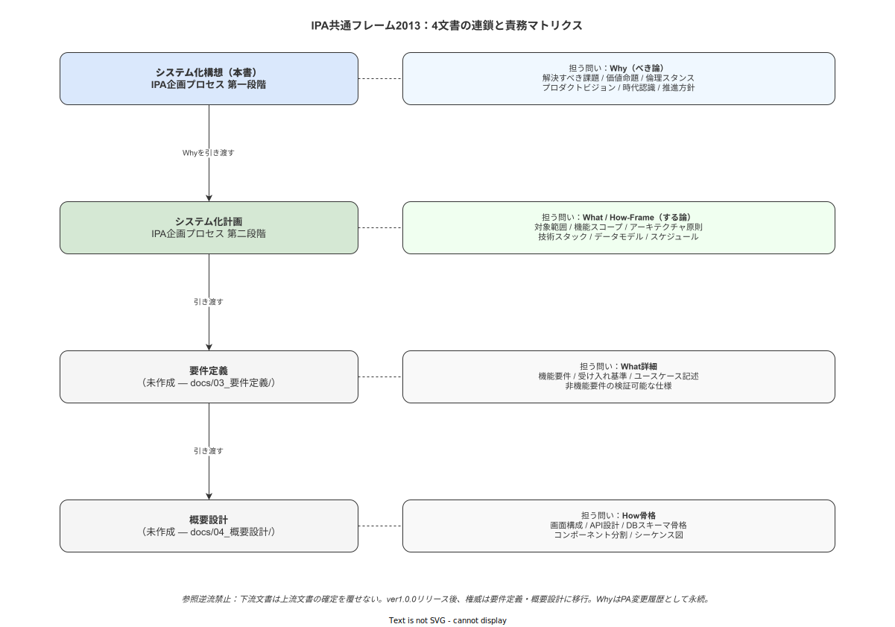

# 10 構想・計画・要件定義・概要設計の関係

本章の責務は、システム化構想・システム化計画・要件定義・概要設計という4つの文書の関係を確定することである。各文書が担う責務・権威・参照方向を明示し、文書間の越境と逆流を防ぐ境界を宣言する。これにより、構想書の Why 宣言が計画書の What/How-Frame に変換され、さらに要件定義・概要設計へと連鎖する知識形成の論理的秩序を確立する。

---

## 1. IPA共通フレーム2013における企画プロセスの定義

### SLCP-JCF2013の企画プロセス構造

IPA（独立行政法人情報処理推進機構）が2013年に策定したソフトウェアライフサイクルプロセスの国際標準（SLCP-JCF2013）は、ソフトウェア開発の全工程を体系的に定義する。その「企画プロセス」は、経営上の問題または機会を認識してシステム化の方向性を確定するプロセスとして位置づけられ、以下の2段階に分かれる（IPA, 2013）。

**システム化構想プロセス**は「システム化を必要とする理由・目的・目標・利用環境・前提・制約・導入可能性」を確定する。つまり「なぜシステム化が必要か」「どのような課題を解決するか」「誰のために作るか」「どのような環境で使われるか」という問いに答え、Yes/No の判断根拠を経営層に提供する。この段階の成果物が本書（システム化構想）である。

**システム化計画プロセス**は「システム化計画、システム要件の定義、システム要求事項の定義」を確定する。つまり「何を作るか」「どの範囲を対象とするか」「どのような技術枠組みで実現するか」という問いに答え、開発チームに具体的な方向性を与える。この段階の成果物がシステム化計画書（`docs/02_企画/システム化計画/`）である。

### 4文書の連鎖

本プロジェクトにおける4文書の知識形成連鎖は以下のように定義される：

| 順序 | 文書 | 答える問い | 権威の性格 |
|---|---|---|---|
| 1 | システム化構想（本書） | Why — なぜ作るか | 思想的権威・倫理的宣言 |
| 2 | システム化計画書 | What/How-Frame — 何を・どのような枠組みで | 方針的権威・設計根拠 |
| 3 | 要件定義書 | What詳細 — 機能要件・受け入れ基準 | 仕様的権威・合意基盤 |
| 4 | 概要設計書 | How骨格 — 画面・API・DBスキーマ | 実装的権威・設計仕様 |

この連鎖において、上流文書が確定した判断は下流文書を拘束する。逆流——下流文書が上流文書の結論を覆すこと——は設計根拠のトレーサビリティを破壊するため禁止される。

### 本書（構想）の責務の限定

本書の責務は Why の確定に限定される。Carroll の Minimalist Design が「行動志向・最小化・足場」を原則として手順書から不要な情報を排除するように（Carroll, 1990）、構想書もまた What/How の先取りを禁じる自己規律を持つ。この規律が崩れると、Why の議論が仕様論争に変質し、構想書本来の役割が失われる。

---

**本節で確定した方針**
- SLCP-JCF2013の企画プロセス（構想プロセス・計画プロセス）の定義を本プロジェクトの文書体系の基礎として確定する。
- Why→What/How-Frame→What詳細→How骨格という4文書の連鎖を確定する。
- 本書（構想）の責務をWhy確定に限定し、What/How-Frameは計画書に委ねることを確定する。

---

## 2. 構想が計画に引き渡すもの

構想書が確定した各 Why は、計画書の対応する章が「受け取り手」として展開する。この対応関係を明示することで、Why 宣言が計画書でいかに具体化されるかのトレーサビリティが保証される。

### Why→計画書 章の対応マトリクス

| Why の番号 | Why の内容 | 引き渡す形式 | 計画書の受け取り章 | 計画書での展開形式 |
|---|---|---|---|---|
| Why ① | 解決すべき課題 | 課題の構造的記述・現状の問題化 | 03章（機能スコープと非スコープ） / 04章（ユースケースとシナリオ） | 機能要件の根拠・ユースケースの動機として展開 |
| Why ② | 価値命題と提供価値 | ステークホルダー別の価値の宣言 | 01章（ステークホルダーと価値仮説） | 各ステークホルダーへの価値仮説として定量化 |
| Why ③ | 倫理スタンスと設計哲学 | データ用途三限定・支援/監視分離・Just Cultureの宣言 | 09章（運用・組織・教育方針） | 倫理の運用実装・データアクセスポリシー・RBAC設計として展開 |
| Why ④ | プロダクトビジョン | ビジョンの宣言と設計哲学の方向性 | 05章（アーキテクチャ原則） / 06章（データモデル中核設計） | アーキテクチャ選択の根拠・ALCOA+対応データ設計思想として展開 |
| Why ⑤ | 時代認識・経営環境 | 市場構造・労働力変化・DX政策の認識 | 02章（対象範囲とビジネス目標） | ビジネス目標の背景・ターゲットセグメントの根拠として展開 |
| Why ⑥ | 推進方針・開発哲学 | 個人開発・phase なし・完璧を目指す姿勢の宣言 | 10章（開発スケジュールと意思決定プロセス） | マイルストーン設計・リリース基準の思想として展開 |

### 引き渡しの原則

この引き渡しは一方向である。Why を確定してから What/How を決めるという知識生成の順序は、SOP設計論における「目的とスコープを最初に定める」原則（業界分析 25章参照）と同型の論理を持つ。作業指示書でも同様に、手順の根拠（なぜその順序か・なぜその値か）が先に確定されてからステップが設計されるべきであり、この設計論理がシステム開発の文書体系においても妥当する。

Why の宣言は計画書の What/How-Frame を拘束するが、その拘束は原則を定めるものであり、具体的な実装手段を指定するものではない。例えば、Why ③（倫理スタンス）の「支援/監視分離原則」は計画書 09章の運用方針を倫理的に拘束するが、その技術的実現方法（RBAC設計・アクセスログ・画面設計）は計画書・要件定義が決定する事項である。

---

**本節で確定した方針**
- 6つのWhyそれぞれが計画書の対応章に引き渡す内容とその展開形式を確定する。
- Why→What/How-Frameの引き渡しは一方向であり、計画書から構想へ逆参照することを禁止することを確定する。
- Whyは計画書の原則を拘束するが実装手段を指定しないことを確定する。

---

## 3. 計画が要件定義に引き渡すもの

### 構想は要件定義に直接介入しない原則

構想書は要件定義書に直接介入しない。Why が確定した後は、計画書の What/How-Frame を経由して要件定義に引き継がれる。この原則を破ることは、設計根拠の連鎖を短絡させ、計画書の役割を形骸化させる。

構想→計画→要件定義というパスを経由することの意味は、各段階での適切な検討の積み重ねにある。例えば、Why ①「記録の事後性という課題」が計画書 03章で「作業ステップ完了時のリアルタイム記録機能」というスコープとして定義され、要件定義書で「ステップ完了ボタンのタップから3秒以内にサーバへ記録が送信されること」という受け入れ基準に変換される。この連鎖の各段階が欠けると、要件の根拠が失われる。

### 要件定義が扱うこと

要件定義書（`docs/03_要件定義/`配下、現時点で空）は以下を扱う：

- 機能要件の詳細：画面ごとの入力・出力・バリデーションルール・エラー処理
- ユースケース記述：ユーザーの操作シナリオと期待する応答の詳細
- 受け入れ基準：テストケースの形式で記述された完了条件
- 非機能要件の定量化：計画書 08章が方針として定めた性能・可用性・セキュリティの具体的数値

計画書が「方針」として定めた事項を、要件定義書が「基準」として定量化する。例えば計画書が「ALCOA+ に対応する記録設計とする」と方針として定めた場合、要件定義書では「タイムスタンプはサーバ時刻を使用し、端末時刻は参考値として記録する。サーバ時刻とのズレが1分を超える場合は同期エラーとして記録する」という具体的な受け入れ基準として定量化される。

### 概要設計が扱うこと

概要設計書（`docs/04_概要設計/`配下、現時点で空）は以下を扱う：

- 画面構成：画面遷移図・ワイヤーフレーム・UIコンポーネント定義
- API設計：エンドポイント定義・リクエスト/レスポンス形式・認証フロー
- DBスキーマ骨格：テーブル定義・リレーション・インデックス設計の骨格

概要設計は計画書のアーキテクチャ原則（05章）を具体的な技術実装の骨格として展開する。Rust + axum + tokio + sqlx のバックエンド実装、React Nativeのタブレットアプリ、PostgreSQLのデータモデルの骨格は、計画書の原則を受けた概要設計が定義する領域である。

---

**本節で確定した方針**
- 構想書は要件定義書に直接介入せず、計画書を経由する一段階ごとの連鎖を確定する。
- 要件定義書が扱う「詳細な機能要件・ユースケース・受け入れ基準」と概要設計書が扱う「画面・API・DBスキーマ骨格」を確定する。
- 計画書の「方針」が要件定義書の「基準」として定量化される変換の構造を確定する。

---

**図 1: IPA 共通フレーム 2013 内の文書連鎖と責務マトリクス**

> 原本: [`img/fig_ipa_position.drawio`](img/fig_ipa_position.drawio)

## 4. 構想・計画・要件定義・概要設計の責務マトリクス

### 4文書の責務・権威・参照方向の整理

| 項目 | システム化構想 | システム化計画書 | 要件定義書 | 概要設計書 |
|---|---|---|---|---|
| **主な問い** | なぜ作るか（Why） | 何を・どの枠組みで（What/How-Frame） | 何を・どう検証するか（What詳細） | どう実装するか骨格（How骨格） |
| **権威の性格** | 思想的・倫理的権威 | 方針的権威 | 仕様的権威 | 実装的権威 |
| **確定する内容** | 課題・価値命題・倫理・ビジョン・時代認識・推進方針 | 機能スコープ・アーキテクチャ原則・データモデル・技術スタック・スケジュール | 機能要件詳細・ユースケース・受け入れ基準 | 画面設計・API定義・DBスキーマ骨格 |
| **参照する上位文書** | なし（最上位文書） | 構想書 | 計画書 | 要件定義書 |
| **参照される下位文書** | 計画書・要件定義書・概要設計書 | 要件定義書・概要設計書 | 概要設計書 | なし（実装の根拠） |
| **更新のトリガー** | 世界観前提の根本変化のみ | 機能追加・技術変更・スコープ変更 | ユースケース追加・受け入れ基準変更 | 画面変更・API変更・スキーマ変更 |

### 参照逆流の禁止

下流文書は上流文書の結論を覆してはならない。この原則を「参照逆流の禁止」として宣言する。具体例として：

- 概要設計書が「この倫理制約は実装困難なので除外する」と判断することは禁止される。倫理制約は構想書の Why ③（倫理スタンス）として確定されており、概要設計書はその実装方法を選択できるが除外はできない。
- 要件定義書が「この機能要件は計画書のスコープ外だが追加する」と判断する場合は、計画書を先に更新し、下流への伝播として要件定義書を更新する順序が必要となる。

### 変更手続き

スコープ変更（機能追加・機能削除）は以下の手続きを踏む：
1. 変更が Why に影響する場合：構想書を先に更新し、計画書→要件定義書→概要設計書へ伝播
2. 変更が What/How-Frame に影響する場合：計画書を先に更新し、要件定義書→概要設計書へ伝播
3. 変更が What詳細のみに影響する場合：要件定義書を先に更新し、概要設計書へ伝播
4. 変更が How骨格のみに影響する場合：概要設計書のみ更新

---

**本節で確定した方針**
- 4文書の責務・権威・参照方向をマトリクスとして確定する。
- 参照逆流の禁止を原則として確定し、下流文書が上流文書の結論を覆すことを禁止することを確定する。
- 変更手続きの順序（上流から更新し下流へ伝播）を確定する。

---

## 5. 構想の有効期限と更新条件

### 有効期限：権威の移行

本書の実行的権威は ver1.0.0 リリースをもって要件定義書・概要設計書へ移行する。リリース後の具体的な設計判断は、より精緻に記述された下流文書が担い、本書は「なぜこのシステムが作られたか」を説明するアーカイブ的文書として機能する位置づけに変化する。

ただし、この権威移行は Why 宣言の失効を意味しない。倫理スタンスの宣言・価値命題の確定・時代認識の記録は、ver1.0.0 リリース後も「この設計の根拠はこの宣言にある」という照合の基準として機能し続ける。

### 永続する Why 宣言

Why の宣言そのものは変更履歴として永続する。設計思想の変遷がトレーサブルであることは、長期にわたるシステム保守・機能追加の判断において不可欠な参照基盤となる。「ver1.0.0 時点では倫理的にこう判断していた」という記録は、将来の判断変更の際の前提明示として機能する。

### 更新すべき条件

本書の Why 宣言を更新するのは、以下の「世界観前提の根本変化」が発生した場合に限定する：

| 更新すべき状態 | 具体例 |
|---|---|
| 外部規制が中小製造業に根本的変化をもたらした場合 | トレーサビリティ記録の電子提出が法定義務となった場合 |
| 労働市場構造が根本的に変化した場合 | 外国人労働者が製造現場の過半数を占める状態が法的に新たな義務を生む場合 |
| オンプレミス環境の社会的前提が崩れた場合 | 社内LAN信仰が崩れSaaS採択が中小製造業の標準となった場合 |
| 倫理的前提が社会的に根本変化した場合 | データ利用に関する法規制が抜本的に強化され設計思想を変更せざるを得ない場合 |

### 更新してはならない条件

以下の変化は本書の更新対象外である。これらは計画書以下の文書を更新することで対応する：

| 更新してはならない状態 | 対応すべき文書 |
|---|---|
| 機能追加・削除 | システム化計画書 03章（機能スコープ）を更新する |
| 技術スタックの変更（例：別のRustフレームワークへの移行） | システム化計画書 05章・07章を更新する |
| スケジュール変更・マイルストーン変更 | システム化計画書 10章を更新する |
| 非機能要件の定量値変更 | システム化計画書 08章・要件定義書を更新する |
| バグ修正・リファクタリング | 要件定義書・概要設計書を更新する |

この区別は業界分析 30章が指摘する製造業ITの「レガシー化」問題——稼働したシステムが業務に深く組み込まれて変更できなくなる問題——と同じ構造を文書体系においても予防するためのものである。構想書の Why 宣言を安定させることで、下流文書の変更が構想の根拠を揺るがさない設計上の独立性が保たれる。

---

**本節で確定した方針**
- 構想書の実行的権威はver1.0.0リリース後に下流文書へ移行するが、Why宣言は変更履歴として永続することを確定する。
- 更新すべき条件を「世界観前提の根本変化」に限定し、機能追加・技術変更・スケジュール変更は計画書以下で対応することを確定する。
- 下流文書の頻繁な変更が構想書のWhy宣言を揺るがさない文書的独立性を確定する。

---

**図 1: IPA 共通フレーム 2013 内の文書連鎖と責務マトリクス**

> 原本: [`img/fig_ipa_position.drawio`](img/fig_ipa_position.drawio)

## 参照業界分析

### 必須

- [`90_業界分析/30_国内製造業IT調達慣行とSI構造.md`](../../90_業界分析/30_国内製造業IT調達慣行とSI構造.md) — 製造業ITシステムの文書体系・仕様変更の実態・レガシー化の構造。本章のあるべき文書体系の社会的背景
- [`90_業界分析/25_作業指示書とSOPの構造化・表現論.md`](../../90_業界分析/25_作業指示書とSOPの構造化・表現論.md) — CarrollのMinimalist Design・SOPの目的と手順の分離。本章の文書責務分離の設計論拠

### 関連

- [`90_業界分析/29_競合製品と作業ナビ・MES・eBR市場.md`](../../90_業界分析/29_競合製品と作業ナビ・MES・eBR市場.md) — MES・作業ナビの設計文書体系の市場標準的位置づけ
