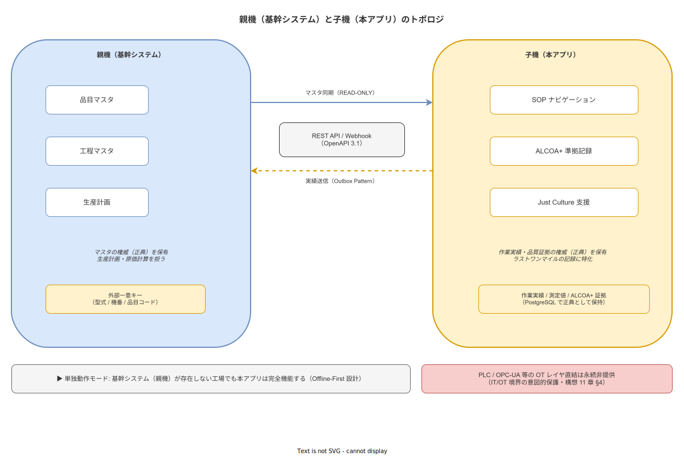

# 12 外部世界との接点と子機としての社会的位置づけ

本章の責務は、本構想書の01〜11章が積み上げてきた「なぜこのシステムが必要か」という Why 層の外側に開く新たな問い——「本アプリは社会の中でどの立ち位置に立つか」——に答えることである。
基幹システム（ERP / MES / 生産管理パッケージ）を保有する工場と保有しない工場の双方に対して本アプリがどう振る舞うかを、構想レベルの思想として確定する。
仕様的詳細（API スキーマ・同期プロトコル・認証設計等）は計画 12 章（外部システム連携アーキテクチャ）に委任する。

---

## 0. 本章の位置づけ

本章は 2026-05-17 改訂として追加された章である。
構想書 00〜11 章の完成後、ver1.0.0 で「基幹システムの子機として REST API 経由で連携する子機モード」を正式提供する方針が確定し、構想レベルでの思想的位置づけが新たに必要となった。
構想の完成後に章が追加されることは稀であるが、本アプリが社会の IT 生態系の中に占める立ち位置を明示しないまま子機モードを設計判断として下すことは、00 章（本書の位置づけと問いの境界）が確定した「Why の確定前に What/How を先取りしない」原則に反する。
したがって本章の追加は構想書の補完改訂として正当である。

構想 00 章が確定した「Why の確定前に What/How を先取りしない」原則に照らせば、子機モードという設計判断は Why の問いへの回答を伴わなければならない。
本章はその問いと回答を担う。

本章が答える中心的な問いは次の一文に集約される。「ERP/MES を持つ工場と持たない工場に対して、本アプリはどう振る舞うか。」
この問いは導入可能性の拡大という実利的問いではなく、本アプリが社会の IT 生態系の中でどの役割を引き受け、どの役割を意図的に引き受けないかという思想的問いである。
これに答えることで、本アプリが「外部世界との接点」においてどの姿勢を取るかを構想レベルで確定する。

本章の責務は Why（思想）の確定に限定される。
What（仕様）は計画 12 章（外部システム連携アーキテクチャ）への委任であり、How（実装）は概要設計書・詳細設計書への委任である。
本章がこれら下位の文書を先取りする場合は、委任関係の逸脱として判断する。

---

**本節で確定した方針**
- 本章を 2026-05-17 改訂として追加し、子機モードの思想的位置づけを構想レベルで確定することを確定する。
- 本章が答える中心的な問いを「ERP/MES を持つ工場と持たない工場に対して本アプリはどう振る舞うか」に限定することを確定する。
- Why（思想）は本章、What（仕様）は計画 12 章、How（実装）は概要設計書・詳細設計書への委任関係を確定する。
- 構想 00 章の「Why の確定前に What/How を先取りしない」原則との整合を本章においても維持することを確定する。

---

## 1. 中堅製造業の生産管理保有実態と旧宣言の限界

構想 02 章は構造的課題の特定において、中小・中堅製造業が「ERP/MES を持たない」前提から問いを立てた。この前提は本構想書が対象とする空白領域を定義するうえで有効な枠組みを提供し、00〜11 章の思想的基盤として機能してきた。

しかしながら、この前提は中堅製造業の実態を完全には反映していない。従業員 50〜300 名規模の中堅製造業においては、ERP・MES・生産管理パッケージ等の基幹システムを何らか保有している割合が相当数に達する（業界分析 30 章参照）。市販の生産管理ソフトウェア・自社構築の Excel ベース生産管理・国内大手パッケージ（PCA 生産管理・弥生製造・Factory-ONE 等）を含めれば、この割合はさらに高い。

旧宣言——「ERP/MES 非保有前提」——は結果として、基幹システムを持つ工場に対して「導入不可」という印象を与えることになる。これは単なる市場機会の喪失ではなく、「品質証拠文化の欠缺」という社会的問題への応答として本アプリが提供できる価値を、不必要に制限する損失である。

旧宣言が生まれた背景には二つの正当な理由があった。一つは個人開発スコープの超過懸念であり、もう一つは双方向統合の複雑性（変換ロジック・衝突解決・トランザクション整合性等）が個人開発の保守可能な範囲を超えるという判断であった。これらの背景は依然として有効である。双方向統合——親機と本アプリが同一データを相互に更新し合う関係——は、競合解決アルゴリズムの設計・テスト・保守のコストが膨大であり、単一開発者が品質を維持できる水準を超えることは明白である。

しかし、「子機として受け取るだけ」の片方向連携——親機からマスタを受信し、本アプリから実績イベントを送信する非対称な関係——であれば、この複雑性を根本的に回避できる。親機の業務ロジックを本アプリが実装する必要はなく、親機のデータを本アプリが書き換える必要もない。この非対称性こそが、個人開発のスコープ内で連携を実現する鍵である。マスタ同期は「親機が提供する REST API から品目・工程データを取得して本アプリのローカル DB に保持する」という単純な読み取り操作に帰結し、実績送信は「本アプリが生成した実績イベントを親機の受信 API に POST する」という単純な書き込み操作に帰結する。

本章は旧「やらない宣言」の中から「ERP/MES との統合」部分を改定し、「親機/子機の非対称連携」として再定義することを宣言する。この改定は旧宣言の背景（双方向統合の複雑性への警戒）を否定するものではなく、その警戒を保ちながら実現可能な範囲を正確に描き直すものである。旧宣言が守ろうとした「個人開発の保守可能性」と「品質への妥協禁止」は本改定においても完全に維持される。

---

**本節で確定した方針**
- 中堅製造業（従業員 50〜300 名規模）における基幹システム保有実態を踏まえ、旧「ERP/MES 非保有前提」が導入障壁を不必要に生んでいたことを認め、改定の正当性を確定する。
- 双方向統合の複雑性への警戒は維持しつつ、片方向・非対称な親機/子機連携が個人開発のスコープ内で実現可能であるという判断を確定する。
- 旧「やらない宣言」における「ERP/MES との統合」部分を「親機/子機の非対称連携」として再定義することを確定する。
- 改定後も「個人開発の保守可能性」と「品質への妥協禁止」が維持されることを確定する。

---

## 2. 親機/子機メタファの採用根拠

本節は「なぜ連携・統合・シームレス化という言葉を使わず、親機/子機という非対称な関係を選ぶか」という問いに答える。このメタファの選択は語彙的な好みではなく、本アプリの設計思想と責務の境界を正確に表現するための判断である。

親機とは、品目マスタ・工程マスタ・生産計画の権威的情報源である。ERP・MES・生産管理パッケージがこの役割を担う。親機は工場全体の物の流れ・コスト・計画を管理する。

子機とは、作業現場における実績・記録・ナビゲーションの権威的情報源である。本アプリがこの役割を担う。子機は「今ここで何が起きたか」を正確に記録し、作業者の行動を支援する。

「連携」や「統合」というメタファは対等な関係を示唆し、双方が相互に影響し合うことを含意する。しかし本アプリが求める関係は対等ではなく意図的に非対称である。その非対称性は以下の四点に現れる。

**第一に、親機の業務ロジックを代替しない。** 生産計画算出・原価計算・工程バランシング・需給調整等は親機の責務であり、本アプリがこれらを代替する機能を持つことは設計目標ではない。

**第二に、親機のデータを書き換えない。** 本アプリが親機に送信できるのは実績イベント（何を・いつ・誰が・どのステップで完了したか）の通知である。親機の品目マスタ・工程マスタ・計画データへの直接書き込みは行わない。

**第三に、マスタの権威は親機にある。** 外部一意キー（型式・機番・品目コード等）と作業パターン（工程→作業→Step の階層）の定義権限は親機にある。本アプリは親機から受け取ったマスタをローカルに保持し利用するが、そのマスタの正当性を独自に判断しない。

**第四に、本アプリが権威を持つのは「作業現場で何が起きたか」だけである。** この権威の範囲こそが本アプリの固有価値であり、この範囲を超えて権威を主張することは本アプリの責務を逸脱する。

二つの情報源は相補的な関係にある。親機が持てないのは「作業者が実際に何をどの順序でいつ行ったか」という現場レベルの品質証拠である。本アプリが持てないのは「何を生産する計画で、どの品目が何の原価構造を持つか」という工場全体の計画情報である。この相補性こそが親機/子機連携の本質的価値を生む。一方が他方を「吸収」あるいは「代替」しようとした時点で、それぞれの専門性が損なわれる。

この相補性の論理は、IT システム設計における「単一責任の原則」と同じ構造を持つ。一つのシステムが複数の権威的情報源を兼ねようとすると、いずれの責務も中途半端になる。親機が「作業実績の記録管理」を兼ねようとした場合に現場適合性が低下し、本アプリが「生産計画管理」を兼ねようとした場合に複雑性が増大する、という非対称な不均衡を回避するためにも、親機/子機の役割分担は論理的必然である。

子機モードを採用した場合でも、単独動作モードで本アプリが提供する中核価値——作業ナビゲーション・ALCOA+ 準拠の実績記録・トレサビデータの保全——は損なわれない。モードの選択は導入工場の IT 環境に依存するが、本アプリの中核価値はいずれのモードでも等価に提供される。

**図 1: 親機（基幹システム）と子機（本アプリ）のトポロジ**

> 原本: [`img/fig_parent_child_topology.drawio`](img/fig_parent_child_topology.drawio)

---

**本節で確定した方針**
- 「親機/子機」という非対称メタファを、本アプリの設計思想と責務境界を正確に表現するものとして採用することを確定する。
- 親機の業務ロジックの代替・親機データの書き換えを行わないことを構想レベルの設計原則として確定する。
- マスタの権威は親機に、作業現場実績の権威は本アプリに帰属するという責務の非対称性を確定する。
- 単独動作モードと子機モードの双方において本アプリの中核価値が等価に提供されることを確定する。

---

## 3. 単独動作と子機モードの両立を価値命題に組み込む論拠

03 章（価値命題と提供価値）は本アプリの中核価値を「ERP/MES 非保有の中小・中堅製造業が証拠品質を持つ作業記録を持てるようになる」という文脈で定式化した。本節はこの価値命題を、ERP/MES 保有工場に対しても拡張する論拠を確定する。

連携モードは三形態で構成される。単独動作モードは基幹システムとの連携なしに本アプリが完全に自律動作する形態である。子機モード（READ-ONLY 同期）は親機からマスタのみを受信し、実績を本アプリ内に保持する片方向形態である。子機モード（双方向同期）はマスタ受信に加えて実績イベントを親機に送信する形態である。どの連携モードを採用しても本アプリの中核機能は変わらない。

子機モードで価値が上がる場面は二つある。一つ目は外部一意キーによるマスタ自動受信であり、品目コード・型式・機番等に紐づく作業パターン（SOP・作業階層）を手入力なしに受信できる。導入初期のマスタ整備コストが大幅に削減される。二つ目は実績データの親機自動連携であり、本アプリが記録したトレサビデータが親機側の生産実績管理・品質証拠管理に自動的に反映される。

単独動作モードでも価値が下がらない設計の根拠は 06 章（解決アプローチの基本思想）で確定した Local-First 設計にある。本アプリはネットワーク・外部システムの存否に依存せず完全機能する。子機モードに切り替えることは「機能の追加」であって「機能の条件化」ではない。

この両立が競合製品には難しい理由は構造的である。グローバル MES（SIMATIC IT・Opcenter 等）は基幹統合を前提とした設計であり、単独動作で同等価値を提供する経路を持たない。kintone 系 EUC ツールはオンライン前提の設計が基本であり、オフライン耐性が本アプリの設計水準に達しない。本アプリは Local-First を設計の中心に置いたからこそ、子機モードを付加価値として安全に提供できる（業界分析 29 章参照）。

加えて、中堅製造業が基幹システムを導入する場合でも、作業現場レベルのデジタル化が遅れるという構造的遅延が存在する。ERP は導入されても現場作業者がタッチするモバイル端末が普及していない、あるいは作業手順のデジタル化が追いついていないケースは多い。本アプリはこの「現場のラストワンマイル」を担う専門ツールとして、基幹システムとの共存関係の中で価値を発揮する。

---

**本節で確定した方針**
- 「ERP/MES を持つ工場にも持たない工場にも同等の中核価値を提供できる」という命題を価値命題として確定する。
- 連携モード三形態（単独動作 / 子機モード READ-ONLY 同期 / 子機モード双方向同期）の並立を ver1.0.0 から実現することを確定する。
- 子機モードが「機能の追加」であり「機能の条件化」ではないことを設計原則として確定する。
- Local-First 設計が子機モードとの両立を可能にする根拠であることを確定する。

---

## 4. 倫理スタンス（04 章）との接続

04 章（倫理スタンスと支援・監視の意図的分離）が確定した支援/監視分離原則は、子機モードを採用した場合においても一段も緩まない。本節はその具体的な応答を確定する。子機モードという外部接続の追加は、倫理原則の適用範囲を「本アプリ内」から「本アプリと親機の間の通信」にまで拡大することを意味する。

子機モードにおいて本アプリが親機に送信できるのは「ALCOA+ の Attribution を保持した品質証拠」に限定する。すなわち、何を・いつ・誰が・どのステップで完了したかという作業実績イベントであり、これは品質証拠として工程改善・トレサビ追跡に資するデータである。この制限は API 仕様書に明示的に記述され、計画 12 章の送信スキーマ設計において送信フィールドの許可リストとして実装される。

個人別生産性データ——誰が何分で完了したかというスピード情報——を親機側に送信するデータに含めることは原則として禁止する。理由は二点ある。第一に、この種のデータが親機側で個人評価・ランキング等に転用されるリスクに対して、本アプリは設計的に応答する責任がある。第二に、11 章で確定した思想的制約 C03（行動データ用途三限定）は子機モードにおいても同等に適用されるべき構想レベルの制約である。

ただし、本アプリが制御できる範囲には明確な限界がある。親機側のデータ利用ポリシー——本アプリから受け取った実績イベントを親機がどのように活用するか——は本アプリの設計管理範囲外である。本アプリが設計的に制御できるのは「何を親機に渡すか」であり、「渡した後に親機が何をするか」ではない。

この限界を率直に認識した上で、本アプリが親機に渡すデータの「質」——ALCOA+ 準拠の記録完全性・改ざん不可能性・タイムスタンプ信頼性——は常に維持する。品質証拠としての完全性を担保したデータを渡すことが、子機としての本アプリが倫理的に果たせる最大の貢献である。

---

**本節で確定した方針**
- 子機モードにおいても 04 章の支援/監視分離原則を維持することを確定する。
- 親機への実績送信データを「ALCOA+ の Attribution を保持した品質証拠」に限定することを確定する。
- 個人別生産性スピード情報を実績送信データに含めないことを設計原則として確定する。
- 親機側のデータ利用ポリシーが本アプリの制御範囲外であることを認識した上で、本アプリが渡すデータの ALCOA+ 品質を常に維持することを確定する。

---

## 5. Local-First（06 章）との接続

06 章（解決アプローチの基本思想）が確定した Local-First 設計は、子機モードを採用した場合においても一段も後退しない。本節はこの宣言を具体的な設計原則として確定する。

子機モードにおける親機との同期は「バックグラウンド・ベストエフォート」として設計する。マスタ同期（親機から品目マスタ・工程マスタを受信する運用）と実績送信（本アプリの作業実績・測定値を親機に送信する運用）はいずれもバックグラウンドで行われ、同期が切れた場合でも作業記録は継続できる。同期の中断が作業者の前面に影響することを許さない。

ALCOA+ の Contemporaneous（記録はリアルタイムに近いタイミングで行われる）と Enduring（記録は永続的に保持される）は本アプリ単体で保証する。親機との同期状態が Contemporaneous や Enduring の保証に影響してはならない。記録タイミングは親機の応答に依存しない。

親機の停止・障害・バージョンアップ・API 変更が本アプリの作業継続に影響してはならない。この単方向依存の排除は、11 章の世界観前提 P02（社内 LAN 完結の維持）と同じ論理構造を持つ。本アプリが外部依存性によって停止することは、作業現場での記録空白を意味し、ALCOA+ の品質証拠としての完全性を損なう。

計画 05 章（アーキテクチャ原則）が確定する Append-only Event Sourcing との整合も本節で明示する。本アプリが記録する作業実績イベントは追記専用で不変に保たれる。親機への実績送信はこのイベントログから派生する通知であり、送信の成否がイベントログ本体の完全性に影響しない設計を採用する。送信に失敗した場合はリトライキューとして保留し、イベントログから再送信できる設計とする。これにより、親機側の一時障害がイベントの損失を招かない。この詳細は計画 12 章（外部システム連携アーキテクチャ）へ委任するが、Append-only Event Sourcing との整合という原則は構想レベルで確定する。

---

**本節で確定した方針**
- 子機モード採用後もオフライン耐性を一段も下げないことを構想レベルの設計原則として確定する。
- 親機との同期をバックグラウンド・ベストエフォートとして設計し、同期の中断が作業継続を妨げないことを確定する。
- ALCOA+ の Contemporaneous・Enduring を本アプリ単体で保証し、親機の状態に依存しないことを確定する。
- 計画 05 章の Append-only Event Sourcing との整合を確定する。

---

## 6. やらないこと

本節は子機モードの導入に際して本アプリが意図的に引き受けない領域を宣言する。これらは ver1.0.0 のスコープ外宣言ではなく、将来にわたる構想レベルの設計思想として確定する。「やらないこと」を設計の一部として宣言することで、本アプリが子機として特化する領域の輪郭を明確にする。

**親機へのデータロックインを行わない。** 本アプリが保持するすべてのデータ——作業実績・トレサビ記録・マスタキャッシュ——は本アプリ側の PostgreSQL に「正」として保持する。親機との連携が終了・解除された場合でも、本アプリのデータは完全かつ自立したデータセットとして機能し続ける。親機がなければデータが失われる設計は採用しない。

**親機の業務ロジックを代替しない。** 生産計画算出・原価計算・工程バランシング・BOM 展開・需給調整等は親機の固有責務であり、本アプリがこれらの機能を部分的にでも代替することは本アプリの責務逸脱である。

**親機の代替を目指さない。** 本アプリは「ラストワンマイルの作業現場」——作業者が実際に手を動かす場所——に特化する。工場全体の情報流通・意思決定・計画管理を本アプリが担うことは、本アプリが持てる専門性の範囲を超える。

**PLC / OPC-UA 等の OT レイヤへの直接接続を永続的に行わない。** この宣言は 11 章 §4 の宣言を本章においても継承する。OT 連携は親機（FA システム・SCADA・MES）の責務であり、本アプリは親機が集約・品質保証した情報を REST API 経由で受信する設計を選ぶ。本アプリが受け取るのは人が確認した後のデータであり、センサが自動生成した未確認データを品質証拠として扱うことは ALCOA+ の原則と整合しない。

**親機マスタへの直接書き込みを行わない。** 本アプリから親機に対して送信できるのは実績イベントの通知のみである。品目マスタ・工程マスタ・生産計画等の親機側レコードへの直接変更・上書きは行わない。実績イベントを受信した親機が自身の業務ロジックに従ってどの情報を更新するかは親機の責務であり、本アプリは関与しない。

---

**本節で確定した方針**
- データロックインの拒否・業務ロジック代替の拒否・親機代替の拒否・OT レイヤ直結の永続非提供・親機マスタへの直接書き込みの禁止を構想レベルの設計原則として確定する。
- 本アプリが持つデータは親機との連携状態によらず本アプリ側の PostgreSQL に「正」として保持することを確定する。
- これらの「やらないこと」は将来のいかなるバージョンにおいても設計思想として維持することを確定する。

---

## 7. 本章が確定する思想

本章が構想レベルで確定する思想を整理する。

子機としての位置づけを構想レベルの思想として確定する。本アプリは親機（ERP / MES / 生産管理パッケージ）に対して非対称な関係を選ぶ。親機の業務ロジックを代替せず、親機のデータを書き換えず、マスタの権威を親機に委ね、本アプリが権威を持つのは「作業現場で何が起きたか」という実績の領域のみとする。この非対称性は制約ではなく、本アプリの専門性と責務の明確化である。

単独動作と子機モードの両立を ver1.0.0 から実現する。ERP/MES を持つ工場と持たない工場の双方に等価の中核価値を提供できることを価値命題に組み込む。子機モードは中核価値への付加価値であり、中核価値の前提条件ではない。子機モードが付加する価値はマスタ整備コストの削減と実績データの親機連携であり、これらを享受するためのコストは導入工場が REST API を提供できる環境を持つことのみである。

本章が確定した思想の仕様的実現は計画 12 章（外部システム連携アーキテクチャ）に委任する。計画 12 章は本章の Why を受け取り、REST API エンドポイント設計・外部一意キーのマッピング規則・マスタ同期のプロトコル・実績送信のデータ形式・エラー処理・認証方式等の What を確定する権限を持つ。本章がこれらを先取りしないことは、00 章で確定した「Why の確定前に What/How を先取りしない」原則の適用である。

本章は構想 01〜11 章が答えた「なぜ必要か」の問いに、「社会の中でどの立ち位置に立つか」という次元を加えることで、本構想書の完結に貢献する。

---

**本節で確定した方針**
- 子機としての位置づけを本章が構想レベルの思想として確定することを確定する。
- 単独動作モードと子機モードの両立を ver1.0.0 から実現することを確定する。
- 計画 12 章（外部システム連携アーキテクチャ）への委任関係を確定する。
- 本章の位置づけを、00 章の「Why の確定前に What/How を先取りしない」原則と整合させることを確定する。

---

## 参照業界分析

### 必須

- [`90_業界分析/30_国内製造業IT調達慣行.md`](../../90_業界分析/30_国内製造業IT調達慣行.md) — 中堅製造業における生産管理システム保有実態・稟議文化・調達構造。本章 H2-1 の旧宣言の限界と改定根拠の事実的基盤
- [`90_業界分析/29_競合製品と作業ナビ市場.md`](../../90_業界分析/29_競合製品と作業ナビ市場.md) — グローバル MES・kintone 系 EUC の設計制約・作業ナビ市場のセグメント分析。本章 H2-3 の両立困難性の論拠

### 関連

- [`90_業界分析/07_スマートファクトリーと作業のデジタル化.md`](../../90_業界分析/07_スマートファクトリーと作業のデジタル化.md) — IT/OT 融合トレンド・デジタルツイン・Industry 4.0 の製造現場への浸透。本章の子機モードが持つ IT 生態系内の位置づけの背景
- [`90_業界分析/17_サプライチェーンと作業依存性.md`](../../90_業界分析/17_サプライチェーンと作業依存性.md) — サプライチェーンにおけるトレサビ要求・顧客要件への連鎖。実績送信データが持つサプライチェーン上の証拠価値の背景
