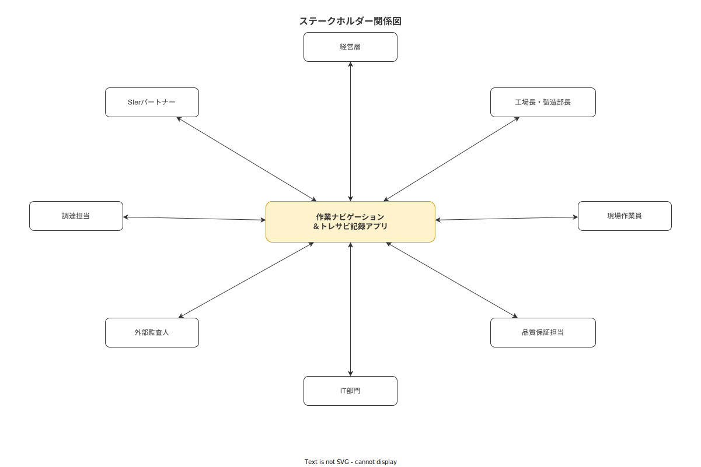

# 背景と目的

**主読者**: 経営層・工場長・製造部長  
**想定所要時間**: 15 分

---

## 1.1 製造現場の現状と痛点

中小製造業の現場では、作業員は**紙の作業指示書・手書き記録**に基づいて作業する。この方式には以下の構造的問題がある。

| 問題 | 現場での具体的症状 |
|---|---|
| 作業ミス・抜け漏れ | 手順書を参照しながら作業できず、記憶頼りになる |
| 記録の信頼性低下 | 後記・まとめ記入が常態化し、ALCOA+ の「同時性」原則に違反 |
| 暗黙知の消失 | 熟練者のコツ・カンが形式知化されず、退職とともに失われる |
| トレーサビリティの断絶 | 不適合発生時に原因追跡に数日を要し、リコール・リワーク範囲が特定できない |
| 指導コストの高さ | 新人教育が属人的な口頭指導に依存し、工程知識の品質が均質でない |

これらは個人の注意力の問題ではなく、**Work-as-Imagined（手順書上の想定作業）と Work-as-Done（実際の作業）の乖離**が制度的に放置されてきた問題である（[`90_業界分析/02_作業研究の系譜とIE.md`](../../90_業界分析/02_作業研究の系譜とIE.md) 参照）。

---

## 1.2 Work-as-Imagined vs Work-as-Done

**Work-as-Imagined (WAI)** は設計者・管理者が想定した標準手順。**Work-as-Done (WAD)** は現場で実際に実行される作業。この二つは常に一致しない（Hollnagel, 2015）。

WAD を否定してWAIへの強制準拠を求めるアプローチは、Safety-I（バリアと規則による安全管理）に基づく。しかしこの方針は、熟練者の適応的な問題解決能力を阻害し、「Rubber Stamping（形式的なチェックだけで実作業を確認しない）」を誘発する（[`90_業界分析/19_電子チェックリストと手順遵守の科学.md`](../../90_業界分析/19_電子チェックリストと手順遵守の科学.md) 参照）。

本システムは Safety-I（標準手順の提示・強制確認・記録）と Safety-II（作業者が現場で発見した問題を投稿できる Kaizen Teian）の**相補的な設計**を採用する（[`90_業界分析/13_安全文化と安全管理システム.md`](../../90_業界分析/13_安全文化と安全管理システム.md) 参照）。

---

## 1.3 解決仮説とプロダクトコンセプト

**解決仮説**: タブレットで作業手順をステップバイステップ表示し、完了確認・写真・測定値記録を作業と同時に実施することで、Work-as-Imagined と Work-as-Done のギャップを縮小し、トレーサビリティの信頼性を高められる。

本システムのコンセプトは **Intrinsic EPSS（内蔵型電子業績支援システム）** である（[`90_業界分析/25_作業指示書とSOPの構造化・表現論.md`](../../90_業界分析/25_作業指示書とSOPの構造化・表現論.md) 参照）。ユーザが作業を行う場所・タイミングで、最小限の認知負荷で正確な手順と記録を提供する。

ヒューマンエラーのモデル（Reason のスイスチーズモデル）に基づき、単一の「人への依存」ではなく、**多層防御（Defense in Depth）** として機能するよう設計する（[`90_業界分析/04_ヒューマンエラーと安全工学.md`](../../90_業界分析/04_ヒューマンエラーと安全工学.md) 参照）。

- 層1: 手順書の提示（作業者が正しい手順を知る）
- 層2: 完了確認ロック（前ステップ未完了では次に進めない）
- 層3: 写真・測定値の証跡要求（Rubber Stamping 防止）
- 層4: 不適合報告→CAPA フロー（逸脱を検出して是正）
- 層5: Kaizen Teian（作業者が現場の問題をフィードバック）

---

## 1.4 経営目的との接続

| 経営上の目的 | 本システムによる寄与 |
|---|---|
| 品質コストの削減 | 不適合の早期発見・再発防止による手直し・廃棄コストの低減 |
| 技能伝承リスクの軽減 | 熟練者の手順知識を形式化し、新人の習熟期間を短縮 |
| トレーサビリティ体制の整備 | ロット単位の記録を電子管理し、顧客監査・規制対応に即座に対応 |
| 現場モラルの向上 | Kaizen Teian で作業者の改善提案を尊重し、自律性・有能感を高める（[`90_業界分析/09_職務設計とモチベーション論.md`](../../90_業界分析/09_職務設計とモチベーション論.md) 参照） |
| 人材育成の効率化 | 習熟度別 UI で初心者から熟練者まで一貫した指導環境 |

---

## 1.5 本計画書の位置づけ

本文書は IPA 共通フレーム 2013 (SLCP-JCF2013) の**企画プロセス「3.1.2 システム化計画の立案」**に対応する成果物である。

- **入力**: システム化構想（課題・コンセプト定義）、業界分析 39 章
- **出力**: 対象範囲・技術スタック・規制スタンス・スケジュール・リスク台帳の確定
- **後工程への引き渡し**: 要件定義（03_要件定義/）の前提文書として参照される

---

> **本節で確定した方針**  
> 1. 本システムは WAI への強制準拠ではなく、Safety-I と Safety-II を相補的に組み合わせた多層防御 UI を採用する。  
> 2. コンセプトは Intrinsic EPSS（作業と同時に手順・記録を提供）とする。  
> 3. 個人の注意力への依存を減らし、システムモデル（Reason の Person Model vs System Model）に基づく設計を徹底する。
