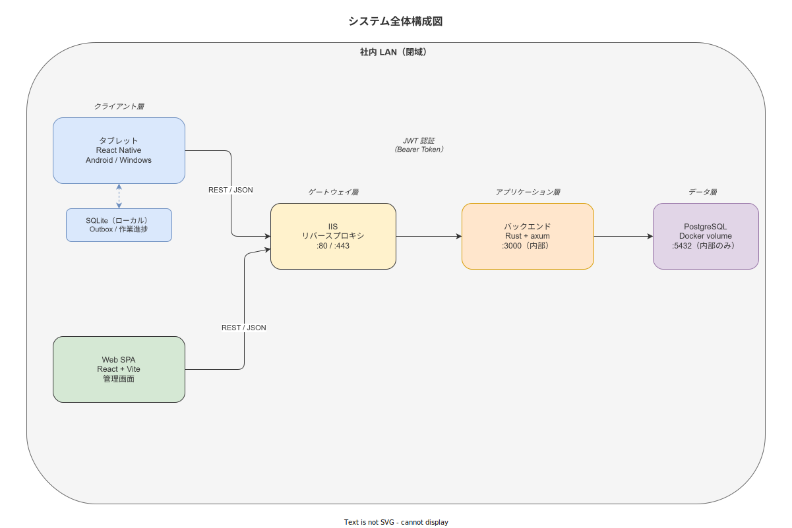
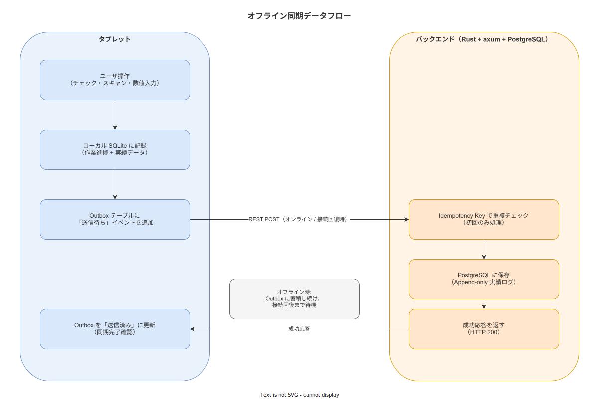
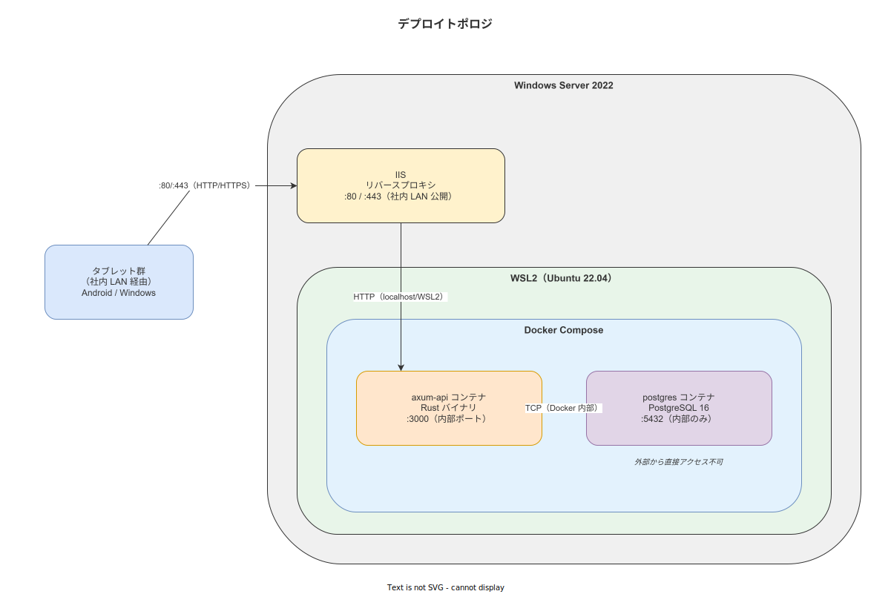

# 03_概略アーキテクチャ

本書は本システムのコンポーネント構成・データ永続化・同期・認証・デプロイの概略設計を示す。
詳細設計 (インターフェース定義・DDL・API スキーマ) は `docs/04_概要設計/` 以降で扱う。

---

## 1. 全体構成図



3 層で構成される。

| 層 | コンポーネント | 主な責務 |
|---|---|---|
| **クライアント層 (タブレット)** | React Native (Expo) アプリ + SQLite (expo-sqlite) | 作業ナビ表示・入力・QR スキャン・写真撮影・ローカル保存 |
| **クライアント層 (Web)** | React + Vite SPA | マスタ管理・トレサビ照会・ユーザ管理 |
| **バックエンド層** | Rust (axum) API サーバ | ビジネスロジック・認証・マスタ配信・同期受付 |
| **データ層** | PostgreSQL | 実績記録・マスタ・監査ログの永続化 |
| **インフラ** | Windows Server 2022 / IIS / WSL2 / Docker Compose | ホスティング・プロセス管理・ネットワーク境界 |

通信境界: タブレット ⟷ バックエンド間は REST/JSON over HTTP(S)。
Web SPA はバックエンドが静的ファイルとして配信し、同一 API を使用する。
外部インターネットへの接続は持たない (社内 LAN 閉域)。

---

> **本節で確定した方針:** 3 層構成 (タブレット/Web/バックエンド+DB) を採用する。SPA とタブレットは同一 API を共有し、二重実装を避ける。外部接続は行わない。

---

## 2. 3 層モデルの責務詳細

### 2.1 タブレットアプリ (React Native)

| 責務 | 詳細 |
|---|---|
| 作業手順の表示 | サーバから取得した手順データをステップ順に表示 |
| 入力の収集 | テキスト入力・数値入力・チェックボックス・QR スキャン・カメラ撮影 |
| ローカル永続化 | SQLite (expo-sqlite) に作業進捗・記録の中間保存 |
| Outbox キュー | 未送信の実績記録を Outbox テーブルで管理 |
| 状態表示 | オンライン/オフライン状態をバナーで常時表示 |
| 認証 | JWT をセキュアストレージに保存し、API リクエストに付与 |

対象 OS: Android (主力) / Windows (Kiosk 端末) / iOS (将来対応)。
Windows は `react-native-windows` で共通コードを最大限流用する。

### 2.2 Web 管理 SPA (React + Vite)

| 責務 | 詳細 |
|---|---|
| マスタ管理 | 工程・手順・部品・ユーザの CRUD |
| トレサビ照会 | ロット/シリアル/日時/作業者による記録検索 |
| レポート出力 | 実績 CSV エクスポート |
| 監査ログ閲覧 | 監査閲覧者ロールによる読み取り専用アクセス |

バックエンドの Rust サーバが静的ファイルとして配信するため、別途 Web サーバは不要。

### 2.3 バックエンド (Rust + axum)

| 責務 | 詳細 |
|---|---|
| 認証 / 認可 | JWT 発行・検証・ロール確認 (axum middleware) |
| マスタ CRUD API | 作業手順・部品・ユーザ管理のエンドポイント |
| 実績受付 API | タブレットからの実績データを受付・検証・保存 |
| 同期調停 | Idempotency Key による重複排除・Conflict 検出 |
| 静的ファイル配信 | React SPA の HTML/JS/CSS を配信 |
| 監査ログ書き込み | 全 CRUD に Audit Trail を Append-only で記録 |

Rust を選定した根拠は [`04_採用技術スタックと選定根拠.md`](./04_採用技術スタックと選定根拠.md) §3 を参照。

### 2.4 データ層 (PostgreSQL)

| テーブル区分 | 内容 |
|---|---|
| マスタテーブル | 工程・手順ステップ・部品・ユーザ・ロール |
| トランザクションテーブル | 実績記録・スキャン記録・測定値・写真メタデータ |
| Audit Trail テーブル | 全 CRUD の Append-only イベントログ |
| Outbox テーブル (サーバ側) | タブレットから受信した Outbox イベントの管理 |

---

> **本節で確定した方針:** 各層の責務を上記のとおり分割する。バックエンドは REST のみ提供し、GraphQL・gRPC は採用しない。DB スキーマ詳細は概要設計フェーズで確定する。

---

## 3. データ永続化とオフライン同期方針

### 3.1 オフライン同期の必要性

製造現場の無線 LAN は金属遮蔽・電磁ノイズにより断絶が生じうる。
サーバ接続を前提とした設計では現場作業が停止するリスクがあるため、
**Local-First** 設計を採用する
([`90_業界分析/27_オフライン同期とデータ整合性.md`](../../90_業界分析/27_オフライン同期とデータ整合性.md))。

Local-First: すべての作業はローカル SQLite に先に書き込み、サーバ同期はバックグラウンドで行う。
作業員はネットワーク状態を意識せず作業を継続できる。

### 3.2 同期データフロー



**同期の粒度 (重要)**: Outbox の 1 イベント = 作業手順の **1 ステップ完了**（またはスキャン・数値入力などの 1 アクション）。
工程の途中であっても各ステップの確定と同時にローカル保存 + サーバ送信サイクルが独立して走る。
「完了」ボタンは工程締めの 1 イベントを追加するだけであり、それまでのステップデータは既に記録済み。
**バッチ送信（全ステップ完了後にまとめて送信）は採用しない。**

Outbox パターンで同期を実装する:

```
1. タブレット: ステップ入力確定 → ローカル SQLite に記録 (Append-only)
2. タブレット: Outbox テーブルに「送信待ち」イベントを追加 (1 ステップ = 1 イベント)
3. タブレット (バックグラウンド): 接続できた瞬間に Outbox を逐次読み出し送信
4. バックエンド: Idempotency Key で重複チェック → 初回のみ PostgreSQL に保存
5. バックエンド: 受信成功を応答
6. タブレット: Outbox のイベントを「送信済み」に更新
```

**Idempotency Key**: タブレット生成の UUID (v4)。同一キーが複数回送信されても 1 回のみ記録される。
ネットワーク再送による二重記録を防ぐ。

**CAP 定理の選択**: AP (可用性 + 分断耐性) を優先し、結果整合性を採用する
([`90_業界分析/27_オフライン同期とデータ整合性.md`](../../90_業界分析/27_オフライン同期とデータ整合性.md))。
Append-only の実績記録は CRDT G-Set の性質 (一度書いた記録は消えない・後勝ちなし) に合致し、
競合解決が不要。

**ALCOA+ 同時性との整合**: タブレット側のローカルタイムスタンプ (ユーザ操作時刻) を
実績の「記録時刻」として保持し、サーバ受信時刻と両方を保存する。
同期遅延は Audit Trail に `sync_source: offline_outbox` として記録する。

### 3.3 端末障害時の損失粒度

逐次同期設計により、端末が物理的に故障・紛失した場合の最悪損失範囲は以下に限定される:

| 状況 | 最悪損失範囲 |
|---|---|
| オンライン中の端末故障 | 入力中だった 1 ステップ分のみ (Outbox 即時ドレイン済み) |
| オフライン中の端末故障 | オフライン開始以降に SQLite に蓄積した全 Outbox イベント (SQLite 物理回復不能な場合) |
| SQLite ファイルが読み出せる場合 | 損失なし (別端末に吸い出して再送可能) |

バッチ送信と比較した改善:

- **バッチ送信の場合**: 工程完了前に端末故障 → 当該工程の全ステップデータが失われる
- **逐次同期 (本設計) の場合**: 最大損失 = 入力中の 1 ステップのみ

---

> **本節で確定した方針:** Outbox パターン + Idempotency Key + AP 結果整合性 + **逐次同期（バッチ送信を採用しない）** を採用する。タブレット側タイムスタンプを正の記録時刻とし、サーバ受信時刻と双方を保存することで ALCOA+ 同時性に対応する。端末障害時の最悪損失粒度は入力中の 1 ステップに局所化する。

---

## 4. 認証・認可設計の概略

| 項目 | 方針 |
|---|---|
| 認証方式 | JWT Bearer Token。バックエンドで署名・検証 |
| トークン有効期限 | アクセストークン: 8 時間 / リフレッシュトークン: 7 日 |
| ロール定義 | 作業員 / 班長 / QA / 管理者 / 監査閲覧者 の 5 ロール |
| ロールの付与 | 管理者のみがユーザ登録・ロール付与を実行できる |
| マスタ管理画面 | QA・管理者ロールのみアクセス可能 |
| 監査ログ閲覧 | 監査閲覧者・管理者ロールのみ |
| タブレット同期 | 作業員・班長ロールが実績データを送信できる |

JWT のペイロードにロール情報を含め、バックエンドのミドルウェアで各エンドポイントのロール要件を検証する。
ロールの RBAC 設計詳細は概要設計フェーズで確定する。

---

> **本節で確定した方針:** JWT 認証・5 ロール RBAC を採用する。ロール付与は管理者専任とし、自己昇格は不可とする。

---

## 5. デプロイトポロジ



### 5.1 物理構成

```
Windows Server 2022
├── IIS (リバースプロキシ / 静的ファイル配信)
│   ├── ポート 80/443 → WSL2 ネットワーク経由で Axum に転送
│   └── 静的ファイル (React SPA) を直接配信 or Axum から配信
└── WSL2 (Ubuntu 22.04)
    └── Docker Compose
        ├── axum-api コンテナ (Rust バイナリ)
        │   ├── 環境変数: DATABASE_URL, JWT_SECRET
        │   └── ポート: 3000 (内部)
        └── postgres コンテナ
            ├── データボリューム: /var/lib/postgresql/data
            └── ポート: 5432 (内部のみ)
```

### 5.2 ネットワーク境界

| 通信経路 | プロトコル | 備考 |
|---|---|---|
| タブレット → IIS | HTTP(S) (社内 LAN) | TLS は IIS が担当 |
| IIS → axum-api | HTTP (localhost/WSL2) | IIS の URL Rewrite でリバースプロキシ |
| axum-api → PostgreSQL | TCP (Docker 内部ネット) | 外部から直接アクセス不可 |
| 社外 → 本システム | 不可 | IIS で社内 LAN 以外を拒否 |

### 5.3 Docker Compose 構成方針

`docker-compose.yml` に `axum-api` と `postgres` の 2 サービスを定義する。
`docker compose up -d` でシステム全体が起動し、
`docker compose down && docker compose up -d` でノーダウンタイムに近い再起動が可能。

ヘルスチェック: `axum-api` は `/health` エンドポイントを提供し、
Docker の `healthcheck` で死活監視を行う。

---

> **本節で確定した方針:** IIS + WSL2 + Docker Compose の 2 コンテナ構成を採用する。PostgreSQL は外部からアクセスできない Docker 内部ネットワークに配置する。

---

## 6. 自動認識・計測の入力経路

タブレットからのデータ入力は以下の方式をサポートする
([`90_業界分析/32_自動認識技術とデータ収集設計.md`](../../90_業界分析/32_自動認識技術とデータ収集設計.md))。

| 入力方式 | Phase | 採用根拠 / 制限 |
|---|---|---|
| QR コード (ISO/IEC 18004) | Phase 1 | ロット番号・シリアル・部品番号の標準媒体。Google ML Kit Barcode を使用 |
| GS1-128 バーコード (AI コード) | Phase 1 | 食品・医療・物流で普及。AI(10) ロット / AI(21) シリアル / AI(17) 期限日 |
| Data Matrix | Phase 1 | 医療機器 UDI の標準媒体 |
| 数値手入力 | Phase 1 | 測定値・数量の手動入力 (バーコードが使えない場合) |
| UHF RFID | 対象外 | 金属環境での読取距離が 10m → 1〜2m に減衰。導入コストと信頼性に課題 ([`90_業界分析/32_自動認識技術とデータ収集設計.md`](../../90_業界分析/32_自動認識技術とデータ収集設計.md)) |
| 測定器直結 | Phase 2 | USB/Bluetooth 経由の自動値取込。Phase 1 は手入力 |
| 画像 AI (外観検査) | Phase 3 | Edge ML (TFLite/ONNX) による判定補助 |

---

> **本節で確定した方針:** Phase 1 の自動認識は QR / GS1-128 / Data Matrix のバーコード系に限定する。UHF RFID は金属環境での信頼性と導入コストから対象外と判断する。

---

## 7. 非テキスト記録の保管設計

写真記録の保管に関する概略方針
([`90_業界分析/31_非テキスト記録と証拠品質管理.md`](../../90_業界分析/31_非テキスト記録と証拠品質管理.md))。

| 項目 | Phase 1 方針 | 将来 (Phase 2/3) |
|---|---|---|
| 保存先 | バックエンドサーバのファイルシステム (Docker volume) | 必要に応じ外部ストレージ |
| ハッシュ | SHA-256 を保存時に計算し DB に記録 | 変更なし |
| EXIF | 剥離せず DB メタデータとして保存 | 変更なし |
| タイムスタンプ局 (TSA) | 対象外 (コスト判断) | 将来検討 |
| ファイル形式 | JPEG (標準品質) | 変更なし |
| Chain of Custody | ファイルアクセスを Audit Trail に記録 | 変更なし |
