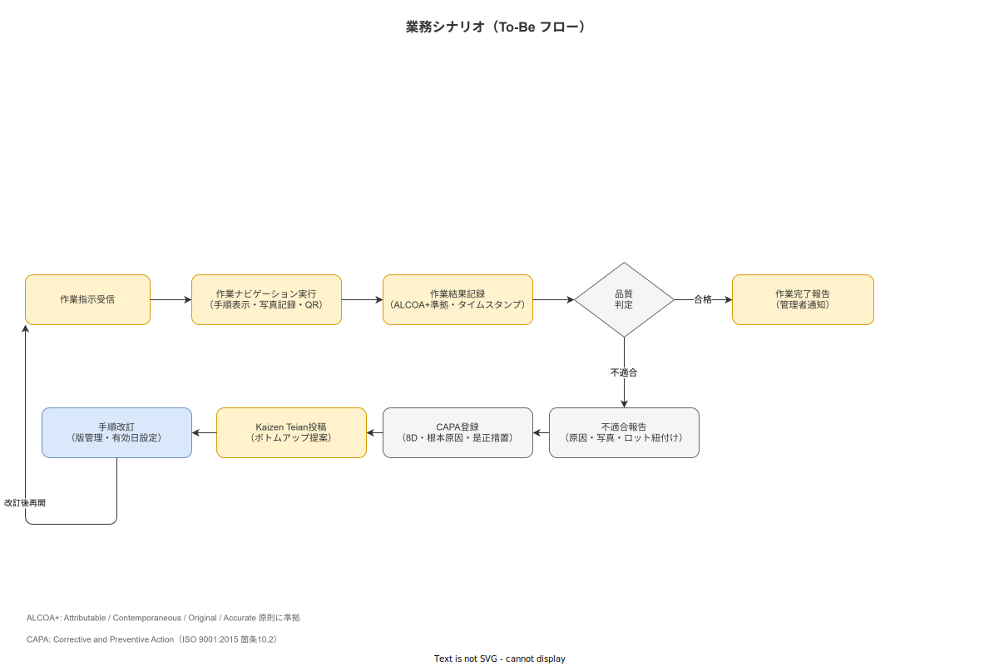

# 業務シナリオとKPI

**主読者**: 工場長・品質保証担当・経営層  
**想定所要時間**: 20 分

---

## 4.1 As-Is 業務フロー（現状）

現行の紙ベース管理が抱える記録の断絶を以下のフローで示す。

**現状の問題点**:
- 手順書は紙で配布。改訂版の配布漏れが発生しやすい
- 記録は後記（まとめ書き）が常態化。ALCOA+ の Contemporaneous 原則に違反
- 不適合発生時の原因追跡に数日を要する
- 改善提案の窓口がなく、作業者の知見が活かされない

---

## 4.2 To-Be 業務フロー（目標）

本システム導入後の業務フロー。



**フロー概要**:

1. **作業指示受信**: 管理者が発行した作業指示をタブレットで受信
2. **作業ナビゲーション実行**: ステップバイステップ表示で手順を実行。写真・QR・測定値を作業と同時に記録
3. **作業結果記録**: ALCOA+ 準拠（同時性・原本性）でイベントログに追記
4. **品質判定**: 合否基準に基づく自己判定。合格→完了報告、不適合→報告フロー
5. **不適合報告**: 写真・ロット番号・原因タグを即時入力
6. **CAPA 登録**: 8D フォーマットで根本原因分析・是正措置を記録。有効性確認フィールドを必須化
7. **Kaizen Teian 投稿**: ワンタップで改善提案。管理者ダッシュボードで採択/見送り返答
8. **手順改訂**: Kaizen・CAPA を踏まえて手順書の新版を作成。有効日・版番号を設定し旧版廃止

---

## 4.3 KPI ツリー

本システムの導入効果を測定するための KPI を設定する。

### レベル 1: 記録品質（ALCOA+ 適合度）

| KPI | 目標値 | 測定方法 |
|---|---|---|
| 記録完全性（必須フィールド入力率） | ≥ 95% | DB 集計 |
| 同時性達成率（作業完了から記録まで 5 分以内） | ≥ 90% | タイムスタンプ差分 |
| 後記ゼロ率（まとめ書きがない記録の比率） | ≥ 98% | 中断ログ解析 |

### レベル 2: 品質改善

| KPI | 目標値 | 測定方法 |
|---|---|---|
| 不適合再発率（CAPA 有効性確認後の同一不適合） | 前比 -50% | 不適合 DB |
| Kaizen Teian 採択件数（月次） | ≥ 5 件/ライン | 提案 DB |
| 工程内不良率 | 前比 -20%（Phase 1 本番 9 ヶ月後） | 生産実績 |

### レベル 3: 習熟・トレーサビリティ

| KPI | 目標値 | 測定方法 |
|---|---|---|
| 新人独立作業達成期間 | 前比 -30% | OJT 記録 |
| ロット追跡応答時間（問い合わせから記録提示まで） | ≤ 30 分 | インシデント記録 |
| Resumption Lag 検出率（中断から再開までの異常検知） | ≥ 80% | 中断ログ解析 |

Resumption Lag とは、作業中断後の再開時に発生する記憶の再構築遅延であり、Post-Completion Error の主要原因となる（[`90_業界分析/20_作業中断・割込み・再開の認知科学.md`](../../90_業界分析/20_作業中断・割込み・再開の認知科学.md) 参照）。システムは中断ログを収集し、再開時の異常遅延を検知して監督者に通知する。

---

## 4.4 Kaizen フィードバックループ

本システムは作業員のボトムアップ改善提案（Kaizen Teian）を標準フロー化する。これにより、トップダウン標準（作業手順書）とボトムアップ提案（Kaizen）を統合した**改善の閉ループ**を実現する（[`90_業界分析/39_QCサークル・Kaizen Teianとボトムアップ品質活動.md`](../../90_業界分析/39_QCサークル・Kaizen Teianとボトムアップ品質活動.md) 参照）。

```
作業実行 → 気づき発生 → Kaizen Teian 投稿（1 タップ）
    ↓
管理者レビュー → 採択/見送り（理由必須）→ 提案者へフィードバック
    ↓
採択 → 手順改訂 → CAPA と連動（根拠として記録）
    ↓
改訂後の手順で次の作業実行へ（Yokoten: 水平展開）
```

**Kaizen Teian 設計の原則**:
- 入力ハードル最小（テキスト一文 + 写真一枚 + 定型タグ）
- 提案件数義務化・目標化を禁止（件数追いによる形骸化を防止）
- 全提案に「採択/見送り + 理由」の返答を必須とし、心理的安全性を確保（[`90_業界分析/09_職務設計とモチベーション論.md`](../../90_業界分析/09_職務設計とモチベーション論.md) 参照）

不適合→CAPA フローは Double-Loop 学習（Argyris）を支援する。Single-Loop（是正措置のみ）でなく、根本原因の特定・手順改訂・有効性確認を経た改善の閉ループを設計に組み込む（[`90_業界分析/28_不適合と手順改訂のフィードバックループ.md`](../../90_業界分析/28_不適合と手順改訂のフィードバックループ.md) 参照）。

---

## 4.5 測定責任とデータ目的分離

KPI データの取得・分析・公開についての責任分担と目的制限を以下の通り定める。

| データ | 収集目的 | 公開範囲 | 人事評価への利用 |
|---|---|---|---|
| 作業ログ（誰が・いつ・何を） | 品質保証・トレーサビリティ | QA・工長・監査 | **禁止** |
| ステップ別作業時間 | 工程分析・改善検討 | 工長・QA（集計値のみ） | **禁止** |
| 不適合報告者 | CAPA 追跡 | 工長・QA | **禁止** |
| Kaizen 提案者 | 提案者へのフィードバック | 管理者・提案者本人 | **禁止（承認時のインセンティブは別途労使合意で設定）** |

データの人事評価転用禁止は、個人情報保護法の不適正利用禁止規定および GDPR の目的限定原則に基づく（[`90_業界分析/24_作業者プライバシー・データ倫理と労務監視.md`](../../90_業界分析/24_作業者プライバシー・データ倫理と労務監視.md) 参照）。作業ログは「品質保証・規制対応」の目的のみで使用する旨を、システム導入時の説明会で作業者に平易な言葉で説明する。

---

## 4.6 プロセスマイニング対応

本システムは IEEE Process Mining Manifesto に準拠した XES 互換イベントログを提供する。

- **Case ID**: 作業指示 ID またはロット番号（全テーブル統一キー）
- **Activity**: `STEP_STARTED`, `STEP_COMPLETED`, `STEP_SKIPPED`, `NONCONFORMITY_REPORTED`, `KAIZEN_SUBMITTED` 等
- **Timestamp**: ミリ秒精度 UTC（サーバ側タイムスタンプ、端末操作は別フィールド）
- **Resource**: 作業者 ID + 端末 ID

XES 形式の CSV エクスポートにより、外部ツール（ProM / Celonis 等）での工程発見・適合性確認が可能になる（[`90_業界分析/21_作業ログ分析とプロセスマイニング.md`](../../90_業界分析/21_作業ログ分析とプロセスマイニング.md) 参照）。

---

> **本節で確定した方針**  
> 1. KPI は「記録品質・品質改善・習熟・トレーサビリティ」の 3 階層で設定し、Phase 1 PoC 評価に使用する。  
> 2. 作業ログの人事評価転用を明示的に禁止し、システム運用ポリシー文書に記載する。  
> 3. Kaizen Teian は件数義務化を行わず、全提案に「採択/見送り + 理由」の返答を必須とする。
