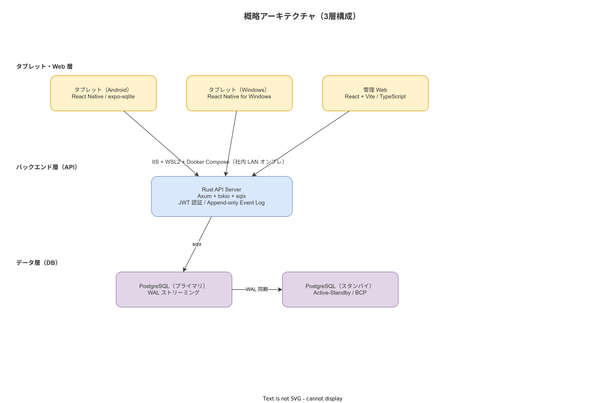
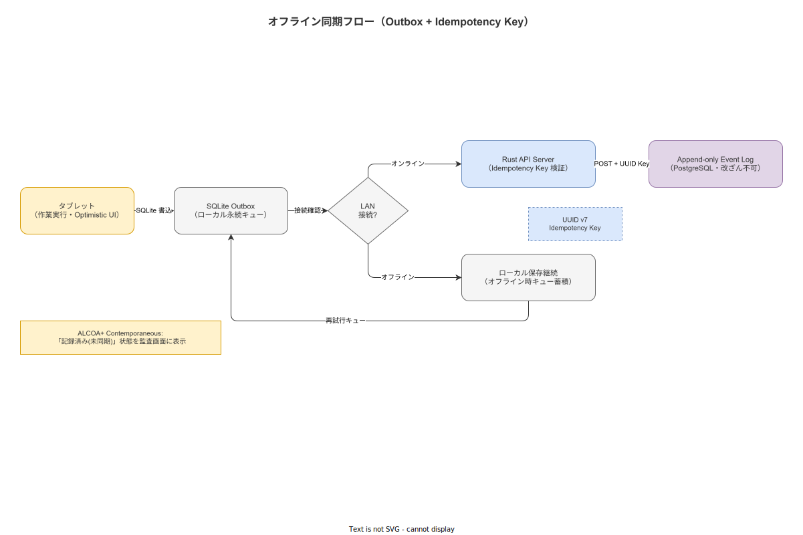

# 概略アーキテクチャ

**主読者**: IT 部門・SIer パートナー  
**想定所要時間**: 25 分

---

## 5.1 論理アーキテクチャ（3 層構成）

本システムは「タブレット・Web 層 / バックエンド層 / データ層」の 3 層で構成する。



| 層 | コンポーネント | 役割 |
|---|---|---|
| タブレット・Web 層 | React Native / React + Vite | 作業者ナビゲーション UI・管理 Web SPA |
| バックエンド層 | Rust + Axum + tokio + sqlx | REST API・認証・イベントログ処理 |
| データ層 | PostgreSQL | Append-only イベントログ・マテリアライズドビュー |

物理デプロイ構成（IIS + WSL2 + Docker Compose + LAN 内 Active-Standby 2 台）の詳細は [デプロイトポロジ](./img/deployment_topology.svg) を参照。

---

## 5.2 イベント駆動と Append-only Event Sourcing

**設計原則**: すべての状態変化を「イベント」として追記する。上書きは存在しない。

```
イベント例:
  1. step-003 COMPLETED by user-42 at 2026-05-16T09:15:00Z [lot-AAA]
  2. step-003 FLAGGED_FOR_REVIEW by user-71 at 09:16:30Z
  3. step-003 CONFIRMED_OK by user-09 at 09:18:00Z
```

この設計が ALCOA+ の以下の原則を自然に満たす（[`90_業界分析/22_規制別トレーサビリティ要件詳論.md`](../../90_業界分析/22_規制別トレーサビリティ要件詳論.md) 参照）：

- **Attributable**: 各イベントに作業者 ID が紐付く
- **Original**: イベントは追記のみ。既存レコードの削除・上書きは不可
- **Contemporaneous**: タイムスタンプはサーバ側 UTC（端末操作時刻は別フィールドに保持）
- **Enduring**: PostgreSQL の WAL + スタンバイレプリケーションで耐久性確保

イベントソーシングは監査証跡の改ざん困難性も担保する。誰がいつ何をしたかのイベントストリームは証跡として機能する。

---

## 5.3 オフライン同期戦略（Outbox + Idempotency Key）



### CAP 定理と設計選択

社内 LAN でも金属構造物による電波遮蔽が発生し、AP（可用性優先 + 結果整合性）設計が適切（[`90_業界分析/27_オフライン同期とデータ整合性.md`](../../90_業界分析/27_オフライン同期とデータ整合性.md) 参照）。

| 設計要素 | 採用アプローチ | 理由 |
|---|---|---|
| ローカル永続化 | SQLite (expo-sqlite) | Expo 標準・offline-first 向け |
| 同期タイミング | 操作ごとに即送信 + オフライン時はキュー | 最小遅延でサーバに反映 |
| 操作の型 | Append-only（イベントソーシング） | 上書き競合を回避、ALCOA+ 適合 |
| 重複排除 | Idempotency Key (UUID v7) | リトライ安全性を保証 |
| 現在状態の導出 | サーバサイドのマテリアライズドビュー | 端末は raw events のみ保持 |
| 一貫性目標 | Read-Your-Writes + Eventual Consistency | 「自分が書いた内容は次に必ず見える」を保証 |
| UI パターン | Optimistic UI | 操作を即時反映してから非同期でサーバ確定 |

### ALCOA+ Contemporaneous との整合

「ローカルに記録されたがサーバに未同期」の状態では、监査画面上で**「記録済み（未同期）」** と明示表示する。サーバ同期完了後に「確定」に変更する。これにより、Contemporaneous 原則のオフライン時の解釈問題を明示的に解決する（[`90_業界分析/27_オフライン同期とデータ整合性.md`](../../90_業界分析/27_オフライン同期とデータ整合性.md) 参照）。

---

## 5.4 CRDT を採用しない根拠

CRDT（Conflict-free Replicated Data Type）は分散整合性の一手法だが、本システムでは採用しない。

| CRDT の限界 | 本システムへの影響 |
|---|---|
| 手順の追加/削除/順序変更を CRDT で表現するとモデルが複雑化 | 手順書マスタの更新競合が発生しやすい |
| OR-Set の削除は「追加に対してキャンセル」しかできない | 廃番手順の扱いが不明確になる |
| 実装コストが高く、バグリスクが高い | 個人開発リソースとの不整合 |

代替として **Outbox Pattern + Append-only Event Sourcing + Idempotency Key** を採用する。これにより競合を「発生させない設計」で解決する。

---

## 5.5 Defense in Depth（多層防御 UI）

Reason のスイスチーズモデルに基づき、UI に多重防御層を設ける（[`90_業界分析/04_ヒューマンエラーと安全工学.md`](../../90_業界分析/04_ヒューマンエラーと安全工学.md) 参照）。

| 層 | 実装内容 |
|---|---|
| 層1: 情報提示 | 現在ステップの手順・写真・動画サンプルを表示 |
| 層2: 確認ロック | 前ステップ完了確認なしに次ステップに進めない |
| 層3: 証跡要求 | クリティカルステップには写真または測定値入力を必須化 |
| 層4: Rubber Stamping 監視 | ステップ完了タイムが異常に短い場合に監督者へアラート |
| 層5: 不適合報告 | 問題発生時に即時報告する経路を常に提供 |

**Rubber Stamping（形式的チェックだけで実作業を確認しない行為）の防止**は電子チェックリスト設計における最重要課題の一つである（[`90_業界分析/19_電子チェックリストと手順遵守の科学.md`](../../90_業界分析/19_電子チェックリストと手順遵守の科学.md) 参照）。

---

## 5.6 中断・再開耐性（Resumption Lag 対策）

作業中断は製造現場で頻繁に発生する。中断後の再開時に Post-Completion Error（最後のステップを忘れる）が起きやすい（[`90_業界分析/20_作業中断・割込み・再開の認知科学.md`](../../90_業界分析/20_作業中断・割込み・再開の認知科学.md) 参照）。

設計で組み込む対策：

- **プレースキーパー**: 再ログイン時に「直前操作・経過時間・再確認プロンプト」のサマリを表示
- **中断ログ自動記録**: 中断発生・再開の時刻と対象ステップを DB に記録
- **Protection Window**: クリティカルステップ中は通知をミュート
- **シフト引継ぎ票**: シフト交代時のデジタル引継ぎ機能（I-PASS 形式）

---

> **本節で確定した方針**  
> 1. アーキテクチャは 3 層構成 + Append-only Event Sourcing + Outbox + Idempotency Key を採用し、CRDT は採用しない。  
> 2. AP 志向（オフライン優先 + Eventual Consistency）を設計の基盤とし、オフライン状態を「記録済み（未同期）」として監査画面に明示する。  
> 3. 多層防御 UI（Defense in Depth）を実装し、Rubber Stamping 監視ロジックを設ける。

---

## 5.7 セキュリティアーキテクチャ

**主な想定脅威**: 内部不正（記録改ざん）・JWT トークン漏洩・Wi-Fi 盗聴

デプロイトポロジの詳細は[デプロイトポロジ](./img/deployment_topology.svg)を参照。プライマリサーバ 2 台（IIS + WSL2/Docker）と LAN 内 Standby 構成。

### 認証・認可

| 層 | 実装方針 |
|---|---|
| 認証 | JWT RS256 署名。アクセストークン有効期限 15 分・リフレッシュトークン 8 時間 |
| RBAC | 作業員 / 工長 / QA / 管理者 の 4 ロール。エンドポイント単位で権限チェック |
| PostgreSQL RLS | `work_event_log` テーブルへのアクセスをロール・工程・ロット単位で制限。人事系ロール（hr_role）は SELECT 禁止（Just Culture の技術的担保）|

### TLS（通信暗号化）

HTTPS を**必須**とする（自己署名証明書可）。ALCOA+ Original 原則のもと、社内 LAN でも JWT トークンの平文送信を許容しない。

- IIS が TLS 終端を担当（自己署名証明書または社内 CA 発行）
- HTTP → HTTPS 自動リダイレクト
- 自己署名証明書使用時は端末ごとに証明書をインポート

### DB 暗号化方針

PostgreSQL 接続は `sslmode=require` を強制する。フィールドレベル暗号化（pgcrypto）は Phase 2 以降で必要性を評価する。DB サーバへの OS 直接アクセスは sqlx 接続ユーザのみに制限する。

### 端末紛失・盗難対策

JWT アクセストークンの有効期限を 15 分に短く設定することで、端末紛失時でも長期悪用を防ぐ。管理者コンソールからの強制ログアウト（リフレッシュトークン無効化）機能を実装する。端末ロック・リモートワイプは MDM ツール（本システムスコープ外）で対応する。

---

> **本節で確定した方針（セキュリティ）**  
> 4. TLS（HTTPS、自己署名証明書可）を必須とし、JWT トークンの平文送信を禁止する。  
> 5. PostgreSQL RLS で人事系ロールからの作業ログ直接参照を物理遮断し、技術的強制と運用規約の二重防御を実現する。  
> 6. 端末紛失時は管理者コンソールからのリフレッシュトークン無効化で対応する。
