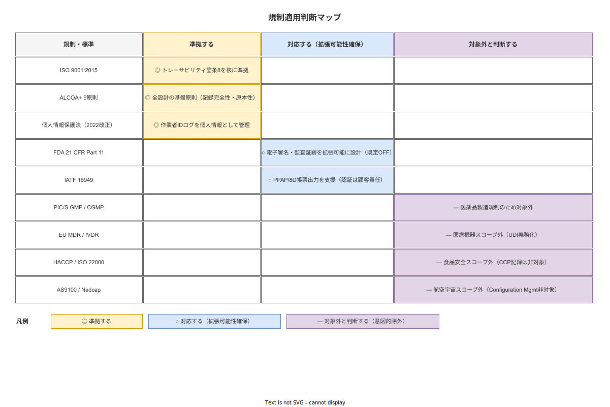

# 規制・品質・倫理上のリスクと方針

**主読者**: 品質保証担当・外部監査人・経営層  
**想定所要時間**: 30 分

---

## 7.1 規制適用判断表

本システムが関連する規制・標準について「準拠する／対応する（拡張可能性確保）／対象外と判断する」の 3 段階で適用方針を定める。

### 3 段階の語義定義

| 判断区分 | 意味 | 実装者の責任範囲 |
|---|---|---|
| **準拠する** | 当該規格が要求する設計・記録・管理の実施を本システムが自ら担保する | 本システムの設計・テスト・運用で達成責任を負う |
| **対応する（拡張可能性確保）** | 顧客が機能を有効化することで規格要件を満たせるよう設計する。認証取得・監査対応は顧客責任 | 機能実装と有効化手順の提供のみ |
| **対象外と判断する** | 当該規制の対象業種・用途ではないと判断し、機能・スコープに含めない。理由を必ず明示する | なし（意図的な除外として記録） |

| 規制・標準 | 適用判断 | 根拠・備考 |
|---|---|---|
| **ISO 9001:2015** | **準拠する** | 識別とトレーサビリティ（箇条 8.5.2）を核に設計。リスクベース思考（箇条 6）をシステム設計に反映 |
| **ALCOA+ 9 原則** | **準拠する** | 全記録設計の基盤原則。Attributable/Legible/Contemporaneous/Original/Accurate + Complete/Consistent/Enduring/Available |
| **個人情報保護法（2022 改正）** | **準拠する** | 作業者 ID 紐付きログは個人情報として管理。不適正利用禁止規定（差別・偏見助長への転用禁止）を遵守 |
| **FDA 21 CFR Part 11** | **対応する（拡張可能性確保・既定 OFF）** | 電子署名・監査証跡を拡張可能に設計。医薬品製造顧客向けに有効化可能だが初期は OFF |
| **IATF 16949** | **対応する（帳票出力支援・認証は顧客責任）** | PPAP/8D/APQP に対応した帳票フォーマットを CSV/PDF で出力支援。IATF 認証取得は顧客組織の責任 |
| **PIC/S GMP / CGMP** | **対象外と判断する** | 医薬品製造特化の規制。本システムの想定顧客（中小製造業一般）は対象外 |
| **EU MDR / IVDR（UDI 義務化）** | **対象外と判断する** | 医療機器スコープ外。ただし GS1 SGTIN カラムを将来拡張用に DB スキーマに予約 |
| **HACCP / ISO 22000** | **対象外と判断する** | 食品安全管理システム。本システムの想定スコープ外 |
| **AS9100 Rev D / Nadcap** | **対象外と判断する** | 航空宇宙・防衛分野。Configuration Management 機能は対象外 |
| **計量法（特定計量器・JCSS）** | **対象外と判断する（Phase 1）** | 測定値の単位・有効桁数チェックは実装するが、JCSS 校正証明書添付は Phase 2 検討 |

詳細な根拠は [`90_業界分析/22_規制別トレーサビリティ要件詳論.md`](../../90_業界分析/22_規制別トレーサビリティ要件詳論.md) を参照。

---

## 7.2 ISO 9001:2015 + ALCOA+ 準拠方針

### ISO 9001:2015 の実装方針

| 箇条 | 要求事項 | 本システムの対応 |
|---|---|---|
| 7.5 | 文書化した情報の管理 | 手順書の版管理・有効日・配布制御・廃版フロー |
| 8.5.2 | 識別とトレーサビリティ | 製品 ID/工程/作業者/設備/材料ロットの紐付け記録 |
| 10.2 | 不適合及び是正処置 | 不適合報告→根本原因分析→是正措置→有効性確認の閉ループ |

### ALCOA+ 9 原則の実装

| 原則 | 実装内容 |
|---|---|
| Attributable（帰属可能） | 各イベントに作業者 ID・端末 ID を紐付け。JWT 認証で Identity を担保 |
| Legible（可読性） | 全フィールドを構造化データとして保存。自由記述は UTF-8 テキスト |
| Contemporaneous（同時性） | 作業と同時に記録。Optimistic UI でサーバ未確認時も「記録済み（未同期）」と表示 |
| Original（原本性） | Append-only Event Log。削除・上書き禁止を DB CONSTRAINT で強制 |
| Accurate（正確性） | 単位ドロップダウン・有効桁数チェック・合否基準の計算自動化 |
| Complete（完全性） | 必須フィールド未入力では次ステップにロック。記録完全性 ≥ 95% を KPI 化 |
| Consistent（一貫性） | サーバ側 UTC タイムスタンプで端末時刻のズレを排除 |
| Enduring（耐久性） | PostgreSQL WAL + スタンバイレプリカ + 定期バックアップ。**長期保管**: 構造化 JSON + PDF/A（ISO 19005）への定期変換（5 年毎）で 10〜30 年後の可読性を確保 |
| Available（利用可能性） | 索引の最適化・NGINX X-Accel-Redirect による大容量ファイルの効率配信。**保管期間設定**: 業界別（ISO 9001: 最低 3 年、IATF 自動車: 15 年以上、航空宇宙: 機体就役中）に保管期間を機器マスタで設定可能 |

---

## 7.3 IATF 16949 帳票出力支援の範囲

自動車部品サプライヤー向けに以下の帳票フォーマットをエクスポート機能として提供する。認証取得の義務は顧客組織が負う。

| 帳票 | 形式 | 備考 |
|---|---|---|
| 8D レポート（D0〜D8） | PDF / CSV | 不適合 CAPA データから自動生成 |
| 工程記録（作業実績） | CSV / XES | PPAP 申請に使用可能 |
| 品質記録リスト | CSV | 保管期間・アーカイブ状態を含む |

---

## 7.4 FDA 21 CFR Part 11 拡張可能性の設計

Phase 1 では OFF だが、以下の機能を「拡張可能な構造」として設計に組み込む。

| 機能 | Phase 1 状態 | 有効化後の動作 |
|---|---|---|
| 電子署名（意味付き） | OFF | 承認・レビュー行為にサイン者の氏名・日時・意味を紐付け |
| 改ざん不可監査証跡 | ON（常時） | Append-only で常に有効。Part 11 では要件が強化される |
| アクセス制御の強化 | OFF（ロール管理のみ） | Part 11 では固有 ID + パスワードポリシーが要求される |

---

## 7.5 個人情報保護法・データ倫理

本システムは作業者 ID 紐付きログを収集する。これは改正個人情報保護法上、個人情報として取り扱う（[`90_業界分析/24_作業者プライバシー・データ倫理と労務監視.md`](../../90_業界分析/24_作業者プライバシー・データ倫理と労務監視.md) 参照）。

### データ目的分離の原則

| データカテゴリ | 収集目的 | 人事評価への利用 |
|---|---|---|
| 作業ログ | 品質保証・トレーサビリティ・ALCOA+ | **禁止** |
| 個人作業時間 | 工程改善（集計値のみ使用） | **禁止** |
| 不適合報告者 | CAPA 追跡・是正措置 | **禁止** |

### プライバシー保護設計

- **データ最小化**: 作業記録に必要な情報のみ収集（生体情報・位置情報は収集しない）
- **ロール別アクセス制御**: 作業者は自分の記録のみ参照可能。工長・QA は担当ライン範囲
- **保管期間の明示**: 品質記録保管期間（ISO 9001 箇条 7.5）を設定し、期限到達後のアーカイブ化
- **透明性**: 導入時に「何が記録されるか・誰が見られるか・どう使うか」を平易な言葉で説明

デジタルテイラリズム（アルゴリズムによる作業者の行動監視・能率強制）に対する批判（[`90_業界分析/03_作業標準化と生産方式.md`](../../90_業界分析/03_作業標準化と生産方式.md) 参照）を踏まえ、本システムを「監視ツール」ではなく「作業者支援ツール」として位置づける方針を設計・運用に組み込む。

---

## 7.6 監査証跡と非テキスト証拠管理

### 写真証拠の品質担保

記録に添付する写真は以下の処理を経て保存する（[`90_業界分析/31_非テキスト記録と証拠品質管理.md`](../../90_業界分析/31_非テキスト記録と証拠品質管理.md) 参照）：

1. クライアント側で SHA-256 ハッシュを計算
2. 作業者 ID / 工程 ID / ロット / 端末 ID / タイムスタンプを Exif メタデータとして付与
3. マルチパートアップロード
4. サーバ側でハッシュ検証・不一致時は拒否
5. ブレ検出（Laplacian 分散）で品質下限フィルタリング
6. UUID ベースのファイルパスで保存

写真の改ざん防止として SHA-256 を採用する。RFC 3161 タイムスタンプ認証局（TSA）への対応は Phase 2 で検討する。

### 測定値の計量トレーサビリティ

測定値入力には以下のフィールドを必須とする（[`90_業界分析/33_計量法・JCSS校正トレーサビリティとSI単位.md`](../../90_業界分析/33_計量法・JCSS校正トレーサビリティとSI単位.md) 参照）：

| フィールド | 説明 |
|---|---|
| `measured_value` | 数値（NUMERIC 型） |
| `unit_code` | UCUM 単位コード（例: `mm`, `N`, `celsius`） |
| `calibration_ref` | 測定器の校正参照 ID（機器マスタと紐付け） |
| `calibration_expiry` | 校正有効期限（期限切れ時はソフト制御で警告） |

単位の混同（N vs kgf、Pa vs kPa）を防ぐため、混同頻度の高い単位ペアは入力時の選択肢から同時表示を避ける。

---

## 7.7 Just Culture と報告促進設計

不適合報告・ヒヤリハット報告を「報告→処罰」の連動から切り離す。Just Culture（Reason, 1997）の原則に基づき、過失と故意違反を区別した公正な文化を制度として組み込む（[`90_業界分析/13_安全文化と安全管理システム.md`](../../90_業界分析/13_安全文化と安全管理システム.md) 参照）。

- 不適合報告データを個人の人事評価・能力判断に利用しないことを**システム利用規約**に明記
- 報告件数の多い作業者を「問題作業者」と評価する管理行動を組織的に禁止するよう**導入支援ガイドライン**に含める
- 匿名投稿オプションをヒヤリハット機能に設ける（CAPA 追跡が必要な不適合は実名必須）

### データアクセスの技術的制御（RLS による二重防御）

「利用規約による禁止」と「技術的アクセス遮断」の二重防御で Just Culture を担保する。

**PostgreSQL Row Level Security (RLS) の設計方針**:

- `work_event_log` テーブルに RLS を有効化し、人事・給与ロール（`hr_role`, `payroll_role`）からの SELECT を物理的に禁止する
- 品質保証ロール（`qa_role`）は「工程 × ロット単位の集計ビュー」経由のみ許可し、個人特定が不可能な形式に制限する
- 管理者ロール（`admin_role`）でも `work_event_log` への直接 UPDATE/DELETE は不可（Append-only の技術的強制）
- システム管理者（DB superuser）の操作は別途監査ログに記録し、人事評価目的での操作を抑止する

この設計により、「人事部門が就業規則を変更して作業者評価にデータを利用しようとしても、システム技術的に取得できない」状態を実現する（[`90_業界分析/24_作業者プライバシー・データ倫理と労務監視.md`](../../90_業界分析/24_作業者プライバシー・データ倫理と労務監視.md) 参照）。

---

> **本節で確定した方針**  
> 1. ISO 9001:2015 と ALCOA+ 9 原則を核として準拠する。FDA 21 CFR Part 11 は拡張可能性を確保するが既定 OFF とする。GMP/MDR/AS9100/HACCP は対象外と判断する。  
> 2. 作業ログの人事評価転用を明示禁止とし、目的分離・データ最小化を設計の柱とする。  
> 3. Just Culture に基づき、不適合報告→処罰の連動を断ち切る設計を利用規約・運用ガイドラインに組み込む。
