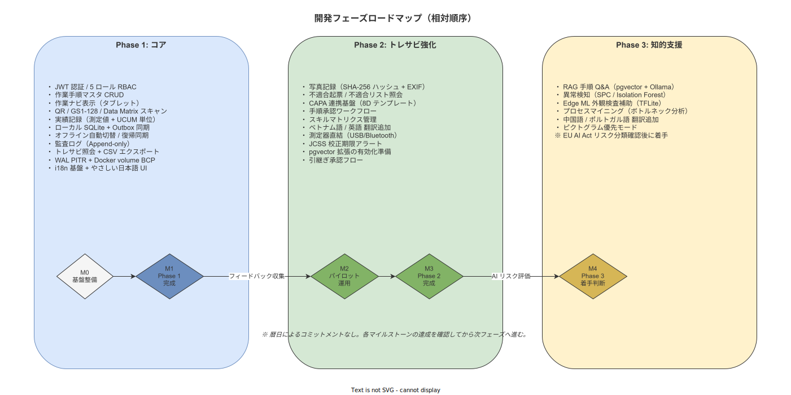

# 07_開発スケジュールとフェーズ計画

本書は本システムの開発をフェーズに分割し、各フェーズの機能範囲・完了判定・撤退条件を示す。
個人開発のため暦日のコミットメントは行わない。マイルストーンは相対順序で示す。

---

## 1. フェーズ戦略概観



開発は 3 つのフェーズに分割する。各フェーズは前フェーズの完了を前提とし、
フェーズ間で要件定義・設計文書を更新してから実装に入る。

| フェーズ | コンセプト | 主要機能 |
|---|---|---|
| **Phase 1: コア (必須)** | 「作業ナビ + 実績記録 + マスタ管理」の基盤 | 作業ナビ・チェック記録・QR スキャン・オフライン同期・マスタ管理・JWT 認証 |
| **Phase 2: トレサビ強化** | 品質保証・規制対応の強化 | 写真記録 (ハッシュ付)・不適合管理・CAPA 連携・承認ワークフロー・多言語追加 |
| **Phase 3: 知的支援** | AI による判断支援・分析基盤 | RAG Q&A・異常検知・プロセスマイニング・Edge ML 画像検査補助 |

機能優先順位の判断基準: Panorama Consulting の研究では ERP/MES 案件の **54% が予算超過**し、
スコープ膨張が主因とされている
([`90_業界分析/29_競合製品と作業ナビ・MES・eBR市場.md`](../../90_業界分析/29_競合製品と作業ナビ・MES・eBR市場.md))。
Phase 1 に詰め込みすぎず、**作業ナビと実績記録の 1 サイクルが動くことを最初のゴール**とする。

---

> **本節で確定した方針:** 3 フェーズ順次開発を採用する。Phase 1 完了後にパイロット運用を経てから Phase 2 に進む。フェーズをまたぐ機能の前倒しはスコープ変更管理 (ADR) を経て実施する。

---

## 2. Phase 1: コア

### 2.1 含む機能

| # | 機能 | 説明 |
|---|---|---|
| 1-01 | JWT 認証・ロール管理 | ログイン・ログアウト・JWT 発行・5 ロール RBAC |
| 1-02 | 作業手順マスタ CRUD | 工程・ステップ・チェック項目・参照画像の作成・編集・公開・版管理 |
| 1-03 | 部品マスタ CRUD | 部品番号・ロット・納入日の管理 |
| 1-04 | ユーザマスタ管理 | ユーザ登録・ロール付与・有効/無効化 |
| 1-05 | 作業ナビ表示 (タブレット) | 工程選択・ステップ順表示・チェックボックス・数値入力 |
| 1-06 | QR コード/バーコードスキャン | GS1-128 / QR / Data Matrix の読取。Google ML Kit 使用 |
| 1-07 | 実績記録 (タブレット) | 作業者 ID・時刻・使用部品ロット・測定値・スキャン値の記録 |
| 1-08 | オフライン同期 | Outbox + Idempotency Key + 結果整合性。オフライン状態バナー |
| 1-09 | 監査ログ (Append-only) | 全 CRUD・認証イベントの Append-only 記録 |
| 1-10 | トレサビ照会 (基本) | ロット番号・日時による記録検索・CSV エクスポート |
| 1-11 | BCP: WAL PITR + バックアップ | PostgreSQL WAL アーカイブ・Docker volume 日次スナップショット |
| 1-12 | i18n 基盤 | i18next 組み込み・やさしい日本語 UI・ISO 7010 ピクトグラム |

### 2.2 Phase 1 から除外する機能

| 機能 | 移行先 | 除外理由 |
|---|---|---|
| 写真記録 (ハッシュ付) | Phase 2 | ストレージ管理・ハッシュ実装が基盤完成後の方が安全 |
| 不適合管理・CAPA | Phase 2 | ナビ記録の基盤なしに CAPA を作っても使われない |
| 承認ワークフロー | Phase 2 | 個人開発の初期リリースには過剰 |
| 多言語翻訳データ (ja 以外) | Phase 2 | i18n 基盤のみ Phase 1 で構築 |
| スキルマトリクス管理 | Phase 2 | マスタ管理の基本が動いてから追加 |
| 測定器直結 | Phase 2 | 環境依存が高い。手入力で代替 |
| RAG Q&A / AI | Phase 3 | AI ハルシネーションリスクの管理が必要 |

### 2.3 Phase 1 完了判定

Phase 1 は以下の全条件を満たした時点で完了とする:

- [ ] 作業員がタブレットでログイン・手順確認・チェック・スキャン・完了できる
- [ ] 完了した実績がサーバ PostgreSQL に正確に記録されている
- [ ] オフライン状態で作業を継続し、復帰後に同期が完了する
- [ ] QA が Web 画面でロット別のトレサビ照会・CSV 出力ができる
- [ ] 管理者が手順マスタを更新・公開できる
- [ ] 監査ログが Append-only で記録されている
- [ ] WAL PITR のリストアテストが成功する

---

> **本節で確定した方針:** Phase 1 の機能を上記 12 項目に限定する。写真記録・不適合管理・AI は Phase 2/3 に分類し、Phase 1 のデータ構造はこれらの追加を見越した設計とする。

---

## 3. Phase 2: トレサビ強化

### 3.1 含む機能

| # | 機能 | 説明 |
|---|---|---|
| 2-01 | 写真記録 (SHA-256 ハッシュ付) | 作業証拠写真の撮影・保存・EXIF 保持・Chain of Custody |
| 2-02 | 不適合管理 | ナビ中の不適合起票・写真紐づけ・不適合リスト照会 |
| 2-03 | CAPA 連携基盤 | 不適合から 8D / 5 Whys テンプレートへの連携 |
| 2-04 | 手順承認ワークフロー | マスタ更新の承認フロー (起案 → 承認 → 公開) |
| 2-05 | スキルマトリクス管理 | 作業員の資格・認定状況・有効期限アラート |
| 2-06 | 多言語翻訳データ追加 | ベトナム語・英語の翻訳 JSON 追加 |
| 2-07 | 測定器直結 (USB/Bluetooth) | 自動測定値取込。JCSS 校正期限アラート |
| 2-08 | 引継ぎ承認 | 作業中断・別作業員への引継ぎ時の上長承認 |
| 2-09 | pgvector 拡張の有効化 | Phase 3 RAG に備えたベクトル検索基盤の準備 |

### 3.2 Phase 2 完了判定

- [ ] QA が写真入りのトレサビ記録を照会できる
- [ ] 不適合起票から原因分析テンプレートへの連携が動作する
- [ ] 手順承認ワークフローで旧版が自動アーカイブされる
- [ ] 外国人作業員がベトナム語 UI で操作できる

---

## 4. Phase 3: 知的支援

### 4.1 含む機能

| # | 機能 | 説明 | 引用 |
|---|---|---|---|
| 3-01 | RAG 手順 Q&A | pgvector + Llama 3 8B (Ollama) で手順書への自然言語問い合わせ | [`90_業界分析/36_AI・ML支援と知的作業ナビゲーション.md`](../../90_業界分析/36_AI・ML支援と知的作業ナビゲーション.md) |
| 3-02 | 異常検知 | 測定値の SPC / Isolation Forest による統計的逸脱検知 | 同上 |
| 3-03 | Edge ML 画像検査補助 | TFLite / ONNX による外観検査の補助 (Pass/Fail の参考提示) | 同上 |
| 3-04 | プロセスマイニング | 作業ログから業務フローを可視化・ボトルネック検出 | [`90_業界分析/21_作業ログ分析とプロセスマイニング.md`](../../90_業界分析/21_作業ログ分析とプロセスマイニング.md) |
| 3-05 | 多言語追加 | 中国語・ポルトガル語。ピクトグラム優先モード | [`90_業界分析/34_多言語化・外国人労働者と読み書き能力差.md`](../../90_業界分析/34_多言語化・外国人労働者と読み書き能力差.md) |

### 4.2 Phase 3 実装前の前提条件

Phase 3 の AI 機能は以下の前提条件が揃ってから実装する:

- EU AI Act (2026 段階適用) のリスク分類を確認し、必要なログ・文書化・人的監視を設計する
- RAG の回答が SOP を汚染しないガードレール (人手レビューゲート) を設計する
- pgvector の有効化と埋め込みモデルの選定 (Ollama Llama 3 8B Q4: CPU 10〜25 tok/s)
- 画像 AI は製品安全への影響を評価し、ISO/IEC 42001:2023 に基づいてリスク分類する

---

> **本節で確定した方針:** Phase 3 は EU AI Act 準拠の確認と人手レビューゲートの設計を完了してから着手する。AI の判定結果を人間のレビューなしに SOP・記録に反映する機能は全フェーズで実装しない。

---

## 5. マイルストーン (相対順序)

個人開発のため暦日コミットメントは行わない。
以下を達成した順にフェーズを遷移する。

```
[M0] 基盤整備
  ├─ Docker Compose + PostgreSQL + axum 起動確認
  ├─ React Native タブレット → API 通信確認
  └─ SQLite + Outbox 同期プロトタイプ動作確認

[M1] Phase 1 機能完成
  ├─ 全 UC (UC-01〜UC-05) の動作確認
  ├─ オフライン→オンライン同期テスト
  └─ WAL PITR リストアテスト成功

[M2] Phase 1 パイロット運用 (実環境)
  ├─ 現場での実運用開始
  ├─ NASA-TLX によるユーザビリティ評価
  └─ 不具合修正・フィードバック収集

[M3] Phase 2 機能完成
  └─ Phase 2 完了判定チェックリスト全項目 ✓

[M4] Phase 3 設計・実装判断
  └─ EU AI Act リスク分類・人手レビューゲート設計完了を確認後に着手
```

---

## 6. 機能優先順位の判断基準

新機能追加の要望が発生した場合は以下の基準で評価する:

| 基準 | 質問 |
|---|---|
| **必要性** | 現在のフェーズの完了判定基準に直接影響するか? |
| **代替性** | 現状の手動運用・CSV 出力で代替できないか? |
| **スコープ膨張リスク** | この機能追加で Phase 1 の完了が遅延しないか? |
| **設計の一貫性** | 既存のアーキテクチャ (Local-First / Append-only / RBAC) と矛盾しないか? |
| **規制合理性** | 規制対応のために本当に必要か、「あればいい」ではないか? |

上記基準を満たさない機能はバックログに追加し、フェーズ計画の見直し時に評価する。

---

## 7. 撤退・縮退条件

個人開発の現実的リスクとして、以下の条件が発生した場合は開発計画を見直す:

| 条件 | 対応方針 |
|---|---|
| Rust エコシステムの主要ライブラリ (axum / sqlx) がメンテナンス終了 | 代替ライブラリへの移行評価。移行コストが高い場合は Go / .NET への言語移行を検討 |
| React Native の Windows 対応が廃止 | Windows タブレットへの PWA 代替を評価。Android 専用構成への縮退 |
| 開発時間の長期的確保が困難 | Phase 1 のみで運用を継続し、Phase 2/3 を凍結 |
| 規制要件の急変 (例: Part 11 準拠義務化) | 該当機能の優先度を上げて Phase 1 内で対応するか、Phase 2 に前倒し |
| セキュリティ脆弱性の深刻化 | 即時パッチ対応を最優先。フェーズ計画を一時停止 |

---

## 8. 後続フェーズへの引き継ぎ事項

Phase 1 完了後に要件定義・概要設計フェーズへ引き継ぐ事項:

| 引き継ぎ事項 | 引き継ぎ先 |
|---|---|
| セッションタイムアウト時間の確定 | [`06_非機能要件サマリと環境前提.md`](./06_非機能要件サマリと環境前提.md) §8 → 非機能要件定義 |
| API 応答時間 P95 の負荷試験計画 | 同上 → テスト計画 |
| ログ保存期間の規制確認 | 同上 → 運用要件 |
| 測定器直結の機器種別確認 | [`01_対象範囲とスコープ.md`](./01_対象範囲とスコープ.md) §6 → Phase 2 要件定義 |
| 写真保存先のストレージ容量見積 | 概要設計 (インフラ設計) |
| 承認ワークフローの組織ルール確認 | Phase 2 要件定義 |
| HTTPS 証明書の社内 PKI 確認 | 運用要件 |
| Phase 3 AI リスク分類評価 | [`05_規制・品質・倫理上のリスクと方針.md`](./05_規制・品質・倫理上のリスクと方針.md) §6 → Phase 3 設計前 |
