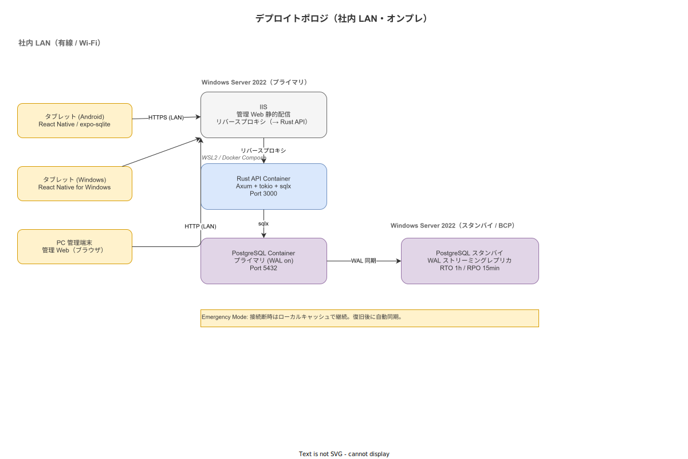

# 非機能要件サマリと環境前提

**主読者**: IT 部門・工場長・品質保証担当  
**想定所要時間**: 20 分

---

## 8.1 性能要件

| 項目 | 目標値 | 備考 |
|---|---|---|
| タップ応答時間（Optimistic UI 表示） | ≤ 100 ms | ローカル即時反映 |
| サーバ同期遅延（オンライン時） | ≤ 1 秒（p95） | LAN 内通信 |
| 管理 Web ページロード時間 | ≤ 2 秒（LAN 内） | 初回キャッシュ後 |
| QR/Data Matrix スキャン認識時間 | ≤ 500 ms | ML Kit Barcode Scanning |
| 同時接続タブレット数 | ≥ 50 台 | 単一 API サーバ・シングルスレッドなし |
| API レイテンシ（p99） | ≤ 200 ms | ロット照会・手順書取得 |

tokio 非同期ランタイム（Rust）は多数の並行 I/O を少ないスレッド数で効率的に処理する。50 台同時接続は単一サーバで達成可能と想定するが、Phase 1 PoC で実測して確認する。

---

## 8.2 可用性要件

| 項目 | 目標値 | 実現方法 |
|---|---|---|
| 年間可用性 | ≥ 99%（計画停止除く） | LAN 内 Active-Standby |
| 予定外停止への対応 | 30 分以内に再起動 | Docker Compose `restart: unless-stopped` |
| 端末側オフライン継続時間 | 無制限（SQLite キュー） | 作業継続のブロッカーにしない |

---

## 8.3 BCP（事業継続計画）

**RTO（目標復旧時間）: 1 時間 / RPO（目標復旧時点）: 15 分**

| シナリオ | 対応方針 |
|---|---|
| API サーバ停止 | タブレットは SQLite ローカルキューで作業継続。復旧後に自動同期 |
| LAN 断（建屋内） | Emergency Mode（ローカルキャッシュ参照）に自動切替。最終同期時刻を常時表示 |
| 停電 | UPS 対応の充電ステーション。PostgreSQL Standby が引き継ぎ |
| DB 障害（Primary） | WAL ストリーミングレプリカ（Standby）に切替。Point-in-Time Recovery で RPO 15 分 |
| サーバ機器故障 | Docker Compose 設定ファイルと DB バックアップから 1 時間以内に別機材で再構築 |

Emergency Mode ではトップページに「オフラインモード中 / 最終同期: HH:MM:SS」を常時表示し、作業者・工長が状況を認識できるようにする（[`90_業界分析/38_災害・BCP・緊急時手順と作業継続.md`](../../90_業界分析/38_災害・BCP・緊急時手順と作業継続.md) 参照）。

緊急連絡先・避難マップへのワンタップアクセスをホーム画面に常設する（BCP / 緊急時手順の即参照）。

---

## 8.4 耐環境要件（ハードウェア前提）

推奨端末の最低基準を以下の通り定める（[`90_業界分析/35_環境耐性と防爆・クリーンルーム設計.md`](../../90_業界分析/35_環境耐性と防爆・クリーンルーム設計.md) 参照）。

| 要件 | 基準 |
|---|---|
| 防水・防塵 | **IP65 以上**（加工液・粉塵環境） |
| 耐落下・耐振動 | **MIL-STD-810H** 準拠（Method 516.8 / 1.2m 落下）または産業用ケース装着 |
| 動作温度 | −20〜60℃（屋内製造環境は通常問題なし） |
| 画面輝度 | 屋内明所で 400 nits 以上（視認性確保） |
| タッチパネル | 手袋着用時の誤タップ防止（感度調整可能） |

### 推奨端末例（参考）

| 端末 | IP 等級 | MIL 対応 | OS |
|---|---|---|---|
| Samsung Galaxy Tab Active5 | IP68 | MIL-STD-810H | Android |
| Zebra ET45 | IP65 | MIL-STD-810G | Android |
| Panasonic TOUGHBOOK 55 | IP53 | MIL-STD-810H | Windows |

防爆要件（ATEX/IECEx/TIIS Zone 1/2）が必要な環境については、認証済み防爆機器の選定が必要であり、本システムの適用範囲外（SI 案件として個別対応）と判断する。

---

## 8.5 UX 要件（手袋・夜勤・高齢・外国人対応）

| 要件 | 基準 | 根拠 |
|---|---|---|
| タップターゲット | ≥ 72dp（手袋着用環境）、≥ 48dp（通常） | Fitts の法則・手袋環境補正（[`90_業界分析/18_現場HCIと作業者インターフェース.md`](../../90_業界分析/18_現場HCIと作業者インターフェース.md)） |
| コントラスト比 | ≥ 4.5:1（WCAG 2.1 AA）、ダーク時も同等 | WCAG 2.1 AA |
| フォントサイズ | 最小 12pt、シニアモード 14pt 以上 | 高齢配慮設計 |
| Glanceable UI | 重要情報を 1〜2 秒で把握できるレイアウト | Endsley SA モデル（[`90_業界分析/12_認知工学と状況認識.md`](../../90_業界分析/12_認知工学と状況認識.md)） |
| 色 + 形状の冗長符号化 | 色だけに依存した情報伝達の禁止 | 色覚特性への配慮 |
| ダークモード | 夜間（22:00〜06:00）に自動切替 | 夜勤シフト配慮 |
| ルビ・やさしい日本語 | 漢字レベル N3/N4/N5 で切替可能 | 外国人労働者対応 |
| 騒音下の操作 | 視覚フィードバック優先（色・アイコン・振動） | 工場騒音 90 dB 以上の環境 |

作業中断後の再開時には**プレースキーパー**（現在ステップのサムネイル・経過時間・再確認プロンプト）を表示する（[`90_業界分析/20_作業中断・割込み・再開の認知科学.md`](../../90_業界分析/20_作業中断・割込み・再開の認知科学.md) 参照）。

---

## 8.6 Rubber Stamping 監視要件

電子チェックリストの形骸化（Rubber Stamping）を防ぐ監視ロジックを実装する（[`90_業界分析/19_電子チェックリストと手順遵守の科学.md`](../../90_業界分析/19_電子チェックリストと手順遵守の科学.md) 参照）。

| 検出パターン | 監視ロジック | アクション |
|---|---|---|
| 異常高速完了 | ステップ平均完了時間の 3σ 以下 | 工長ダッシュボードに WARN 表示 |
| 写真未添付での完了 | 写真必須ステップで添付ゼロ | 完了ボタンを無効化（ハード制御） |
| 連続スキップ | 3 ステップ連続スキップ | 工長へのアラートメール |

---

## 8.7 セキュリティ非機能要件

| 項目 | 実装方針 |
|---|---|
| 認証 | JWT（RS256 署名）。アクセストークン有効期限 15 分、リフレッシュトークン 8 時間 |
| ロール別アクセス制御 | 作業員 / 工長 / QA / 管理者 の 4 ロール |
| 通信暗号化 | **HTTPS 必須**（自己署名証明書可）。ALCOA+ Original の前提として JWT 経路の暗号化を必須化。IIS が TLS 終端、HTTP → HTTPS 自動リダイレクト |
| DB 接続 | sqlx の環境変数経由接続文字列管理（コードへのハードコード禁止） |
| 写真ファイルアクセス | NGINX X-Accel-Redirect（認証済みユーザのみ取得可） |

社内 LAN 限定のため外部脅威は限定的だが、内部不正（記録改ざん）対策として Append-only Event Log を DB レベルで強制する（[`90_業界分析/22_規制別トレーサビリティ要件詳論.md`](../../90_業界分析/22_規制別トレーサビリティ要件詳論.md) 参照）。

---

> **本節で確定した方針**  
> 1. BCP 目標を RTO 1h / RPO 15min とし、LAN 内 Active-Standby + Emergency Mode を実装する。  
> 2. ハードウェア最低基準を IP65 + MIL-STD-810H とし、防爆認証が必要な環境は SI 案件として個別対応とする。  
> 3. WCAG 2.1 AA・手袋 72dp を UI 受入基準とし、Rubber Stamping 監視ロジックを品質管理の非機能要件として実装する。
