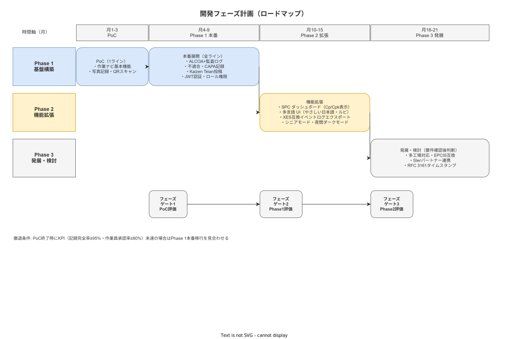

# 開発スケジュールとフェーズ計画

**主読者**: 経営層・調達担当・SIer パートナー  
**想定所要時間**: 20 分

---

## 9.1 フェーズ定義

全体を 3 フェーズに分け、フェーズゲート（評価・意思決定点）を経て次フェーズに移行する。

### Phase 1: 基盤構築（月 1〜9）

| 期間 | 内容 |
|---|---|
| 月 1〜3: PoC | 1 ライン限定の試験運用。作業ナビゲーション基本機能 + 写真記録 + QR スキャン |
| 月 4〜9: 本番 | 全ライン展開。ALCOA+ 監査ログ・不適合 CAPA・Kaizen Teian・JWT 認証・ロール権限 |

**Phase 1 の最低実装セット**:
- 作業手順書の表示・完了記録（ALCOA+ 準拠）
- 写真添付（SHA-256 ハッシュ）・QR/Data Matrix スキャン
- 不適合報告→CAPA 登録（8D フォーム）
- Kaizen Teian 投稿・管理ダッシュボード
- JWT 認証・4 ロール（作業員/工長/QA/管理者）
- Append-only Event Log・監査証跡エクスポート（CSV/JSON）
- Emergency Mode（LAN 断時のオフライン継続）
- 管理 Web（手順書版管理・ユーザ管理・トレーサビリティ照会）

### Phase 2: 機能拡張（月 10〜15）

前提: Phase 1 フェーズゲートをクリアした後に開始。

| 機能 | 内容 |
|---|---|
| SPC ダッシュボード | Cp/Cpk 表示（正規分布仮定の警告付き） |
| 多言語 UI（Phase 2） | ベトナム語・英語対応。DeepL 素案 + 人手グロッサリレビュー。安全クリティカル文言は機械翻訳禁止 |
| XES 互換エクスポート | IEEE Process Mining Manifesto 準拠のイベントログ出力 |
| JCSS 校正参照 | 測定器の校正証明書 PDF 添付オプション |
| RFC 3161 タイムスタンプ | 社内 NTP または外部 TSA でのタイムスタンプ付与 |

### Phase 3: 発展・検討（月 16〜21、要件確認後判断）

以下は Phase 2 完了後に実現可能性・ニーズを評価してから着手する。

| 検討項目 | 条件 |
|---|---|
| 多工場対応 | 複数工場顧客のニーズ確認後 |
| EPCIS 互換 | GS1 EPCIS 形式でのトレーサビリティデータ交換 |
| SIer パートナーシップ | パートナー API・Webhook 公開 |
| 中国語簡体・ポルトガル語対応 | 外国人労働者比率の高い顧客向け |

---

## 9.2 フェーズゲート設計

各フェーズの終了時にフェーズゲートを設け、KPI 達成状況を評価して次フェーズへの移行を決定する。

### フェーズゲート 1（PoC → Phase 1 本番）

| KPI | 閾値 | 達成しない場合 |
|---|---|---|
| 作業員による利用率 | ≥ 80%（対象ライン） | Phase 1 本番移行を見合わせ・原因分析 |
| 記録完全性 | ≥ 95% | 同上 |
| **作業員受容スコア（SUS）** | **SUS ≥ 70**（"Good" 相当、業界平均 68 を上回ること） | 同上 |
| 重大不具合（データ消失） | 0 件 | 即時中止・システム改修 |

> **SUS（System Usability Scale）採用根拠**: 10 問・100 点満点の国際標準的ユーザビリティ尺度。スコア 68 = 平均・70 = "Good" 相当（Sauro & Lewis, 2016）。独自アンケートではなく業界標準を採用することで、外部ベンチマーク比較が可能。

### フェーズゲート 2（Phase 1 本番 → Phase 2 拡張）

| KPI | 閾値 |
|---|---|
| 工程内不良率の改善 | 導入前比 -20% 以上 |
| トレーサビリティ照会応答時間 | ≤ 30 分 |
| CAPA 有効性確認率 | ≥ 90%（未確認で閉鎖しない） |

### フェーズゲート 3（Phase 2 拡張 → Phase 3 発展）

| 評価軸 | 内容 |
|---|---|
| Phase 2 機能の利用率 | SPC・多言語機能の実際の使用状況 |
| 顧客ニーズ調査 | 多工場展開・EPCIS の顧客要望確認 |
| 開発リソース評価 | 個人開発継続の判断・外部協力体制の検討 |

---

## 9.3 マイルストーン

| 月 | マイルストーン |
|---|---|
| 月 1 | **PoC 開始前の現状値測定**（不良率・記録作業時間・問い合わせ応答時間の直近 3 ヶ月平均を計測してベースライン確定）+ PoC 環境セットアップ完了 |
| 月 2 | 作業ナビ基本機能 + 写真記録の現場テスト開始 |
| 月 3 | PoC 評価完了（SUS アンケート実施）・フェーズゲート 1 判断 |
| 月 4 | Phase 1 本番向け機能開発開始（CAPA・Kaizen・権限管理） |
| 月 7 | セキュリティ・負荷テスト完了 |
| 月 9 | Phase 1 本番全ライン展開完了・フェーズゲート 2 判断 |
| 月 10 | Phase 2 開発開始（SPC・多言語・XES） |
| 月 15 | Phase 2 完了・フェーズゲート 3 判断 |
| 月 16 | Phase 3 検討開始（多工場・EPCIS） |

---

## 9.4 撤退条件（全フェーズ共通）

以下の事象が発生した場合、フェーズを問わずプロジェクトを停止し撤退判断を行う。

| 事象 | 対応 |
|---|---|
| データ消失・改ざんインシデント | 即時停止・原因調査・再設計判断 |
| 作業員拒否率が継続的に高い（> 30%） | ユーザビリティ抜本再設計または中止 |
| 規制機関からの指摘（ALCOA+ 違反等） | 即時停止・規制対応設計の見直し |
| 個人情報漏洩インシデント | 即時停止・個情法対応・当局報告 |

撤退時は全データを CSV/JSON 形式でエクスポートしてステークホルダーへ引き渡す。ベンダーロックインを設計上排除しているため、ユーザ組織が別システムへのデータ移行を行えることを保証する。

---

> **本節で確定した方針**  
> 1. Phase 1 PoC を 3 ヶ月・1 ライン限定で実施し、フェーズゲート 1 の KPI 達成を本番展開の条件とする。  
> 2. フェーズゲートを設けることで、「作れたから展開する」でなく「使われたから展開する」原則を守る。  
> 3. 撤退時のデータエクスポートを標準機能として提供し、ベンダーロックインを排除する。
