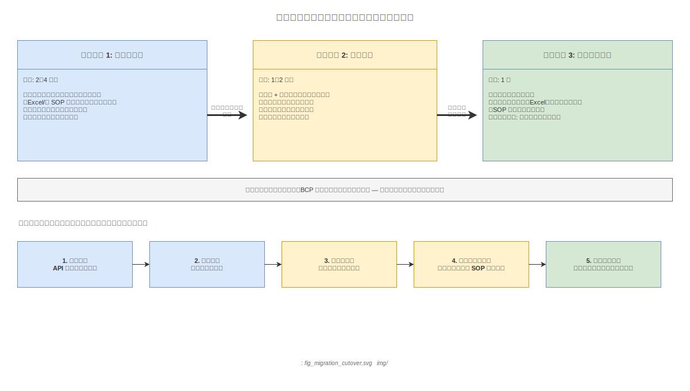

# 13 データ移行とマスタ初期投入戦略

本章の責務は、導入初日から本システムを使えるようにするための移行戦略を計画レベルで確定することである。製造業の現場では「導入第一週で必ず詰まる領域」が初期マスタ投入とデータ移行である。紙・Excel の既存 SOP の取込方針、過去トレサビ記録の救済方針、子機モード適用時の初期マスタ同期手順、カットオーバ計画を本章で確定する。計画 04 章の「初期導入シナリオ」と計画 12 章の「子機モード」に対して本章は移行の接続点として機能する。本章は方針の確定に留まり、具体的な移行ツールの仕様は要件定義・概要設計に委任する。

---

## 1. 既存紙 SOP の取込手順

### 紙 SOP の構造と本アプリへのマッピング

製造現場の紙 SOP は、作業手順書・検査基準書・作業日報・QC 工程表という 4 種類の形式が混在する場合が多い。本アプリの3階層（工程 / 作業 / Step）へのマッピング方針を以下の通り確定する。

| 紙 SOP の単位 | 本アプリの対応階層 | マッピングの考え方 |
|---|---|---|
| QC 工程表の「工程番号・工程名」 | 工程（Process） | QC 工程表の行が本アプリの工程に対応する |
| 作業手順書の「作業名・担当者」 | 作業（Operation） | 工程内の担当区分ごとに作業を定義する |
| 手順書の「番号付き手順・確認項目」 | Step | 番号付き手順 1 件が Step 1 件に対応する |
| 検査基準書の「管理特性・規格値」 | Step 属性（判定基準） | Step に検査パラメータとして紐付ける |

工程の単位が紙 SOP と一致しない場合は、QC 工程表を正として工程を定義し、作業手順書・検査基準書を工程 ID に紐付ける形で再構成する。

### 取込の2方式

**方式 A — 手入力方式**

システムが提供する Web 管理画面のフォームに沿って、品質担当が直接手入力する。入力テンプレートは QC 工程表の列構造に対応した設計とする。手入力方式は最も確実であるが、最も時間がかかる。10 Step 未満の工程や規制上の重要度が高い工程に推奨する。

**方式 B — OCR + 構造化方式**

紙をスキャンして PDF 化し、OCR ソフトウェアでテキストデータに変換した後、本アプリの Excel 入力テンプレートに手動で当てはめて取込む。OCR 変換後のテキストには誤変換が混入するため、品質担当による照合・修正が必須である。Step 数が多く定型的な工程に適用する。

どちらの方式においても、**品質担当による最終確認と電子署名を必須とする**。これは ALCOA+ の Accurate（正確性）原則への準拠であり、OCR・手入力双方の転記ミスを工程確認で吸収する。

### 移行優先度の決め方

移行対象の SOP が多数ある場合、以下の基準で優先度を決定する。

| 優先度 | 基準 | 判断の根拠 |
|---|---|---|
| 最優先 | 規制上の重要工程（ISO / 顧客仕様で管理特性が指定された工程） | 規制不適合がビジネスリスクに直結する |
| 高 | クレームが多い工程（過去 12 ヶ月のクレーム件数上位） | 改善インパクトが大きい |
| 中 | ロット変動が大きい工程（ばらつき指標 Cpk が基準値を下回る工程） | トレサビ記録の価値が高い |
| 低 | 安定工程・非製品接触工程 | 移行後回しによるリスクが小さい |

---

**本節で確定した方針**
- 紙 SOP を工程 / 作業 / Step の3階層にマッピングし、QC 工程表を工程定義の正源（Single Source of Truth）とする。
- 手入力方式と OCR + 構造化方式の 2 方式を用意し、工程の重要度と Step 数に応じて使い分ける。
- どちらの方式でも品質担当による最終確認と電子署名を必須とし、ALCOA+ Accurate 原則に準拠する。
- 規制工程 → クレーム多発工程 → ロット変動大工程 → 安定工程の優先順で移行する。

---

## 2. 既存 Excel SOP の取込手順

### Excel SOP の典型的な構造

製造現場の Excel SOP は「行が Step・列が属性（Step 番号・作業内容・担当者・判定基準・管理値・写真参照先等）」の表形式が多数を占める。この形式は本アプリの Step 構造と対応関係が高く、変換コストが低い。

### Excel テンプレート変換ツールの設計方針

本アプリは「Excel テンプレート変換ツール」を ver1.0.0 成果物として提供する。ツールの設計方針を以下の通り確定し、詳細仕様は概要設計フェーズで決定する。

| 設計要素 | 方針 |
|---|---|
| 標準入力フォーマット | CSV / xlsx 形式のいずれかを受け付ける。フォーマット仕様を公開し、既存 Excel からの手動整形を可能にする |
| 必須列の定義 | 工程 ID・作業名・Step 番号・Step 内容を必須列とし、残りは任意列とする |
| データ型検証 | Step 番号の整数型・管理値の数値型・日付フォーマットを検証し、不整合を検出する |
| Step 順序の検証 | Step 番号の欠番・重複を検出し、ツールが修正候補を提示する |
| 不整合報告 | 不整合箇所を一括レポート（CSV 形式）で返し、担当者が手動修正後に再投入する |

変換後は必ず Web 管理画面のプレビュー機能で全 Step を人的確認してから本番環境に投入する。プレビュー確認なしの自動投入は認めない。

### Excel テンプレートの扱い

Excel 入力テンプレート（標準フォーマット定義 + 記入例）を ver1.0.0 の成果物として提供する。テンプレートのファイル形式・列定義・記入規則は概要設計フェーズで確定する。

---

**本節で確定した方針**
- Excel テンプレート変換ツールを ver1.0.0 成果物として提供し、CSV / xlsx の標準フォーマット変換を実装する。
- フォーマット検証（必須列・データ型・Step 順序）を実行し、不整合を一括レポートで返して手動修正後に再投入する。
- 変換後のプレビュー確認を必須とし、人的確認なしの自動本番投入を禁止する。

---

## 3. ロット番号体系の引継ぎ

### 既存番号体系のそのままの引継ぎ

既存の製造番号・ロット番号・シリアル番号体系は本アプリ導入時点でそのまま引き継ぐことを基本方針とする。番号体系の変更は現場の混乱を招き、過去記録との突合を困難にするため禁止する。

### external_lot_id による紐付け

本アプリは内部 ID（UUID）と外部一意キーを分離して管理する。既存の番号体系は `external_lot_id` フィールドに格納し、本アプリの内部ロット ID と 1 対 1 で紐付ける。

| 項目 | 説明 |
|---|---|
| 内部 ID | 本アプリが採番する UUID。アプリ内部の参照・結合に使用する |
| external_lot_id | 既存の製造番号・ロット番号・シリアル番号をそのまま格納する |
| 外部一意キー | 型式・機番・品目コード等の属性の組み合わせで一意性を担保する複合キー |

### 過去ロットの参照可能性

本アプリ導入前に完了したロット（過去ロット）については、「参照用レコード（過去データ）」として本アプリのデータベースに保持する。参照用レコードには以下の属性を付与し、ALCOA+ 準拠の新規記録と明確に区別する。

- `is_legacy: true` フラグを設定する
- ALCOA+ 準拠対象外であることを管理画面上に可視化する
- 過去記録の改竄不可能性・タイムスタンプ信頼性は保証しないことを明示する

### ロット番号の一意性保証

既存番号体系に重複が存在する場合（同一ロット番号が複数の工場・製品ラインで使われている等）、以下の方針で対処する。

| 重複パターン | 対処方針 |
|---|---|
| 工場コードと組み合わせれば一意になる | 工場コードを接頭辞として付与する（例: FAC01-LOT0123） |
| 製品ラインと組み合わせれば一意になる | 製品ラインコードを接頭辞として付与する |
| どの組み合わせでも重複が解消しない | 移行担当者がケースバイケースで番号を採番し直す |

接頭辞の付与ルールは移行準備フェーズで品質担当が確定し、文書化する。

---

**本節で確定した方針**
- 既存のロット番号体系はそのまま引き継ぎ、`external_lot_id` として保持して内部 UUID と紐付ける。
- 過去ロットは `is_legacy: true` フラグで新規記録と区別し、ALCOA+ 準拠対象外であることを明示する。
- 番号重複が発生する場合は接頭辞付与で解消し、ルールを品質担当が文書化する。

---

## 4. 過去トレサビ記録の救済方針

### 3択の判断軸

過去トレサビ記録の取扱いは、記録の電子化状況と構造の整合性に応じて以下の 3 択で判断する。

| 過去記録の状態 | 推奨方針 | 理由 |
|---|---|---|
| 電子化済み（Excel / DB）・構造が整っている | CSV 変換して本アプリに取込（ただし ALCOA+ 非適合として管理） | 検索・参照可能性を確保し、クレーム対応・トレンド分析に活用できる |
| 電子化済みだが構造が不規則 | PDF として保存し添付参照 | 変換コストが移行効果を上回るため、構造化変換を行わない |
| 紙のみ | スキャン PDF として保存・本アプリ外で管理 | ALCOA+ 準拠の電子記録への変換は推奨しない |

### 「ALCOA+ 非適合として管理」の意味

過去記録を本アプリに取込む場合でも、以下の理由により ALCOA+ 非適合であることを明示する。

- **改竄不可能性の欠如**: 取込前の記録が改竄されていないことを事後に証明できない
- **タイムスタンプ信頼性の欠如**: 記録時刻の真正性を遡及して担保できない
- **署名の欠如**: 取込作業者が原記録者と異なる場合の Attributed 原則への不適合

過去記録は `is_legacy: true` フラグを付与し、管理ダッシュボード上では新規記録とは別区画に表示する。規制監査時には新規記録と明確に区別した形で提示する。

### やらないこと

- 過去記録の ALCOA+ 準拠への遡及適用（技術的に不可能であり、試みること自体が誤った信頼を生む）
- 全過去記録の構造化取込の保証（構造不規則な記録の変換は個別判断に委ねる）

---

**本節で確定した方針**
- 過去記録の取込方針を「電子化・構造整備済み → CSV 取込（ALCOA+ 非適合として管理）」「電子化・構造不規則 → PDF 添付参照」「紙のみ → スキャン PDF・本アプリ外管理」の 3 択で確定する。
- 取込んだ過去記録には `is_legacy: true` を付与し、管理ダッシュボードで新規記録と別区画に表示する。
- 過去記録の ALCOA+ 準拠への遡及適用は行わない。

---

## 5. 子機モード適用時の初期マスタ同期

### 初期同期の対象

子機モード（計画 12 章）を選択する工場は、本アプリ起動前に親機（ERP / MES / 生産管理パッケージ等）から品目マスタ・工程マスタを初期取込する必要がある。初期同期を完了せずに本アプリを稼働させることは認めない。

### 初期同期の手順

| ステップ | 作業内容 | 担当者 |
|---|---|---|
| 1. 接続設定 | 親機側の API エンドポイント URL・認証情報（API キー / OAuth）を本アプリの管理画面に設定する | IT 担当 |
| 2. 疎通確認 | ping 相当の接続テストを実行し、レスポンスコードと応答時間を確認する | IT 担当 |
| 3. フルシンク | 品目マスタ・工程マスタの全件を親機から一括取込する（「フルシンク」） | IT 担当 |
| 4. マッピング設定 | 外部一意キー（型式・機番・品目コード）と内部 SOP / 作業パターンの対応を設定する | 品質担当 |
| 5. 確認・承認 | フルシンク結果とマッピング設定を品質担当が確認し電子署名で承認する（ALCOA+ Attributed 原則） | 品質担当 |
| 6. 差分同期へ移行 | 承認完了後、通常の差分同期（インクリメンタルシンク）スケジュールを有効化する | IT 担当 |

### フルシンク失敗時の縮退動作

フルシンクが失敗した場合、本アプリは単独動作モードで引き続き稼働させる。親機との接続問題の解決を待つ間も、手動でマスタを登録することで作業記録を継続できる。フルシンク失敗の原因（ネットワーク障害・API 認証エラー・データ形式不整合等）はエラーログに記録し、IT 担当に通知する。

### マッピング未設定の外部一意キーの扱い

フルシンクで取込んだ品目コードに対して SOP / 作業パターンのマッピングが未設定の場合、本アプリは以下の縮退動作をとる。

- 管理画面に「マッピング未設定の品目コードが X 件あります」と警告を表示する
- マッピング未設定の品目コードに対しても作業記録は可能にする（作業パターンが表示されないだけ）
- マッピング未設定のまま作業を開始した場合、記録に `mapping_incomplete: true` フラグを付与する

この縮退動作により、マッピング設定の遅れが現場作業の停止に直結しないようにする。

---

**本節で確定した方針**
- 子機モード初期同期を「接続設定 → 疎通確認 → フルシンク → マッピング設定 → 品質担当承認 → 差分同期移行」の 6 ステップで確定する。
- フルシンク失敗時は単独動作モードで稼働継続し、現場作業を停止させない。
- マッピング未設定の品目コードは警告表示の上で作業可能とし、`mapping_incomplete: true` フラグで管理する。
- マッピング設定の承認を品質担当の電子署名で完結させ、ALCOA+ Attributed 原則に準拠する。

---

## 6. ステージング環境とカットオーバ計画

### ステージング環境の構築

本番環境と同等の構成を持つステージング環境を移行リハーサル用に構築する。ステージング環境は本番とは論理的に分離し、移行作業中に本番への影響が発生しないよう保証する。ステージング環境は Docker Compose を使用して本番と同等の設定で再現する。

**図 1: データ移行・カットオーバ計画**

> 原本: [`img/fig_migration_cutover.drawio`](img/fig_migration_cutover.drawio)

### カットオーバの3段階

| フェーズ | 期間 | 内容 |
|---|---|---|
| リハーサル | 2〜4週間 | ステージング環境で移行手順を検証する。SOP 取込・ロット番号体系引継ぎ・初期マスタ同期を実際に実施し、問題点を洗い出して修正する |
| 並行運用 | 1〜2週間 | 本番環境とステージング環境を並行稼働させる。同一作業を両環境で記録し、差分を確認する |
| カットオーバ | 1日 | 本番環境に移行を完了する。旧システム（紙・Excel）を「縮退モード」（参照専用・記録停止）に移行する |

### 紙フォールバックとの連携

カットオーバ後も紙フォールバックを廃止しない。計画 04 章の縮退モードと 09 章の BCP 方針と整合させ、カットオーバ後の紙フォールバック管理規則を以下の通り確定する。

- カットオーバ後の紙 SOP は「フォールバック用途限定」とラベルを変更する
- 紙 SOP の更新は本アプリの SOP 更新に追随して週次で行う
- 紙への記録が発生した場合は、アプリ復旧後に `is_retroactive: true` フラグ付きで後入力する

### カットオーバ判定基準

カットオーバの実施判定は計画 10 章の ver1.0.0 リリース判定要件と整合させ、以下の条件をすべて満たすことを必須とする。

| 判定項目 | 基準 |
|---|---|
| リハーサル完了 | 全優先度工程の SOP 取込が完了し、品質担当の承認が完了している |
| フルシンク完了 | 子機モードを選択する工場の初期マスタ同期が品質担当承認済みである |
| フォールバック準備 | 紙フォールバックセットが各工程に配置済みである |
| 担当者教育 | 全作業員の初期教育完了レコードがシステムに登録されている |

---

**本節で確定した方針**
- ステージング環境を Docker Compose で本番同等構成で構築し、移行リハーサルを 2〜4週間実施する。
- カットオーバを「リハーサル → 並行運用 → カットオーバ」の 3 段階で実施する。
- カットオーバ後も紙フォールバックを廃止せず、計画 04 章・09 章の BCP 方針と整合させる。
- カットオーバ判定は計画 10 章の ver1.0.0 リリース判定要件に準拠し、全条件の充足を必須とする。

---

## 7. やらないこと

本章が意図的に対象外とする項目を以下に確定する。

- **過去データの ALCOA+ 準拠への遡及適用**: 技術的に不可能であり、試みること自体が誤った信頼を生む。
- **業種別移行テンプレートの全量提供**: 業種によって SOP 構造の差異が大きく、個別対応が必要である。標準テンプレートの提供に留める。
- **親機からの全マスタの自動構造化**: 外部一意キーと内部 SOP / 作業パターンのマッピング設定は人手による確認が必要であり、自動化しない。
- **移行前後のデータ完全一致の保証**: OCR・手入力・フォーマット変換に起因するデータ変換誤差は人的確認（品質担当の最終承認）で吸収する。完全一致の自動検証は実施しない。

---

**本節で確定した方針**
- 過去データの ALCOA+ 遡及適用・業種別テンプレートの全量提供・全マスタの自動構造化・移行データの完全一致保証の 4 項目を本章のスコープ外として確定する。
- これらの対象外項目は要件定義・概要設計フェーズでの個別検討事項として明示的に移管する。

---

## 参照業界分析

### 必須参照

（本章の計画時点では業界分析の該当章は存在しない。要件定義フェーズで業界分析を参照すること。）

### 関連参照

- [`90_業界分析/30_国内製造業IT調達慣行.md`](../../90_業界分析/30_国内製造業IT調達慣行.md)
