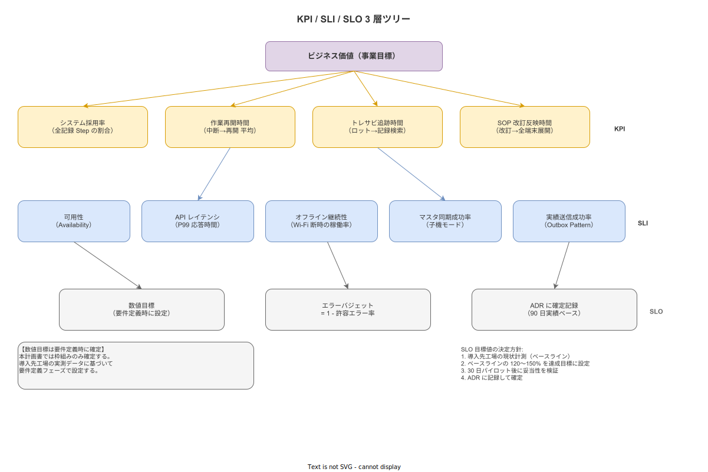
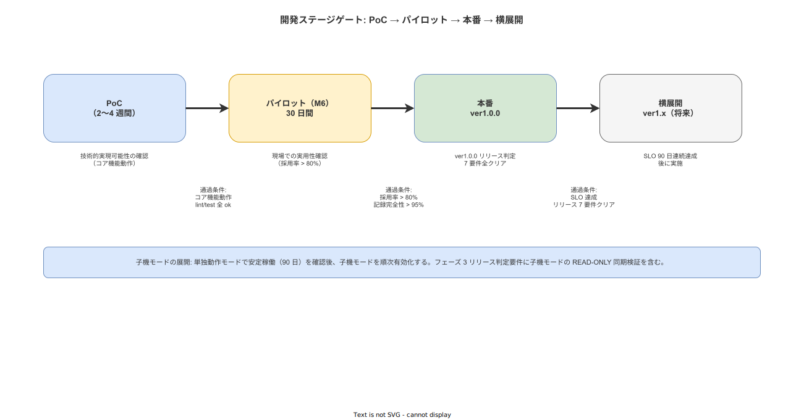

# 14 品質指標と SLI / SLO / KPI 枠組み

本章の責務は、08 章「具体的な KPI / SLI / SLO 数値目標は要件定義に委任」という方針の上位枠組みを計画レベルで確定することである。何を計測するか・どうやって目標値を決めるか・PoC からどう進むかという枠組みを確定することで、要件定義フェーズが一貫した品質計測体系を持てるようにする。12 章（子機モード）の採用に伴い、マスタ同期成功率・実績送信成功率という新しい SLI をこの段階で枠組みに組み込む。

---

## 0. 本章の位置づけ

本システムの品質指標体系は KPI / SLI / SLO の三層構造で管理する。

- **KPI（Key Performance Indicator）**: 事業価値の計測。「このシステムを導入して現場は良くなったか」を問う。
- **SLI（Service Level Indicator）**: システム挙動の計測。「システムは正しく動いているか」を問う。
- **SLO（Service Level Objective）**: SLI に対する目標値。「どの水準を達成すれば合格か」を定める。

**図 1: KPI / SLI / SLO 三層ツリー**

> 原本: [`img/fig_kpi_sli_slo_tree.drawio`](img/fig_kpi_sli_slo_tree.drawio)

08 章は ISO/IEC 25010 の品質特性フレームワークを確定し、具体的な数値目標の設定を要件定義フェーズに委任した。本章はその委任の実行方法を確定する。数値目標は要件定義時に導入先工場の実測データ（ベースライン）から設定する方針であり、これは 02 章が確定した「ROI の事前保証を避け、実測ベースで目標を設定する」方針と整合する。

本章で確定した SLO 達成判定は、10 章が定める ver1.0.0 リリース判定要件の一部を構成する。リリース判定 7 要件のうち品質関連項目は本章の枠組みに従って評価する。

---

**本節で確定した方針**
- KPI / SLI / SLO の三層構造で品質指標を管理することを確定する。
- 数値目標の設定は要件定義時の実測ベースラインから行う。計画段階での事前確定はしない。
- 本章の枠組みは 10 章の ver1.0.0 リリース判定要件と接続し、品質関連判定はこの枠組みで評価する。

---

## 1. 上位 KPI（事業価値計測）

本システムが提供する事業価値を計測するための上位 KPI を以下の 4 項目に確定する。

| KPI | 定義 | 計測方法 | 目標値の設定タイミング |
|---|---|---|---|
| システム採用率 | 全対象作業のシステム記録割合（%） | 全 Step 記録件数 / 対象 Step 数 × 100 | 要件定義時（実測ベース） |
| 作業再開時間 | 中断後に作業を再開するまでの平均時間（分） | 中断イベント〜次 Step 完了のタイムスタンプ差 | 要件定義時（実測ベース） |
| トレサビ追跡時間 | ロット番号から関連作業記録を引き当てるまでの時間（分） | 品質担当のトレサビ検索時間を計測 | 要件定義時（実測ベース） |
| SOP 改訂反映時間 | SOP 改訂から全作業員への展開完了までの時間（時間） | 改訂確定時刻〜全端末への同期完了時刻 | 要件定義時（実測ベース） |

KPI の優先順位はシステム採用率を最優先とする。システムが使われなければ他の KPI は計測不能であり、採用率の低下はその後の全 KPI を無効化する。採用率の計測はシステム稼働開始初日から実施し、30 日パイロット期間（10 章 M6）における採用率の推移を記録する。

12 章で確定した子機モードの採用に伴い、以下の KPI を追加する。これらは子機モードを採用する工程にのみ適用する。

| KPI（子機モード） | 定義 | 計測方法 | 目標値の設定タイミング |
|---|---|---|---|
| マスタ同期完了率 | 計画されたマスタ同期のうち成功した割合（%） | 同期完了件数 / 計画同期件数 × 100 | 要件定義時（実測ベース） |
| 実績連携率 | 送信すべき実績のうち実際に親機に届いた割合（%） | 親機受信件数 / 子機送信キュー件数 × 100 | 要件定義時（実測ベース） |

---

**本節で確定した方針**
- 上位 KPI としてシステム採用率・作業再開時間・トレサビ追跡時間・SOP 改訂反映時間の 4 項目を確定する。
- KPI の優先順位はシステム採用率を最優先とし、採用率の計測は稼働初日から開始する。
- 子機モード採用工程にはマスタ同期完了率・実績連携率の 2 KPI を追加する。
- 全 KPI の数値目標は要件定義時の実測ベースラインから設定し、計画段階では確定しない。

---

## 2. SLI（システム挙動計測）

システムが正しく動いているかを計測するための SLI を以下の通り確定する。

| SLI | 定義 | 計測対象 |
|---|---|---|
| 可用性（Availability） | 計画稼働時間のうち実際に利用可能だった割合 | サーバー・API・タブレットアプリ |
| API レイテンシ | P99 応答時間 | REST API 全エンドポイント |
| オフライン継続性 | Wi-Fi 断絶時に作業記録が継続できた割合 | タブレット端末（Offline-First 検証） |
| マスタ同期成功率 | 計画したマスタ同期のうち完全完了した割合（子機モード時） | 親機から子機への同期処理 |
| 実績送信成功率 | 送信キューに積んだ実績のうち最終的に親機に届いた割合（子機モード時） | Outbox Pattern の成功率 |

可用性は 08 章が確定した RTO 1 時間・RPO 15 分と接続する。API レイテンシは 08 章 2 節の応答時間方針値（ページ遷移 500ms 以内・管理 Web クエリ 3 秒以内）を SLI として計測可能な形で表現したものである。オフライン継続性は 05 章の Offline-First アーキテクチャ原則が実装レベルで機能しているかを検証する。

マスタ同期成功率と実績送信成功率は 12 章の子機モード採用によって新設する SLI である。マスタ同期は親機から子機へのマスタデータのプルが完全に完了したかを計測し、実績送信は子機から親機への作業実績データのプッシュが最終的に親機に到達したかを計測する。Outbox Pattern の採用（12 章）により、一時的な通信断は実績送信成功率に影響しない設計とする。

SLI の計測には以下の手段を用いる。

| SLI | 計測手段 |
|---|---|
| 可用性 | ヘルスチェックエンドポイント（毎分ポーリング） |
| API レイテンシ | axum ミドルウェアによるリクエスト・レスポンス時刻の記録 |
| オフライン継続性 | Wi-Fi 断絶シミュレーション時の Step 記録成功・失敗ログ |
| マスタ同期成功率 | 同期ジョブの開始・完了・失敗イベントのログ |
| 実績送信成功率 | Outbox キューの投入件数と親機受信確認件数の照合 |

---

**本節で確定した方針**
- SLI として可用性・API レイテンシ・オフライン継続性の 3 項目を基本 SLI として確定する。
- 子機モード採用に伴いマスタ同期成功率・実績送信成功率の 2 SLI を追加し、計 5 SLI を枠組みとして確定する。
- Outbox Pattern による実績送信は一時的な通信断を成功率に影響させない設計とし、これを SLI の計測仕様に含める。
- 計測手段は axum ミドルウェア・ヘルスチェック・Outbox キューログの組み合わせで実装する。

---

## 3. SLO（目標値）の決定方針

SLO の数値確定は要件定義フェーズに委任する。本節で確定するのは「どのように数値を決めるか」という決定プロセスの方針である。

SLO の決定プロセスは以下の 4 ステップで行う。

1. **ベースライン計測**: 導入先工場の現状を計測する。システム導入前の作業記録時間・トレサビ追跡時間・ダウンタイム頻度等を定量化する。
2. **目標値の設定**: ベースラインの 120〜150% を達成目標として設定する。この倍率は ROI の実証根拠として機能しつつ、過剰な目標設定による現場負担増を避けるために設定する。02 章の「ROI の事前保証を避ける」方針と整合する。
3. **パイロット検証**: 30 日パイロット（10 章 M6）の結果で目標値の妥当性を検証する。パイロット期間中に SLI を継続計測し、設定した SLO を達成可能かどうかを確認する。
4. **SLO の確定と ADR 記録**: 本番移行時に SLO を確定し、ADR（アーキテクチャ決定記録）に記録する。確定した SLO は以降のリリース判定・横展開の通過条件として機能する。

エラーバジェットの概念を本システムに導入する。SLO は「100% − 許容エラー率」として表現する。例えば可用性 SLO が 99.5% であれば、月間 3.6 時間がエラーバジェットとなる。エラーバジェットの意義はシステム信頼性と機能開発速度のトレードオフを定量的に管理することにある。

エラーバジェット超過時の対応方針を以下の通り確定する。詳細な閾値と運用手順は要件定義フェーズの ADR で確定する。

| 状態 | 対応方針 |
|---|---|
| バジェット残量 50% 以上 | 通常の機能開発を継続する |
| バジェット残量 50% 未満 | 新機能追加を抑制し、信頼性改善を優先する |
| バジェット枯渇（超過） | 機能追加を停止し、障害原因の根本対応に集中する |

---

**本節で確定した方針**
- SLO 数値の確定は要件定義フェーズに委任し、本章ではプロセス方針のみを確定する。
- ベースライン計測 → ベースライン 120〜150% 設定 → パイロット検証 → ADR 記録の 4 ステップを SLO 決定プロセスとして確定する。
- エラーバジェットを導入し、SLO を「100% − 許容エラー率」で表現することを確定する。
- エラーバジェット超過時は機能追加を停止し修正を優先する方針を確定する。詳細閾値は ADR で記録する。

---

## 4. テスト戦略

品質指標が正しく達成されているかを継続的に検証するためのテスト戦略を以下の通り確定する。

| テストレベル | 目的 | ツール方針 |
|---|---|---|
| ユニットテスト | 関数・コンポーネント単位の正確性 | Rust: cargo test / React・RN: Jest |
| 統合テスト | API・DB・外部連携の結合 | Rust: sqlx test + テスト用 DB / React Native: Detox |
| 契約テスト | OpenAPI スキーマと実装の整合・親機モックとの契約 | OpenAPI スキーマ駆動テスト（Dredd 等） |
| E2E テスト | ユーザーシナリオ全体の動作確認 | Detox（タブレット）・Playwright（管理 Web） |
| 負荷テスト | 連携バーストシナリオ・同時接続数 | k6 または Locust |
| カオステスト | 親機停止・マスタ同期失敗・ネットワーク断 | 手動シナリオ + 自動化（CI/CD パイプライン） |

テストピラミッドの比率方針はユニット > 統合 >> E2E とする。E2E テストは幸福経路（Happy Path）と主要エラーシナリオのみを対象とし、網羅的な E2E テストは避ける。E2E テストのコストと保守負荷が個人開発のボトルネックになることを防ぐための方針である。

子機モードの契約テストでは、親機をモックに見立て、OpenAPI スキーマで定義した入出力の契約をテストする。親機の実装が変更された場合にも、契約テストによってインターフェースの破損を早期に検出できる体制を構築する。

カオステストの必須シナリオは以下の通りとする。

| 必須カオスシナリオ | 検証内容 |
|---|---|
| 親機停止中の作業記録 | 親機が停止している状態で作業員が Step 記録できること |
| マスタ同期失敗後の継続作業 | マスタ同期が失敗しても既存マスタデータで作業を継続できること |
| ネットワーク断絶中の実績蓄積 | Wi-Fi 断絶中に発生した実績が復旧後に親機へ送信されること |
| 大量実績の一括送信 | バースト発生時に実績送信が欠損なく完了すること |

---

**本節で確定した方針**
- ユニット・統合・契約・E2E・負荷・カオスの 6 テストレベルを採用することを確定する。
- テストピラミッドの比率方針はユニット > 統合 >> E2E とし、E2E は幸福経路と主要エラーシナリオのみとする。
- 子機モードの契約テストは親機をモックとした OpenAPI スキーマ駆動テストで実施することを確定する。
- 「親機停止中の作業記録継続」をカオステストの最優先シナリオとして確定する。

---

## 5. PoC → パイロット → 本番 → 横展開のステージゲート

品質指標の達成状況に基づくステージゲートを以下の通り定義する。

| フェーズ | 期間 | 目的 | 通過条件 |
|---|---|---|---|
| PoC（Proof of Concept） | 2〜4 週間 | 技術的実現可能性の確認 | コア機能（SOP 表示・Step 記録・ALCOA+）が動作すること |
| パイロット（M6、10 章） | 30 日 | 現場での実用性確認 | システム採用率 >80% / 明らかな UX 問題なし / 記録完全性 >95% |
| 本番（ver1.0.0 リリース） | ー | 本番運用開始 | 10 章の ver1.0.0 リリース判定 7 要件を全て満たすこと |
| 横展開（ver1.x） | ver1.0.0 後 | 他工程・他ライン・他拠点への展開 | SLO を 90 日間連続で達成していること |

**図 2: ステージゲート**

> 原本: [`img/fig_stage_gate.drawio`](img/fig_stage_gate.drawio)

10 章 M1〜M6 マイルストーンとの対応関係を以下に示す。

| マイルストーン（10 章） | 本章ステージゲートとの対応 |
|---|---|
| M1（要件定義完了） | ベースライン計測完了・SLO 決定プロセス開始 |
| M2（設計完了） | テスト戦略の詳細設計完了・カオスシナリオのケース確定 |
| M3（バックエンド完了） | ユニット・統合テスト完了・負荷テスト実施 |
| M4（タブレット APP 完了） | E2E・契約テスト完了・オフライン継続性の検証完了 |
| M5（管理 Web 完了） | 全テストレベル完了・カオステスト実施 |
| M6（パイロット完了） | パイロット通過条件の達成確認・SLO 妥当性の検証完了 |

パイロットの通過条件に含まれるシステム採用率 >80% と記録完全性 >95% は、要件定義フェーズで実測ベースラインを取得した後に再確認する。パイロット通過条件の数値は計画段階の暫定値であり、要件定義フェーズで確定する。

---

**本節で確定した方針**
- PoC → パイロット → 本番 → 横展開の 4 ステージゲートを確定し、各フェーズの通過条件の枠組みを確定する。
- パイロット通過条件（システム採用率 >80%・記録完全性 >95%）は暫定値であり、要件定義フェーズで実測ベースラインを踏まえて確定する。
- 横展開の通過条件として「SLO を 90 日間連続で達成」を確定する。
- 10 章 M1〜M6 マイルストーンと本章ステージゲートの対応関係を確定し、品質計測活動を開発スケジュールに組み込む。

---

## 6. やらないこと

本章の枠組みから意図的に除外する項目を明示する。

- **KPI 数値の事前確定**: 導入先工場の実測ベースラインなしにシステム採用率・作業再開時間等の数値目標を計画段階で確定しない。計画段階での数値確定は根拠のない目標設定であり、要件定義の品質を損なう。
- **SLO の 100% 達成保証**: いかなる SLI においても 100% を SLO に設定しない。エラーバジェットの概念と矛盾するため、保証は行わない。
- **全業種・全工程への適用 SLI の網羅**: 初期実装では主要 SLI 5〜7 件（本章で確定した 5 SLI）に絞る。個人開発の保守負荷を考慮し、計測対象の過剰な拡張は避ける。

---

**本節で確定した方針**
- KPI 数値の計画段階での確定・SLO の 100% 保証・SLI の網羅的拡張の 3 点を明示的にやらないこととして確定する。
- 計測対象は本章で確定した 5 SLI を上限の基準とし、要件定義フェーズで追加が必要な場合は ADR で記録する。

---

## 参照業界分析

### 必須参照

（本章固有の必須参照はなし。上位方針は 02 章・08 章・10 章・12 章を参照のこと）

### 関連参照

- [`90_業界分析/29_競合製品と市場ポジション.md`](../../90_業界分析/29_競合製品と市場ポジション.md)
- [`90_業界分析/30_国内製造業IT調達慣行と予算サイクル.md`](../../90_業界分析/30_国内製造業IT調達慣行と予算サイクル.md)
