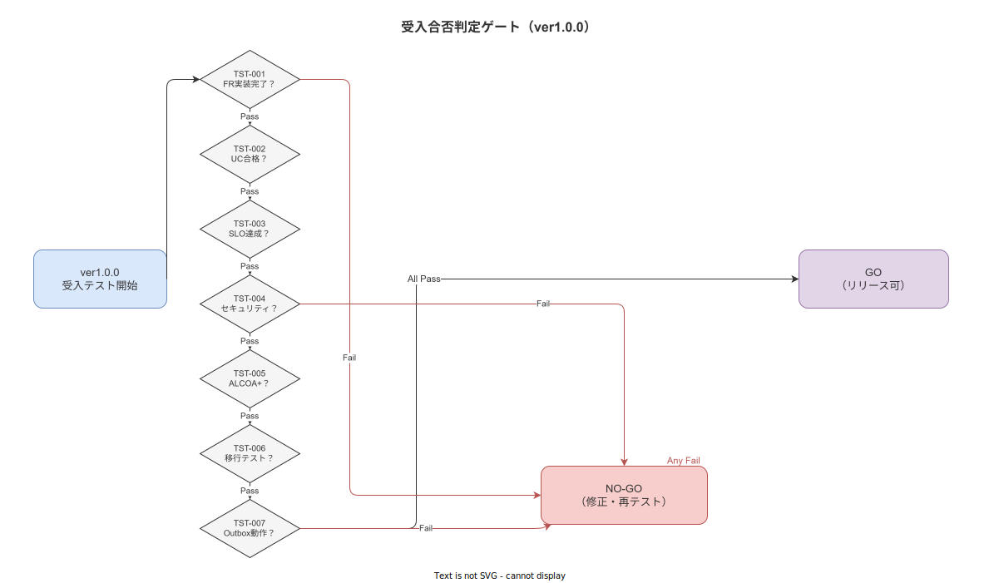

# 01 受入基準と合否判定

本章の責務は、ver1.0.0 リリースの合否を判定するための受入基準を検証可能命題として確定し、合否判定フローおよび不合格時の対応手順を定めることである。本章で確定する受入基準はリリース判定の唯一の根拠となり、主観的評価による合否判定を排除する。

---

## 1. ver1.0.0 受入基準 7 要件

### 1-1. 受入基準の位置づけ

受入基準は「この条件を Pass した場合にのみ ver1.0.0 のリリースを認める」という検証可能命題の集合である。7 件すべてを満たすことが合格条件であり、1 件でも不合格の場合はリリースを認めない。7 件の充足確認は上流文書システム化計画 10 章の「リリース判定 7 要件」と連動し、本章の受入基準がその詳細仕様となる。

**図 1: 受入ゲート判定フロー**

> 原本: [`img/fig_acceptance_gate.drawio`](img/fig_acceptance_gate.drawio)

### 1-2. TST-001: 全機能要件の実装完了

| 属性 | 内容 |
|---|---|
| 要件 ID | TST-001 |
| 優先度 | Must |
| 上流リンク | 計画 10 章リリース判定要件 / 機能要件サブ全体 |

機能要件（FR）の実装完了率が以下の水準を満たすこと。

- Must 優先度の全機能要件（FR-NV・FR-TR・FR-SY・FR-MS・FR-AL・FR-EX 各サブ）の 100% が受入テストで Pass していること
- Should 優先度の全機能要件の 100% が受入テストで Pass していること
- Could 優先度の機能要件の 80% 以上が受入テストで Pass していること

受入基準: FR サブ全体の Must/Should 要件の Pass 率が 100% であること。Could 要件の Pass 率が 80% 以上であること。いずれかが未達の場合は TST-001 不合格とする。

### 1-3. TST-002: 全ユースケースの受入テスト合格

| 属性 | 内容 |
|---|---|
| 要件 ID | TST-002 |
| 優先度 | Must |
| 上流リンク | 業務要件 BR-SC サブ / 計画 04 章ユースケース |

全ユースケース（UC-001〜UC-XXX）について、以下のすべてのシナリオが受入テストで Pass していること。

- 正常シナリオ（Happy Path）の全ケース
- 代替シナリオ（Alternative Path）の全ケース
- 例外シナリオ（Exception Path）の全ケース（エラー処理・タイムアウト・再接続含む）

受入基準: 全 UC の全シナリオ（正常・代替・例外）が Pass であること。いずれかのシナリオで 1 件でも Fail がある場合は TST-002 不合格とする。

### 1-4. TST-003: 非機能要件の SLO 達成確認

| 属性 | 内容 |
|---|---|
| 要件 ID | TST-003 |
| 優先度 | Must |
| 上流リンク | NFR サブ全体 / 計画 14 章 SLI/SLO 枠組み |

非機能要件（NFR）で確定された SLO（Service Level Objective）の各達成条件が検証環境（ステージング）での計測で以下を満たすこと。

- 稼働率（NFR-AVL）: 要件定義で確定した SLO 値以上を連続 1 週間以上達成していること
- P99 応答時間（NFR-PRF）: ページ遷移 500ms 以内・管理 Web クエリ 3 秒以内を全エンドポイントで達成していること
- オフライン継続性（NFR-AVL オフライン）: Wi-Fi 断絶シミュレーション中に Step 記録の成功率が 100% であること

受入基準: 上記 SLO 計測値が NFR サブで確定した目標値をすべて満たしていること。1 項目でも未達の場合は TST-003 不合格とする。

### 1-5. TST-004: セキュリティ要件の充足確認

| 属性 | 内容 |
|---|---|
| 要件 ID | TST-004 |
| 優先度 | Must |
| 上流リンク | NFR-SEC サブ / 計画 15 章セキュリティ深堀り |

以下のセキュリティ要件がすべて Pass であること。

- RBAC（役割ベースアクセス制御）: 全ロール（作業員・現場監督・品質担当・IT 担当・マスタ編集者）の権限が正しく機能していること。権限外の操作が技術的に拒否されること。
- JWT 認証: 有効期限切れトークン・改ざんトークン・未認証アクセスがすべて 401/403 レスポンスで拒否されること
- 脆弱性スキャン: `cargo audit` によるRust依存ライブラリのCVEスキャンで CVSS 7.0 以上の脆弱性がゼロであること。OWASP ZAP（または同等ツール）によるウェブアプリスキャンで High 評価の脆弱性がゼロであること

受入基準: RBAC 権限テスト全 Pass・JWT 拒否テスト全 Pass・脆弱性スキャンで High 以上ゼロの 3 条件をすべて満たすこと。

### 1-6. TST-005: ALCOA+ 9 原則の検証テスト全通過

| 属性 | 内容 |
|---|---|
| 要件 ID | TST-005 |
| 優先度 | Must |
| 上流リンク | FR-TR サブ / 計画 06 章 ALCOA+ マトリクス |

ALCOA+ 9 原則（Attributable・Legible・Contemporaneous・Original・Accurate・Complete・Consistent・Enduring・Available）の各原則に対して、計画 06 章が確定した ALCOA+ マトリクスの自己監査チェックリストの全項目が Pass であること。

- Attributable: 全記録に記録者 ID・ロール・タイムスタンプが付与されていること
- Contemporaneous: 記録完了タイムスタンプとクライアント送信時刻の差が 500ms 以内であること
- Consistent: SHA-256 ハッシュチェーンが全記録で検証可能であること（改ざん検知機能の動作確認）
- Original: Append-only 制約により既存記録の上書き削除が技術的に禁止されていること
- Complete: 全クリティカルステップの記録が完了していない場合に次 Step への進行が技術的にブロックされること

受入基準: ALCOA+ 9 原則の自己監査チェックリスト全項目が Pass であること。1 項目でも Fail の場合は TST-005 不合格とする。

### 1-7. TST-006: 移行テスト合格

| 属性 | 内容 |
|---|---|
| 要件 ID | TST-006 |
| 優先度 | Must |
| 上流リンク | MIG サブ / 計画 13 章データ移行戦略 |

マスタ初期投入および既存データ移行について、以下のすべてが Pass であること。

- マスタ初期投入（工程・作業・Step・ユーザー・機器マスタ）が移行手順書に従って完了し、データ件数・整合性の確認クエリが全件一致していること
- 移行後のデータ整合性確認（外部キー制約・NULL 制約・型制約の違反ゼロ）が Pass であること
- 移行ロールバック手順が実機で確認済みであること

受入基準: 移行完了後の整合性確認クエリが全件 Pass であること。制約違反ゼロ。ロールバック手順の実機確認済みであること。

### 1-8. TST-007: 子機モード Outbox 送受信の正常確認

| 属性 | 内容 |
|---|---|
| 要件 ID | TST-007 |
| 優先度 | Must |
| 上流リンク | FR-SY サブ / 計画 12 章子機モード / 計画 14 章カオスシナリオ |

子機モードの Outbox Pattern による送受信が以下のシナリオすべてで正常動作すること。

- 親機停止中に発生した作業実績が子機の Outbox キューに蓄積されること
- 親機復旧後に Outbox キューの未送信実績が自動的に親機へ送信されること
- 重複送信防止（Idempotency Key）が機能し、同一実績が親機に 2 回以上記録されないこと
- 子機から親機への実績送信成功率が 100% であること（通信断解消後の最終到達）

受入基準: Outbox 送受信シナリオ 4 ケースが全 Pass であること。重複記録ゼロ。最終送信成功率 100%。

---

**本節で確定した方針**
- ver1.0.0 受入基準を TST-001〜TST-007 の 7 要件として確定し、全件 Pass を合格条件とする。
- TST-001〜007 の 1 件でも不合格の場合はリリースを認めないことを確定する。
- 各要件は検証可能命題として記述し、Pass/Fail を客観的に判定できる受入基準を付与することを確定する。

---

## 2. 合否判定フロー

### 2-1. 判定権限者の定義

| 要件 ID | 属性 | 内容 |
|---|---|---|
| TST-010 | 判定権限 | 本プロジェクトは個人開発であるため、判定権限者は開発者本人（セルフ受入）とする。ただしセキュリティ監査（TST-004）に関しては、外部専門家レビューの実施を推奨する（実施した場合はレビュー記録を証跡として保存する） |

合否判定は開発者本人が「受入テスト実施記録」に基づいて実施する。主観的判断に依存しないよう、各要件の Pass/Fail は本章に記述した受入基準の充足確認で判定する。受入テスト実施記録は `docs/03_要件定義/テスト・受入要件/証跡/` に保存する。

### 2-2. 合否判定手順

| 要件 ID | 内容 |
|---|---|
| TST-011 | 合否判定は以下の 5 ステップで実施する |

1. **受入テスト実施**: 受入シナリオ（本章 05 節）に従って全テストを実施し、結果を「受入テスト実施記録」に記録する
2. **Pass/Fail 集計**: TST-001〜TST-007 の各要件について Pass/Fail を判定し、集計表に記録する
3. **合否の宣言**: 全 7 要件が Pass の場合は「合格」を宣言する。1 件でも Fail の場合は「不合格」を宣言し、不合格要件 ID と理由を記録する
4. **判定記録の署名**: 合否宣言を「受入完了記録」に記録し、判定日時・判定者・判定結果を記録する（電子署名機能を使用する）
5. **リリース判定との接続**: 合格の場合のみ、プロジェクト要件 05 章の「リリース判定 7 要件」のチェックリストに TST 受入基準全クリアとして記録する

### 2-3. NO-GO 時の対応手順

| 要件 ID | 内容 |
|---|---|
| TST-012 | 不合格宣言時は以下の手順で対応する |

不合格宣言後は、不合格要件ごとに重大度を判定する。

| 重大度 | 判定基準 | 対応方針 |
|---|---|---|
| 重大（Critical） | TST-001・TST-002・TST-005 の不合格。機能実装の欠如または ALCOA+ 違反 | リリースを完全停止し、修正完了後に受入テストを最初から再実施する |
| 重要（Major） | TST-003・TST-004・TST-006 の不合格。性能・セキュリティ・移行の問題 | 当該要件のみを修正し、対象要件の受入テストを再実施する。他要件の再実施は不要 |
| 軽微（Minor） | TST-007 の軽微な動作不具合（シナリオの部分的な Fail） | 修正完了後、TST-007 のみ再実施する |

---

**本節で確定した方針**
- 判定権限者を開発者本人（セルフ受入）とし、5 ステップの判定手順を確定する。
- NO-GO 時は重大度（Critical/Major/Minor）に応じた再テスト範囲を確定し、Critical は全件再実施とする。
- 判定記録は電子署名機能を使用して証跡として保存することを確定する。

---

## 3. 不合格時の対応手順

### 3-1. 重大度別の再テスト期間

| 要件 ID | 内容 |
|---|---|
| TST-015 | 重大度別の修正・再テスト期間を以下のとおり確定する |

| 重大度 | 修正期間の目安 | 再テスト範囲 | 再実施制限 |
|---|---|---|---|
| Critical | 確定しない（修正完了まで継続）| 受入テスト全件（TST-001〜007） | 制限なし |
| Major | 最大 2 週間（超過時は Critical に昇格） | 不合格要件のみ | 最大 3 回（超過時は設計見直し） |
| Minor | 最大 1 週間 | 当該要件のみ | 最大 2 回（超過時は Major に昇格） |

再テスト期間超過時は以下の対応を実施する。

- 再テスト超過：不合格要件の修正が完了せずに再テスト期間を超過した場合は、重大度を 1 段階昇格させて対応方針を再確定する。
- 最終デッドライン: リリース目標日から 6 週間を超えて受入テストが合格しない場合は、スコープの見直し（Could 要件の削除・Should 要件の一時的除外の検討）を実施する。ただし Must 要件のスコープ削除は認めない。

### 3-2. GO/NO-GO の最終判定基準

| 要件 ID | 内容 |
|---|---|
| TST-016 | GO/NO-GO の最終判定基準を以下のとおり確定する |

最終 GO の条件: TST-001〜TST-007 の全件が Pass であること。この条件以外に GO を宣言する条件は存在しない。

最終 NO-GO の条件: TST-001〜TST-007 のうち 1 件でも Pass でないこと。NO-GO 宣言後は修正・再テストを繰り返し、最終 GO の条件を満たすまでリリースを実施しない。

リリース凍結解除の条件: 一度 NO-GO を宣言した後に GO を宣言するためには、不合格だったすべての要件を再テストで Pass にすること。Critical 重大度の不合格があった場合は、全件再テストで全 Pass であることを確認することを追加条件とする。

---

**本節で確定した方針**
- 重大度別の再テスト期間（Critical: 制限なし / Major: 2 週間 / Minor: 1 週間）を確定する。
- 最終 GO の条件を「TST-001〜007 全 Pass」のみとし、例外を認めないことを確定する。
- Must 要件のスコープ削除は認めず、GO/NO-GO の最終判定はこの基準のみで行うことを確定する。

---

## 参照業界分析

### 必須

- [`90_業界分析/06_品質管理とトレーサビリティ.md`](../../../../90_業界分析/06_品質管理とトレーサビリティ.md) — ALCOA+ 9 原則の受入基準（TST-005）の根拠

### 関連

- [`90_業界分析/22_規制別トレーサビリティ要件詳論.md`](../../../../90_業界分析/22_規制別トレーサビリティ要件詳論.md) — 電子記録受入基準の業界標準との対応
- [`90_業界分析/38_災害・BCP・緊急時手順と作業継続.md`](../../../../90_業界分析/38_災害・BCP・緊急時手順と作業継続.md) — SLO 受入基準（TST-003）の RTO/RPO 根拠
- [`90_業界分析/30_国内製造業IT調達慣行とSI構造.md`](../../../../90_業界分析/30_国内製造業IT調達慣行とSI構造.md) — セルフ受入体制（個人開発前提）の背景
