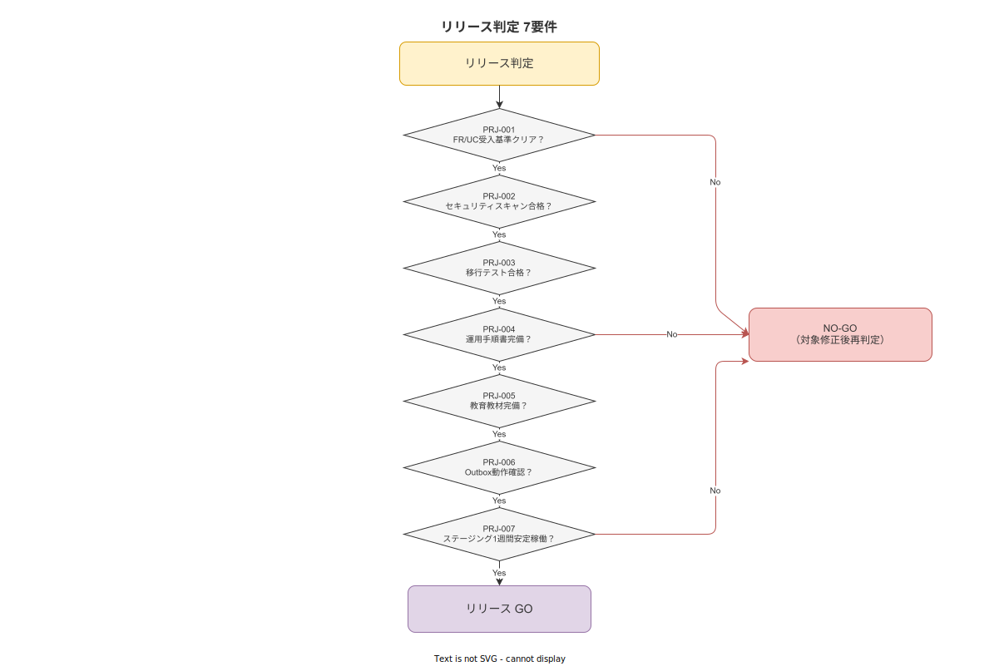

# 05 リリース判定要件

本章の責務は、ver1.0.0 リリースの判定条件（7 要件）・GO/NO-GO 判定フローを確定することである。本章で確定するリリース判定要件は計画 10 章 §5「ver1.0.0 のリリース判定基準」を受けて、要件定義レベルの詳細仕様として確定する。

---

## 1. リリース判定 7 要件

### 1-1. リリース判定の位置づけ

リリース判定は以下の目的で実施する。

- ver1.0.0 が「プロダクション品質」であることを客観的に確認する（CLAUDE.md ポリシー「妥協禁止・完璧かつ至高を目指す」への対応）
- 受入テスト（TST-001〜007）と独立した観点からリリース可能性を確認する
- 1 件でも不合格の場合はリリースを認めない

**図 1: リリース判定デシジョンツリー**



> 原本: [`img/fig_release_decision_tree.drawio`](img/fig_release_decision_tree.drawio)

### 1-2. PRJ-065: リリース判定 7 要件の定義

| 要件 ID | PRJ-065 |
|---|---|
| 優先度 | Must |
| 上流リンク | 計画 10 章 §5 リリース判定 7 要件 / TST-001〜007 |

以下の 7 条件をすべて満たすことが ver1.0.0 リリースの条件である。1 条件でも未達の場合はリリースを認めない。

| 判定番号 | 要件 ID | 条件 | 確認方法 |
|---|---|---|---|
| 1 | PRJ-065-01 | TST の ver1.0.0 受入基準 7 件（TST-001〜TST-007）全 Pass | 受入完了記録（TST-070 形式）で合格が記録されていること |
| 2 | PRJ-065-02 | セキュリティスキャン合格（`cargo audit` + OWASP ZAP またはOWASP同等ツール）| `cargo audit`: CVSS 7.0 以上のCVEゼロ / OWASP スキャン: High 評価ゼロのスキャンレポートが存在すること |
| 3 | PRJ-065-03 | 移行テスト合格（マスタ初期投入・整合性確認完了）| 移行テスト記録（TST-006 の受入テスト記録）で Pass が記録されていること |
| 4 | PRJ-065-04 | 運用手順書（バックアップ・障害対応・マスタ改訂）の完備 | 各手順書が `docs/運用/` 配下に存在し、実機確認済みであることが記録されていること |
| 5 | PRJ-065-05 | 教育教材（IT 担当・マスタ編集者・作業員）の完備 | 各教材が `docs/教育/` 配下に存在し、内容が実機で確認済みであることが記録されていること |
| 6 | PRJ-065-06 | 子機モード Outbox 動作確認合格（オフライン→復旧シナリオ）| 受入シナリオ E（TST-007 受入テスト）が Pass で、Outbox シナリオの全ステップ（E-01〜E-08）が記録されていること |
| 7 | PRJ-065-07 | 1 週間以上のステージング環境での安定稼働確認 | ステージング環境の稼働ログで連続 7 日間以上の無障害稼働が確認できること（軽微な手動設定変更を除く。自動回復できないクラッシュがゼロであること） |

### 1-3. PRJ-066: 各判定条件の詳細仕様

**PRJ-065-01（TST 受入基準全クリア）の確認仕様:**

受入完了記録（`UAT-YYYYMMDD.md`）が `docs/03_要件定義/テスト・受入要件/証跡/` に存在し、記録内に TST-001〜TST-007 全件が「Pass」として記録されていること。電子署名（または Git Signed-off-by）が付与されていること。

**PRJ-065-02（セキュリティスキャン合格）の確認仕様:**

- `cargo audit` のスキャンレポートが存在し、`Vulnerabilities found: 0`（CVSS 7.0 以上）であること
- OWASP ZAP（または同等ツール）のスキャンレポートが存在し、High リスクアラートゼロであること
- スキャン実施日がリリース日から 30 日以内であること（古いスキャン結果でのリリース判定を禁止する）

**PRJ-065-04（運用手順書完備）の確認仕様:**

| 手順書 | 必須内容 | 完備確認方法 |
|---|---|---|
| バックアップ手順書（`docs/運用/backup_restore.md`）| バックアップ実行手順・リストア手順・RTO 達成確認手順 | 実機でリストア演習を実施し、2 時間以内に復旧できることを確認 |
| 障害対応手順書（`docs/運用/incident_response.md`）| 障害レベル別対応手順・エスカレーション先（個人開発のため開発者自身）・障害記録の書き方 | 内容の論理的正確性を自己確認 |
| マスタ改訂手順書（`docs/教育/master_editor_guide.md`）| Draft 作成→Publish の手順・参照整合性確認の手順・旧バージョンの確認手順 | 手順書に従って実際に SOP 改訂操作を実施し、正常動作を確認 |

**PRJ-065-07（ステージング安定稼働）の確認仕様:**

- ステージング環境の稼働ログ（`/var/log/` または同等のログ）で連続 7 日間以上のサービス起動状態が確認できること
- 7 日間中にアプリケーションのクラッシュ（プロセス停止）がゼロであること
- 7 日間中に `cargo audit` または OWASP スキャンで新規 High 脆弱性が報告されていないこと
- 稼働ログの保存期間中に「DB 接続エラー・API タイムアウト・同期エラー」がゼロであること（一時的なネットワーク障害によるリトライ成功は許容する）

---

**本節で確定した方針**
- リリース判定 7 条件（PRJ-065-01〜07）をすべて満たすことを ver1.0.0 リリースの唯一の条件として確定する。
- セキュリティスキャンの実施日をリリース日から 30 日以内とし、古いスキャン結果でのリリースを禁止することを確定する。
- ステージング安定稼働を「7 日間以上・クラッシュゼロ・新規 High 脆弱性ゼロ」として確定する。

---

## 2. GO/NO-GO 判定フロー

### 2-1. PRJ-070: GO/NO-GO 判定の手順

| 要件 ID | PRJ-070 |
|---|---|
| 優先度 | Must |
| 上流リンク | PRJ-065 / TST-010〜TST-012 |

GO/NO-GO 判定は以下の手順で実施する。

1. **判定前の準備**: 受入完了記録・各スキャンレポート・稼働ログ・手順書・教材を `docs/03_要件定義/テスト・受入要件/証跡/` および各格納先に揃える
2. **チェックリストの確認**: リリース判定チェックリスト（`docs/01_管理/release_checklist.md`）の 7 項目を順番に確認し、各項目の Pass/Fail を記録する
3. **GO の宣言**: 7 項目全 Pass の場合、リリース判定チェックリストに「GO: YYYY-MM-DD HH:MM」と記録し、電子署名（または Git Signed-off-by）を付与する
4. **NO-GO の宣言**: 1 項目でも Fail の場合、「NO-GO: YYYY-MM-DD 不合格項目: {PRJ-065-XX} 理由: {詳細}」を記録する

### 2-2. PRJ-071: 判定権限

| 要件 ID | PRJ-071 |
|---|---|
| 優先度 | Must |
| 上流リンク | PRJ-070 / TST-060 |

GO/NO-GO 判定の権限は開発者本人（セルフ受入責任者）が持つ。外部専門家による助言があった場合でも、GO/NO-GO の最終判定権限は開発者本人のみが持つ。

### 2-3. PRJ-072: NO-GO 時の対応と再判定

| 要件 ID | PRJ-072 |
|---|---|
| 優先度 | Must |
| 上流リンク | PRJ-070 / TST-015（不合格時対応手順）|

NO-GO 宣言後の対応は以下のとおりとする。

| NO-GO 条件 | 対応方針 | 再判定条件 |
|---|---|---|
| PRJ-065-01（TST 受入基準）不合格 | TST-015 の重大度別対応手順に従い修正・再テストを実施する | TST-001〜007 全 Pass の受入完了記録が作成された後に再判定する |
| PRJ-065-02（セキュリティスキャン）不合格 | High 以上の脆弱性を修正し、30 日以内のスキャンで再確認する | 修正後のスキャンレポートで High ゼロが確認された後に再判定する |
| PRJ-065-04（運用手順書）不合格 | 手順書の不備を解消し、実機確認を再実施する | 実機確認済みの証跡が揃った後に再判定する |
| PRJ-065-07（ステージング稼働）不合格 | 障害原因を修正し、7 日間の安定稼働を再計測する | 新たに 7 日間の無障害稼働ログが揃った後に再判定する |

### 2-4. PRJ-073: リリース判定チェックリスト形式

| 要件 ID | PRJ-073 |
|---|---|
| 優先度 | Must |
| 上流リンク | PRJ-070 |

リリース判定チェックリストは `docs/01_管理/release_checklist.md` に以下の形式で記録する。

```markdown
# リリース判定チェックリスト ver1.0.0

**判定日時**: YYYY-MM-DD HH:MM  
**判定者**: （開発者名）  
**対象バージョン**: 1.0.0-rc.X

| 判定番号 | 要件 ID | 確認内容 | 証跡場所 | Pass/Fail |
|---|---|---|---|---|
| 1 | PRJ-065-01 | TST 受入基準 7 件全 Pass | docs/.../UAT-YYYYMMDD.md | Pass / Fail |
| 2 | PRJ-065-02 | セキュリティスキャン合格 | docs/.../scan-YYYYMMDD.pdf | Pass / Fail |
| ... | ... | ... | ... | ... |

**最終判定**: GO / NO-GO  
**電子署名**: （Git commit hash または電子サイン）
```

---

**本節で確定した方針**
- GO/NO-GO 判定を 7 項目チェックリストの全 Pass のみを GO の条件として確定する。
- 判定権限は開発者本人のみが持ち、外部専門家の助言は判定に影響しないことを確定する。
- NO-GO 後の再判定条件を各不合格項目ごとに具体的に確定する。

---

## 参照業界分析

### 必須

- [`90_業界分析/06_品質管理とトレーサビリティ.md`](../../../../90_業界分析/06_品質管理とトレーサビリティ.md) — リリース判定における ALCOA+ 品質確認（PRJ-065-01）の根拠

### 関連

- [`90_業界分析/38_災害・BCP・緊急時手順と作業継続.md`](../../../../90_業界分析/38_災害・BCP・緊急時手順と作業継続.md) — ステージング安定稼働要件（PRJ-065-07）の BCP 観点からの根拠
- [`90_業界分析/30_国内製造業IT調達慣行とSI構造.md`](../../../../90_業界分析/30_国内製造業IT調達慣行とSI構造.md) — 個人開発でのセルフ GO/NO-GO 判定体制の背景
