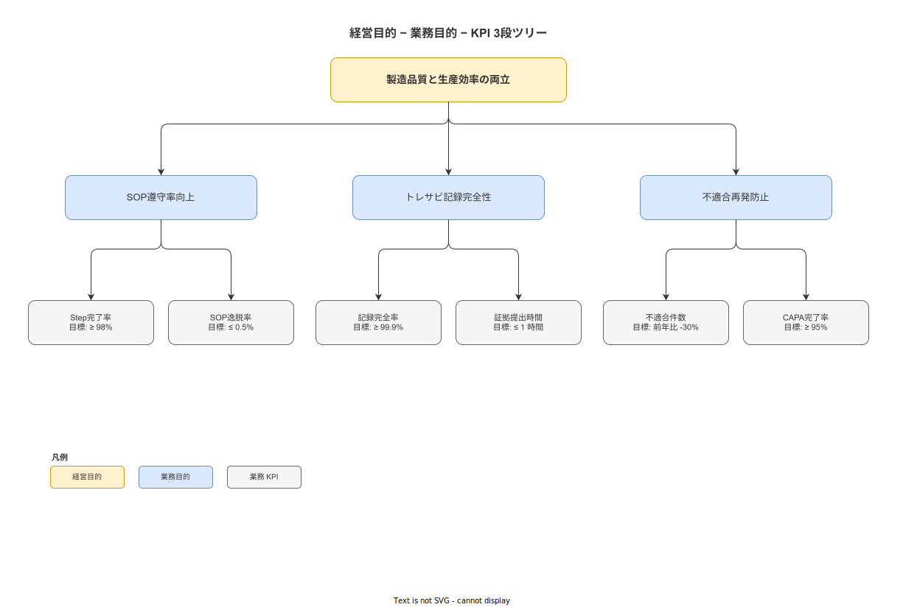

# 01 ビジネス要件と上位目的

本章の責務は、本システムが解決する経営課題の構造を確定し、計測可能なビジネス目標（KPI）を設定し、経営目的からシステム目的への目的−手段ツリーを構築することである。本章に記述する KPI は業務要件の達成を判断するための基準として機能し、機能要件・テスト要件の引き渡し先での検証基準となる。

---

## 1. 経営課題の構造

### 1-1. 五つの構造的課題

製造業中小企業・単一工場を前提とした場合、作業ナビゲーション＆トレサビ記録の欠如がもたらす構造的課題を以下の五つに整理する。これら五課題は相互に連鎖しており、一つを解決するだけでは全体改善に至らない。

**課題 01: 暗黙知伝承困難（BR-BUS-001）**

熟練作業員が保有する「コツ・判断基準・手戻り対処法」は、紙 SOP に記述されない暗黙知として個人に帰属する。熟練者の退職・異動・長期離脱が発生した場合、その知識は工程から喪失する。現状の技能伝承は OJT の口頭指導が主体であり、指導内容が標準化されず属人化する。

暗黙知の喪失は品質の均質性低下・工程立ち上がり期間の長期化・再教育コストの増大として顕在化する。製造業の技術伝承危機は [`90_業界分析/05_暗黙知と技能伝承.md`](../../../90_業界分析/05_暗黙知と技能伝承.md) が示す通り、中小製造業の主要な経営リスクである。

**課題 02: トレサビ記録の不整合（BR-BUS-002）**

紙記録・手書き台帳・Excel 管理が混在する現場では、誰が・いつ・何を・どう実施したかを事後的に照会する際に記録の断絶・改竄・判読不可能が発生する。ALCOA+（Attributable / Legible / Contemporaneous / Original / Accurate / Complete / Consistent / Enduring / Available）の九原則を充足できない記録は、内部監査・顧客監査で証拠能力を失う。

特にロット不適合が発生した場合の逆トレサビ（製品→工程→材料・作業員・設備）が機能しないため、影響範囲の特定に多大な工数を要し、顧客への対応遅延・信頼失損が生じる。

**課題 03: SOP 逸脱の検知困難（BR-BUS-003）**

紙 SOP を参照しながら作業する運用では、作業員がいつ・どの手順を参照したかが記録に残らない。クリティカルステップが正しく実施されたかどうかを完了後に証拠で確認する手段がない。このため SOP 逸脱が発生しても発見が遅れ、不良品がラインを通過してしまう。

SOP 逸脱の検知困難は不適合の早期発見を阻害し、CAPA（是正処置・予防処置）サイクルが機能不全に陥る主要因となる。

**課題 04: 不適合の再発（BR-BUS-004）**

不適合が発生した場合、根本原因分析が十分に実施されないまま対処療法的な処置が行われ、同種の不適合が繰り返し発生する。このパターンは CAPA ループが形骸化しているサインであり、原因としては（a）不適合記録の品質不足・（b）SOP 改訂への連動不全・（c）改訂 SOP の現場への浸透不足の三点が挙げられる。

**課題 05: 人材多様化への対応（BR-BUS-005）**

外国人技能実習生・特定技能労働者の増加・作業員の高齢化・入れ替わりの常態化により、日本語のみの紙 SOP では多様な人材が正確に手順を習得できない。JLPT N3 以下の作業員に漢字・専門用語が含まれる SOP を渡しても理解されない。また高齢作業員への配慮（大きな文字・シンプルな操作）が紙運用では実現できない。

### 1-2. 課題間の連鎖構造

五つの課題は以下の連鎖で相互に増幅する。

- 課題 01（暗黙知）が課題 03（SOP 逸脱）を引き起こす: SOP に記述されていない判断を作業員が独自に実施し逸脱が発生する
- 課題 03（SOP 逸脱）が課題 02（トレサビ不整合）を悪化させる: 逸脱が記録に残らないため実態と記録が乖離する
- 課題 02（トレサビ不整合）が課題 04（不適合再発）を固定化する: 原因追跡ができないため同種不適合への根本対策が打てない
- 課題 05（人材多様化）が課題 01・課題 03 を拡大する: 手順理解不足が暗黙知の伝承障壁を高め、SOP 逸脱頻度を増加させる

**本節で確定した方針**
経営課題を暗黙知伝承困難・トレサビ不整合・SOP 逸脱検知困難・不適合再発・人材多様化対応の五つに確定する。
五課題は独立した問題ではなく相互連鎖する構造として認識し、本システムは五課題すべてに対応する設計とする。
各課題には BR-BUS-001〜005 の要件 ID を付与し、機能要件への追跡可能性を担保する。

---

## 2. 上位ビジネス目標

### 2-1. ビジネス目標の確定

本システムの導入によって達成すべきビジネス目標を以下の五項目で確定する。各目標は経営課題と 1 対多で対応し、定性的達成状態と計測 KPI の二段構えで表現する。

| 目標 ID | ビジネス目標 | 対応課題 | 定性的達成状態 |
|---|---|---|---|
| BG-01 | EPSS 指標の向上 | BR-BUS-001 / 003 | 作業員がシステムの案内なしに手順を迷わずに実行できる状態へ移行する |
| BG-02 | Step 完了率の向上 | BR-BUS-003 | 全作業ステップが電子記録として完了状態で残る率が向上する |
| BG-03 | 不適合件数削減率の達成 | BR-BUS-004 | CAPA ループの定着により再発性不適合の件数が減少傾向に入る |
| BG-04 | SOP 逸脱率の低減 | BR-BUS-003 | クリティカルステップの証拠なし通過がシステム上ゼロになる |
| BG-05 | 記録完全性率の向上 | BR-BUS-002 | ALCOA+ 準拠の証拠が標準記録として全ステップに自動生成される |

### 2-2. KPI の定義

各ビジネス目標に対する主 KPI と補助 KPI を以下のとおり確定する。目標数値は要件定義フェーズで導入先工場の実測データに基づいて設定する。

**BG-01 に対応する KPI**

- **主 KPI**: EPSS 指標（Electronic Performance Support System 利用率）= システムガイドを参照せずに完了したステップ数 / 全ステップ数（習熟度別で計測）
- **補助 KPI**: 初回完了率（ステップを差し戻しなしで一回で完了した割合）

**BG-02 に対応する KPI**

- **主 KPI**: Step 完了率 = 電子記録として「completed」イベントが存在するステップ数 / 全 SOP ステップ数（計測期間・工程・ライン単位）
- **補助 KPI**: 紙バイパス率（紙記録への切り替え発生頻度）

**BG-03 に対応する KPI**

- **主 KPI**: 不適合件数削減率 = （直近 N ヶ月の不適合件数 − 前 N ヶ月の不適合件数）/ 前 N ヶ月の不適合件数 × 100
- **補助 KPI**: CAPA 平均クローズ日数（起票から効果確認クローズまでの平均日数）

**BG-04 に対応する KPI**

- **主 KPI**: SOP 逸脱率 = step_skipped イベント（理由なし）件数 / 全クリティカルステップ実施件数
- **補助 KPI**: クリティカルステップ証拠付き完了率（evidence_required = true のステップで証拠が添付された割合）

**BG-05 に対応する KPI**

- **主 KPI**: 記録完全性率 = ALCOA+ 準拠の 8 属性（event_id・case_id・activity・timestamp_device・timestamp_server・worker_id・terminal_id・sop_version_id）がすべて存在するイベントレコード数 / 全イベントレコード数
- **補助 KPI**: タイムスタンプ逸脱件数（timestamp_device と timestamp_server の差が設定閾値を超えたイベント数）

**本節で確定した方針**
ビジネス目標を五項目（BG-01〜BG-05）として確定し、各目標に主 KPI・補助 KPI を紐付ける。
目標数値はパイロット運用開始前に §4-3 の手順で設定する。KPI 目標値が未設定のまま UAT 受入を実施することを禁止し、目標値設定完了を M1 リリース判定ゲートの必須条件として確定する。
KPI の計測は工程・ライン・シフト単位の集計値を原則とし、個人単位の KPI 計測を行わないことを確定する。

---

## 3. 目的−手段ツリー

### 3-1. 三段構造の定義

本システムの目的を経営目的 → 業務目的 → システム目的の三段で整理する。

**第一段: 経営目的**

製造品質の安定的向上と競争力維持を通じ、顧客からの信頼を獲得し継続的な受注基盤を確立する。具体的には以下の二点を経営目的として確定する。

- 製品不良の構造的削減による品質コスト低減
- 顧客監査・内部監査での記録証拠力確保による信頼基盤の維持

**第二段: 業務目的**

経営目的を達成するために、現場業務として以下の三つを業務目的として確定する。

- SOP に従った作業の確実な実施と証拠の標準的生成（業務目的 A）
- 不適合発生時の迅速な原因究明と再発防止サイクルの運営（業務目的 B）
- 作業員の多様性（言語・習熟度・年齢）への対応による現場の安定稼働（業務目的 C）

**第三段: システム目的**

業務目的を実現するために、本システムが担うシステム目的を以下の三つで確定する。

- DO-LIST 型ロックステップ進行による Navigation 機能の提供（システム目的 α）
- Append-only Event Sourcing による ALCOA+ 準拠トレサビ記録の自動生成（システム目的 β）
- 多言語・習熟度別・ダークモードの UI 適応による多様な作業員への対応（システム目的 γ）

### 3-2. 目的間の対応関係

| 経営目的 | 業務目的 | システム目的 |
|---|---|---|
| 製品不良の構造的削減 | 業務目的 A（SOP 実施・証拠生成） | システム目的 α（Navigation） |
| 製品不良の構造的削減 | 業務目的 B（不適合再発防止） | システム目的 β（トレサビ記録） |
| 顧客監査への対応 | 業務目的 A（SOP 実施・証拠生成） | システム目的 β（トレサビ記録） |
| 現場の安定稼働 | 業務目的 C（多様な作業員への対応） | システム目的 γ（UI 適応） |

**図 1: 経営目的・業務目的・システム目的 三段ゴールツリー**

> 原本: [`img/fig_business_goal_tree.drawio`](img/fig_business_goal_tree.drawio)

**本節で確定した方針**
経営目的→業務目的→システム目的の三段ツリーを本節で確定し、目的間の対応関係を明示する。
システム目的 α・β・γ は機能要件サブの設計根拠として引き渡す。
三段の中で業務目的が業務要件サブの記述対象であり、経営目的とシステム目的はそれぞれ上流・下流文書の領域である。

---

## 4. 業務 KPI の計測方法

### 4-1. 計測体制と責任者

各 KPI の計測責任者・計測頻度・報告先を以下のとおり確定する。

| KPI | 計測責任者 | 計測頻度 | 報告先 | 計測手段 |
|---|---|---|---|---|
| EPSS 指標 | 品質担当 | 月次 | 経営層・現場監督 | 管理 Web の品質ダッシュボード（工程・作業種別集計） |
| Step 完了率 | 品質担当 | 週次 | 現場監督 | 管理 Web の品質ダッシュボード（ライン集計） |
| 不適合件数削減率 | 品質担当 | 月次 | 経営層 | 不適合レコードの月次集計 |
| SOP 逸脱率 | 品質担当 | 週次 | 現場監督 | step_skipped イベントの集計（クリティカルステップ限定） |
| 記録完全性率 | IT 担当 | 日次 | 品質担当 | イベントストアの必須属性チェックバッチ |
| CAPA 平均クローズ日数 | 品質担当 | 月次 | 経営層・品質担当 | CAPA レコードの起票日−クローズ日の差分集計 |

### 4-2. 計測単位の原則

計測は以下の単位を原則とし、個人を特定する単位での KPI 公開を業務運用規約として禁止する。

- 工程単位（例: 溶接工程・検査工程）
- ライン単位（例: 第 1 ライン・第 2 ライン）
- シフト単位（例: 日勤シフト・夜勤シフト）
- 作業種別単位（例: 本溶接・外観検査）

個人識別が必要な場合は、CAPA の原因分析（品質担当のみがアクセス）および教育設計（本人同意を前提）の二用途に限定する。

### 4-3. 目標値設定の手順

KPI 目標値の未設定は UAT 受入の実施を阻止するブロッカー条件とする（`プロジェクト要件/05_リリース判定要件.md` 参照）。

要件定義フェーズ完了後、パイロット運用開始前に以下の手順で目標値を設定する。

1. 現状の紙運用でのベースライン値を 1〜3 ヶ月計測する（紙台帳・口頭ヒアリング等から推計）
2. ベースライン値に対して「導入 6 ヶ月後に達成したい水準」を経営層・品質担当・現場監督で合意する
3. 合意した目標値を本ファイルの付属データとして記録し、本節を更新する
4. KPI の達成状況は月次の工程改善会議で確認し、目標値の見直しが必要な場合は品質担当が起案する

**本節で確定した方針**
KPI の計測責任者・頻度・報告先・手段を本節の表で確定する。
計測単位は工程・ライン・シフト・作業種別の集計値を原則とし、個人単位 KPI 公開を禁止する。
目標値は要件定義フェーズ完了後のパイロット運用前に実測ベースで設定し、本節を更新する手順を確定する。

---

## 5. 上位ビジネスルール（BR-BUS 抜粋）

本節は、経営目標・KPI と直接連動するビジネス要件レベルの上位ルールを確定する。詳細なバリデーション規則・権限ゲートは `機能要件/10_業務ルールとバリデーション定義.md` に委ねる。

### BR-BUS-030 校正機器・校正証明書の記録（計量法対応）

製造工程で使用する計測器は計量法（平成 4 年法律第 51 号）が定める定期検査・校正義務の対象となる。システムは計測器マスタに次回校正期限（calibration_due_date）を保持し、期限超過の計測器を用いた測定値入力をハードブロックまたは警告（業種設定）で制御する。校正証明書の参照 ID（calibration_ref）は step_completed イベントの payload に記録し、ALCOA+ の Accurate 原則を充足する。

### BR-BUS-031 工具・治具・計測器のスキャン照合（ポカヨケ）

製造工程において誤った工具・治具・計測器を使用することは品質不具合の主要因の一つである。作業者は SOP で指定された工具・治具のバーコード/QR コードをスキャンすることで、当該ステップで使用すべき器具であることをシステムが照合し確認する。不一致の場合はステップの完了を受け付けない。計測器の場合は加えて校正期限を AND 評価する（BR-BUS-007 と同一述語）。この機構により Shingo のポカヨケ（Poka-yoke）原則をシステムとして強制し、ヒューマンエラーによる誤工具使用を設計上排除する。

**本節で確定した方針**
BR-BUS-030（校正機器記録）および BR-BUS-031（工具/治具スキャン照合）を上位ビジネスルールとして確定する。
BR-BUS-031（工具/治具スキャン照合）を追加し、ポカヨケ機能をビジネス要件レベルで確定した。

---

## 6. 入荷検査（IQC）ビジネス要件（BR-BUS-032〜039）

本節は入荷検査（IQC）機能に関する上位ビジネス要件を確定する（BF-07 の業務的根拠）。

### BR-BUS-032 材料・部品の入荷前品質確認義務

入荷する材料・部品・治工具・包装資材は製造工程への投入前に品質規格への適合を確認することを義務とする。入荷検査未実施のロットは SOP 実行時の材料スキャン照合で API ハードゲートによりブロックする（ERR-BIZ-017）。これにより「良い材料を入れることが品質の出発点」という中小製造業の品質原則を技術的に担保する。

### BR-BUS-033 AQL（JIS Z 9015-1）ベースのサンプリング計画

入荷検査には全数検査ではなく JIS Z 9015-1（ISO 2859-1 相当）に基づく計数抜取検査を採用する。ロットサイズ・AQL 値・検査水準からサンプルサイズ n・合格判定数 Ac・不合格判定数 Re を決定する。サンプリング計画は材料 × 仕入先の組み合わせ単位でマスタ管理し、AQL 判定表を JSONB スナップショットとして時点固定する（マスタ改訂が過去の検査記録に遡及しない）。

### BR-BUS-034 検査の厳しさ自動切替（なみ/きつい/ゆるい）

JIS Z 9015-1 §10 の切替規則に基づき、連続合格実績に応じてゆるい（Reduced）に、連続不合格でキつい（Tightened）に自動遷移する。きつい状態で 5 ロット連続合格できない場合は検査停止として品質担当に通知し、仕入先との協議を促す。切替状態は材料 × 仕入先の組み合わせ単位で独立管理する。

### BR-BUS-035 合否 4 区分判定と後工程ロット解放

AQL 判定結果に基づき、合格（ACCEPT）・特採（CONCESSION）・選別（SCREENING）・返品（REJECT）の 4 区分で合否を決定する。後工程での材料ロット使用は `lots.qc_status` に基づくバリデーションで制御し、PASSED 以外のロットはハードゲートでブロックする。特採ロットはブロックせずに使用を許可するが、ハンディ APP での使用時に黄色警告バナーを強制表示し、作業員の認識確認（タップ操作）を必須とする。

### BR-BUS-036 特採の記録要件（有効範囲・期限・電子サイン）

特採承認は品質担当の電子サイン付きで記録する。有効範囲（対象ロット番号・数量・使用可能工程）と有効期限（デフォルト 90 日）を必須記録とする。特採理由は CAPA 分析の材料として活用する。ISO 9001:2015 §8.7.3 の「特別採取」記録要件に準拠する。

### BR-BUS-037 仕入先マスタ管理と仕入先別品質実績集計

仕入先は独立したマスタとして管理し、IQC 実績と紐付けることで仕入先別の合格率・特採率・返品率を月次集計する。仕入先別品質実績は品質担当・経営層・IT 担当のみが参照可能とする。個人（IQC 検査員）単位の集計・ランキングは BR-BUS-029（個人別生産性ランキング禁止）に従い禁止する。

### BR-BUS-038 材料マスタの独立管理

材料（RAW_MATERIAL / COMPONENT / TOOL / PACKAGING の四種）は独立したマスタとして管理する。既存の `lots` テーブルに `material_id` を追加し、ロットと材料マスタを紐付けることで材料起因のトレサビ照会を可能とする。既存の EN-020（Material 予約）は EN-028 で物理テーブル化（TBL-036）として実装する。

### BR-BUS-039 IQC 記録の 7 年保持と Append-only 管理

入荷検査記録（検査結果・測定値・特採承認・AQL 判定根拠）は ALCOA+ Enduring 原則に従い 7 年以上保持する。`incoming_inspections` の測定値詳細（TBL-040）および特採承認記録（TBL-041）は Append-only とし、物理削除 API を提供しない。

**本節で確定した方針**
IQC 機能の上位ビジネス要件 BR-BUS-032〜039 の 8 件を確定する。
AQL・JIS Z 9015-1・特採・後工程ハードゲートの概念を業務要件レベルで確定し、詳細実装は FR-IQ-001〜019（機能要件）に委ねる。

---

## 7. リワーク・修正作業ビジネス要件（BR-BUS-040〜045）

本節はリワーク・修正作業（BF-08）機能に関する上位ビジネス要件を確定する。

### BR-BUS-040 リワーク・ディスポジション制度（MRB 二者電子サイン）

不適合現品に対する処置方針（ディスポジション）の決定を品質担当と現場監督の二者電子サインで行うことを義務とする。REWORK（リワーク）・REGRADE（格下げ）・USE_AS_IS（現状使用）・SCRAP（廃却）・RETURN_TO_VENDOR（仕入先返却）の五種別から選択する。Just Culture 原則に従い、作業員はディスポジション判定に参加せず、上申権限のみを持つ。

### BR-BUS-041 リワーク作業の別 case_id 記録（ALCOA+ Original 原則）

リワーク作業は元の WorkExecution（parent_case_id）の Append-only 列を一切改変せず、新たな `case_id` を持つ別 WorkExecution として記録する。元記録の不可侵性は ALCOA+ Original 原則の技術的担保であり、両者を `reworks` テーブルが双方向 FK で結ぶ。リワーク作業中に元 WorkExecution が改変・上書きされることは設計上不可能とする。

### BR-BUS-042 リワーク後の独立再検査（Two-Person Integrity）

リワーク完了後の再検査は、リワークを実施した作業員とは異なる者が実施することを義務とする。Two-Person Integrity の原則として、システムが worker_id で同一人の再検査画面アクセスをブロックする（ERR-BIZ-023）。再検査は独立した WorkExecution（新 case_id）として記録し、リワーク実績と分離した証跡とする。

### BR-BUS-043 修正品 QR ラベル発行

リワーク完了品には新規 QR ラベル（reworked_lot_label）を発行し、GS1 AI 8003 (GIAI)形式で rework_id・親 lot_id・新 SOP 版を埋め込む。既存の QR スキャナで読取可能とし、後工程でのスキャン照合でリワーク品であることを特定できるトレサビを担保する。

### BR-BUS-044 リワーク・コスト記録（個人別禁止）

リワーク実施に要した追加時間・追加材料費・廃却損失を `rework_cost_records`（TBL-048）に集計する。コスト集計は工程・SOP 版・rework_type の単位のみとし、worker_id 単位の集計・ランキングは BR-BUS-029（個人別禁止）に従い設計上禁止する。

### BR-BUS-045 リワーク記録の 7 年保持

リワーク記録（ディスポジション判定・実施記録・再検査・廃却・返却）は ALCOA+ Enduring 原則に従い 7 年以上保持する。`reworks`・`dispositions`・`rework_verifications`・`scrap_records`・`return_to_vendor_records` の各テーブルは Append-only とし、物理削除 API を提供しない。廃却処理後も廃却記録は証拠として永続保持する。

**本節で確定した方針**
リワーク機能の上位ビジネス要件 BR-BUS-040〜045 の 6 件を確定する。
ALCOA+ Original 原則（別 case_id 記録）・Two-Person Integrity（再検査者分離）・GS1 修正品 QR の三つを業務要件レベルで確定し、詳細実装は FR（機能要件）に委ねる。

---

## 参照業界分析

### 必須

| 項目 | 参照元 |
|---|---|
| 品質管理とトレーサビリティ | [`90_業界分析/06_品質管理とトレーサビリティ.md`](../../../90_業界分析/06_品質管理とトレーサビリティ.md) |
| 不適合と手順改訂のフィードバックループ | [`90_業界分析/28_不適合と手順改訂のフィードバックループ.md`](../../../90_業界分析/28_不適合と手順改訂のフィードバックループ.md) |
| 暗黙知と技能伝承 | [`90_業界分析/05_暗黙知と技能伝承.md`](../../../90_業界分析/05_暗黙知と技能伝承.md) |

### 関連

| 項目 | 参照元 |
|---|---|
| 製造コストと価値工学 | [`90_業界分析/16_製造コストと価値工学.md`](../../../90_業界分析/16_製造コストと価値工学.md) |
| 多言語化・外国人労働者と読み書き能力差 | [`90_業界分析/34_多言語化・外国人労働者と読み書き能力差.md`](../../../90_業界分析/34_多言語化・外国人労働者と読み書き能力差.md) |
| 競合製品と作業ナビ・MES・eBR 市場 | [`90_業界分析/29_競合製品と作業ナビ・MES・eBR市場.md`](../../../90_業界分析/29_競合製品と作業ナビ・MES・eBR市場.md) |
| 安全文化と安全管理システム | [`90_業界分析/13_安全文化と安全管理システム.md`](../../../90_業界分析/13_安全文化と安全管理システム.md) |
| 品質管理とトレーサビリティ（IQC・AQL） | [`90_業界分析/06_品質管理とトレーサビリティ.md`](../../../90_業界分析/06_品質管理とトレーサビリティ.md) |
| サプライチェーンと作業依存性（仕入先品質） | [`90_業界分析/17_サプライチェーンと作業依存性.md`](../../../90_業界分析/17_サプライチェーンと作業依存性.md) |
| 計測・工程能力と統計的品質工学（JIS Z 9015-1） | [`90_業界分析/11_計測・工程能力と統計的品質工学.md`](../../../90_業界分析/11_計測・工程能力と統計的品質工学.md) |
