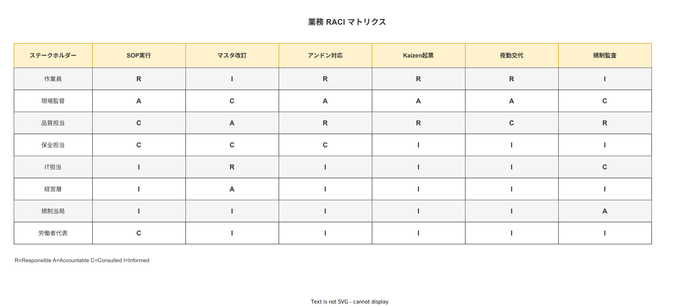

# 02 ステークホルダー定義書

本章の責務は、本システムに関係する 8 種のステークホルダーを業務要件の観点で再定義し、各者の責務・利害・期待値・ペインポイントを業務フロー設計・受入基準設定・RACI マトリクス構築の基盤として確定することである。システム化計画書 01 章のステークホルダー定義を業務要件レベルで詳述する。

---

## 1. ステークホルダー一覧

### 1-1. 8 種の確定

本システムに関係するステークホルダーを以下の 8 種に確定する。この定義はシステム化計画書 01 章の定義を継承し、業務要件の観点で詳述したものである。

| ID | ステークホルダー | 本システムとの主な接点 | 関与の性質 |
|---|---|---|---|
| SH-01 | 作業員 | タブレット APP（SOP 実行・証拠記録・起票） | 主要利用者（直接操作） |
| SH-02 | 現場監督 | タブレット APP・管理 Web（進捗確認・異常対応・引継ぎ） | 管理利用者（承認・可視化） |
| SH-03 | 品質担当 | 管理 Web（マスタ管理・不適合処理・トレサビ照会・監査） | 権限保有者（SOP 承認・CAPA 管理） |
| SH-04 | 保全担当 | タブレット APP・管理 Web（設備点検・保全記録・校正管理） | 専門利用者（設備軸のトレサビ） |
| SH-05 | IT 担当 | バックエンド・インフラ（導入・運用・障害対応・バックアップ） | 運用責任者（システム維持） |
| SH-06 | 経営層 | 管理 Web（レポート・投資判断・法的責任） | 意思決定者（ROI 確認・導入可否） |
| SH-07 | 規制当局想定 | 記録・証拠・監査証跡（内部監査・顧客監査・第三者認証） | 審査者（証拠品質の評価） |
| SH-08 | 労働者代表 | 導入合意プロセス（倫理審査・プライバシー保護確認） | 権利擁護者（作業員の利益代表） |

**本節で確定した方針**
ステークホルダーを SH-01〜SH-08 の 8 種として確定し、各者の接点と関与の性質を定義する。
本章の全節はこの 8 種を前提として記述する。追加・変更は上流文書の改訂を必須とする。

---

## 2. 各者の責務・利害・期待値・ペインポイント

### 2-1. SH-01: 作業員

**責務**
SOP に従って作業を実施し、各ステップの完了を電子署名付きで記録する。クリティカルステップでは写真・測定値・バーコードスキャンの証拠を添付する。異常を発見した場合はアンドン発報・不適合起票・ヒヤリハット起票を行う。Kaizen 提案を起票する権利を持つ。

**利害**
作業に集中できること。システムが作業の障害にならないこと。習熟度に関係なく次に何をすべきかが明確であること。夜勤・疲労状態でも安全に作業を継続できること。外国語母語話者は自国語で手順を確認できること。

**期待値**
- タブレットで次のステップが常に明示される
- 中断後に作業を再開する際に前の状態がわかる
- 記録操作が少ない手数でできる
- システムが自分の評価に使われない

**ペインポイント**
- 現状: 手順書が見つからない・古い版を使っている・手順書を読む時間がない
- 現状: 記録に時間がかかる（紙台帳への転記・二重管理）
- 懸念: システムが監視ツールになり自分の行動がすべて記録される恐怖
- 懸念: 操作を間違えると品質事故になるというプレッシャー

### 2-2. SH-02: 現場監督

**責務**
ラインの生産進捗・品質・安全を管理する。異常発生時に作業員を支援し、アンドン応答・原因確認・ライン再起動の判断を行う。シフト終了時に I-PASS 構造の引継ぎを行う。作業員のスキル認定登録・有効期限更新を担当する。

**利害**
ラインの状態をリアルタイムで把握できること。異常が発生してから対応するまでのリードタイムを短くすること。シフト引継ぎで漏れが発生しないこと。作業員のスキル状況を正確に把握できること。

**期待値**
- 管理 Web または監督者向き画面でラインの進捗・異常を一目で確認できる
- 異常発生時の通知を受け取り即座に対応できる
- デジタル引継ぎ票で前シフトの状況を正確に把握できる

**ペインポイント**
- 現状: 各ラインを目視巡回しないと進捗がわからない
- 現状: シフト引継ぎが口頭中心で情報が抜け落ちる
- 懸念: デジタル化で作業員の入力負担が増え、ラインペースが落ちる

### 2-3. SH-03: 品質担当

**責務**
SOP の作成・改訂・承認・廃止のライフサイクル管理を担う。不適合の受付・CAPA 起票・根本原因分析・効果確認・クローズを実施する。トレサビ照会（順方向・逆方向）で記録の完全性を確認する。内部監査・顧客監査において記録を証拠として提示する。

**利害**
ALCOA+ 準拠の証拠が自動的に生成されること。SOP の版管理と改訂履歴が完全に保持されること。不適合から CAPA へのエスカレーションと追跡が一元管理されること。監査時に必要な記録を迅速に照会できること。

**期待値**
- 管理 Web で SOP のドラフト→レビュー→承認→公開フローが完結する
- 不適合記録が ALCOA+ 準拠の証拠品質を持つ
- トレサビ照会が数クリックで完了する
- 内部監査の準備工数が削減される

**ペインポイント**
- 現状: SOP 改訂が Word ファイルのメール往復で版管理が混乱する
- 現状: 不適合起票後の追跡管理が Excel では限界がある
- 懸念: 電子記録が後から改竄される可能性への不安

### 2-4. SH-04: 保全担当

**責務**
設備の定期点検・予防保全・事後保全を実施し、設備履歴を記録する。計測器の校正証明書登録・校正期限管理を担当する。保全作業の実施記録を生産作業記録と分離して管理する。

**利害**
設備ごとの点検履歴が一元管理されること。校正期限の見逃しがシステムで防止されること。保全作業記録が生産作業記録と混在しないこと。

**期待値**
- 設備マスタに点検周期と次回保全日を登録できる
- 校正期限超過の計測器使用時に警告が表示される
- 保全作業記録が生産作業記録と同一フレームで管理されるが明確に区別できる

**ペインポイント**
- 現状: 設備点検記録が紙台帳と Excel に分散している
- 現状: 校正期限切れの計測器を気づかずに使用するリスクがある

### 2-5. SH-05: IT 担当

**責務**
Windows Server 2022 上でのシステム導入・初期設定を実施する。日常のバックアップ確認・ログローテーション・ユーザーアカウント管理を担当する。障害発生時の診断・復旧・エスカレーションを担う。タブレット端末へのアプリ配布・更新を管理する。

**利害**
IT 担当 1 名で継続運用できること。障害時に自己完結的な診断と復旧手順が存在すること。技術的負債が最小限で長期保守に耐えること。Docker Compose ワンコマンドで環境セットアップが完了すること。

**期待値**
- Docker Compose + GUI ウィザードで初期構築が 1 日で完了する
- バックアップ・リストア手順が文書化されており手順書通りに実施できる
- 障害発生時のログが診断に使える形で保存されている

**ペインポイント**
- 懸念: Rust + React Native という技術スタックへの習熟コストが高い
- 懸念: 個人開発のシステムに対して社内標準外の保守体制を強いられる

### 2-6. SH-06: 経営層

**責務**
本システムの導入可否・投資判断・法的責任を担う。KPI 達成状況のレポートを確認し、継続・拡張・廃止の経営判断を行う。就業規則・労使協定への「データ利用ポリシー」の明示に責任を持つ。

**利害**
投資対効果の説明責任を果たせること。製造品質の向上・顧客監査対応力の向上が確認できること。法的リスク（個人情報・労働関係）が管理されること。

**期待値**
- KPI が月次レポートで可視化される
- 顧客監査に対して記録を証拠として提示できる状態を保てる
- 行動データが人事評価に転用されないことが制度的に保証される

**ペインポイント**
- 懸念: 個人開発への信頼性（属人化・開発者退場リスク）
- 懸念: 導入後に法的・規制上の問題が発覚した場合の責任帰属

### 2-7. SH-07: 規制当局想定

**定義**
実在する外部規制当局ではなく、ISO 9001 内部監査・第三者品質認証・顧客監査（サプライヤー監査）の審査者として定義する。

**責務**（審査者としての立場）
電子記録の完全性（ALCOA+ 準拠）を確認する。電子署名の技術的実装が証拠能力を持つかを審査する。記録保管期間が要求を充足しているかを確認する。Audit Trail が実質的に機能しているかを評価する。

**利害**
記録が Attributable（誰が）・Contemporaneous（いつ）・Original（改竄不可）の各原則を技術的に充足していること。記録の照会が監査時間内に完了すること。

**期待値**
- 逆方向トレサビクエリで製品→工程→作業員・材料ロットを追跡できる
- Audit Trail で記録の生成・変更・承認の全履歴が確認できる
- 記録が Read-Only で改竄不可能であることが技術的に説明できる

### 2-8. SH-08: 労働者代表

**責務**
作業員の集合的利益を代表し、本システム導入前の説明確認・試用フィードバック収集・継続的モニタリングへの参加を担う。就業規則・労使協定での「データ利用ポリシー」の合意プロセスへの参加権を持つ。

**利害**
行動データが人事評価・昇給・解雇の根拠に転用されないことの制度的保証。外国人労働者が言語障壁によりシステムを誤操作させられない保護。改善提案が組織に無視されない仕組みの存在。

**期待値**
- データ利用ポリシー同意書が多言語で提供される
- Kaizen Teian 起票への応答が必ず返ってくる
- 個人別の作業速度・ミス頻度が管理者に自動報告されない

**本節で確定した方針**
8 種各ステークホルダーの責務・利害・期待値・ペインポイントを本節で確定する。
設計判断はすべての懸念に応答できているかを本節の記述を参照して確認する。
ペインポイントは現状課題と懸念（将来リスク）に区別して記述し、設計時に区別して対処する。

---

## 3. 受入基準の設定方針

### 3-1. 受入基準の定義

受入基準（Acceptance Criteria）とは、各ステークホルダーが「本システムの業務要件が達成された」と判断するために必要な条件である。本節では各ステークホルダー別の受入条件を業務視点で確定する。

### 3-2. ステークホルダー別受入条件

| ステークホルダー | 受入条件（業務視点） |
|---|---|
| SH-01 作業員 | タブレットで次のステップを迷わずに実行でき、証拠記録の操作が追加負担として感じられないこと。ダークモードが夜勤帯に自動適用されること。外国語版 SOP が母語話者レビュー済みで表示されること |
| SH-02 現場監督 | ライン進捗・異常状態が管理画面でリアルタイムに確認でき、シフト引継ぎ票がデジタルで記録・確認できること |
| SH-03 品質担当 | SOP の Draft→承認→公開フローが管理 Web 内で完結し、CAPA ループの全フェーズが電子記録として追跡できること。内部監査で記録を証拠として提示できること |
| SH-04 保全担当 | 設備マスタ・校正記録の登録・照会が管理 Web で完結し、校正期限超過時に計測値入力がブロックされること |
| SH-05 IT 担当 | Docker Compose + GUI ウィザードで 1 名が 1 日以内に初期構築を完了でき、バックアップ・リストア手順が文書通りに実施できること |
| SH-06 経営層 | KPI が月次レポートで確認でき、顧客監査で記録を証拠として提示できることを品質担当が確認できること。個人評価への転用禁止がデータ利用ポリシー同意書で制度化されていること |
| SH-07 規制当局想定 | 逆方向トレサビクエリで製品から作業員・材料ロットまで追跡でき、Audit Trail で全記録操作の履歴が確認できること。ALCOA+ 9 原則への対応説明ができること |
| SH-08 労働者代表 | データ利用ポリシー同意書が多言語で提供され、Kaizen 起票への応答が「採用通知または非採用理由通知」として必ず返されること。個人別スコアリングが管理 Web から削除されていること |

### 3-3. 受入基準の確認手順

受入基準はパイロット運用（本番前評価）の完了後、以下の手順で確認する。

1. 品質担当がシナリオベースの確認テスト（10_業務シナリオ集.md 参照）を実施する
2. 各ステークホルダーの代表者が自身の受入条件を評価し「受入れた」または「受入れられない（理由付き）」を記録する
3. 「受入れられない」項目は業務要件の変更要求として品質担当が起案し、是正後に再評価する

**本節で確定した方針**
受入基準をステークホルダー別に確定し、「受入れた」の判断条件を業務視点で明示する。
受入確認はパイロット運用完了後にシナリオベーステストで実施することを確定する。
「受入れられない」項目は変更要求として起案し、是正後に再評価する手順を確定する。

---

## 4. RACI マトリクス

### 4-1. RACI の定義

本節では主要業務イベントに対して誰が何を担当するかを RACI 形式で確定する。

- **R（Responsible）**: 実作業の実施責任者
- **A（Accountable）**: 最終承認・説明責任者（一人のみ）
- **C（Consulted）**: 実施前に相談・確認を行う者
- **I（Informed）**: 実施後に通知・報告を受ける者

### 4-2. RACI マトリクス

| 業務イベント | SH-01 作業員 | SH-02 現場監督 | SH-03 品質担当 | SH-04 保全担当 | SH-05 IT 担当 | SH-06 経営層 | SH-07 規制当局想定 | SH-08 労働者代表 |
|---|---|---|---|---|---|---|---|---|
| SOP ステップの実行・記録 | R | C | I | - | - | - | I | - |
| クリティカルステップの証拠添付 | R | C | I | - | - | - | I | - |
| アンドン発報 | R | A | I | C | - | - | - | - |
| 不適合起票 | R | C | A | C | - | I | I | - |
| CAPA の根本原因分析 | C | C | R/A | C | - | I | I | - |
| SOP のドラフト作成 | - | C | R | - | - | - | - | - |
| SOP の承認・公開 | I | C | R/A | - | - | I | I | - |
| Kaizen Teian 起票 | R | I | I | I | - | - | - | I |
| Kaizen Teian の採否決定 | I | C | R/A | - | - | I | - | I |
| シフト引継ぎ | R（引渡） | A | I | - | - | - | - | - |
| 設備保全記録 | - | I | I | R/A | - | - | - | - |
| 校正記録登録 | - | - | C | R/A | - | - | I | - |
| ユーザー追加・スキル認定 | - | R/A | C | - | C | - | - | - |
| バックアップ確認・実施 | - | - | - | - | R/A | - | - | - |
| データ利用ポリシー説明 | I | - | A | - | - | R | - | C |
| 月次 KPI レポート確認 | - | I | R | - | I | A | - | - |

**図 1: ステークホルダー RACI マトリクス**

> 原本: [`img/fig_stakeholder_raci_business.drawio`](img/fig_stakeholder_raci_business.drawio)

**本節で確定した方針**
RACI マトリクスを 17 業務イベント × 8 ステークホルダーで確定する。
Accountable（A）は各業務イベントで必ず 1 者のみとし、A の重複を禁止する。
RACI マトリクスは RBAC（ロールベースアクセス制御）設計の入力として機能要件サブに引き渡す。

---

## 参照業界分析

### 必須

| 項目 | 参照元 |
|---|---|
| 作業者プライバシー・データ倫理と労務監視 | [`90_業界分析/24_作業者プライバシー・データ倫理と労務監視.md`](../../../90_業界分析/24_作業者プライバシー・データ倫理と労務監視.md) |
| 職務設計とモチベーション論 | [`90_業界分析/09_職務設計とモチベーション論.md`](../../../90_業界分析/09_職務設計とモチベーション論.md) |
| 安全文化と安全管理システム | [`90_業界分析/13_安全文化と安全管理システム.md`](../../../90_業界分析/13_安全文化と安全管理システム.md) |

### 関連

| 項目 | 参照元 |
|---|---|
| QCサークル・Kaizen Teian とボトムアップ品質活動 | [`90_業界分析/39_QCサークル・Kaizen Teianとボトムアップ品質活動.md`](../../../90_業界分析/39_QCサークル・Kaizen Teianとボトムアップ品質活動.md) |
| 多能工とスキル管理・作業者資格 | [`90_業界分析/26_多能工とスキル管理・作業者資格.md`](../../../90_業界分析/26_多能工とスキル管理・作業者資格.md) |
| 国内製造業 IT 調達慣行と SI 構造 | [`90_業界分析/30_国内製造業IT調達慣行とSI構造.md`](../../../90_業界分析/30_国内製造業IT調達慣行とSI構造.md) |
| 規制別トレーサビリティ要件詳論 | [`90_業界分析/22_規制別トレーサビリティ要件詳論.md`](../../../90_業界分析/22_規制別トレーサビリティ要件詳論.md) |
