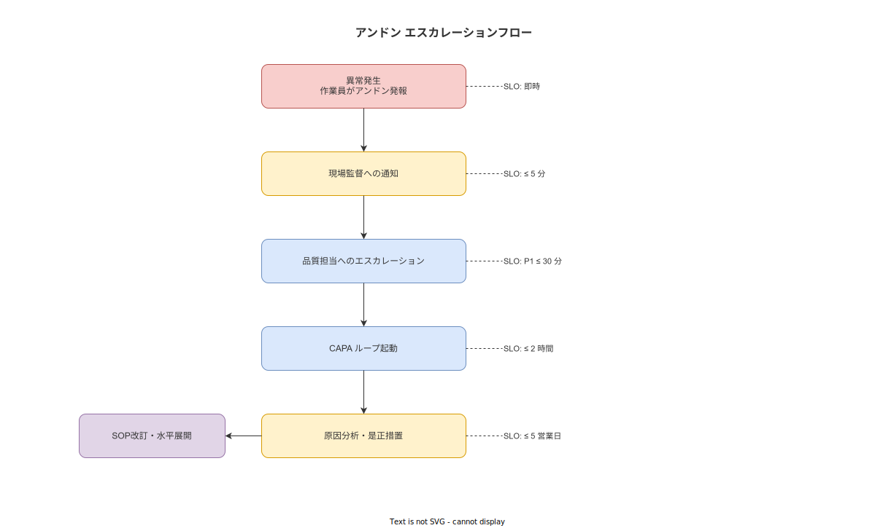

# 07 アンドン・不適合対応業務フロー

本章の責務は、品質・設備・安全の各異常に対するアンドン発報から停止・原因究明・CAPA 起動・再発防止・水平展開までの業務フロー（BF-03）を確定することである。Just Culture の組織原則と CAPA ループの業務的位置づけを合わせて定義する。

**図 1: アンドン・不適合対応エスカレーションフロー（BF-03）**

> 原本: [`img/fig_andon_escalation_flow.drawio`](img/fig_andon_escalation_flow.drawio)

---

## 1. アンドン発報トリガー

### 1-1. 発報トリガーの三区分

アンドン発報のトリガーを以下の三区分に確定する。各区分は発報後のエスカレーション先と応答速度が異なる。

**区分 A: 品質異常**

- SOP のクリティカルステップで測定値が USL/LSL の範囲を超えた
- 外観検査で規格外の状態（傷・変形・色違い等）を発見した
- バーコード・QR スキャンで部品・材料のロットが不一致だった
- 前工程からの仕掛品に異常（傷・汚染・欠品等）を発見した

発報時の必須情報: 発報種別（品質異常）・対象工程・対象ステップ・具体的な異常内容（テキストまたは写真）

**区分 B: 設備異常**

- 設備の動作音が異常・振動が増加・温度が異常値を示した
- 設備エラーコードが表示された
- 治具・工具の損傷・紛失を発見した
- 校正期限超過の計測器が使用されようとしている（システムが発報を促す）

発報時の必須情報: 発報種別（設備異常）・対象設備 ID・異常の状況（テキストまたは写真）

**区分 C: 安全上の問題**

- 危険な状況（転倒リスク・化学物質漏洩・高温部への接触リスク等）を発見した
- 作業員の体調不良・負傷が発生した
- 火災・煙・異臭等の緊急事態が発生した

発報時の必須情報: 発報種別（安全）・場所・状況の概要

### 1-2. 発報方法

作業員はタブレット APP の「アンドン発報」ボタンをワンタップで押下する。発報ボタンは SOP 実行中のすべての画面から常時アクセス可能な位置に配置する。

発報後、以下の情報が自動記録される。
- 発報時刻（timestamp_device・timestamp_server の二重記録）
- 作業員 ID（worker_id）
- 発報種別（andon_category: quality / equipment / safety）
- 発報時点のステップ番号・SOP 版 ID
- 任意の写真・テキストメモ

**本節で確定した方針**
アンドン発報トリガーを品質異常・設備異常・安全上の問題の三区分に確定する。
発報ボタンはすべての操作画面から常時アクセス可能な位置に設置することを業務要件として確定する。
発報時の自動記録項目（時刻・worker_id・種別・ステップ情報）を確定する。

---

## 2. 発報〜停止〜原因究明

### 2-1. エスカレーション経路と所要時間

発報後の対応経路を以下のとおり確定する。

**品質異常の場合**

| ステップ | 担当者 | 目標所要時間 | アクション |
|---|---|---|---|
| 発報受信 | 現場監督 | 3 分以内 | プッシュ通知を受信し、発報内容を確認する |
| 一次判断 | 現場監督 | 5 分以内 | 「継続」または「作業停止」を電子サインで記録する |
| 品質確認 | 品質担当 | 15 分以内 | 品質担当に通知が届き、影響範囲を確認する |
| 原因確認 | 現場監督・品質担当 | 30 分以内 | 暫定原因を確認し、不適合起票を行う |
| 再稼働判断 | 品質担当 | 確認完了後 | 再稼働条件を確認し、「再稼働許可」電子サインを行う |

**設備異常の場合**

| ステップ | 担当者 | 目標所要時間 | アクション |
|---|---|---|---|
| 発報受信 | 現場監督 | 3 分以内 | プッシュ通知を受信し、発報内容を確認する |
| 保全担当への連絡 | 現場監督 | 5 分以内 | 保全担当にプッシュ通知を転送する |
| 設備診断 | 保全担当 | 15 分以内 | 設備を確認し、応急処置または修理を実施する |
| 保全記録 | 保全担当 | 処置完了時 | 設備保全記録（equipment_id・対処内容・使用部品）を電子サインで登録する |
| 稼働再開確認 | 現場監督 | 保全完了後 | 「稼働再開許可」電子サインを行う |

**安全上の問題の場合**

| ステップ | 担当者 | 目標所要時間 | アクション |
|---|---|---|---|
| 発報受信 | 現場監督 | 即時（1 分以内） | ライン停止判断を行う |
| ライン停止 | 現場監督 | 1 分以内 | 「ライン停止」電子サインを記録する |
| 安全確保 | 全員 | 状況次第 | 避難・初期対応・経営層・外部機関への連絡 |
| 安全確認 | 現場監督・品質担当 | 安全確保後 | 再稼働条件の確認 |
| ヒヤリハット起票 | 現場監督・品質担当 | 当日中 | 事象の詳細・原因・対策をヒヤリハットまたは不適合として起票する |

### 2-2. 未応答の業務ルール

現場監督が発報受信から 5 分以内に応答しない場合、経営層に自動通知が送信される。これは Just Culture の観点から現場監督への「罰則」ではなく、「応答できない状況の検知」として設計する。

**本節で確定した方針**
発報後のエスカレーション経路を品質・設備・安全の三区分別に確定し、各担当者の目標所要時間を確定する。
すべてのエスカレーション操作（一次判断・再稼働許可・稼働再開許可）は電子サインで記録することを確定する。
未応答 5 分での経営層通知を業務ルールとして確定する。

---

## 3. CAPA ループ起動

### 3-1. CAPA 起動の判断基準

不適合が起票された後、品質担当は CAPA に昇格するかどうかを以下の基準で判断する。

| 判断基準 | CAPA 昇格の要否 |
|---|---|
| 単発・偶発的な不適合（同種の再発なし） | CAPA 昇格不要。不適合レコードをクローズする |
| 同種の不適合が直近 3 ヶ月で 2 件以上 | CAPA 昇格必要 |
| 顧客・安全に関わる不適合 | CAPA 昇格必要（件数に関わらず） |
| SOP または設備・材料に根本原因がある不適合 | CAPA 昇格必要 |

### 3-2. CAPA のフェーズ管理

CAPA レコードは以下の五フェーズで管理する。

**フェーズ 1: 起票**

品質担当が CAPA を起票する。起票情報には不適合レコード ID・関連するアンドン発報 ID・4M 分類（原因軸の初期仮説）・担当者・期限が含まれる。

**フェーズ 2: 根本原因分析**

品質担当が以下のいずれかの手法で根本原因を分析する。

- Why-Why 分析（5 回の「なぜ」による原因追跡）
- Ishikawa 4M 分析（Man・Machine・Material・Method の四軸分析）

分析結果をテキスト・図・写真で CAPA レコードに記録する。

**フェーズ 3: 是正措置の決定**

根本原因に対する是正措置を決定し、CAPA レコードに記録する。

| 是正措置の種類 | 担当者 | システム上の連動 |
|---|---|---|
| SOP 改訂 | 品質担当 | CAPA レコードに改訂版 SOP ID を紐付け、BF-02 を起動する |
| 設備保全・修繕 | 保全担当 | 設備保全記録を CAPA レコードに参照リンクで接続する |
| 教育・再訓練 | 現場監督 | 教育完了レコードを CAPA に紐付ける |
| 材料・部品の規格変更 | 品質担当・購買 | 材料変更記録を CAPA に紐付ける |

**フェーズ 4: 効果確認**

是正措置実施後、同種の不適合が再発していないことを確認する。

- 確認期間は措置の種類・リスクレベルに応じて品質担当が設定する
- 確認完了時に効果確認レコードを CAPA に追記する

**フェーズ 5: クローズ**

品質担当が効果確認の結果を確認し、CAPA クローズの電子サインを行う。クローズ後、起票者（作業員）に「CAPA クローズ通知」が送信される。

**本節で確定した方針**
CAPA 起動の判断基準（再発・顧客安全・SOP 起因）を確定し、基準を充足する場合は CAPA 昇格を必須とする。
CAPA を五フェーズ（起票・根本原因分析・是正措置・効果確認・クローズ）で管理することを確定する。
クローズ時の「起票者への通知」を業務手続として必須とし、起票が黙殺されない設計を確定する。

---

## 4. Just Culture 適用

### 4-1. Just Culture の業務的定義

本システムの業務運用において、James Reason の Just Culture モデルを組織原則として適用することを確定する。Just Culture の業務的定義は以下のとおりである。

| エラー種別 | Just Culture での業務処理 |
|---|---|
| スリップ（意図せず別の行為をした） | 非難しない。SOP のユーザビリティ改善・作業環境改善の問題として CAPA を起票する |
| ラプス（意図した行為の実行忘れ） | 非難しない。チェックリスト設計・アラート設計の問題として CAPA を起票する |
| ミステイク（誤った判断に基づく行為） | 非難しない。教育・訓練・情報提供の問題として CAPA を起票する |
| 故意の規則違反（安全ルールを知っていて意図的に無視） | 問責の対象とする。ただし規則が合理的でない場合は規則見直しを先行させる |
| 悪意ある行為 | 問責の対象とする |

### 4-2. システムによる Just Culture 支援の業務手続

不適合・ヒヤリハットの起票時、起票者は「原因の初期分類」を選択する。この選択肢において「人（Man）のミス」を単独で選択させる UI は設けない。Man・Machine・Material・Method・Environment の五軸を等価な選択肢として提示し、複数選択を許容する。

この業務設計は 4M 分析において「人のミスへの過収束」を防ぐためのものであり、Just Culture を UI 設計に落とし込んだ実装である。

品質担当が CAPA の根本原因を「個人の不注意」と分類する場合は、現場監督の確認電子サインを必要とする。個人帰責の判断は品質担当単独では行わない業務ルールを確定する。

**本節で確定した方針**
Just Culture の組織原則を業務運用規約として確定し、スリップ・ラプス・ミステイクを非難しない処理方針を定める。
不適合起票の原因分類で「人のミス単独選択」を禁止し、五軸等価提示を業務 UI 要件として確定する。
「個人帰責」判断には現場監督の確認電子サインを必須とする業務ルールを確定する。

---

## 5. 再発防止と水平展開

### 5-1. 再発防止の業務手続

CAPA の是正措置が完了した後、再発防止の業務手続を以下のとおり確定する。

1. SOP 改訂が是正措置の場合: 改訂版 SOP の公開（BF-02 の六段階フロー実施）
2. 設備修繕が是正措置の場合: 設備点検周期の見直し・保全 SOP の更新
3. 教育が是正措置の場合: 対象作業員の教育完了記録・スキルレベルの再評価
4. 効果確認期間中のモニタリング: Step 完了率・SOP 逸脱率を対象工程で週次計測する

### 5-2. 水平展開の業務手続

同種の不適合が他のラインや工程で発生するリスクがある場合、水平展開（横展開）の業務手続を確定する。

1. 品質担当が CAPA レコードに「水平展開対象」フラグを付与する
2. 水平展開対象の工程・ラインを一覧として記録する
3. 対象工程ごとに同種リスクのリスクレベルを評価する
4. リスクレベルが高い工程の担当者に水平展開通知が送信される
5. 各対象工程で予防措置（SOP 見直し・EWI 追加・追加確認ステップ等）を実施する
6. 実施完了後、各工程の現場監督が「水平展開完了」の電子サインを行う
7. 全対象工程の水平展開が完了した時点で、CAPA の水平展開ステータスが「完了」に更新される

**本節で確定した方針**
再発防止の業務手続として SOP 改訂・設備修繕・教育完了の三種の措置フローを確定する。
水平展開は「水平展開対象」フラグ付き CAPA レコードで管理し、全対象工程の完了確認を業務要件として確定する。
水平展開完了の電子サインを各工程の現場監督が行うことを確定する。

---

## 6. ディスポジション判定 → BF-08（リワーク）への連携点

### 6-1. 不適合からリワーク業務フローへの遷移

BF-03 で不適合（nonconformities）が起票された後、品質担当が CAPA 昇格の要否を判断するとともに、現品の処置方針（ディスポジション）を決定する。ディスポジション判定が REWORK / SORTING / SCRAP / RETURN_TO_VENDOR の場合、BF-08（リワーク・修正作業業務フロー）が並行して起動する。

**BF-03 と BF-08 の責務分離**:
- **BF-03（本フロー）**: 組織的再発防止（CAPA の 5 フェーズ）を管理する
- **BF-08（新規フロー）**: 現品の物理的修正・廃却・返却を管理する
- 両フローは `reworks.related_capa_id ← capas.id` で疎結合に連携する

### 6-2. ディスポジション判定の記録要件

本 BF-03 の §3-1「CAPA 昇格条件」に加え、ディスポジション判定は TBL-044 `dispositions` に Append-only で記録する。不適合レコード（TBL-013 `nonconformities`）に `disposition_id` を追記して両者を紐付ける。

### 6-3. リワーク件数の CAPA への集計連携

BF-08 で発生したリワーク件数・廃却率・追加時間は `capas.rework_summary`（JSONB 列）に集計データとして定期的に反映される（BAT-011 rework_cost_aggregator）。これにより CAPA の是正効果を定量評価する際に、リワーク件数の推移を参照できる。

**本節で確定した方針**
不適合起票後のディスポジション判定を BF-03 内で開始し、BF-08 へ引き継ぐ業務連携点を確定する。
BF-03（組織的再発防止）と BF-08（現品物理修正）の責務分離を業務要件として確定する。

---

## 参照業界分析

### 必須

| 項目 | 参照元 |
|---|---|
| 安全文化と安全管理システム | [`90_業界分析/13_安全文化と安全管理システム.md`](../../../90_業界分析/13_安全文化と安全管理システム.md) |
| 不適合と手順改訂のフィードバックループ | [`90_業界分析/28_不適合と手順改訂のフィードバックループ.md`](../../../90_業界分析/28_不適合と手順改訂のフィードバックループ.md) |

### 関連

| 項目 | 参照元 |
|---|---|
| 品質管理とトレーサビリティ | [`90_業界分析/06_品質管理とトレーサビリティ.md`](../../../90_業界分析/06_品質管理とトレーサビリティ.md) |
| 計測・工程能力と統計的品質工学 | [`90_業界分析/11_計測・工程能力と統計的品質工学.md`](../../../90_業界分析/11_計測・工程能力と統計的品質工学.md) |
| 信頼性工学と保全活動 | [`90_業界分析/10_信頼性工学と保全活動.md`](../../../90_業界分析/10_信頼性工学と保全活動.md) |
| 製造コストと価値工学（リワーク・廃却コスト） | [`90_業界分析/16_製造コストと価値工学.md`](../../../90_業界分析/16_製造コストと価値工学.md) |
