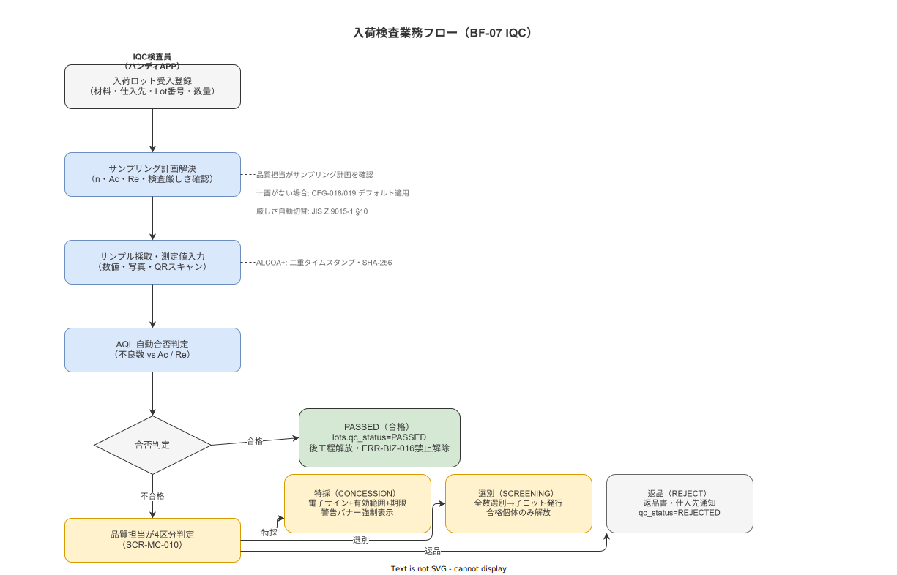

# 12 入荷検査（IQC）業務フロー

本章の責務は、材料・部品・治工具・包装資材の入荷から AQL（JIS Z 9015-1）ベースの抜取検査・合否判定・後工程ロット解放・仕入先品質実績集計までの業務フロー（BF-07）を確定することである。

**図 1: 入荷検査（IQC）業務フロー（BF-07）**

> 原本: [`img/fig_iqc_business_flow.drawio`](img/fig_iqc_business_flow.drawio)

---

## 1. 入荷検査の適用範囲と責任分担

### 1-1. 検査対象の四区分

入荷検査（IQC）の対象を以下の四区分に確定する。

| material_type | 対象品目の例 | 検査の主眼 |
|---|---|---|
| RAW_MATERIAL | 鋼材・樹脂ペレット・化学薬品・食品原料 | 寸法・成分・純度・外観 |
| COMPONENT | 電子部品・機械部品・ネジ・軸受 | 寸法・機能・外観 |
| TOOL | 治具・工具・型 | 精度・摩耗・寸法 |
| PACKAGING | 包装資材・ラベル・ダンボール | 寸法・印刷・強度 |

検査の主担当は品質担当（IQC 検査員ロール）とする。ただし TOOL の精度確認は保全担当が立会いとなる場合がある。

### 1-2. IQC が適用されない場合

以下は IQC 対象外とする。

- 緊急発注品（品質担当が特採承認した上で使用し、翌営業日中に事後 IQC を実施する）
- 試作・サンプル品（品質担当の個別判断による）
- 社内転送品（ただし外部仕入先からの受入は対象）

### 1-3. IQC の所要目標時間

| 入荷区分 | サンプリング完了目標 | 合否判定完了目標 |
|---|---|---|
| 通常受入 | 入荷翌日中 | 入荷後 2 営業日以内 |
| 急要品 | 入荷当日 4 時間以内 | 入荷当日中 |
| 緊急発注 | 特採承認後即時投入（事後 IQC） | 翌営業日中 |

**本節で確定した方針**
入荷検査の適用範囲を RAW_MATERIAL / COMPONENT / TOOL / PACKAGING の四区分に確定する。
主担当を品質担当（IQC 検査員ロール）として確定し、緊急発注品の事後 IQC 手続を規定する。

---

## 2. サンプリング計画の決定と検査指示

### 2-1. サンプリング計画の解決フロー

入荷材料のロット登録後、システムは以下の優先順位でサンプリング計画（TBL-039 `sampling_plans`）を解決する。

1. **最優先**: `material_id × supplier_id` の組み合わせに固有のサンプリング計画が存在する場合はそれを使用する
2. **次位**: `material_id` のみに紐づくサンプリング計画が存在する場合はそれを使用する
3. **デフォルト**: いずれも存在しない場合は CFG-018（デフォルト AQL 値）と CFG-019（デフォルト検査水準）を使用してシステムが自動生成する

サンプリング計画の解決結果（n・Ac・Re・サンプル文字）は `incoming_inspections` レコードに `sampling_plan_version_id`（時点固定）とともに記録する。後からサンプリング計画マスタが改訂されても過去の検査記録には影響しない。

### 2-2. 検査の厳しさ（Severity）の状態管理

JIS Z 9015-1 §10 に従い、以下の自動切替ルールを実装する。

| 現在の厳しさ | 切替条件 | 遷移先 |
|---|---|---|
| なみ（Normal） | 直近 5 ロット連続合格 | ゆるい（Reduced） |
| なみ（Normal） | 直近 5 ロット中 2 ロット不合格 | きつい（Tightened） |
| ゆるい（Reduced） | 1 ロット不合格 | なみ（Normal） |
| きつい（Tightened） | 連続 5 ロット合格 | なみ（Normal） |
| きつい（Tightened） | 5 ロット連続で合格できない | 検査停止（品質担当へ通知・仕入先協議要） |

現在の厳しさ状態は `incoming_inspections.severity_state` 列で管理し、材料 × 仕入先の組み合わせごとに独立して追跡する。

### 2-3. 検査指示の内容

システムは以下の検査指示をハンディ APP に表示する。

- サンプルサイズ n（例: 20 個）
- 合格判定数 Ac（例: 1 個まで不良可）
- 不合格判定数 Re（例: 2 個以上不良で不合格）
- 検査項目リスト（sampling_plans.inspection_items JSONB で定義）
- サンプル採取方法（ランダム採取 / 先頭・末尾・中間 / 指定個所）

**本節で確定した方針**
サンプリング計画の解決優先順位（固有→材料固有→デフォルト）を確定する。
JIS Z 9015-1 §10 の切替ルール（なみ/きつい/ゆるい）を状態機械で実装することを確定する。

---

## 3. 検査測定と AQL 自動判定

### 3-1. 測定値入力

IQC 検査員はハンディ APP の入荷検査画面（SCR-HA-017）から以下の方法で測定値を入力する。

- **数値入力**: 寸法・重量・硬度・pH 等の計量値（USL/LSL バリデーション付き）
- **写真撮影**: 外観・傷・汚染等の証拠写真（SHA-256 ハッシュ付き記録）
- **バーコード/QR スキャン**: ロット番号・品番の照合（GS1 体系対応）

各測定値は `incoming_inspection_measurements`（TBL-040）に Append-only で記録する。測定時の計測器 ID・校正証明書 ID も紐付ける（FR-EV-006 継承）。

### 3-2. AQL 自動合否判定

全サンプルの入力完了後、システムは自動的に合否を判定する。

| 不良数 | 判定結果 | 次のアクション |
|---|---|---|
| ≤ Ac | ACCEPT（合格） | 自動的に後工程解放（`lots.qc_status = PASSED`） |
| Re 未満 かつ Ac 超 | REJECT（不合格）※ | 品質担当へ判定エスカレーション |
| ≥ Re | REJECT（不合格） | 品質担当へ判定エスカレーション |

※ JIS Z 9015-1 でAcとReの間（乗り越え数）が生じる表は本システムでは「不合格」として扱い品質担当が4区分判定を行う。

判定結果は `incoming_inspections.qc_status` に記録し、ALCOA+ Contemporaneous 原則に従い判定時刻を二重タイムスタンプ（device + server）で保存する。

**本節で確定した方針**
測定値・写真・QR スキャンの三種の入力方法を確定する。
AQL 自動判定の合否しきい値（Ac/Re）と乗り越え数の扱い（不合格とみなす）を確定する。

---

## 4. 合否 4 区分判定と後処理

### 4-1. 四区分の定義と処理

不合格（REJECT）判定後、品質担当が管理 Web の特採承認コンソール（SCR-MC-010）で 4 区分判定を確定する。

| 判定区分 | qc_status | 後工程への影響 | 必須記録 |
|---|---|---|---|
| **合格（ACCEPT）** | PASSED | 使用可能（ゲートなし） | AQL 判定結果・検査者 ID・時刻 |
| **特採（CONCESSION）** | CONDITIONAL_PASS | 使用可能だが黄色警告バナー強制表示 | 特採理由・有効範囲・有効期限・品質担当電子サイン（TBL-041） |
| **選別（SCREENING）** | SCREENING_REQUIRED | 全数選別完了後に子ロット（split_lot）発行のみ使用可 | 選別実施者・選別数・合格数・廃却数 |
| **返品（REJECT）** | REJECTED | 使用不可（ゲートでブロック） | 返品書 PDF・仕入先通知記録（TBL-050 拡張） |

### 4-2. 特採承認の要件

特採承認はリスクを承知の上での例外的使用許可であるため、以下を必須とする。

- 品質担当の電子サイン（PIN 認証 + ALCOA+ Attributable 記録）
- 有効範囲の明示（対象ロット番号・数量・使用可能工程を JSONB で記録）
- 有効期限（CFG-023: デフォルト 90 日、延長不可・再申請要）
- 特採理由（フリーテキスト、後の CAPA 分析材料として機能）

特採ロットが後工程で使用された際は、ハンディ APP に黄色警告バナーを表示し、作業員の認識確認（タップ操作）を必須とする（dismissable 不可）。

### 4-3. 選別処理の手順

選別（SCREENING）判定時は以下の手順で子ロット分割（split_lot）を実施する。

1. IQC 検査員が全個体を個別検査し、合格・不合格を振り分ける
2. 合格個体数を記録し、新規 `lot_id` を持つ子ロット（TBL-024 `lots.parent_lot_id` 参照）を発行する
3. 子ロットの `qc_status = PASSED` として後工程解放する
4. 不合格個体は廃却または仕入先返却として個別に処理する

**本節で確定した方針**
合否 4 区分（ACCEPT/CONCESSION/SCREENING/REJECT）とそれぞれの後工程影響を確定する。
特採の必須記録項目（理由・有効範囲・有効期限・電子サイン）を確定する。
選別の子ロット分割手順を確定する。

---

## 5. 後工程ロット使用バリデーション（ハードゲート）

### 5-1. SOP 実行時の材料ロット QR スキャン連携

BF-01（SOP 実行業務フロー）において、作業員が材料ロットの QR コードをスキャンする場合（`qr_scan` タイプの Step、target: 'material'）、システムは以下のバリデーションを実施する。

| lots.qc_status | バリデーション結果 | 作業員への表示 |
|---|---|---|
| PASSED | 通過（ハードゲートなし） | 通常の照合成功表示 |
| CONDITIONAL_PASS | 通過（警告付き） | 黄色警告バナー強制表示・認識確認必須 |
| PENDING / INSPECTING | ブロック（ERR-BIZ-016） | 「検査未完了のため使用不可」エラー表示 |
| SCREENING_REQUIRED | ブロック（ERR-BIZ-016） | 「選別未完了のため使用不可」エラー表示 |
| REJECTED | ブロック（ERR-BIZ-016） | 「不合格ロットのため使用不可」エラー表示 |
| NULL（IQC 未実施） | ブロック（ERR-BIZ-017） | 「入荷検査が未実施のため使用不可」エラー表示 |

ERR-BIZ-016 および ERR-BIZ-017 のブロック時は `step_completed` イベントを受け付けない。これは API レベルのハードゲートであり、クライアント側のバイパスは設計上不可能とする。

### 5-2. 既存ロット（IQC 導入前）の扱い

システム導入前に入荷済みで IQC 未実施のロットについては、マスタ移行ウィザードで「既存ロット特採承認」として一括処理し、`lots.qc_status = CONDITIONAL_PASS` に設定する。

**本節で確定した方針**
SOP 実行時の材料ロット QR スキャンに IQC バリデーションを組み込み、未合格ロットを API レベルでブロックすることを確定する。
CONDITIONAL_PASS ロット使用時の黄色警告バナー強制表示（dismissable 不可）を業務要件として確定する。

---

## 6. 仕入先別品質実績集計

### 6-1. 集計の対象と方法

仕入先別品質実績は、以下の単位で月次集計する（BAT-012 supplier_quality_aggregator が日次でマテリアライズドビュー VW-010 を更新）。

| 集計軸 | 内容 |
|---|---|
| 仕入先 × 材料 × 月 | 受入ロット数・合格数・特採数・選別数・返品数・不合格率 |
| 仕入先 × 材料 | 検査の厳しさ現状（なみ/きつい/ゆるい）・累計不合格率トレンド |

個人（IQC 検査員 worker_id）単位での集計・ランキングは、BR-BUS-029（個人別生産性ランキング禁止）および BR-BUS-028（行動データ用途三限定）に従い禁止する。

### 6-2. 仕入先品質実績ダッシュボードの権限

仕入先品質実績ダッシュボード（SCR-MC-012）へのアクセスは品質担当・経営層・IT 担当の三ロールに限定する。RBAC 設計（`04_概要設計/07_セキュリティ方式設計/02_RBAC設計.md`）で詳細を規定する。

**本節で確定した方針**
仕入先別品質実績を仕入先 × 材料 × 月単位で集計し、個人単位の集計を設計上禁止することを確定する。
ダッシュボードへのアクセスを品質担当・経営層・IT 担当に限定することを確定する。

---

## 参照業界分析

### 必須

- [`90_業界分析/06_品質管理とトレーサビリティ.md`](../../../90_業界分析/06_品質管理とトレーサビリティ.md) — IQC の製造品質管理における位置づけ、AQL 抜取検査の概念的根拠
- [`90_業界分析/11_計測・工程能力と統計的品質工学.md`](../../../90_業界分析/11_計測・工程能力と統計的品質工学.md) — JIS Z 9015-1（ISO 2859-1）抜取検査方式、AQL 計算、サンプル文字テーブルの解釈
- [`90_業界分析/17_サプライチェーンと作業依存性.md`](../../../90_業界分析/17_サプライチェーンと作業依存性.md) — 仕入先品質管理（SQA）と材料依存性管理

### 関連

- [`90_業界分析/22_規制別トレーサビリティ要件詳論.md`](../../../90_業界分析/22_規制別トレーサビリティ要件詳論.md) — ISO 9001:2015 §8.4（外部から提供されるプロセス・製品・サービスの管理）への対応
- [`90_業界分析/33_計量法・JCSS校正トレーサビリティとSI単位.md`](../../../90_業界分析/33_計量法・JCSS校正トレーサビリティとSI単位.md) — IQC で使用する計測器の校正トレーサビリティ要件
- [`90_業界分析/24_作業者プライバシー・データ倫理と労務監視.md`](../../../90_業界分析/24_作業者プライバシー・データ倫理と労務監視.md) — 検査員 worker_id 単位の集計禁止の倫理的根拠
