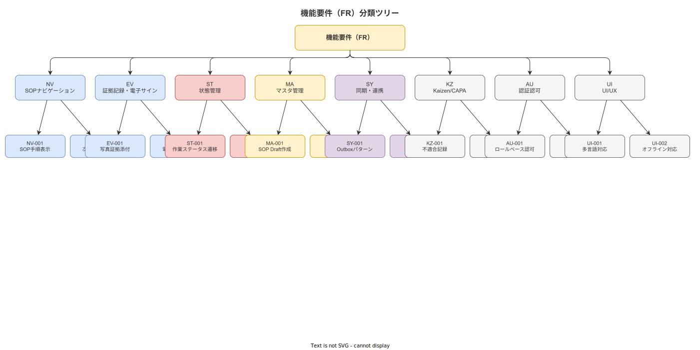

# 01 機能一覧（FR リスト）

本章の責務は、本システムが ver1.0.0 で実装する全機能要件を FR-ID で識別し、検証可能命題として一覧化することである。全 FR は機能名・概要・優先度（MoSCoW）・依存 FR・関連 UC の表形式で列挙する。本章はテスト計画・受入テスト仕様の根拠章となる。

---

## 1. 機能分類体系

本章では機能要件を以下の 9 カテゴリに分類する。各カテゴリの責務範囲を確定し、カテゴリ間の重複を禁止する。

| カテゴリコード | 名称 | 主な責務範囲 |
|---|---|---|
| `NV` | SOP ナビゲーション | 作業員向けロックステップ進行・Step 詳細表示・条件分岐・習熟度別モード |
| `EV` | 証拠記録・電子サイン | 写真証拠・測定値入力・QR スキャン照合・電子サイン・ALCOA+ 時刻記録 |
| `ST` | 状態管理 | 中断・再開・プレースキーパー・アンドン発報・不適合起票・ディスポジション管理 |
| `MA` | マスタ管理 | SOP Draft 編集・版管理・Publish・ロールバック・参照整合性・リワーク SOP 管理 |
| `SY` | 同期・連携 | Outbox 送信・READ-ONLY 親機同期・外部一意キー解決・通信断フォールバック |
| `KZ` | Kaizen/CAPA | Kaizen 起票・CAPA 進捗管理・監査ログ閲覧・エクスポート・リワーク履歴照会 |
| `AU` | 認証認可 | JWT 認証・RBAC 6 ロール・セッション管理・鍵ローテーション・二者電子サイン分離 |
| `UI` | UI/UX | 夜勤ダークモード・多言語・グローブ操作対応・オフラインインジケーター・状態バッジ |
| `IQ` | 入荷検査（IQC） | AQL 抜取検査・サンプリング計画・合否判定・後工程ロット使用バリデーション（2026-05-18 追加） |

**図 1: 機能分類体系（NV/EV/ST/MA/SY/KZ/AU/UI/IQ の 9 カテゴリ）**

> 原本: [`img/fig_fr_taxonomy.drawio`](img/fig_fr_taxonomy.drawio)

**本節で確定した方針**
機能分類は NV/EV/ST/MA/SY/KZ/AU/UI/IQ の 9 カテゴリとし、以降の全章で同一体系を使用する（2026-05-18: IQ を追加し 8→9 カテゴリへ拡張）。
カテゴリ間の重複は禁止し、各 FR は必ずいずれか 1 カテゴリに帰属させる。
カテゴリの追加・変更は本章の変更管理ログに記録した上で行う。

---

## 2. NV: SOP ナビゲーション機能群

SOP ナビゲーション機能群は、作業員がタブレット端末上で SOP に従ってロックステップ方式で作業を遂行することを支援する。

| FR-ID | 機能名 | 概要 | 優先度 | 依存 FR | 関連 UC |
|---|---|---|---|---|---|
| FR-NV-001 | 工程・作業選択 | システムは作業員が認証済みの場合に、当該作業員が資格を持つ工程一覧を表示し、工程→作業の 2 段階で選択を受け付ける | M | FR-AU-001 | UC-001 |
| FR-NV-002 | SOP ロックステップ進行制御 | システムは現在の Step が未完了の場合に、次の Step への進行操作を受け付けない。直前 Step の step_completed イベントが存在することを次 Step 解放の前提条件とする | M | FR-EV-001 | UC-001, UC-002 |
| FR-NV-003 | Step 詳細表示 | システムは現在の Step に対して、instruction_text（多言語対応）・media_refs（動画・参照写真）・tips_refs（コツ）・判定条件（USL/LSL）を表示する | M | FR-NV-001 | UC-002 |
| FR-NV-004 | 習熟度別表示モード制御 | システムは作業者の習熟度プロファイル（Novice/Competent/Proficient/Expert）に応じて Linear/Reference モードを自動選択する。Skill Decay（最終実施 30 日超または改訂後 3 回未満）を検知した場合、Expert であっても Linear モードへ強制切り替えする | M | FR-AU-001, FR-NV-003 | UC-001, UC-002 |
| FR-NV-005 | クリティカルステップ強化チェック | システムは fmea_rpn_flag が true の Step に対して、evidence_required を強制 true とし証拠付き完了以外の step_completed イベントを拒否する | M | FR-EV-001, FR-NV-002 | UC-002 |
| FR-NV-006 | 条件分岐 Step 通過 | システムは step_flow_rule が存在する Step において、前 Step の記録値を JSON Logic 条件式で評価し、skip/goto/insert のいずれかのアクションを実行する | M | FR-NV-002, FR-MA-007 | UC-003 |
| FR-NV-007 | カスタム Step タイプ実行 | システムは step_type_definition に登録されたカスタム Step タイプの入力フォームを、JSON スキーマから動的にレンダリングし、JSON Logic バリデーションを実行する | M | FR-NV-002, FR-MA-010 | UC-004 |
| FR-NV-008 | 多言語 SOP 表示切り替え | システムは作業者が表示言語を変更した場合に、instruction_text の多言語 JSONB から選択言語の文字列を即座に表示切り替えする。承認済みでない言語版 SOP は表示しない | M | FR-UI-001 | UC-005 |
| FR-NV-009 | Reference モード一覧表示 | システムは Reference モードにおいて、クリティカルフラグ付き Step・証拠入力必須 Step のみをチェックポイント一覧として表示し、詳細手順を折り畳み状態で提供する | S | FR-NV-004 | UC-002 |
| FR-NV-010 | ナビゲーション履歴参照 | システムは作業者が過去の作業実績（case_id 単位）の Step 完了履歴をタイムライン形式で参照できる画面を提供する | S | FR-EV-001 | UC-001 |
| FR-NV-011 | 深夜帯クリティカルステップ二重確認 | システムは連続夜勤 3 日目以降かつ 0:00〜5:00 の時間帯において、クリティカルフラグ付き Step に対して 2 秒長押し確認プロンプトを表示する | S | FR-NV-005, FR-UI-002 | UC-002 |
| FR-NV-012 | 異常高速操作検知 | システムは通常の Step 完了所要時間の 50% 以下の時間でステップが完了された場合に「操作が速すぎます」アラートを表示し、再確認を促す | S | FR-NV-002 | UC-002 |
| FR-NV-013 | ナビゲーション進捗表示 | システムは現在の Step 番号・全 Step 数・完了割合をステータスバーに常時表示する | M | FR-NV-001 | UC-001, UC-002 |

**本節で確定した方針**
NV カテゴリは FR-NV-001〜FR-NV-013 の 13 件を確定する。
FR-NV-002 のロックステップ制御は M 優先度の設計必達要件として確定する。
Skill Decay の閾値「最終実施 30 日超・改訂後 3 回未満」を FR-NV-004 の実装仕様として確定する。

---

## 3. EV: 証拠記録・電子サイン機能群

証拠記録・電子サイン機能群は、作業の各 Step で証拠を取得・記録し、ALCOA+ 原則を技術的に充足する。

| FR-ID | 機能名 | 概要 | 優先度 | 依存 FR | 関連 UC |
|---|---|---|---|---|---|
| FR-EV-001 | Step 完了イベント記録 | システムは Step 完了操作を受け付けた時点で step_completed イベントを Append-only でイベントストアに記録する。event_id・case_id・activity・timestamp_device・timestamp_server・worker_id・terminal_id・sop_version_id の 8 必須属性を必ず含める | M | FR-AU-001 | UC-002 |
| FR-EV-002 | 写真証拠取得・記録 | システムは photo_capture タイプの Step において、カメラ撮影または画像選択を受け付け、取得した画像の SHA-256 ハッシュを計算して photo_hash フィールドに保存する。撮影時刻を ALCOA+ の Contemporaneous 原則に従い timestamp_device として記録する | M | FR-EV-001 | UC-006 |
| FR-EV-003 | 測定値取得・バリデーション | システムは numeric_input タイプの Step において、数値入力を受け付け、SOP の USL・LSL と照合して合否判定を即時表示する。校正期限が当日以前の計測器による入力をハードブロックする | M | FR-EV-001, FR-MA-004 | UC-007 |
| FR-EV-004 | QR スキャン照合 | システムは qr_scan タイプの Step において、ML Kit Barcode Scanning を使用して GS1 体系（EAN/UPC/ITF-14/GS1-128）・QR コード・Data Matrix を読み取り、SOP の判定条件と照合して合否を判定する | M | FR-EV-001 | UC-008 |
| FR-EV-005 | 電子サイン付与 | システムは signature タイプの Step において、作業者のユーザー ID・タイムスタンプ・サーバー署名を組み合わせた電子サインを生成し、step_completed イベントの payload に記録する | M | FR-EV-001, FR-AU-001 | UC-009 |
| FR-EV-006 | 不確かさ付き測定値記録 | システムは測定値とともに uncertainty_u（標準不確かさ）・uncertainty_k（包含係数）・instrument_id・calibration_ref を payload に記録する | M | FR-EV-003 | UC-007 |
| FR-EV-007 | 二重タイムスタンプ記録 | システムは全イベントに端末タイムスタンプ（timestamp_device）とサーバー受信タイムスタンプ（timestamp_server）を両方記録し、is_offline フラグでオフライン記録を区別する | M | FR-EV-001 | UC-006, UC-007 |
| FR-EV-008 | 訂正イベント追記 | システムは既存の step_completed イベントへの UPDATE を禁止し、誤記録の訂正は correction イベントを新規追記する方式のみを許容する。訂正イベントには訂正理由・訂正者 ID・承認者 ID を必須とする | M | FR-EV-001 | UC-002 |
| FR-EV-009 | ALCOA+ 記録完全性チェック | システムは作業完了後に SOP の step_count と記録された step_completed イベント数を照合し、不一致がある場合に管理者に警告する | S | FR-EV-001 | UC-002 |
| FR-EV-010 | 後入力フラグ付与 | システムは事後入力された記録に is_retroactive: true フラグを付与し、事後入力者 ID・承認者 ID・紙原本保管場所を必須として記録する | S | FR-EV-001 | UC-002 |
| FR-EV-011 | 単位不一致検知 | システムは数値入力時に入力値の unit_code と SOP の expected_unit を比較し、換算不可能な単位不一致の場合に入力をブロックして単位修正を要求する | M | FR-EV-003 | UC-007 |
| FR-EV-012 | Cp/Cpk 即時算出 | システムは USL と LSL を持つ Step への数値入力時に Cp/Cpk を即時算出して画面表示する。算出結果は管理図データとして payload に含める | S | FR-EV-003 | UC-007 |
| FR-EV-013 | 工具/治具スキャン照合 | システムは qr_scan タイプの Step において SOP の required_scans 配列に target: 'tool' または 'instrument' を含む場合、スキャン値を equipments.scan_code または instruments.instrument_code と照合する。不一致の場合は step_completed を受け付けない（BR-BUS-046）。 | M | FR-EV-004, FR-MA-004 | UC-026 |

**本節で確定した方針**
EV カテゴリは FR-EV-001〜FR-EV-013 の 13 件を確定する。
FR-EV-002 の SHA-256 ハッシュ記録・FR-EV-007 の二重タイムスタンプは M 優先度の設計必達要件として確定する。
FR-EV-008 の訂正イベント追記方式により UPDATE 禁止を技術的に保証することを確定する。
FR-EV-013 を追加し、工具・治具・計測器の誤使用を設計上ブロックするポカヨケ機能を EV カテゴリに確定する。

---

## 4. ST: 状態管理機能群

状態管理機能群は、作業の中断・再開・プレースキーパー・アンドン発報・不適合起票に関わる状態遷移を管理する。

| FR-ID | 機能名 | 概要 | 優先度 | 依存 FR | 関連 UC |
|---|---|---|---|---|---|
| FR-ST-001 | 作業中断記録 | システムは中断操作を受け付けた時点で work_interrupted イベントを記録する。中断時の Step 番号・時刻・作業者 ID・中断理由種別を必須フィールドとする | M | FR-EV-001 | UC-010 |
| FR-ST-002 | プレースキーパー保存 | システムは中断発生時に現在の Step 番号・case_id・sop_version_id をプレースキーパーとして SQLite ローカルに保存する。アプリ再起動後も復元できることを保証する | M | FR-ST-001 | UC-010 |
| FR-ST-003 | 作業再開 Welcome 画面表示 | システムは中断済み作業を再開する際に Welcome 画面を表示する。表示内容は中断前 Step のサマリ・経過時間・警告メッセージとする | M | FR-ST-001, FR-ST-002 | UC-011 |
| FR-ST-004 | 再開後 Post-Completion Error 防止 | システムは再開後のロックステップが最後の未完 Step に強制復帰することを保証する。完了済みと誤認された未完 Step があっても次 Step へ進行しない | M | FR-ST-003, FR-NV-002 | UC-011 |
| FR-ST-005 | 長時間中断後クリティカルステップ目視再確認 | システムは 30 分を超える中断後の再開時に、クリティカルフラグ付き Step の目視再確認プロンプトを表示する。スキップは理由入力を必須とする | S | FR-ST-003, FR-NV-005 | UC-011 |
| FR-ST-006 | I-PASS 引継ぎメモ生成 | システムはシフト交代時に I-PASS 構造（状況概要・案件詳細・評価・未完課題・引継ぎ指示）の引継ぎメモを生成し、電子署名付きで記録する | S | FR-EV-005, FR-ST-001 | UC-010, UC-011 |
| FR-ST-007 | アンドン発報 | システムはアンドン発報操作を受け付けた時点で andon_triggered イベントを記録する。発報種別（応援要請・品質異常・設備異常・安全異常）・緊急度・対象 Step を必須フィールドとする | M | FR-EV-001 | UC-012 |
| FR-ST-008 | アンドン通知配信 | システムはアンドン発報時に現場監督・IT 担当の登録デバイスにプッシュ通知を送信する。通知配信失敗時は管理者アラートを発する | M | FR-ST-007 | UC-012 |
| FR-ST-009 | 不適合起票 | システムは不適合起票操作を受け付けた時点で nonconformance_filed イベントを記録する。4M（Man/Machine/Material/Method）と Environment の 5 軸を等価提示し複数選択を許容する | M | FR-EV-001 | UC-013 |
| FR-ST-010 | CAPA 進捗管理 | システムは不適合レコードに対して起票→原因分析→対策→効果確認→クローズの CAPA フェーズ遷移を管理する。ISO 9001:2015 §10.2 に準拠する | M | FR-ST-009 | UC-013 |
| FR-ST-011 | Protection Window 制御 | システムは中断発生から 5 分間は新着通知をミュートし、画面をロック状態に移行する。意図しない Step 完了操作を防止する | S | FR-ST-001 | UC-010 |
| FR-ST-012 | Emergency Mode 自動起動 | システムはサーバーとの通信断絶が 5 分を超えた時点で Emergency Mode を自動起動する。フルスクリーンバナー・緊急連絡先ワンタップ・紙フォールバック PDF へのワンタップアクセスを提供する | M | FR-SY-004 | UC-022 |

**本節で確定した方針**
ST カテゴリは FR-ST-001〜FR-ST-012 の 12 件を確定する。
FR-ST-002 のプレースキーパーはアプリ再起動後の復元を設計必達とすることを確定する。
FR-ST-009 の不適合起票における 5 軸等価提示は Man 軸過収束防止の設計原則を実装するものと確定する。

---

## 5. MA: マスタ管理機能群

マスタ管理機能群は、管理 Web 上での SOP・ユーザー・設備・計測器・カスタム Step タイプ・外部一意キーのライフサイクル管理を担う。

| FR-ID | 機能名 | 概要 | 優先度 | 依存 FR | 関連 UC |
|---|---|---|---|---|---|
| FR-MA-001 | SOP Draft 作成・編集 | システムは品質担当ロールの操作者が公開済み SOP を Draft 状態にコピーして編集できる機能を提供する。Draft 中の内容はタブレット APP に反映しない | M | FR-AU-002 | UC-014 |
| FR-MA-002 | Auto-Save 30 秒間隔 | システムは Draft 編集セッション中に 30 秒間隔でドラフトを自動保存する。バックグラウンド保存の状態を「最終保存: X 秒前」として常時表示する | M | FR-MA-001 | UC-014 |
| FR-MA-003 | Undo/Redo 50 ステップ | システムは Draft 編集中に直近 50 操作の取り消し（Undo）とやり直し（Redo）を提供する。公開操作は Undo 対象外とする | M | FR-MA-001 | UC-014 |
| FR-MA-004 | 計測器マスタ・校正期限管理 | システムは計測器マスタに次回校正期限（next_calibration_date）を保持し、測定値入力前に校正期限プレフライトチェックを実行する。期限超過の計測器による入力をハードブロックまたはソフト警告（業種設定）で制御する | M | FR-AU-002 | UC-018 |
| FR-MA-005 | SOP Publish（承認フロー） | システムは Draft 状態の SOP を under_review → approved → published の状態遷移で公開する。approved への遷移には品質担当の電子署名（ユーザー ID + タイムスタンプ + サーバー署名）を必須とする | M | FR-MA-001, FR-EV-005 | UC-016 |
| FR-MA-006 | SOP ロールバック | システムは承認者が Published 版を旧バージョンに戻す操作を受け付ける。ロールバック実行後、旧版を新たに published 状態に設定し、現行版を obsolete 状態に設定する | M | FR-MA-005 | UC-017 |
| FR-MA-007 | 条件式 DSL ビジュアル編集 | システムは step_flow_rule の条件式（JSON Logic）をビジュアル DSL エディタ（演算子パレット・変数ピッカー・条件ツリー表示・プレビュー実行）で編集できる機能を提供する。DAG ビジュアルフロー編集は FR-MA-016 に分離する。 | S | FR-MA-001 | UC-015 |
| FR-MA-008 | 参照整合性チェック（dry-run） | システムはマスタの削除・廃止操作前に dry-run を実行し、影響を受けるレコード件数と一覧を表示する。影響件数がゼロでない状態での削除を API レベルでブロックする | M | FR-MA-001 | UC-018 |
| FR-MA-009 | SOP Diff 常時表示 | システムは Draft 編集中に右ペインに現在の公開版との差分（追加:緑・削除:赤・変更:黄）をリアルタイム表示する | M | FR-MA-001 | UC-014 |
| FR-MA-010 | カスタム Step タイプ登録・管理 | システムは step_type_definition への JSON スキーマ登録・バージョン管理・論理削除（is_active: false）を提供する。削除は論理削除のみとし物理削除を禁止する | M | FR-MA-001, FR-AU-002 | UC-014, UC-016 |
| FR-MA-011 | SOP クローン作成 | システムは既存の公開済み SOP を原型としてクローンを作成する。新 SOP はドラフト状態で作成され、derived_from フィールドにクローン元文書番号を自動記録する | S | FR-MA-001 | UC-014 |
| FR-MA-012 | CSV/Excel 双方向インポート | システムは CSV/xlsx のアップロードを受け付け、プレビュー表示・不整合レコードの赤強調一覧確認を経て SOP・Step データを一括登録する。プレビュー未確認での自動投入を禁止する | S | FR-MA-001, FR-AU-002 | UC-014 |
| FR-MA-013 | 楽観的ロック（同時編集競合検出） | システムはマスタ保存時に lock_version を比較し、不一致の場合に保存を拒否して競合を通知する | M | FR-MA-001 | UC-014 |
| FR-MA-014 | Effective Date とロット番号の紐付け | システムは SOP の改訂適用開始日（effective_date）とロット番号を紐付けて版切替を管理する。進行中の作業指示は旧版で完了させ、新作業指示から新版を適用する | M | FR-MA-005 | UC-016 |
| FR-MA-015 | master_edit_event 変更履歴記録 | システムはマスタの全編集操作を master_edit_event テーブルに Append-only で記録する。performed_by・performed_at・diff（JSON Patch 形式）を必須フィールドとする | M | FR-MA-001, FR-AU-001 | UC-014, UC-016 |
| FR-MA-016 | Step-DAG ビジュアルフロー編集 | システムは SOP の Step を有向非巡回グラフ（DAG）として描画するキャンバスを提供し、編集者は Step ノードのドラッグ並べ替え・条件エッジの作画（skip/goto/insert を色分け）・サンプル値によるフロー全体のシミュレーションを実行できる。DAG 循環参照はクライアント側プレフライト検証と API レベル検証の二重で拒否する（CFG-016: ノード数上限 200、CFG-017: エッジ数上限 500）。 | S | FR-MA-001, FR-MA-007, FR-MA-008 | UC-015 |

**本節で確定した方針**
MA カテゴリは FR-MA-001〜FR-MA-016 の 16 件を確定する。
FR-MA-008 の参照整合性ブロックは API レベルで実装し、クライアント側チェックのみへの依存を禁止することを確定する。
FR-MA-015 の master_edit_event Append-only 記録は ALCOA+ Attributable・Contemporaneous の管理 Web 側実装として確定する。
FR-MA-007 の概要を条件式 JSON Logic 演算子ビルダに限定し、DAG ビジュアルフロー編集は FR-MA-016 として分離することを確定する。

---

## 6. SY: 同期・連携機能群

同期・連携機能群は、子機モードにおける親機（ERP/MES）とのマスタ同期・実績送信・外部一意キー解決・通信断フォールバックを担う。

| FR-ID | 機能名 | 概要 | 優先度 | 依存 FR | 関連 UC |
|---|---|---|---|---|---|
| FR-SY-001 | READ-ONLY 親機マスタ同期 | システムは子機モード READ-ONLY において、REST API 経由で親機からマスタデータ（SOP・ユーザー・ロット等）を受信し、ローカル SQLite に同期する。親機マスタへの書き込みは行わない | M | FR-AU-003 | UC-019 |
| FR-SY-002 | Outbox パターン実績送信 | システムは step_completed 等のイベントを SQLite の outbox テーブルに蓄積し、通信回復後に端末タイムスタンプ順を維持して親機 API へ非同期送信する。event_id を Idempotency Key として重複送信を防止する | M | FR-EV-001 | UC-020 |
| FR-SY-003 | 外部一意キー解決 | システムは親機から受信した外部一意キー（型式・機番・品目コード等の組み合わせ）を external_key_binding テーブルを通じて内部の work_pattern_id に解決する | M | FR-SY-001 | UC-021 |
| FR-SY-004 | 通信断縮退動作 | システムは通信断時に最終同期時刻のマスタで縮退稼働し、「マスタが古い可能性あり」バナーを表示する。sync_failure_log に失敗イベントを記録する。作業継続を最優先とし通信断を理由としたラインストップを発生させない | M | FR-SY-001 | UC-022 |
| FR-SY-005 | 同期完了通知 | システムは Outbox の全件送信完了時に作業者に同期完了通知を表示する | S | FR-SY-002 | UC-020 |
| FR-SY-006 | 連携モード切り替え | システムは設定ファイルによる単独動作モード・子機モード READ-ONLY・子機モード双方向の切り替えを管理者操作でアプリ再デプロイ不要で実行できる | M | FR-AU-002 | UC-019, UC-022 |
| FR-SY-007 | Webhook 受信処理 | システムは親機からの Webhook（master.updated 通知等）を HMAC-SHA256 署名検証の上で受信し、マスタ差分同期を自動実行する | S | FR-SY-001 | UC-019 |
| FR-SY-008 | コンフリクト記録 | システムはマスタ同期競合（親機・子機の同一レコードに差異がある場合）を親機の値を権威として解決し、sync_conflict_log に差異内容を記録する | M | FR-SY-001 | UC-019 |
| FR-SY-009 | 最終同期時刻常時表示 | システムは全画面のステータスバーに最終同期時刻を常時表示する | M | FR-SY-001, FR-SY-004 | UC-022 |
| FR-SY-011 | Case 端末排他占有 | システムは case_id ごとに同時占有できる端末を 1 台に制限する。POST /work-executions または POST /resume 時に case_locks テーブルへ占有登録を試み、他端末がすでに占有中の場合は HTTP 409 ERR-BIZ-026 を返す。heartbeat 未更新が 5 分を超えた場合は BAT-013 が自動 EXPIRED 化する（ADR-009） | M | FR-SY-002 | — |

**本節で確定した方針**
SY カテゴリは FR-SY-001〜FR-SY-011 の 10 件（FR-SY-011 追加）を確定する。
FR-SY-002 の event_id Idempotency Key による重複防止は設計必達とし、オフライン同期の安全性を保証する。
FR-SY-004 の通信断縮退動作は「作業継続最優先」の原則に従い、通信断を理由としたラインストップを禁止することを確定する。
FR-SY-011 の case_id 排他占有は多端末競合問題を structural に解決する設計とし、タイムスタンプ調停方式（計画文書 04_想定ユースケースとシナリオ.md §4 記述）は採用しない（ADR-009）。

---

## 7. KZ: Kaizen/CAPA 機能群

Kaizen/CAPA 機能群は、ヒヤリハット・改善提案・不適合レコードの管理と監査ログの閲覧・エクスポートを担う。

| FR-ID | 機能名 | 概要 | 優先度 | 依存 FR | 関連 UC |
|---|---|---|---|---|---|
| FR-KZ-001 | Kaizen Teian 起票 | システムは作業員が写真・テキスト・定型タグを組み合わせた改善提案を起票できる機能を提供する。起票時刻・作業者 ID を自動付与する | S | FR-EV-001 | UC-013 |
| FR-KZ-002 | ヒヤリハット起票 | システムは作業員がヒヤリハット（危険予知）を起票できる機能を提供する。4M+Environment の 5 軸分類タグを付与する | S | FR-EV-001 | UC-013 |
| FR-KZ-003 | CAPA フェーズ管理 | システムは不適合レコードに対して CAPA フェーズ（起票→原因分析→対策→効果確認→クローズ）の状態遷移を管理する。ISO 9001:2015 §10.2 に準拠する | M | FR-ST-009 | UC-013 |
| FR-KZ-004 | Why-Why 分析記録 | システムは CAPA の原因分析フェーズに 4M/Why-Why 分析を構造化入力できるフォームを提供する | S | FR-KZ-003 | UC-013 |
| FR-KZ-005 | 監査ログ閲覧 | システムは品質担当・管理者ロールに対してイベントログ・master_edit_event の全件閲覧画面を提供する。検索・フィルタは全属性対応とする | M | FR-AU-002 | — |
| FR-KZ-006 | XES/CSV エクスポート | システムはプロセスマイニング用の XES 形式と CSV 形式のログエクスポートを提供する。ISO 9001:2015 §9.1 に対応する | S | FR-KZ-005 | — |
| FR-KZ-007 | 順方向・逆方向トレサビ照会 | システムはロット→工程→完成品（順方向）・製品→工程→原材料/作業者/設備（逆方向）の 2 方向クエリを管理 Web から提供する。ISO 9001:2015 §8.5.2 に準拠する | M | FR-EV-001 | — |
| FR-KZ-008 | 品質ダッシュボード | システムは管理図・工程能力指数（Cp/Cpk）の集計ビューを管理 Web で提供する。データソースは step_completed イベントの payload.numeric_value とする | S | FR-EV-012 | — |

**本節で確定した方針**
KZ カテゴリは FR-KZ-001〜FR-KZ-008 の 8 件を確定する。
FR-KZ-003 の CAPA フェーズ管理は ISO 9001:2015 §10.2 に準拠する M 優先度要件として確定する。
FR-KZ-007 の順方向・逆方向トレサビ照会は ISO 9001:2015 §8.5.2 に準拠する M 優先度要件として確定する。

---

## 8. AU: 認証認可機能群

認証認可機能群は、JWT による認証・RBAC 6 ロール・セッション管理・鍵ローテーションを担う。

| FR-ID | 機能名 | 概要 | 優先度 | 依存 FR | 関連 UC |
|---|---|---|---|---|---|
| FR-AU-001 | JWT RS256 認証 | システムは作業者認証を JWT（RS256 アルゴリズム）で実施する。トークンの検証はステートレスに行う。共有アカウントを技術的に禁止する | M | — | UC-001 |
| FR-AU-002 | RBAC 6 ロール制御 | システムは作業員・現場監督・品質担当・保全担当・IT 担当・管理者の 6 ロールを実装し、マスタ種別と操作（作成/承認/改訂/廃止/参照）の組み合わせでアクセスを制御する | M | FR-AU-001 | UC-016, UC-017 |
| FR-AU-003 | OAuth 2.1 Client Credentials 対応 | システムは子機モードにおいて親機からの API 呼び出しを OAuth 2.1 Client Credentials または mTLS で認証する | M | FR-SY-001 | UC-019 |
| FR-AU-004 | スキル・資格アクセス制御 | システムは Step の skill_level_required と作業者の現在スキルレベルを比較し、不足する場合に Step 操作をブロックする | M | FR-AU-001, FR-NV-002 | UC-001 |
| FR-AU-005 | セッション管理 | システムは JWT の有効期限を管理し、有効期限切れトークンによる操作を拒否する。Refresh Token を実装しシームレスな延長を提供する | M | FR-AU-001 | UC-001 |
| FR-AU-006 | 鍵ローテーション | システムは RS256 の秘密鍵を定期ローテーションできる機能を提供する。ローテーション中も既存の有効トークンを受け付けるグレースピリオドを設ける | S | FR-AU-001 | — |

**本節で確定した方針**
AU カテゴリは FR-AU-001〜FR-AU-006 の 6 件を確定する。
FR-AU-002 の RBAC 6 ロールは作業員のマスタ編集を技術的に禁止する設計必達要件として確定する。
FR-AU-004 のスキル・資格ブロックはシステムによる強制制御とし、運用ルールのみへの依存を禁止する。

---

## 9. UI: UI/UX 機能群

UI/UX 機能群は、夜勤ダークモード・多言語・グローブ操作対応・オフラインインジケーターのほか、端末多様性対応を担う。

| FR-ID | 機能名 | 概要 | 優先度 | 依存 FR | 関連 UC |
|---|---|---|---|---|---|
| FR-UI-001 | 多言語表示（i18next + expo-localization） | システムは作業者プロファイルの言語設定に基づき、UI ラベル・エラーメッセージ・通知を日本語・英語・ベトナム語（承認済み言語）で表示する。承認済みでない言語版 SOP は表示しない | M | FR-MA-005 | UC-005 |
| FR-UI-002 | 夜勤ダークモード自動切替 | システムは 20:00〜6:00 の時間帯に自動でダークモードに切り替える。ブルーライトを低減し夜間作業の眼精疲労を軽減する | S | — | UC-002 |
| FR-UI-003 | シニアモード | システムはプロファイル設定によりシニアモード（フォントサイズ 14〜16pt・タッチターゲット 72dp 以上・自動補完優先・確認ダイアログ追加）を有効化する | S | FR-AU-001 | UC-001 |
| FR-UI-004 | グローブ操作対応 | システムはすべてのインタラクティブ要素のタッチターゲットを 48dp 以上（通常時）・72dp 以上（シニアモード時）とし、グローブ着用での操作を設計上担保する | M | — | UC-001 |
| FR-UI-005 | オフラインインジケーター常時表示 | システムはすべての画面共通のステータスバーに最終同期時刻・オフライン状態・未同期レコード件数を常時表示する | M | FR-SY-009 | UC-022 |
| FR-UI-006 | WCAG 2.1 AA 準拠 | システムは手順テキスト・UI ラベルのコントラスト比 4.5:1 以上、フォントサイズ最小 14pt を担保する。ISO 9241-171（アクセシビリティ）に対応する | M | — | — |
| FR-UI-007 | 記録済み（未同期）バッジ表示 | システムはオフライン中に記録済みの Step に「記録済（未同期）」バッジを表示し、ALCOA+ の Contemporaneous 原則との整合を UI 上で明示する | M | FR-SY-004 | UC-022 |
| FR-UI-008 | ピクトグラム表示（ISO 7010） | システムは安全指示を含む Step のクリティカルフラグ付き手順にピクトグラム（ISO 7010 安全標識）を表示する | M | FR-NV-005 | UC-005 |
| FR-UI-009 | 「現場監督を呼ぶ」ボタン常設 | システムはクリティカルフラグ付き Step の画面に「現場監督を呼ぶ」ボタンを常設する | S | FR-NV-005 | UC-005 |
| FR-UI-010 | 多言語 SOP 原文（日本語）併記 | システムは多言語版 SOP 表示中に安全上重要な手順（クリティカルフラグ付き Step）の原文（日本語）を併記表示するオプションを提供する | S | FR-UI-001, FR-NV-005 | UC-005 |
| FR-UI-011 | ふりがな表示 | システムは Novice プロファイルの作業者に対して手順テキストにふりがなを表示する | C | FR-NV-004 | UC-001 |

| FR-UI-012 | リワーク状態バッジ | システムは不適合一覧・CAPA 一覧・作業指示一覧において、リワーク状態（PENDING_DISPOSITION / REWORK_IN_PROGRESS / VERIFICATION_IN_PROGRESS 等）を色分けバッジで表示する | M | FR-UI-007, FR-ST-014 | UC-040 |

**本節で確定した方針**
UI カテゴリは FR-UI-001〜FR-UI-012 の 12 件を確定する（FR-UI-012 リワーク状態バッジを 2026-05-18 追加）。
FR-UI-004 のタッチターゲット 48dp（通常時）/72dp（シニアモード時）は設計必達の寸法制約として確定する。
FR-UI-006 の WCAG 2.1 AA 準拠はすべての画面に適用する M 優先度要件として確定する。

---

## 10. IQ: 入荷検査（IQC）機能群

入荷検査（IQC）機能群は、材料・部品の入荷から AQL（JIS Z 9015-1）ベースの抜取検査・合否判定・後工程ロット使用バリデーションまでを担う。2026-05-18 に新規追加したカテゴリである。

| FR-ID | 機能名 | 概要 | 優先度 | 依存 FR | 関連 UC |
|---|---|---|---|---|---|
| FR-IQ-001 | 受入登録 | システムは品質担当が入荷ロットの material_id・supplier_id・lot_no・数量・到着日を登録する際に、材料マスタ（TBL-036）と仕入先マスタ（TBL-037）への参照整合性を検証した上で `incoming_inspections` レコードを生成する | M | FR-AU-002, FR-MA-014 | UC-027 |
| FR-IQ-002 | サンプリング計画解決 | システムはロット × 材料 × 仕入先の組み合わせから `sampling_plans` を優先順位（固有→材料固有→デフォルト）で解決し、n・Ac・Re・サンプル文字・`aql_table_snapshot` の JSONB を `incoming_inspections` に時点固定で記録する | M | FR-IQ-001, FR-MA-004 | UC-028 |
| FR-IQ-003 | サンプリング指示生成 | システムはサンプリング計画の解決後、採取個数 n・採取方法・検査項目リストをハンディ APP の IQC 入荷検査画面（SCR-HA-017）に表示する | M | FR-IQ-002 | UC-028 |
| FR-IQ-004 | 検査測定値入力 | システムは検査員が各サンプルの測定値（数値）・写真（SHA-256 ハッシュ付き）・QR スキャン（GS1 体系）を入力した際に、`incoming_inspection_measurements`（TBL-040）に Append-only で記録し、使用計測器 ID・校正証明書 ID を紐付ける | M | FR-EV-001, FR-EV-003, FR-EV-006 | UC-029 |
| FR-IQ-005 | AQL 自動合否判定 | システムは全サンプルの入力完了後に不良数と Ac/Re を比較して ACCEPT / REJECT を自動判定し、判定根拠（不良数・Ac・Re・サンプル文字）を `incoming_inspections` に二重タイムスタンプ（device + server）付きで記録する | M | FR-IQ-004 | UC-029 |
| FR-IQ-006 | 合否 4 区分判定 | システムは品質担当が ACCEPT / CONCESSION（特採）/ SCREENING（選別）/ REJECT（返品）の 4 区分を管理 Web の SCR-MC-010 で確定した際に、`lots.qc_status` を更新し後工程への影響を制御する | M | FR-IQ-005 | UC-029, UC-030 |
| FR-IQ-007 | 特採承認フロー | システムは品質担当が CONCESSION 判定を確定する際に、特採理由（必須）・有効範囲（ロット番号・数量・使用可能工程の JSONB）・有効期限（CFG-023 デフォルト 90 日）・電子サイン（FR-EV-005）を `concession_approvals`（TBL-041）に Append-only で記録する | M | FR-IQ-006, FR-EV-005 | UC-030 |
| FR-IQ-008 | 検査厳しさ自動切替 | システムは材料 × 仕入先の組み合わせに対し JIS Z 9015-1 §10 の切替ルール（なみ→ゆるい: 連続 5 ロット合格、なみ→きつい: 5 ロット中 2 ロット不合格）を状態機械で自動適用し、`incoming_inspections.severity_state` を更新する | M | FR-IQ-005, FR-IQ-006 | UC-031 |
| FR-IQ-009 | 後工程ロット使用バリデーション | システムは SOP 実行中に材料ロットを QR スキャン（target: 'material'）した際に `lots.qc_status` を参照し、PASSED 以外は ERR-BIZ-016、IQC 未実施は ERR-BIZ-017 として step_completed を拒否する API ハードゲートを実装する | M | FR-EV-013, FR-IQ-006 | UC-032 |
| FR-IQ-010 | 後工程使用時警告バナー強制表示 | システムは CONDITIONAL_PASS（特採）ロットの QR スキャン成功時にハンディ APP に黄色警告バナーを表示し、作業員のタップ操作（確認）なしに next_step へ進行できないよう強制する。確認操作は worker_id・時刻付きで記録する | M | FR-IQ-009 | UC-032 |
| FR-IQ-011 | 選別子ロット分割 | システムは SCREENING 判定後に全数選別が完了した際に、合格個体分の新規 `lot_id` を持つ子ロットを TBL-024 `lots.parent_lot_id` 参照付きで発行し、子ロットの `qc_status = PASSED` として後工程解放する | S | FR-IQ-006 | UC-029 |
| FR-IQ-012 | 返品処理 | システムは REJECT 判定後に品質担当が返品書 PDF をアップロードした際に仕入先 ID・運送業者・追跡番号を TBL-050 `return_to_vendor_records` に記録し、RP-008 返品書を生成する | S | FR-IQ-006 | UC-030 |
| FR-IQ-013 | 仕入先別品質実績集計 | システムは仕入先 × 材料 × 月単位で受入ロット数・合格数・特採数・選別数・返品数・不合格率を集計し、VW-010 マテリアライズドビューを介して品質担当・経営層・IT 担当に限定公開する。IQC 検査員 worker_id 単位の集計・ランキングは BR-BUS-029 により設計上禁止する | S | FR-IQ-005, FR-IQ-006 | UC-033 |
| FR-IQ-014 | 受入検査履歴照会 | システムは lot_id・material_id・supplier_id・検査日時範囲を条件として受入検査履歴を照会し、FR-KZ-007 の順方向・逆方向トレサビ照会との統合ビューを提供する | M | FR-KZ-007 | UC-033 |
| FR-IQ-015 | 仕入先マスタ管理 | システムは品質担当が仕入先マスタ（TBL-037）を Draft-First 方式（FR-MA-005 の承認フロー準拠）で登録・編集・廃止できる画面（SCR-MA-012）を提供する | M | FR-MA-005, FR-MA-013 | UC-034 |
| FR-IQ-016 | 材料マスタ管理 | システムは品質担当が材料マスタ（TBL-036）を Draft-First 方式で登録・編集・廃止できる画面（SCR-MA-013）を提供する。material_type（RAW_MATERIAL / COMPONENT / TOOL / PACKAGING）の区分管理を含む | M | FR-MA-005 | UC-034 |
| FR-IQ-017 | サンプリング計画マスタ管理 | システムは品質担当がサンプリング計画マスタ（TBL-039）を Draft-First 方式で登録・編集する画面（SCR-MA-014）を提供する。AQL 値・検査水準・JIS Z 9015-1 の `aql_table_snapshot` JSONB の生成・版管理を含む | M | FR-MA-005, FR-MA-008 | UC-034 |
| FR-IQ-018 | 受入予定取込（EDI/CSV） | システムは Webhook（FR-SY-007）または CSV インポートで受入予定データを取込み、事前ロット登録を実施する（FR-IQ-001 の自動化オプション） | C | FR-SY-007 | UC-027 |
| FR-IQ-019 | IQC ダッシュボード | システムは品質担当向けに受入待ち・検査中・要承認（特採・返品）のロット一覧をリアルタイムで表示する管理 Web 画面（SCR-MC-010）を提供する | S | FR-IQ-005, FR-IQ-013 | UC-033 |

**本節で確定した方針**
IQ カテゴリは FR-IQ-001〜FR-IQ-019 の 19 件を確定する（2026-05-18 新設）。
AQL ハードゲート（FR-IQ-009）は API レベルで実装し、クライアント側バイパス不可とすることを確定する。
特採承認の必須記録（理由・有効範囲・有効期限・電子サイン）と CONDITIONAL_PASS ロットの警告バナー強制表示（dismissable 不可）を確定する。
検査員 worker_id 単位の集計は BR-BUS-029 により設計上禁止することを確定する。

---

## 11. リワーク関連 FR（既存カテゴリへの追加）

以下の FR は既存カテゴリ（ST/EV/NV/MA/KZ/AU/UI/SY）への追加として 2026-05-18 に採番した。

### §4 ST: 状態管理（追加分）

| FR-ID | 機能名 | 概要 | 優先度 | 依存 FR | 関連 UC |
|---|---|---|---|---|---|
| FR-ST-013 | ディスポジション登録 | システムは品質担当と現場監督の二者電子サイン（quality_admin_sign_id ≠ supervisor_sign_id かつ signer_id が異なる worker_id であることを DB トリガーで検証）付きで、REWORK / REGRADE / USE_AS_IS / SCRAP / RETURN_TO_VENDOR の判定を `dispositions`（TBL-044）に Append-only で記録する | M | FR-EV-005, FR-ST-009 | UC-035 |
| FR-ST-014 | リワーク状態遷移制御 | システムは PENDING_DISPOSITION → DISPOSITION_DECIDED → REWORK_IN_PROGRESS → REWORK_COMPLETED → VERIFICATION_IN_PROGRESS → CLOSED_* の有限状態機械を実装し、定義外遷移を API レベルで拒否する。`CLOSED_*` 状態からの逆遷移は全て禁止する | M | FR-ST-013 | UC-036, UC-038 |

### §3 EV: 証拠記録（追加分）

| FR-ID | 機能名 | 概要 | 優先度 | 依存 FR | 関連 UC |
|---|---|---|---|---|---|
| FR-EV-014 | リワーク前後比較証拠 | システムはリワーク作業の開始前と完了後の写真を SHA-256 ハッシュ付きで `evidences` に二重タイムスタンプ（device + server）必須で記録する。双方の証拠が揃わない場合は rework_completed イベントを受け付けない | M | FR-EV-002 | UC-037 |
| FR-EV-015 | 廃却・返却処理証跡 | システムは SCRAP / RETURN_TO_VENDOR ディスポジション確定時に廃棄物処理票 PDF または返却伝票 PDF のアップロードを必須とし、廃却立会者の電子サインを `scrap_records`（TBL-049）または `return_to_vendor_records`（TBL-050）に Append-only で記録する | M | FR-EV-002, FR-EV-005 | UC-035 |

### §2 NV: SOP ナビゲーション（追加分）

| FR-ID | 機能名 | 概要 | 優先度 | 依存 FR | 関連 UC |
|---|---|---|---|---|---|
| FR-NV-014 | リワーク SOP 自動選択 | システムはディスポジション REWORK / TOUCH_UP / SORTING の場合に、不適合カテゴリと元 SOP 版から `rework_sop_mapping`（TBL-046）を参照して適用リワーク SOP を自動提示し、新 case_id を採番してリワーク作業指示を生成する | M | FR-NV-001, FR-MA-017 | UC-036 |
| FR-NV-015 | 修正品 QR スキャン起動 | システムはハンディ APP で修正品 QR（GS1 AI 8003 + AI 91 形式）をスキャンした際に rework_id・親 lot_id・リワーク SOP 版を分解・検証し、再検査画面（SCR-HA-021）に遷移する | M | FR-EV-013 | UC-038 |

### §5 MA: マスタ管理（追加分）

| FR-ID | 機能名 | 概要 | 優先度 | 依存 FR | 関連 UC |
|---|---|---|---|---|---|
| FR-MA-017 | リワーク SOP タイプ管理 | システムは sop_type（REWORK / INSPECTION / SCRAP_RECORD / RETURN_RECORD）を持つ専用 SOP の Draft 編集・版管理・Publish・ロールバックを FR-MA-001〜FR-MA-006 と同一フローで提供する | M | FR-MA-001, FR-MA-005 | UC-039 |
| FR-MA-018 | リワーク SOP マッピングマスタ | システムは不適合カテゴリ × 元 SOP（任意）× 不適合 Step（任意）→ 推奨リワーク SOP の対応表（TBL-046 `rework_sop_mapping`）の CRUD 画面（SCR-MA-017）を提供する | S | FR-MA-017 | UC-039 |

### §7 KZ: Kaizen/CAPA（追加分）

| FR-ID | 機能名 | 概要 | 優先度 | 依存 FR | 関連 UC |
|---|---|---|---|---|---|
| FR-KZ-009 | リワーク履歴 ↔ CAPA 連動 | システムは CAPA 詳細画面に関連リワーク件数・累計作業時間・廃却率を集計表示し、リワーク詳細から CAPA への遷移リンクを提供する。FR-KZ-007 のトレサビ照会に rework 系統を統合する | M | FR-KZ-003, FR-KZ-007 | UC-040 |
| FR-KZ-010 | リワーク・コスト集計 | システムは工程別・SOP 版別・rework_type 別の追加作業時間・追加材料費・廃却損失を BAT-011 で日次集計し、品質ダッシュボード（FR-KZ-008）に統合表示する。worker_id 単位の集計は BR-BUS-029 により設計上禁止する | S | FR-KZ-008 | UC-040 |

### §8 AU: 認証認可（追加分）

| FR-ID | 機能名 | 概要 | 優先度 | 依存 FR | 関連 UC |
|---|---|---|---|---|---|
| FR-AU-007 | リワーク承認者二者要件 | システムはディスポジション登録 API において quality_admin ロールと supervisor ロールが独立した電子サイン ID を提出し、かつ両者の signer_worker_id が異なることを検証する。同一 worker_id が両方の電子サインを提出した場合は ERR-BIZ-021 で拒否する | M | FR-AU-002, FR-EV-005 | UC-035 |

### §6 SY: 同期・連携（追加分）

| FR-ID | 機能名 | 概要 | 優先度 | 依存 FR | 関連 UC |
|---|---|---|---|---|---|
| FR-SY-010 | リワークイベント Outbox 連携 | システムはリワーク発生（disposition_decided）・完了（rework_completed）・廃却（scrap_recorded）イベントを Outbox Pattern（FR-SY-002）で親機 ERP/MES に送信し、送信失敗は DLQ に記録する | M | FR-SY-002 | UC-040 |

**本節で確定した方針**（§11 リワーク関連 FR）
リワーク関連 FR を既存カテゴリ（ST/EV/NV/MA/KZ/AU/SY）へ計 11 件追加する（2026-05-18）。
元 WorkExecution の不可侵性（ALCOA+ Original）は FR-ST-014 の状態機械 + FR-NV-014 の新 case_id 採番で担保する。
Two-Person Integrity（二者電子サイン分離）は FR-AU-007 の DB トリガー検証と FR-ST-013 の記録要件で担保する。

---

## 12. 機能間依存グラフ

主要な依存関係を以下に列挙する。依存の方向は「依存元 FR → 依存先 FR」で表す。

- FR-NV-002（ロックステップ）→ FR-EV-001（イベント記録）: Step 解放条件の判定に記録の存在を前提とする
- FR-NV-004（習熟度別モード）→ FR-AU-001（JWT 認証）: 作業者 ID からスキルレベルを参照するため認証が前提
- FR-NV-005（クリティカルステップ強化）→ FR-EV-001（イベント記録）・FR-NV-002（ロックステップ）: 証拠付き完了の強制に依存
- FR-EV-003（測定値バリデーション）→ FR-MA-004（計測器マスタ）: 校正期限プレフライトに計測器マスタ参照が必要
- FR-ST-001（中断記録）→ FR-EV-001（イベント記録）: 中断は work_interrupted イベントとして記録する
- FR-ST-007（アンドン発報）→ FR-EV-001（イベント記録）: andon_triggered イベントの記録に依存
- FR-MA-005（SOP Publish）→ FR-EV-005（電子サイン）: 承認フローに電子サインが必要
- FR-MA-008（参照整合性 dry-run）→ FR-MA-001（Draft 編集）: 削除・廃止操作の前提
- FR-SY-002（Outbox 送信）→ FR-EV-001（イベント記録）: 記録されたイベントを Outbox に蓄積
- FR-SY-003（外部キー解決）→ FR-SY-001（READ-ONLY 同期）: external_key_binding の同期が前提
- FR-AU-002（RBAC）→ FR-AU-001（JWT 認証）: ロール情報は JWT クレームに含まれる
- FR-AU-004（スキル制御）→ FR-AU-001（JWT 認証）・FR-NV-002（ロックステップ）: 認証とロックステップ制御に依存
- FR-UI-005（オフラインインジケーター）→ FR-SY-009（最終同期時刻表示）: 表示データは同期サービスが提供
- FR-KZ-003（CAPA 管理）→ FR-ST-009（不適合起票）: 不適合レコードを入力として使用
- FR-NV-006（条件分岐）→ FR-MA-007（DSL ビジュアル編集）: step_flow_rule の定義が前提
- FR-EV-013 → FR-MA-004（校正期限管理）/ FR-EV-004（QR スキャン基盤）: 工具/治具スキャン照合は QR スキャン基盤と計測器マスタに依存する
- FR-MA-016 → FR-MA-007（条件式 DSL ビルダ呼出し）/ FR-MA-001（Draft 編集セッション内でのみ可能）/ FR-MA-008（DAG 保存時の循環参照検証は API 側 dry-run と同型）: Step-DAG ビジュアルフロー編集は条件式 DSL ビルダ・Draft 編集・循環参照検証に依存する

- FR-IQ-009 → FR-EV-013（QR スキャン基盤）: 材料ロット QR バリデーションは既存 QR スキャン照合基盤を再利用する
- FR-IQ-002 → FR-MA-004（計測器マスタ）: サンプリング計画の校正器参照に計測器マスタが必要
- FR-IQ-007 → FR-EV-005（電子サイン）: 特採承認に電子サインが必要
- FR-ST-013 → FR-EV-005（電子サイン）: ディスポジション二者電子サインは電子サイン基盤を使用
- FR-ST-013 → FR-ST-009（不適合起票）: ディスポジション判定は不適合レコードを入力とする
- FR-ST-014 → FR-ST-013（ディスポジション登録）: リワーク状態遷移の出発点はディスポジション確定
- FR-AU-007 → FR-AU-002（RBAC）: 二者電子サイン分離の role 検証に RBAC が必要
- FR-NV-014 → FR-MA-017（リワーク SOP 管理）: リワーク SOP 自動選択はリワーク SOP の存在を前提とする
- FR-EV-014 → FR-EV-002（写真証拠）: リワーク前後写真は写真証拠基盤を再利用する
- FR-KZ-009 → FR-KZ-007（トレサビ照会）: リワーク履歴照会はトレサビ照会基盤を拡張する

**本節で確定した方針**
機能間依存の主要 27 経路を確定し（IQC/リワーク 10 経路を 2026-05-18 追加）、依存方向の逆転（循環依存）を設計上禁止する。
依存 FR が未実装の場合は依存元 FR の実装を進行しないことをスプリント計画のルールとして確定する。
依存グラフの変更は本節の変更管理ログに記録した上で行う。

---

## 参照業界分析

### 必須

- [`90_業界分析/22_規制別トレーサビリティ要件詳論.md`](../../../90_業界分析/22_規制別トレーサビリティ要件詳論.md) — ALCOA+ 9 原則と各 FR カテゴリの対応根拠
- [`90_業界分析/06_品質管理とトレーサビリティ.md`](../../../90_業界分析/06_品質管理とトレーサビリティ.md) — ISO 9001 条項別要件と FR の対応根拠
- [`90_業界分析/27_オフライン同期とデータ整合性.md`](../../../90_業界分析/27_オフライン同期とデータ整合性.md) — Outbox Pattern・SY カテゴリの設計根拠

### 関連

- [`90_業界分析/19_電子チェックリストと手順遵守の科学.md`](../../../90_業界分析/19_電子チェックリストと手順遵守の科学.md) — NV カテゴリ・ロックステップの設計根拠
- [`90_業界分析/32_自動認識技術とデータ収集設計.md`](../../../90_業界分析/32_自動認識技術とデータ収集設計.md) — FR-EV-004 QR スキャン照合の GS1 体系根拠
- [`90_業界分析/34_多言語化・外国人労働者と読み書き能力差.md`](../../../90_業界分析/34_多言語化・外国人労働者と読み書き能力差.md) — UI カテゴリ多言語対応・ISO 7010 ピクトグラムの根拠
- [`90_業界分析/28_不適合と手順改訂のフィードバックループ.md`](../../../90_業界分析/28_不適合と手順改訂のフィードバックループ.md) — KZ カテゴリ CAPA フェーズ管理の設計根拠
- [`90_業界分析/04_ヒューマンエラーと安全工学.md`](../../../90_業界分析/04_ヒューマンエラーと安全工学.md) — Shingo ZQC・ポカヨケ原則（FR-EV-013 の設計根拠）
- [`90_業界分析/11_計測・工程能力と統計的品質工学.md`](../../../90_業界分析/11_計測・工程能力と統計的品質工学.md) — JIS Z 9015-1 AQL・サンプル文字（FR-IQ カテゴリの設計根拠）
- [`90_業界分析/17_サプライチェーンと作業依存性.md`](../../../90_業界分析/17_サプライチェーンと作業依存性.md) — 仕入先品質管理（FR-IQ-013/015 の設計根拠）
- [`90_業界分析/16_製造コストと価値工学.md`](../../../90_業界分析/16_製造コストと価値工学.md) — リワーク・廃却コスト（FR-KZ-010 の設計根拠）
