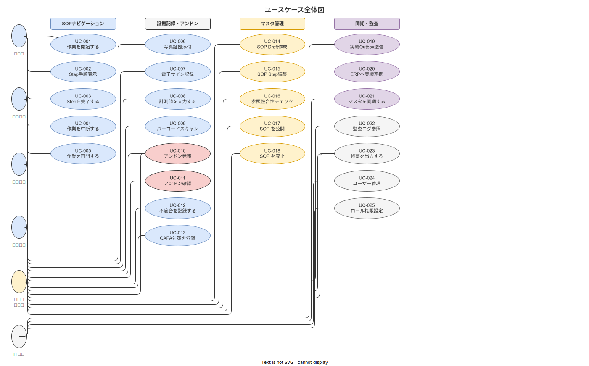

# 02 ユースケース総覧と関係図

本章の責務は、本システムの全ユースケースを一覧化し、アクター定義・UC 間の includes/extends 関係・UC ↔ FR 対応表を確定することである。本章は UC 記述の起点となる権威章であり、03〜07 章はここで確定した UC-ID・アクター定義を前提として記述する。

---

## 1. UC 一覧

本システムの全ユースケースを以下のとおり確定する。UC-001〜UC-022 の 22 件を ver1.0.0 でのスコープとする。

**図 1: ユースケース全体像（アクター関係・UC-001〜UC-022）**

> 原本: [`img/fig_usecase_overview.drawio`](img/fig_usecase_overview.drawio)

| UC-ID | ユースケース名 | 主アクター | 簡易説明 |
|---|---|---|---|
| UC-001 | 作業を開始する | 作業員 | タブレットで SOP を選択し工程→作業→Step の選択フローを経て作業を開始する |
| UC-002 | Step を完了する | 作業員 | ひとつの Step を完了する。ロックステップ制約と次 Step 解放条件を制御する |
| UC-003 | 条件分岐 Step を通過する | 作業員 | 条件分岐 Step で step_flow_rule の条件を評価し skip/goto/insert のいずれかで進む |
| UC-004 | カスタム Step を実行する | 作業員 | カスタム Step タイプ（JSON DSL 定義）の入力フォームを実行する |
| UC-005 | 多言語を切り替える | 作業員 | 表示言語を変更し承認済み多言語 SOP に切り替える |
| UC-006 | 写真証拠を取得する | 作業員 | クリティカルステップで写真を撮影・添付する |
| UC-007 | 測定値を取得する | 作業員 | 計測器から測定値を入力し USL/LSL バリデーションと校正期限チェックを受ける |
| UC-008 | QR スキャンで照合する | 作業員 | GS1 バーコード/QR で部品・ロットを照合する |
| UC-009 | 電子サインを付与する | 作業員・現場監督 | Step 完了サインまたは作業完了の監督確認サインを付与する |
| UC-010 | 作業を中断する | 作業員 | 作業途中で中断しプレースキーパーを記録する |
| UC-011 | 作業を再開する | 作業員 | 中断された作業を引き継いで再開し Welcome 画面でコンテキストを回復する |
| UC-012 | アンドン発報する | 作業員 | 品質・設備・安全上の異常をワンタップで発報する |
| UC-013 | 不適合を起票する | 作業員・現場監督 | 不適合・ヒヤリハット・Kaizen Teian を記録する |
| UC-014 | SOP を Draft 編集する | 品質担当（マスタ編集者） | 公開中の SOP を Draft に複製して編集する |
| UC-015 | 条件分岐 DSL を編集する | 品質担当（マスタ編集者） | ビジュアル DSL エディタで step_flow_rule の分岐ルールを設定する |
| UC-016 | マスタを Publish する | 品質担当（承認者） | Draft → under_review → approved → published 状態遷移で SOP を公開する |
| UC-017 | マスタをロールバックする | 品質担当（承認者） | Published 版を旧バージョンに戻す |
| UC-018 | 参照整合性をチェックする | システム | マスタ削除・廃止前に参照中レコードを検出し dry-run で影響範囲を提示する |
| UC-019 | 親機からマスタを取得する | システム・IT 担当 | READ-ONLY で親機（ERP/MES）からマスタデータを同期する |
| UC-020 | Outbox 経由で実績を送信する | システム | 作業完了記録を Outbox Pattern で親機に非同期送信する |
| UC-021 | 外部一意キーを解決する | システム | 親機のロット ID/製品コードを本システムの内部 ID に変換する |
| UC-022 | 通信断・縮退時に動作する | システム・作業員 | Wi-Fi 断線時のローカル動作継続と回復後の同期を行う |

**本節で確定した方針**
ver1.0.0 のユースケースは UC-001〜UC-022 の 22 件に確定する。
全 UC は 03〜07 章の固定フォーマットで記述し、本一覧との整合を維持する。
UC-ID は全 UC 横断一意の通し番号とし、カテゴリコードを含まない。

---

## 2. アクター定義

本システムのアクターを以下の 9 種類に確定する。「システム」はシステム内部の自動プロセスを表すアクターとして定義する。

| アクター名 | 種別 | 説明 | 主な UC |
|---|---|---|---|
| 作業員 | 人間アクター | 製造現場でタブレット端末を使用して SOP に従い作業を遂行する。RBAC の作業員ロールを持つ | UC-001〜UC-013 |
| 現場監督 | 人間アクター | 工程・作業員を管理し作業品質を確認する。監督確認サイン・アンドン受信・引継ぎ確認を担う。RBAC の現場監督ロールを持つ | UC-009, UC-011, UC-012, UC-013 |
| 品質担当（マスタ編集者） | 人間アクター | SOP の作成・改訂・承認を担う。管理 Web を主として使用する。RBAC の品質担当ロールを持つ | UC-014〜UC-018 |
| 品質担当（承認者） | 人間アクター | Draft 状態の SOP を審査し電子署名で承認・公開する。品質担当ロールの上位権限範囲として扱う | UC-016, UC-017 |
| 保全担当 | 人間アクター | 設備マスタ・計測器マスタ・校正証明書の管理を担う。RBAC の保全担当ロールを持つ | UC-018 |
| IT 担当 | 人間アクター | システム設定・連携モード管理・external_key_binding の管理を担う。RBAC の IT 担当ロールを持つ | UC-019, UC-021, UC-022 |
| 管理者 | 人間アクター | 全機能へのアクセス権を持つ管理者。RBAC の管理者ロールを持つ | 全 UC |
| 親機（ERP/MES） | 外部システムアクター | SAP・GENIOUS 等の基幹システム。REST API・Webhook でマスタデータを提供し実績データを受信する | UC-019, UC-020, UC-021 |
| システム（内部プロセス） | 内部システムアクター | バックグラウンドで動作する自動プロセス（Outbox 送信・マスタ同期・整合性チェック・Emergency Mode 起動等） | UC-018, UC-019, UC-020, UC-021, UC-022 |

**本節で確定した方針**
アクターは 9 種類（作業員・現場監督・品質担当 x2・保全担当・IT 担当・管理者・親機・システム）に確定する。
品質担当の「マスタ編集者」と「承認者」は同一 RBAC ロールの異なる操作権限範囲として扱う。
「システム（内部プロセス）」アクターを明示的に定義し、自動処理 UC での主アクターとして使用する。

---

## 3. includes/extends 関係

主要な UC 間の包含（includes）・拡張（extends）関係を以下に列挙する。

### 3-1. includes 関係（包含）

includes 関係は「基底 UC が必ず呼び出す UC」を表す。基底 UC は包含 UC なしに完了しない。

| 基底 UC | 包含する UC | 包含の理由 |
|---|---|---|
| UC-002（Step を完了する） | UC-006（写真証拠を取得する） | evidence_required が true の Step 完了には写真取得を必ず包含する |
| UC-002（Step を完了する） | UC-007（測定値を取得する） | input_type が numeric_input の Step 完了には測定値入力を必ず包含する |
| UC-002（Step を完了する） | UC-008（QR スキャンで照合する） | input_type が qr_scan の Step 完了にはスキャン照合を必ず包含する |
| UC-002（Step を完了する） | UC-009（電子サインを付与する） | signature タイプの Step 完了にはサイン付与を必ず包含する |
| UC-016（マスタを Publish する） | UC-009（電子サインを付与する） | approved 状態遷移には品質担当の電子サインを必ず包含する |
| UC-020（Outbox 経由で実績を送信する） | UC-022（通信断・縮退時に動作する） | 通信断中の実績はローカル蓄積を通じて UC-022 のコンテキストで送信される |

### 3-2. extends 関係（拡張）

extends 関係は「特定条件下のみ実行される UC」を表す。基底 UC は拡張 UC なしに完了できる。

| 拡張 UC | 拡張する基底 UC | 拡張条件 |
|---|---|---|
| UC-003（条件分岐 Step を通過する） | UC-002（Step を完了する） | step_flow_rule が存在し条件評価を実行する場合 |
| UC-004（カスタム Step を実行する） | UC-002（Step を完了する） | step_type が step_type_definition に登録されたカスタムタイプの場合 |
| UC-005（多言語を切り替える） | UC-001（作業を開始する） | 作業者プロファイルの言語設定と異なる言語で SOP を表示する場合 |
| UC-010（作業を中断する） | UC-002（Step を完了する） | 作業継続中に中断操作が発生した場合 |
| UC-011（作業を再開する） | UC-001（作業を開始する） | プレースキーパーが存在する work_interrupted 状態の作業を開始する場合 |
| UC-012（アンドン発報する） | UC-002（Step を完了する） | 作業中に異常を検知してアンドン操作を行う場合 |
| UC-013（不適合を起票する） | UC-002（Step を完了する） | 不適合・ヒヤリハット・Kaizen Teian 起票を行う場合 |
| UC-015（条件分岐 DSL を編集する） | UC-014（SOP を Draft 編集する） | Draft 編集中に step_flow_rule の設定を行う場合 |
| UC-018（参照整合性をチェックする） | UC-017（マスタをロールバックする） | ロールバック前に参照整合性チェックを実行する場合 |
| UC-021（外部一意キーを解決する） | UC-019（親機からマスタを取得する） | 受信マスタに未解決の外部一意キーが存在する場合 |

**本節で確定した方針**
includes 関係は基底 UC が完了するために必ず実行されるシナリオのみを対象とする。
extends 関係は条件を必ず明示し、「特定条件下のみ実行」の意味を保持する。
関係定義の変更は UC 記述章の変更管理ログと同期して行う。

---

## 4. UC ↔ FR 対応表

各 UC が使用する FR 一覧を確定する。対応表は本章が管理する権威テーブルであり、FR リスト（01 章）の「関連 UC」列と整合を維持する。

| UC-ID | UC 名 | 使用する主要 FR |
|---|---|---|
| UC-001 | 作業を開始する | FR-NV-001, FR-NV-004, FR-NV-013, FR-AU-001, FR-AU-004, FR-UI-003, FR-UI-004 |
| UC-002 | Step を完了する | FR-NV-002, FR-NV-003, FR-NV-005, FR-NV-011, FR-NV-012, FR-EV-001, FR-EV-007, FR-EV-008, FR-EV-009, FR-UI-002 |
| UC-003 | 条件分岐 Step を通過する | FR-NV-006, FR-MA-007 |
| UC-004 | カスタム Step を実行する | FR-NV-007, FR-MA-010 |
| UC-005 | 多言語を切り替える | FR-NV-008, FR-UI-001, FR-UI-008, FR-UI-009, FR-UI-010 |
| UC-006 | 写真証拠を取得する | FR-EV-002, FR-EV-007, FR-EV-001 |
| UC-007 | 測定値を取得する | FR-EV-003, FR-EV-006, FR-EV-011, FR-EV-012, FR-MA-004 |
| UC-008 | QR スキャンで照合する | FR-EV-004, FR-EV-001 |
| UC-009 | 電子サインを付与する | FR-EV-005, FR-EV-001, FR-AU-001 |
| UC-010 | 作業を中断する | FR-ST-001, FR-ST-002, FR-ST-006, FR-ST-011 |
| UC-011 | 作業を再開する | FR-ST-003, FR-ST-004, FR-ST-005 |
| UC-012 | アンドン発報する | FR-ST-007, FR-ST-008 |
| UC-013 | 不適合を起票する | FR-ST-009, FR-ST-010, FR-KZ-001, FR-KZ-002, FR-KZ-003, FR-KZ-004 |
| UC-014 | SOP を Draft 編集する | FR-MA-001, FR-MA-002, FR-MA-003, FR-MA-009, FR-MA-011, FR-MA-012, FR-MA-013, FR-MA-015 |
| UC-015 | 条件分岐 DSL を編集する | FR-MA-007 |
| UC-016 | マスタを Publish する | FR-MA-005, FR-MA-014, FR-MA-015, FR-AU-002 |
| UC-017 | マスタをロールバックする | FR-MA-006, FR-MA-015, FR-AU-002 |
| UC-018 | 参照整合性をチェックする | FR-MA-008, FR-MA-004 |
| UC-019 | 親機からマスタを取得する | FR-SY-001, FR-SY-006, FR-SY-007, FR-SY-008, FR-AU-003 |
| UC-020 | Outbox 経由で実績を送信する | FR-SY-002, FR-SY-005 |
| UC-021 | 外部一意キーを解決する | FR-SY-003 |
| UC-022 | 通信断・縮退時に動作する | FR-SY-004, FR-SY-009, FR-ST-012, FR-UI-005, FR-UI-007 |

**本節で確定した方針**
UC ↔ FR 対応表は本章が管理し、01 章 FR リストの「関連 UC」列との整合を維持する。
対応表の変更は UC 記述章・FR リストの両方を同時に更新することを必須とする。
FR を使用しない UC（対応 FR 未定義の UC）は設計不完全として扱い、対応 FR の定義を完了するまで実装に着手しない。

---

## 参照業界分析

### 必須

- [`90_業界分析/25_作業指示書とSOPの構造化・表現論.md`](../../../90_業界分析/25_作業指示書とSOPの構造化・表現論.md) — UC 分類の基礎となる SOP 構造・ライフサイクルの定義

### 関連

- [`90_業界分析/01_作業の定義と分類.md`](../../../90_業界分析/01_作業の定義と分類.md) — アクター定義の作業者分類根拠
- [`90_業界分析/26_多能工とスキル管理・作業者資格.md`](../../../90_業界分析/26_多能工とスキル管理・作業者資格.md) — アクター「作業員」の資格・スキル要件の根拠
- [`90_業界分析/30_国内製造業IT調達慣行とSI構造.md`](../../../90_業界分析/30_国内製造業IT調達慣行とSI構造.md) — 外部システムアクター「親機（ERP/MES）」の実態根拠
