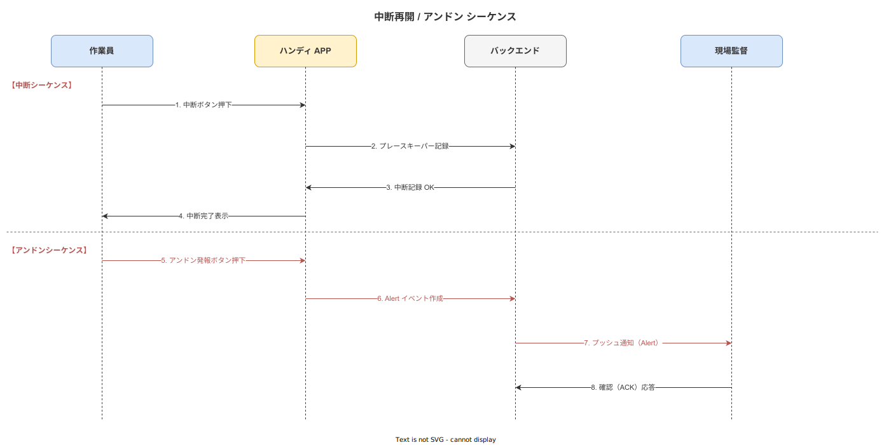

# 05 UC 記述_中断再開とアンドン

本章の責務は、中断・再開・アンドン発報・不適合起票に関わる UC-010〜UC-013 の 4 つのユースケースを固定フォーマットで記述することである。各 UC は Memory for Goals モデル・Resumption Lag・Post-Completion Error 防止の認知科学的設計根拠を踏まえて記述する。

---

## 1. ユースケース記述

**図 1: 中断・再開・アンドン発報シーケンス（UC-010〜UC-013）**

> 原本: [`img/fig_sequence_resume_andon.drawio`](img/fig_sequence_resume_andon.drawio)

### UC-010: 作業を中断する

| 項目 | 内容 |
|---|---|
| 目的 | 作業員が作業途中で中断操作を行い、プレースキーパー（現在の Step 位置・case_id・sop_version_id）を SQLite ローカルに保存する。次回再開時の位置保全を構造的に保証する |
| 主アクター | 作業員 |
| 副アクター | システム（work_interrupted イベント記録・プレースキーパー保存・Protection Window 起動・I-PASS 引継ぎメモ生成） |
| 事前条件 | UC-001 が完了し case_id が存在している。1 件以上の Step が完了または進行中である |
| 事後条件 | work_interrupted イベントが Append-only でイベントストアに記録されている。プレースキーパー（current_step_id・case_id・sop_version_id・interrupted_at）が SQLite ローカルに保存されている。Protection Window が 5 分間有効になっている |

**主シナリオ**
1. 作業員はナビゲーション画面のメニューから「作業を中断する」を選択する。または緊急割り込み（アンドン等）の発生により中断ダイアログが自動表示される
2. システムは中断確認ダイアログを表示し、中断理由種別（急な呼び出し・設備異常・材料待ち・シフト交代・その他）を選択させる（FR-ST-001）
3. 作業員は中断理由を選択し「中断」ボタンをタップする
4. システムは work_interrupted イベントを生成し Append-only でイベントストアに記録する。中断時の Step 番号・時刻・作業者 ID・中断理由種別を必須フィールドとして記録する（FR-ST-001）
5. システムはプレースキーパー（current_step_id・case_id・sop_version_id・interrupted_at・worker_id）を SQLite ローカルに保存する（FR-ST-002）
6. システムは Protection Window（5 分間の通知ミュートと画面ロック）を有効化する（FR-ST-011）
7. システムはシフト交代の場合に I-PASS 構造（状況概要・案件詳細・評価・未完課題・引継ぎ指示）の引継ぎメモを生成し電子署名付きで記録する（FR-ST-006）
8. タブレットは中断状態表示画面に移行する

**代替シナリオ**
- A1: クリティカルステップの途中で中断しようとした場合、システムは「クリティカルステップを完了してから中断することを推奨します」警告を表示する。強制中断は許容するが警告は必ず表示する
- A2: オフライン状態で中断した場合、システムは work_interrupted イベントを SQLite ローカルに保存し is_offline: true を設定する。同期回復後に自動送信する（FR-SY-002）
- A3: シフト交代による中断の場合、システムは次シフトの作業員にプッシュ通知（引継ぎメモの確認要求）を送信する（FR-ST-006）

**例外シナリオ**
- E1: プレースキーパーの SQLite 保存に失敗した場合、システムは「中断状態の保存に失敗しました。再試行してください」を表示しリトライを促す。ローカル保存なしでの中断完了を禁止する（FR-ST-002）
- E2: 複数の未完了 case_id が同一端末に存在する状態で中断しようとした場合、システムは「複数の作業が進行中です。対象作業を選択してください」を表示し対象を明示させる
- E3: デバイスのバッテリーが 5% 以下の場合、システムは「バッテリーが低下しています。中断しますか？」自動プロンプトを表示し緊急中断を促す

**関連要件 ID**
- FR-ST-001, FR-ST-002, FR-ST-006, FR-ST-011

---

### UC-011: 作業を再開する

| 項目 | 内容 |
|---|---|
| 目的 | 中断済みの作業を引き継いで再開する。Welcome 画面でコンテキスト（前回 Step サマリ・経過時間・警告メッセージ）を作業員に提示し、Post-Completion Error を構造的に防止する。別の作業員が引き継いで再開する場合（シフト交代）も同一フローを適用する |
| 主アクター | 作業員 |
| 副アクター | システム（プレースキーパー取得・Welcome 画面生成・ロックステップ強制復帰・Resumption Cue 表示） |
| 事前条件 | SQLite ローカルにプレースキーパーが存在している（UC-010 完了済み）。再開作業員が JWT 認証済みであり、当該工程の資格を持つ |
| 事後条件 | work_resumed イベントが Append-only でイベントストアに記録されている。ロックステップが最後の未完 Step を指している。Welcome 画面が作業員に表示されている |

**主シナリオ**
1. 作業員は UC-001 の作業開始フローで工程・作業を選択する。システムはプレースキーパーに中断済み作業が存在することを検知する（FR-ST-003）
2. システムは「中断中の作業があります。再開しますか？」確認ダイアログを表示する（UC-001 A3 からの分岐）
3. 作業員が「再開」を選択した場合、システムは Welcome 画面を表示する（FR-ST-003）。表示内容は「作業名・工程名・ロット番号」「現在の Step 番号と Step 内容サマリ」「中断前の直前 3 Step 完了サマリ」「中断からの経過時間」
4. 中断から 30 分以上経過している場合、システムはクリティカルフラグ付き完了済み Step の目視再確認プロンプトを表示する（FR-ST-005）。スキップは理由入力を必須とする
5. システムは Resumption Cue として直前 Step で入力した数値・写真のサムネイルを再表示する。作業員の記憶回復を補助する
6. 作業員は Welcome 画面の内容を確認し「作業を再開」ボタンをタップする
7. システムは work_resumed イベントを Append-only で記録する。ロックステップが最後の未完 Step（FR-ST-004 の Post-Completion Error 防止制御）を指す
8. システムは未完の Step から通常のナビゲーション（UC-002）を再開する

**代替シナリオ**
- A1: シフト交代で別の作業員が引き継ぐ場合、システムは前作業員の I-PASS 引継ぎメモを Welcome 画面に表示する。引継ぎメモの確認操作を再開前の必須ステップとする（FR-ST-006）
- A2: 再開作業員が中断作業員と異なるスキルレベルを持つ場合、システムはスキルレベルに応じた表示モードを適用する（FR-NV-004）
- A3: 中断時点のSOP が改訂されている場合、システムは「SOP が改訂されています。新版での再開は許可されていません。旧版で完了させてください」を表示し旧版での完了を強制する（ALCOA+ Consistent 原則）

**例外シナリオ**
- E1: プレースキーパーの読み込みに失敗した場合、システムは「中断状態の復元に失敗しました。管理者に連絡してください」を表示し中断レコードの手動確認フローへ誘導する
- E2: プレースキーパーに記録された case_id が存在しない場合（データ不整合）、システムはエラーログを記録し管理者に通知する。新規作業として開始するか否かを作業員に選択させる
- E3: 中断から 24 時間以上経過している場合、システムは「長時間中断です。管理者の確認が必要です」を表示し管理者の承認操作を再開の前提条件とする

**関連要件 ID**
- FR-ST-003, FR-ST-004, FR-ST-005, FR-ST-006, FR-NV-002, FR-NV-004

---

### UC-012: アンドン発報する

| 項目 | 内容 |
|---|---|
| 目的 | 作業員が品質異常・設備異常・安全異常・応援要請をワンタップで発報する。発報時刻・作業者 ID・対象 Step を自動記録し、現場監督・IT 担当に即座に通知する |
| 主アクター | 作業員 |
| 副アクター | システム（andon_triggered イベント記録・プッシュ通知送信）・現場監督（通知受信） |
| 事前条件 | 作業員が JWT 認証済みである。ナビゲーション画面が表示中である（作業中・中断中どちらでも発報可能とする） |
| 事後条件 | andon_triggered イベントが Append-only でイベントストアに記録されている。発報種別・緊急度・対象 Step が記録されている。現場監督にプッシュ通知が送信されている |

**主シナリオ**
1. 作業員はナビゲーション画面の常設アンドンボタンをタップする。システムはアンドン発報種別選択ダイアログを表示する（FR-ST-007）。選択肢は「品質異常」「設備異常」「安全異常」「応援要請」の 4 種別とする
2. 作業員は該当する種別を選択する
3. システムは緊急度選択（高/中/低）と状況コメント入力フィールドを表示する（コメントは任意）
4. 作業員は緊急度を選択し「発報」ボタンをタップする
5. システムは andon_triggered イベントを生成し Append-only でイベントストアに記録する。発報種別・緊急度・対象 Step（current_step_id）・発報時刻・作業者 ID を必須フィールドとして記録する（FR-ST-007）
6. システムは現場監督および IT 担当の登録デバイスにプッシュ通知を送信する（FR-ST-008）。通知内容は「発報種別・緊急度・発報者名・工程名・発報時刻」
7. 作業員の画面に「アンドンを発報しました」確認メッセージを表示する
8. 作業員は現場監督の到着まで作業を一時停止するか継続するかを判断する（システムは強制停止しない）

**代替シナリオ**
- A1: 緊急度「高」かつ安全異常の場合、システムは全作業員タブレットに一斉警報通知を送信する（工場内全端末へのブロードキャスト）
- A2: アンドン発報後に現場監督が「対応完了」を入力した場合、システムは andon_resolved イベントを記録し発報中の警告バナーを解除する
- A3: コメントに「ライン停止要求」が含まれる場合、システムは追加確認プロンプト（「ラインを停止しますか？」）を表示し現場監督への緊急確認を促す

**例外シナリオ**
- E1: プッシュ通知の配信に失敗した場合（オフライン・通知サービス障害等）、システムは通知配信失敗を管理者アラートとして記録する（FR-ST-008）。アンドンイベント自体はローカルに記録し同期回復後に送信する
- E2: 通信断絶中にアンドン発報した場合、システムはローカルで andon_triggered イベントを記録し is_offline: true を設定する。画面上に「オフラインです。口頭での報告も行ってください」を表示する
- E3: 5 分以内に同一種別のアンドン発報が 3 件を超えた場合（誤操作連打の可能性）、システムは「連続発報を検知しました。意図的な発報ですか？」確認プロンプトを表示する

**関連要件 ID**
- FR-ST-007, FR-ST-008

---

### UC-013: 不適合を起票する

| 項目 | 内容 |
|---|---|
| 目的 | 作業員または現場監督が不適合・ヒヤリハット・Kaizen Teian を記録する。4M（Man/Machine/Material/Method）と Environment の 5 軸を等価提示し複数選択を許容することで Man 軸への責任過収束を防止する |
| 主アクター | 作業員・現場監督 |
| 副アクター | システム（nonconformance_filed イベント記録・CAPA フェーズ開始・Kaizen Teian 記録） |
| 事前条件 | 起票者が JWT 認証済みである。起票の発端（UC-002 の Step 不合格・UC-012 のアンドン後・自主発見）が存在している |
| 事後条件 | nonconformance_filed または kaizen_filed イベントが Append-only でイベントストアに記録されている。CAPA フェーズが「起票」状態で開始されている。ISO 9001:2015 §10.2 に準拠した不適合レコードが生成されている |

**主シナリオ**
1. 起票者はナビゲーション画面または管理 Web から「不適合を起票する」を選択する（または UC-002 の Step 不合格から自動遷移する）
2. システムは起票フォームを表示する。起票種別（品質不適合・安全ヒヤリハット・Kaizen Teian）を選択させる（FR-ST-009, FR-KZ-001, FR-KZ-002）
3. 起票者は状況の写真を添付する（任意だが推奨）。システムは添付写真の SHA-256 ハッシュを記録する（FR-EV-002）
4. 起票者は状況のテキスト説明を入力する（必須）
5. システムは 4M（Man/Machine/Material/Method）と Environment の 5 軸を等価な選択肢として提示する（FR-ST-009）。複数選択を許容する。「Man」単独選択への誘導は設けない
6. 起票者は該当する軸を 1 件以上選択する
7. 起票者は「起票」ボタンをタップする。システムは nonconformance_filed イベントを Append-only でイベントストアに記録する（FR-EV-001）。起票時刻・起票者 ID・案件番号を自動付与する
8. システムは CAPA フェーズを「起票」状態で開始する（FR-KZ-003）。品質担当への通知を送信する

**代替シナリオ**
- A1: Kaizen Teian として起票する場合、システムは kaizen_filed イベントとして別途記録する（FR-KZ-001）。CAPA フェーズは不適合とは別のワークフローを適用する
- A2: ヒヤリハットとして起票する場合、システムは「実害なし・潜在リスク」フラグを付与して記録する（FR-KZ-002）
- A3: 品質不適合で起票後に CAPA フェーズが「原因分析」に進む場合、システムは Why-Why 分析フォーム（FR-KZ-004）を提供する

**例外シナリオ**
- E1: テキスト説明が未入力の状態で起票ボタンをタップした場合、システムは「説明を入力してください」バリデーションエラーを表示する
- E2: 起票フォームの送信がサーバーエラーで失敗した場合、システムは起票データを SQLite ローカルにドラフト保存し「後で送信します」メッセージを表示する。同期回復後に自動送信する
- E3: 5 軸がすべて未選択の状態で起票しようとした場合、システムは「原因軸を 1 つ以上選択してください」バリデーションエラーを表示する

**関連要件 ID**
- FR-ST-009, FR-ST-010, FR-KZ-001, FR-KZ-002, FR-KZ-003, FR-KZ-004, FR-EV-001, FR-EV-002

---

## 参照業界分析

### 必須

- [`90_業界分析/20_作業中断・割込み・再開の認知科学.md`](../../../90_業界分析/20_作業中断・割込み・再開の認知科学.md) — Resumption Lag・Memory for Goals モデル・Post-Completion Error・プレースキーパー・Resumption Cue（UC-010, UC-011）
- [`90_業界分析/28_不適合と手順改訂のフィードバックループ.md`](../../../90_業界分析/28_不適合と手順改訂のフィードバックループ.md) — CAPA フレームワーク・4M 分析・Why-Why 分析（UC-013）

### 関連

- [`90_業界分析/38_災害・BCP・緊急時手順と作業継続.md`](../../../90_業界分析/38_災害・BCP・緊急時手順と作業継続.md) — I-PASS 引継ぎメモ・Emergency Mode（UC-010, UC-011）
- [`90_業界分析/18_現場HCIと作業者インターフェース.md`](../../../90_業界分析/18_現場HCIと作業者インターフェース.md) — アンドン発報のワンタップ操作・グローブ操作対応（UC-012）
