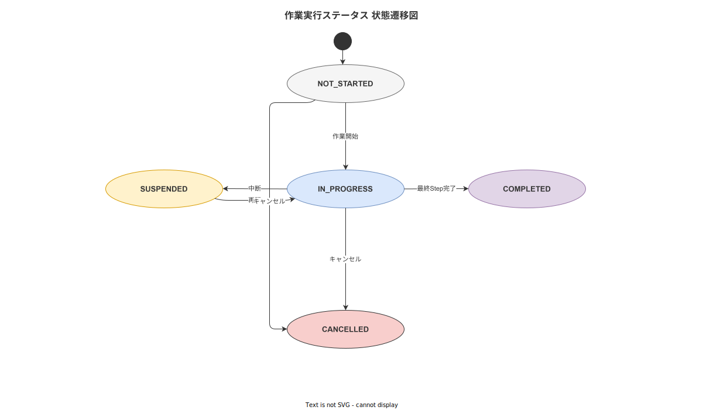
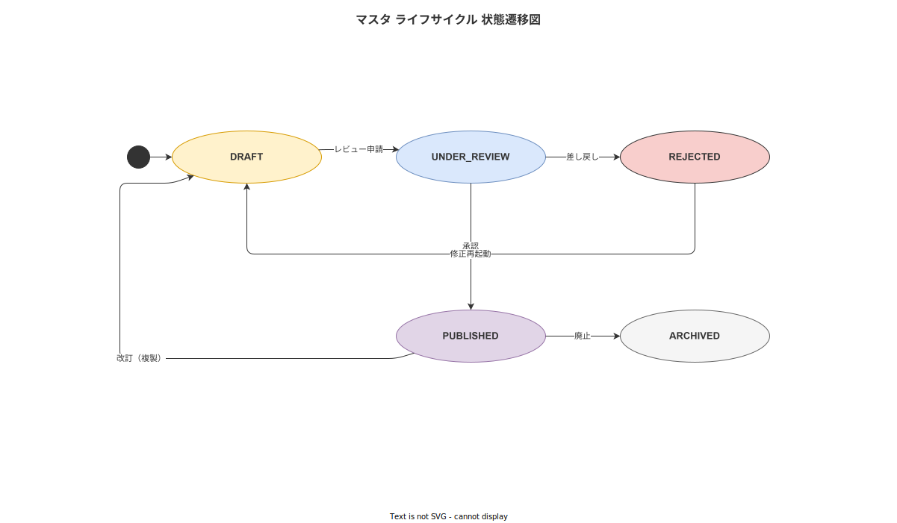
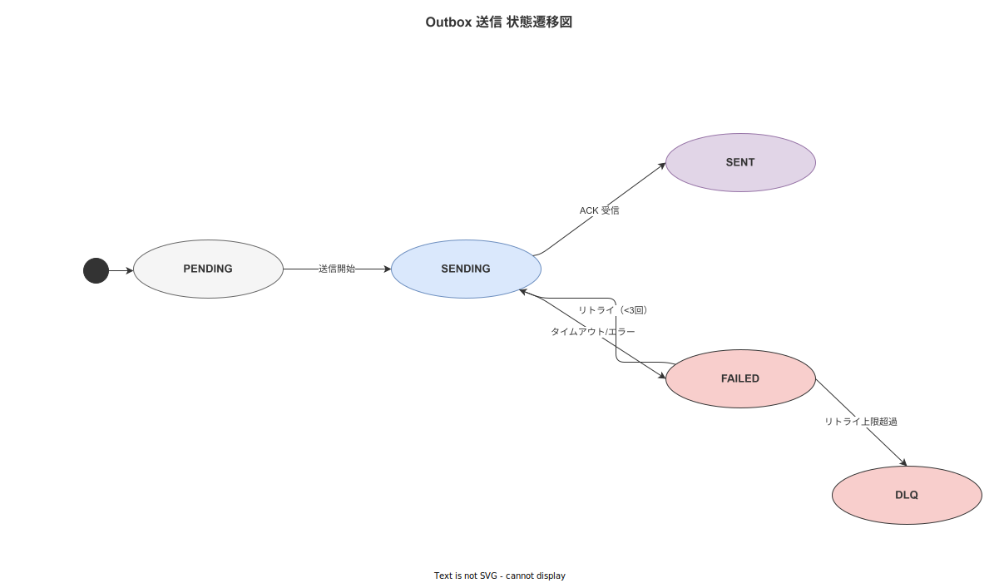
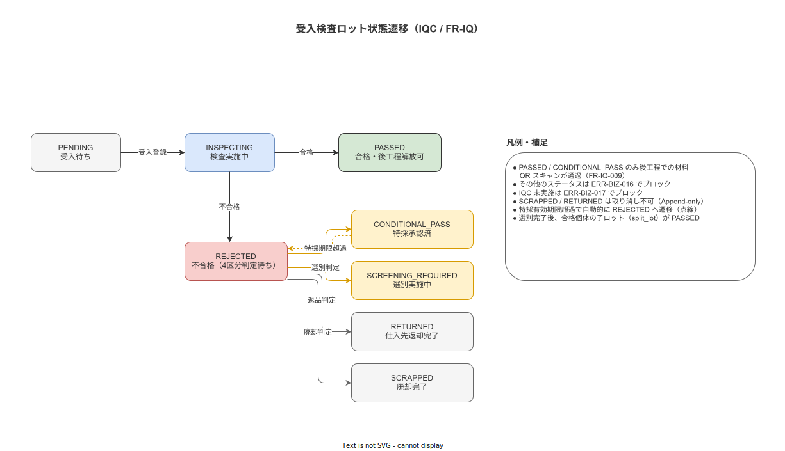

# 11 状態遷移定義

本章は、作業実行ステータス・マスタライフサイクル・Outbox 送信状態・不適合・CAPA ステータス・アンドン・割込み状態の 5 領域において、有効なステータス遷移・各遷移のトリガー・事後条件を確定する。実装担当者はこれらの状態遷移を状態機械として実装し、定義外の遷移を API レベルで拒否する。

---

## 1. 作業実行ステータス遷移

**図 1: 作業実行ステータス遷移図**

> 原本: [`img/fig_state_execution.drawio`](img/fig_state_execution.drawio)

### 1-1. ステータス定義

| ステータス | 意味 |
|---|---|
| NOT_STARTED | 作業指示が発行されたが、まだ作業員が着手していない |
| IN_PROGRESS | 作業員が作業を実行中である |
| SUSPENDED | 作業員が作業を一時中断した状態。ローカルキューは保持 |
| COMPLETED | 全 Step が完了または正当なスキップで完了した |
| CANCELLED | 作業指示が取り消された |

### 1-2. 遷移マトリクス

| 遷移元 | 遷移先 | トリガー | 事後条件 |
|---|---|---|---|
| NOT_STARTED | IN_PROGRESS | 作業員が「作業開始」操作を実行する（work_started イベント）| WorkExecution レコードが生成される。started_at・worker_id・terminal_id・sop_version_id が固定される |
| IN_PROGRESS | SUSPENDED | 作業員が「中断」操作を行う（work_interrupted イベント）| work_interrupted イベントに中断理由・中断時の Step 位置が記録される |
| SUSPENDED | IN_PROGRESS | 作業員が「再開」操作を行う（work_resumed イベント）| work_resumed イベントが記録される。中断前の Step 位置から再開する |
| IN_PROGRESS | COMPLETED | 全 Step 完了後に「作業完了」操作を実行する（work_completed イベント）| BR-BUS-005 の全 Step 完了チェックを通過。completed_at が記録される。電子サイン必須設定の場合は ElectronicSign が付与される |
| IN_PROGRESS | CANCELLED | 現場監督または管理者が作業指示を取り消す | work_cancelled イベントに取消者 ID・取消理由・取消時の Step 位置が記録される。Append-only のため物理削除なし |
| SUSPENDED | CANCELLED | 同上 | 同上 |

### 1-3. 禁止遷移

| 禁止される遷移 | 理由 |
|---|---|
| COMPLETED → IN_PROGRESS | 完了済み作業の再実行は新規作業指示として発行する |
| COMPLETED → SUSPENDED | 完了後の中断は論理的に無効 |
| CANCELLED → IN_PROGRESS | 取消後の再開は新規作業指示として発行する |
| NOT_STARTED → COMPLETED | 着手なしの完了は不正操作 |

**本節で確定した方針**
- 作業実行ステータスを NOT_STARTED / IN_PROGRESS / SUSPENDED / COMPLETED / CANCELLED の 5 状態で確定し、定義外の遷移を API レベルで拒否する。
- COMPLETED 状態からのいかなる逆遷移も禁止し、完了後の修正は訂正イベントで対応することを確定する。
- SUSPENDED 状態でもローカルキューのイベントは保持され、再開時に同 Step から再開することを確定する。

---

## 2. マスタライフサイクル遷移

**図 2: マスタライフサイクル遷移図（DRAFT → UNDER_REVIEW → PUBLISHED → ARCHIVED）**

> 原本: [`img/fig_state_master_lifecycle.drawio`](img/fig_state_master_lifecycle.drawio)

### 2-1. ステータス定義

| ステータス | 意味 |
|---|---|
| DRAFT | マスタ編集者が作成・編集中。作業員には表示されない |
| UNDER_REVIEW | 品質担当・現場監督による承認プロセス中 |
| PUBLISHED | 有効化された版。作業指示発行に使用可能 |
| ARCHIVED | 廃止された版。新規作業指示には使用不可。過去実績からの参照は可能 |

### 2-2. 遷移マトリクス

| 遷移元 | 遷移先 | トリガー | 事前条件・事後条件 |
|---|---|---|---|
| （新規）| DRAFT | マスタ編集者が「新規作成」または「新版作成」操作を行う | 既存 PUBLISHED 版からの「新版作成」の場合、既存版の内容がコピーされる |
| DRAFT | UNDER_REVIEW | マスタ編集者が「承認申請」操作を行う | 事前条件: タイトル・改訂理由が必須入力済み。DRAFT から UNDER_REVIEW への遷移で編集者は内容変更不可になる |
| UNDER_REVIEW | DRAFT | 品質担当が「差し戻し」操作を行う | 差し戻し理由が必須。マスタ編集者への通知が送信される |
| UNDER_REVIEW | PUBLISHED | 品質担当が「承認」操作を行う（電子署名必須）| 事前条件: 品質担当ロール（BR-BUS-042）。Effective Date の設定が必須。承認者 ID・approved_at がレコードに記録される |
| PUBLISHED | ARCHIVED | 新版が PUBLISHED になる、または管理者が明示的に廃止する | 事後条件: invalidation_date が設定される。ARCHIVED 版を参照する既存 WorkExecution は引き続き有効。新規 WorkExecution には使用不可 |
| ARCHIVED | DRAFT | 品質担当または管理者が「再活性化」操作を行う（禁止）| 禁止遷移。廃止後の再活性化は新版作成によってのみ対応する |

### 2-3. 版番号規則

版管理レコードの version_number は単調増加の整数とする。メジャー改訂（手順の構造変更: Step の追加・削除・順序変更）の場合はメジャー番号をインクリメントし、マイナー改訂（誤字脱字・明確化のみ）の場合はマイナー番号をインクリメントする。改訂種別（MAJOR / MINOR）は版レコードの revision_type フィールドに記録する。

**本節で確定した方針**
- SOP マスタのライフサイクルを DRAFT / UNDER_REVIEW / PUBLISHED / ARCHIVED の 4 状態で確定し、承認なしの PUBLISHED 遷移を禁止する。
- ARCHIVED 版からの再活性化を禁止し、廃止後の変更は新版作成のみを認める設計を確定する。
- 承認操作に品質担当ロールの電子署名を必須とし（BR-BUS-013 / BR-BUS-042）、ALCOA+ Original・Attributable 原則の実装を確定する。

---

## 3. Outbox 送信遷移

**図 3: Outbox 送信状態遷移図（PENDING → SENT / DLQ）**

> 原本: [`img/fig_state_outbox.drawio`](img/fig_state_outbox.drawio)

### 3-1. ステータス定義

| ステータス | 意味 |
|---|---|
| PENDING | タブレットのローカルキューまたはサーバーの Outbox テーブルに格納されており、送信待ち |
| SENDING | 送信処理が進行中 |
| SENT | 送信先（親機または Outbox Consumer）が受理を確認した |
| FAILED | 送信が失敗した（タイムアウト・エラー応答など）|
| RETRY | FAILED から自動リトライ処理が開始された |
| DLQ | 規定リトライ回数を超過し、Dead Letter Queue に移動した |

### 3-2. 遷移マトリクス

| 遷移元 | 遷移先 | トリガー | タイムアウト・条件 |
|---|---|---|---|
| （新規）| PENDING | イベントが Append-only ストアに記録された直後、Outbox テーブルにレコードが挿入される | トランザクション内でのアトミック挿入を必須とする |
| PENDING | SENDING | Outbox Consumer が PENDING レコードをポーリングで取得し、送信処理を開始する | Consumer は送信開始時に SENDING に更新し、処理を継続する |
| SENDING | SENT | 送信先が HTTP 2xx を返す | 冪等キー（event_id）で重複送信を検知した場合も SENT として処理 |
| SENDING | FAILED | タイムアウト（30 秒）または HTTP 4xx/5xx が返った場合 | 4xx の場合は内容を確認し、恒久エラーとして DLQ に移動する場合がある |
| FAILED | RETRY | 自動リトライスケジューラが FAILED レコードを取得する | リトライ間隔は指数バックオフ（初回 1 分・上限 60 分）とする |
| RETRY | SENDING | リトライ処理が送信を開始する | SENDING と同じ遷移ルール |
| RETRY | DLQ | リトライ回数が上限（5 回）を超過した場合 | DLQ 移動時に IT 担当・管理者に通知を送信する |
| DLQ | PENDING | IT 担当・管理者が手動でリキュー操作を行う | 操作者 ID・操作日時が記録される |

**本節で確定した方針**
- Outbox 遷移を PENDING / SENDING / SENT / FAILED / RETRY / DLQ の 6 状態で確定し、Exactly-once セマンティクスを冪等キーで実装する。
- リトライは指数バックオフ（初回 1 分・上限 60 分・上限 5 回）とし、DLQ 移動時の通知と手動リキュー機能を確定する。
- Outbox テーブルへの挿入はイベント記録と同一トランザクション内でアトミックに実行することを確定する。

---

## 4. 不適合・CAPA ステータス遷移

### 4-1. ステータス定義

| ステータス | 意味 |
|---|---|
| OPEN | 不適合・CAPA が起票された初期状態 |
| INVESTIGATING | 根本原因分析が進行中 |
| CORRECTIVE_ACTION | 是正処置の実施が進行中 |
| VERIFICATION | 是正処置後の効果確認が進行中 |
| CLOSED | 効果確認が完了し、品質担当の電子署名でクローズされた |

### 4-2. 遷移マトリクス

| 遷移元 | 遷移先 | トリガー | 事前条件・事後条件 |
|---|---|---|---|
| （新規）| OPEN | 作業員または品質担当が不適合報告・Kaizen から CAPA を起票する | CAPA ID・起票者 ID・timestamp の 3 属性が必須 |
| OPEN | INVESTIGATING | 品質担当が担当者アサインと根本原因分析開始を記録する | 担当者・分析手法（Why-Why / 4M）が入力済みであること |
| INVESTIGATING | CORRECTIVE_ACTION | 品質担当が根本原因特定を記録し、是正処置計画を登録する | 是正処置内容・担当者・期限が設定済みであること |
| CORRECTIVE_ACTION | VERIFICATION | 担当者が是正処置の完了を記録する | 処置完了日・担当者 ID が記録される |
| VERIFICATION | CLOSED | 品質担当が効果確認完了・電子署名操作を行う（BR-BUS-013）| 電子署名が正常に付与されること。起票者に採否通知が送信される |
| CLOSED → OPEN | 品質担当が「再オープン」操作を行う（再発確認等）| 再オープン理由の必須入力。再オープン操作が監査ログに記録される |

### 4-3. Kaizen Teian のステータス

Kaizen Teian は独自の単純なステータスで管理する。SUBMITTED（起票）→ UNDER_REVIEW（品質担当が確認中）→ ADOPTED（採用・CAPA 昇格）/ REJECTED（却下）の 3 状態とする。REJECTED の場合も起票者に理由を通知することを必須とする。

**本節で確定した方針**
- 不適合・CAPA のステータスを OPEN / INVESTIGATING / CORRECTIVE_ACTION / VERIFICATION / CLOSED の 5 状態で確定し、計画 09 章の 4 段階フィードバックループを状態遷移として実装する。
- CLOSED → OPEN の再オープン遷移を許容し、再発時の対応を保証する。再オープン理由の必須入力を確定する。
- Kaizen Teian のステータスを SUBMITTED / UNDER_REVIEW / ADOPTED / REJECTED の 4 状態で確定し、REJECTED 時も起票者への理由通知を必須とする。

---

## 5. アンドン・割込み状態

### 5-1. ステータス定義

| ステータス | 意味 |
|---|---|
| IDLE | 通常稼働状態。アンドン未発報 |
| ALERTING | 作業員がアンドンを発報した。未対応状態 |
| ACKNOWLEDGED | 現場監督が発報を確認した（対応中）|
| RESOLVED | 現場監督・保全担当が問題を解消し、クローズした |

### 5-2. 遷移マトリクス

| 遷移元 | 遷移先 | トリガー | 事後条件 |
|---|---|---|---|
| IDLE | ALERTING | 作業員が「アンドン発報」操作を行う（andon_triggered イベント）| 発報種別・緊急度・自由テキストが記録される。現場監督に即時通知が配信される |
| ALERTING | ACKNOWLEDGED | 現場監督が「確認」操作を行う | acknowledged_at・confirmer_id が記録される。作業員に「確認されました」通知 |
| ACKNOWLEDGED | RESOLVED | 現場監督または保全担当が「解決」操作を行う | 解決内容・解決者 ID・resolved_at が記録される。IDLE に戻る。作業員に解決通知 |
| ALERTING | RESOLVED | 作業員または現場監督が誤発報として即時解決操作を行う | 誤発報理由が必須入力 |
| RESOLVED | ALERTING | 同一工程で新たなアンドン発報が起票される | 各アンドンは独立したレコードとして管理 |

**本節で確定した方針**
- アンドン・割込み状態を IDLE / ALERTING / ACKNOWLEDGED / RESOLVED の 4 状態で確定し、発報・確認・解決の各ステップにタイムスタンプと担当者 ID を必須とする。
- ALERTING 状態での現場監督への即時通知を必須とし、未対応アンドンの放置を可視化する設計を確定する。
- 誤発報の即時解決を許容し、その場合の誤発報理由必須入力を確定する。

---

## 6. 受入検査ロット状態遷移（IQC）

**図 4: 受入検査ロット（IQC）状態遷移図**

> 原本: [`img/fig_state_iqc_lot.drawio`](img/fig_state_iqc_lot.drawio)

### 6-1. ステータス定義

`lots.qc_status` で管理する受入検査ロットの状態を以下のとおり確定する（2026-05-18 新設）。

| ステータス | 意味 |
|---|---|
| PENDING | 受入登録済みだが検査未着手 |
| INSPECTING | サンプリング実施中（測定値入力中） |
| PASSED | AQL 合格・後工程での使用可能状態 |
| CONDITIONAL_PASS | 特採承認済み・後工程使用可（警告バナー強制表示） |
| SCREENING_REQUIRED | 選別判定中（全数選別完了まで後工程使用不可） |
| REJECTED | 不合格（後工程での使用不可） |
| SCRAPPED | 廃却完了（履歴のみ） |
| RETURNED | 仕入先返却完了（履歴のみ） |

### 6-2. 遷移マトリクス

| 遷移元 | 遷移先 | トリガー | 事後条件 |
|---|---|---|---|
| — | PENDING | 受入登録（FR-IQ-001）| `incoming_inspections` レコード生成。`lots.qc_status = PENDING` |
| PENDING | INSPECTING | 検査員がサンプリング指示を受け取り測定値入力を開始する | `incoming_inspections.started_at` 記録 |
| INSPECTING | PASSED | AQL 自動判定で不良数 ≤ Ac（FR-IQ-005）| `lots.qc_status = PASSED`。後工程ハードゲート通過可 |
| INSPECTING | REJECTED | AQL 自動判定で不良数 ≥ Re（FR-IQ-005）| `lots.qc_status = REJECTED`。品質担当に 4 区分判定要求を通知 |
| REJECTED | CONDITIONAL_PASS | 品質担当が特採承認電子サインで確定（FR-IQ-007）| `lots.qc_status = CONDITIONAL_PASS`。`concession_approvals` に Append-only 記録 |
| REJECTED | SCREENING_REQUIRED | 品質担当が選別（SCREENING）判定を確定（FR-IQ-006）| `lots.qc_status = SCREENING_REQUIRED`。選別 SOP 指示 |
| REJECTED | RETURNED | 品質担当が返品（REJECT）判定を確定し返品処理完了（FR-IQ-012）| `lots.qc_status = RETURNED`。`return_to_vendor_records` 記録 |
| REJECTED | SCRAPPED | 品質担当が廃却判定を確定し廃却処理完了 | `lots.qc_status = SCRAPPED`。`scrap_records` 記録 |
| SCREENING_REQUIRED | PASSED（子ロット） | 選別完了後に合格個体の子ロット（split_lot）を発行（FR-IQ-011）| 子ロット `lots.qc_status = PASSED`、親ロットは SCREENING_REQUIRED のまま |
| CONDITIONAL_PASS | REJECTED | 特採有効期限超過 | CFG-023 期限超過バッチで自動更新。再特採は新規申請 |

### 6-3. 禁止遷移

| 禁止される遷移 | 理由 |
|---|---|
| PASSED → PENDING / INSPECTING / REJECTED | 合格後の再検査は不要。問題が見つかった場合は新たな不適合として起票 |
| SCRAPPED → いずれの状態 | 廃却は取り消し不可 |
| RETURNED → いずれの状態 | 返却は取り消し不可 |

**本節で確定した方針**
受入検査ロット状態を PENDING / INSPECTING / PASSED / CONDITIONAL_PASS / SCREENING_REQUIRED / REJECTED / SCRAPPED / RETURNED の 8 状態で確定する（2026-05-18 新設）。
PASSED・CONDITIONAL_PASS 以外のロットは FR-IQ-009 の API ハードゲートで後工程使用をブロックすることを確定する。
SCRAPPED・RETURNED 状態からの逆遷移を設計上禁止することを確定する。

---

## 7. リワーク状態遷移

**図 5: リワーク状態遷移図（PENDING_DISPOSITION → CLOSED_xx）**

> 原本: [`img/fig_state_rework.drawio`](img/fig_state_rework.drawio)

### 7-1. ステータス定義

`reworks.status` で管理するリワーク状態を以下のとおり確定する（2026-05-18 新設）。§4「不適合・CAPA 状態遷移」との責務分離を維持し、両者は `reworks.related_capa_id` で疎結合に連携する。

| ステータス | 意味 |
|---|---|
| PENDING_DISPOSITION | 不適合起票直後。MRB（ディスポジション）判定待ち |
| DISPOSITION_DECIDED | 二者電子サインによるディスポジション確定済み。リワーク作業未着手 |
| REWORK_IN_PROGRESS | リワーク SOP 実行中（新 case_id が採番済み） |
| REWORK_COMPLETED | リワーク SOP 完了。再検査待ち |
| VERIFICATION_IN_PROGRESS | 再検査 SOP 実行中 |
| CLOSED_OK_RELEASE | 再検査合格 → 出荷可能状態 |
| CLOSED_DOWNGRADE | B 級品として出荷可能 |
| CLOSED_SCRAP | 廃却完了 |
| CLOSED_RETURN | 仕入先返却完了 |
| RE_REWORK_NEEDED | 再検査不合格 → 再度ディスポジション判定が必要（PENDING_DISPOSITION への前進遷移） |

### 7-2. 遷移マトリクス

| 遷移元 | 遷移先 | トリガー | 事後条件 |
|---|---|---|---|
| — | PENDING_DISPOSITION | 不適合起票（FR-ST-009）後にディスポジション要求 | `reworks` レコード生成。`nonconformities.disposition_id` が紐付く |
| PENDING_DISPOSITION | DISPOSITION_DECIDED | 品質担当 + 現場監督の二者電子サイン完了（FR-ST-013）| `dispositions` に Append-only 記録。rework_type 確定 |
| DISPOSITION_DECIDED | REWORK_IN_PROGRESS | 作業員が着手宣言（work_started イベント、新 case_id）| `reworks.rework_case_id` に新 case_id を記録 |
| REWORK_IN_PROGRESS | REWORK_COMPLETED | リワーク SOP 全 Step 完了・電子サイン（FR-EV-014 両証拠必須）| `reworks.completed_at` 記録。修正品 QR ラベル自動発行 |
| REWORK_COMPLETED | VERIFICATION_IN_PROGRESS | 再検査者（≠ リワーク実施者）が修正品 QR スキャン（FR-NV-015）| 再検査 case_id が採番される |
| VERIFICATION_IN_PROGRESS | CLOSED_OK_RELEASE | 再検査 OK 電子サイン（FR-EV-005）| `rework_verifications.verdict = OK` 記録 |
| VERIFICATION_IN_PROGRESS | CLOSED_DOWNGRADE | 再検査 DOWNGRADE 電子サイン | B 級品記録 |
| VERIFICATION_IN_PROGRESS | RE_REWORK_NEEDED | 再検査不合格電子サイン | `reworks.status = RE_REWORK_NEEDED`（CFG-026 上限 3 回を超えた場合は SCRAP 強制提案）|
| VERIFICATION_IN_PROGRESS | CLOSED_SCRAP | SCRAP_AFTER_REWORK 電子サイン | 廃却処理へ |
| RE_REWORK_NEEDED | PENDING_DISPOSITION | 新たなディスポジション判定が開始される | 逆遷移ではなく前進遷移として扱う |
| DISPOSITION_DECIDED | CLOSED_SCRAP | ディスポジション SCRAP 確定・廃却処理完了（FR-EV-015）| `scrap_records` Append-only 記録 |
| DISPOSITION_DECIDED | CLOSED_RETURN | ディスポジション RETURN_TO_VENDOR 確定・返却処理完了（FR-EV-015）| `return_to_vendor_records` Append-only 記録 |

### 7-3. 禁止遷移

| 禁止される遷移 | 理由 |
|---|---|
| CLOSED_* → いずれの状態 | 全 CLOSED 状態からの逆遷移は不可。新たな問題発生時は新規不適合起票 |
| REWORK_IN_PROGRESS → DISPOSITION_DECIDED | リワーク着手後のキャンセルは上位承認が必要。単純逆遷移は禁止 |
| VERIFICATION_IN_PROGRESS → REWORK_IN_PROGRESS | 再検査中のリワーク継続は設計外。再検査完了後に RE_REWORK_NEEDED 経由で処理 |

**本節で確定した方針**
リワーク状態遷移を 10 状態（PENDING_DISPOSITION / DISPOSITION_DECIDED / REWORK_IN_PROGRESS / REWORK_COMPLETED / VERIFICATION_IN_PROGRESS / CLOSED_OK_RELEASE / CLOSED_DOWNGRADE / CLOSED_SCRAP / CLOSED_RETURN / RE_REWORK_NEEDED）の有限状態機械として確定する（2026-05-18 新設）。
全 CLOSED_* 状態からの逆遷移を設計上禁止することを確定する。
RE_REWORK_NEEDED → PENDING_DISPOSITION は「前進遷移」として扱い、同一 parent_lot_id の rework 件数が CFG-026（デフォルト 3 回）を超えた場合は SCRAP を強制提案することを確定する。
§4（不適合・CAPA 状態遷移）は無変更とし、本 §7 とは分離した状態機械として独立管理することを確定する。

---

## 参照業界分析

### 必須

[`90_業界分析/22_規制別トレーサビリティ要件詳論.md`](../../../90_業界分析/22_規制別トレーサビリティ要件詳論.md)

[`90_業界分析/06_品質管理とトレーサビリティ.md`](../../../90_業界分析/06_品質管理とトレーサビリティ.md)

### 関連

[`90_業界分析/28_不適合と手順改訂のフィードバックループ.md`](../../../90_業界分析/28_不適合と手順改訂のフィードバックループ.md)

[`90_業界分析/13_安全文化と安全管理システム.md`](../../../90_業界分析/13_安全文化と安全管理システム.md)

[`90_業界分析/38_災害・BCP・緊急時手順と作業継続.md`](../../../90_業界分析/38_災害・BCP・緊急時手順と作業継続.md)

[`90_業界分析/21_作業ログ分析とプロセスマイニング.md`](../../../90_業界分析/21_作業ログ分析とプロセスマイニング.md)

[`90_業界分析/11_計測・工程能力と統計的品質工学.md`](../../../90_業界分析/11_計測・工程能力と統計的品質工学.md) — JIS Z 9015-1 AQL 抜取検査の状態設計根拠

[`90_業界分析/16_製造コストと価値工学.md`](../../../90_業界分析/16_製造コストと価値工学.md) — リワーク状態遷移の業界的背景
