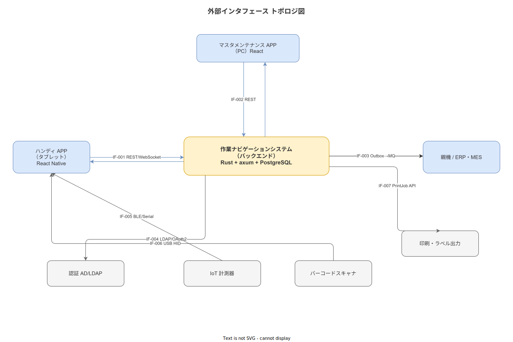

# 13 外部インタフェース要件

本章は、本システムが外部コンポーネント（親機・認証基盤・計測器・スキャナ・カメラ・印刷装置等）と交わす通信の契約を IF-NNN 形式の識別子で体系化する。各 IF の識別子・接続先・通信方向・プロトコル・データ形式・縮退方針を確定する。

**図 1: 外部インタフェース接続トポロジ**



> 原本: [`img/fig_external_interface_topology.drawio`](img/fig_external_interface_topology.drawio)

---

## 1. IF 一覧

バックエンドは `wnav_terminal_api`（8080）と `wnav_master_api`（8081）の 2 バイナリに分割されている。各 IF の担当バイナリを下表の「担当バイナリ」列で示す。

| ID | インタフェース名 | 接続先 | 方向 | プロトコル概要 | データ形式 | 担当バイナリ | 縮退方針 |
|---|---|---|---|---|---|---|---|
| IF-001 | 親機マスタ同期 | ERP / MES / 生産管理システム（親機）| 親機 → 子機（受信）| REST/HTTP over TLS 1.3 | JSON | terminal-api（8080）| ローカルキャッシュで縮退稼働 |
| IF-002 | Outbox 実績送信 | ERP / MES / 親機（受信端点）| 子機 → 親機（送信）| REST/HTTP over TLS 1.3 | JSON | terminal-api（8080）| Outbox キューで自動保留・後送 |
| IF-003 | 認証連携 | AD / LDAP または ローカル認証 | 双方向 | JWT RS256 / LDAP over TLS | JWT / LDAP DN | 両方（terminal-api / master-api）| ローカル認証にフォールバック |
| IF-004 | 印刷・ラベル出力 | プリンター（IP 接続 / USB）| 子機 → プリンター | IPP / ZPL / ESC-POS | PDF / ZPL ラベル | master-api（8081）| プリンター停止時はダウンロード保存 |
| IF-005 | バーコード・QR スキャナ | ハンディスキャナ（USB HID / Bluetooth）| スキャナ → 子機 | USB HID / GATT BLE | GS1 文字列 | terminal-api（8080）| カメラスキャンにフォールバック |
| IF-006 | IoT 計測器 | Bluetooth / USB シリアル計測器 | 計測器 → 子機 | GATT BLE / USB CDC-ACM | テキスト（CSV 形式）| terminal-api（8080）| 手動入力にフォールバック |
| IF-007 | カメラ・ファイル取込 | デバイスカメラ API / ファイルシステム | デバイス → アプリ | OS Camera API / File API | JPEG / PNG | terminal-api（8080）| 代替なし（必須機能）|

> **担当バイナリ判断基準**: ハンディ端末（FE-HA）と直接連携する IF（マスタ同期受信・Outbox 送信・スキャナ・計測器・カメラ）は `terminal-api`。マスタ管理・承認・PDF 印刷など Web/管理系は `master-api`。認証（IF-003）は両バイナリが独立して JWT を発行するため両方に該当する。

**本節で確定した方針**
- 外部インタフェースを IF-001〜IF-007 の 7 件で確定し、接続先・方向・プロトコル・縮退方針を各 IF に確定する。
- IF 一覧に「担当バイナリ」列を追加し、各 IF がどちらのバイナリ（terminal-api / master-api / 両方）で処理されるかを明示することを確定する。
- 全 IF の通信は TLS 1.3 以上を必須とし、社内 LAN 内通信であっても平文 HTTP を禁止することを確定する。
- 計測器・スキャナの外部 IF が利用不可の場合の手動入力フォールバックを設計要件として確定する。

---

## 2. IF-001: 親機マスタ同期

### 2-1. 概要

| 項目 | 内容 |
|---|---|
| 同期対象 | SOP マスタ・ユーザーマスタ・設備マスタ・ロットマスタ・外部一意キーマッピング |
| 同期方式 | Pull 型（子機から親機の READ-ONLY エンドポイントを呼び出す）|
| 同期タイミング | 定期自動同期（設定値：デフォルト 1 時間ごと）および手動同期（管理コンソールから実行）|
| 認証方式 | OAuth 2.1 Client Credentials または mTLS（親機の実装能力に依存してプラガブルに選択）|

### 2-2. データ契約

子機が親機から受け取るデータの最小必須フォーマット:

```json
{
  "sync_type": "sop_master | user_master | equipment_master | lot_master | external_key",
  "as_of": "2026-01-01T00:00:00Z",
  "records": [
    {
      "external_id": "...",
      "payload": { ... }
    }
  ]
}
```

`as_of` フィールドは差分同期の起点タイムスタンプとして使用する。子機は `as_of` 以降に変更されたレコードのみを受け取る。

### 2-3. エラー処理と縮退

| エラー種別 | 処置 |
|---|---|
| 親機接続不可（ネットワーク断・親機停止）| 最後の同期成功時刻を記録し、子機は縮退稼働を継続。UI に「マスタが古い可能性あり（最終同期: X 時 X 分）」バナーを表示 |
| 親機から 4xx が返された場合 | エラー内容をログに記録し、IT 担当に通知。自動リトライを行わない |
| 親機から 5xx が返された場合 | 60 分後に自動リトライ。3 回失敗で IT 担当に通知 |
| データ形式不正（JSON スキーマ違反）| 対象レコードをスキップし、スキップした件数・項目名をログに記録 |

**本節で確定した方針**
- IF-001 を Pull 型・定期自動同期・差分同期方式として確定し、親機停止時の縮退稼働（最終同期表示）を設計要件とする。
- 親機 4xx（設定エラー）は自動リトライしない設計を確定し、原因調査を促す。
- データ形式不正レコードのスキップと件数ログ記録を確定し、同期の部分的継続を保証する。

---

## 3. IF-002: Outbox 実績送信

### 3-1. 概要

| 項目 | 内容 |
|---|---|
| 送信対象 | 完了した WorkExecution・WorkEvent・ElectronicSign の実績データ |
| 送信方式 | Outbox Pattern（DB トランザクションと同期してキューに追加、Consumer が非同期送信）|
| Idempotency 保証 | event_id を Idempotency Key として使用。重複送信された場合、受信側は event_id で重複を検知して 200 OK を返す |
| 送信タイミング | ネットワーク接続確認後すぐ。バックグラウンド送信でユーザー操作をブロックしない |

### 3-2. 送信データフォーマット

```json
{
  "idempotency_key": "<event_id>",
  "schema_version": "1.0",
  "tenant_id": "<固定値>",
  "case_id": "<work_execution_id>",
  "activity": "<step_id>:<event_type>",
  "timestamp_device": "2026-01-01T08:00:00.000Z",
  "timestamp_server": "2026-01-01T08:00:00.150Z",
  "worker_id": "<UUID>",
  "terminal_id": "<UUID>",
  "sop_version_id": "<UUID>",
  "payload": { ... }
}
```

### 3-3. 受信側の要件

受信側（親機）は以下の要件を満たすこと。

- Idempotency Key（idempotency_key）に基づく重複検知を実装すること
- 受信成功時は HTTP 200 OK を返すこと
- 受信失敗時は HTTP 503 を返すこと（409 Conflict は重複として処理する）

**本節で確定した方針**
- IF-002 を Outbox Pattern・非同期送信・Idempotency Key による Exactly-once セマンティクスで確定する。
- 送信はバックグラウンド処理としてユーザー操作をブロックしないことを確定する。
- 受信側の Idempotency Key 対応を IF-002 の接続条件として明示し、未対応の親機との接続を対象外と判断する。

---

## 4. IF-003: 認証連携

### 4-1. JWT ベースのローカル認証（主方式）

| 項目 | 内容 |
|---|---|
| 発行方式 | 本システムの認証サーバーが JWT（RS256 署名）を発行する |
| 有効期限 | 8 時間（シフト 1 本相当）|
| 鍵ローテーション | 90 日周期・grace period 24 時間 |
| リフレッシュ | 有効期限切れ前にリフレッシュトークンで更新可能 |
| MFA | 対象外と判断する（社内 LAN 完結・単一工場の前提に基づく）|

### 4-2. AD / LDAP 連携（オプション方式）

本システムは AD / LDAP との連携をオプション方式として提供する。連携が設定された場合、ユーザー認証を AD / LDAP に委任し、認証成功後に本システムが JWT を発行する。AD / LDAP 障害時はローカル認証にフォールバックする。

**本節で確定した方針**
- JWT RS256・8 時間有効期限・90 日鍵ローテーションをローカル認証の主方式として確定する。
- AD / LDAP 連携をオプション方式とし、LDAP 障害時のローカル認証フォールバックを確定する。
- MFA は社内 LAN 完結・単一工場の前提に基づいて対象外と判断する。

---

## 5. IF-004: 印刷・ラベル・QR 出力

### 5-1. SOP 実行記録の PDF 印刷

完了した WorkExecution の SOP 実行記録を PDF として出力する。出力には WorkExecution ID・worker_id・sop_version_id・全 Step の記録値・ElectronicSign のデジタル印影・ハッシュ値を含む。PDF は ISO 32000 準拠フォーマットで生成する。

### 5-2. ロットラベル出力

Lot マスタのロット情報（lot_id・品番・製造日・ロット番号）を ZPL または ESC-POS フォーマットでラベルプリンターに出力する。QR コードには lot_id を GS1 Application Identifier（AI 21）形式でエンコードする。

### 5-3. 縮退方針

プリンター接続不可の場合、PDF / ラベルデータをダウンロードリンクとして提供し、後から印刷できる。

**本節で確定した方針**
- SOP 実行記録 PDF は ISO 32000 準拠で生成し、worker_id・sop_version_id・ElectronicSign デジタル印影・ハッシュ値を必須項目として確定する。
- QR コードのロット ID は GS1 AI 21 形式でエンコードすることを確定する。
- プリンター接続不可時のダウンロード保存フォールバックを確定する。

---

## 6. IF-005: バーコードスキャナ

### 6-1. 対応スキャナ形式

| 形式 | 対応可否 |
|---|---|
| USB HID キーボードエミュレーション | 対応する |
| Bluetooth HID（GATT BLE プロファイル）| 対応する |
| カメラスキャン（ML Kit / ZXing）| 対応する（フォールバックとして常時利用可）|

### 6-2. 対応コード体系

GS1-128・QR Code・Data Matrix・Code 39・EAN/JAN-13 に対応する。スキャン値は GS1 Application Identifier に基づいてパース処理し、lot_id / serial_number / product_code / equipment_id (AI 8004 UDI/EID) / instrument_id（社内採番）の 5 スロットに自動マッピングする。マッピング先は SOP の required_scans.target で決定する。

### 6-3. 照合ルール

スキャン値は Step の required_scans で指定された全ターゲット（材料/工具/治具/計測器）に対して照合し、全件一致した場合のみ合格とする。1 件でも不一致の場合は NG フラグを work_events.payload.scan_verifications に記録する。target: 'tool' または 'instrument' の照合は equipments.scan_code / instruments.instrument_code を参照し、FR-EV-013 および BR-BUS-046 が強制する。

**本節で確定した方針**
- USB HID・Bluetooth HID・カメラスキャンの 3 方式を対応方式として確定し、カメラスキャンを常時利用可能なフォールバックとして位置づける。
- GS1-128 / QR Code / Data Matrix / Code 39 / EAN/JAN-13 の 5 コード体系への対応を確定する。
- スキャン値の expected_scan_value との照合を Step 完了の合否判定基準として確定する。
- GS1 AI 8004（EID/UDI）を equipment_id 解決経路として採用し、工具・治具・計測器の誤使用検知を IF-005 で支援することを確定する。

---

## 7. IF-006: IoT 計測器

### 7-1. 接続方式

| 接続方式 | 対応プロトコル | 用途例 |
|---|---|---|
| Bluetooth Low Energy | GATT プロファイル（カスタム UUID）| デジタルノギス・温度計・デジタルトルクレンチ |
| USB シリアル | CDC-ACM（仮想 COM ポート）| 電子天秤・超音波厚さ計 |

### 7-2. 自動取込フロー

1. Step が numeric_input かつ計測器連携フラグが有効の場合、計測器接続を確認する。
2. 計測器から測定値を受信し、`measured_value`・`unit_code`・`instrument_id` を自動入力する。
3. 受信した値の unit_code と Step の expected_unit を照合し（BR-BUS-033）、不一致の場合は警告を表示する。
4. 作業員が「確認」操作を行ってから step_completed イベントを記録する。

### 7-3. 縮退方針

計測器接続不可・通信エラーの場合、手動入力モードに切り替える。切り替えは作業員の確認操作を必要とし、手動入力フラグを payload に付与する。

**本節で確定した方針**
- BLE GATT および USB CDC-ACM を計測器接続方式として確定し、測定値の自動取込フローを確定する。
- 計測器接続不可時の手動入力フォールバックを確定し、手動入力フラグを payload に付与することで ALCOA+ Accurate 原則の透明性を担保する。
- 自動受信値の unit_code 照合（BR-BUS-033 参照）を計測器 IF の必須処理として確定する。

---

## 8. IF-007: 写真撮影・ファイル取込

### 8-1. カメラ API

React Native の `expo-camera` または OS ネイティブカメラ API を使用する。撮影された写真は JPEG 形式（品質 85%・短辺最大 1920px）で端末に保存し、SHA-256 ハッシュを即時計算してメタデータに付与する。

### 8-2. ファイル取込

既存の写真ファイル（JPEG / PNG）のギャラリー取込を許可する。取込時に SHA-256 ハッシュを計算し、撮影時との区別のため `is_imported: true` フラグを payload に付与する。

### 8-3. ストレージ管理

写真ファイルは UUID パスで管理し、DB には UUID パスと SHA-256 ハッシュのみを格納する。バイナリデータを DB に直接格納しない。写真ファイルは NAS または共有ストレージに格納し、バックアップ対象に含める。

**本節で確定した方針**
- 撮影写真に SHA-256 ハッシュを即時計算・付与することを確定し、ALCOA+ Original（改竄検知）を実装する。
- ファイル取込時の `is_imported: true` フラグ付与を確定し、撮影記録との区別をメタデータに明示する。
- 写真の UUID パス管理・DB への SHA-256 ハッシュのみ格納・NAS ストレージ格納を確定する。

---

## 参照業界分析

### 必須

[`90_業界分析/22_規制別トレーサビリティ要件詳論.md`](../../../90_業界分析/22_規制別トレーサビリティ要件詳論.md)

[`90_業界分析/33_計量法・JCSS校正トレーサビリティとSI単位.md`](../../../90_業界分析/33_計量法・JCSS校正トレーサビリティとSI単位.md)

### 関連

[`90_業界分析/06_品質管理とトレーサビリティ.md`](../../../90_業界分析/06_品質管理とトレーサビリティ.md)

[`90_業界分析/29_競合製品と作業ナビ・MES・eBR市場.md`](../../../90_業界分析/29_競合製品と作業ナビ・MES・eBR市場.md)

[`90_業界分析/21_作業ログ分析とプロセスマイニング.md`](../../../90_業界分析/21_作業ログ分析とプロセスマイニング.md)

[`90_業界分析/35_環境耐性と防爆・クリーンルーム設計.md`](../../../90_業界分析/35_環境耐性と防爆・クリーンルーム設計.md)
