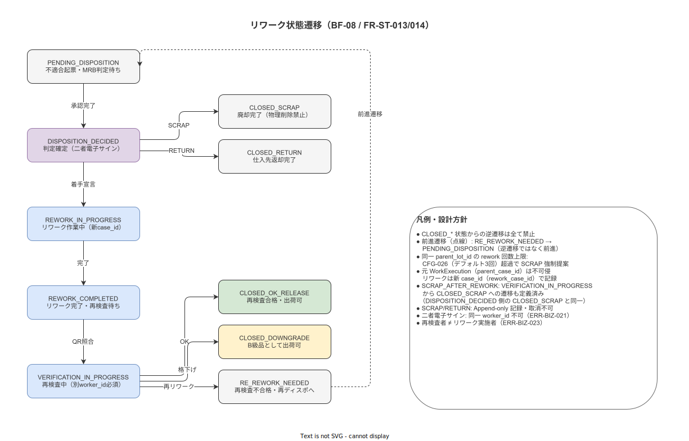

# 16 UC 記述_リワーク・修正作業フロー

本章の責務は、リワーク・修正作業フロー（BF-08）に関わる UC-035〜UC-040 の 6 つのユースケースを固定フォーマットで記述することである。各 UC は ALCOA+ Original 原則（元 WorkExecution の不可侵性）・Two-Person Integrity（二者電子サイン分離）・Just Culture との整合を明示した上で主シナリオ・代替シナリオ・例外シナリオ・関連 FR を記述する。

---

## 1. ユースケース記述

**図 1: リワーク・修正作業フロー（BF-08）業務フロー図**

> 原本: [`img/fig_rework_business_flow.drawio`](img/fig_rework_business_flow.drawio)

**図 2: リワーク状態遷移図（PENDING_DISPOSITION → CLOSED_xx）**

> 原本: [`img/fig_state_rework.drawio`](img/fig_state_rework.drawio)

### UC-035: ディスポジション判定する

| 項目 | 内容 |
|---|---|
| 目的 | 品質担当と現場監督が不適合現品の処置方針（ディスポジション）を二者電子サインで確定し、リワーク作業または廃却・返却の指示を発行する |
| 主アクター | 品質担当（SH-03）・現場監督（SH-02） |
| 副アクター | システム（二者電子サイン検証・`dispositions` 記録・リワーク指示配信） |
| 事前条件 | BF-03 で不適合（nonconformities）が起票されており、`reworks` レコードが `PENDING_DISPOSITION` 状態で存在する |
| 事後条件 | `dispositions`（TBL-044）に Append-only で二者電子サイン付きディスポジション記録がある。`reworks.status = DISPOSITION_DECIDED` に更新されている |

**主シナリオ（リワーク判定の場合）**
1. 品質担当が管理 Web のディスポジション承認コンソール（SCR-MC-013）で対象不適合を確認する
2. 品質担当が `REWORK`（または `TOUCH_UP` / `SORTING`）を選択し、判定理由（必須・100 文字以上推奨）を入力する（FR-ST-013）
3. 品質担当が第一電子サイン（quality_admin ロール）を PIN 認証で付与する（FR-AU-002, FR-EV-005）
4. システムが現場監督に承認要求通知を送信する
5. 現場監督が同コンソールで内容を確認し、第二電子サイン（supervisor ロール）を PIN 認証で付与する
6. システムが両電子サインの signer_worker_id が異なることを DB トリガーで検証する（FR-AU-007）
7. システムが `dispositions` に Append-only 記録し `reworks.status = DISPOSITION_DECIDED` に更新する
8. システムが対象作業員のハンディ APP にリワーク指示を配信する

**代替シナリオ（廃却の場合）**
1. 品質担当が SCRAP を選択し経営層への承認要求を送信する
2. 経営層が第二電子サインを付与する（経営層 + 品質担当の二者）
3. `reworks.status = DISPOSITION_DECIDED` + rework_type = SCRAP で確定し廃却処理（UC-035 の別経路）へ

**例外シナリオ**
- E1: 同一 worker_id が両方の電子サインを提出しようとした場合、システムは ERR-BIZ-021 を返し「同一人物が二者電子サインの両方を担当できません」を表示する（FR-AU-007）
- E2: ディスポジション判定期限（重大度別: CRITICAL 24h, MAJOR 5 営業日）を超過した場合、システムは品質担当・現場監督・経営層へ自動通知を送信する

**関連要件 ID**
- FR-ST-013, FR-AU-007, FR-EV-005, FR-EV-015, FR-AU-002

---

### UC-036: リワーク作業を実行する

| 項目 | 内容 |
|---|---|
| 目的 | 作業員がリワーク専用 SOP に従い修正作業を実施し、元 WorkExecution とは独立した新 case_id で ALCOA+ 準拠の作業記録を生成する |
| 主アクター | 作業員（SH-01） |
| 副アクター | システム（新 case_id 採番・リワーク SOP ナビゲーション・修正品 QR ラベル発行） |
| 事前条件 | UC-035 が完了し `reworks.status = DISPOSITION_DECIDED`。リワーク SOP（sop_type = REWORK）が公開済みである |
| 事後条件 | 新 case_id で `rework_verified_evidences`（リワーク前後の写真）が記録されている。`reworks.status = REWORK_COMPLETED`。修正品 QR ラベルが発行されている |

**主シナリオ**
1. 作業員がハンディ APP のリワーク受付画面（SCR-HA-019）でリワーク指示を確認する（FR-NV-014）
2. 作業員が「作業開始」をタップする。システムが新 case_id を採番し `reworks.rework_case_id` に記録する（FR-ST-014）
3. 作業員がリワーク開始前の現品写真を撮影・記録する（FR-EV-014 必須）。SHA-256 ハッシュ付き二重タイムスタンプ
4. 作業員がリワーク SOP（SCR-HA-020）に従い Step を実行する。元 SOP の case_id は参照のみで書き込み禁止
5. 全 Step 完了後、作業員がリワーク完了後の現品写真を撮影・記録する（FR-EV-014 必須）
6. 作業員が完了電子サインを付与する（FR-EV-005）
7. システムが修正品 QR ラベル（GS1 AI 8003 + AI 91 形式）を自動生成する（TBL-047）。rework_id・親 lot_id・リワーク SOP 版を埋め込む
8. `reworks.status = REWORK_COMPLETED` に更新される

**例外シナリオ**
- E1: リワーク前の証拠写真（FR-EV-014）が撮影されていない場合、システムは「リワーク前の証拠写真が必須です」を表示し Step 実行への遷移をブロックする
- E2: リワーク後の証拠写真が撮影されていない場合、システムは `rework_completed` イベントを受け付けない

**関連要件 ID**
- FR-NV-014, FR-EV-014, FR-EV-005, FR-ST-014, FR-MA-017

---

### UC-037: リワーク前後の証拠を記録する

| 項目 | 内容 |
|---|---|
| 目的 | 作業員がリワーク作業の開始前と完了後に現品写真を両方撮影し、修正の前後状態を ALCOA+ 準拠の証拠として記録する |
| 主アクター | 作業員（SH-01） |
| 副アクター | システム（SHA-256 ハッシュ計算・二重タイムスタンプ記録・前後比較照合） |
| 事前条件 | UC-036 が進行中。リワーク作業の実施前または完了後の証拠撮影フェーズにある |
| 事後条件 | `evidences`（TBL-003）にリワーク前写真（pre_rework）とリワーク後写真（post_rework）の 2 枚が、それぞれ SHA-256 ハッシュ付き二重タイムスタンプで記録されている |

**主シナリオ**
1. システムがリワーク前撮影フェーズを表示し「修正前の現品を撮影してください」を指示する（FR-EV-014）
2. 作業員がカメラを起動し、不適合部位・現品の状態を撮影する
3. システムが SHA-256 ハッシュを計算しタイムスタンプ（device + server）と共に `evidences` に Append-only で記録する
4. 作業員がリワーク作業を実施する（UC-036 §4）
5. 作業員がリワーク完了後撮影フェーズで「修正後の現品を撮影してください」指示を受ける
6. 作業員が修正完了後の現品を撮影する
7. システムが同様に Append-only で記録する
8. 両証拠が揃った場合のみ `rework_completed` イベントへの遷移を許可する

**関連要件 ID**
- FR-EV-014, FR-EV-002, FR-EV-007

---

### UC-038: 再検査を実行する

| 項目 | 内容 |
|---|---|
| 目的 | リワーク実施者とは異なる作業員が修正品 QR をスキャンして再検査 SOP を起動し、修正品が要求水準を満たすことを独立した記録として検証する |
| 主アクター | 作業員（SH-01、リワーク実施者と異なる者）|
| 副アクター | システム（再検査者分離検証・再検査 SOP 起動・`rework_verifications` 記録） |
| 事前条件 | UC-036 が完了し `reworks.status = REWORK_COMPLETED` である。修正品 QR ラベルが発行済みである |
| 事後条件 | `rework_verifications`（TBL-045）に再検査者・verdict・二重タイムスタンプが Append-only で記録されている。`reworks.status` が CLOSED_OK_RELEASE / CLOSED_DOWNGRADE / RE_REWORK_NEEDED / CLOSED_SCRAP のいずれかに更新されている |

**主シナリオ（合格の場合）**
1. 再検査者（リワーク実施者とは別の者）が修正品 QR をスキャンする（FR-NV-015）
2. システムが `reworks.rework_case_id` の実施者 worker_id と現在の認証 worker_id を比較する（FR-AU-007 の Two-Person Integrity 拡張）
3. 別の worker_id であることを確認後、システムが再検査画面（SCR-HA-021）に遷移する
4. 再検査者がリワーク詳細（不適合内容・リワーク前後写真・リワーク SOP）を確認する
5. 再検査 SOP（sop_type = INSPECTION）に従い Step を実行する。新 case_id で独立記録される
6. 再検査者が「OK（合格）」電子サインで確定する
7. システムが `rework_verifications.verdict = OK` を Append-only 記録し `reworks.status = CLOSED_OK_RELEASE` に更新する

**代替シナリオ（再リワーク必要の場合）**
1. 再検査者が「RE_REWORK_NEEDED」で記録する
2. システムが `reworks.status = RE_REWORK_NEEDED` に更新する
3. 同一 parent_lot_id の rework 件数を確認し、CFG-026（デフォルト 3 回）を超えた場合は「リワーク上限に達しました。廃却を提案します」を表示する（FR-ST-014）
4. PENDING_DISPOSITION へ前進遷移し UC-035 を再起動する

**例外シナリオ**
- E1: リワーク実施者と同一 worker_id が再検査画面を開こうとした場合、システムは ERR-BIZ-023 を返し「リワーク実施者が自身の作業の再検査を担当できません」を表示する（Two-Person Integrity）

**関連要件 ID**
- FR-NV-015, FR-ST-014, FR-EV-005, FR-AU-007

---

### UC-039: リワーク SOP マスタを編集する

| 項目 | 内容 |
|---|---|
| 目的 | 品質担当がリワーク専用 SOP（sop_type = REWORK / INSPECTION / SCRAP_RECORD / RETURN_RECORD）とリワーク SOP マッピングマスタ（TBL-046）を Draft-First 方式で登録・編集する |
| 主アクター | 品質担当（SH-03）・マスタ管理者 |
| 副アクター | システム（Draft 保存・版管理・承認フロー） |
| 事前条件 | マスタ編集者ロールを持つユーザーが認証済みである |
| 事後条件 | 承認後にリワーク SOP が有効化されている。マッピングマスタに不適合カテゴリ → リワーク SOP の対応が登録されている |

**主シナリオ**
1. 品質担当がマスタメンテ APP の SCR-MA-015（リワーク SOP 編集）にアクセスする
2. 品質担当が「新規リワーク SOP」を作成し sop_type = REWORK_FULL を選択する（FR-MA-017）
3. 品質担当が Step を定義する（通常の SOP 作成フローと同一: FR-MA-001〜FR-MA-006）
4. 承認フロー（FR-MA-005）を経て SOP が公開される
5. 品質担当が SCR-MA-017（リワーク SOP マッピング）で不適合カテゴリ × 元 SOP → 本リワーク SOP の対応を登録する（FR-MA-018）

**関連要件 ID**
- FR-MA-017, FR-MA-018, FR-MA-001, FR-MA-005

---

### UC-040: リワーク履歴をトレサビ照会する

| 項目 | 内容 |
|---|---|
| 目的 | 品質担当・経営層が lot_id または case_id を起点にリワーク履歴（ディスポジション・リワーク作業・再検査・廃却・返却）を順方向・逆方向で照会し、品質傾向分析・CAPA 評価・コスト把握を行う |
| 主アクター | 品質担当（SH-03）・経営層（SH-06） |
| 副アクター | システム（VW-013〜015 リワークトレサビビュー・RP-010 リワーク廃却記録生成） |
| 事前条件 | `reworks` にデータが存在する。BAT-011（rework_cost_aggregator）の日次集計が完了している |
| 事後条件 | リワーク履歴が照会されトレサビが確認されている |

**主シナリオ**
1. 品質担当が管理 Web のリワーク履歴照会画面（SCR-MC-015）に lot_id または nonconformity_id を入力する（FR-KZ-009）
2. システムが VW-013（`rework_traceability_view`）から当該 lot に関連するリワーク記録を取得する
3. 画面には以下が表示される:
   - ディスポジション判定内容・二者電子サイン者
   - リワーク作業実績（元 case_id → rework_case_id の双方向リンク）
   - 再検査結果・verdict
   - 廃却・返却の記録（あれば）
   - CAPA との連携リンク
   - 累計追加時間・材料費（工程・SOP 版・rework_type 単位）（FR-KZ-010）
4. 品質担当が CAPA 効果確認のためリワーク件数トレンドを確認する（CAPA 詳細画面と双方向遷移）
5. 監査対応のため RP-010（リワーク・廃却記録）を PDF で出力する

**例外シナリオ**
- E1: worker ロール（一般作業員）がアクセスした場合、RBAC により ERR-AUTH-004 でアクセス拒否される
- E2: rework_cost_records に個人（worker_id）単位の集計クエリが投げられた場合、DB ビュー設計で worker_id が投影されないため取得できない（BR-BUS-029・BR-BUS-044 の設計担保）

**関連要件 ID**
- FR-KZ-009, FR-KZ-010, FR-KZ-007, FR-AU-002

---

## 参照業界分析

### 必須

- [`90_業界分析/28_不適合と手順改訂のフィードバックループ.md`](../../../90_業界分析/28_不適合と手順改訂のフィードバックループ.md) — CAPA との責務分離・封じ込め概念
- [`90_業界分析/16_製造コストと価値工学.md`](../../../90_業界分析/16_製造コストと価値工学.md) — リワーク・廃却コストの業界的位置づけ

### 関連

- [`90_業界分析/06_品質管理とトレーサビリティ.md`](../../../90_業界分析/06_品質管理とトレーサビリティ.md) — ALCOA+ Original 原則の実装根拠
- [`90_業界分析/13_安全文化と安全管理システム.md`](../../../90_業界分析/13_安全文化と安全管理システム.md) — Just Culture・Two-Person Integrity の根拠
- [`90_業界分析/22_規制別トレーサビリティ要件詳論.md`](../../../90_業界分析/22_規制別トレーサビリティ要件詳論.md) — ISO 9001:2015 §8.7 不適合品管理
- [`90_業界分析/24_作業者プライバシー・データ倫理と労務監視.md`](../../../90_業界分析/24_作業者プライバシー・データ倫理と労務監視.md) — リワーク個人集計禁止の倫理的根拠
