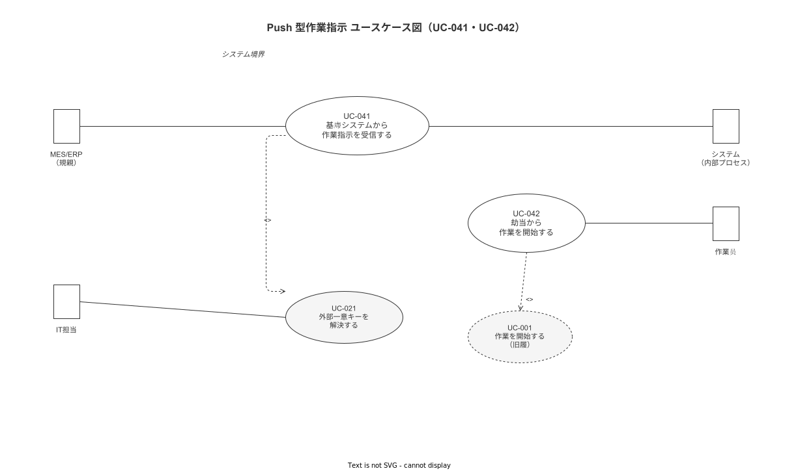

# 17 UC 記述_Push 型作業指示

本章の責務は、Push 型作業指示（基幹システム → 端末）に関わる UC-041・UC-042 の 2 つのユースケースを固定フォーマットで記述することである。各 UC は主シナリオ・代替シナリオ・例外シナリオ・関連 FR を必ず記述する。

---

## 1. ユースケース記述

**図 1: Push 型作業指示 ユースケース図（UC-041・UC-042）**

> 原本: [`img/fig_uc_push_assignment.drawio`](img/fig_uc_push_assignment.drawio)

---

### UC-041: 基幹システムから作業指示を受信する

| 項目 | 内容 |
|---|---|
| 目的 | MES/ERP（親機）が POST /api/v1/work-assignments（API-sync-003）で送信した作業指示を HMAC-SHA256 検証・external_key 解決の後に work_assignments テーブルへ保存し、SSE 配信キューへ登録する |
| 主アクター | システム（内部プロセス）|
| 副アクター | 親機（ERP/MES）（作業指示の提供元）・IT 担当（external_key_binding の管理）|
| 事前条件 | `integration.push_receive_enabled`（CFG-031）が true に設定されている。KEY-010（HMAC 共有秘密）が master-api の設定に読み込まれている。external_key_binding テーブルに target_terminal_key・work_pattern_key のマッピングが登録済みである |
| 事後条件 | work_assignments テーブルに status='pending' の行が INSERT されている。sse_dispatch_log（TBL-053）に delivery_status='queued' の行が INSERT されている。接続中の対象端末がある場合、SSE ストリームに `assignment.created` イベントが即時送信される |

**主シナリオ**

1. 親機は `POST /api/v1/work-assignments` に `Idempotency-Key` ヘッダと `X-WNAV-Signature: sha256={hex}` ヘッダを付与してリクエストを送信する（IF-008）
2. システムは `X-WNAV-Signature` ヘッダから HMAC-SHA256 署名を抽出し、KEY-010 でリクエストボディの署名を計算して比較する（FR-SY-012）。不一致の場合は ERR-VAL-032 で 401 を返却して処理を中断する
3. システムは `Idempotency-Key` ヘッダ値を TBL-035（idempotency_keys）で検索し、24h TTL 内に同一キーが存在する場合は 409 を返却して処理を中断する
4. システムは `work_pattern_key`・`target_terminal_key`・`lot_id_ext`（存在する場合）を external_key_binding テーブルで内部 UUID に解決する（FR-SY-003・UC-021 のロジック流用）
5. システムは解決した UUID と元の `source_payload`（リクエストボディ全体の JSONB）から work_assignments 行を生成し、status='pending'・received_at=now() で INSERT する
6. システムは sse_dispatch_log に delivery_status='queued' の行を INSERT し、SSE 配信モジュール（MOD-BE-012）にキュー登録シグナルを送る
7. システムは 202 Accepted を返却する

**代替シナリオ**

- A1: 対象端末が SSE 接続中の場合、手順 6 の直後に `assignment.created` イベントが即時配信される。sse_dispatch_log が delivery_status='sent' に更新される
- A2: `suggested_worker_key` または `suggested_equipment_key` が提供されている場合、external_key_binding で解決し work_assignments に保存する（解決失敗は警告ログのみ・422 は返さない。必須フィールドではないため）
- A3: `due_at` が省略された場合、work_assignments.due_at を NULL で保存する（期限なし扱い）

**例外シナリオ**

- E1: HMAC 署名不正（手順 2 で不一致）。401 を返却し SECURITY レベルのログを記録する。DB への痕跡は作成しない
- E2: external_key 解決不能（手順 4 で work_pattern_key または target_terminal_key が未登録）。422 を返却し `status='pending_resolution'` の行を INSERT する（ERR-BIZ-027）。IT 担当への通知を発行する
- E3: DB INSERT 失敗（トランザクションエラー等）。503 を返却し、親機側の指数バックオフリトライを期待する。ログを記録する

**関連要件 ID**

- FR-SY-012, FR-SY-003, FR-AU-003, ERR-VAL-032, ERR-BIZ-027, IF-008, API-sync-003

---

### UC-042: 割当から作業を開始する

| 項目 | 内容 |
|---|---|
| 目的 | 端末のホーム画面（SCR-HA-002）で作業員が AssignmentBanner（CMP-HA-021）または AssignmentListPanel（CMP-HA-022）をタップし、AssignmentDetailDialog（CMP-HA-023）で内容を確認して明示的に「開始」操作を行うと、case_id が生成されナビゲーション（UC-001 の Step 5 以降）が起動する |
| 主アクター | 作業員 |
| 副アクター | システム（case_id 生成・work_assignments ステータス更新）|
| 事前条件 | 端末に `assignment.created` イベントが届き、AssignmentBanner または AssignmentListPanel に割当が表示されている（または Pull で取得済み）。作業員が JWT 認証済みである（FR-AU-001 充足）|
| 事後条件 | work_assignments.status が accepted → in_progress に遷移している。work_assignments.case_id に新規生成された case_id がバインドされている。work_started イベントがイベントストアに記録されている。ナビゲーション進捗表示が画面に表示されている |

**主シナリオ**

1. 作業員は SCR-HA-002 ホーム画面で AssignmentBanner（高優先度割当の固定表示）または AssignmentListPanel（一覧）をタップする（FR-NV-014）
2. システムは AssignmentDetailDialog を表示する。表示内容: ロット番号・SOP 名称・期限・優先度・推奨作業員（参考情報）・推奨設備（参考情報）
3. 作業員は内容を確認し「開始」ボタンをタップする（明示的操作必須。自動開始はしない）
4. システムは work_assignments.status を accepted に更新する
5. システムは case_id を生成し、work_assignments.case_id にバインドする。work_started イベントを Append-only イベントストアに記録する（FR-NV-001）
6. システムは work_pattern_id から SOP の最初の Step を取得し表示する。以降は UC-001 主シナリオ Step 5 に合流する（FR-NV-003）

**代替シナリオ**

- A1: priority=1（緊急）の割当の場合、システムは AssignmentBanner を蛍光色（警告カラー）で強調表示する。一覧の最上位に固定する（FR-NV-014）
- A2: 作業員が「拒否」ボタンをタップした場合、システムは拒否理由を任意入力させた上で work_assignments.status を rejected に更新する。IT 担当および現場監督へ通知する
- A3: 作業中の case_id が存在する場合（別の進行中作業がある場合）、システムは「別の作業が進行中です。中断しますか？」確認ダイアログを表示する。中断（UC-010 へ分岐）を選択した場合のみ新規割当を開始できる

**例外シナリオ**

- E1: 割当が cancelled または expired 状態に変化していた場合（表示後にキャンセルされた場合）、システムは「この割当はキャンセルされました」を表示して AssignmentDetailDialog を閉じる（ERR-BIZ-029）
- E2: due_at が現在時刻を過ぎている場合、システムは「期限超過の割当です」警告バナーを AssignmentDetailDialog に表示する。開始は可能とし強制停止しない
- E3: case_id 生成（サーバー呼び出し）が失敗した場合、システムはローカルで暫定 case_id を生成しオフラインフラグを付与する（FR-SY-002・UC-022 の縮退動作に準拠）

**関連要件 ID**

- FR-NV-014, FR-NV-001, FR-NV-003, FR-NV-013, FR-AU-001, FR-SY-013, UC-001, CMP-HA-021, CMP-HA-022, CMP-HA-023

---

## 参照業界分析

### 必須
- [`90_業界分析/29_競合製品と作業ナビ・MES・eBR市場.md`](../../../90_業界分析/29_競合製品と作業ナビ・MES・eBR市場.md) — MES 連携の実態・Push 型作業指示の業界動向

### 関連
- [`90_業界分析/30_国内製造業IT調達慣行とSI構造.md`](../../../90_業界分析/30_国内製造業IT調達慣行とSI構造.md) — 外部一意キー設計・親機 ERP/MES の実態
- [`90_業界分析/27_オフライン同期とデータ整合性.md`](../../../90_業界分析/27_オフライン同期とデータ整合性.md) — オフライン縮退設計（UC-042 例外シナリオ E3）
