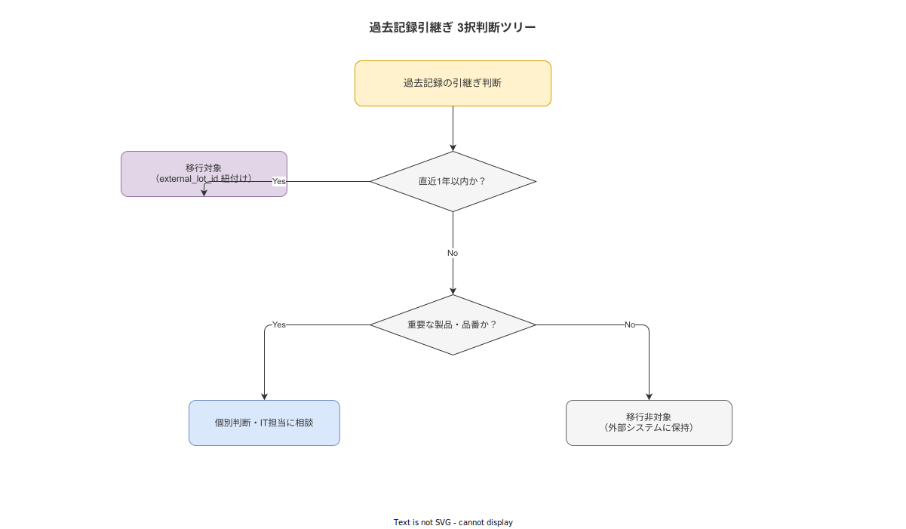

# 03 ロット履歴と過去記録引継ぎ要件

本書の責務は、本システム導入前に存在するロット履歴および過去のトレサビ記録の引継ぎ要件を確定することである。過去記録の取扱いは ALCOA+（Attributable / Legible / Contemporaneous / Original / Accurate / Complete / Consistent / Enduring / Available）準拠の新規記録と明確に区別しなければならない。上流文書「システム化計画 13 章 3〜4 節」の方針を受けて、引継ぎポリシー・フラグ管理・ALCOA+ 対応の詳細要件を確定する。

---

## 1. 過去記録の引継ぎポリシー

### 1-1. 引継ぎ対象の確定

MIG-030: 以下の過去記録を引継ぎ対象として確定する。

| 引継ぎ対象 | 対象期間 | 条件 |
|---|---|---|
| ロット追跡記録（ロット番号・製品コード・作業日時） | 本システム稼働開始日の 1 年以内に完了したロット | 電子記録が存在し、ロット番号が一意に特定できること |
| 不適合記録（不適合番号・工程・不適合内容・処置結果） | 本システム稼働開始日の 1 年以内に発生した不適合 | 電子記録が存在し、対応するロット番号が特定できること |

MIG-031: 以下の過去記録は引継ぎ非対象と判断する。引継ぎ非対象のデータは既存システム（紙・Excel・ERP 等）での保管を維持し、本システムへの移行は行わない。

| 引継ぎ非対象 | 判断根拠 |
|---|---|
| 稼働開始日から 1 年超前のロット記録 | 参照頻度が低く、移行コストに見合わないため |
| 外部 ERP / MES が管理するトランザクション記録 | 外部システムに保持するのが適切であり、本システムの責務範囲外のため |
| 紙のみで保管されている過去記録（1 年以内のものも含む） | ALCOA+ 非準拠での取込は誤った信頼を生むため、スキャン PDF で外部管理する |
| 個人別生産性・勤怠記録 | 倫理境界宣言（計画 01 章）により本システムの対象外と判断する |
| 設備保全作業の詳細記録（過去分） | 保全システムが別途存在する場合はそちらで継続管理するため |

### 1-2. 引継ぎ方式の選択

MIG-032: 引継ぎ対象記録の電子化状況に応じて以下の 3 択で引継ぎ方式を決定する。

| 過去記録の状態 | 引継ぎ方式 | 処理 |
|---|---|---|
| 電子化済み（Excel / DB）かつ構造が整っている | CSV 変換取込 | バルク取込 CLI ツールで is_legacy=true として取込む |
| 電子化済みだが構造が不規則または部分的 | PDF 添付参照 | PDF をシステム外ストレージに保存し、ロット検索結果から参照リンクを表示する |
| 紙のみ | システム外管理 | スキャン PDF をシステム外で管理し、本システムには取込まない |

**本節で確定した方針**
- 直近 1 年以内のロット追跡記録と不適合記録を引継ぎ対象として確定し、1 年超・外部 ERP 管理・紙のみは引継ぎ非対象と判断する。
- 電子化・構造整備済みの記録は CSV 取込、構造不規則は PDF 添付参照、紙のみはシステム外管理の 3 択で処理する。
- 引継ぎ非対象データの保管責任は既存システムの管理者に帰属することを確定する。

---

## 2. external_lot_id によるリンク方式

### 2-1. external_lot_id の設計要件

MIG-033: 本システムは内部 ID（UUID）と外部一意キー（external_lot_id）を分離して管理する。既存の製造番号・ロット番号・シリアル番号体系は external_lot_id フィールドに格納し、本システムの内部ロット UUID と 1 対 1 で紐付ける。

| フィールド | 型 | 制約 | 目的 |
|---|---|---|---|
| id（内部 ID） | UUID | PRIMARY KEY, NOT NULL | システム内部の参照に使用する |
| external_lot_id | VARCHAR(100) | UNIQUE, NOT NULL | 既存番号体系との連携に使用する |
| is_legacy | BOOLEAN | NOT NULL, DEFAULT false | 移行データと新規データを区別する |

MIG-034: 過去記録は external_lot_id で参照可能な状態を保持する。本システムへの完全移行（ALCOA+ 準拠の新規記録への変換）は技術的に不可能であり、対象外と判断する。過去記録は「参照用記録」として本システムで参照できることのみを要件とする。

### 2-2. 外部一意キーの一意性保証

MIG-035: 移行前に external_lot_id の重複チェックを実施する。重複が存在する場合は以下の方針で解消する。

| 重複パターン | 解消方針 |
|---|---|
| 工場コードと組合せれば一意になる | 工場コードを接頭辞として付与する（例: FAC01-LOT0123） |
| 製品ラインと組合せれば一意になる | 製品ラインコードを接頭辞として付与する |
| どの組合せでも重複が解消しない | 品質担当が個別に採番し直し、採番ルールを文書化する |

MIG-036: 接頭辞付与ルールおよび採番し直しのルールは移行準備フェーズ（フェーズ 1）で品質担当が確定し、移行対象 SOP リストと合わせて書面化する。書面化なしの取込を禁止する。

**本節で確定した方針**
- internal UUID と external_lot_id の分離設計を確定し、既存番号体系を external_lot_id で保持する。
- 過去記録の ALCOA+ 準拠への完全移行は対象外と判断し、「参照用記録として参照可能」であることのみを要件とする。
- external_lot_id の重複解消ルールを移行準備フェーズで品質担当が文書化することを必須とする。

---

## 3. is_legacy フラグ活用

### 3-1. is_legacy フラグの定義と付与ルール

MIG-037: is_legacy フラグは、移行データと新規稼働後の ALCOA+ 準拠データを区別するための必須フィールドとして定義する。

| フラグ値 | 意味 | 適用対象 |
|---|---|---|
| is_legacy = false | 本システム稼働後に新規記録された ALCOA+ 準拠データ | 本システム稼働開始後に記録されたすべての作業ログ |
| is_legacy = true | 移行前に存在していた ALCOA+ 準拠対象外のデータ | CSV 取込した過去ロット・不適合記録 |

MIG-038: is_legacy=true のフラグは、バルク取込 CLI ツールが自動的に付与する。手動での is_legacy=false 設定は禁止する。CSV テンプレートに is_legacy 列を含める必要はなく、ツールが強制付与する設計とする。

### 3-2. ALCOA+ 完全性要件との区別

MIG-039: is_legacy=true のデータについては、以下の ALCOA+ 原則の適用を免除する。免除の根拠と範囲を本書に記録し、規制監査時に参照できるよう管理する。

| ALCOA+ 原則 | 新規データへの適用 | is_legacy データへの適用 | 免除根拠 |
|---|---|---|---|
| Attributable（帰属性） | 必須（電子署名） | 免除 | 取込作業者と原記録者が異なるため遡及適用が不可能 |
| Contemporaneous（同時性） | 必須（サーバー UTC タイムスタンプ） | 免除 | 記録時刻の真正性を事後に証明できないため |
| Original（原本性） | 必須（Append-only） | 免除 | 取込前の記録改竄有無を事後確認できないため |
| Legible（判読性） | 必須 | 努力目標（照合可能な範囲で維持） | データ形式の不一致がある場合に完全保証が困難なため |
| Accurate（正確性） | 必須 | 照合確認済み範囲で対応 | OCR 変換・手動整形の精度限界のため |
| Complete（完全性） | 必須 | 取込済み範囲で対応 | 欠損があっても原記録との照合で代替 |
| Consistent（一貫性） | 必須 | 部分対応 | 既存番号体系の不統一を許容する必要があるため |
| Enduring（耐久性） | 必須（Append-only, バックアップ） | 適用（バックアップ対象に含める） | システム廃棄まで参照可能にする |
| Available（可用性） | 必須 | 適用（検索・参照可能） | external_lot_id で検索可能にする |

**本節で確定した方針**
- is_legacy フラグを移行データと新規データを区別する必須フィールドとして確定し、バルク取込 CLI ツールが自動付与する設計を確定する。
- is_legacy=true データへの ALCOA+ 原則の一部免除とその根拠を本書に記録し、規制監査での参照を可能にする。
- Enduring・Available の 2 原則は is_legacy データにも適用し、参照可能性を維持することを確定する。

---

## 4. 移行データの ALCOA+ 対応

**図 1: 移行データ判定ツリー**



> 原本: [`img/fig_migration_decision_tree.drawio`](img/fig_migration_decision_tree.drawio)

### 4-1. ALCOA+ 対応の全体方針

MIG-040: 移行データの ALCOA+ 対応は「時点参照のみ可能・電子サインなし・Contemporaneous 要件免除」を基本方針として確定する。この方針は移行データが「過去の参考情報」として機能し、現在の品質管理意思決定の唯一の根拠とならないことを担保する。

規制監査時には以下の説明を管理画面上のメタデータとして表示できる状態を維持する。

```
このデータは本システム稼働前の移行データです（is_legacy=true）。
ALCOA+ 準拠の対象外です。時点参照にのみ使用してください。
取込日時: {imported_at}
取込担当者: {importer_username}
```

### 4-2. 時点参照の実装要件

MIG-041: is_legacy=true データの表示は以下の制約を設ける。

| 制約 | 実装要件 |
|---|---|
| 移行データの改ざん禁止 | is_legacy=true レコードの UPDATE・DELETE を禁止する（Append-only で管理する） |
| 表示上の区別 | 管理ダッシュボードおよびトレサビ検索結果で is_legacy=true データは「[移行データ]」ラベルを付与して表示する |
| 電子サイン不要 | is_legacy=true データには電子署名フィールドが存在しないことをシステムで担保する |
| 混在表示の禁止 | トレサビ検索結果で is_legacy=true と is_legacy=false を混在させずに区分表示する |

### 4-3. Contemporaneous 要件の免除条件

MIG-042: 移行データへの Contemporaneous（記録時刻の同時性）要件の免除は以下の条件のすべてを満たす場合にのみ認める。

| 免除条件 | 確認方法 |
|---|---|
| 原記録の記録日時が別途確認可能な状態にある | 紙原本・元の Excel ファイルを保管し、照合可能な状態を維持する |
| 取込日時（imported_at）が is_legacy データに記録されている | バルク取込 CLI ツールが自動記録する |
| 取込担当者の ID が記録されている | バルク取込 CLI ツールが実行時の認証済みユーザー ID を自動記録する |
| 免除根拠がシステムのメタデータとして保存されている | is_legacy=true 取込時に「ALCOA+ Contemporaneous 免除：移行データのため」を自動記録する |

**本節で確定した方針**
- 移行データを「時点参照のみ可能・電子サインなし・Contemporaneous 免除」として管理することを確定する。
- is_legacy=true データへの UPDATE・DELETE を禁止し、Append-only を移行データにも適用することを確定する。
- 免除条件として原記録の保管継続・取込日時と担当者の自動記録・免除根拠の自動保存の 3 点を必須とする。

---

## 参照業界分析

### 必須参照

- [`90_業界分析/22_規制別トレーサビリティ要件詳論.md`](../../../90_業界分析/22_規制別トレーサビリティ要件詳論.md)
- [`90_業界分析/28_不適合と手順改訂のフィードバックループ.md`](../../../90_業界分析/28_不適合と手順改訂のフィードバックループ.md)

### 関連参照

- [`90_業界分析/33_計量法・JCSS校正トレーサビリティとSI単位.md`](../../../90_業界分析/33_計量法・JCSS校正トレーサビリティとSI単位.md)
- [`90_業界分析/24_作業者プライバシー・データ倫理と労務監視.md`](../../../90_業界分析/24_作業者プライバシー・データ倫理と労務監視.md)
