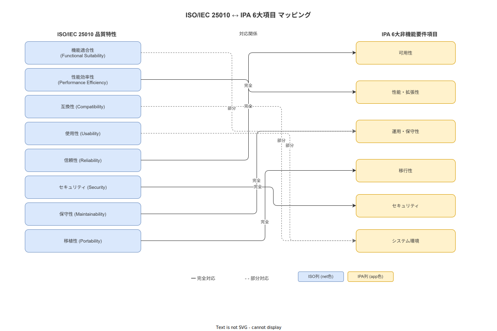

# 07 品質特性要件（ISO/IEC 25010 補助）

本章は ISO/IEC 25010 の品質特性のうち、IPA 非機能要求グレード 6 大項目で扱いにくい「機能適合性・互換性・信頼性・保守性・移植性」を補助的に定義する。IPA 6 大項目と重複する観点は「IPA 対応章を参照」として再記述しない。

---

## 1. 本章の位置づけ

### 1-1. ISO/IEC 25010 と IPA 6 大項目の対応マッピング

ISO/IEC 25010:2023 は製品品質モデルとして 8 品質特性（機能適合性・性能効率性・互換性・ユーザビリティ・信頼性・セキュリティ・保守性・移植性）を定義する。計画 08 章 1 節でその全体像を確認済みである。本章は IPA 非機能要求グレードとの対応を整理し、本補助章の責務を確定する。

| ISO/IEC 25010 特性 | IPA 大項目との対応 | 本章での取扱 |
|---|---|---|
| 機能適合性 | 対応なし（機能要件で扱う）| 本章 2 節で補助定義 |
| 性能効率性 | 性能・拡張性（IPA 02）| IPA 章（NFR-PER）を参照 |
| 互換性 | 対応なし | 本章 3 節で補助定義 |
| ユーザビリティ | （IPA 05 の一部）| 補助章 09 で定義 |
| 信頼性 | 可用性（IPA 01）+ 一部 | 本章 4 節で補助定義（IPA 章との重複は参照のみ）|
| セキュリティ | セキュリティ（IPA 05）| IPA 章（NFR-SEC）を参照 |
| 保守性 | 運用・保守性（IPA 03）の一部 | 本章 5 節で補助定義 |
| 移植性 | 移行性（IPA 04）の一部 | 本章 6 節で補助定義 |
| 倫理品質（追加特性）| 対応なし | 計画 08 章 7 節を参照 |

**図 1: ISO/IEC 25010 品質特性マッピング**

> 原本: [`img/fig_iso25010_mapping.drawio`](img/fig_iso25010_mapping.drawio)

**本節で確定した方針**
- 本章を IPA 6 大項目では扱いにくい 5 品質特性（機能適合性・互換性・信頼性・保守性・移植性）の補助定義として位置づける。
- IPA 対応章（NFR-PER / NFR-SEC）と重複する観点は本章で再定義せず、参照のみとすることを確定する。
- ユーザビリティは補助章 09（NFR-UX）に委ねることを確定する。

---

## 2. 機能適合性

### 2-1. 機能完全性

| 要件 ID | NFR-QUA-001 |
|---|---|
| 要件名 | 機能完全性 |
| 要件内容 | 機能要件（FR-NNN 系全件）が実装されており、Detox E2E テストが全ユースケースを網羅していること |
| 受入基準 | M6 リリース判定時に機能要件全件の E2E テストが通過すること |

### 2-2. 機能正確性

| 要件 ID | NFR-QUA-002 |
|---|---|
| 要件名 | 機能正確性 |
| 要件内容 | 数値計算（Cp/Cpk・単位換算・SHA-256 ハッシュ・JSON Logic 評価）の結果が仕様値と一致すること |
| 受入基準 | Rust ユニットテストで以下の精度を確認する。Cp/Cpk 計算: 小数点 4 桁以内誤差 / SHA-256: ゴールデンデータとの完全一致 / JSON Logic: JSON Logic 公式テストスイート全通過 |

### 2-3. 機能適切性

| 要件 ID | NFR-QUA-003 |
|---|---|
| 要件名 | 機能適切性 |
| 要件内容 | 機能が業務目標（Navigation + Traceability の二大価値）を達成するために適切であること。不要な機能・監視目的に転用可能な機能を実装しないこと |
| 受入基準 | 計画 08 章 7 節の倫理品質自己監査チェックリスト全項目パス |

**本節で確定した方針**
- 機能完全性の受入基準を「機能要件全件 E2E テスト通過」として確定する。
- 機能正確性を数値計算のユニットテストで検証し、精度基準を明示することを確定する。
- 機能適切性を倫理品質自己監査チェックリストと連動させ、監視機能の混入を設計レベルで防止することを確定する。

---

## 3. 互換性

### 3-1. 標準規格互換性

| 要件 ID | NFR-QUA-010 |
|---|---|
| 要件名 | GS1 標準への対応 |
| 要件内容 | バーコード・QR コードのエンコード/デコードは GS1 General Specifications（最新版）に対応する。GS1-128・QR Code・Data Matrix の各 AI に対応したパース処理を実装する |

| 要件 ID | NFR-QUA-011 |
|---|---|
| 要件名 | XES フォーマットへの対応 |
| 要件内容 | 監査ログの XES エクスポートは IEEE 1849（XES: eXtensible Event Stream）国際標準に対応する。機能要件 RP-002（監査ログ出力）および NFR-DQ 章と整合する |

| 要件 ID | NFR-QUA-012 |
|---|---|
| 要件名 | JWT 標準への準拠 |
| 要件内容 | JWT の実装は RFC 7519（JSON Web Token）に準拠する。RS256 署名は RFC 7518（JSON Web Algorithms）に準拠する |

| 要件 ID | NFR-QUA-013 |
|---|---|
| 要件名 | UCUM コードへの対応 |
| 要件内容 | 数値 Step の単位は UCUM（Unified Code for Units of Measure）コードで管理する。単位不一致検知・換算処理は UCUM 仕様に従う |

**本節で確定した方針**
- GS1 標準・IEEE 1849（XES）・RFC 7519/7518（JWT）・UCUM の 4 外部標準への対応を確定する。
- 各標準への「準拠する」または「対応する」の区別を以下で確定する。GS1: 対応する / XES: 対応する / JWT: 準拠する / UCUM: 対応する。
- 標準への準拠は実装テストで検証することを確定する。

---

## 4. 信頼性

### 4-1. 成熟性・障害許容性

| 要件 ID | NFR-QUA-020 |
|---|---|
| 要件名 | 成熟性（既知欠陥ゼロ条件）|
| 要件内容 | M6 リリース時に Priority 1（本番停止・データ損失・セキュリティ侵害）の既知欠陥をゼロとすること。Priority 2 以下の欠陥は ADR に記録した上でリリースを許容する |

| 要件 ID | NFR-QUA-021 |
|---|---|
| 要件名 | 障害許容性（Offline-First）|
| 要件内容 | API サーバーが 30 分以上不到達の状態でも、タブレット APP が SQLite ローカルキューへの記録を継続できること。NFR-AVL-002（RTO 1 時間）との整合により、RTO 以内のサーバー障害では業務中断ゼロを実現する |

| 要件 ID | NFR-QUA-022 |
|---|---|
| 要件名 | 回復性（自動同期）|
| 要件内容 | サーバー復旧後、タブレット端末のローカルキューに保持されたイベントが自動同期され、WorkEvent テーブルに正常に格納されること。同期完了後の欠損・重複がゼロであること（Idempotency Key による重複排除）|

可用性については IPA 対応章（NFR-AVL）を参照する。本節は障害許容性と回復性の補足定義にとどめる。

**本節で確定した方針**
- M6 リリースの Priority 1 既知欠陥ゼロを成熟性の受入基準として確定する。
- Offline-First による 30 分以上の障害許容性を確定し、NFR-AVL-002 と整合させる。
- サーバー復旧後の自動同期・欠損/重複ゼロを回復性の受入基準として確定する。

---

## 5. 保守性

### 5-1. モジュール性・再利用性

| 要件 ID | NFR-QUA-030 |
|---|---|
| 要件名 | モジュール性 |
| 要件内容 | バックエンド（Rust）はレイヤードアーキテクチャ（API 層 / ドメイン層 / インフラ層）で分離し、層をまたぐ直接参照を禁止する |

| 要件 ID | NFR-QUA-031 |
|---|---|
| 要件名 | 再利用性 |
| 要件内容 | 多言語テキスト（instruction_text の JSONB 形式）・JSON Logic 評価エンジン・SHA-256 ハッシュ計算は独立したモジュールとして実装し、複数コンポーネントから再利用できること |

### 5-2. 解析性・変更性・試験性

| 要件 ID | NFR-QUA-032 |
|---|---|
| 要件名 | 解析性（ドキュメント駆動）|
| 要件内容 | 全 REST API エンドポイントに OpenAPI 3.1 仕様書を整備する。全データモデルに ER 図を整備する。不可逆な設計決定に ADR を作成する。1 ヶ月の中断後にドキュメントのみで開発を再開できることを M6 リリース判定条件とする |

| 要件 ID | NFR-QUA-033 |
|---|---|
| 要件名 | 変更性（Bus Factor 対策）|
| 要件内容 | 計画 08 章 6 節のドキュメント駆動設計方針に従い、実装コードに型定義・インラインコメントを必須とする。Bus Factor = 1 のリスクをドキュメント・テスト・型の 3 点セットで低減する |

| 要件 ID | NFR-QUA-034 |
|---|---|
| 要件名 | 試験性 |
| 要件内容 | Rust バックエンドは cargo test（ユニット + 統合テスト）を必須とする。React Native は Detox E2E テストで全ユースケースを網羅する。DB スキーマ同期（SQLite↔PostgreSQL）を E2E テストで毎回検証する |

**本節で確定した方針**
- バックエンドのレイヤードアーキテクチャ（API / ドメイン / インフラ）分離を確定し、層をまたぐ直接参照を禁止する。
- OpenAPI 3.1・ER 図・ADR の整備を解析性の必須要件として確定する。
- cargo test + Detox E2E + DB スキーマ同期テストを試験性の必須要件として確定する。

---

## 6. 移植性

### 6-1. タブレット OS 間の移植性

| 要件 ID | NFR-QUA-040 |
|---|---|
| 要件名 | Android / iOS / Windows 間の移植性 |
| 要件内容 | React Native（Expo）により、同一のビジネスロジック・UI コンポーネントを Android / iOS で共有する。Windows タブレット向けは react-native-windows で対応する。OS 固有の実装は OS アダプタ層に分離し、ビジネスロジック層への依存を防止する |

### 6-2. PostgreSQL 版移行性

| 要件 ID | NFR-QUA-041 |
|---|---|
| 要件名 | PostgreSQL 版移行性 |
| 要件内容 | PostgreSQL 16 から 17 以降へのアップグレードは、sqlx migrate を使用した無停止または短停止（最大 15 分）で実施できること。PostgreSQL 固有の機能（JSONB・WAL・PG 拡張）は互換性を確認してから使用する |

**本節で確定した方針**
- Android / iOS 間のビジネスロジック共有を React Native で実現し、OS 固有実装をアダプタ層に分離することを確定する。
- PostgreSQL のメジャーバージョンアップを sqlx migrate で 15 分以内に完了できることを移植性要件として確定する。

---

## 参照業界分析

### 必須

[`90_業界分析/22_規制別トレーサビリティ要件詳論.md`](../../../90_業界分析/22_規制別トレーサビリティ要件詳論.md)

### 関連

[`90_業界分析/21_作業ログ分析とプロセスマイニング.md`](../../../90_業界分析/21_作業ログ分析とプロセスマイニング.md)

[`90_業界分析/33_計量法・JCSS校正トレーサビリティとSI単位.md`](../../../90_業界分析/33_計量法・JCSS校正トレーサビリティとSI単位.md)

[`90_業界分析/29_競合製品と作業ナビ・MES・eBR市場.md`](../../../90_業界分析/29_競合製品と作業ナビ・MES・eBR市場.md)
