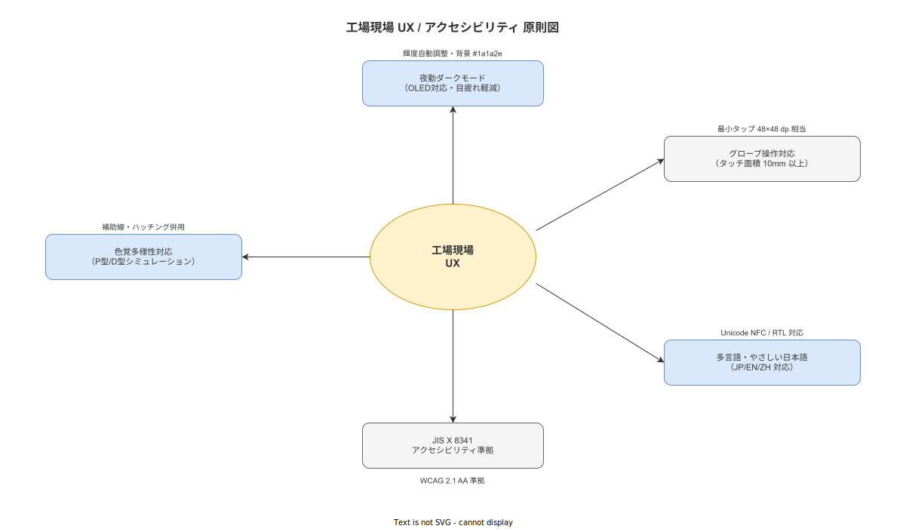

# 09 ユーザビリティ・アクセシビリティ要件

本章は、製造現場特有の環境（手袋着用・夜勤・高照度・騒音・多言語・高齢化）に対応するユーザビリティ要件と、JIS X 8341-3 に基づくアクセシビリティ要件を NFR-UX 識別子付きで確定する。計画 08 章 5 節で確定した設計原則を計測可能要件として具体化する。

---

## 1. 夜勤ダークモード要件

### 1-1. 夜勤環境の照明条件

| 要件 ID | NFR-UX-001 |
|---|---|
| 要件名 | 夜勤ダークモードの自動切替 |
| 要件内容 | 20:00〜翌 6:00 の時間帯にハンディ APP が自動でダークモードに切り替わること。作業員が手動でモードを切り替えることも可能とする |

| 要件 ID | NFR-UX-002 |
|---|---|
| 要件名 | ダークモードの最低輝度要件 |
| 要件内容 | ダークモード時の最低輝度設定は端末仕様に依存するが、最低輝度レベルで使用した場合でも文字・アイコンのコントラスト比 4.5:1 以上を維持すること（WCAG 2.1 AA 基準）|

| 要件 ID | NFR-UX-003 |
|---|---|
| 要件名 | ダークモード配色 |
| 要件内容 | ダークモードの背景色は #1C1C1E（iOS システム dark）相当とし、テキストは #F5F5F5 以上の輝度を確保する。ステータス色（合格: 緑 / 不合格: 赤 / 警告: 黄）は明度を 75% 以上に調整してダークモードでも識別できること |

**図 1: UX・アクセシビリティ設計原則**

> 原本: [`img/fig_ux_a11y_principles.drawio`](img/fig_ux_a11y_principles.drawio)

**本節で確定した方針**
- 夜勤ダークモードを 20:00〜翌 6:00 の自動切替 + 手動切替の両方式で確定する。
- ダークモード時のコントラスト比 4.5:1 以上（WCAG 2.1 AA）を必須要件として確定する。
- ステータス色のダークモード対応（明度 75%+）を確定する。

---

## 2. グローブ操作要件

### 2-1. タッチターゲットの最小サイズ

| 要件 ID | NFR-UX-010 |
|---|---|
| 要件名 | タッチターゲット最小サイズ |
| 要件内容 | すべてのインタラクティブ要素（ボタン・チェックボックス・タップ可能なリスト行）のタッチターゲットを 44dp × 44dp 以上とする |
| 根拠 | 計画 08 章 5 節で確定した「最小タッチターゲット 72dp」の方針は推奨値。44dp は WCAG 2.1 (2.5.5) の最低要件であり、グローブ操作の最低保証値とする |

| 要件 ID | NFR-UX-011 |
|---|---|
| 要件名 | スライダー・小ボタンの禁止 |
| 要件内容 | ハンディ APP の主要操作フローにスライダー（slider）・直径 24dp 未満の小ボタン・精密ジェスチャー（ピンチ・回転・2 本指スワイプ）を使用しない。カスタム Step タイプ `slider_range` は 44dp × 44dp の操作ハンドルで実装する |

| 要件 ID | NFR-UX-012 |
|---|---|
| 要件名 | 誤操作防止の確認操作 |
| 要件内容 | 「作業完了」「CAPA クローズ」「SOP 承認」等の不可逆操作には確認ダイアログを表示し、2 回のタップ確認を必須とする。「誤って押した」を防ぐためのボタン間隔は 8dp 以上を確保する |

**本節で確定した方針**
- タッチターゲット 44dp × 44dp を必須最低要件・72dp を推奨値として確定する。
- スライダー・精密ジェスチャーをハンディ APP 主要操作から禁止することを確定する。
- 不可逆操作の 2 回タップ確認・ボタン間隔 8dp 以上を誤操作防止として確定する。

---

## 3. 多言語要件

### 3-1. サポート言語

| 要件 ID | NFR-UX-020 |
|---|---|
| 要件名 | 必須サポート言語 |
| 要件内容 | 日本語（ja）と英語（en）を必須サポート言語とする。UI テキスト全件の翻訳を初期実装から提供する。ベトナム語（vi）等の追加言語は SOP の instruction_text（JSONB）として任意追加できる設計を確保する |

| 要件 ID | NFR-UX-021 |
|---|---|
| 要件名 | UI 文字列の翻訳率 |
| 要件内容 | UI に表示される全文字列（ボタンラベル・エラーメッセージ・ヘルプテキスト・通知メッセージ）の 100% が日本語・英語の両方で提供されること。翻訳漏れがゼロであること |
| 受入基準 | i18next の翻訳ファイル（ja.json・en.json）のキー数が一致すること。M6 リリース前に翻訳漏れキーのゼロを確認する |

| 要件 ID | NFR-UX-022 |
|---|---|
| 要件名 | フォント適切性 |
| 要件内容 | 日本語表示に Noto Sans JP（または Noto Serif JP）を使用し、文字化けを防止する。英語は Noto Sans（Latin）を使用する。フォントは APK / IPA に埋め込み、端末側のフォントに依存しない |

**本節で確定した方針**
- 日本語・英語を必須サポート言語として確定し、UI 文字列 100% 翻訳をリリース条件とする。
- i18next を多言語管理の標準として確定し、翻訳漏れゼロを M6 リリース前の確認項目とする。
- Noto フォントを埋め込み使用し、端末フォント依存を排除することを確定する。

---

## 4. やさしい日本語要件

### 4-1. 外国人実習生向け UI 設計

| 要件 ID | NFR-UX-025 |
|---|---|
| 要件名 | ルビ（ふりがな）のサポート |
| 要件内容 | SOP の instruction_text に漢字にルビを付与できるフィールド（instruction_text_ruby: JSONB）を設ける。ルビの付与は品質担当・マスタ編集者が任意で設定する |

| 要件 ID | NFR-UX-026 |
|---|---|
| 要件名 | 平易語彙の使用 |
| 要件内容 | UI のシステムラベル（ボタン・ヘッダー・エラーメッセージ）は「やさしい日本語」の語彙水準（JLPT N4 相当）で記述する。専門用語を使用する場合は括弧で平易な言い換えを付与する。例:「承認（かくにん）」|

| 要件 ID | NFR-UX-027 |
|---|---|
| 要件名 | 長文の禁止 |
| 要件内容 | 1 画面に表示するテキスト（手順ガイド・エラーメッセージ）は原則 100 文字以内とする。100 文字を超える場合は「詳細を見る」の折り畳み表示を使用する |

**本節で確定した方針**
- SOP にルビフィールド（instruction_text_ruby）を設け、任意設定を可能とすることを確定する。
- UI システムラベルを JLPT N4 水準（やさしい日本語）で記述し、専門用語への言い換え付与を確定する。
- 1 画面テキスト 100 文字以内を原則とし、超過時の折り畳み表示を確定する。

---

## 5. JIS X 8341-3 対応スタンス

### 5-1. ウェブアクセシビリティのレベル確定

| 要件 ID | NFR-UX-030 |
|---|---|
| 要件名 | JIS X 8341-3 適合レベル |
| 要件内容 | ハンディ APP のウェブコンポーネント（管理 Web・マスタメンテナンス APP）は JIS X 8341-3:2016（WCAG 2.1 対応版）のレベル AA を達成目標とする |
| 選定根拠 | 工場タブレット向け業務アプリとして、一般公衆向けウェブサイトに求められる最低水準（レベル A）を超え、実用的なアクセシビリティを確保する。レベル AAA は工場業務アプリの特性上（作業手順の精密表示・専門的 UI）から達成困難な成功基準が存在するため、AAA は目標としない |
| 対象範囲 | 管理 Web（SCR-MC 系）・マスタメンテナンス APP（SCR-MA 系）の HTML レンダリング部分。React Native ネイティブ UI は Accessibility API（accessibilityLabel 等）で対応する |

**本節で確定した方針**
- JIS X 8341-3（WCAG 2.1）のレベル AA を管理 Web・マスタメンテナンス APP の達成目標として確定する。
- レベル AAA は工場業務アプリの特性から対象外と判断し、その根拠を明示する。
- React Native ネイティブ UI は Accessibility API による対応で WCAG 原則に対応することを確定する。

---

## 6. 色覚多様性対応

### 6-1. カラーユニバーサルデザイン

| 要件 ID | NFR-UX-035 |
|---|---|
| 要件名 | 色のみへの依存禁止 |
| 要件内容 | ステータス情報（合格・不合格・警告・緊急）を色のみで表現することを禁止する。形状・アイコン・テキストラベルを冗長手段として必ず併用する |

| 要件 ID | NFR-UX-036 |
|---|---|
| 要件名 | P 型・D 型・T 型への対応 |
| 要件内容 | カラーパレットを P 型（赤緑色盲）・D 型（緑赤色盲）・T 型（青黄色盲）でシミュレーション確認する。全ステータス色がシミュレーション後も識別可能であること。合格（緑）と不合格（赤）の区別には必ず形状（チェックマーク / ×）を追加する |

**本節で確定した方針**
- ステータス情報を色のみで表現することを禁止し、形状・アイコン・テキストの冗長表現を必須とすることを確定する。
- P 型・D 型・T 型のシミュレーション確認を M6 リリース前の検証要件として確定する。

---

## 7. 視認性要件

### 7-1. フォントサイズ・コントラスト

| 要件 ID | NFR-UX-040 |
|---|---|
| 要件名 | 最小フォントサイズ |
| 要件内容 | ハンディ APP の本文テキストは 14pt（約 18.67px）以上とする。手順指示テキスト（instruction_text）は 16pt 以上を標準とする。注記・補足テキストは 12pt 以上とする |

| 要件 ID | NFR-UX-041 |
|---|---|
| 要件名 | コントラスト比 |
| 要件内容 | テキストと背景のコントラスト比は WCAG 2.1 AA 基準（通常テキスト 4.5:1 以上・大テキスト 18pt 以上は 3:1 以上）を満たすこと。ライトモード・ダークモードの両方で確認する |

| 要件 ID | NFR-UX-042 |
|---|---|
| 要件名 | 高輝度環境での可読性 |
| 要件内容 | 照度 1,000 lux 以上の高照度環境（屋外・強照明の製造ライン）でも可読性を確保するため、最大輝度 400nits 以上の端末を使用した場合にコントラスト比 3:1 以上を維持すること。800nits 以上の端末の使用を推奨する（NFR-ENV-003 参照）|

| 要件 ID | NFR-UX-043 |
|---|---|
| 要件名 | 1 画面 = 1 Step の原則 |
| 要件内容 | 作業実行画面（SCR-HA-004）は 1 画面に 1 Step の手順のみを表示する。複数 Step を同時表示する設計を禁止する。Endsley SA レベル 1（現在ステップの即時認知）を 1 秒以内で達成するための最重要 UI 原則とする |

**本節で確定した方針**
- 最小フォントサイズを本文 14pt・手順テキスト 16pt・注記 12pt として確定する。
- コントラスト比を WCAG 2.1 AA 基準（4.5:1 以上）として確定し、ライト・ダーク両モードでの検証を必須とする。
- 1 画面 = 1 Step の原則を Endsley SA レベル 1 達成のための最重要 UI 原則として確定し、複数 Step 同時表示を禁止する。

---

## 参照業界分析

### 必須

[`90_業界分析/18_現場HCIと作業者インターフェース.md`](../../../90_業界分析/18_現場HCIと作業者インターフェース.md)

[`90_業界分析/34_多言語化・外国人労働者と読み書き能力差.md`](../../../90_業界分析/34_多言語化・外国人労働者と読み書き能力差.md)

[`90_業界分析/37_シフト・夜勤・疲労管理と高齢化労働力.md`](../../../90_業界分析/37_シフト・夜勤・疲労管理と高齢化労働力.md)

### 関連

[`90_業界分析/08_人間工学と作業負荷.md`](../../../90_業界分析/08_人間工学と作業負荷.md)

[`90_業界分析/12_認知工学と状況認識.md`](../../../90_業界分析/12_認知工学と状況認識.md)
