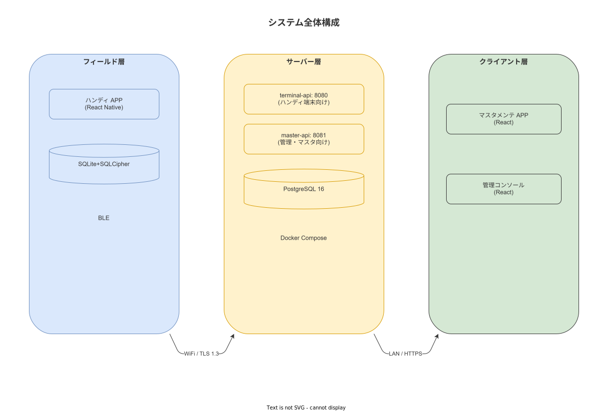

# 02 HW・MW スタックと選定根拠

本章は、IPA 共通フレーム 2013「2.3.3 HW・SW 設計タスク」に対応し、サーバーハードウェアの最低仕様と全ソフトウェアスタックの選定根拠を確定する。選定結果は ENV-ITEM-001〜012 として識別し、付録/99 設計識別子採番台帳で管理する。本章で確定したスタックは、後続の §03（配置設計）および 02_ソフトウェア方式設計サブの技術前提となる。

---

## 1. サーバーハードウェア最低仕様

本仕様は NODE-001（Active サーバー）・NODE-002（Standby サーバー）の両ノードに適用する。Standby サーバーは Active サーバーと同等仕様とする（ウォームスタンバイのため性能を落とした構成は採用しない）。

### 1-1. 必要スペックの算出根拠

サーバー仕様は以下の NFR から逆算して導出する。

| NFR ID | 制約 | ハードウェア要件への影響 |
|---|---|---|
| NFR-PRF-001 | 最大同時接続 500 名 | CPU: 並行リクエスト処理能力・RAM: コネクションプール |
| NFR-PRF-005 | PostgreSQL shared_buffers 4GB | RAM: 最低 8GB を DB 用途で確保 |
| NFR-PRF-006 | work_mem 256MB | RAM: 同時クエリ数 × 256MB を確保 |
| NFR-PRF-007 | SSD ランダム I/O | Storage: HDD ではなく SSD を必須とする |
| NFR-PRF-009 | 5 年データ量 1TB 上限 | Storage: 証拠ファイル（写真）を含む 2TB 以上を確保 |
| NFR-AVL-009 | WAL + pg_dump バックアップ | Storage: バックアップ用 NAS を別途確保（NODE-003）|
| NFR-PRF-008 | Gigabit Ethernet 冗長化 | NIC: ×2 でリンクアグリゲーションまたはアクティブ/スタンバイ |

### 1-2. サーバーハードウェア最低仕様表（NODE-001 / NODE-002 共通）

| 部位 | 最低仕様 | 選定根拠 |
|---|---|---|
| CPU | 4 コア以上（x86_64）、2.5GHz 以上 | Rust axum（tokio 非同期：コア数 = スレッド数）と PostgreSQL の並行処理を両立する。4 コア以下では NFR-PRF-001 の 500 同時接続を充足できない可能性がある |
| RAM | 16GB 以上（ECC 推奨）| PostgreSQL shared_buffers 4GB + work_mem 256MB × 並行クエリ数（推定 20）+ Rust axum プロセス 1GB + OS/Docker オーバーヘッド 2GB の合計で 16GB が下限 |
| Storage（OS + アプリ）| 256GB SSD 以上 | OS（Windows Server 2022: ~30GB）+ WSL2 仮想ディスク + Docker イメージ + アプリ |
| Storage（データ）| 2TB SSD RAID-1 以上 | work_events・証拠ファイル（写真）・PostgreSQL WAL 込みで 7 年保全（NFR-OPS-035 の保全要件）。RAID-1 は単一ディスク故障への保護 |
| NIC | Gigabit Ethernet ×2 | NFR-PRF-008 の冗長化要件。リンクアグリゲーション（802.3ad）またはアクティブ/スタンバイ構成のいずれかとする（ネットワーク機器依存） |
| 電源 | 冗長電源（デュアル PSU）| 単一 PSU 故障でのサーバーダウンを防ぐ |

### 1-3. NAS（NODE-003）仕様

| 部位 | 最低仕様 | 用途 |
|---|---|---|
| Storage | 4TB 以上 | WAL アーカイブ（5 分間隔）+ pg_dump（日次 7 世代）+ 週次オフサイト用スナップショット |
| 接続 | Gigabit Ethernet | NODE-001/002 から直接接続。SMB または NFS でマウント |

---

## 2. ソフトウェアスタック選定根拠

ソフトウェアスタックは「選定済み」であり、本章はその根拠を記録する。代替候補との比較において採用を見送った技術についても非採用根拠を明示する。

**図 1: システム全体配置構成概要**

> 原本: [`img/fig_des_deploy_system_overview.drawio`](img/fig_des_deploy_system_overview.drawio)

### 2-1. OS 層

| ENV-ITEM | ソフトウェア | バージョン | 採用根拠 | 非採用根拠（代替候補） |
|---|---|---|---|---|
| ENV-ITEM-001 | Windows Server 2022 LTSC | 2022 LTSC | IIS 10 との統合（TLS 終端・リバースプロキシを追加ソフトなしで実現）。BitLocker による静止時暗号化（NFR-OPS-049）。エンタープライズサポート（5 年間 LTSC サポート）。現場 IT 担当の Windows 運用知識との親和性。 | Linux Server（Ubuntu LTS）: IIS が使用不可となり別途リバースプロキシ（nginx 等）が必要。BitLocker が使用不可。現場 IT 担当の Linux 経験が前提となる。 |

### 2-2. 仮想化・コンテナ層

| ENV-ITEM | ソフトウェア | バージョン | 採用根拠 | 非採用根拠（代替候補） |
|---|---|---|---|---|
| ENV-ITEM-002 | WSL2（Windows Subsystem for Linux 2） | Windows 11 / Server 2022 内蔵 | Windows Server 2022 上で Docker Linux コンテナを動かすためのホスト。Hyper-V ベースの軽量 VM。別筐体の Linux サーバーを用意せずに済む（ADR-SYS-003）。 | Hyper-V + Linux VM: 別途 VM ライセンス・管理が必要。個人開発・IT 担当 1 名の制約から維持コストが過大。 |
| ENV-ITEM-003 | Docker Engine 26.x | 26.x 以上 | Linux コンテナランタイムとして WSL2 上で動作。コンテナイメージによる環境再現性・ポータビリティ。Rust バイナリと PostgreSQL を分離し、バージョン管理を容易にする。 | Podman: Docker Compose v2 との互換性に一部制限がある。個人開発の観点から Docker エコシステムの情報量が優位。 |
| ENV-ITEM-004 | Docker Compose v2 | v2.x 以上 | 単一ノードのサービス定義・起動順序・依存関係・再起動ポリシーを `docker-compose.yml` 1 ファイルで管理する。IT 担当 1 名でのメンテナンス容易性（ADR-SYS-003）。 | Kubernetes: 単一ノード・個人開発に対してオーバースペック。学習コスト・運用コストが IT 担当 1 名の制約を超える。 |

### 2-3. Web サーバー層

| ENV-ITEM | ソフトウェア | バージョン | 採用根拠 | 非採用根拠（代替候補） |
|---|---|---|---|---|
| ENV-ITEM-005 | IIS 10（Internet Information Services）| Windows Server 2022 内蔵 | Windows Server 2022 の標準 Web サーバー。追加ライセンス不要。TLS 終端（NFR-OPS-037）と React SPA の静的ファイル配信を 1 つのサービスで担う。コンテナを直接外部に公開せず IIS 経由とすることで、コンテナ再起動時の影響を IIS がバッファリングする（ADR-SYS-005）。 | nginx: Windows Server 2022 では WSL2 内または Docker コンテナとして動かす必要があり、IIS との役割が重複する。Caddy: 自動 HTTPS は工場クローズドネットワークでは Let's Encrypt が使用できないため、利点が薄い。 |

### 2-4. バックエンド言語・フレームワーク層

| ENV-ITEM | ソフトウェア | バージョン | 採用根拠 | 非採用根拠（代替候補） |
|---|---|---|---|---|
| ENV-ITEM-007 | Rust | Edition 2024 | メモリ安全性（GC なし・ダングリングポインタなし）。tokio 非同期ランタイムによる高スループット（NFR-PRF-001 の 500 同時接続を少ないスレッド数で処理）。GC ポーズがないため、P95 応答時間 SLO（NFR-PRF-002/003）の安定達成。コンパイル時型安全性による本番障害の削減。 | Go: GC ポーズが P95 SLO に影響する可能性。Java/Spring: JVM ヒープ・GC 設定の複雑性、RAM 消費が Rust より大きい。Python/FastAPI: 動的型付けによる型安全性の欠如。 |
| ENV-ITEM-008 | tokio | 最新安定版 | Rust 上で最も普及した非同期ランタイム。axum と組み合わせた場合のエコシステム成熟度が最高水準。 | async-std: tokio との比較でエコシステム規模が小さい。 |
| ENV-ITEM-009 | axum | 最新安定版 | tokio/hyper ベースの型安全な Web フレームワーク。Tower ミドルウェアエコシステム（認証・レート制限・トレーシング）との親和性。OpenAPI 生成ツール（utoipa 等）との統合が成熟している。 | actix-web: パフォーマンスは同等だがエコシステムの方向性が axum と競合。Rocket: tokio との統合が axum より後発。 |

### 2-5. データベース層

| ENV-ITEM | ソフトウェア | バージョン | 採用根拠 | 非採用根拠（代替候補） |
|---|---|---|---|---|
| ENV-ITEM-006 | PostgreSQL | 16 以上 | ACID 準拠による作業実績の整合性保証。行レベルセキュリティ（RLS）による RBAC 実装。JSON 型サポート（証拠メタデータの柔軟な格納）。ロール制約による Append-only 強制（監査証跡の改ざん防止）。ストリーミングレプリケーション（NFR-AVL-005）の成熟度。PITR（Point-in-Time Recovery）による RPO 15 分の達成（NFR-AVL-002）。 | MySQL/MariaDB: RLS が PostgreSQL ほど成熟していない。Append-only 強制が RLS ベースで実現困難。SQLite（サーバー DB として）: 同時書き込みがシングルライタモデルのため NFR-PRF-001 を充足できない。 |

### 2-6. モバイルフレームワーク層（SUB-001）

| ENV-ITEM | ソフトウェア | バージョン | 採用根拠 | 非採用根拠（代替候補） |
|---|---|---|---|---|
| ENV-ITEM-010 | React Native | 0.74 以上 | Android / iOS / Windows の 3 プラットフォームを単一コードベースでカバー（CLAUDE.md 制約）。SQLite + TypeORM（ENV-ITEM-012）との統合が成熟。コンポーネント知識を React（SUB-003）と共有し、個人開発での学習コストを最小化。 | Flutter: Windows タブレット向けサポートが React Native より後発。Kotlin Multiplatform: iOS/Windows カバレッジが開発途上。ネイティブ個別開発: 3 プラットフォームで個別コードベースは個人開発に対して維持不能。 |
| ENV-ITEM-012 | SQLite + SQLCipher | 最新安定版 | ローカルストレージとして組み込み型 RDB（TypeORM と統合）。SQLCipher によるデータベースファイル全体の AES-256 暗号化（端末紛失時の情報漏洩防止）。Offline-First のデータ保持基盤として実績が豊富。 | Realm: React Native との統合は成熟しているが OSS ライセンスの確認が必要。WatermelonDB: SQLCipher との統合が非公式。 |

### 2-7. Web フレームワーク層（SUB-003）

| ENV-ITEM | ソフトウェア | バージョン | 採用根拠 | 非採用根拠（代替候補） |
|---|---|---|---|---|
| ENV-ITEM-011 | React 18+ TypeScript strict | React 18 以上 | SUB-001（React Native）とのコンポーネント知識共有。TypeScript strict モードによる型安全 SPA 開発。SPA として IIS から静的ファイル配信するため、サーバーサイドレンダリング（SSR）の複雑性を回避できる。 | Vue.js: React Native との知識共有ができない。Angular: 個人開発に対してフレームワーク自体の学習コストが高い。Next.js（SSR）: IIS からの SPA 配信に SSR は不要であり複雑性を増す。 |

---

## 3. PostgreSQL パラメータ設計値（概要）

詳細チューニングは 04_データ設計サブで確定するが、システム方式設計レベルで以下の値を事前確定する。

| パラメータ | 設計値 | 根拠 |
|---|---|---|
| `shared_buffers` | 4GB | NFR-PRF-005 で確定。RAM 16GB の 25% を上限の目安とする |
| `work_mem` | 256MB | NFR-PRF-006 で確定。ソートおよびハッシュ結合のメモリ上限 |
| `max_connections` | 200 | Rust axum の接続プール（r2d2 / sqlx）経由で制御する。500 接続を直接 PostgreSQL に開かない設計 |
| `wal_level` | `replica` | ストリーミングレプリケーション（NFR-AVL-005）の前提設定 |
| `archive_mode` | `on` | WAL アーカイブ（NFR-OPS-030）の前提設定 |
| `archive_command` | NAS 転送スクリプト | 5 分間隔転送（BAT-002 で確定） |

---

**本節で確定した方針**
- NODE-001/002 の最低仕様（CPU 4 コア+・RAM 16GB+・Storage 2TB SSD RAID-1・NIC ×2）を NFR-PRF-001/005/006/007/008/009 から逆算して確定し、両ノード同等仕様のウォームスタンバイを採用する。
- ENV-ITEM-001〜012 の 12 件のソフトウェアスタックを確定し、採用根拠と非採用根拠（代替候補との比較）を明示する。
- PostgreSQL パラメータ（shared_buffers 4GB・work_mem 256MB・max_connections 200）をシステム方式設計レベルで事前確定し、詳細チューニングを 04_データ設計サブに委譲する。

---

## 参照業界分析

### 必須
- [`90_業界分析/07_スマートファクトリーと作業のデジタル化.md`](../../90_業界分析/07_スマートファクトリーと作業のデジタル化.md)
- [`90_業界分析/03_作業標準化と生産方式.md`](../../90_業界分析/03_作業標準化と生産方式.md)

### 関連
- [`90_業界分析/01_作業の定義と分類.md`](../../90_業界分析/01_作業の定義と分類.md)
- [`90_業界分析/30_国内製造業IT調達慣行とSI構造.md`](../../90_業界分析/30_国内製造業IT調達慣行とSI構造.md)
