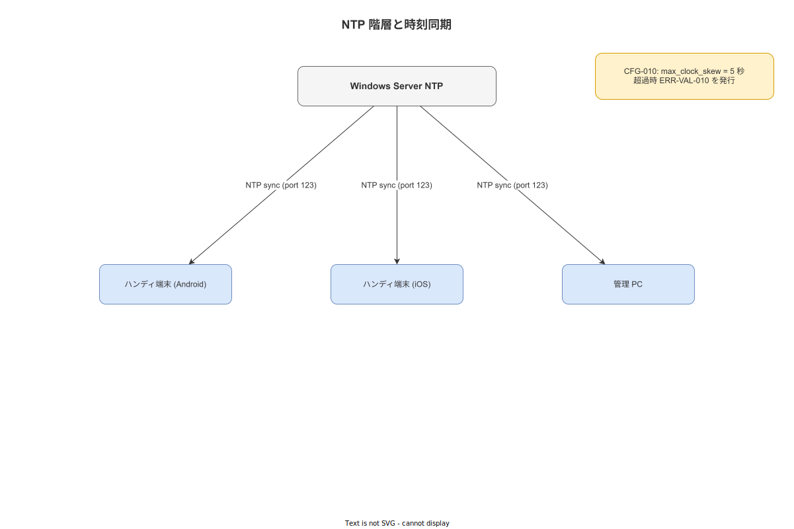

# 05 アドレッシング・名前解決・時刻同期

本章は、単一建屋・単一工場のオンプレミス環境において、ハンディ端末・サーバー・管理端末が相互に通信するために必要なIPアドレス体系、名前解決方式、およびNTP時刻同期方式を確定する。時刻同期はALCOA+原則の「C = Contemporaneous（同時性）」に直結し、max_clock_skewの超過を検出した場合はイベントをERR-VAL-010として拒絶する実装上の要件を持つ。本章で確定した設定パラメータはCFG識別子で管理し、後続のセキュリティ方式設計（07サブ）および運用方式設計（08サブ）の入力とする。

---

## 1. IPアドレス体系

### 1-1. 採用アドレス空間

本システムはRFC 1918プライベートアドレス空間を使用する。工場LAN全体のアドレス帯はネットワーク構成設計（`04_ネットワーク構成とゾーニング.md`）が確定したゾーニングに従う。

| セグメント | 推奨アドレス帯 | サブネットマスク | 備考 |
|---|---|---|---|
| 工場LAN（ハンディ端末・管理端末） | 192.168.10.0/24 または 10.10.0.0/24 | /24 | 実環境のアドレス帯に合わせて選択する |
| サーバーセグメント（管理LAN） | 192.168.1.0/24 または 10.10.1.0/24 | /24 | サーバーは固定IPを割り当てる |

アドレス帯の最終選択は構築フェーズで確定する。本書はプライベートアドレス空間（192.168.x.x または 10.x.x.x）を使用することを確定し、インターネットルーティング可能なアドレスは使用しないことを確定する。

### 1-2. サーバー固定IPアドレス

Windowsサーバー（NODE-001）は静的IPアドレスを割り当てる。DHCPによるアドレス変更は禁止する。

| ノード | 識別子 | 割当方式 | 用途 |
|---|---|---|---|
| Windows Server 2022（メインサーバー） | NODE-001 | 静的IP（手動設定） | APIサーバー・PostgreSQL・ファイル格納・NTPサーバー |
| Active Standby サーバー（将来増設時） | NODE-002 | 静的IP（手動設定） | ホットスタンバイ（本書の設計スコープ内では単一稼働） |

### 1-3. ハンディ端末のDHCP予約

ハンディ端末（Android / iOS / Windows）はDHCPからIPアドレスを取得する。ただし端末のMACアドレスに対してDHCP予約（固定リース）を設定することで、端末ごとに恒久的に同一IPを割り当てる。

| 設定項目 | 値 |
|---|---|
| DHCP予約方式 | MACアドレスベース固定リース（Windows Server DHCPサービスまたは工場ルーター） |
| リース期間 | 24時間以上（予約端末は事実上無制限） |
| 割当範囲（例） | 192.168.10.100〜192.168.10.199（50台分）または構築時に確定 |

DHCP予約の管理台帳は`08_運用方式設計`で定義する端末台帳（DEVICE-LEDGER）に記録する。

---

## 2. 名前解決方式

### 2-1. ホスト名・内部FQDN

本システムのサーバーは以下のFQDNで識別する。

| ホスト名 | 内部FQDN | 解決先IP | 用途 |
|---|---|---|---|
| wnav-server | wnav-server.factory.local | NODE-001の静的IP | APIエンドポイント・管理画面・NTP |

ドメイン `.factory.local` はWindowsのActive Directory不使用構成の場合でも、DNSサフィックスとして手動設定することで内部FQDNの解決を実現する。

### 2-2. DNSサーバー構成

以下の2方式のいずれかを採用する。構築時にネットワーク環境を確認して選択し、決定を構築手順書に記録する。

| 方式 | 説明 | 採用条件 |
|---|---|---|
| **方式A（推奨）: Windows Server DNSロール** | Windows Server 2022のDNSサーバーロールをインストールし、`factory.local` ゾーンを作成。`wnav-server.factory.local → NODE-001静的IP` のAレコードを登録する。全端末のDNSサーバー設定をNODE-001のIPに向ける。 | Active Directory非使用でもWindows DNSロール単体で使用可能 |
| **方式B（代替）: hostsファイル + mDNS** | NODE-001の`/etc/hosts`（WSL2内）および全端末の`hosts`ファイルに `wnav-server.factory.local` を静的登録する。mDNS（Avahi / Bonjour）によりAndroid/iOS端末の自動探索を補完する。 | 端末台数が少なく、DNS管理コストを最小化したい場合 |

mDNSは補助的探索手段として許容するが、APIエンドポイントの名前解決はDNSまたはhostsファイルによる明示的なFQDN解決に統一する。

### 2-3. 証明書とFQDNの整合

内部CA（KEY-005）が発行するTLSサーバー証明書のCN（Common Name）およびSAN（Subject Alternative Name）には `wnav-server.factory.local` を含める。ハンディ端末およびブラウザは内部CAのルート証明書を信頼ストアに登録することでTLS検証を通過させる。証明書の詳細はセキュリティ方式設計（`07_セキュリティ方式設計`）に委譲する。

---

## 3. NTP時刻同期方式

### 3-1. 設計根拠：ALCOA+同時性要件

ALCOA+原則の「C = Contemporaneous」は、記録が作業実施と同時に生成されることを要求する。本システムではwork_eventsテーブルの`occurred_at`タイムスタンプが受入基準の核心となる。サーバーとハンディ端末の時刻差（クロックスキュー）がmax_clock_skewを超えた場合、イベントの同時性が保証されないためERR-VAL-010として拒絶する。

| パラメータ識別子 | パラメータ名 | 確定値 | 根拠 |
|---|---|---|---|
| CFG-010 | max_clock_skew | 5秒 | ALCOA+同時性の実用的許容範囲。WiFi遅延・端末内部クロック誤差を考慮した上限 |

### 3-2. NTP階層構造

```
[外部NTP参照源（省略可）]
      ↓
[Windows Server 2022（NODE-001） — NTPサーバー（Stratum 2相当）]
      ↓
[ハンディ端末（Android / iOS / Windows） — NTPクライアント]
[管理端末（ブラウザ） — NTPクライアント]
```

**図 1: NTP 階層構成（工場内時刻同期）**



> 原本: [`img/fig_des_sys_ntp_hierarchy.drawio`](img/fig_des_sys_ntp_hierarchy.drawio)

インターネット非接続の工場環境では、Windows Server 2022をNTPサーバーとして機能させ（w32tm /config /manualpeerlist:...）、全ハンディ端末がサーバーのIPアドレスを指定してNTP同期する。外部NTP参照は必須ではないが、月次メンテナンス時に管理者が手動で時刻確認する手順（OPS-NTP-001）を`08_運用方式設計`で定める。

### 3-3. NTPクライアント設定

| 端末OS | NTP設定方法 | ポーリング間隔 |
|---|---|---|
| Android | MDMプロファイルまたはNTPクライアントアプリ経由でNODE-001のIPを指定 | 64秒（NTPデフォルト） |
| iOS | MDMプロファイルでNTPサーバーを指定 | 64秒（NTPデフォルト） |
| Windows（ハンディ） | `w32tm /config /manualpeerlist:<NODE-001-IP>` | 64秒 |
| Windows Server 2022（NODE-001自身） | 外部NTP参照なしの場合はローカルクロックをStratum 2として設定 | — |

### 3-4. クロックスキュー検証の実装仕様

バックエンド（Rust + axum）は、受信したAPIリクエストに含まれるイベントの`occurred_at`（端末ローカルタイム）とサーバーの`Utc::now()`を比較する。

| 判定条件 | 処置 | エラーコード |
|---|---|---|
| `|occurred_at - server_time| ≤ 5秒` | 正常受付 | — |
| `|occurred_at - server_time| > 5秒` | 拒絶（HTTP 422） | ERR-VAL-010 |

ERR-VAL-010発生時はログ（LOG-VAL-010）としてserver側に記録し、ハンディ端末には「時刻同期エラー：端末の時刻を確認してください」メッセージを表示する（SCR-HA-ERR-010相当）。エラーログはサーバーログ（LOG-NNN体系）に記録し、時刻ずれの傾向分析に使用する。

---

## 4. CFGパラメータ一覧（本章確定分）

| 識別子 | パラメータ名 | 確定値 | 設定場所 |
|---|---|---|---|
| CFG-010 | max_clock_skew | 5秒 | バックエンド設定ファイル（`config.toml`） |
| CFG-011 | ntp_server_host | NODE-001の静的IP | ハンディ端末MDMプロファイル・端末設定 |
| CFG-012 | internal_fqdn | wnav-server.factory.local | DNS Aレコード・hostsファイル・TLS証明書SAN |

---

**本節で確定した方針**

- **IPアドレス体系はRFC 1918プライベートアドレス空間（192.168.x.x または 10.x.x.x）に限定し、NODE-001（Windows Server 2022）に静的IPを割り当て、ハンディ端末はMACアドレスDHCP予約によって恒久的に同一IPを取得する。**
- **名前解決は `wnav-server.factory.local` の内部FQDNをWindows Server DNSロール（推奨）またはhostsファイル+mDNSで解決し、内部CAが発行するTLS証明書のSANに当該FQDNを含める。**
- **NTP時刻同期はNODE-001をNTPサーバーとして全ハンディ端末が同期し、CFG-010（max_clock_skew = 5秒）を超えるクロックスキューを持つイベントをERR-VAL-010として拒絶することでALCOA+同時性を保証する。**

---

## 参照業界分析

### 必須
- [`90_業界分析/03_作業標準化と生産方式.md`](../90_業界分析/03_作業標準化と生産方式.md) — 工場LAN環境の標準的ネットワーク構成要件
- [`90_業界分析/06_品質管理とトレーサビリティ.md`](../90_業界分析/06_品質管理とトレーサビリティ.md) — ALCOA+同時性要件の業界的根拠

### 関連
- [`90_業界分析/01_作業の定義と分類.md`](../90_業界分析/01_作業の定義と分類.md)
- [`90_業界分析/27_オフライン同期とデータ整合性.md`](../90_業界分析/27_オフライン同期とデータ整合性.md) — クロックスキューがオフライン同期のデータ整合性に与える影響
