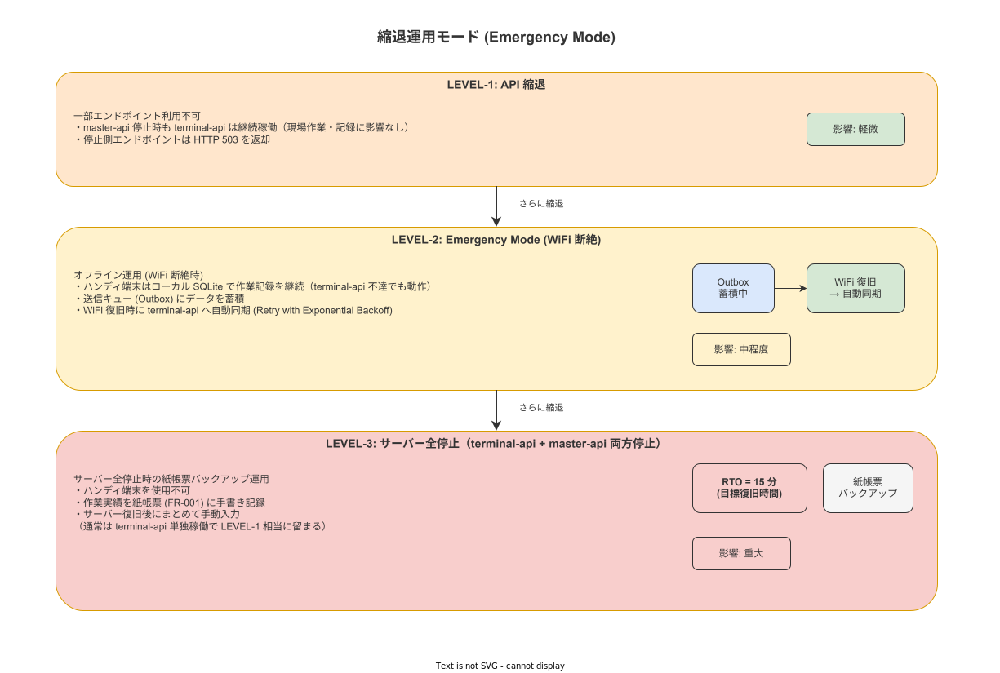

# 08 可用性方式（クラスタ・バックアップ・縮退）

本章は、NFR-AVL-001〜010が要求する可用性目標を実現するためのバックアップ戦略、縮退（Emergency Mode）動作、およびリカバリ手順の方式を確定する。単一建屋・個人運用（1名）という制約から自動フェイルオーバーは対象外と判断し（D-SYS-005参照）、手動フェイルオーバーを前提としたRTO・RPOを確定する。縮退設計はOffline-Firstアーキテクチャ原則（企画/システム化計画/05_アーキテクチャ原則）と整合し、WiFi切断時もオペレーターが作業を継続できることをシステムの根幹設計とする。

---

## 1. 可用性目標

| 指標 | 確定値 | 根拠 |
|---|---|---|
| 可用性（Availability） | 99.5%以上（計画メンテナンスを除く） | NFR-AVL-001。99.5% = 年間43.8時間以下の計画外停止を許容 |
| RTO（目標復旧時間） | 15分（system_adminによる手動フェイルオーバー） | NFR-AVL-002。個人運用のため自動フェイルオーバーは採用しない（D-SYS-005） |
| RPO（目標復旧時点） | 1時間（WALアーカイブ頻度に準拠） | NFR-AVL-003。WALアーカイブは継続的に実行し最大1時間分のトランザクションが消失リスク |
| 計画メンテナンスウィンドウ | 毎週日曜 02:00〜04:00（2時間上限） | NFR-AVL-004。運用方式設計（08_運用方式設計）で詳細手順を確定 |

---

## 2. バックアップ戦略

### 2-1. バックアップ種別と実行スケジュール

| バックアップ種別 | 識別子 | 実行タイミング | 保持期間 | 手順 |
|---|---|---|---|---|
| PostgreSQL フルバックアップ（pg_dump） | BAT-001 | 毎日 02:00（計画メンテナンスウィンドウ冒頭） | 7世代（7日分） | `pg_dump -Fc wnavdb > backup_YYYYMMDD.dump` |
| WALアーカイブ（継続） | BAT-002 | 継続的（WALセグメントが16MB蓄積されるたびに自動実行） | 14日間（pg_archivecleanupで自動削除） | archive_commandによる自動実行 |
| エビデンスファイル（rsync差分） | BAT-003 | 毎日 03:00（フルバックアップ完了後） | スタンバイサーバーに1世代（差分同期） | `rsync -avz --delete /evidence/ standby:/evidence/` |

バックアップスケジュールの詳細（失敗通知・リトライ・ログ保存先）は`08_運用方式設計`に委譲する。

### 2-2. バックアップ暗号化

| 設定項目 | 確定値 | 根拠 |
|---|---|---|
| バックアップ暗号化アルゴリズム | AES-256-GCM | NFR-SEC-040相当。鍵管理はKEY-004（バックアップ暗号化鍵）が担う |
| 暗号化鍵管理 | KEY-004（バックアップ暗号化鍵）。詳細は`07_セキュリティ方式設計`に委譲 | 鍵はバックアップデータと分離して保管（USBまたはセキュアな保管庫） |
| バックアップ完全性検証 | SHA-256ハッシュをバックアップファイルと並列生成。復元時に照合 | 転送中の改ざん・腐食を検出 |

### 2-3. バックアップ復元テスト

| テスト種別 | 頻度 | 実施者 | 手順 |
|---|---|---|---|
| フル復元テスト（pg_restore） | 月次（毎月最終日曜） | system_admin（手動） | 別環境（テスト用PC等）にpg_restoreを実行し、レコード件数・最終更新タイムスタンプを本番と比較 |
| WAL PITRテスト | 四半期に1回 | system_admin（手動） | 特定の過去時点へのPoint-In-Time Recoveryを実施し、データの整合性を確認 |

復元テストの結果は`08_運用方式設計`で定める運用台帳に記録し、次の本番障害時の復旧手順の根拠とする。

---

## 3. 縮退モード（Emergency Mode）設計

### 3-1. 縮退モードの定義

縮退モード（Emergency Mode）は、ハンディ端末がサーバーへのWiFi接続を失った際に、作業記録の継続性を保つための動作モードである。Offline-Firstアーキテクチャ原則を実装するための具体的方式として確定する。

**バックエンド 2 バイナリ分離による障害ドメイン分離**:
- `terminal-api`（ポート 8080）がダウンしても `master-api`（ポート 8081）は稼働継続し、マスタメンテナンス・承認・監査業務は継続できる。
- `master-api` のメンテナンス中も現場の作業記録（`terminal-api`）は継続稼働するため、生産ラインへの影響を最小化できる。
- **terminal-api 単独稼働シナリオ**: `master-api` が停止状態であっても、`terminal-api` のみで作業ナビゲーション・実績記録・Outbox 同期の全機能が稼働する。これにより、マスタメンテナンス側の障害が生産現場に波及しない縮退構成を実現する。

**図 1: 縮退モード（Emergency Mode）動作フロー**

> 原本: [`img/fig_des_deploy_degraded_mode.drawio`](img/fig_des_deploy_degraded_mode.drawio)

### 3-2. 縮退モード遷移条件

| 条件 | 方向 | 詳細 |
|---|---|---|
| WiFi切断継続 > CFG-003（5分） | 通常 → Emergency Mode | 端末が5分間サーバーに到達できない場合にEmergency Modeへ自動移行 |
| サーバー再接続確認（HTTP GET /api/health 成功） | Emergency Mode → 通常（同期処理） | 接続復旧を検出したらOutbox同期プロセスを開始 |

CFG-003（offline_emergency_timeout = 5分）はCFG識別子で管理し、`07_OS・ミドルウェア設定方針`のCFGパラメータ一覧に記載済みである。

### 3-3. Emergency Mode中の利用可否

| 機能 | 識別子 | Emergency Mode中の利用可否 | 理由 |
|---|---|---|---|
| 作業手順実行（ステップ進行・完了） | SCR-HA-002〜014 | 利用可能（ローカルSQLiteキャッシュ） | 作業継続がシステムの最重要目的。マスタデータはローカルにキャッシュ済み |
| QRコードスキャン・工程番号入力 | SCR-HA-003〜005 | 利用可能 | ローカル処理のみ |
| エビデンス写真撮影・一時保存 | SCR-HA-010〜012 | 利用可能（端末ローカル保存） | SQLiteにメタデータ・バイナリをOutbox待ちで保存 |
| アンドン発報 | SCR-HA-020 | 利用可能（Outbox蓄積） | 発報は記録されるが即時配信はできない |
| ログイン（新規） | SCR-HA-001 | 利用不可（サーバー認証が必要） | 既ログイン済みセッション（JWT）が有効な場合のみ作業継続可 |
| マスタデータ同期 | SCR-HA-030 | 利用不可 | サーバー接続が必須 |
| 帳票・レポート生成 | SCR-MA-020〜025 | 利用不可 | サーバー側バッチ処理が必要 |

既存のJWTセッションが有効な場合（CFG-002で定めるJWT有効期限内）、ログイン済みユーザーはEmergency Modeでも全作業手順実行画面（SCR-HA-002〜014）を継続して使用できる。

### 3-4. Emergency Mode中のデータ保全

| 保全機構 | 実装方式 | 詳細 |
|---|---|---|
| ローカルSQLite（暗号化） | SQLite WAL + SQLCipher（AES-256-CBC） | ローカルDBへの書き込みはSQLite WALモードで保証され、突然の電源断でもデータ整合性を維持 |
| Outboxパターン | outbox_events テーブル（ローカルSQLite内） | サーバーへの送信が必要なイベントをOutboxに蓄積。冪等性キー（idempotency_key）付き |
| ハッシュチェーン | work_events.prev_hash → SHA-256チェーン | Emergencymode中もローカルでチェーン計算。再接続後にサーバー側と突合・検証 |

### 3-5. Emergency Mode からの復旧シーケンス

1. サーバー接続確認（HTTP GET /api/health 成功）を検出
2. ハンディAPPがOutbox内の未送信イベントをFIFO順にサーバーへ送信
3. 各イベントに付与されたidempotency_keyでサーバー側が重複を排除
4. すべてのOutboxイベントの送信完了を確認
5. ハッシュチェーンの整合性をサーバー側と突合（prev_hash 連続性検証）
6. 突合成功後、通常モードに復帰
7. 突合失敗（ハッシュ不整合）の場合はERR-SYNC-001としてsystem_adminに通知

<!-- 図 2: Emergency Mode 復旧シーケンス（fig_des_sys_emergency_recovery.svg）— SVG ファイル未作成のため埋め込みをスキップ -->

---

## 4. 復旧手順概要（手動フェイルオーバー）

RTO 15分以内の手動フェイルオーバー手順を以下に確定する。詳細手順書（SOP）は`08_運用方式設計`に委譲する。

| ステップ | 作業内容 | 所要時間目安 |
|---|---|---|
| 1. 障害確認 | エラーログ確認・サービス状態確認（docker ps, systemctl status） | 2分 |
| 2. PostgreSQL停止確認 | `pg_ctl status` / コンテナ状態確認 | 1分 |
| 3. WALアーカイブ確認 | 最新アーカイブファイルのタイムスタンプ確認（RPO算定） | 1分 |
| 4. サービス再起動 | `docker compose restart terminal-api master-api postgres` | 3分 |
| 5. ヘルスチェック | `localhost:8080/api/health` および `localhost:8081/api/health` 確認・PostgreSQL接続確認 | 2分 |
| 6. pg_restoreによる復元（必要時） | 最新バックアップから復元（pg_restore） | 5分 |
| **合計** | | **≤ 15分** |

---

**本節で確定した方針**

- **可用性目標は99.5%（計画外停止年間43.8時間以内）・RTO 15分（手動）・RPO 1時間（WALアーカイブ）として確定し、自動フェイルオーバーは個人運用の複雑さが利益を超えるため採用しない（D-SYS-005）。**
- **バックアップはpg_dumpフルバックアップ（日次・7世代）とWALアーカイブ（継続・14日保持）を組み合わせ、AES-256-GCM（KEY-004）で暗号化し、月次復元テストで確実性を検証する。**
- **Emergency Mode（WiFi切断5分超）はSCR-HA-002〜014の全作業手順実行画面をローカルSQLite（SQLCipher）+ Outboxパターンで継続可能とし、再接続後のOutbox同期・ハッシュチェーン突合でデータ整合性を保証する。**
- **バックエンド 2 バイナリ分離（`terminal-api` / `master-api`）による障害ドメイン分離を確定し、一方のサービス障害が他方に波及しない設計を実現する。`master-api` メンテナンス中も `terminal-api` 単独で現場作業を継続できる縮退シナリオを本方式設計に含める。**

---

## 参照業界分析

### 必須
- [`90_業界分析/03_作業標準化と生産方式.md`](../90_業界分析/03_作業標準化と生産方式.md) — 工場での作業継続性要件（生産停止コスト）
- [`90_業界分析/27_オフライン同期とデータ整合性.md`](../90_業界分析/27_オフライン同期とデータ整合性.md) — Offline-First + Outboxパターンの業界的根拠・データ整合性設計

### 関連
- [`90_業界分析/07_スマートファクトリーと作業のデジタル化.md`](../90_業界分析/07_スマートファクトリーと作業のデジタル化.md) — WiFi環境の不安定性と縮退設計の必要性
- [`90_業界分析/38_災害・BCP・緊急時手順と作業継続.md`](../90_業界分析/38_災害・BCP・緊急時手順と作業継続.md) — BCP観点からのEmergency Mode設計根拠
