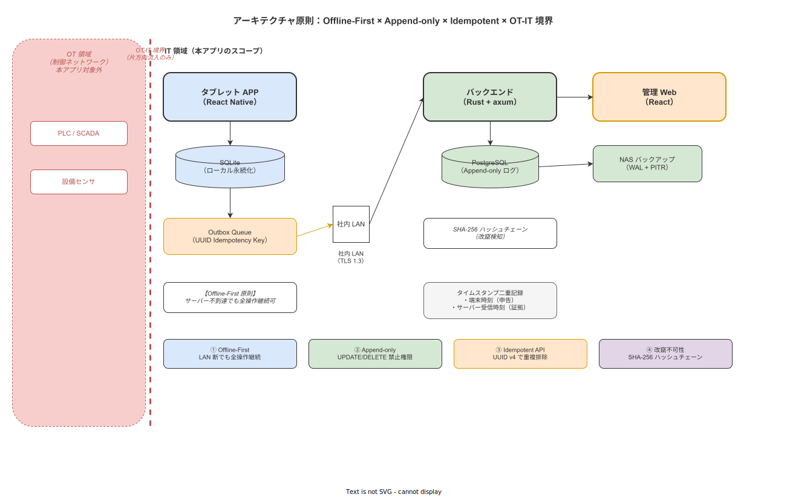

# 01 概要設計の前提継承と上流リンケージ

本章の責務は、概要設計（04_概要設計）が受け取る上流成果物の全量を本書の入力として明示し、各上流要件 ID を概要設計の担当サブ・担当章に配布する対応表を確定することである。本章は概要設計全体のトレーサビリティの起点となる権威文書である。

---

## 1. 上流文書の階層と引き継ぎ構造

### 1-1. 上流文書一覧

概要設計が引き継ぐ上流文書の全量を以下に確定する。各文書に記載された確定事項は本書の前提であり、本書での再検討は禁止する。

| 層 | 文書 | 引き継ぐ核心事項 |
|---|---|---|
| 企画・構想 | `02_企画/システム化構想/05_プロダクトビジョン.md` | Intrinsic EPSS × ALCOA+ × Just Culture 三位一体 |
| 企画・構想 | `02_企画/システム化構想/04_倫理スタンスと支援・監視の意図的分離.md` | 用途三限定・個人別ランキング禁止・監視スタンスの永続的否定 |
| 企画・構想 | `02_企画/システム化構想/13_データオーナーシップと永続性の宣言.md` | データ所有者 = 導入先組織・エクスポート権保証・ロックイン禁止 |
| 企画・計画 | `02_企画/システム化計画/05_アーキテクチャ原則.md` | **7 アーキテクチャ原則（変更不可の最高権威）** |
| 企画・計画 | `02_企画/システム化計画/06_データモデル中核設計.md` | 3 階層手順モデル・ALCOA+ 9 原則展開・イベントストア構造（9 種）・XES 8 必須属性 |
| 企画・計画 | `02_企画/システム化計画/07_技術スタック選定根拠.md` | React Native・Rust Edition 2024 / axum・PostgreSQL 16・Docker の選定確定 |
| 企画・計画 | `02_企画/システム化計画/12_外部システム連携アーキテクチャ（子機モード）.md` | 連携モード 3 形態・external_key_binding 設計・Outbox Pattern |
| 企画・計画 | `02_企画/システム化計画/15_セキュリティ深堀り.md` | JWT RS256・RBAC 6 ロール・暗号化 4 対象・ALCOA+ × セキュリティ展開 |
| 企画・計画 | `02_企画/システム化計画/18_拡張可能Stepエンジン（アドオン機構）.md` | 標準 4 タイプ・拡張 Step DSL・DAG 検証・条件分岐 JSON Logic |
| 企画・計画 | `02_企画/システム化計画/19_マスタ編集者体験設計（オーサリングUXとガバナンス）.md` | 5 不変条件・参照整合性 dry-run・ビジュアル DSL エディタ |
| 企画・計画 | `02_企画/システム化計画/16_ビジネスモデルとライセンス戦略.md` | MIT ライセンス・Solo Edition / Connected Edition の 2 エディション |
| 企画・計画 | `02_企画/システム化計画/13_データ移行とマスタ初期投入戦略.md` | CSV プレビュー必須・自動投入禁止・`is_legacy: true` フラグ |
| 要件定義 | `03_要件定義/機能要件/01_機能一覧（FRリスト）.md` | FR-NV/EV/ST/MA/SY/KZ/AU/UI 全 86 件 |
| 要件定義 | `03_要件定義/機能要件/02_ユースケース総覧と関係図.md` | UC-001〜022 全 22 件・includes/extends 関係 |
| 要件定義 | `03_要件定義/機能要件/09_画面・機能対応表.md` | SCR-HA/MA/MC 全 35 件・ロールアクセス可否 |
| 要件定義 | `03_要件定義/機能要件/10_業務ルールとバリデーション定義.md` | BR-BUS-001〜045 全 45 件 |
| 要件定義 | `03_要件定義/機能要件/11_状態遷移定義.md` | 状態機械 5 種 |
| 要件定義 | `03_要件定義/機能要件/12_データ要件（論理）.md` | EN-001〜027 全 27 エンティティ |
| 要件定義 | `03_要件定義/機能要件/13_外部インタフェース要件.md` | IF-001〜007 全 7 件 |
| 要件定義 | `03_要件定義/機能要件/14_帳票・出力要件.md` | RP-001〜006 全 6 件 |
| 要件定義 | `03_要件定義/非機能要件/` 全章 | NFR 全 130 件以上（11 カテゴリ） |
| 要件定義 | `03_要件定義/運用要件/` 全章 | OPS 全件（OPS-001〜082） |
| 要件定義 | `03_要件定義/移行要件/` 全章 | MIG 全件 |

---

## 2. 7 アーキテクチャ原則の継承

企画/システム化計画/05 章が確定した 7 アーキテクチャ原則は、概要設計の全設計命題の基盤となる。各サブは当該原則に矛盾する設計命題を出力してはならない。

| 原則 | 内容 | 概要設計への主要影響 |
|---|---|---|
| **P1: Offline-First** | ネットワーク状態は 4 段階（高品質/低品質/切断/Emergency）。端末ローカルが一次記録メモリ | 04_データ設計: SQLite 物理設計、02_ソフトウェア方式設計: Outbox Consumer |
| **P2: Append-only Event Sourcing** | 作業ログへの UPDATE/DELETE を DB ロールで禁止。修正は訂正イベント追記のみ | 04_データ設計: TBL-001 work_events の INSERT 専用ロール、07_セキュリティ: DB ロール分離 |
| **P3: Idempotent API + Outbox Pattern** | 全書き込みに UUID v4/v7 Idempotency Key 必須。Outbox テーブルは永続保持 | 05_外部IF設計: Idempotency-Key ヘッダ設計、04_データ設計: outbox_events テーブル |
| **P4: OT-IT 境界の永続的分離** | OT への制御信号送信は永続的に禁止。PLC/SCADA/OPC-UA/MQTT は永続非提供 | 01_システム方式設計・05_外部IF設計: IF に OT 系を含めない |
| **P5: 改竄不可性（3 層保証）** | DB 権限禁止（第 1 層）・訂正イベント方式（第 2 層）・SHA-256 ハッシュチェーン（第 3 層） | 04_データ設計: hash_chain 設計、07_セキュリティ: 監査証跡 |
| **P6: データオーナーシップ** | データ所有者は導入先組織。エクスポート 3 手段維持。ロックイン禁止 | 04_データ設計: エクスポート API 設計、09_移行: 移行方式 |
| **P7: Step エンジンのプラガビリティ** | 定義データ（JSON）はサーバー格納、実行はクライアントランタイム解釈。eval 禁止 | 02_ソフトウェア方式設計: Step エンジン設計 |

**図 1: 7 アーキテクチャ原則（企画/計画 05 章 原本継承）**

> 原本: [`../02_企画/システム化計画/img/fig_architecture_principles.drawio`](../02_企画/システム化計画/img/fig_architecture_principles.drawio)

---

## 3. 機能要件の担当サブへの配布

### 3-1. FR × 担当サブ マッピング表

| FR カテゴリ | 件数 | 主担当サブ | 副担当サブ |
|---|---|---|---|
| FR-NV（ナビゲーション） | 13 | 02_ソフトウェア方式設計 | 03_画面設計・04_データ設計 |
| FR-EV（証拠記録） | 12 | 02_ソフトウェア方式設計 | 04_データ設計・05_外部IF設計 |
| FR-ST（中断・再開・アンドン） | 12 | 02_ソフトウェア方式設計 | 03_画面設計・04_データ設計 |
| FR-MA（マスタ管理） | 15 | 02_ソフトウェア方式設計 | 03_画面設計・04_データ設計 |
| FR-SY（同期・連携） | 9 | 05_外部インターフェース設計 | 02_ソフトウェア方式設計・04_データ設計 |
| FR-KZ（Kaizen/CAPA） | 8 | 02_ソフトウェア方式設計 | 04_データ設計・06_帳票設計 |
| FR-AU（認証認可） | 6 | 07_セキュリティ方式設計 | 05_外部IF設計・02_ソフトウェア方式設計 |
| FR-UI（UI/UX） | 11 | 03_画面設計 | 02_ソフトウェア方式設計 |

### 3-2. UC × 担当サブ マッピング表

| UC 範囲 | 主担当サブ |
|---|---|
| UC-001〜004（作業開始・Step 実行） | 02_ソフトウェア方式設計・03_画面設計・05_外部IF設計（SEQ） |
| UC-005〜008（多言語・写真・測定値・QR） | 03_画面設計・05_外部IF設計 |
| UC-009（電子サイン） | 07_セキュリティ方式設計・05_外部IF設計 |
| UC-010〜012（中断・再開・アンドン） | 02_ソフトウェア方式設計・03_画面設計 |
| UC-013（不適合登録） | 02_ソフトウェア方式設計・06_帳票設計 |
| UC-014〜017（マスタ管理） | 02_ソフトウェア方式設計・03_画面設計・07_セキュリティ |
| UC-018（ユーザー/ロール管理） | 07_セキュリティ方式設計 |
| UC-019〜022（同期・縮退） | 05_外部インターフェース設計・01_システム方式設計 |

---

## 4. 非機能要件の担当サブへの配布

| NFR カテゴリ | 件数（概数） | 主担当サブ |
|---|---|---|
| NFR-AVL（可用性） | 20 | 01_システム方式設計・08_運用方式設計 |
| NFR-PRF（性能・拡張性） | 20 | 04_データ設計（インデックス）・05_外部IF設計（API 性能）・01_システム方式設計（サイジング） |
| NFR-SEC（セキュリティ） | 52 | 07_セキュリティ方式設計 |
| NFR-MNT（運用・保守性） | 42 | 08_運用方式設計・10_テスト方式設計 |
| NFR-PRT（移植性） | — | 01_システム方式設計 |
| NFR-ETH（倫理品質） | — | 07_セキュリティ方式設計（§08 倫理ガード） |
| NFR-OPS（運用要件） | 42 | 08_運用方式設計 |
| NFR-QUA（品質特性） | 41 | 02_ソフトウェア方式設計・10_テスト方式設計 |
| NFR-DQ（データ品質/ALCOA+） | 40 | 04_データ設計・07_セキュリティ方式設計 |
| NFR-UX（ユーザビリティ/A11y） | 43 | 03_画面設計 |
| NFR-ENV（システム環境・エコロジー） | 61 | 01_システム方式設計 |

---

## 5. 論理エンティティの担当サブへの配布

| EN 範囲 | 種別 | 主担当サブ |
|---|---|---|
| EN-001〜004（User/Role/Skill/UserSkill） | マスタ | 04_データ設計・07_セキュリティ方式設計 |
| EN-005〜010（Process/Operation/Product/SOP/Step/MasterVersion） | マスタ（版管理） | 04_データ設計 |
| EN-011〜016（WorkInstance/WorkEvent/EvidenceFile/Measurement/ElectronicSign/Suspension） | トランザクション | 04_データ設計・02_ソフトウェア方式設計 |
| EN-017〜021（AndonAlert/Nonconformity/CAPA/Kaizen/OutboxEvent） | トランザクション | 04_データ設計 |
| EN-022〜027（AuthLog/Device/DeviceSyncState/HashChainBlock/BackupLog/ConfigSnapshot） | 制御・ログ | 04_データ設計・07_セキュリティ方式設計 |

---

## 6. 外部インタフェースの担当サブへの配布

| IF ID | 名称 | 主担当サブ |
|---|---|---|
| IF-001 | 親機 ⇔ 子機マスタ同期 | 05_外部インターフェース設計（§04） |
| IF-002 | 子機 → 親機 Outbox 実績送信 | 05_外部インターフェース設計（§05） |
| IF-003 | 認証連携（LDAP/AD） | 05_外部インターフェース設計（§06） |
| IF-004 | プリンタ印刷 | 05_外部インターフェース設計（§07） |
| IF-005 | バーコード/QR スキャナ | 05_外部インターフェース設計（§08） |
| IF-006 | IoT 計測器 | 05_外部インターフェース設計（§08） |
| IF-007 | カメラ | 05_外部インターフェース設計（§09） |

---

## 7. 帳票要件の担当サブへの配布

| RP ID | 名称 | 主担当サブ |
|---|---|---|
| RP-001 | SOP 実行記録 | 06_帳票設計（§03） |
| RP-002 | 監査ログ（XES） | 06_帳票設計（§04） |
| RP-003 | 不適合・CAPA レポート | 06_帳票設計（§05） |
| RP-004 | Kaizen 集計レポート | 06_帳票設計（§06） |
| RP-005 | 設備点検記録 | 06_帳票設計（§07） |
| RP-006 | 期間集計レポート | 06_帳票設計（§08） |

---

## 8. 移行・運用・テスト要件の担当サブへの配布

| 要件種別 | 主担当サブ |
|---|---|
| MIG（移行要件）全件 | 09_移行方式設計 |
| OPS-001〜017（運用体制） | 08_運用方式設計（§01・§10） |
| OPS-020〜035（運用カレンダー・シフト） | 08_運用方式設計（§07） |
| OPS-036〜053（SLI/SLO・ダッシュボード） | 08_運用方式設計（§03・§08） |
| OPS-054〜066（障害対応・エスカレーション） | 08_運用方式設計（§01） |
| OPS-067〜082（BCP・縮退） | 08_運用方式設計（§07） |
| TST（テスト要件）全件 | 10_テスト方式設計 |

---

**本節で確定した方針**
- **上流成果物（企画・要件定義）の全量を確定し、86 FR・27 EN・35 SCR・7 IF・6 RP を担当サブに過不足なく配布する。**
- **7 アーキテクチャ原則は概要設計の全設計命題に対する最高権威であり、原則との矛盾は設計命題として出力しない。**
- **本章は概要設計全体のトレーサビリティの起点として機能し、上流 ID から設計 ID への変換を付録/DTM が担保する。**

---

## 参照業界分析

### 必須
- [`90_業界分析/06_品質管理とトレーサビリティ.md`](../90_業界分析/06_品質管理とトレーサビリティ.md)

### 関連
- [`90_業界分析/07_スマートファクトリーと作業のデジタル化.md`](../90_業界分析/07_スマートファクトリーと作業のデジタル化.md)
- [`90_業界分析/27_オフライン同期とデータ整合性.md`](../90_業界分析/27_オフライン同期とデータ整合性.md)
