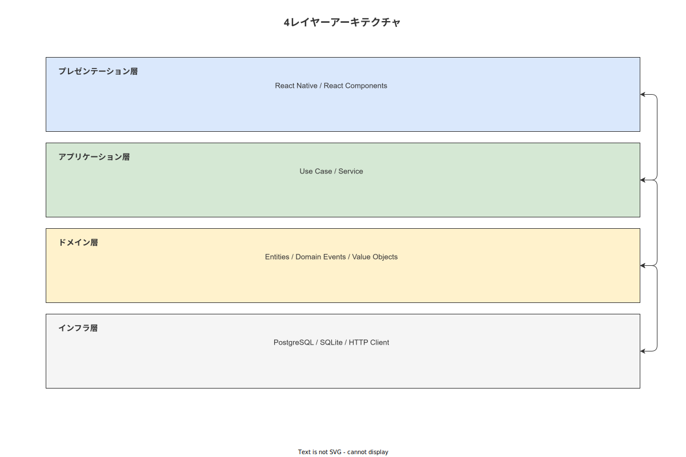

# 01 ソフトウェア全体アーキテクチャと 7 原則継承

本章の責務は、企画/計画/05 章が確定した 7 アーキテクチャ原則をソフトウェア設計（コンポーネント・レイヤー・処理フロー）に具体的に降ろす方法を確定することである。

**図 1: ソフトウェアレイヤー構成（3 アプリ対応）**



> 原本: [`img/fig_des_arch_layered.drawio`](img/fig_des_arch_layered.drawio)

---

## 1. 7 原則のソフトウェア設計への落とし込み

| 原則 | ソフトウェア設計での具体的実装 | 担当モジュール |
|---|---|---|
| **P1: Offline-First** | - ハンディ APP はネットワーク不在でも全 Step 実行可能<br>- SQLite（SQLCipher）を端末 DB として常時読み書き<br>- Outbox Pattern で非同期サーバー同期 | MOD-FE-HA（NetworkProvider）・MOD-FE-HA（OutboxWorker）|
| **P2: Append-only Event Sourcing** | - WorkEvent の INSERT のみ許可する `app_event_writer` ロールに接続する専用サービス<br>- 修正操作は必ず `step_rejected` + 再 `step_completed` イベント追記で実現 | MOD-BE（EventService）|
| **P3: Idempotent API + Outbox** | - 全書き込み API は `Idempotency-Key` ヘッダを必須検証<br>- TBL-035（idempotency_keys）で重複検出後は再計算せず前回レスポンスを返す | MOD-BE（IdempotencyMiddleware）|
| **P4: OT-IT 境界の永続分離** | - OT 接続する API エンドポイント・モジュールを作成しない<br>- IF 一覧（IF-001〜007）に OT 系 IF を含めない | （設計上の非存在）|
| **P5: 改竄不可性 3 層** | - DB ロール（MOD-IN）・訂正イベント（EventService）・ハッシュチェーン（HashChainService）| MOD-IN-001・MOD-BE-003|
| **P6: データオーナーシップ** | - SQL 直接・CSV・OpenAPI JSON の 3 エクスポート手段<br>- 独自バイナリ形式を使わない | MOD-BE（ExportService）|
| **P7: Step エンジンのプラガビリティ** | - StepEngine はインターフェース定義に対して実装する<br>- JSON Logic（Apache 2.0）のみで条件評価<br>- eval / Function constructor 禁止 | MOD-FE-HA（StepEngine）|

---

## 2. システム構成の技術選定（確定済み・変更不可）

| コンポーネント | 技術 | 版 | 役割 |
|---|---|---|---|
| ハンディ APP | React Native + TypeScript | RN 0.73+ | SOP ナビゲーション・証拠記録・Offline-First |
| ハンディ DB | SQLite + TypeORM + SQLCipher | — | ローカル記録・Outbox・マスタキャッシュ |
| マスタメンテ APP | React + TypeScript（Vite）| React 18+ | SOP 編集・マスタ管理 |
| 管理コンソール | React + TypeScript（Vite）| React 18+ | ユーザー管理・監査・運用ダッシュボード |
| バックエンド | Rust Edition 2024 + tokio + axum + sqlx | Rust 1.82+ | REST API・Outbox Consumer・ハッシュ検証 |
| DB（サーバー）| PostgreSQL 16+ | — | 正本データ |
| コンテナ | Docker Compose | — | バックエンド・PostgreSQL を Docker 化 |
| リバースプロキシ | IIS（URL Rewrite）| — | HTTP → HTTPS リダイレクト・静的ファイル |

---

## 3. 3 アプリケーションの役割分担

| アプリ | 主責務 | アクセスできない機能 |
|---|---|---|
| ハンディ APP (FE-HA) | Step 実行・証拠記録・中断・アンドン・マスタ受信 | マスタ編集・ユーザー管理・監査ログ直接閲覧 |
| マスタメンテ APP (FE-MA) | SOP/Step 編集・承認・公開・廃止 | 作業ログ直接閲覧（品質担当 SCR 経由は可）|
| 管理コンソール (FE-MC) | ユーザー管理・監査ログ・XES エクスポート・バックアップ | 作業実行（operator ロールなし）|

---

## 4. バックエンドの crate 構成（最上位）

Rust バックエンドは以下の cargo workspace 構成を採用する。バックエンドは **2 バイナリに分割**し、DB ロールの物理分離・独立可用性・セキュリティ境界を保証する。

```
work-navigation-backend/
  Cargo.toml          # workspace 定義
  ├── crates/
  │   ├── wnav_terminal_api/ MOD-BE-001  ハンディ端末向け axum ルータ・ミドルウェア（Idempotency・レート制限・作業ログ受信・Outbox Consumer）
  │   ├── wnav_master_api/   MOD-BE-010  マスタメンテ・管理コンソール向け axum ルータ・ミドルウェア（SOP 編集・承認・監査・ユーザー管理・HashChainVerifier）
  │   ├── wnav_domain/       MOD-BE-002  ドメインモデル・サービス・リポジトリ trait
  │   ├── wnav_hash_chain/   MOD-BE-003  SHA-256 ハッシュチェーン計算・検証
  │   ├── wnav_db/           MOD-BE-004  sqlx クエリ・コネクションプール
  │   ├── wnav_auth/         MOD-BE-005  JWT RS256・RBAC ミドルウェア
  │   ├── wnav_outbox/       MOD-BE-006  Outbox Consumer（常駐 tokio task）
  │   └── wnav_webhook/      MOD-BE-007  Webhook 配信・HMAC 署名
  └── （エントリポイントは各バイナリ crate の src/main.rs）
```

| バイナリ | ポート | 接続 DB ロール | 主な接続元 |
|---|---|---|---|
| `wnav_terminal_api` | 8080 | `app_event_insert` + `app_read` | 工場 LAN のハンディ端末 |
| `wnav_master_api` | 8081 | `app_write` + `app_read` | 管理 LAN の管理 PC |

---

**本節で確定した方針**
- **7 アーキテクチャ原則を具体的なモジュール・処理フロー・禁止事項に落とし込み、ソフトウェア設計全体の整合性の基盤を確定した。**
- **3 アプリ（FE-HA/FE-MA/FE-MC）と 2 バックエンドバイナリ（BE-HA / BE-MA）の役割分担を確定し、アプリ間での機能の越境を設計レベルで禁止した。**
- **Rust バックエンドの cargo workspace crate 構成（wnav_terminal_api/wnav_master_api/domain/hash_chain/db/auth/outbox/webhook の 8 crate）を確定した。**

---

## 参照業界分析

### 必須
- [`90_業界分析/07_スマートファクトリーと作業のデジタル化.md`](../../90_業界分析/07_スマートファクトリーと作業のデジタル化.md)
- [`90_業界分析/27_オフライン同期とデータ整合性.md`](../../90_業界分析/27_オフライン同期とデータ整合性.md)

### 関連
- [`90_業界分析/29_競合製品と作業ナビ・MES・eBR市場.md`](../../90_業界分析/29_競合製品と作業ナビ・MES・eBR市場.md)
