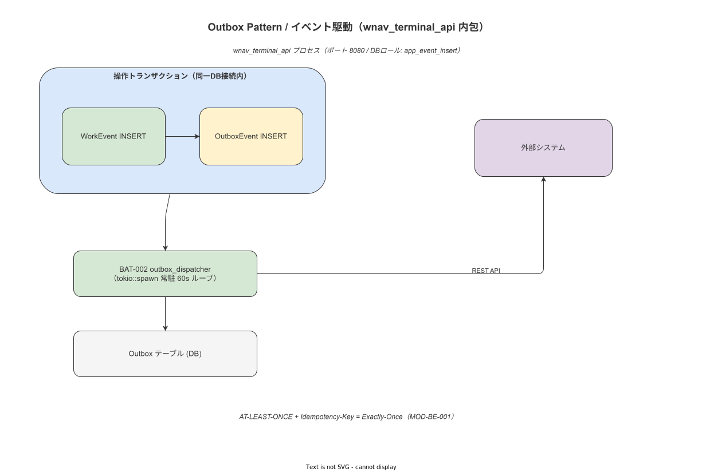

# 05 イベント駆動と内部メッセージング

本章の責務は、Append-only WorkEvent の記録・Outbox Pattern による非同期同期・ドメインイベントの内部配信メカニズムを確定することである。MSG 識別子（MSG-001〜005）の物理的な実装設計を確定する。

**図 1: イベント駆動・Outbox 内部フロー**



> 原本: [`img/fig_des_arch_outbox_event.drawio`](img/fig_des_arch_outbox_event.drawio)

---

## 1. WorkEvent 記録のトランザクション設計（§08 と連動）

WorkEvent の INSERT と Outbox への追加は同一 PostgreSQL トランザクションで行う。

```
[単一トランザクション]
BEGIN;
  -- 1. Idempotency Key 確認
  INSERT INTO idempotency_keys (key, endpoint, ...) ON CONFLICT DO NOTHING;
  -- 2. ハッシュチェーン更新（prev_hash 取得→content_hash 計算）
  SELECT content_hash FROM work_events ORDER BY event_id DESC LIMIT 1 FOR UPDATE;
  -- 3. WorkEvent INSERT
  INSERT INTO work_events (event_id, case_id, ..., prev_hash, content_hash) VALUES (...);
  -- 4. OutboxEvent INSERT（MSG-001）
  INSERT INTO outbox_events (outbox_id, event_id, payload, ...) VALUES (...);
COMMIT;
```

このトランザクションが失敗した場合、両方のレコードが INSERT されないため一貫性が保たれる。

---

## 2. Outbox Consumer（BAT-002）の設計

### 2-1. 動作サイクル

```
BAT-002 (tokio task, 常駐):
  loop:
    1. TBL-003 から PENDING 行を N 件取得（バッチサイズ CFG-002）
    2. status → SENDING に UPDATE（楽観ロック: retry_count で競合検出）
    3. 親機 API（IF-002）または サーバー API（API-sync-002）に POST
    4. 成功時: status → SENT、sent_at = NOW()
    5. 失敗時: retry_count++、next_retry_at = NOW() + backoff(retry_count)
       - retry_count >= CFG-002（デフォルト 5）なら status → DLQ
    6. wait CFG-003（デフォルト 60s）
```

### 2-2. 指数バックオフ計算

```rust
fn backoff_duration(retry_count: u8) -> Duration {
    let base: u64 = 60; // 60 秒
    let max: u64 = 3600; // 最大 1 時間
    let delay = base * 2u64.pow(retry_count as u32);
    Duration::from_secs(delay.min(max))
}
```

### 2-3. DLQ 移行後の処理

DLQ に移行した OutboxEvent は:
1. LOG-008（outbox.dlq.moved）を記録
2. MET-005（outbox.dlq_count）を increment（アラートトリガ）
3. SCR-MC-007（Outbox/DLQ 監視）に表示
4. API-ops-002（/ops/outbox/{id}/requeue）で手動再投入可能

---

## 3. MSG 識別子（MSG-001〜005）の物理実装

| MSG-ID | トピック名 | 実装方式 | バッファ場所 |
|---|---|---|---|
| MSG-001 | outbox.work_event | PostgreSQL Outbox（TBL-003）| DB |
| MSG-002 | outbox.electronic_sign | PostgreSQL Outbox（TBL-003）| DB |
| MSG-003 | webhook.audit_event | PostgreSQL Outbox（TBL-003）| DB |
| MSG-004 | internal.master_published | tokio broadcast channel（容量 100）| メモリ |
| MSG-005 | internal.alert_triggered | tokio broadcast channel（容量 100）| メモリ |

外部 MQ（Kafka・RabbitMQ 等）は対象外と判断する（付録/02・ルート 99 §2-9）。

---

## 4. 端末側 Outbox（ハンディ APP）

ハンディ APP の端末 SQLite にも Outbox テーブルを持つ。構造は TBL-003 と同様（TypeORM エンティティとして定義）。

```typescript
@Entity('outbox_events')
class OutboxEventEntity {
  @PrimaryColumn('text') outbox_id: string;  // UUID v7
  @Column('text') event_type: string;
  @Column('text') status: 'PENDING' | 'SENDING' | 'SENT' | 'FAILED' | 'DLQ';
  @Column('text') payload: string;  // JSON 文字列
  @Column('integer') retry_count: number;
  @Column('text', { nullable: true }) next_retry_at: string | null;
}
```

MOD-FE-HA（OutboxWorker）がバックグラウンドで PENDING を監視し、ネットワーク接続時に BAT-002 と同様の Outbox Consumer として動作する。

---

**本節で確定した方針**
- **WorkEvent INSERT と OutboxEvent INSERT を同一 PostgreSQL トランザクションに包み、At-Least-Once の配信保証と整合性を確保する設計を確定した。**
- **BAT-002（Outbox Consumer）は指数バックオフ（CFG-003 の初期値 60s、最大 1h）で再試行し、5 回失敗後は DLQ（status='DLQ'）に移行して MET-005 でアラートを発生させる。**
- **外部 MQ は ver1.0.0 で対象外と判断し、PostgreSQL Outbox + tokio channel の組み合わせで全 MSG-NNN を実現する。**

---

## 参照業界分析

### 必須
- [`90_業界分析/27_オフライン同期とデータ整合性.md`](../../90_業界分析/27_オフライン同期とデータ整合性.md)

### 関連
- [`90_業界分析/06_品質管理とトレーサビリティ.md`](../../90_業界分析/06_品質管理とトレーサビリティ.md)
