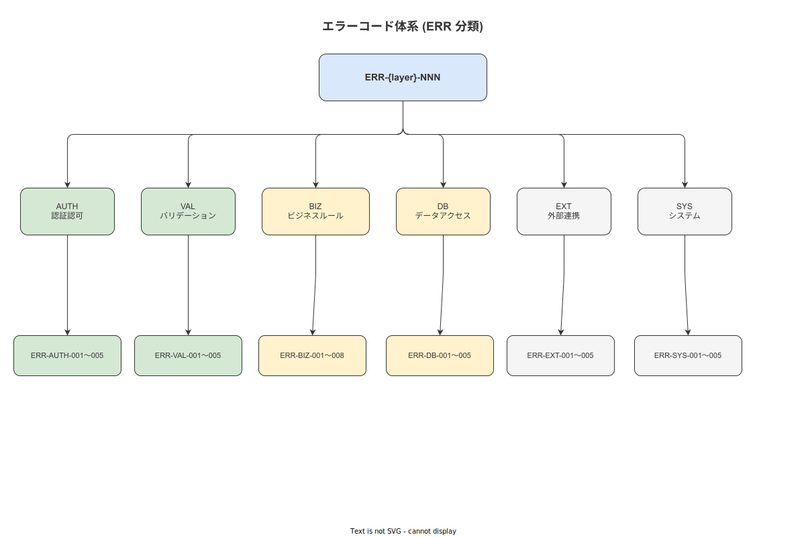

# 07 例外・エラーハンドリング統一方式

本章の責務は、ERR 識別子（ERR-AUTH/VAL/BIZ/DB/EXT/SYS）を使用したエラー分類体系・RFC 9457 Problem Details の実装・3 層エラー処理のパターンを確定することである。

**図 1: エラー分類体系（3 層）**



> 原本: [`img/fig_des_arch_error_taxonomy.drawio`](img/fig_des_arch_error_taxonomy.drawio)

---

## 1. 3 層エラー分類

| 層 | ERR サブカテゴリ | 発生源 | HTTP ステータス |
|---|---|---|---|
| Domain（ドメイン）| ERR-BIZ-* | ドメインサービス・業務ルール違反 | 409/422 |
| Application | ERR-AUTH-*・ERR-VAL-* | 認証認可ミドルウェア・バリデーション | 401/403/422 |
| Infrastructure | ERR-DB-*・ERR-EXT-*・ERR-SYS-* | DB エラー・外部 IF エラー・システム例外 | 409/502/503/500 |

---

## 2. RFC 9457 Problem Details の実装（Rust axum）

```rust
#[derive(Debug, serde::Serialize)]
pub struct ProblemDetails {
    pub r#type: String,     // ERR-ID をベースにした URI
    pub title: String,      // エラー名（英語）
    pub status: u16,        // HTTP ステータス
    pub detail: String,     // ユーザー向けメッセージ（多言語対応）
    pub instance: String,   // リクエスト ID（`/requests/{uuid}`）
    #[serde(skip_serializing_if = "Option::is_none")]
    pub error_id: Option<String>,  // ERR-ID（例: ERR-BIZ-001）
}

impl ProblemDetails {
    pub fn new(err: &AppError, instance_id: &Uuid) -> Self {
        Self {
            r#type: format!("https://errors.wnav.example.com/{}", err.error_id()),
            title: err.title(),
            status: err.status_code(),
            detail: err.detail(),
            instance: format!("/requests/{}", instance_id),
            error_id: Some(err.error_id().to_string()),
        }
    }
}
```

---

## 3. エラーコード（ERR-NNN）の全量（採番台帳 §10 と同期）

### 3-1. ERR-AUTH（認証認可）

| ERR-ID | エラー名 | HTTP | 発生条件 |
|---|---|---|---|
| ERR-AUTH-001 | unauthorized | 401 | JWT なし・期限切れ |
| ERR-AUTH-002 | forbidden | 403 | 操作権限なし |
| ERR-AUTH-003 | jwt_expired | 401 | JWT の exp が過去 |
| ERR-AUTH-004 | insufficient_role | 403 | RBAC 判定失敗（BR-BUS-040/042）|

### 3-2. ERR-VAL（バリデーション）

| ERR-ID | エラー名 | 関連 BR-BUS |
|---|---|---|
| ERR-VAL-001 | required_field_missing | BR-BUS-031 |
| ERR-VAL-002 | numeric_out_of_range | BR-BUS-030 |
| ERR-VAL-003 | unit_mismatch / format_error | BR-BUS-033/034/035 |
| ERR-VAL-004 | text_max_length_exceeded | BR-BUS-032 |

### 3-3. ERR-BIZ（業務ルール違反）

| ERR-ID | エラー名 | 関連 BR-BUS |
|---|---|---|
| ERR-BIZ-001 | lock_step_violation | BR-BUS-001 |
| ERR-BIZ-002 | evidence_required | BR-BUS-003 |
| ERR-BIZ-003 | sign_required | BR-BUS-004 |
| ERR-BIZ-004 | calibration_expired | BR-BUS-007 |
| ERR-BIZ-005 | sop_version_frozen | BR-BUS-008 |
| ERR-BIZ-006 | skill_level_insufficient | BR-BUS-002/041 |

### 3-4. ERR-DB / ERR-EXT / ERR-SYS

| ERR-ID | エラー名 | HTTP |
|---|---|---|
| ERR-DB-001 | idempotency_replay_conflict | 409 |
| ERR-DB-002 | optimistic_lock_conflict | 409 |
| ERR-DB-003 | hash_chain_broken | 500 |
| ERR-EXT-001 | master_sync_unavailable | 503 |
| ERR-EXT-002 | webhook_delivery_failed | 502 |
| ERR-SYS-001 | internal_server_error | 500 |
| ERR-SYS-002 | rate_limited | 429 |

---

## 4. フロントエンドでのエラー処理

### 4-1. 汎用エラーハンドラ（React）

```typescript
function handleApiError(error: ProblemDetails): void {
  switch (error.error_id) {
    case 'ERR-BIZ-001':
      // ロックステップ違反 → UI でステップ完了を強制表示
      showModal('この手順を完了してから次に進んでください');
      break;
    case 'ERR-AUTH-003':
      // JWT 期限切れ → ログイン画面にリダイレクト
      navigation.navigate('Login');
      break;
    case 'ERR-VAL-002':
      // 数値範囲外 → 入力フィールドに赤枠表示（色+記号 FR-UI-010）
      setFieldError('value', error.detail);
      break;
    default:
      // 汎用エラー表示
      showToast(error.detail, 'error');
  }
}
```

### 4-2. オフライン時のエラー処理

オフライン時は API エラーは発生しない（Outbox パターンで非同期化）。ただし以下のエラーはローカルで検証する。
- ERR-BIZ-001（ロックステップ違反）
- ERR-VAL-001〜004（バリデーション）
- ERR-BIZ-006（スキルレベル不足）

---

**本節で確定した方針**
- **ERR-{AUTH/VAL/BIZ/DB/EXT/SYS} の 6 層分類で 22 件のエラーコードを確定し、全エラーを RFC 9457 Problem Details 形式で統一レスポンスとして返す。**
- **Domain 層エラー（ERR-BIZ）はドメインサービスが throw し、Application 層ミドルウェアが HTTP レスポンスに変換する設計を確定した。**
- **オフライン時のバリデーション（ERR-BIZ-001/VAL-001〜004）は端末ローカルで実行し、サーバーへの不要なリクエストを防ぐ。**

---

## 参照業界分析

### 必須
- [`90_業界分析/04_ヒューマンエラーと安全工学.md`](../../90_業界分析/04_ヒューマンエラーと安全工学.md)

### 関連
- [`90_業界分析/12_認知工学と状況認識.md`](../../90_業界分析/12_認知工学と状況認識.md)
