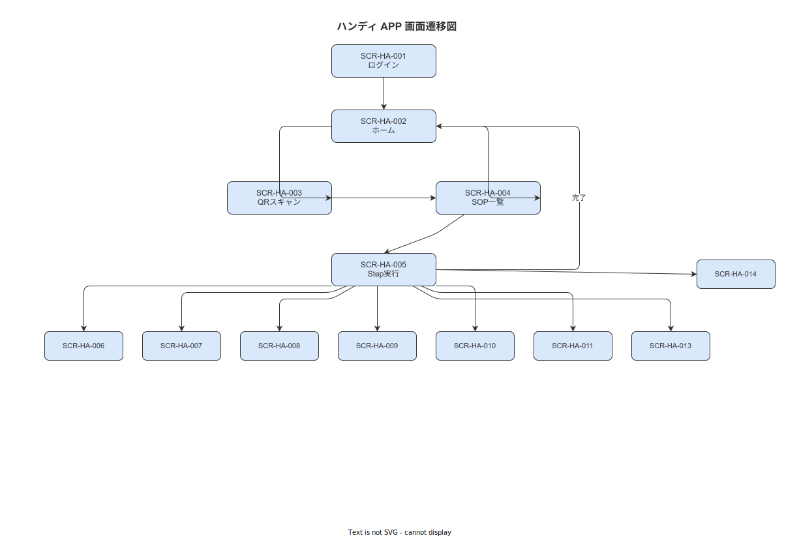

# 02 画面遷移図（ハンディ APP）

本章の責務は、ハンディ APP（SCR-HA-001〜015）の画面遷移（TRN-NNN）を確定することである。

**図 1: ハンディ APP 画面遷移図**

> 原本: [`img/fig_des_screen_handy_flow.drawio`](img/fig_des_screen_handy_flow.drawio)

---

## 1. 画面遷移一覧（TRN カタログ - ハンディ APP 部分）

| TRN-ID | 発生元 SCR | 遷移先 SCR | トリガー | ガード条件 | 副作用 API |
|---|---|---|---|---|---|
| TRN-001 | SCR-HA-001 | SCR-HA-002 | ログイン成功 | 認証 OK | API-auth-001 |
| TRN-002 | SCR-HA-002 | SCR-HA-003 | QR スキャンボタン | — | — |
| TRN-003 | SCR-HA-002 | SCR-HA-004 | 作業リスト選択 | — | API-work-orders-001 |
| TRN-004 | SCR-HA-003 | SCR-HA-004 | QR 読取成功 | GS1 形式チェック | API-work-orders-001 |
| TRN-005 | SCR-HA-004 | SCR-HA-005 | Step 開始（標準 Step）| skill チェック・公開版チェック | API-work-execs-001 |
| TRN-006 | SCR-HA-005 | SCR-HA-006 | 条件分岐 Step に到達 | input_type = condition | — |
| TRN-007 | SCR-HA-005 | SCR-HA-007 | カスタム Step に到達 | input_type = custom | — |
| TRN-008 | SCR-HA-005 | SCR-HA-008 | 写真 Step に到達 | input_type = photo_capture | — |
| TRN-009 | SCR-HA-005 | SCR-HA-009 | 数値 Step に到達 | input_type = numeric_input | — |
| TRN-010 | SCR-HA-008 | SCR-HA-005 | 写真確認・完了 | 解像度チェック OK | API-evidences-001 |
| TRN-011 | SCR-HA-009 | SCR-HA-005 | 測定値確定 | 範囲チェック OK | API-step-events-001 |
| TRN-012 | SCR-HA-005 | SCR-HA-010 | 電子サイン要求 | sign_required = TRUE | — |
| TRN-013 | SCR-HA-010 | SCR-HA-005 | 署名完了 | PIN 認証成功 | API-electronic-signs-001 |
| TRN-014 | SCR-HA-005 | SCR-HA-002 | 作業完了 | 全 Step 完了 | API-work-execs-005 |
| TRN-015 | SCR-HA-005 | SCR-HA-011 | 中断ボタン | — | — |
| TRN-016 | SCR-HA-011 | SCR-HA-002 | 中断確定 | 理由選択済み | API-work-execs-003 |
| TRN-017 | SCR-HA-002 | SCR-HA-012 | 中断中作業を選択 | status = SUSPENDED | — |
| TRN-018 | SCR-HA-012 | SCR-HA-005 | 再開確認 | 本人認証 OK | API-work-execs-004 |
| TRN-019 | SCR-HA-005 | SCR-HA-013 | アンドンボタン | — | API-andon-001 |
| TRN-020 | SCR-HA-013 | SCR-HA-005 | アンドン発報完了 | — | — |
| TRN-021 | SCR-HA-005 | SCR-HA-014 | 不適合登録ボタン | — | — |
| TRN-022 | SCR-HA-014 | SCR-HA-005 | 不適合登録完了 | — | API-capa-001 |
| TRN-023 | SCR-HA-001 | SCR-HA-002 | ─（logout は SCR-HA-015 経由）| — | API-auth-003 |
| TRN-024 | SCR-HA-015 | SCR-HA-001 | ログアウト | — | API-auth-003 |

付録/99 採番台帳の TRN セクション: 次採番値 **TRN-025**（マスタメンテ/管理コンソールの遷移を続けて採番）。

---

## 2. 遷移の特殊ケース

### 2-1. オフライン時の遷移制限

Emergency Mode（切断 5 分超）発生時:
- SCR-HA-004〜014（Step 実行系）: 継続利用可（Outbox 蓄積）
- SCR-HA-002（作業選択）: マスタキャッシュから継続利用可
- TRN-001（ログイン）: オフライン時はキャッシュ JWT のみ（8 時間以内）

### 2-2. 強制遷移（監督権限・BR-BUS-042）

supervisor ロールが別端末から対象作業を強制中断する場合:
- API-work-execs-003（supervisor の JWT で実行）
- 端末側の SCR-HA-005 → 強制中断バナー表示 → SCR-HA-002 に戻る

---

**本節で確定した方針**
- **ハンディ APP の TRN-001〜024 を確定し、全 15 画面（SCR-HA）間の遷移・トリガー・ガード条件・副作用 API を明示した。**
- **オフライン時と強制中断の特殊遷移を設計命題として確定し、両ケースで Outbox 蓄積と JWT 検証が正常動作することを担保した。**

---

## 参照業界分析

### 必須
- [`90_業界分析/18_現場HCIと作業者インターフェース.md`](../../90_業界分析/18_現場HCIと作業者インターフェース.md)
- [`90_業界分析/20_作業中断・割込み・再開の認知科学.md`](../../90_業界分析/20_作業中断・割込み・再開の認知科学.md)

### 関連
- [`90_業界分析/12_認知工学と状況認識.md`](../../90_業界分析/12_認知工学と状況認識.md)
