# 05 共通 UI コンポーネントとデザインシステム

本章の責務は、3 アプリで共有するデザイントークン（全種）・コンポーネントカタログ（FRG + 業務固有 CMP）・ダークモード体験・マイクロインタラクション原則を確定することである。`05A_ブランドアイデンティティとデザイン原則.md` が定義する「テック×洗練（Precision SaaS）」の世界観を実装レベルで担保する。NFR-UX 全 43 件の UI レベルでの担保を含む。

---

## 1. デザイントークン

### 1-1. カラートークン — ブランドカラー

#### brand.primary（Steel Navy）

| トークン | ライトモード | ダークモード | 用途 |
|---|---|---|---|
| `brand.primary.50` | `#EEF2F7` | `#111A27` | ホバー背景 |
| `brand.primary.100` | `#CCD7E8` | `#182334` | アクティブ背景 |
| `brand.primary.200` | `#9AB0D1` | `#1F3047` | ボーダー（弱）|
| `brand.primary.300` | `#6789B9` | `#2B4568` | ボーダー（中）|
| `brand.primary.400` | `#3E65A2` | `#3E65A2` | — |
| `brand.primary.500` | `#1E3A5F` | `#4D7AB3` | — |
| `brand.primary.600` | `#193358` | `#6B96C9` | ダークモードメインカラー |
| `brand.primary.700` | `#132948` | `#8FB5E0` | ロゴタイプ色 |
| `brand.primary.800` | `#0D1E37` | `#B3D3F2` | — |
| `brand.primary.900` | `#071226` | `#D9ECFC` | スプラッシュ背景 |

#### brand.accent（Electric Blue）

| トークン | ライトモード | ダークモード | 用途 |
|---|---|---|---|
| `brand.accent.50` | `#EBF3FE` | `#0D1F3C` | フォーカス背景 |
| `brand.accent.100` | `#C5DCF9` | `#132D52` | — |
| `brand.accent.200` | `#9EC5F5` | `#1A3D6B` | — |
| `brand.accent.300` | `#77AEF1` | `#2254A3` | — |
| `brand.accent.400` | `#5A9DF4` | `#3D7FDC` | — |
| `brand.accent.500` | `#3D8EF0` | `#5A9DF4` | インタラクション・進行 |
| `brand.accent.600` | `#2E7ADE` | `#77AEF1` | リンク・フォーカスリング |
| `brand.accent.700` | `#2264C2` | `#9EC5F5` | — |
| `brand.accent.800` | `#1850A6` | `#C5DCF9` | — |
| `brand.accent.900` | `#0F3D8A` | `#EBF3FE` | — |

---

### 1-2. カラートークン — ステートカラー

#### state.success

| トークン | ライト | ダーク | 用途 |
|---|---|---|---|
| `state.success.50` | `#ECFDF5` | `#052E16` | 成功背景 |
| `state.success.100` | `#D1FAE5` | `#064E23` | — |
| `state.success.300` | `#6EE7B7` | `#059669` | — |
| `state.success.500` | `#059669` | `#34D399` | 完了・OK テキスト/アイコン |
| `state.success.700` | `#065F46` | `#6EE7B7` | 強調成功テキスト |

#### state.warning

| トークン | ライト | ダーク | 用途 |
|---|---|---|---|
| `state.warning.50` | `#FFFBEB` | `#2D1A00` | 警告背景 |
| `state.warning.100` | `#FEF3C7` | `#3D2500` | — |
| `state.warning.300` | `#FCD34D` | `#D97706` | — |
| `state.warning.500` | `#F59E0B` | `#F5A524` | 注意・警告（橙黄寄り）|
| `state.warning.700` | `#92400E` | `#FCD34D` | 警告テキスト（AA 確保）|

#### state.danger（APIエラー・バリデーション失敗）

| トークン | ライト | ダーク | 用途 |
|---|---|---|---|
| `state.danger.50` | `#FEF2F2` | `#2D0000` | エラー背景 |
| `state.danger.100` | `#FEE2E2` | `#400000` | — |
| `state.danger.300` | `#FCA5A5` | `#B91C1C` | — |
| `state.danger.500` | `#DC2626` | `#F87171` | エラーテキスト/アイコン |
| `state.danger.700` | `#991B1B` | `#FCA5A5` | 強調エラーテキスト |

#### state.destructive（廃止・削除・不可逆操作）

危険操作（廃止・削除・全件再投入）専用。`state.danger` とは意味的に区別する。

| トークン | ライト | ダーク | 用途 |
|---|---|---|---|
| `state.destructive.50` | `#FFF1F2` | `#2D0010` | 廃止確認背景 |
| `state.destructive.500` | `#E11D48` | `#FB7185` | 廃止・削除ボタン |
| `state.destructive.700` | `#9F1239` | `#FDA4AF` | 廃止ラベル |

#### state.info

| トークン | ライト | ダーク | 用途 |
|---|---|---|---|
| `state.info.50` | `#F0F9FF` | `#0A1A2D` | 情報背景 |
| `state.info.500` | `#0284C7` | `#38BDF8` | 情報テキスト/バッジ |
| `state.info.700` | `#0369A1` | `#7DD3FC` | — |

#### state.andon（緊急発報専用 — 他用途への流用禁止）

`state.danger` / `state.destructive` と完全分離。学習済信号として赤を維持。

| トークン | ライト | ダーク（夜勤）| 用途 |
|---|---|---|---|
| `state.andon.base` | `#FF0000` | `#FF4444` | AndonButton 背景・緊急帯 |
| `state.andon.pulse` | `#CC0000` | `#CC3333` | 点滅フェードアウト色 |
| `state.andon.bg` | `#FFF0F0` | `#2D0000` | アンドン発報中オーバーレイ |
| `state.andon.text` | `#FFFFFF` | `#FFFFFF` | アンドンボタン上テキスト |

---

### 1-3. カラートークン — ニュートラル（12 段階）

| トークン | 値 | 主な用途 |
|---|---|---|
| `neutral.0` | `#FFFFFF` | 白背景 |
| `neutral.50` | `#F8FAFC` | 副背景・カード背景（subtle）|
| `neutral.100` | `#F1F5F9` | 沈んだ背景（sunken）|
| `neutral.200` | `#E2E8F0` | ディバイダー・ボーダー（subtle）|
| `neutral.300` | `#CBD5E1` | ディバイダー・disabled テキスト |
| `neutral.400` | `#94A3B8` | プレースホルダー・補助テキスト |
| `neutral.500` | `#64748B` | 二次テキスト |
| `neutral.600` | `#475569` | 二次テキスト（強）|
| `neutral.700` | `#334155` | 本文（暗）|
| `neutral.800` | `#1E293B` | ダーク背景 raised |
| `neutral.900` | `#0F172A` | ダーク背景 base / ライト最暗テキスト |
| `neutral.950` | `#03050A` | — |
| `neutral.1000` | `#000000` | — |

**図 1: カラートークン階調（brand.primary / brand.accent / state / neutral）**

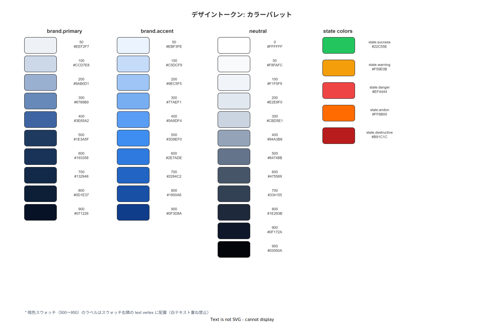

> 原本: [`img/fig_des_tokens_color_scale.drawio`](img/fig_des_tokens_color_scale.drawio)

---

### 1-4. セマンティックサーフェストークン

| トークン | ライト | ダーク | nightShift | 用途 |
|---|---|---|---|---|
| `surface.bg` | `neutral.0` | `#0F172A` | `#0B1220` | 画面背景 |
| `surface.raised` | `neutral.0` | `#1E293B` | `#131E30` | カード・モーダル背景 |
| `surface.subtle` | `neutral.50` | `#1E293B` | `#1A2840` | セクション区分・コードブロック背景 |
| `surface.sunken` | `neutral.100` | `#0F172A` | `#070F1A` | 入力フィールド内側・引っ込んだ領域 |
| `surface.overlay` | `rgba(15,23,42,.5)` | `rgba(0,0,0,.7)` | `rgba(0,0,0,.8)` | モーダルスクリム |
| `surface.divider` | `neutral.200` | `#334155` | `#1F2E42` | 区切り線 |
| `surface.disabled` | `neutral.100` | `#1E293B` | `#131E30` | 非活性要素背景 |

---

### 1-5. テキストトークン

| トークン | ライト | ダーク | nightShift | 用途 |
|---|---|---|---|---|
| `text.primary` | `#0F172A` | `#F1F5F9` | `#E2E8F0` | 主要本文・見出し |
| `text.secondary` | `#475569` | `#94A3B8` | `#7B93AB` | 補助テキスト |
| `text.tertiary` | `#94A3B8` | `#64748B` | `#4E6880` | ラベル・キャプション |
| `text.inverse` | `#F8FAFC` | `#0F172A` | `#0B1220` | 暗色背景上テキスト |
| `text.link` | `#2E7ADE` | `#77AEF1` | `#77AEF1` | リンク |
| `text.disabled` | `#CBD5E1` | `#334155` | `#283A4E` | 非活性テキスト |
| `text.danger` | `#DC2626` | `#F87171` | `#F87171` | エラーテキスト |
| `text.warning` | `#92400E` | `#F5A524` | `#F5A524` | 警告テキスト |
| `text.success` | `#065F46` | `#34D399` | `#34D399` | 成功テキスト |
| `text.note.caution` | `#92400E` | `#F5A524` | `#F5A524` | **注意事項（最小 16pt + 太字 + 背景必須）** |

> **注意**: `text.note.caution` は必ず `state.warning.50` 背景 + 左 4px `state.warning.500` ボーダー + 太字フォント（weight 600 以上）+ `AlertTriangle` アイコンとの 4 点セットで使用する。`text.label` の 12pt での警告表示は全画面で禁止する。

---

### 1-6. WCAG AA 検証マトリクス（主要ペア）

| 前景 | 背景 | コントラスト比 | 判定 | 使用場面 |
|---|---|---|---|---|
| `text.primary` (`#0F172A`) | `surface.bg` (`#FFFFFF`) | 19.1:1 | AAA ✓ | 本文 |
| `text.secondary` (`#475569`) | `surface.bg` (`#FFFFFF`) | 7.4:1 | AA ✓ | 補助テキスト |
| `text.tertiary` (`#94A3B8`) | `surface.bg` (`#FFFFFF`) | 3.4:1 | Large only | ラベル（18pt+ or 14pt Bold+ のみ）|
| `text.link` (`#2E7ADE`) | `surface.bg` (`#FFFFFF`) | 4.5:1 | AA ✓ | リンク |
| `text.inverse` (`#F8FAFC`) | `brand.primary.500` (`#1E3A5F`) | 10.9:1 | AAA ✓ | 主要ボタン上テキスト |
| `text.inverse` (`#F8FAFC`) | `brand.accent.500` (`#3D8EF0`) | 3.1:1 | Large only | アクセントボタン（無地禁止→輪郭ボタン推奨）|
| `text.inverse` (`#F8FAFC`) | `brand.accent.600` (`#2E7ADE`) | 4.5:1 | AA ✓ | アクセント塗りボタン上テキスト |
| `text.inverse` (`#F8FAFC`) | `state.danger.500` (`#DC2626`) | 5.7:1 | AA ✓ | Danger ボタン上テキスト |
| `text.inverse` (`#F8FAFC`) | `state.andon.base` (`#FF0000`) | 3.9:1 | AA ✓（Large）| Andon ボタン上テキスト（24pt Bold → AA）|
| `text.warning` (`#92400E`) | `state.warning.50` (`#FFFBEB`) | 7.8:1 | AA ✓ | 警告バナー本文 |
| `text.danger` (`#DC2626`) | `state.danger.50` (`#FEF2F2`) | 4.5:1 | AA ✓ | エラーバナー本文 |
| `neutral.700` (`#334155`) | `neutral.50` (`#F8FAFC`) | 8.2:1 | AA ✓ | カード内補助テキスト |
| `text.disabled` (`#CBD5E1`) | `surface.bg` (`#FFFFFF`) | 1.7:1 | Fail | 非活性（機能説明は別手段で必須）|
| `focus.ring` (`brand.accent.600`) | `surface.bg` (`#FFFFFF`) | 4.5:1 | AA ✓ | フォーカスリング（非テキスト 3:1 ✓✓）|
| `text.primary` (`#F1F5F9` dark) | `surface.bg` (`#0F172A` dark) | 15.3:1 | AAA ✓ | ダーク本文 |
| `text.primary` (`#E2E8F0` nightShift) | `surface.bg` (`#0B1220` nightShift) | 13.8:1 | AAA ✓ | 夜勤本文 |

**図 2: ダーク/nightShift トークン対応表**

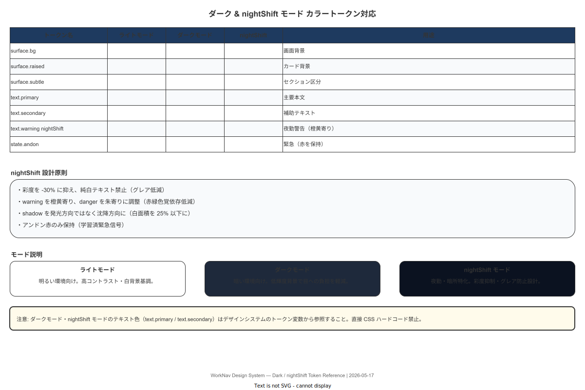

> 原本: [`img/fig_des_tokens_color_dark.drawio`](img/fig_des_tokens_color_dark.drawio)

---

### 1-7. タイポグラフィトークン

#### フォントファミリー

```
font.family.sans-jp: "Noto Sans JP", "Noto Sans", sans-serif  // 日本語テキスト全般
font.family.sans:    "Inter", "Noto Sans", sans-serif          // Web 英語・数値
font.family.mono:    "JetBrains Mono", "Courier New", monospace // コード・DSL
```

locale 別フォント優先順位:
- `ja` / `ja-simple`: `sans-jp` を primary
- `en`: `sans` を primary（`sans-jp` を fallback に保持）
- コード表示: 常に `mono`

#### タイポグラフィスケール

| トークン | サイズ | 行間 | 字間 | ウェイト | 用途 |
|---|---|---|---|---|---|
| `text.display.xl` | 40px（HA: 40pt）| 1.1 | -0.02em | 700 | ダッシュボード大数値 |
| `text.display.lg` | 32px / 32pt | 1.1 | -0.02em | 700 | KPI カードメイン数値 |
| `text.h1` | 24px / 24pt | 1.2 | -0.01em | 700 | 画面タイトル（Web）|
| `text.h2` | 20px / 20pt | 1.3 | -0.01em | 600 | セクション見出し / HA Step 見出し |
| `text.h3` | 18px / 18pt | 1.3 | -0.005em | 600 | カード見出し |
| `text.body.lg` | 16px / 16pt | 1.6 | 0 | 400-500 | Step 指示文・主要本文 |
| `text.body` | 14px / 14pt | 1.6 | 0 | 400 | 通常本文・テーブルセル |
| `text.caption` | 12px / 12pt | 1.5 | 0 | 400 | ラベル・補足・メタ情報（⚠ 警告用途禁止）|
| `text.overline` | 11px / 11pt | 1.4 | 0.08em | 500 | 大文字セクションラベル（uppercase 指定）|
| `text.code` | 13px / 13pt | 1.6 | 0 | 400 | コード・DSL・JSON |

> **注意事項の最小サイズ**: 警告・注意事項には `text.body.lg`（16pt）以上を使用すること。`text.caption`（12pt）の警告・エラー用途は全廃。

#### Truncation ユーティリティ

| クラス（論理名）| 最大行数 | 超過時 |
|---|---|---|
| `truncate-1` | 1 行 | `…` |
| `truncate-2` | 2 行 | `…` |
| `truncate-3` | 3 行 | `…` + タップで展開（Modal）|

Step 指示文は `truncate-3` を使用。展開時は Modal で全文表示。

**図 3: タイポグラフィスケール（サイズ・行間・字間・ウェイト）**

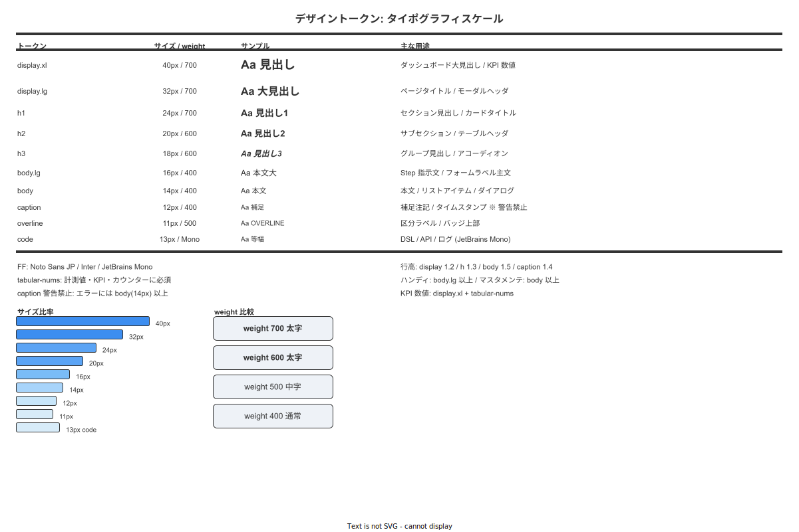

> 原本: [`img/fig_des_tokens_type_scale.drawio`](img/fig_des_tokens_type_scale.drawio)

---

### 1-8. スペーシングトークン（8pt グリッド基準）

| トークン | 値 | 用途例 |
|---|---|---|
| `space.0` | 0 | — |
| `space.0.5` | 2px | アイコン-テキスト隙間 |
| `space.1` | 4px | 密集したラベル間 |
| `space.2` | 8px | アイテム内部パディング・ボタン間最小マージン |
| `space.3` | 12px | インライン要素の標準間隔 |
| `space.4` | 16px | カードパディング（標準）|
| `space.5` | 20px | セクション内要素間隔 |
| `space.6` | 24px | カードパディング（大）・セクション上下マージン |
| `space.8` | 32px | セクション間・ページ余白 |
| `space.10` | 40px | 主要セクション間 |
| `space.12` | 48px | ページ上端余白 |
| `space.16` | 64px | HA FooterCTA 高さ（CTA ボタン本体）|
| `space.20` | 80px | HA FooterCTA 全体高さ（safe area 込み余白前）|

---

### 1-9. 角丸トークン

| トークン | 値 | 用途 |
|---|---|---|
| `radius.none` | 0 | テーブル行・ディバイダー |
| `radius.xs` | 2px | バッジ・チップ（矩形）|
| `radius.sm` | 4px | アンドン細帯・緊急バナー |
| `radius.md` | 8px | **ボタン・入力フィールド・カード（標準）** |
| `radius.lg` | 12px | 大きなカード・サイドバー要素 |
| `radius.xl` | 16px | モーダル・ドロワー |
| `radius.2xl` | 24px | ボトムシート・大型モーダル |
| `radius.full` | 9999px | アバター・バッジ（丸型）・FAB |

**図 4: 角丸トークン + スペーシングトークン（8pt グリッド）**

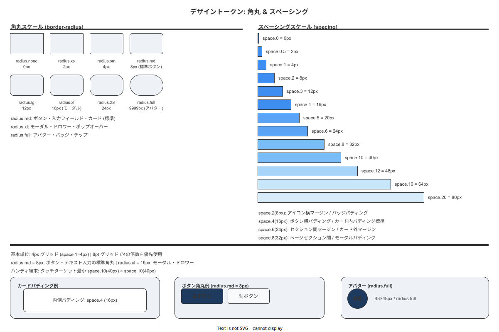

> 原本: [`img/fig_des_tokens_radius_space.drawio`](img/fig_des_tokens_radius_space.drawio)

---

### 1-10. エレベーション（シャドウ）トークン

#### ライトモード

| トークン | 値 | 用途 |
|---|---|---|
| `shadow.0` | `none` | フラット要素（テーブル行・ディバイダー）|
| `shadow.1` | `0 1px 2px rgba(15,23,42,.04), 0 1px 1px rgba(15,23,42,.06)` | カード・チップ |
| `shadow.2` | `0 4px 8px rgba(15,23,42,.08), 0 2px 4px rgba(15,23,42,.06)` | ホバーカード・ドロップダウン |
| `shadow.3` | `0 8px 24px rgba(15,23,42,.12), 0 4px 8px rgba(15,23,42,.08)` | サイドバー・Sticky ヘッダー |
| `shadow.4` | `0 16px 40px rgba(15,23,42,.16), 0 8px 16px rgba(15,23,42,.10)` | モーダル |
| `shadow.popup` | `0 24px 60px rgba(15,23,42,.20), 0 12px 24px rgba(15,23,42,.12)` | ポップオーバー・コンテキストメニュー |

#### ダークモード（shadow は強めに設定）

| トークン | 値 |
|---|---|
| `shadow.1` (dark) | `0 1px 2px rgba(0,0,0,.30), 0 1px 1px rgba(0,0,0,.40)` |
| `shadow.2` (dark) | `0 4px 12px rgba(0,0,0,.50), 0 2px 6px rgba(0,0,0,.40)` |
| `shadow.4` (dark) | `0 16px 40px rgba(0,0,0,.60), 0 8px 16px rgba(0,0,0,.50)` |
| `shadow.popup` (dark) | `0 24px 60px rgba(0,0,0,.70), 0 12px 24px rgba(0,0,0,.60)` |

**図 5: エレベーション（shadow 0-5）ライト/ダーク対応**

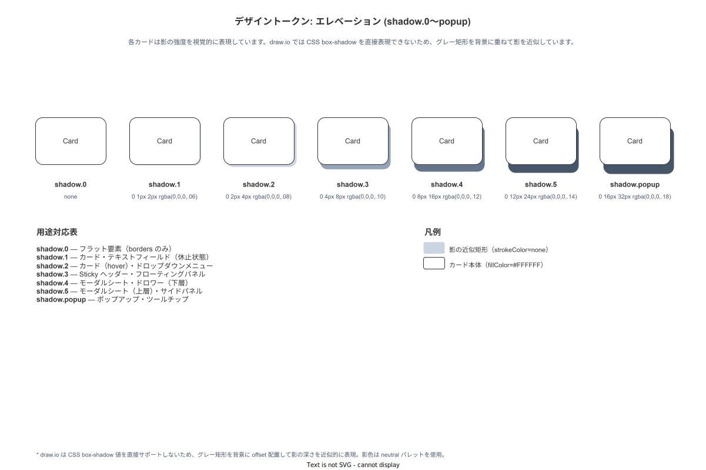

> 原本: [`img/fig_des_tokens_elevation.drawio`](img/fig_des_tokens_elevation.drawio)

---

### 1-11. モーショントークン

#### Duration

| トークン | 値 | 用途 |
|---|---|---|
| `duration.fast` | 120ms | ホバー・フォーカス・ボタン press |
| `duration.base` | 200ms | ページ遷移・モーダル開閉・展開 |
| `duration.slow` | 320ms | スライドイン・ドロワー |
| `duration.xslow` | 480ms | スケルトン → コンテンツ切替 |

#### Easing

| トークン | 値 | 意味 |
|---|---|---|
| `easing.standard` | `cubic-bezier(0.2, 0, 0, 1)` | 標準遷移（入退場なし）|
| `easing.decelerated` | `cubic-bezier(0, 0, 0, 1)` | 出現時（勢いよく入る）|
| `easing.accelerated` | `cubic-bezier(0.3, 0, 1, 1)` | 退場時（すーっと消える）|
| `easing.emphasized` | `cubic-bezier(0.2, 0, 0, 1)` | 重要なアニメーション |

#### prefers-reduced-motion 対応

`@media (prefers-reduced-motion: reduce)` 時:
- 全 duration を 0–80ms に低減（完全停止はしない — フィードバックの知覚が必要）
- `transform: translateX/Y` と `scale` を `opacity` のみに降格
- 視覚フィードバック（色変化・アイコン切替）は必ず保持

**図 6: モーショントークン（duration / easing 曲線）**

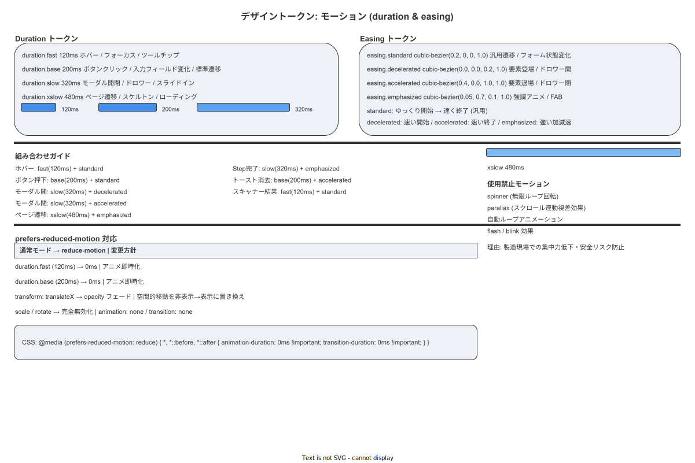

> 原本: [`img/fig_des_tokens_motion.drawio`](img/fig_des_tokens_motion.drawio)

---

### 1-12. アイコンシステム（Lucide）

採用ライブラリ: **Lucide** (`lucide-react` / `lucide-react-native`)
選定理由: 軽量・MIT ライセンス・1.5px 線幅固定・React Native 公式ポート・Noto Sans との視覚的整合性

| トークン | サイズ | 用途 |
|---|---|---|
| `icon.xs` | 12dp/px | バッジ内インラインアイコン |
| `icon.sm` | 16dp/px | テキスト行内インラインアイコン |
| `icon.md` | 20dp/px | ボタン内アイコン・フォームアイコン |
| `icon.lg` | 24dp/px | ナビ・タブバー・ヘッダーアイコン |
| `icon.xl` | 32dp/px | CTA 内・状態インジケーター |
| `icon.2xl` | 40dp/px | 大型 CTA（AndonButton）内 |

共通ルール:
- `strokeWidth`: **1.5px 固定**（強光下での視認確保）
- 色: 親要素の `text.primary` を `currentColor` で継承（ただし `intent` prop で上書き可）
- 状態色アイコンは必ず意味に対応する Lucide 名称を使用（例: `CheckCircle2`→成功、`AlertTriangle`→警告、`XCircle`→エラー、`Siren`→アンドン）

---

### 1-13. フォーカスリング（Focus Ring）

**テック×洗練のシグネチャ**: 二重リング。内側 1px 白ギャップ + 外側 2px ブランドカラー。

| プロパティ | ライト | ダーク |
|---|---|---|
| 外側リング幅 | 2px | 2px |
| 内側ギャップ（box-shadow offset or outline-offset）| 2px | 2px |
| 外側リング色 | `brand.accent.600` (`#2E7ADE`) | `brand.accent.400` (`#5A9DF4`) |
| 内側ギャップ色 | `surface.bg` (`#FFFFFF`) | `surface.bg` (`#0F172A`) |
| 角丸 | 対象要素の `radius + 2px` | 同左 |

CSS 実装例（Web）:
```css
:focus-visible {
  outline: 2px solid var(--brand-accent-600);
  outline-offset: 2px;
  border-radius: calc(var(--element-radius) + 2px);
  box-shadow: 0 0 0 4px var(--surface-bg); /* inner gap simulation */
}
```

WCAG: コントラスト比 4.5:1（`brand.accent.600` vs `surface.bg`）✓ 非テキスト要素 3:1 基準の 1.5 倍確保。

**図 7: フォーカスリング寸法・コントラスト仕様**

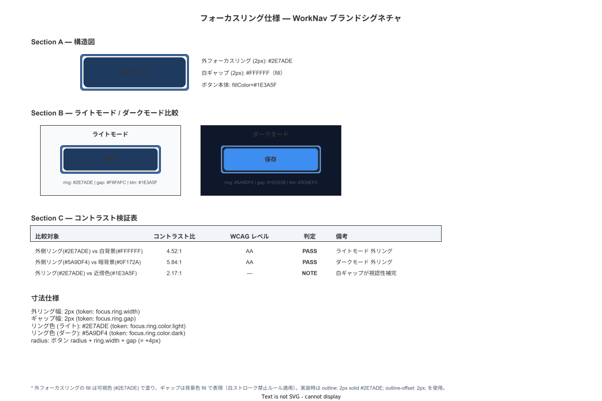

> 原本: [`img/fig_des_focus_ring_spec.drawio`](img/fig_des_focus_ring_spec.drawio)

---

### 1-14. ボーダートークン

| トークン | 値 | 用途 |
|---|---|---|
| `border.width.default` | 1px | 通常ボーダー |
| `border.width.strong` | 2px | フォーカス・アクティブ |
| `border.color.subtle` | `neutral.200` | カード枠線（弱）|
| `border.color.default` | `neutral.300` | 入力フィールド |
| `border.color.strong` | `neutral.400` | 強調ボーダー |
| `border.color.focus` | `brand.accent.600` | フォーカス状態 |
| `border.color.error` | `state.danger.500` | エラー状態 |
| `border.color.success` | `state.success.500` | 成功状態（スキャン成功枠等）|
| `border.color.warning` | `state.warning.500` | 警告状態 |

---

## 2. CMP カタログ — 汎用 UI 部品（FRG）

アプリをまたぐ汎用 UI 部品を `FRG-NNN` で一次採番する（既存規約: アプリをまたぐ部品は FRG）。

付録/99 採番台帳の FRG セクション: 次採番値 **FRG-042**。

### 2-1. インタラクション部品

| FRG-ID | 物理名 | バリアント | サイズ | 状態 |
|---|---|---|---|---|
| FRG-001 | Button | primary / secondary / ghost / outline / destructive / andon | sm / md / lg / xl | default / hover / focus / active / disabled / loading |
| FRG-002 | IconButton | solid / ghost / outline | sm / md / lg | 同上 |
| FRG-003 | Input | text / number / search / password / tel | sm / md / lg | default / hover / focus / filled / error / disabled |
| FRG-004 | Textarea | — | sm / md / lg | 同上（+ resize）|
| FRG-005 | Select | — | sm / md / lg | default / hover / focus / open / disabled |
| FRG-006 | Combobox | — | sm / md / lg | 同上（+ filtering）|
| FRG-007 | Checkbox | — | sm / md | unchecked / checked / indeterminate / disabled |
| FRG-008 | Radio | — | sm / md | unchecked / checked / disabled |
| FRG-009 | Switch | — | sm / md | off / on / disabled / loading |
| FRG-036 | Slider | horizontal / vertical | md | default / hover / focus / active / disabled |
| FRG-037 | FilePicker | — | md | idle / dragover / selected / error |
| FRG-038 | DatePicker | date / datetime / month | md | default / open / selected |
| FRG-039 | NumberStepper | — | sm / md / lg | default / min / max / disabled |
| FRG-040 | Form | — | — | — |
| FRG-041 | Splitter | vertical / horizontal | sm / md | idle / hover / dragging / disabled / collapsed-edge |

**FRG-001 Button バリアント詳細**:

| バリアント | ライト背景 | ダーク背景 | テキスト | 用途 |
|---|---|---|---|---|
| `primary` | `brand.primary.500` | `brand.primary.600` | white | 主要 CTA |
| `secondary` | `brand.primary.50` | `brand.primary.100` | `brand.primary.700` | 副次 CTA |
| `ghost` | transparent | transparent | `text.secondary` | 補助アクション |
| `outline` | transparent + border | transparent + border | `text.primary` | 選択肢ボタン |
| `destructive` | `state.destructive.500` | `state.destructive.500` | white | 廃止・削除 |
| `andon` | `state.andon.base` | `state.andon.base` | white | **AndonButton 専用** |

**図 8: Button / IconButton カタログ（バリアント × 状態）**

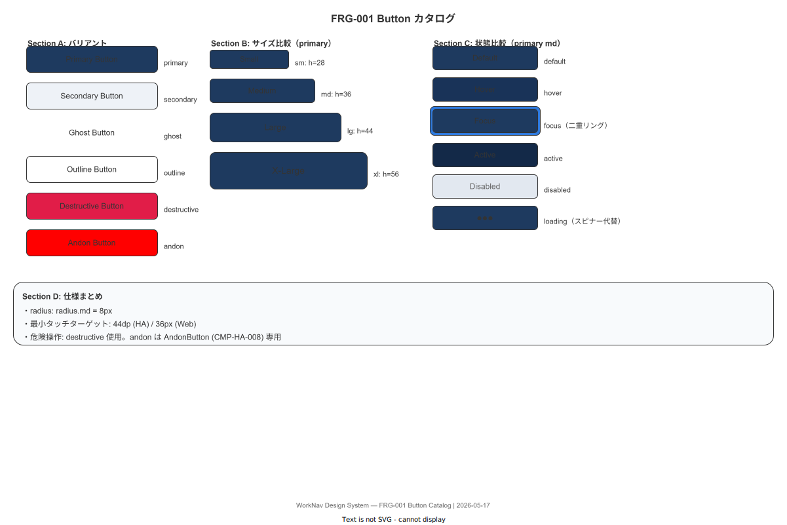

> 原本: [`img/fig_des_components_catalog_buttons.drawio`](img/fig_des_components_catalog_buttons.drawio)

**図 9: Input / Select / Checkbox 等フォーム部品カタログ**

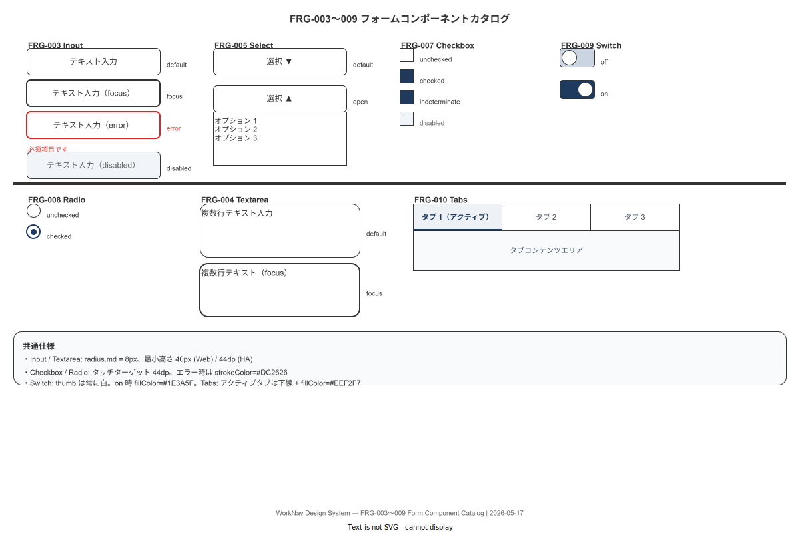

> 原本: [`img/fig_des_components_catalog_forms.drawio`](img/fig_des_components_catalog_forms.drawio)

---

### 2-2. フィードバック部品

| FRG-ID | 物理名 | バリアント | 表示位置 | 持続時間 |
|---|---|---|---|---|
| FRG-016 | Toast | success / warning / danger / info | 画面上部中央（HA）| 2 秒（success）/ 手動閉（他）|
| FRG-017 | Snackbar | danger / warning | 画面下部固定（HA）/ 下部中央（Web）| 5 秒 / 手動閉 |
| FRG-018 | Tooltip | dark / light | Hover/Focus 時（Web）| Hover 継続中 |
| FRG-020 | EmptyState | — | コンテンツ領域中央 | 常時 |
| FRG-021 | Skeleton | text / rect / circle / card | — | データ取得中 |
| FRG-031 | Banner | info / warning / danger / success | 画面上部（Header 直下）| 手動閉 または 条件消滅 |

**FRG-020 EmptyState 構成**:
- ピクトグラム: Lucide ベース `icon.2xl`（`neutral.300` 色）
- 見出し: `text.h3` / `text.secondary`
- 本文: `text.body` / `text.tertiary`（最大 2 行）
- CTA: `FRG-001 Button primary md`（任意）
- 全体: 中央揃え・上下 `space.12`

**図 10: Toast / Snackbar / Banner 等フィードバック部品カタログ**

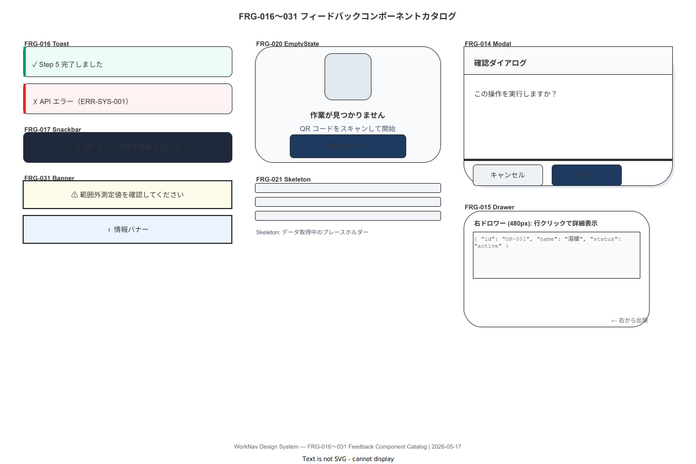

> 原本: [`img/fig_des_components_catalog_feedback.drawio`](img/fig_des_components_catalog_feedback.drawio)

---

### 2-3. ナビゲーション部品

| FRG-ID | 物理名 | バリアント | 用途 |
|---|---|---|---|
| FRG-010 | Tabs | underline / pill | ページ内タブ切替 |
| FRG-022 | Pagination | numbered / simple | テーブルページング |
| FRG-023 | Breadcrumb | — | 現在地表示（MA/MC）|
| FRG-027 | Accordion | — | 折りたたみコンテンツ |
| FRG-028 | Menu | — | アクションメニュー（縦）|
| FRG-029 | DropdownMenu | — | セレクタブルドロップダウン |
| FRG-035 | SegmentedControl | — | 2〜4 択切替（HA 向け）|

**図 11: Tabs / Pagination / Breadcrumb 等ナビゲーション部品カタログ**

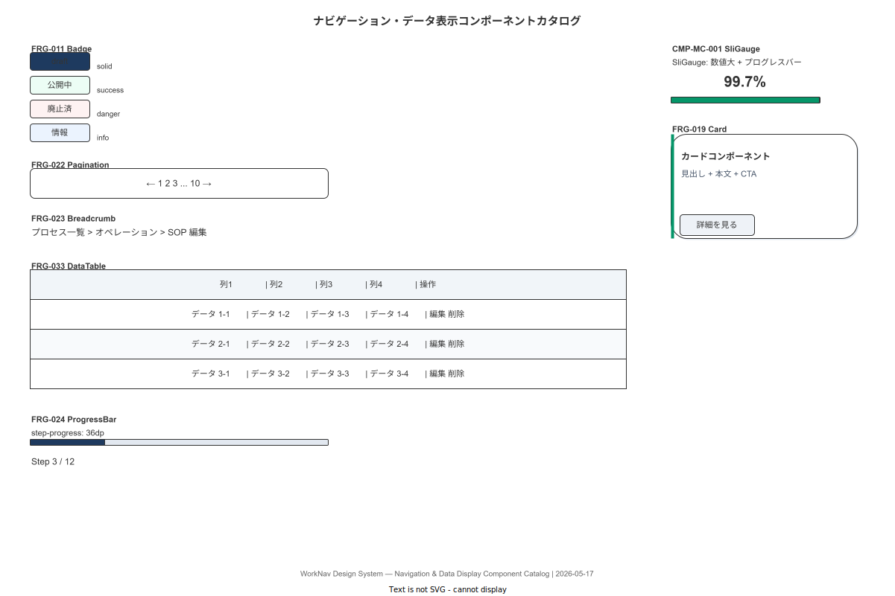

> 原本: [`img/fig_des_components_catalog_navigation.drawio`](img/fig_des_components_catalog_navigation.drawio)

---

### 2-4. データ表示部品

| FRG-ID | 物理名 | バリアント | 用途 |
|---|---|---|---|
| FRG-011 | Badge | solid / subtle / outline | 状態ラベル |
| FRG-012 | Chip | removable / selectable | フィルター選択 |
| FRG-013 | Avatar | image / initial / icon | ユーザー識別 |
| FRG-019 | Card | default / hover / selected | コンテンツコンテナ |
| FRG-024 | ProgressBar | linear / linear-striped | 進捗表示（FRG 版）|
| FRG-025 | ProgressCircle | — | 円形進捗 |
| FRG-026 | Divider | horizontal / vertical | 区切り線 |
| FRG-030 | Stepper | horizontal / vertical | ウィザードステップ |
| FRG-033 | DataTable | — | データグリッド（ソート・選択・ページング）|
| FRG-034 | Sparkline | line / bar | KPI カード内ミニチャート |

**図 12: DataTable / Sparkline / SliGauge 等データビジュアライゼーション部品カタログ**

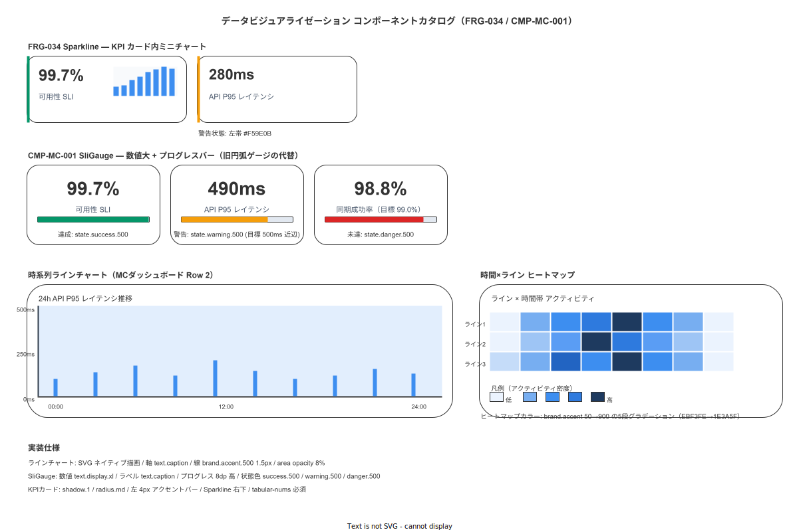

> 原本: [`img/fig_des_components_catalog_dataviz.drawio`](img/fig_des_components_catalog_dataviz.drawio)

---

### 2-5. オーバーレイ部品

| FRG-ID | 物理名 | バリアント | トリガー | サイズ |
|---|---|---|---|---|
| FRG-014 | Modal | sm / md / lg | CTA / 確認 | 400/560/720px（幅）|
| FRG-015 | Drawer | right / bottom | サイドアクション | 360/480px（右）/ 50vh（下）|
| FRG-032 | KBD | — | キーボードショートカット表示 | — |

**FRG-014 Modal** 使用時の必須要件:
- `shadow.4` 適用
- `radius.xl` 適用
- フォーカストラップ必須
- `Esc` キーで閉じる（破壊的操作 Modal のみ無効化）
- スクリム `surface.overlay` でベース画面を覆う

---

### 2-6. フォーム部品

| FRG-ID | 物理名 | 機能 |
|---|---|---|
| FRG-040 | Form | バリデーション統合・エラーサマリー・submit ハンドリング |

FRG-040 は FRG-003〜009 / FRG-036〜039 をラップし、`react-hook-form` + Zod スキーマ（詳細設計フェーズで確定）と連携する。

**FRG-041 Splitter 仕様**:

| 項目 | 内容 |
|---|---|
| バリアント | `vertical`（縦軸分割・左右ペイン用）/ `horizontal`（横軸分割・上下ペイン用）|
| ハンドル可視幅 | 8px（= `space.2`）|
| ヒット領域 | 16px（中心から左右各 8px）|
| 折りたたみトグル | ハンドル中央に `FRG-002 IconButton xs`（`ChevronLeft` / `ChevronRight`、`icon.sm`）。クリックで隣接ペインを最小幅（折りたたみ）へ縮退 |
| 折りたたみ最小幅 | 48px（アイコンバーモード）|
| トークン | 背景 `surface.divider`（idle）→ `border.color.focus`（hover/dragging）|
| WAI-ARIA | `role="separator"` `aria-orientation="vertical"` `aria-valuenow={width}` `aria-valuemin={min}` `aria-valuemax={max}` `aria-controls="{target-pane-id}"` `tabindex="0"` |
| キーボード | ← / → で ±16px / Shift+← / Shift+→ で ±64px / Home: 最小幅 / End: 最大幅 / Enter or Space: 折りたたみトグル |
| reduce-motion | `prefers-reduced-motion: reduce` 時は折りたたみアニメーション無し（即時切替）|
| i18n prefix | `common.splitter`（`aria-label`: 「サイドペインリサイズ」）|

---

## 3. CMP カタログ — 業務固有（既存強化）

既存 CMP-HA-001〜008・CMP-MA-001〜004・CMP-MC-001〜003 に以下の 6 軸を追記。

形式: `バリアント | サイズ | 状態 | トークン参照 | a11y 属性 | i18n キー | サウンド/ハプティック ID`

### 3-1. ハンディ APP 共通（CMP-HA）

| CMP-ID | 物理名 | バリアント | サイズ | 状態 | トークン参照 | a11y | i18n prefix | サウンド / ハプティック |
|---|---|---|---|---|---|---|---|---|
| CMP-HA-001 | StepCard | standard / branch / custom-input | flex | loading / ready / error | `surface.raised` / `text.body.lg` | `role="article"` `aria-labelledby` | `handy.step` | — |
| CMP-HA-002 | NumericInputField | manual / ble-auto | md / lg | idle / receiving / ok / ng / disabled | `border.color.success/error` / `text.display.lg` | `role="spinbutton"` `aria-valuemin/max` | `handy.measure` | `snd-scan-ok` / `hap-success` |
| CMP-HA-003 | PhotoCapturePanel | guide-free / guide-rect | fullscreen | waiting / capturing / review / uploading | `border.color.success` 4px / `state.success.500` | `aria-label` on preview | `handy.photo` | `snd-shutter` / `hap-medium` |
| CMP-HA-004 | QrScannerView | ble-hid / camera | fullscreen | scanning / success / fail / manual | `border.color.success/error` 4px / `state.success/danger.500` | `aria-label="QRコードスキャナ"` | `handy.qr` | `snd-scan-ok/ng` / `hap-medium/hap-error` |
| CMP-HA-005 | ElectronicSignPad | sign-only / sign-pin | fixed 50% | waiting / signing / pin-entry / success / locked | `neutral.300` canvas border | `aria-label="電子署名パッド"` | `handy.sign` | `hap-success` (OK) / `hap-error` (fail) |
| CMP-HA-006 | OfflineBanner | online / disconnected / emergency | 32dp 固定 | hidden / shown / emergency | `state.warning.500` / `state.andon.base` | `role="alert"` `aria-live="assertive"` | `handy.offline` | — |
| CMP-HA-007 | ProgressBar | step / job | 36dp | 0〜100% | `brand.primary.500` fill / `neutral.200` track | `role="progressbar"` `aria-valuenow/max` | `handy.progress` | — |
| CMP-HA-008 | AndonButton | — | 72dp+ 円形 | idle / armed / firing / recovered | `state.andon.base` / `state.andon.pulse` | `role="button"` `aria-live="assertive"` | `handy.andon` | `snd-andon-fire` / `hap-strong-3x` |
| CMP-HA-016 | RequiredScansChipStack | SCR-HA-003 (マルチターゲットスキャン) | 全幅 × 48dp | pending / scanned / failed | — | — | — | FR-EV-013 |

付録/99: 次採番値 **CMP-HA-017**。

### 3-2. マスタメンテ APP（CMP-MA）

| CMP-ID | 物理名 | バリアント | 状態 | トークン参照 | a11y | i18n prefix |
|---|---|---|---|---|---|---|
| CMP-MA-001 | SopTreeEditor | — | idle / drag / selected / error / collapsed | `surface.raised` `shadow.1` / `FRG-041 Splitter`（右端）| `role="tree"` `aria-expanded` | `master.sop_tree` |
| CMP-MA-002 | DslConditionBuilder | visual / raw | — | `font.mono` / `surface.sunken` | `role="region"` `aria-label="DSLビルダー"` | `master.dsl` |
| CMP-MA-003 | VersionDiffViewer | inline / parallel | — | `state.success.50` (追加) / `state.danger.50` (削除) | `role="log"` | `master.diff` |
| CMP-MA-004 | DryRunResultPanel | no-impact / has-impact | idle / running / done | `state.success.50/700` / `state.warning.50/700` | `role="status"` `aria-live="polite"` | `master.dry_run` |
| CMP-MA-005 | SopFlowCanvas | SCR-MA-004 (DAG フローモード) | flex × flex | idle / dragging-node / dragging-edge / cycle-detected | role="application" aria-roledescription="DAGエディタ" | FR-MA-016 |

付録/99: 次採番値 **CMP-MA-006**。

### 3-3. 管理コンソール（CMP-MC）

| CMP-ID | 物理名 | バリアント | 状態 | トークン参照 | a11y | i18n prefix |
|---|---|---|---|---|---|---|
| CMP-MC-001 | SliGauge | arc / linear | normal / warning / critical | `state.success.500` → `state.warning.500` → `state.danger.500` グラデ | `role="meter"` `aria-valuenow/min/max` | `console.sli` |
| CMP-MC-002 | DlqMonitorTable | — | idle / polling (30s) | `state.danger.50` 行背景（NG 件）| `role="table"` | `console.dlq` |
| CMP-MC-003 | HashChainVerifyResult | ok / broken | idle / verifying / done | `state.success.50` / `state.danger.50` | `role="status"` | `console.hash` |

付録/99: 次採番値 **CMP-MC-004**。

### 3-4. 共通コンポーネント（CMP-CMN — 新規）

アプリ横断の業務固有共通コンポーネント。FRG（汎用）とは区別する。

| CMP-ID | 物理名 | 目的 | 使用 SCR |
|---|---|---|---|
| CMP-CMN-001 | EmptyState | 業務文脈付き空状態（FRG-020 の業務ラッパー）| 全アプリのリスト系画面 |
| CMP-CMN-002 | Skeleton | データ取得中のプレースホルダー（FRG-021 の業務ラッパー）| 全アプリ |
| CMP-CMN-003 | FilterChipGroup | 一覧フィルターのチップ群（FRG-012 の業務ラッパー）| SCR-MC-002/004/007 等 |
| CMP-CMN-004 | EdgeStyleLegend | DAG エッジ種別（skip 灰 / goto 青 / insert 緑 / critical 赤輪郭）の凡例チップ | SCR-MA-004 (DAG モード) / SCR-HA-006 | FR-MA-016 |

付録/99: 次採番値 **CMP-CMN-005**。

---

## 4. ダークモード & 夜勤モード体験設計

### 4-1. テーマの三段切替

| mode | 適用条件 | 色調方針 |
|---|---|---|
| `light` | 通常日勤帯（default）| 白背景・深い藍テキスト |
| `dark` | OS ダーク設定またはユーザー手動 | deep navy 背景・薄いグレーテキスト |
| `nightShift` | HA 専用 / 20:00–6:00 自動（CFG-NN で時刻設定可）| 最暗背景・彩度-30%・グレア低減 |

```typescript
type ThemeMode = 'light' | 'dark' | 'nightShift';

function resolveThemeMode(hour: number, osDark: boolean, manual: ThemeMode | null): ThemeMode {
  if (manual) return manual;
  const nightStart = Number(getConfig('ui.dark_mode_start_hour', '20'));
  const nightEnd   = Number(getConfig('ui.dark_mode_end_hour', '6'));
  const isNight    = hour >= nightStart || hour < nightEnd;
  if (isNight) return 'nightShift';
  if (osDark) return 'dark';
  return 'light';
}
```

### 4-2. nightShift 専用調整

工場夜勤環境でのグレア低減・コントラスト維持のための特別設定:

- 背景: `#0B1220`（`surface.bg`）— `dark` の `#0F172A` よりさらに暗い
- テキスト: `#E2E8F0`（`neutral.200`）— 純白 `#FFFFFF` を使わない（グレア抑制）
- warning: 橙黄寄り `#F5A524`（赤緑色盲への配慮）
- danger: 朱寄り `#F87171`（ピュアな赤より可読性が高い）
- success: 青緑寄り `#34D399`（赤緑混同リスク低減）
- shadow: 発光方向ではなく沈降方向に振る（`shadow.1 dark` が nightShift では 80% 透明度）
- 白面積: 1 画面内で 25% 以下を原則
- カメラプレビュー表示時: 周囲を `surface.sunken`（`#070F1A`）で暗幕化し画面光を遮断
- **アンドン色のみ赤を維持**: 学習済緊急信号として変更不可（NFR-UX-008）

---

## 5. マイクロインタラクション原則

### 5-1. ボタン・タッチ操作

| インタラクション | 仕様 | 備考 |
|---|---|---|
| Button press (HA) | `scale(0.97)` 80ms `easing.accelerated` | グローブ操作では ripple は誤検知のため不採用 |
| Button press (Web) | `scale(0.97)` 120ms + カーソルホバーで `background-color` 遷移 150ms | — |
| Hover (Web) | background を 10% 暗く / bright に 150ms `easing.standard` | — |
| Disabled | `opacity 0.4` + `cursor: not-allowed` | アニメーションなし |
| Loading | `opacity 0.7` + Spinner アイコン 回転 800ms linear infinite | CTA テキストは保持 |

### 5-2. ページ遷移

| アプリ | 遷移 | 仕様 |
|---|---|---|
| ハンディ APP（順進）| 右→左スライド | `translateX(100%→0)` 200ms `easing.decelerated`（入場）|
| ハンディ APP（逆進）| 左→右スライド | `translateX(-100%→0)` 240ms `easing.decelerated` |
| マスタメンテ APP | フェード + 8px Y シフト | `opacity(0→1) + translateY(8px→0)` 200ms `easing.decelerated` |
| 管理コンソール | フェードのみ | `opacity(0→1)` 160ms `easing.standard`（データ密度高く動きを最小化）|

### 5-3. 状態変化アニメーション

| イベント | アニメーション | reduce-motion 時 |
|---|---|---|
| Step 完了 | `CheckCircle2` アイコン描画 360ms + 8px 上方ドリフト | 静止 `CheckCircle2` のみ |
| danger Snackbar 出現 | 6px X シェイク 80ms | シェイクなし・ フェードのみ |
| Toast 出現 | 上から 12px スライドイン 200ms | フェードのみ |
| Modal 開閉 | `scale(0.96→1)` + `opacity(0→1)` 200ms | フェードのみ |
| Drawer 開閉（右）| 右から `translateX(100%→0)` 320ms `easing.decelerated` | フェードのみ |
| Skeleton → コンテンツ | `opacity(0→1)` 480ms | フェードのみ |

### 5-4. スケルトン（Skeleton）

- 1.2 秒ループの「左→右ハイライト」(`background-position` アニメーション)
- ハイライト色: `neutral.200` → `neutral.100` → `neutral.200`
- `prefers-reduced-motion` 時: 静止グレー（`neutral.100`）のみ

### 5-5. 成功祝賀（Step 完了）

Step 完了の瞬間を「確かに賞賛」する（過度に派手にしない）:

1. `CheckCircle2` アイコン（`state.success.500` / `icon.xl` 32dp）が 360ms で描画アニメーション
2. 8px 上方ドリフト 200ms `easing.decelerated`
3. 成功テキスト「Step N 完了しました。」を 2 秒表示後フェード
4. サウンド `snd-success-soft` + ハプティック `hap-success`（HA のみ）

---

## 6. ダークモード自動切替（FR-UI-004 — 旧コード継承・拡張版）

```typescript
// 夜勤モード（nightShift）含む三段切替（FR-UI-004 拡張）
import { ThemeMode, resolveThemeMode } from './theme';

const hour    = new Date().getHours();
const osDark  = window.matchMedia('(prefers-color-scheme: dark)').matches;
const manual  = getStorage<ThemeMode>('ui.theme_override', null);

document.documentElement.setAttribute('data-theme', resolveThemeMode(hour, osDark, manual));
// data-theme = 'light' | 'dark' | 'nightShift'
// CSS var(--surface-bg) 等は data-theme 属性で切替

// CFG で時間帯設定可能にする
const DARK_MODE_START = Number(getConfig('ui.dark_mode_start_hour', '20'));
const DARK_MODE_END   = Number(getConfig('ui.dark_mode_end_hour',   '6'));
```

---

## 7. ブランドアイコン使用基準一覧（主要 Lucide アイコン）

| 意味 | Lucide 名 | サイズ | 色 |
|---|---|---|---|
| 完了・成功 | `CheckCircle2` | md / xl | `state.success.500` |
| 警告・注意 | `AlertTriangle` | md / xl | `state.warning.500` |
| エラー | `XCircle` | md / xl | `state.danger.500` |
| 情報 | `Info` | md | `state.info.500` |
| アンドン（緊急）| `Siren` | xl / 2xl | `state.andon.text` |
| QR スキャン | `QrCode` | lg | `text.primary` |
| バーコード | `Barcode` | lg | `text.primary` |
| カメラ | `Camera` | lg | `text.primary` |
| 計測器 | `Gauge` | lg | `text.primary` |
| 電子サイン | `PenLine` | lg | `text.primary` |
| BLE 接続中 | `Bluetooth` | md | `brand.accent.500` |
| BLE 未接続 | `BluetoothOff` | md | `text.tertiary` |
| オフライン | `WifiOff` | md | `state.warning.500` |
| 廃止・削除 | `Trash2` | md | `state.destructive.500` |
| 設定 | `Settings` | lg | `text.secondary` |
| ユーザー | `User` | lg | `text.secondary` |
| ログアウト | `LogOut` | md | `state.destructive.500` |
| 前へ（戻る）| `ChevronLeft` | lg | `text.secondary` |
| 次へ（進む）| `ChevronRight` | lg | `text.secondary` |

---

**本節で確定した方針**
- **デザイントークンを全網羅（カラー × 13 種 + neutral 12 段階 + セマンティック + ダーク + nightShift・タイポグラフィ・スペーシング・角丸・エレベーション・モーション・アイコン・フォーカスリング・ボーダー）し、ブランドアイデンティティ（05A_）を実装可能な仕様に落とし込んだ。**
- **state.danger / state.destructive / state.andon の 3 者を意味的に分離し、相互流用を設計レベルで禁止した。**
- **FRG-001〜040 の汎用 UI 部品カタログを確立し、次採番値 FRG-041 を 99_ 採番台帳に反映した。CMP-CMN-001〜004 を新設し、次採番値 CMP-CMN-005 とした。**
- **CMP-HA-016 RequiredScansChipStack を新設し、required_scans 配列駆動のマルチターゲットスキャン進捗表示 UI を確定する（FR-EV-013）。CMP-MA-005 SopFlowCanvas と CMP-CMN-004 EdgeStyleLegend を新設し、Step-DAG ビジュアルフロー編集の UI 部品契約を確定する（FR-MA-016）。**
- **テーマ三段切替（light / dark / nightShift）と夜勤専用グレア低減設計を確定した。**
- **マイクロインタラクション（ボタン・遷移・スケルトン・成功演出）の原則を確定し、reduce-motion 対応マトリクスを整備した。**
- **FRG-041 Splitter（vertical/horizontal）を新規採番し、次採番値を FRG-042 とした。SCR-MA-004 左ペインのリサイズ可能化（240〜480px）と折りたたみ（48px アイコンバー）を担う部品として定義した。**

---

## 参照業界分析

### 必須
- [`90_業界分析/18_現場HCIと作業者インターフェース.md`](../../90_業界分析/18_現場HCIと作業者インターフェース.md)
- [`90_業界分析/08_人間工学と作業負荷.md`](../../90_業界分析/08_人間工学と作業負荷.md)
- [`05A_ブランドアイデンティティとデザイン原則.md`](./05A_ブランドアイデンティティとデザイン原則.md)

### 関連
- [`90_業界分析/12_認知工学と状況認識.md`](../../90_業界分析/12_認知工学と状況認識.md)
