# 08 ワイヤーフレーム（マスタメンテ APP・11 画面分）

本章の責務は、マスタメンテ APP（SCR-MA-001〜011）の 11 画面について、コンポーネント配置・レイアウト領域・主要 UI 要素・インタラクションを確定することである。マスタメンテ APP は React 製の Web アプリケーションであり、アクセスロールは master_admin および quality_admin に限定される（FR-AU-002）。IPA 共通フレーム 2013「2.4 ヒューマンインタフェース設計」を担保し、NFR-UX 全 43 件のうち Web 管理 UX に係る要件を設計として担保する。

---

## 1. 共通レイアウトフレーム（1440×900px 標準）

| 領域 | 高さ (px) | 幅 | 備考 |
|---|---|---|---|
| **Header** | **56px** | 100% | 左: WorkNav ロゴタイプ + アプリ識別バッジ「マスタメンテ」/ 中央: パンくず / 右: AutoSave ステータス + 通知ベル + アバター |
| **メインコンテンツ** | flex（残余）| 100% | 内側 `padding: 24px`（`space.6`）|
| フッター | なし | — | 情報は Header に集約 |

ブレークポイント: `≥1440px / 1280px / 1024px`。1024px 未満は非対応画面を表示（管理業務専用）。

**ヘッダー仕様統一**:
- 背景: `brand.primary.900`（HA と共通のブランドアイデンティティ）
- ロゴタイプ: white / アプリ識別バッジ: `brand.primary.300` bg / `text.inverse`
- パンくず: 白テキスト / セパレータ `ChevronRight` icon.sm / 現在地は太字
- AutoSave: 「最終保存: N 秒前」/ `text.caption` white 70% / SCR-MA-004 のみ表示
- AutoSave + Undo + Redo ボタン: `FRG-002 ghost` white 3 個（Header 右寄り）

**共通インタラクション制約**:
- 破壊的操作（廃止・削除）は `FRG-014 Modal destructive` による二段確認必須
- エラー: `FRG-017 Snackbar danger`（5 秒 / 手動閉）+ ERR-CODE
- 全ボタン: 44dp（px）以上
- 楽観的ロック衝突: `FRG-031 Banner warning`「別のユーザーが編集中です」をヘッダー直下に表示

---

## 2. 各画面ワイヤーフレーム詳細

### SCR-MA-001 プロセス一覧

**図 1: MA-001 プロセス一覧画面ワイヤーフレーム**

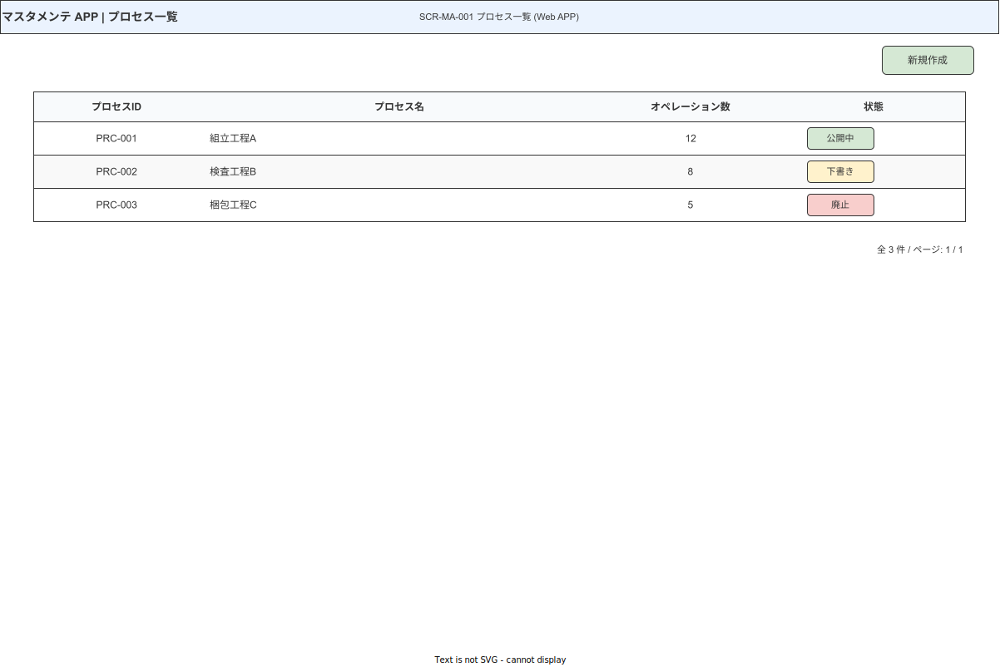

> 原本: [`img/fig_des_screen_ma_001.drawio`](img/fig_des_screen_ma_001.drawio)

**① 領域定義**

| 領域 | 高さ | 幅 | 内容 |
|---|---|---|---|
| Header | 56px | 100% | 共通ヘッダー（パンくず: 「プロセス一覧」）|
| メインコンテンツ | flex | 100% - 48px（左右 24px padding）| ツールバー + テーブル + ページネーション |
| ツールバー | 52px | 100% | 左: 検索 Input 320px / 右: 「新規プロセス作成」primary |
| テーブル | flex | 100% | `FRG-033 DataTable` |
| ページネーション | 44px | 100% | `FRG-022` 20 件/ページ |

**② コンポーネント**

| CMP-ID | 物理名 | サイズ | 状態 |
|---|---|---|---|
| FRG-003 | Input search | 320 × 40 | default / focus / active |
| FRG-001 | Button primary（新規作成）| auto × 40 | default / disabled（quality_admin）|
| FRG-033 | DataTable | flex | default / loading / empty |
| FRG-011 | Badge（ステータス）| auto × 22 | draft / published / obsolete |
| CMP-CMN-001 | EmptyState | — | 0 件時 |
| FRG-022 | Pagination | — | 20 件/ページ |

**③ インタラクション**

| トリガー | アクション | フィードバック | TRN |
|---|---|---|---|
| 「新規作成」クリック | — | SCR-MA-004 へ（新規）| TRN-026 |
| 行の「SOP 編集」クリック | — | TRN-026 で SCR-MA-004 へ | TRN-026 |
| 行の「廃止処理」クリック | — | TRN-039 で SCR-MA-011 へ | TRN-039 |
| 検索入力 | debounce 300ms フィルタ | テーブルリアルタイム更新 | — |
| 「オペレーション一覧」リンク | — | TRN-027 で SCR-MA-002 へ | TRN-027 |

**④ 設計判断**

- ステータスバッジはテキストラベル必須（`draft` / `公開中` / `廃止済`）+ 色（`state.info.500` / `state.success.500` / `neutral.400`）+ 形状で P/D/T 型色覚対応。
- RBAC: quality_admin は「新規作成」「廃止処理」ボタンを非表示（disabled ではなく DOM から除外）。

---

### SCR-MA-002 オペレーション一覧

**図 2: MA-002 オペレーション一覧画面ワイヤーフレーム**

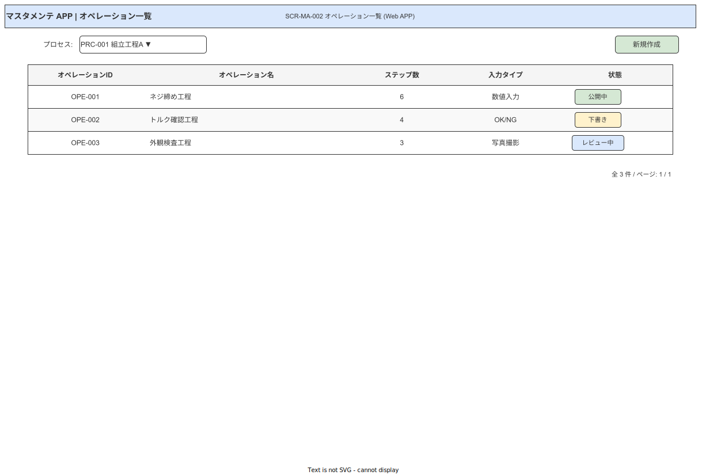

> 原本: [`img/fig_des_screen_ma_002.drawio`](img/fig_des_screen_ma_002.drawio)

**① 領域定義**

| 領域 | 高さ | 内容 |
|---|---|---|
| Header | 56px | パンくず: 「プロセス一覧 > {プロセス名}」|
| メインコンテンツ | flex | ツールバー + テーブル + ページネーション（MA-001 と同型）|

**② コンポーネント** — MA-001 と同型（検索 Input / primary ボタン / DataTable / Pagination）

**③ インタラクション**

| トリガー | アクション | TRN |
|---|---|---|
| 行の「SOP 編集へ」クリック | SCR-MA-004 へ | TRN-026 |
| 「← プロセス一覧へ戻る」クリック | SCR-MA-001 へ | TRN-028 |

**④ 設計判断**

- MA-001/002/003 は同型テーブルパターン。ページタイトル下部に「プロセス: {プロセス名}」を `text.h3` で表示し、現在の文脈を常に明示（NFR-UX-003）。

---

### SCR-MA-003 製品一覧

**図 3: MA-003 製品一覧画面ワイヤーフレーム**

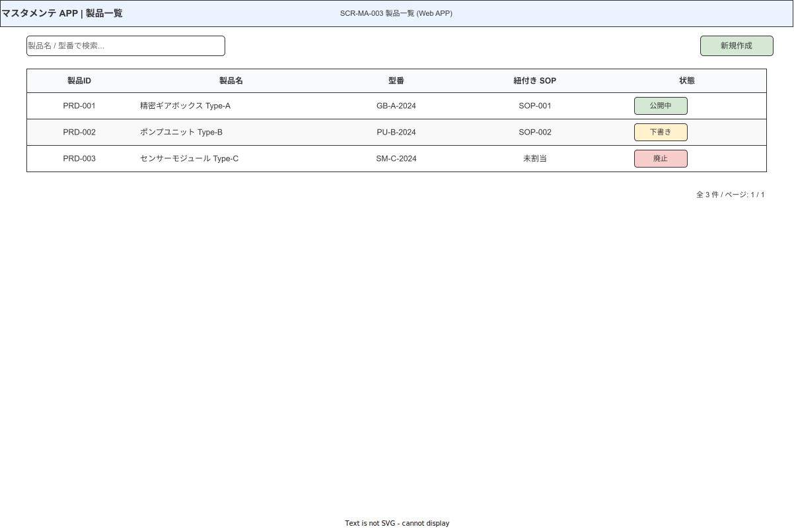

> 原本: [`img/fig_des_screen_ma_003.drawio`](img/fig_des_screen_ma_003.drawio)

**① 領域定義** — MA-001/002 と同型（追加: CSV インポートボタン）

**② コンポーネント** — MA-001 + `FRG-001 secondary`（CSV インポート）

**③ インタラクション**

| トリガー | アクション | TRN |
|---|---|---|
| 「CSV インポート」クリック | SCR-MA-005 へ | TRN-029 |

**④ 設計判断** — MA-001/002 と同型。external_key_binding 紐付け状況は `FRG-011 Badge` + `Link2` アイコンで表示。

---

### SCR-MA-004 SOP 編集（★ハイファイ詳細）

**図 4: MA-004 SOP 編集画面ワイヤーフレーム（通常時・左ペイン展開）**

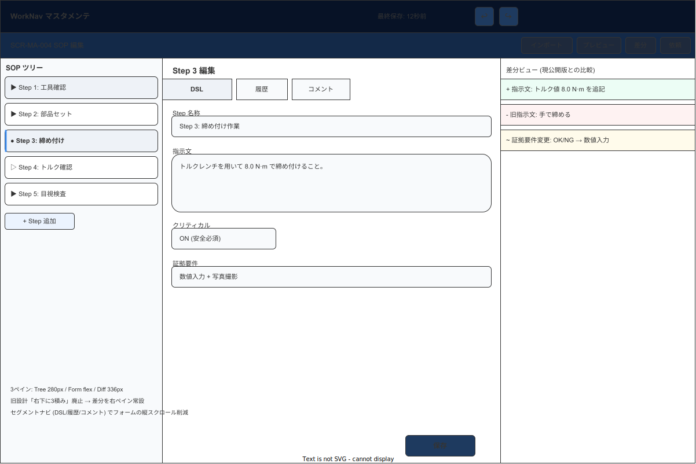

> 原本: [`img/fig_des_screen_ma_004.drawio`](img/fig_des_screen_ma_004.drawio)

**図 4b: MA-004 SOP 編集画面ワイヤーフレーム（左ペイン折りたたみ時）**

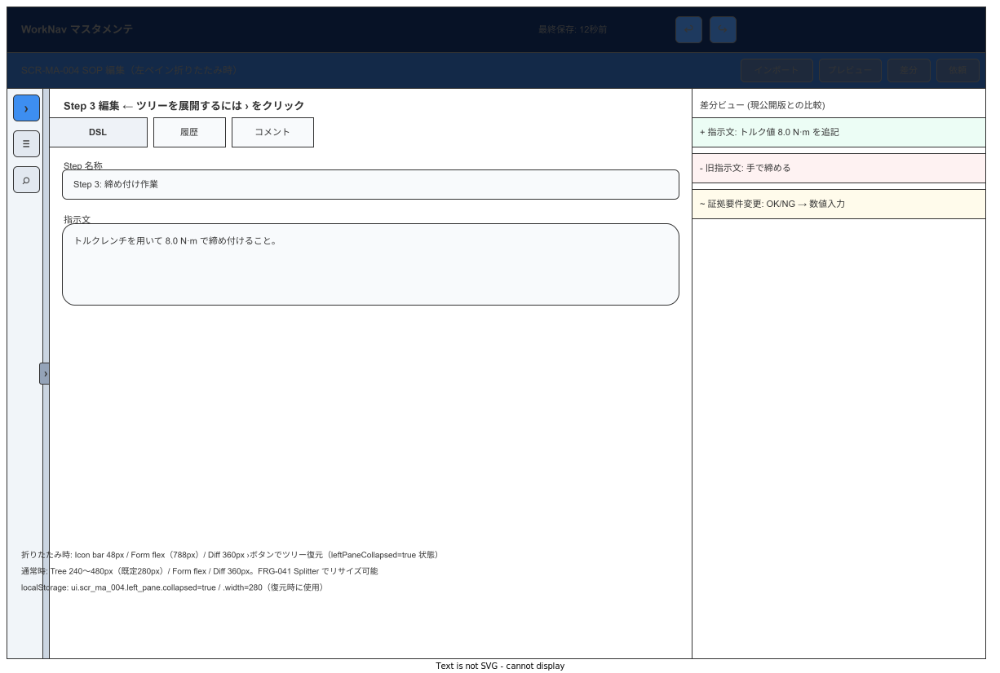

> 原本: [`img/fig_des_screen_ma_004_collapsed.drawio`](img/fig_des_screen_ma_004_collapsed.drawio)

**① 領域定義（3 ペイン構成）**

| 領域 | 幅 | 高さ | 内容 |
|---|---|---|---|
| Header | 100% | 56px | 共通 + AutoSave + Undo/Redo + アクションバー |
| アクションバー | 100% | 44px | 「インポート」「プレビュー」「バージョン差分」「レビュー依頼」secondary（右寄せ）|
| **左ペイン: SOP ツリー** | **240〜480px / 既定 280px / 折りたたみ時 48px** | flex | `CMP-MA-001 SopTreeEditor` |
| **中央ペイン: 編集フォーム / DAG フロー（モード切替）** | **flex（残余の 2/3）** | flex（独立スクロール）| Step 属性フォーム + セグメントナビ（DSL / 履歴 / コメント）|
| **右ペイン: 差分ビュー** | **360px 固定** | flex（独立スクロール）| `CMP-MA-003 VersionDiffViewer`（インライン形式）|
| ペイン境界 | 8px 可視 / 16px ヒット | flex | `FRG-041 Splitter vertical` |

**センターペインモード切替（44dp 高 / FRG-010 segmented control 2-mode）**

| モード | 内容 | 主コンポーネント |
|---|---|---|
| `Step フォーム` | Step 属性編集（既存挙動）。下層 segmented nav: DSL / 履歴 / コメント | CMP-MA-002 DslConditionBuilder |
| `DAG フロー` | Step ノード / エッジ DAG 編集。下層 segmented nav: 構成 / シミュレーション / 凡例 | CMP-MA-005 SopFlowCanvas, CMP-CMN-004 EdgeStyleLegend |

**② コンポーネント（サイズ・トークン詳細）**

| CMP-ID | 物理名 | サイズ (px) | 背景 / トークン | 状態 |
|---|---|---|---|---|
| CMP-MA-001 | SopTreeEditor | 240–480 × flex（既定 280）| `surface.subtle` / `shadow.1` 右側 | idle / drag / selected / collapsed |
| — | ツリーノード | 40 × 280 / 各行 | `surface.raised` hover / `brand.primary.50` selected | — |
| — | ドラッグハンドル | 12 × 40 / 左端 | `neutral.300` | hidden → visible on hover |
| — | ステータスチップ | auto × 20 | critical: `state.danger.100` / branch: `brand.accent.50` | — |
| FRG-041 | Splitter vertical（ペイン境界）| 8 × flex | `surface.divider`（idle）/ `border.color.focus`（hover/drag）| idle / hover / dragging / collapsed-edge |
| FRG-040 | Form（中央ペイン）| flex | — | idle / validating / error |
| FRG-010 | Tabs（DSL/履歴/コメント）| 360 × 40 | `surface.raised` / underline variant | — |
| CMP-MA-002 | DslConditionBuilder | flex | `font.mono` / `surface.sunken` | visual / raw |
| CMP-MA-003 | VersionDiffViewer（右）| 360 × flex | `state.success.50`（追加）/ `state.danger.50`（削除）/ `state.warning.50`（変更）| — |
| FRG-001 | Button ghost（Undo）| 36 × 36 | Header 内 / white | default / disabled |
| FRG-001 | Button ghost（Redo）| 36 × 36 | Header 内 / white | default / disabled |
| FRG-016 | Toast（AutoSave）| — | success / warning | — |
| CMP-MA-005 | SopFlowCanvas | flex × flex | surface.subtle / エッジ brand.accent.500 / cycle-edge state.danger.500 | idle / dragging-node / cycle-detected |
| CMP-CMN-004 | EdgeStyleLegend | auto × 36 | 4 chip 横並び | static |

**③ インタラクション**

| トリガー | アクション | フィードバック | TRN |
|---|---|---|---|
| ツリーノードクリック | 中央ペインに Step フォーム表示 | ノードに `selected` スタイル + フォームフェードイン 160ms | — |
| AutoSave（30 秒）| Draft バックグラウンド保存 | Header の「最終保存: 0 秒前」更新 | — |
| Ctrl+Z / Undo ボタン | 最後の操作を取り消す | 直前状態に戻る（最大 50 操作）| — |
| 楽観的ロック衝突 | 保存拒否 | `FRG-031 Banner warning`「別のユーザーが編集中です。差分で確認してください」| — |
| 「インポート」クリック | SCR-MA-005 へ | TRN-029 | TRN-029 |
| 「プレビュー」クリック | SCR-MA-006 へ | TRN-031 | TRN-031 |
| 「バージョン差分」クリック | SCR-MA-010 へ | TRN-037（2 版以上存在時のみ）| TRN-037 |
| 「レビュー依頼」クリック | SCR-MA-007 へ | TRN-033（Draft 状態時のみ）| TRN-033 |
| モード切替「DAG フロー」クリック | 中央ペインを SopFlowCanvas に置換 | 160ms フェード | 左/右ペイン状態維持 |
| ノード DnD（DAG モード）| Step 並べ替え | 即時再描画 + Auto-Save トリガ | — |
| エッジ作画（ノードから別ノードへドラッグ）| 条件エッジを追加（条件 DSL 入力 popover を起動）| 循環参照検出時は赤エッジ + Banner（ERR-VAL-024）| — |
| シミュレーションサブタブ選択 | サンプル値入力で実行パスをハイライト | 200ms 以内（クライアント完結）| — |
| ペイン境界ドラッグ | 左ペイン幅を 240〜480px の範囲でリサイズ | ハンドル `hover` スタイル + カーソル `col-resize` / 幅を localStorage `ui.scr_ma_004.left_pane.width` に保存（debounce 500ms）| — |
| 折りたたみトグルクリック / Ctrl+\\ | 左ペインを 48px アイコンバーに縮退 / 展開 | 160ms フェード（`prefers-reduced-motion: reduce` 時は即時）/ `leftPaneCollapsed` を localStorage に保存 | — |
| ← / → キー（スプリッタ フォーカス時）| ±16px リサイズ（Shift 併用で ±64px）/ Home: 240px / End: 480px / Enter or Space: 折りたたみトグル | 即時反映 + localStorage 保存 | — |

**④ 設計判断**

- 旧設計「右ペイン下半に Step フォーム + DSL + 差分の 3 積み」を廃止: 差分ビューを常設の右ペイン（360px 固定）に移動し、フォームと完全分離。フォームの下端が見えなくなる問題を解消。
- DSL ビルダー・変更履歴・コメントはセグメントナビ（`FRG-010 Tabs`）で切替: 縦スクロール量を大幅削減。
- 差分ビュー表現を「サマリ / インライン / 並列」3 種から**インライン 1 種**に統一（MA-007/010 でのみ別形式を使用）: 作業者の学習コストを低減。
- ドラッグハンドルを各ツリーノード左端 12px に固定し、ホバー時のみ表示。マウスオーバーで意図的な並び替えを明示。
- DAG エディタを中央ペインのモード切替で同居させ、3 ペイン構造（左ツリー 280px / 中央 flex / 右差分 360px）を維持する。タブ化・別画面化を避けることで編集者の視野を保つ。
- モード切替は intra-screen 操作のため TRN 識別子を発行しない。Zustand store にモードフラグを保持し、リフレッシュ後も復元する。
- **左ペイン リサイズ / 折りたたみ**: 左ペインを「240〜480px リサイズ可（既定 280px）+ 48px アイコンバー折りたたみ」に変更した。根拠:（1）深ネスト SOP でノード名が 280px 幅で切れる問題を解消；（2）DAG フロー編集時は中央ペインを最大化したい局面がある；（3）1024px 幅環境での実効リサイズ上限は `1024 − 360（右） − 400（中央最小） − 48（padding）= 216px`（≒ 240px に切り上げ）。ペイン境界を `FRG-026 Divider vertical`（純粋区切り線）から `FRG-041 Splitter vertical`（リサイズ可能）に変更した。ペイン幅・折りたたみ状態は `localStorage`（`ui.scr_ma_004.left_pane.width` / `ui.scr_ma_004.left_pane.collapsed`）に永続化し、リフレッシュ後も復元する（モード切替の localStorage 復元と同型）。折りたたみアニメーション（160ms フェード）は `prefers-reduced-motion: reduce` 時は即時切替にフォールバックする（`05A_ブランドアイデンティティとデザイン原則.md` 原則 9「reduce-motion で機能が落ちない」準拠）。既存 drawio 図（右ペイン幅 336px）と仕様テキスト（360px）の齟齬は本改修では修正対象外とし、図の更新で吸収する。

---

### SCR-MA-005 SOP インポート

**図 5: MA-005 SOP インポート画面ワイヤーフレーム**

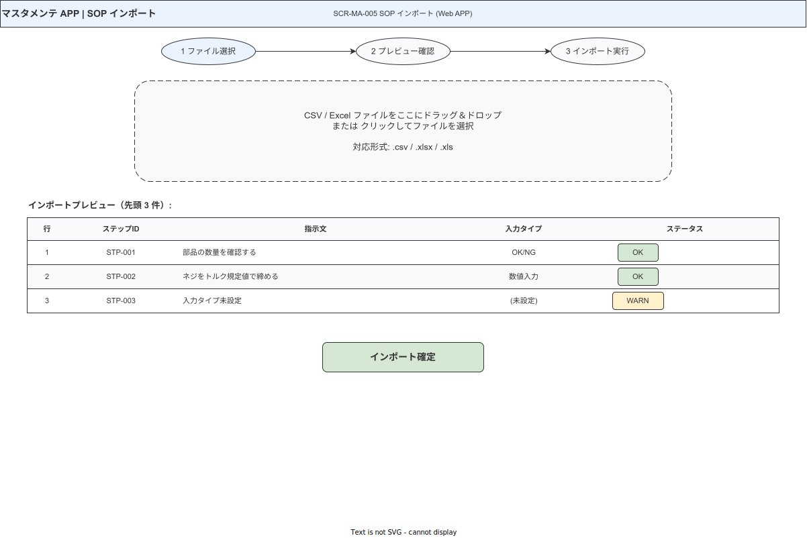

> 原本: [`img/fig_des_screen_ma_005.drawio`](img/fig_des_screen_ma_005.drawio)

**① 領域定義**

| 領域 | 高さ | 内容 |
|---|---|---|
| Header | 56px | パンくず: 「SOP 編集 > SOP インポート」|
| DnD ゾーン | 200px | `FRG-037 FilePicker`（CSV/xlsx・10MB 以下）|
| テンプレートリンク | 24px | ダウンロードリンク `text.link` |
| 不整合サマリバッジ | 36px | 「エラー N 件・警告 M 件」`FRG-011 Badge danger/warning` |
| プレビューテーブル | flex | `FRG-033 DataTable`（不整合行: `state.danger.50` 背景）|
| アクションエリア | 72px | 確認 Checkbox + 「インポート実行」primary + 「キャンセル」ghost |

**② コンポーネント**

| CMP-ID | 物理名 | サイズ | 状態 |
|---|---|---|---|
| FRG-037 | FilePicker | 全幅 × 200 | idle / dragover / selected / error |
| FRG-033 | DataTable（プレビュー）| flex | loading / ready / error-rows |
| FRG-007 | Checkbox（確認済み）| auto × 44 | unchecked → checked |
| FRG-001 | Button primary（実行）| auto × 40 | disabled → active（Checkbox チェック後）|

**③ インタラクション**

| トリガー | アクション | TRN |
|---|---|---|
| ファイルドロップ / 選択 | 自動解析 + プレビュー表示 | — |
| 「インポート実行」クリック | API-master-012 | TRN-030 で SCR-MA-004 へ |

**④ 設計判断** — 「インポート実行」はプレビュー確認チェックボックスにチェック後のみ有効化（意図しないバルク投入の防止）。

---

### SCR-MA-006 SOP プレビュー

**図 6: MA-006 SOP プレビュー画面ワイヤーフレーム**

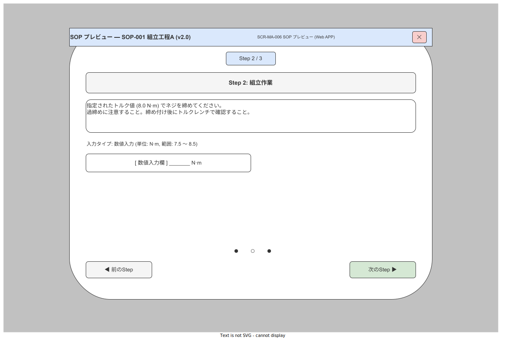

> 原本: [`img/fig_des_screen_ma_006.drawio`](img/fig_des_screen_ma_006.drawio)

**① 領域定義**

| 領域 | 高さ | 内容 |
|---|---|---|
| Header | 56px | 「プレビューモード」`FRG-011 Badge info` + 「閉じる」ghost 右上 |
| プレビューコントロール | 48px | ← 前 Step / Step N/M / 次 Step → ナビ |
| HA シミュレーター | flex | ハンディ APP SCR-HA-005 の表示を Web で再現。360×640 枠線内に表示 |
| 言語セレクタ | 40px | `FRG-005 Select` locale 切替（右下）|

**② コンポーネント**

| CMP-ID | 物理名 | サイズ | 備考 |
|---|---|---|---|
| — | HA シミュレーター枠 | 360 × 640 px / 中央 | 枠線: `neutral.300` / `shadow.2` / `radius.xl` |
| FRG-001 | 前/次 Step ボタン ghost | auto × 40 | disabled（端 Step）|
| FRG-005 | Select（言語）| 160 × 40 | ja / ja-simple / en |

**③ インタラクション** — Step ナビ: リアルタイム表示切替（副作用なし）。「閉じる」: TRN-032 で SCR-MA-004 へ。

**④ 設計判断** — HA シミュレーター枠を 360×640 の実機サイズで表示し「実際にどう見えるか」を確認可能。マスタメンテ側の Step 指示文が 200 文字制限に収まるかを視覚的に確認できる。

---

### SCR-MA-007 レビュー依頼

**図 7: MA-007 レビュー依頼画面ワイヤーフレーム**

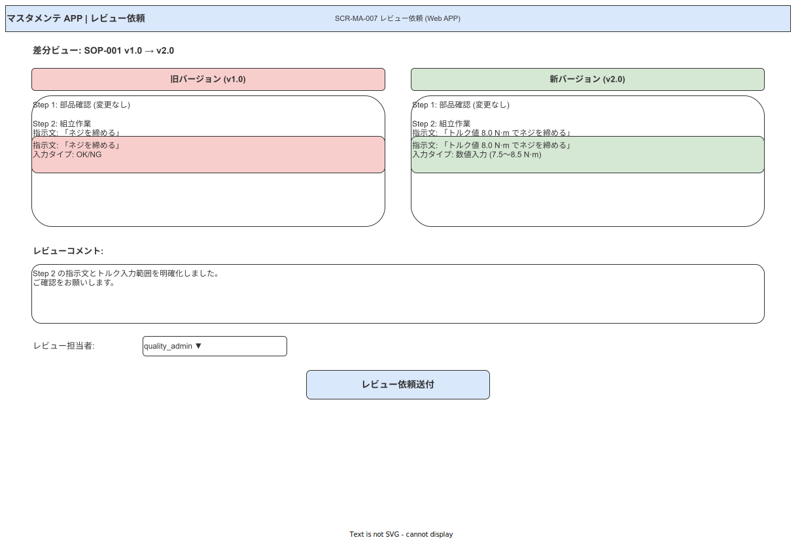

> 原本: [`img/fig_des_screen_ma_007.drawio`](img/fig_des_screen_ma_007.drawio)

**① 領域定義（70/30 非対称 2 ペイン）**

| 領域 | 幅 | 内容 |
|---|---|---|
| Header | 100% | パンくず: 「SOP 編集 > レビュー依頼」|
| **左ペイン: 差分サマリ** | **70%** | 変更件数 + Step 別差分一覧（インライン形式）|
| **右ペイン: 依頼フォーム** | **30%** | レビュー担当者 + 概要 + 送付ボタン |

**② コンポーネント**

| CMP-ID | 物理名 | サイズ | 備考 |
|---|---|---|---|
| CMP-MA-003 | VersionDiffViewer（左）| 70% × flex | `surface.subtle` bg |
| FRG-006 | Combobox（担当者選択）| 全幅 × 40 | quality_admin 一覧 / 複数選択 |
| FRG-004 | Textarea（変更概要）| 全幅 × 120 | 必須・500 文字 |
| FRG-001 | Button primary（送付）| 全幅 × 40 | disabled → active |

**③ インタラクション** — 「送付」クリック: API-master-004 → under_review 状態遷移 + メール通知 → 画面を SCR-MA-004 に戻るが SOP はロック状態。

**④ 設計判断** — 旧設計の 50/50 から 70/30 に変更: 差分確認が主タスクのため差分ビューアに広さを与える。フォームは参照しながら入力できる最小幅 30% を確保。

---

### SCR-MA-008 承認サイン（quality_admin 専用）（★ハイファイ詳細）

**図 8: MA-008 承認サイン画面ワイヤーフレーム**

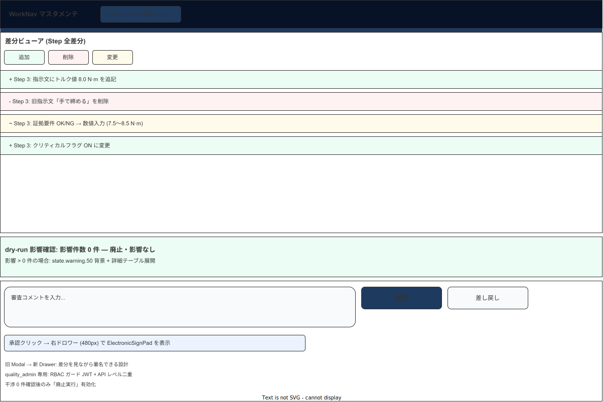

> 原本: [`img/fig_des_screen_ma_008.drawio`](img/fig_des_screen_ma_008.drawio)

**① 領域定義**

| 領域 | 高さ | 幅 | 内容 |
|---|---|---|---|
| Header | 56px | 100% | 共通 + `FRG-011 Badge`「quality_admin 承認レビュー」`state.info.50` + `Shield` アイコン |
| Header 下ラベル | 8px | 100% | `brand.primary.500` 細帯（quality_admin 専用画面の視覚識別）|
| 上部: 差分ビューア | flex（上 60%）| 100% | `CMP-MA-003` インライン差分 + `CMP-CMN-003` フィルタ |
| 中部: dry-run カード | 80px（最小）/ 条件付き展開 | 100% | 影響件数カード（`FRG-019`）|
| 下部: 承認アクション | 240px | 100% | コメント + 「承認」「差し戻し」ボタン |
| 電子サイン Drawer | 420px 幅 | right | `FRG-015 Drawer right`「承認」タップ時にスライドイン |

**② コンポーネント（サイズ・トークン詳細）**

| CMP-ID | 物理名 | サイズ (px) | 背景 / トークン | 状態 |
|---|---|---|---|---|
| CMP-MA-003 | VersionDiffViewer（上）| 100% × 上 60% | `state.success.50`（追加）/ `state.danger.50`（削除）| — |
| CMP-CMN-003 | FilterChipGroup（差分フィルタ）| auto × 36 | 追加/削除/変更 3 チップ | selectable |
| FRG-019 | dry-run カード | 100% × 80+ | 影響 0: `state.success.50` / >0: `state.warning.50` | — |
| FRG-004 | Textarea（審査コメント）| 100% × 80 | — | required |
| FRG-001 | Button primary（承認）| 160 × 44 | `brand.primary.500` | default |
| FRG-001 | Button secondary（差し戻し）| 160 × 44 | — | default |
| FRG-015 | Drawer right（電子サイン）| 420 × 100vh | `surface.raised` / `shadow.4` / `radius.xl` 左端 | hidden / open |
| CMP-HA-005 | ElectronicSignPad（Web版）| 380 × 200 | `surface.sunken` / `border.color.default` | waiting / signing / success |

**③ インタラクション**

| トリガー | アクション | フィードバック | TRN |
|---|---|---|---|
| 「承認」クリック | 電子サイン Drawer 開く | `FRG-015 Drawer right` スライドイン 320ms | — |
| Drawer でサイン + 確定 | PIN 認証 + 承認 API | loading → Drawer 閉じる + Toast success → TRN-035 で SCR-MA-009 へ | TRN-035 |
| 「差し戻し」クリック | 差し戻し確認 Modal | `FRG-014 Modal destructive`「差し戻し理由（必須）」→ API → draft 状態へ | — |

**④ 設計判断**

- quality_admin 専用画面であることを Header に `Shield` アイコン + バッジで視覚的に示す（ロール確認のための「威厳」設計）。
- 旧設計「差分 60% + dry-run + 承認フォームを縦積み」を改善: dry-run は折りたたみカード（影響 0 時はグリーンで折りたたみ済み）にし、不要な縦スクロールを抑制。
- 電子サインを Modal から Drawer へ変更: Drawer は差分を見ながら署名できる（差分画面が完全に隠れない）。

---

### SCR-MA-009 公開設定

**図 9: MA-009 公開設定画面ワイヤーフレーム**

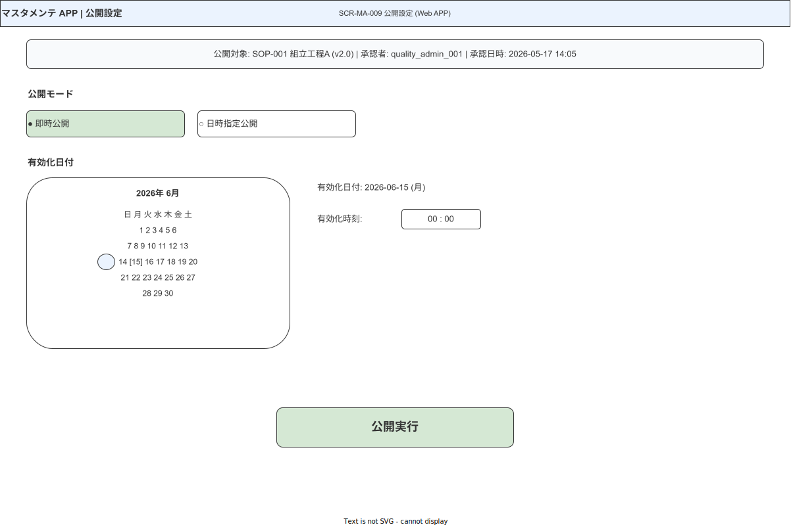

> 原本: [`img/fig_des_screen_ma_009.drawio`](img/fig_des_screen_ma_009.drawio)

**① 領域定義**

| 領域 | 高さ | 内容 |
|---|---|---|
| Header | 56px | パンくず: 「承認サイン > 公開設定」|
| SOP 情報カード | 120px | `FRG-019 Card`（SOP 名・版・承認者・承認日 読み取り専用）|
| 公開設定フォーム | 160px | effective_date `FRG-038 DatePicker` + ロット番号 Input + 公開コメント Textarea |
| 警告エリア（条件付き）| 56dp | 過去日付選択時: `FRG-031 Banner warning` |
| アクションエリア | 72px | 「公開実行」primary + 「キャンセル」ghost |

**② コンポーネント**

| CMP-ID | 物理名 | サイズ | 備考 |
|---|---|---|---|
| FRG-019 | Card（SOP 情報）| 100% × 120 | `shadow.1` / 読み取り専用 |
| FRG-038 | DatePicker | 240 × 40 | default 本日 / 過去日付も選択可 |
| FRG-003 | Input（ロット番号）| 全幅 × 40 | 任意 |
| FRG-001 | Button primary（公開実行）| auto × 40 | default |

**③ インタラクション**

| トリガー | アクション | TRN |
|---|---|---|
| 過去日付選択 | Banner warning 表示（強制ブロックなし）| — |
| 「公開実行」クリック | API-master-006 → published 状態遷移 | TRN-036 で SCR-MA-001 へ |

**④ 設計判断** — dry-run は SCR-MA-011（廃止）でのみ必須実行。公開設定には影響確認は不要（承認サイン SCR-MA-008 で確認済）。

---

### SCR-MA-010 バージョン差分

**図 10: MA-010 バージョン差分画面ワイヤーフレーム**

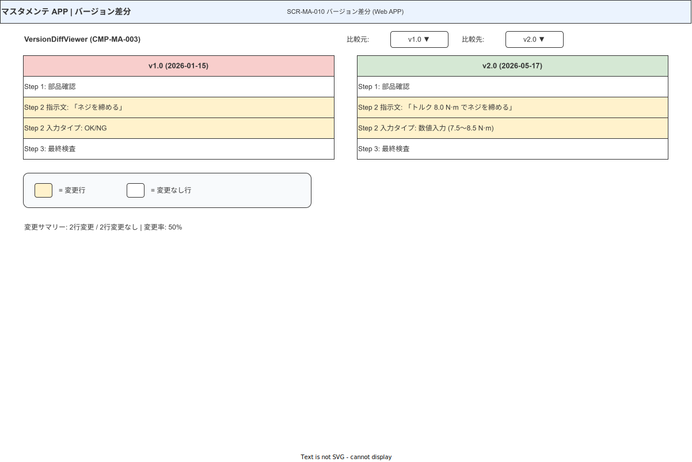

> 原本: [`img/fig_des_screen_ma_010.drawio`](img/fig_des_screen_ma_010.drawio)

**① 領域定義**

| 領域 | 高さ | 内容 |
|---|---|---|
| Header | 56px | 「バージョン差分ビュー」+ 「閉じる」ghost 右上 |
| バージョン選択バー | 48px | 左版 Select + 右版 Select（50/50）|
| 差分サマリカード | 72px | 追加 N / 削除 M / 変更 P の `FRG-019 Card` 3 枚横並び |
| `CMP-MA-003` VersionDiffViewer | flex | **並列表示**（左: 旧版 / 右: 新版 / スクロール同期）|
| フィルタバー | 40px | `CMP-CMN-003 FilterChipGroup`（追加/削除/変更/全て）|

**② コンポーネント** — Select × 2 / Card × 3 / DataTable × 2（並列）/ FilterChipGroup

**③ インタラクション** — バージョン選択変更でリアルタイム差分更新。「閉じる」: TRN-038 で SCR-MA-004 へ。

**④ 設計判断** — MA-004 右ペイン（常設インライン差分）と MA-010（詳細並列差分）で差分表現を役割分担。MA-010 のみ「並列表示」を採用し、MA-007/008 は「インライン」に統一。

---

### SCR-MA-011 廃止処理

**図 11: MA-011 廃止処理画面ワイヤーフレーム**

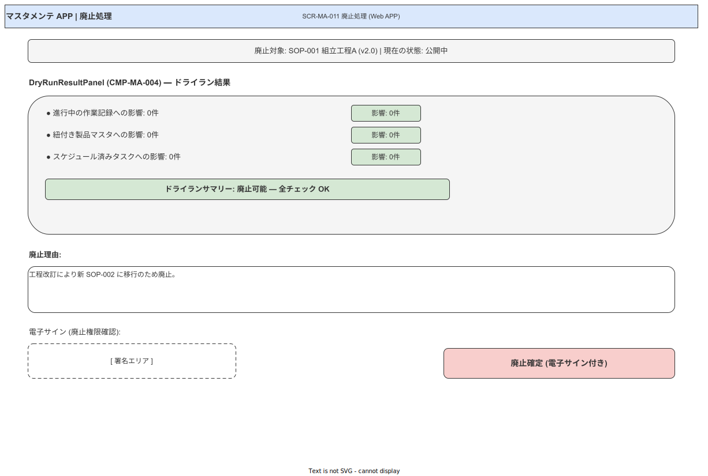

> 原本: [`img/fig_des_screen_ma_011.drawio`](img/fig_des_screen_ma_011.drawio)

**① 領域定義**

| 領域 | 高さ | 内容 |
|---|---|---|
| Header | 56px | 「廃止処理」`FRG-011 Badge destructive` |
| SOP 情報カード | 100px | 読み取り専用（SOP 名・版・最終公開日）|
| `CMP-MA-004` DryRunResultPanel | flex（最小 200px）| 影響範囲一覧。影響 0: `state.success.50` / >0: `state.warning.50` + 件数 |
| 廃止理由フォーム | 120px | Textarea 必須 + 電子サイン確認チェック |
| アクションエリア | 72px | 「廃止実行」`state.destructive.500` + 「キャンセル」ghost |

**② コンポーネント**

| CMP-ID | 物理名 | サイズ | 状態 |
|---|---|---|---|
| FRG-019 | Card（SOP 情報）| 100% × 100 | readonly |
| CMP-MA-004 | DryRunResultPanel | 100% × flex | running / no-impact / has-impact |
| FRG-004 | Textarea（廃止理由）| 100% × 80 | 必須 |
| FRG-007 | Checkbox（電子サイン確認）| auto × 44 | unchecked → checked |
| FRG-001 | Button（廃止実行）| auto × 40 | `state.destructive.500` / disabled（影響 >0 or 未チェック）→ active |

**③ インタラクション**

| トリガー | アクション | TRN |
|---|---|---|
| 画面表示時 | dry-run API-master-007 自動実行 | loading → 影響件数表示 |
| 影響件数 >0 | 「廃止実行」disabled 維持 | 影響レコードへの直接リンクを表示 |
| 「廃止実行」クリック（影響 0 + チェック済）| 電子サインモーダル → API-master-006 | `FRG-014 Modal` → TRN-040 で SCR-MA-001 へ |

**④ 設計判断**

- 廃止実行ボタンを `state.destructive.500` に変更（`state.danger` との意味的分離を徹底）。
- 電子サインチェックボックスと廃止実行ボタンを同一アクションエリアに集約し「確認 → 実行」の 2 段フローを視覚化。

---

**本節で確定した方針**

- **SCR-MA-001〜011 の全 11 画面について、高さ比率（%）を廃止し絶対 px + flex の 4 表テンプレートに移行した。**
- **共通フレーム（Header 56px / padding 24px）と Web 専用レイアウト規則（ブレークポイント / ヘッダー仕様）を確定した。**
- **MA-004 の 3 ペイン（ツリー / フォーム flex / 差分 360px 固定）とドラッグハンドル・セグメントナビ（DSL/履歴/コメント）の再設計を確定した（左ペインは後続の改訂で 240〜480px リサイズ可に更新）。**
- **MA-007 の差分/フォーム比率を 50/50 → 70/30 に変更し、差分確認主タスクに合わせた分量を確保した。**
- **MA-008 で電子サインを Modal → Drawer 右スライドに変更し、差分を見ながら署名できる UX を確定した。**
- **color.primary / state tokens を新トークン体系に全面移行した。廃止ボタンを `state.destructive.500` に変更（danger との意味的分離）。**
- **CMP-CMN-003 FilterChipGroup を MA-008/010 に採用し、差分フィルタの統一規約を確立した。**
- **SCR-MA-004 に中央ペインモード切替（Step フォーム ↔ DAG フロー）を導入し、4 ペイン化や別画面化なしに Step-DAG ビジュアル編集を統合することを確定した（FR-MA-016）。**
- **SCR-MA-004 の左ペインを「240〜480px リサイズ可（既定 280px）+ 折りたたみ時 48px アイコンバー」に変更し、ペイン境界を FRG-041 Splitter vertical に置き換えた。localStorage（`ui.scr_ma_004.left_pane.{width,collapsed}`）で永続化する方針を確定した。**

---

## 参照業界分析

### 必須

- [`90_業界分析/25_作業指示書とSOPの構造化・表現論.md`](../../90_業界分析/25_作業指示書とSOPの構造化・表現論.md)
- [`05A_ブランドアイデンティティとデザイン原則.md`](./05A_ブランドアイデンティティとデザイン原則.md)
- [`05_共通UIコンポーネントとデザインシステム.md`](./05_共通UIコンポーネントとデザインシステム.md)

### 関連

- [`90_業界分析/18_現場HCIと作業者インターフェース.md`](../../90_業界分析/18_現場HCIと作業者インターフェース.md)
