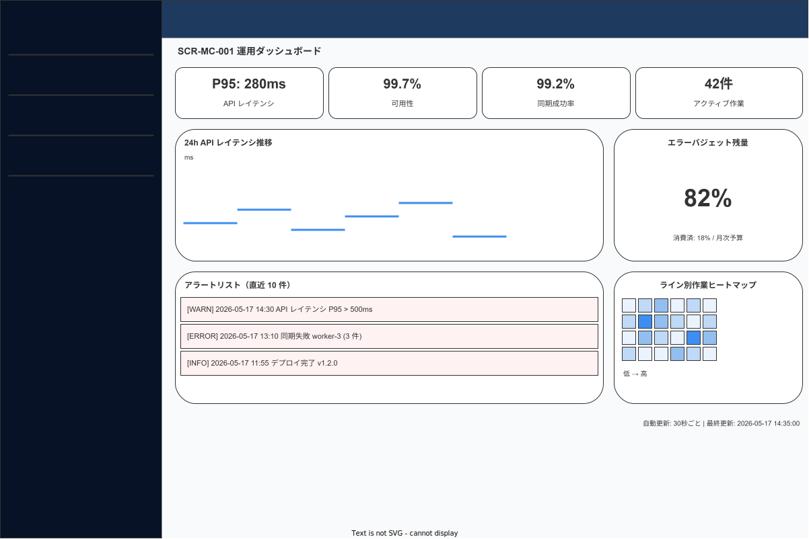
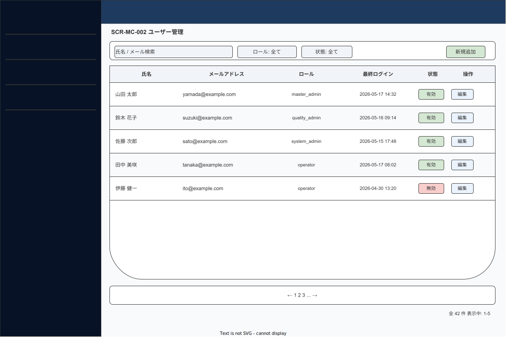
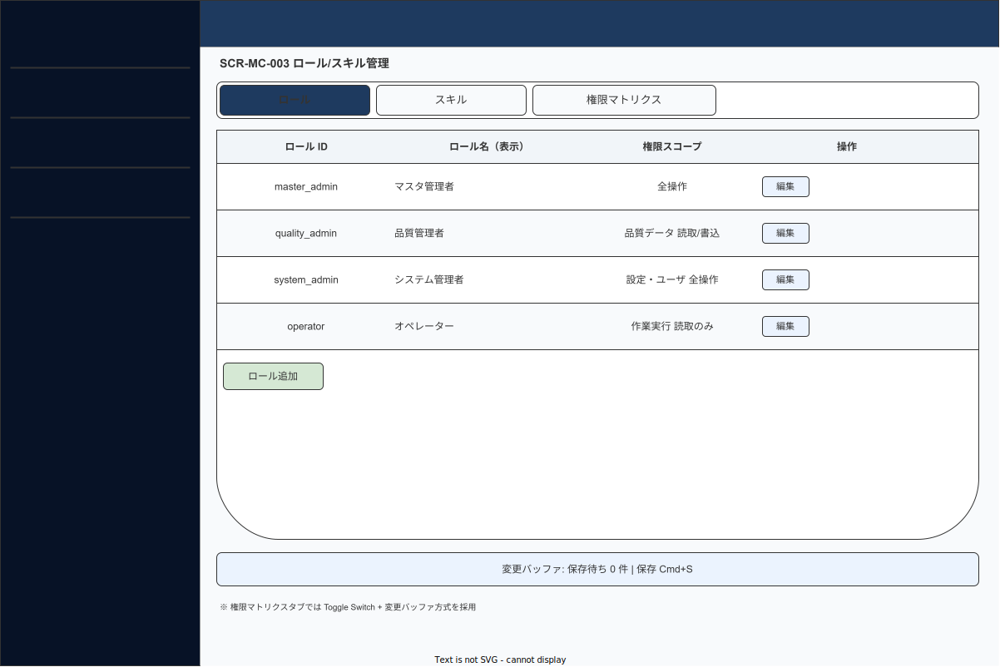
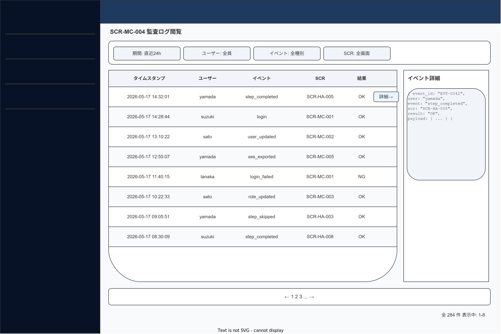
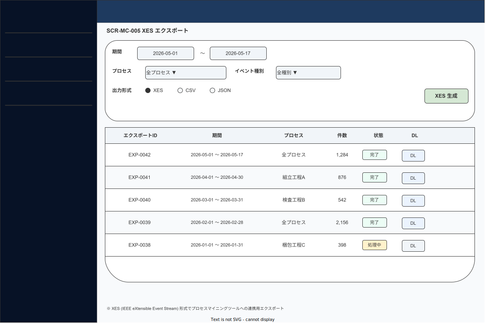
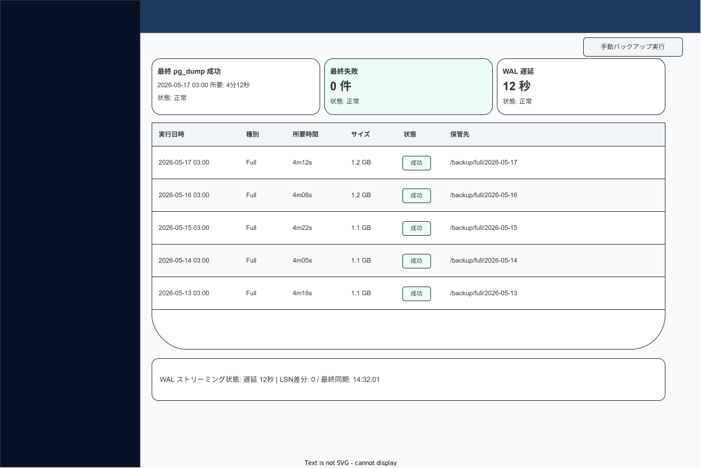
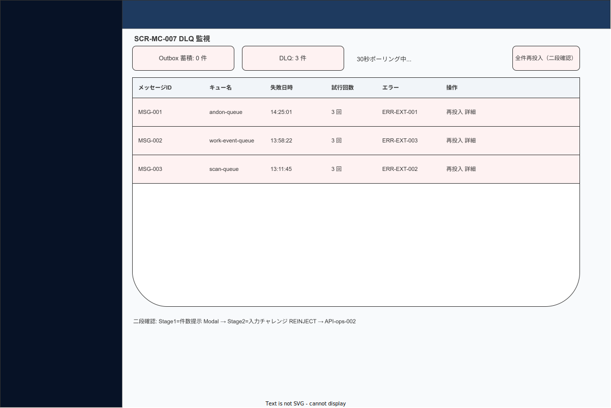
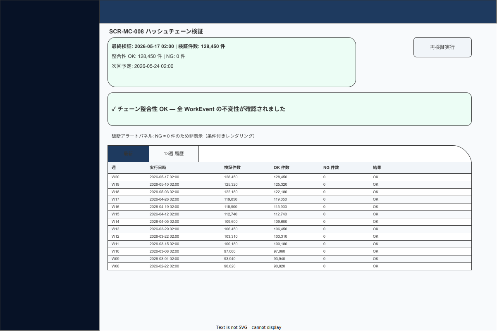
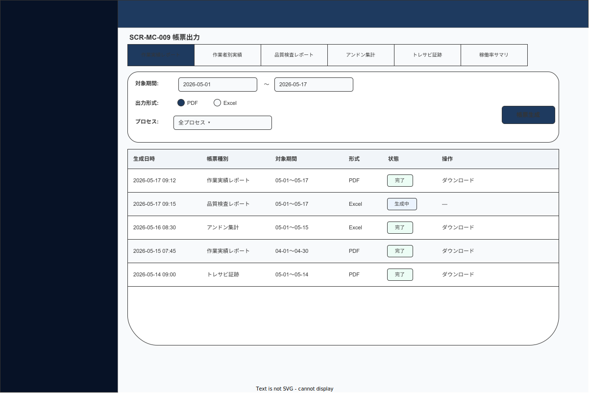

# 09 ワイヤーフレーム（管理コンソール・9 画面分）

本章の責務は、管理コンソール（SCR-MC-001〜009）の 9 画面について、コンポーネント配置・レイアウト領域・主要 UI 要素・インタラクションを確定することである。管理コンソールは system_admin・quality_admin ロールが PC ブラウザから操作する React Web アプリである。全画面で共通サイドバー（240px 固定）を採用し、モダン SaaS ダッシュボード形式とする。

> **MC 図面に関する注記**: 本改訂以前、管理コンソールの `img/` 配下のSVG/drawio ファイルは 1 件も存在していなかった（命名規約の齟齬）。本改訂で `fig_des_screen_mc_001〜009.{drawio,svg}` として全 9 画面を**新規作成**する。

---

## 1. 共通レイアウトフレーム（1440×900px 標準）

| 領域 | 幅 / 高さ | 備考 |
|---|---|---|
| **サイドバー（左固定）** | **240px × 100vh** | `brand.primary.900` 背景。ロゴ + メニュー + ユーザーセクション |
| **メインコンテンツ** | **1200px × flex** | サイドバー右側全体。内側 `padding: 24px` |
| メイン内ページヘッダー | 56px | タイトル `text.h1` + パンくず + アクションボタン群（右）|
| メイン内コンテンツ | flex（残余）| 画面固有のコンテンツ |

ブレークポイント: `≥1440px / 1280px / 1024px`。1024px 未満は非対応画面を表示。

**サイドバー仕様**:
- 背景: `brand.primary.900`（`#071226`）
- ロゴ: WorkNav ロゴタイプ（white）+ アプリ識別バッジ「管理コンソール」
- アクティブ項目: 左 3px `brand.accent.500` ボーダー + `brand.primary.800` bg（12% 明るく）
- ホバー項目: `brand.primary.800` bg（フェード 120ms）
- メニューアイコン: Lucide icon.md（white 70%）
- メニューテキスト: `text.body` 14pt（white 90%）
- 折りたたみ: なし（管理操作の可視性最優先）
- ユーザーセクション（下端固定）: アバター + 氏名/ロール + `LogOut` ghost ボタン

**メニュー項目（RBAC 非対象者には非表示）**:

| 順序 | ラベル | SCR | ロール |
|---|---|---|---|
| 1 | ダッシュボード | SCR-MC-001 | system_admin / executive |
| 2 | ユーザー管理 | SCR-MC-002 | system_admin |
| 3 | ロール / スキル管理 | SCR-MC-003 | system_admin |
| 4 | 監査ログ | SCR-MC-004 | quality_admin / system_admin |
| 5 | XES エクスポート | SCR-MC-005 | quality_admin / system_admin |
| 6 | バックアップ状況 | SCR-MC-006 | system_admin |
| 7 | DLQ 監視 | SCR-MC-007 | system_admin |
| 8 | ハッシュチェーン検証 | SCR-MC-008 | quality_admin / system_admin |
| 9 | 帳票出力 | SCR-MC-009 | quality_admin / system_admin |

**共通インタラクション制約**:
- 全件再投入など危険操作: 二段確認 Modal + 入力チャレンジ
- エラー: `FRG-017 Snackbar danger`（5 秒）+ ERR-CODE
- 空状態: `CMP-CMN-001 EmptyState` 統一

---

## 2. 各画面ワイヤーフレーム詳細

### SCR-MC-001 運用ダッシュボード（★ハイファイ詳細）

**図 1: MC-001 運用ダッシュボード画面ワイヤーフレーム**

> 原本: [`img/fig_des_screen_mc_001.drawio`](img/fig_des_screen_mc_001.drawio)

**① 領域定義（12 カラムグリッド）**

| 行 | 高さ | 内容 |
|---|---|---|
| ページヘッダー | 56px | 「運用ダッシュボード」`text.h1` / 右: 「プリセット切替」`FRG-035 SegmentedControl` |
| Row 1: KPI カード | 128px | 4 枚 × 3 カラム = 各カード 幅: `(1200-72)/4=282px` |
| Row 2: チャートエリア | 280px | 左 8 カラム: 時系列ラインチャート（24h）/ 右 4 カラム: エラーバジェット ドーナツ |
| Row 3: アラート & ヒートマップ | 220px | 左 8 カラム: AlertList / 右 4 カラム: 時間 × ライン ヒートマップ |

**② コンポーネント（サイズ・トークン詳細）**

| CMP-ID | 物理名 | サイズ (px) | 背景 / トークン | 状態 |
|---|---|---|---|---|
| FRG-019 | KPI カード × 4 | 282 × 128 | `surface.raised` / `shadow.1` / `radius.md` | normal / warning / critical |
| — | KPI 左境界線 | 4 × 88（カード内）| `state.success.500` / `state.warning.500` / `state.danger.500` | 状態依存 |
| — | KPI 数値 | `text.display.xl` 40px | `text.primary` / `font-variant-numeric: tabular-nums` | — |
| — | KPI ラベル | `text.caption` 12px | `text.secondary` | — |
| FRG-034 | Sparkline（KPI カード内）| 120 × 32 | `brand.accent.500` 1.5px 線 | — |
| CMP-MC-001 | SliGauge（チャート右側）| 240 × 240 | 達成: `state.success.500` / 警告: `state.warning.500` / 未達: `state.danger.500` | 各状態 |
| — | 時系列ラインチャート | 768 × 240 | svg ネイティブ。軸: `text.caption` / 線: `brand.accent.500` 1.5px / area: `brand.accent.500` 8%透明 | — |
| — | AlertList | 768 × 176 | 各行 40px / 優先度左境界線 | — |
| — | ヒートマップ（時間×ライン）| 380 × 176 | `surface.subtle` → `brand.accent.500` 5段グラデ | — |

**③ インタラクション**

| トリガー | アクション | フィードバック | TRN |
|---|---|---|---|
| KPI カードホバー | ツールチップ: 詳細値と目標値 | `FRG-018 Tooltip dark` | — |
| AlertList 行クリック | アラート詳細 Modal | `FRG-014 Modal md` | — |
| 時系列チャートホバー | クロスヘア + 値トールチップ | — | — |
| プリセット切替（Operations/Quality/Reliability）| KPI カード・チャート内容を切替 | フェード 160ms | — |

**④ 設計判断**

- 旧設計「縦 3 ブロック単純積み（SliGauge × 3 + ErrorBudgetBar + AlertList）」を 12 カラムグリッドに再構成: KPI カード 4 枚（左境界線 + Sparkline 付き）・時系列チャート・ドーナツ・ヒートマップで「数字と傾向と分布」を 1 画面で把握できる。
- SliGauge は旧来の「円弧ゲージ」から「数字大 + 細プログレスバー」に変更: drawio での正確な描画が容易になり、数値の読み取り速度も向上。
- KPI 項目に「アクティブ作業数」を追加検討（要件定義と整合確認後に採番）。
- ウィジェットプリセット 3 種（Operations / Quality / Reliability）: ユーザー別カスタマイズは保留、プリセット切替で十分な柔軟性。

---

### SCR-MC-002 ユーザー管理

**図 2: MC-002 ユーザー管理画面ワイヤーフレーム**

> 原本: [`img/fig_des_screen_mc_002.drawio`](img/fig_des_screen_mc_002.drawio)

**① 領域定義**

| 領域 | 高さ | 内容 |
|---|---|---|
| ページヘッダー | 56px | 「ユーザー管理」/ 右: 「新規ユーザー追加」primary |
| フィルタバー（Sticky）| 48px | 氏名/メール Input + ロール Select + 状態 Select |
| ユーザー一覧テーブル | flex | `FRG-033 DataTable` / 1 行 48px |
| ページネーション | 44px | `FRG-022` 20 件/ページ |

**② コンポーネント**

| CMP-ID | 物理名 | サイズ | 状態 |
|---|---|---|---|
| FRG-003 | Input（氏名/メール検索）| 280 × 36 | default / focus |
| FRG-005 | Select（ロール）| 160 × 36 | default / open |
| FRG-005 | Select（状態）| 120 × 36 | default / open |
| FRG-033 | DataTable | flex | default / loading / empty |
| FRG-001 | Button primary（新規追加）| auto × 36 | default |

**③ インタラクション**

| トリガー | アクション | フィードバック | TRN |
|---|---|---|---|
| 「新規追加」クリック | ユーザー作成 Modal | `FRG-014 Modal md` | — |
| 行「編集」クリック | ユーザー編集 Modal | `FRG-014 Modal md` | — |
| 行「無効化」クリック | 確認 Modal | `FRG-014 Modal destructive` → API-user-002 | — |
| フィルタ変更 | debounce 300ms でテーブル更新 | — | — |

**④ 設計判断** — フィルタバーを Sticky（ページヘッダー直下）化し、スクロール中でも絞り込み変更可能。

---

### SCR-MC-003 ロール / スキル管理（★ハイファイ詳細）

**図 3: MC-003 ロール / スキル管理画面ワイヤーフレーム**

> 原本: [`img/fig_des_screen_mc_003.drawio`](img/fig_des_screen_mc_003.drawio)

**① 領域定義（タブ切替構成）**

| 領域 | 高さ | 内容 |
|---|---|---|
| ページヘッダー | 56px | 「ロール / スキル管理」/ 右: 「保存」primary（変更バッファあり時に活性化）|
| 変更バッファバナー（条件付き）| 40px | 「保存待ち N 件」`FRG-031 Banner info` + Cmd+S ヒント |
| タブナビ | 44px | `FRG-010 Tabs underline`（ロール / スキル / 権限マトリクス）|
| タブコンテンツ | flex | 選択タブに対応するコンテンツ |

**タブ別コンテンツ**:

| タブ | コンテンツ | 幅 |
|---|---|---|
| ロール | ロール一覧テーブル（名称/説明/ユーザー数/操作）| 100% |
| スキル | スキル一覧テーブル（名称/カテゴリ/有効期限設定/操作）| 100% |
| 権限マトリクス | 行: ロール × 列: 機能権限。Toggle Switch + アイコン | 100%（水平スクロール可）|

**② コンポーネント（権限マトリクスタブ）**

| CMP-ID | 物理名 | サイズ | 特記事項 |
|---|---|---|---|
| FRG-033 | DataTable（マトリクス）| 100% × flex | Sticky 行ヘッダー（権限名）+ Sticky 列ヘッダー（ロール名）|
| FRG-009 | Switch（権限トグル）| 40 × 24 | 変更時は変更バッファに蓄積（即時保存なし）|
| FRG-010 | Tabs | 1200 × 44 | underline variant |
| FRG-001 | Button primary（保存）| auto × 36 | disabled（変更 0 件）→ active |

**③ インタラクション**

| トリガー | アクション | フィードバック | TRN |
|---|---|---|---|
| Switch トグル | 変更バッファに追加 | バッファバナー「保存待ち N 件」| — |
| 「保存」クリック（バッファあり）| API-role-001 + API-skill-001 | loading → Toast success | — |
| タブ切替（未保存変更あり）| 確認 Modal「変更を保存しますか？」| `FRG-014 Modal` | — |

**④ 設計判断**

- 旧設計「60%/40% 非対称 2 カラム（ロール左・スキル右）」を廃止。両者は独立した管理対象なのに 1 画面に同居させると「押し込み感」が生じていた。**タブ切替**にすることで各管理機能が全幅を活用できる。
- 権限マトリクスの「チェックボックスのみ」を「Toggle Switch + アイコン」に変更: 現在の状態が直感的に分かりやすく、変更バッファ方式で「変更 → 保存」の 2 段フローを維持。
- 変更バッファバナーを Header 直下の Sticky 位置に配置し、スクロールしても「未保存あり」を常に視認可能。

---

### SCR-MC-004 監査ログ閲覧（★ハイファイ詳細）

**図 4: MC-004 監査ログ閲覧画面ワイヤーフレーム**

> 原本: [`img/fig_des_screen_mc_004.drawio`](img/fig_des_screen_mc_004.drawio)

**① 領域定義**

| 領域 | 高さ | 内容 |
|---|---|---|
| ページヘッダー | 56px | 「監査ログ閲覧」/ 右: CSV DL `split-button` + 「XES エクスポートへ」secondary |
| **フィルタバー（Sticky）** | **56px** | `CMP-CMN-003 FilterChipGroup` + 「フィルタを追加」+ 「クリア」|
| ログテーブル | flex | `FRG-033 DataTable` / 1 行 48px / ホバーで「詳細」ピル表示 |
| ページネーション | 44px | `FRG-022` 50 件/ページ |
| 右ドロワー（条件付き）| 480px 幅 | `FRG-015 Drawer right` 行クリック時に展開 |

**② コンポーネント（サイズ・トークン詳細）**

| CMP-ID | 物理名 | サイズ (px) | 背景 / トークン | 状態 |
|---|---|---|---|---|
| CMP-CMN-003 | FilterChipGroup | 全幅 × 40 | 各チップ: `neutral.100` bg / 選択時: `brand.primary.50` + border | 4 フィルタ軸: 期間/ユーザー/イベント種別/SCR-ID |
| FRG-033 | DataTable | flex | 1 行 48px / hover: `neutral.50` bg + 「詳細 →」ピル出現 | default / loading / empty |
| FRG-011 | Badge（イベント種別）| auto × 22 | イベント種別別カラー | 各種 |
| FRG-011 | Badge（整合性）| auto × 22 | OK: `state.success.50` / NG: `state.danger.50` | OK / NG |
| FRG-015 | Drawer right | 480 × 100vh | `surface.raised` / `shadow.4` / `radius.xl` 左端 | hidden / open |
| — | Drawer 内: ペイロード JSON | flex | `surface.sunken` / `font.mono` | — |

**③ インタラクション**

| トリガー | アクション | フィードバック | TRN |
|---|---|---|---|
| フィルタチップ変更 | debounce 300ms でテーブル再取得 | テーブルローディング | — |
| 行ホバー | 「詳細 →」ピル出現 | — | — |
| 行クリック | 右ドロワー開く | `FRG-015` スライドイン 320ms / イベント詳細・ペイロード JSON・整合性 | — |
| CSV DL クリック | 現フィルタで最大 10,000 件 CSV | 非同期 DL 開始 Toast | — |
| 「XES エクスポートへ」クリック | SCR-MC-005 へ | TRN-045 | TRN-045 |

**④ 設計判断**

- フィルタバーを「入力フォーム 4 個横並び」から `CMP-CMN-003 FilterChipGroup` の Sticky バーに変更: スクロール中もフィルタ変更可能。チップ形式で現在の絞り込み条件が一覧可能。
- 行詳細を Modal から **右ドロワー 480px** に変更: テーブルを見ながら詳細を確認できる（テーブルが完全に隠れない）。大きなペイロード JSON もドロワー内 `font.mono` で読みやすく展開。
- CSV DL は `split-button`（`FRG-001 primary` + `FRG-029 DropdownMenu`）にして「現在のフィルタ条件でダウンロード」と「フル期間でダウンロード」を選択可能。

---

### SCR-MC-005 XES エクスポート

**図 5: MC-005 XES エクスポート画面ワイヤーフレーム**

> 原本: [`img/fig_des_screen_mc_005.drawio`](img/fig_des_screen_mc_005.drawio)

**① 領域定義**

| 領域 | 高さ | 内容 |
|---|---|---|
| ページヘッダー | 56px | 「XES エクスポート」/ 右: 「XES 生成」primary |
| 条件入力フォーム | 200px | `FRG-040 Form`: 期間 DatePicker × 2 + プロセス Combobox + イベント種別 CheckboxGroup + 出力形式 Radio |
| 履歴タイムライン | flex | `FRG-033 DataTable` 直近 20 件 / 1 行 48px |

**② コンポーネント** — DatePicker × 2 / Combobox / CheckboxGroup / Radio / DataTable

**③ インタラクション** — 「XES 生成」: API-reports-002 → 非同期 → 履歴に「生成中」行追加 → polling 30 秒 → 完了で DL ボタン出現。

**④ 設計判断** — MC-005 と MC-009 は「条件フォーム + 履歴 + DL」の同型構造。将来的な統合検討あり（現時点では別画面維持）。

---

### SCR-MC-006 バックアップ状況

**図 6: MC-006 バックアップ状況画面ワイヤーフレーム**

> 原本: [`img/fig_des_screen_mc_006.drawio`](img/fig_des_screen_mc_006.drawio)

**① 領域定義**

| 領域 | 高さ | 内容 |
|---|---|---|
| ページヘッダー | 56px | 「バックアップ状況」/ 右: 「手動バックアップ」secondary |
| サマリカード行 | 104px | `FRG-019 Card` × 3（最終成功 / 最終失敗 / WAL 遅延）|
| バックアップ履歴テーブル | flex | `FRG-033 DataTable` 直近 30 件 |
| WAL パネル | 80px | ストリーミング状態 + 「更新」ghost ボタン |

**② コンポーネント** — Card × 3 / DataTable / Button

**③ インタラクション** — 履歴行クリック: `FRG-014 Modal`（ログ全文表示）。「手動バックアップ」: 確認 Modal → API-backup-001。

**④ 設計判断** — サマリカード 3 枚を横並びにして一目で全状態を把握可能。WAL パネルを最下部に配置しページスクロールで確認。

---

### SCR-MC-007 DLQ 監視

**図 7: MC-007 DLQ 監視画面ワイヤーフレーム**

> 原本: [`img/fig_des_screen_mc_007.drawio`](img/fig_des_screen_mc_007.drawio)

**① 領域定義**

| 領域 | 高さ | 内容 |
|---|---|---|
| ページヘッダー | 56px | 「DLQ 監視」/ 右: **「全件再投入」`FRG-001 destructive`**（30 秒ポーリングバッジ付き）|
| サマリバッジ行 | 56px | Outbox 蓄積件数 + DLQ 件数 の `FRG-011 Badge` 横並び |
| DLQ テーブル | flex | `CMP-MC-002 DlqMonitorTable` |
| ページネーション | 44px | — |

**② コンポーネント**

| CMP-ID | 物理名 | サイズ | 状態 |
|---|---|---|---|
| FRG-011 | Badge（件数）| auto × 24 | normal / warning（>0）|
| CMP-MC-002 | DlqMonitorTable | flex | idle / polling |
| FRG-001 | Button destructive（全件再投入）| auto × 36 | default |

**③ インタラクション**

| トリガー | アクション | フィードバック | TRN |
|---|---|---|---|
| 行「再投入」クリック | 確認 Modal（1 件）| `FRG-014 Modal warning`「重複処理が発生する可能性があります。再投入しますか？」| — |
| 「全件再投入」クリック | **二段確認 Modal** | Stage 1: `FRG-014 Modal destructive`（影響件数提示）→ Stage 2: 入力チャレンジ「REINJECT」タイプ入力 → API-ops-002 | — |
| 行「詳細」クリック | ペイロード JSON Modal | `FRG-014 Modal md` / `font.mono` | — |
| テーブル自動更新 | 30 秒ポーリング | サマリバッジ + テーブル静かに更新 | — |

**④ 設計判断**

- 「全件再投入」を二段確認 + 入力チャレンジ（"REINJECT" とタイプ）に格上げ: 旧設計「右上に常駐する確認ダイアログだけ」では危険操作への防護が弱かった。入力チャレンジにより誤クリックを物理的に防ぐ。
- ボタンを `state.destructive.500` に変更（`state.danger` との分離）。

---

### SCR-MC-008 ハッシュチェーン検証

**図 8: MC-008 ハッシュチェーン検証画面ワイヤーフレーム**

> 原本: [`img/fig_des_screen_mc_008.drawio`](img/fig_des_screen_mc_008.drawio)

**① 領域定義**

| 領域 | 高さ | 内容 |
|---|---|---|
| ページヘッダー | 56px | 「ハッシュチェーン検証」/ 右: 「再検証実行」secondary |
| 結果サマリカード | 128px | `CMP-MC-003 HashChainVerifyResult` + 次回予定日時 |
| 整合性ステータス | 72px | アイコン大 (`icon.2xl`) + テキスト「整合性 OK / 破断検出」|
| 破断アラートパネル（条件付き）| flex（NG 時のみ表示）| `state.danger.50` bg / `AlertTriangle` icon / 破断イベント ID リスト |
| 週次履歴タブ | 44px + flex | `FRG-010 Tabs`（最新 / 13 週履歴）|

**② コンポーネント**

| CMP-ID | 物理名 | サイズ | 状態 |
|---|---|---|---|
| CMP-MC-003 | HashChainVerifyResult | 100% × 128 | ok / broken |
| FRG-010 | Tabs（最新/履歴）| 100% × 44 | — |
| FRG-033 | DataTable（履歴）| flex | — |
| FRG-001 | Button secondary（再検証）| auto × 36 | default / loading |

**③ インタラクション** — 「再検証」: 確認 Modal → API-system-001 → loading → 結果更新。破断 ID クリック: SCR-MC-004 相当の詳細 Modal。

**④ 設計判断** — 破断アラートパネルは NG 件数 1 以上時のみ DOM に追加（条件付きレンダリング）。色 + `AlertTriangle` アイコン + 太字テキスト「破断検出」の 3 点で色覚多様性対応。

---

### SCR-MC-009 帳票出力

**図 9: MC-009 帳票出力画面ワイヤーフレーム**

> 原本: [`img/fig_des_screen_mc_009.drawio`](img/fig_des_screen_mc_009.drawio)

**① 領域定義**

| 領域 | 高さ | 内容 |
|---|---|---|
| ページヘッダー | 56px | 「帳票出力」/ 右: 「帳票生成」primary |
| 帳票種別タブ | 44px | `FRG-010 Tabs` RP-001〜006（6 タブ）|
| 共通パラメータフォーム | 144px | 期間 DatePicker × 2 + 出力形式 Radio |
| 帳票固有パラメータ | 条件付き（0〜80px）| 種別別フォーム（プロセス選択等）|
| 生成済み DL リスト | flex | `FRG-033 DataTable` 直近 20 件 |

**② コンポーネント** — FRG-010 Tabs / FRG-038 DatePicker × 2 / FRG-008 Radio / FRG-033 DataTable / FRG-001 primary（生成）

**③ インタラクション** — 「帳票生成」: API-reports-001 → 非同期 → リストに「生成中」行 → polling → 完了で DL ボタン出現。ダウンロード: ブラウザ DL 開始。削除: 確認 Modal → ファイル削除。

**④ 設計判断** — 帳票種別タブを `FRG-010 Tabs underline`（6 タブ）で管理。サイドバー縦配置オプションも将来的に検討可能なように `data-tab-variant` 属性で切替可能にする（実装は詳細設計で確定）。

---

**本節で確定した方針**

- **SCR-MC-001〜009 の全 9 画面について、高さ比率（%）を廃止し 絶対 px + flex の 4 表テンプレートに移行した。**
- **共通フレーム（サイドバー 240px `brand.primary.900` / メイン padding 24px）を確定し、サイドバーのアクティブ項目を左 3px ボーダー + bg で明示化した。**
- **図ファイル命名を `fig_des_wire_mc_*` から `fig_des_screen_mc_*` に統一し、全 9 画面分を新規作成対象として確定した。**
- **MC-001 を KPI カードグリッド + 時系列チャート + ドーナツ + ヒートマップの 12 カラムグリッドに再構成し、「SaaS として地味」という問題を解消した。**
- **MC-003 を 60/40 非対称 2 カラムからタブ切替（ロール / スキル / 権限マトリクス）に変更し、各管理機能に全幅を確保した。権限マトリクスを Toggle Switch + 変更バッファ方式に変更した。**
- **MC-004 のフィルタバーを Sticky FilterChipGroup 化し、行詳細を Modal から右ドロワー（480px）に変更した。**
- **MC-007 の「全件再投入」を二段確認 + 入力チャレンジ（"REINJECT"）に強化した。**
- **color.{primary/success/warning/danger} を新トークン体系に全面移行した。**

---

## 参照業界分析

### 必須

- [`90_業界分析/18_現場HCIと作業者インターフェース.md`](../../90_業界分析/18_現場HCIと作業者インターフェース.md)
- [`05A_ブランドアイデンティティとデザイン原則.md`](./05A_ブランドアイデンティティとデザイン原則.md)
- [`05_共通UIコンポーネントとデザインシステム.md`](./05_共通UIコンポーネントとデザインシステム.md)

### 関連

- [`90_業界分析/06_品質管理とトレーサビリティ.md`](../../90_業界分析/06_品質管理とトレーサビリティ.md)
