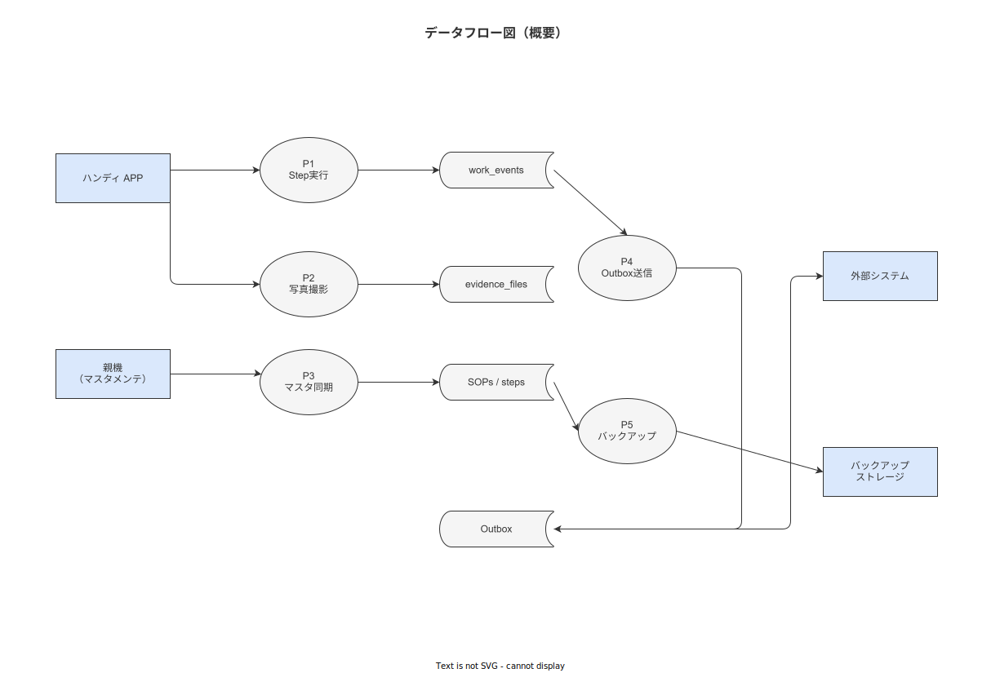

# 08 データフロー図（DFD）

本章の責務は、システム全体のデータフロー（端末 → Outbox → PostgreSQL → NAS・親機 の主要パス）を確定することである。DFD は IPA 2.3「配置設計」タスクのデータ観点での可視化であり、`01_システム方式設計/03_配置設計.md` のインフラ観点と補完関係にある。

**図 1: データフロー全体図（Level 0 DFD）**



> 原本: [`img/fig_des_db_dfd_overall.drawio`](img/fig_des_db_dfd_overall.drawio)

---

## 1. データフロー全体（Level 0 DFD）

主要なデータフローを 5 経路に整理する。

```
[端末（Android/iOS/Windows）]
         │
         │ 1. 作業記録フロー（TBL-001 work_events）
         │    端末 SQLite → Outbox（端末側 TBL-003 相当）→ バックエンド API → PostgreSQL
         │
         │ 2. 証拠ファイルフロー（TBL-009 evidence_files）
         │    端末カメラ → SHA-256 計算 → NAS（バイナリ）＆ PostgreSQL（メタデータ）
         │
         │ 3. マスタ同期フロー（端末 → バックエンド）
         │    バックエンド PostgreSQL → 差分抽出 → 端末 SQLite キャッシュ
         │
[バックエンド（Rust/axum）]
         │
         │ 4. 実績送信フロー（子機モード）
         │    PostgreSQL → Outbox → 親機 API（IF-002）
         │
         │ 5. バックアップフロー
         │    PostgreSQL WAL → NAS（PITR）・pg_dump → オフサイト NAS
         ↓
[親機（ERP/MES 等）]
```

---

## 2. データフロー詳細

### 2-1. 作業記録フロー（オンライン時）

```
端末操作（Step 完了等）
  → [端末] WorkEvent 生成（UUID v7・timestamp_client 記録）
  → [端末 SQLite] OutboxEvent INSERT（status = PENDING）
  → [BAT-002 Outbox Consumer] ポーリング検出
  → [バックエンド API] POST /api/v1/work-executions/{id}/events（API-step-events-001）
  → [バックエンド] Idempotency Key 検証（TBL-035）
  → [バックエンド] timestamp_server 付与
  → [PostgreSQL TBL-001] work_events INSERT
  → [PostgreSQL TBL-001] ハッシュチェーン更新（prev_hash 計算）
  → [バックエンド] 200 OK レスポンス
  → [端末 SQLite] OutboxEvent.status → SENT
```

### 2-2. 作業記録フロー（オフライン時）

```
端末操作（Offline モード）
  → [端末 SQLite TBL-001 相当] WorkEvent INSERT（timestamp_client のみ）
  → [端末 SQLite Outbox] OutboxEvent INSERT（status = PENDING, is_offline = TRUE）
  → ネットワーク回復後、BAT-002 が PENDING を検出し §2-1 フローへ
  ※ timestamp_server はサーバー到着時刻（オフライン記録の Contemporaneous 補足）
```

### 2-3. 証拠ファイルフロー

```
端末カメラ撮影
  → [端末] SHA-256 計算（file_hash）
  → [端末] Exif 削除
  → [バックエンド API] POST /api/v1/evidences（multipart, API-evidences-001）
  → [バックエンド] NAS への書き込み（/files/{uuid}.{ext}）
  → [PostgreSQL TBL-009] evidence_files INSERT（file_path + file_hash のみ）
  → バイナリファイルは PostgreSQL に格納しない（NAS 専用）
```

### 2-4. マスタ同期フロー（子機初回・差分）

```
端末起動または定期同期（CFG-007: 60 分間隔）
  → [端末] GET /api/v1/sync/master?as_of={last_sync_ts}（API-sync-001）
  → [バックエンド] master_versions テーブルから差分抽出
  → [バックエンド] JSON パッケージ（圧縮）を返却
  → [端末 SQLite] マスタキャッシュ更新（sops/steps/processes 等）
  → [端末] last_sync_at 更新（TBL-034 相当）
```

### 2-5. 実績送信フロー（子機モード・IF-002）

```
BAT-002（Outbox Consumer）の定期実行
  → [PostgreSQL TBL-003] PENDING 行を SENDING に UPDATE
  → [バックエンド] POST {親機エンドポイント}/inbound（HMAC-SHA256 署名付き）
  → [親機] 受信確認（HTTP 200）
  → [バックエンド] TBL-003 status → SENT、sent_at 記録
  → 失敗時: retry_count++ / 3 回失敗で status → DLQ
  → DLQ: BAT-008（webhook_retry_scheduler）が再投入試行
```

---

## 3. データ滞留点と滞留時間上限

| 滞留点 | 最大滞留時間 | 根拠 NFR |
|---|---|---|
| 端末 SQLite Outbox | 無制限（ネットワーク回復まで）| Offline-First 原則（P1）|
| TBL-003 PENDING | CFG-003（バックオフ最大: 60 分）× CFG-002（最大 5 回）| IF-002 再試行ポリシー |
| TBL-003 DLQ | 1 年（NFR-OPS-035 の DLQ 保管）| 手動介入まで |
| NAS 未同期（バックアップ）| 5 分（PITR: WAL 5 分間隔）| NFR-AVL-015（RPO 15 分以内の NAS 部分）|

---

**本節で確定した方針**
- **データフロー 5 経路（作業記録・証拠ファイル・マスタ同期・実績送信・バックアップ）を DFD Level 0 として確定し、各経路のバックエンド API・テーブル・バッチを明示した。**
- **証拠ファイル（バイナリ）は PostgreSQL に格納せず NAS 専用とし、SHA-256 とファイルパスのみを TBL-009 に保存する設計を確定した。**
- **オフライン記録時の二重タイムスタンプ（端末時刻 = timestamp_client・サーバー受信 = timestamp_server）を確定し、ALCOA+ Contemporaneous を技術的に担保する。**

---

## 参照業界分析

### 必須
- [`90_業界分析/27_オフライン同期とデータ整合性.md`](../../90_業界分析/27_オフライン同期とデータ整合性.md)

### 関連
- [`90_業界分析/21_作業ログ分析とプロセスマイニング.md`](../../90_業界分析/21_作業ログ分析とプロセスマイニング.md)
- [`90_業界分析/06_品質管理とトレーサビリティ.md`](../../90_業界分析/06_品質管理とトレーサビリティ.md)
